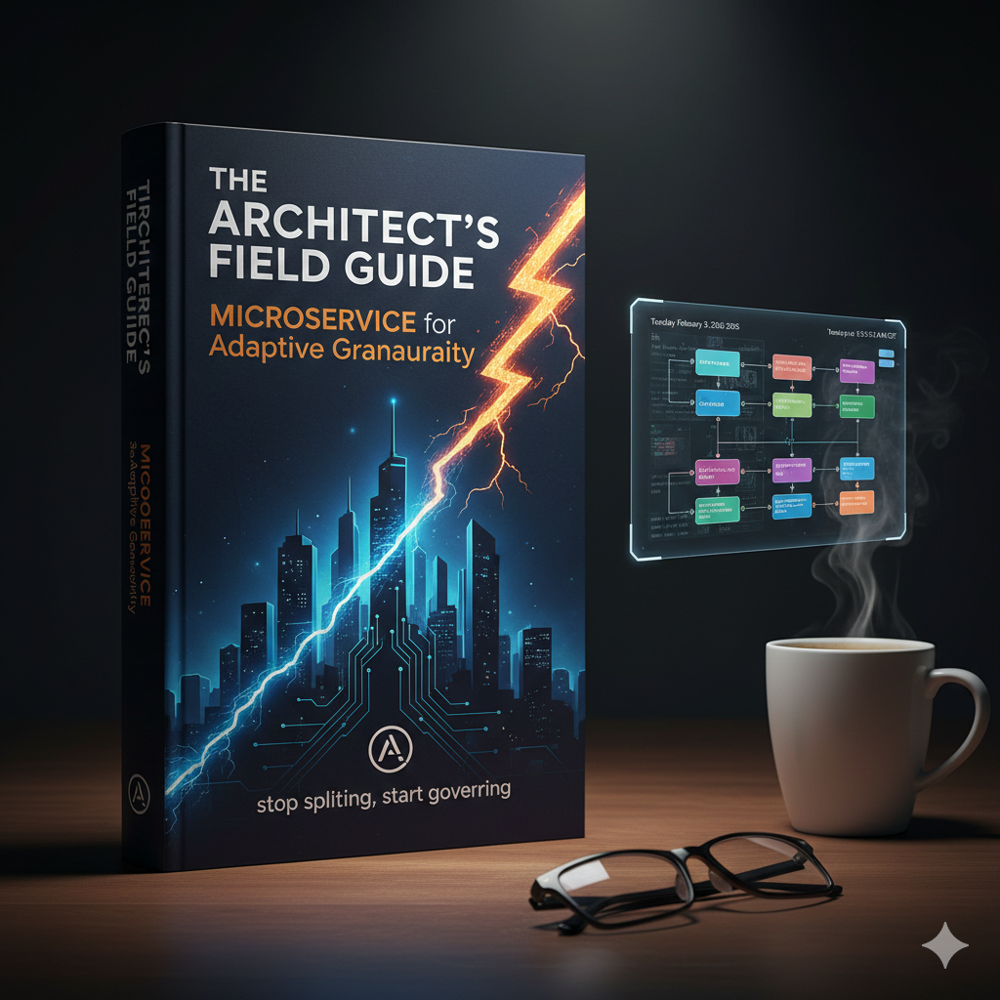
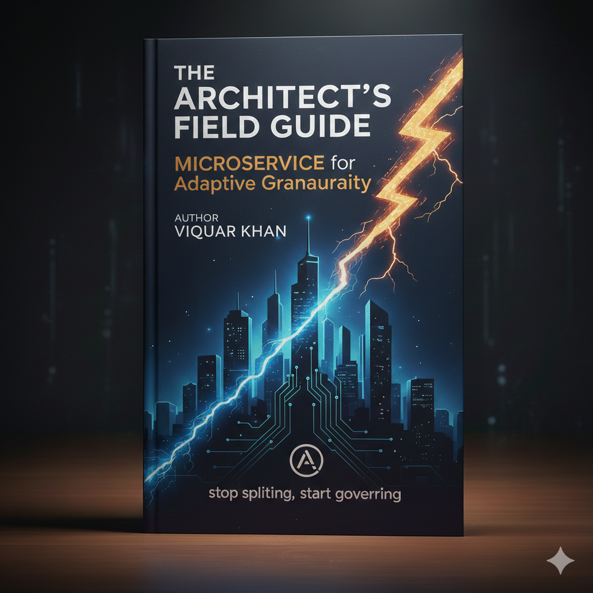

# The Complete Microservices Architecture Guide

<div align="center">
  
  
  **Microservices Recipes: The Senior Architect's Field Guide**  
  *By Viquar Khan*
</div>

---

## Introducing the VaquarKhan Protocol™

### A Mathematically Rigorous Framework for Architectural Governance

The **VaquarKhan Protocol** represents the first mathematically rigorous framework for microservices architectural decision-making. Introduced throughout this book and formalized in Chapter 8, it provides quantitative guidance for the most critical architectural questions.

### The VaquarKhan Index (RVx)

```
RVx = (Ê^β × Ŝ) / (L̂^α + ε)
```

**Where:**
- **Ê** (Kinetic Efficiency): Ratio of useful computation to total transaction time
- **L̂** (Cognitive Load): Normalized complexity from static analysis
- **Ŝ** (Semantic Distinctness): Independence measured via temporal coupling
- **α, β**: Tuning parameters (default: α=1.2, β=0.8)
- **ε**: Stability constant (default: 0.1)

### Four Architectural Zones

1. **Zone I - Nano-Swarm** (RVx ≤ 0.3): MERGE - Network tax exceeds value
2. **Zone II - God Services** (L̂ > 0.7): SPLIT - Cognitive overload
3. **Zone III - Distributed Monolith** (Ŝ ≤ 0.4): REFACTOR - Wrong boundaries
4. **Zone IV - VaquarKhan Optimum** (RVx > 0.6): MAINTAIN - Balanced architecture

### Implementation and Measurement

The VaquarKhan Protocol is fully implemented in Chapter 8 with:
- **Measurement protocols** using OpenTelemetry, SonarQube, and Git analysis
- **Python implementation** with complete code examples
- **Organizational calibration guidance** for tuning parameters
- **Integration with observability platforms** (Grafana, DataDog, New Relic)

**Note**: The protocol is theoretically sound but requires empirical validation through pilot studies. Organizations implementing it should calibrate parameters based on their specific context and share results to build collective knowledge.

### Why It Matters

**Before VaquarKhan:**
- Architectural decisions based on intuition
- No quantitative framework for service granularity
- Distributed monoliths discovered only after deployment

**After VaquarKhan:**
- Data-driven architectural governance
- Measurable thresholds for merge/split decisions
- Continuous monitoring of architectural health

---

## What You've Read: The Foundation (Chapters 1-11)

### Part I: The Sociotechnical Substrate (Chapters 1-3)
✅ Organization and architecture alignment, distributed monolith avoidance, Domain-Driven Design

### Part II: The Distributed Data Problem (Chapters 4-7)
✅ Data consistency, Saga pattern, Transactional Outbox, Data Mesh vs. Fabric

### Part III: The Communication Layer (Chapters 8-10)
✅ Protocol selection, eBPF networking, asynchronous messaging with VaquarKhan Protocol

### Part IV: The Khan Pattern™ Deep Dive (Chapter 11)
✅ **NEW!** Origin story, detailed metrics, KM3™ Maturity Model, practical implementation guide

---

## What Awaits: Advanced Chapters (12-20)

### Part V: Resilience Engineering & Advanced Scaling

#### Chapter 12: Cell-Based Architecture
**The AWS Pattern for Infinite Scale**

Learn how Amazon achieves fault isolation at massive scale through cellular architecture. Discover routing cells, data cells, compute cells, and the mathematics of 99.999% availability.

**Key Recipe**: Multi-region cellular architecture with automatic failover using Terraform and AWS CDK.

---

#### Chapter 13: Shuffle Sharding
**The Secret Weapon Against Cascading Failures**

Master the advanced isolation technique that prevents noisy neighbors from destroying your system. Learn shuffle sharding mathematics, implementation strategies, and AWS native solutions.

**Key Recipe**: Implementing shuffle sharding for multi-tenant SaaS with Python and Redis.

---

#### Chapter 14: Chaos Engineering
**Embracing Failure as a Design Principle**

Move beyond hope-driven reliability to engineered resilience. From Netflix's Chaos Monkey to AWS Fault Injection Simulator, learn how to build systems that survive real-world chaos.

**Key Recipe**: Building a chaos engineering pipeline with AWS FIS, Lambda, and EventBridge.

---

#### Chapter 14: Infrastructure as Code (IaC) at Scale
**Managing the Microservice Singularity**

Solve the operational complexity explosion with Terraform at scale, AWS CDK patterns, GitOps, and Policy as Code using OPA and AWS Config.

**Key Recipe**: Self-service platform with Terraform modules, AWS Service Catalog, and internal developer portals.

---

#### Chapter 15: Observability 2.0
**From Telemetry to Understanding**

Transcend traditional monitoring with OpenTelemetry deep dive, distributed tracing at scale, VaquarKhan Index dashboards, and AI-powered anomaly detection.

**Key Recipe**: Complete observability stack with OpenTelemetry, Grafana, Loki, and Tempo on EKS.

---

### Part VI: The AI Frontier (2026 Edition)

#### Chapter 16: Agentic AI Architectures
**Integrating Probabilistic AI into Deterministic Systems**

Navigate the transition from deterministic microservices to probabilistic AI agents. Learn multi-agent orchestration, prompt engineering at scale, and handling AI non-determinism.

**Key Recipe**: Customer service AI agent system with Amazon Bedrock, Lambda, and DynamoDB.

---

#### Chapter 17: RAG at Scale
**From Demo to Distributed System**

Transform toy RAG implementations into production-grade systems. Master vector database selection, chunking strategies, hybrid search, and the complete RAG pipeline.

**Key Recipe**: Production RAG system with Amazon Bedrock Knowledge Bases, OpenSearch, and Lambda.

---

### Part VII: The Migration Playbook

#### Chapter 18: The Modular Monolith
**The Great Consolidation of 2026**

Understand when microservices are the wrong choice. Learn modular monolith patterns, the VaquarKhan decision matrix, and safe consolidation strategies.

**Key Recipe**: Refactoring microservices into a modular monolith using Spring Modulith and Kotlin.

---

#### Chapter 19: The Strangler Fig Pattern
**Incrementally Migrating from Legacy Systems**

Master the only proven pattern for safely migrating monoliths. Learn routing strategies, data migration patterns, and risk management.

**Key Recipe**: Strangler fig migration using AWS App Mesh, Lambda, and DynamoDB Streams.

---

### Part VIII: The Maturity Framework

#### Chapter 20: The Khan Microservices Maturity Model (KM3™)
**Measuring Architectural Evolution**

Assess and improve your microservices maturity with the industry's first quantitative framework. Five maturity levels, assessment dimensions, and improvement roadmaps.

**Key Recipe**: Automated maturity assessment dashboard with CloudWatch metrics and QuickSight.

---

## How to Get the Full Book

<div align="center">
  
</div>

### Free Edition (Chapters 1-10)
Available on GitHub: [github.com/vaquarkhan/microservices-recipes-a-free-gitbook](https://github.com/vaquarkhan/microservices-recipes-a-free-gitbook)

**Includes:**
- Complete VaquarKhan Protocol documentation
- All 10 foundation chapters
- 100+ production-ready code recipes
- 30+ professional diagrams
- Full access to community discussions

### Full Edition (Chapters 1-20)
**Coming Soon - 2026**


**What You Get:**
- All 20 chapters (350+ pages)
- Advanced patterns (Cell-Based Architecture, Shuffle Sharding, Chaos Engineering)
- AI integration patterns (Agentic AI, RAG at Scale)
- Migration playbooks (Modular Monolith, Strangler Fig)
- Khan Microservices Maturity Model (KM3™)
- Exclusive case studies and interviews
- Video tutorials and workshops
- Access to private community forum

---

## Stay Connected

- **LinkedIn**: [linkedin.com/in/vaquar-khan-b695577](https://www.linkedin.com/in/vaquar-khan-b695577/)
- **GitHub**: [github.com/vaquarkhan](https://github.com/vaquarkhan)
- **Free Mentorship**: [adplist.org/mentors/vaquar-khan](https://adplist.org/mentors/vaquar-khan)

---

**Microservices Recipes: The Senior Architect's Field Guide**  
*By Viquar Khan*  
*© 2026 - All Rights Reserved*

<div align="center">
  
  
  ---
  
  **Ready to Master Microservices Architecture?**  
  
  ⭐ Star the repository on GitHub  
  📖 Read the free edition (Chapters 1-10)  
  🚀 Pre-order the full edition (Chapters 1-20)  
  💬 Join the community discussions  
  
  [Get Started Now →](https://github.com/vaquarkhan/microservices-recipes-a-free-gitbook)
</div>