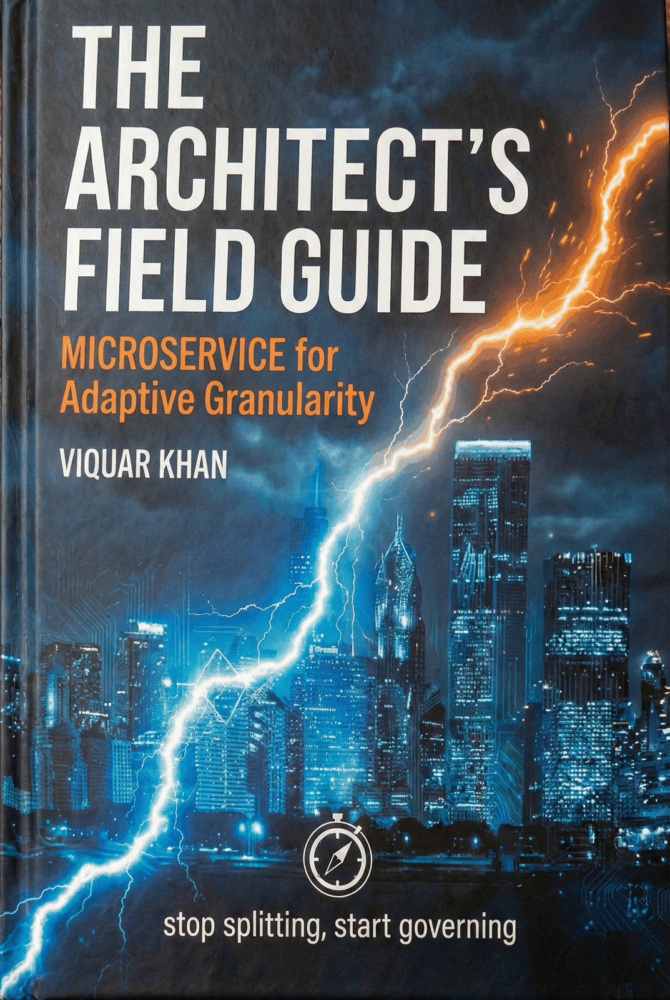

# 📖 Microservices Recipes: The Architect's Field Guide

<div align="center">



**A practical guide to building, scaling, and managing microservices architectures**

As defined by Sam Newman in his foundational text *Building Microservices*, microservices are "small, autonomous services that work together." This definition emphasizes the dual requirements of independence and interoperability.

*Featuring Adaptive Granularity Governance: The Khan Microservice Pattern*

[](https://vaquarkhan.github.io/microservices-recipes-a-free-gitbook/)
[](LICENSE)
[](LICENSING.md)
[](CONTRIBUTING.md)

---

*"Stop splitting, start governing."* - **Adaptive Granularity Governance: The Khan Microservice Pattern**


</div>

## 📋 Table of Contents

### 📚 **Front Matter**
- [📖 **Preface**](PREFACE.md) - The Architect's Mandate
- [👨‍💻 **About the Author**](AUTHOR.md) - Viquar Khan and Adaptive Granularity Governance
- [🎓 **Free Mentorship**](MENTORSHIP.md) - 1:1 Sessions with Viquar Khan
- [⚖️ **Licensing**](LICENSING.md) - MIT for code; CC BY-NC-ND 4.0 for prose and figures
- [🏷️ **Naming**](NAMING.md) - Methodology title and attribution
- [📖 **Citations Guide**](CITATIONS.md) - How to Cite This Work Properly
- [📜 **Copyright Notice**](COPYRIGHT.md) - Copyright and dual license
- [⚖️ **Disclaimer**](DISCLAIMER.md) - Legal notice
- [🤝 **Contributing**](CONTRIBUTING.md) - How to Contribute
- [📜 **Version History**](VERSION-HISTORY.md) - Release lineage
- [📋 **Changelog**](CHANGELOG.md) - 2017 to present change log
- [🎓 **Free Academic Access**](FREE-ACCESS.md) - Academic edition notes
- [📄 **CITATION.cff**](CITATION.cff) - Machine-readable citation metadata

---

### 📖 **Part I: The Sociotechnical Substrate**
*Focus: Aligning organization and architecture to prevent the "Distributed Monolith"*

| Chapter | Title | Description | Read Time |
|---------|-------|-------------|-----------|
| **[1](chapters/01-introduction-to-microservices.md)** | **Earned Boundaries, Not Fashionable Ones** | SOA done right, replaceability over size, and finding seams in Git history | 35 min |
| **[2](chapters/02-design-principles-and-patterns.md)** | **The Distributed Monolith: Diagnosis and First Remedies** | Connascence, Conway's Law, contracts, and the first resilience gate | 40 min |
| **[3](chapters/03-service-communication.md)** | **Decouple the Language Before You Decouple the Code** | Bounded contexts, context maps, Event Storming, and aggregates | 40 min |

---

### 🗄️ **Part II: Data Architecture**
*Focus: Managing data consistency and transactions in distributed systems*

| Chapter | Title | Description | Read Time |
|---------|-------|-------------|-----------|
| **[4](chapters/04-data-management.md)** | **The End of ACID** | Consistency dial, CRDTs, cloud internals, and data ownership | 45 min |
| **[5](chapters/05-deployment-and-operations.md)** | **The Consistency Tax of Spanning Services** | Sagas, compensation, choreography vs orchestration, isolation | 45 min |
| **[6](chapters/06-resilience-and-reliability.md)** | **Close the Dual Write, Then Survive Failure** | Outbox, timeouts, breakers, backpressure, and error budgets | 45 min |
| **[7](chapters/07-security.md)** | **Every Hop Is a Door. Prove Who Is Knocking.** | Zero trust, tokens, secrets, and agent capability limits | 50 min |

---

### 🌐 **Part III: Inter Process Communication**
*Focus: Moving bits between services without creating latency storms*

| Chapter | Title | Description | Read Time |
|---------|-------|-------------|-----------|
| **[8](chapters/08-monitoring-and-observability.md)** | **You Cannot Attach a Debugger. Emit the Evidence First.** | Metrics, structured logs, traces, OpenTelemetry, and burn-rate alerts | 50 min |
| **[9](chapters/09-testing-strategies.md)** | **There Is No Whole System to Test. Test the Agreements.** | Pyramid, contracts, async tests, and testing in production | 50 min |
| **[10](chapters/10-asynchronous-messaging-patterns.md)** | **Publish What Happened. Do Not Wait.** | Backpressure, poison messages, idempotency, and claim check | 50 min |

---

### 🎯 **Part IV: Adaptive Granularity Governance**
*Focus: Quantitative framework for microservices decomposition (The Khan Microservice Pattern)*

| Chapter | Title | Description | Read Time |
|---------|-------|-------------|-----------|
| **[11](chapters/11-khan-pattern-deep-dive.md)** | **A Boundary Earns Its Keep Only When All Three Hold** | Fulcrum, RVx, SCS, and KM3, with honesty tiers | 70 min |

---

### 🧱 **Part V: Resilience Engineering & Advanced Scaling**
*Focus: Blast-radius control and evidence-based failure injection*

| Chapter | Title | Description | Read Time |
|---------|-------|-------------|-----------|
| **[12](chapters/12-shuffle-sharding.md)** | **A Single Bad Shard Should Be a Footnote** | Shuffle sharding inside cells, with measured blast radius | 55 min |
| **[13](chapters/13-chaos-engineering.md)** | **Break It on Purpose. Watch. Then You Know.** | Game days, FIS abort alarms, and metastable retries | 55 min |

---

### 🏗️ **Part VI: The Platform Engineering Shift**
*Focus: Golden paths, policy-as-code, and telemetry economics*

| Chapter | Title | Description | Read Time |
|---------|-------|-------------|-----------|
| **[14](chapters/14-infrastructure-as-code-at-scale.md)** | **The Definition Is the Truth. Reality Is Reconciled Toward It.** | Desired state, locked state, three-layer policy, and version-pinned golden paths | 55 min |
| **[15](chapters/15-observability-2.md)** | **Spend the Budget on Answers. Stay Sighted When It Counts.** | Wide events, tail sampling, eBPF cross-check, and retention tiers | 55 min |

---

### 🤖 **Part VII: The AI Frontier (2026)**
*Focus: Probabilistic components inside deterministic architectures*

| Chapter | Title | Description | Read Time |
|---------|-------|-------------|-----------|
| **[16](chapters/16-agentic-ai-architectures.md)** | **The Model Proposes. The Executor Disposes.** | Planner versus executor, tool gateway, and bounded multi-agent design | 55 min |
| **[17](chapters/17-rag-at-scale.md)** | **Retrieval as a Data-Plane Discipline, Not a Prompt Trick** | ACL prefilter, hybrid retrieval, pinned embeddings, and shadow eval | 55 min |

---

### 🚀 **Part VIII: The Migration Playbook**
*Focus: Monolith-first discipline and incremental replacement*

| Chapter | Title | Description | Read Time |
|---------|-------|-------------|-----------|
| **[18](chapters/18-modular-monolith.md)** | **The Right Number of Services Is Often One.** | Enforced modules, schema-per-module grants, and extraction on evidence | 55 min |
| **[19](chapters/19-strangler-fig-pattern.md)** | **Replace It While It Is Still Running.** | Facade first, data ownership, shadow that does not persist twice | 55 min |

---

### 📈 **Part IX: Organizational Maturity**
*Focus: KM3 operational assessment*

| Chapter | Title | Description | Read Time |
|---------|-------|-------------|-----------|
| **[20](chapters/20-km3-maturity-model.md)** | **Has This Organization Earned the Right to Distribute?** | Evidence-based KM3 assessment, not a badge race | 50 min |

---

### 📐 **Part X: The Science Behind the Metric**
*Focus: Cost, construct validity, and anti-Goodhart discipline*

| Chapter | Title | Description | Read Time |
|---------|-------|-------------|-----------|
| **[21](chapters/21-pricing-the-distributed-monolith.md)** | **Price the Waste. Name the Rest. Do Not Invent a Total.** | Wasted time as an identity, payback on hypothesized savings | 50 min |
| **[22](chapters/22-construct-validity.md)** | **A Formula Confers No Truth. Outcomes Do.** | Construct validity, reliability, and evidence tiers | 50 min |
| **[23](chapters/23-gaming-and-goodhart.md)** | **Never Point the Number at the People.** | Tamper-evidence, named attacks, and no score in reviews | 50 min |

---

### 📚 **Reference Materials**

| Resource | Description |
|----------|-------------|
| **[📖 Glossary](reference/glossary.md)** | Comprehensive definitions of microservices terms |
| **[⚡ Quick Reference](reference/quick-reference.md)** | Handy reference cards for patterns and practices |
| **[📚 Bibliography](reference/bibliography.md)** | Curated list of books, articles, and resources |

---

## 🎯 **What Makes This Book Special**

### **Adaptive Granularity Governance: The Khan Microservice Pattern**

At the heart of this book is **Adaptive Granularity Governance: The Khan Microservice Pattern** (formerly the Adaptive Granularity Strategy): a systematic methodology for determining optimal microservice boundaries. This adaptive framework considers your specific:

**Field basis:** The methodology is an original synthesis by the author, refined through professional practice. Please cite when you reuse it ([CITATIONS.md](CITATIONS.md)).

- **Organizational maturity** and team structure
- **Business domain complexity** and change frequency  
- **Technical constraints** and operational capabilities
- **Evolutionary growth** and learning patterns

> *"The goal is not to build the perfect architecture, but to build an architecture that can evolve toward perfection."* - Viquar Khan

Please cite the method if you reuse it ([CITATIONS.md](CITATIONS.md)).

---

## 🚀 **Quick Start Guide**

### **For Beginners**
1. Start with [**Chapter 1: Earned Boundaries**](chapters/01-introduction-to-microservices.md)
2. Read [**The Preface**](PREFACE.md) to understand the book's philosophy
3. Progress through Parts I → X. All 23 chapters are in this repo.

### **For Experienced Practitioners**
1. Review the [**Table of Contents**](#-table-of-contents) above
2. Jump to specific chapters addressing your current challenges
3. Use [**Quick Reference**](reference/quick-reference.md) for rapid pattern lookup

### **For Architects**
1. Focus on strategic chapters: [Ch 2](chapters/02-design-principles-and-patterns.md), [Ch 3](chapters/03-service-communication.md), [Ch 7](chapters/07-security.md)
2. Study [**Adaptive Granularity Governance: The Khan Microservice Pattern**](AUTHOR.md#adaptive-granularity-governance-the-khan-microservice-pattern) (formerly Adaptive Granularity Strategy)
3. Review [**Complete Book Preview**](BOOK-PREVIEW.md) for advanced topics

---

## 📊 **Book Statistics**

| Metric | Value |
|--------|-------|
| **Total Chapters** | 23 (Parts I–X; all linked in the TOC) |
| **Reading Time** | ~19 hours across the full book |
| **Code Examples** | Recipes in every practitioner chapter |
| **Patterns Covered** | Decomposition, data, resilience, platform, AI, migration |
| **Evidence stance** | Proved / demonstrated / hypothesized — Chapter 11 and 22 |
---

## Topics covered

<details>
<summary><strong>🏗️ Architectural Patterns</strong></summary>

- **Adaptive Granularity Governance: The Khan Microservice Pattern** for adaptive service granularity
- **Distributed Monolith** identification and prevention
- **Domain-Driven Design** for service boundaries
- **Saga Pattern** for distributed transactions
- **Event Sourcing** and **CQRS** patterns
- **API Gateway** and **Service Mesh** architectures

</details>

<details>
<summary><strong>🔧 Technical Implementation</strong></summary>

- **Microservices Communication** (REST, gRPC, GraphQL)
- **Data Management** strategies and consistency patterns
- **Deployment & Operations** with containers and orchestration
- **Monitoring & Observability** with distributed tracing
- **Security** patterns and zero-trust architectures
- **Testing Strategies** for distributed systems

</details>

<details>
<summary><strong>🎯 Real-World Skills</strong></summary>

- **Conway's Law** and organizational design
- **Failure Mode Analysis** and resilience engineering
- **Performance Optimization** and scalability patterns
- **Migration Strategies** from monolith to microservices
- **Team Topologies** and cognitive load management
- **Platform Engineering** and developer experience

</details>

---

## 👨‍💻 **About the Author**

**[Viquar Khan](AUTHOR.md)** is a Senior Data Architect at AWS Professional Services with 20+ years of expertise in distributed systems. Creator of **Adaptive Granularity Governance: The Khan Microservice Pattern**, the **Service Decomposition Workflow**, and the **Microservices Maturity Assessment (KM3)**. Original methodologies by the author; please cite.

### **Credentials**
- 🏆 **JSR 368** Expert Group Member (Java Message Service 2.1)
- 📚 **Author** of "Data Engineering with AWS Cookbook" (Packt, 2026)
- 🌟 **7.5M+** developers reached on [Stack Overflow](https://stackoverflow.com/users/4812170/vaquar-khan)
- 👥 **1,400+** GitHub followers ([@vaquarkhan](https://github.com/vaquarkhan))
- 🔧 **50+** open-source microservices repositories

**Connect:** [ORCID](https://orcid.org/0009-0008-3592-4162) | [LinkedIn](https://www.linkedin.com/in/vaquar-khan-b695577/) | [GitHub](https://github.com/vaquarkhan) | [Amazon Author](https://us.amazon.com/stores/Viquar-Khan/author/B0DMJCG9W6) | [🎓 Free Mentorship](https://adplist.org/mentors/vaquar-khan)

---

## 🌐 **Access This Book**

### **📖 Read Online**
- **GitHub Pages**: [https://vaquarkhan.github.io/microservices-recipes-a-free-gitbook/](https://vaquarkhan.github.io/microservices-recipes-a-free-gitbook/)
- **GitHub Repository**: [https://github.com/vaquarkhan/microservices-recipes-a-free-gitbook](https://github.com/vaquarkhan/microservices-recipes-a-free-gitbook)

### **🎓 Academic Access**
- **Complete 23-Chapter Edition**: [Request Free Access](FREE-ACCESS.md) for students, faculty, and researchers under the academic terms in that page
- **Citation Guide**: [Proper Citation Formats](CITATIONS.md) for academic use
- **Version History**: [Release Lineage](VERSION-HISTORY.md) and evolution

### **💾 Download Options**
- **Clone Repository**: `git clone https://github.com/vaquarkhan/microservices-recipes-a-free-gitbook.git`
- **Download ZIP**: [Latest Release](https://github.com/vaquarkhan/microservices-recipes-a-free-gitbook/archive/main.zip)
- **PDF Version**: Available through [Academic Access Program](FREE-ACCESS.md)

---

## 🤝 **Community & Support**

### **🌟 Support This Open Knowledge Initiative**
If you find this resource valuable, please help me keep it free and accessible:

**⭐ [Star this repository](https://github.com/vaquarkhan/microservices-recipes-a-free-gitbook)** - Help others discover this work  
**🍴 [Fork the project](https://github.com/vaquarkhan/microservices-recipes-a-free-gitbook/fork)** - Build upon these methodologies  
**📖 [Cite properly](CITATIONS.md)** - Support academic recognition  

### **Get Involved**
- 🐛 **[Report Issues](https://github.com/vaquarkhan/microservices-recipes-a-free-gitbook/issues)** - Found an error or have suggestions?
- 💡 **Share Case Studies** - Connect with the author to share real-world implementation experiences
- 📊 **View Impact** - See global reach: 606 stars, 228 forks, 1,400+ followers on [@vaquarkhan](https://github.com/vaquarkhan)
- 🔄 **[See Guidelines](CONTRIBUTING.md)** - Learn about acceptable contributions
- ⭐ **Star this repo** if you find it valuable!

### **Professional Networks**
- 🔗 **LinkedIn**: [Viquar Khan](https://www.linkedin.com/in/vaquar-khan-b695577/)

### **Stay Updated**
- 📢 **Watch** this repository for updates
- 🔔 **Follow** [@vaquarkhan](https://github.com/vaquarkhan) for announcements
- 📧 **Subscribe** to release notifications

---

## 📜 **License & Usage**

This book is released under the **[MIT License](LICENSE)** - free for personal and commercial use.

### **Citation**
```
Khan, V. (2026). Microservices Recipes: The Architect's Field Guide. 
GitHub. https://github.com/vaquarkhan/microservices-recipes-a-free-gitbook
```

---

## 🚀 **Ready to Begin Your Journey?**

<div align="center">

### **Choose Your Path**

[](chapters/01-introduction-to-microservices.md)
[](PREFACE.md)
[](reference/quick-reference.md)

---

*"The journey of a thousand microservices begins with a single service boundary."*

**Build better, more scalable systems with proven methodologies.** 🚀

</div>

---

<div align="center">

## How to cite

Machine-readable metadata: [CITATION.cff](CITATION.cff). Full guide: [CITATIONS.md](CITATIONS.md).

**APA:**
```
Khan, V. (2026). Microservices recipes: The architect's field guide (Version 2.1)
[Featuring Adaptive Granularity Governance: The Khan Microservice Pattern]. GitHub.
https://github.com/vaquarkhan/microservices-recipes-a-free-gitbook
```

**IEEE:**
```
[1] V. Khan, Microservices Recipes: The Architect's Field Guide, ver. 2.1,
featuring Adaptive Granularity Governance: The Khan Microservice Pattern. GitHub, 2026.
[Online]. Available: https://github.com/vaquarkhan/microservices-recipes-a-free-gitbook
```

---

## Copyright and licensing

**Copyright © 2017-2026 by Viquar Khan.**

**Adaptive Granularity Governance: The Khan Microservice Pattern**, the **Service Decomposition Workflow**, and the **Microservices Maturity Assessment (KM3)** are original methodologies by Viquar Khan; please cite. No trademark is claimed at this time.

| Material | License |
|----------|---------|
| Source code | [MIT](LICENSE) |
| Book text, diagrams, figures | [CC BY-NC-ND 4.0](LICENSING.md) |

Details: [LICENSING.md](LICENSING.md) | [COPYRIGHT.md](COPYRIGHT.md) | [DISCLAIMER.md](DISCLAIMER.md) | [NAMING.md](NAMING.md)

<sub>Last Updated: September 6, 2026 | Version 2.1 | Original work by Viquar Khan</sub>

</div>
