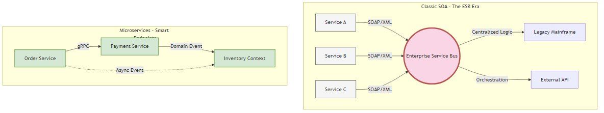
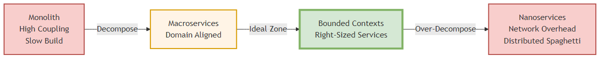
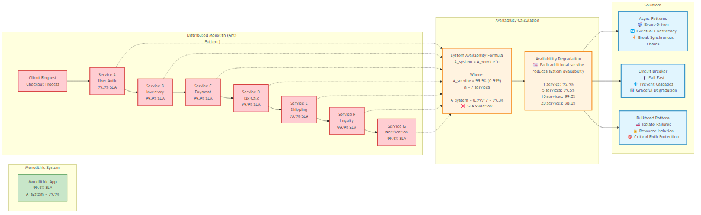
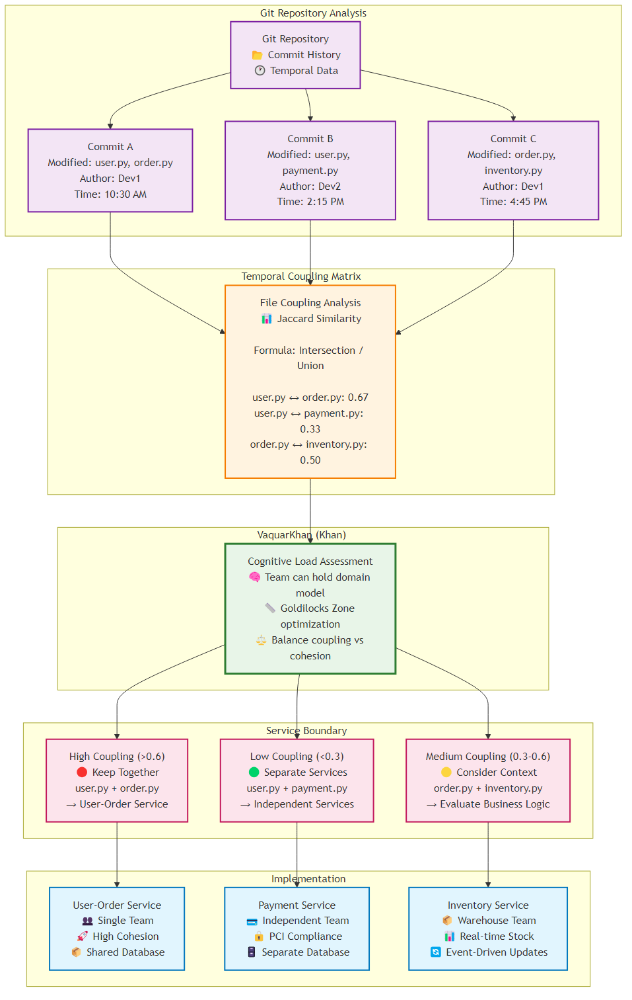

# Chapter 1: Introduction to Microservices

<div class="chapter-header">
  <h2 class="chapter-subtitle">The Definition Wars & The Reality of SOA</h2>
  <div class="chapter-meta">
    <span class="reading-time">📖 25 min read</span>
    <span class="difficulty">🎯 Intermediate</span>
  </div>
</div>

> *"Part I: The Sociotechnical Substrate"*  
> **Focus:** Aligning organization and architecture to prevent the "Distributed Monolith."

History is written by the victors, but in software architecture, it's often rewritten by marketing departments. To build a robust distributed system in the 2020s, we must first strip away the veneer of hype that covers the term "Microservices" and confront its lineage.

We are not building something entirely new; we are attempting Service Oriented Architecture (SOA) without the tragic mistakes of the past. The Senior Architect must understand why SOA failed in the mid-2000s to avoid repeating those failures with Kubernetes today.

This chapter explores the "Definition Wars" - the semantic battles that define our trade - and provides a forensic tool to help you determine the true boundaries of your system, ignoring the lines drawn on the whiteboard in favor of the lines drawn in the commit history.

## 1.1 SOA vs. Microservices: "Service Orientation Done Right"

In the early 2000s, SOA promised a revolution. It promised that large enterprises could break down their silos, reuse logic across departments, and achieve unprecedented agility. It failed for a significant portion of the industry. Why? Because it prioritized technical reuse over domain autonomy.

### 1.1.1 The Fallacy of the Enterprise Service Bus (ESB)

The primary artifact of the SOA era was the Enterprise Service Bus. Organizations spent millions on proprietary middleware - Tibco, BizTalk, IBM WebSphere - to centralize logic, routing, and transformation. The prevailing wisdom? "Put the intelligence in the pipes so the endpoints can remain simple."

This led to what I call the Enterprise Monolith. All business rules, routing logic, and data transformations lived in a centralized "God Component" managed by a specialized middleware team.

Here's the problem: If the Checkout team wanted to change the data format, they had to file a ticket with the ESB team and wait six weeks for a WSDL update. The ESB became the single point of failure and coupling.

### 1.1.2 The Microservices Inversion

Microservices flip this paradigm entirely. Martin Fowler and James Lewis famously articulated it as "Smart endpoints and dumb pipes."

The network should do nothing but transport packets - HTTP, gRPC, or a simple message broker. The intelligence (routing decisions, business rules, data mapping) must reside within the service itself. Not in some centralized middleware.

### 1.1.3 The Architect's Decision Matrix

The Senior Architect must differentiate between these styles to prevent "accidental SOA."

| Feature | Classic SOA (The Anti-Pattern) | Microservices (The Goal) |
|---------|--------------------------------|---------------------------|
| **Communication** | Smart Pipes: The ESB handles routing, versioning, and logic. | Dumb Pipes: HTTP/gRPC transport only. Logic is in the code. |
| **Data Governance** | Shared Database: Often, services read from a single massive schema. | Database per Service: Strict encapsulation. Access via API only. |
| **Primary Goal** | Reuse: "Don't write the same code twice." | Replaceability: "Ability to rewrite a component easily." |
| **Coupling** | High: Coupled via the ESB and shared schema. | Low: Coupled only by Bounded Context APIs. |
| **Team Structure** | Horizontal: UI Team, DB Team, Middleware Team. | Vertical: Stream-aligned teams owning the full stack. |



*Figure 1.2: Comparison of SOA and Microservices architectural patterns, highlighting the key differences in governance and logic distribution*

**The Mandate:** Don't build a microservices architecture that relies on a "Service Mesh" to handle heavy business logic. If your Istio or Envoy config contains complex routing rules based on business payload data, you've just reinvented the ESB. Yeah, it's that simple to mess this up.

## 1.2 The "Micro" Trap: Defining Boundaries by Replaceability

A pervasive anti-pattern in the industry is defining "Micro" by lines of code. "A service should be no more than 500 lines." This is a metric of vanity, not utility. It leads to Nanoservices - components so fine-grained that the network latency overhead outweighs the computational value.

Here's a better definition: **A service is "Micro" if it's independently replaceable.**

### 1.2.1 The Two-Week Rewrite Rule

Here's a robust heuristic: A microservice should be small enough that a standard "Two-Pizza Team" (6-8 engineers) could rewrite it from scratch in two weeks without disrupting the rest of the system.

If a service is so large that you're afraid to touch it, it's a monolith. If it's so small that it does nothing but forward a request to another service, it's a Nanoservice. Pretty straightforward.

### 1.2.2 Granularity vs. Cognitive Load

The Khan Granularity Protocol™ builds on team-centric sizing principles from Team Topologies. It helps architects optimize for the "Goldilocks Zone" where the team can hold the entire domain model in their working memory.

Low cognitive load means the team understands the code completely. They can deploy on Friday afternoon with confidence.

High cognitive load? The team needs "archaeologists" to understand the code. Deployments require "War Rooms" and manager approval. You know you've been there.

We can visualize the relationship between Granularity and Overhead:



*Figure 1.4: The granularity spectrum showing the relationship between service size, cognitive load, and operational overhead*

- **Zone of Monolith:** Complexity comes from code entanglement and slow build times.
- **Zone of Nanoservices:** Complexity comes from network orchestration, serialization costs, and "Distributed Spaghetti."
- **Zone of Bounded Contexts:** The ideal state where service boundaries align with business boundaries (e.g., "Payments," "Search").

## 1.3 The Reality of the Distributed Monolith

Most organizations attempting microservices end up building a Distributed Monolith. This is the worst of all worlds - a system deployed as separate artifacts but retaining the tight coupling of a monolith. You get all the performance penalties of distributed systems (latency, serialization, network failure) without any of the benefits (independent deployability).

I've seen this happen more times than I can count.

### 1.3.1 Symptoms of a Distributed Monolith

**Lock-Step Deployments**  
If Service A can't be deployed without simultaneously upgrading Service B and Service C, they're not microservices. They're a single application torn apart by the network.

**The Integration Database**  
Multiple services reading and writing to the same tables. If Service A changes a column name and Service B breaks, you've failed at encapsulation.

**Chatty Interfaces**  
A single frontend request triggers a cascade of 50 synchronous internal calls. This destroys availability. If each of the 50 calls has a 99.9% success rate, the aggregate success rate is:

```
Success Rate = (0.999)^50 ≈ 0.951 = 95.1%
```



*Figure 1.3: Mathematical analysis of system availability degradation in synchronous service chains, demonstrating the distributed monolith anti-pattern*

You've architected a system that fails 5% of the time by default. Not great.

## Recipe 1.1: Analyzing Git Commit History to Identify Boundaries

The most reliable method for identifying true service boundaries isn't the whiteboard diagram - it's the version control history. Files that change together, stay together. This is Temporal Coupling Analysis.



*Figure 1.1: Git repository analysis showing temporal coupling patterns and service boundary recommendations based on commit history*

**Problem:** You're tasked with migrating a legacy monolith to microservices. How do you know where to draw the lines?

**Solution:** Don't rely on static analysis (who calls whom). Rely on Temporal Coupling (who changes with whom).

Building on forensic code analysis concepts from Adam Tornhill's *Your Code as a Crime Scene* (2015), this recipe shows how to identify temporal coupling - where files change together over time - to detect hidden architectural dependencies.

Static analysis tools like SonarQube tell you about compile-time dependencies. They can't see logical dependencies. But the Git history tells the truth about behavioral dependencies. If OrderController.java and InventoryService.java are modified in the same Git commit 85% of the time, they're highly coupled. Splitting them would create a distributed transaction nightmare.

### Prerequisites

- Python 3.x
- Git installed on the command line
- Libraries: pandas, matplotlib, seaborn

### Step 1: Extract the Raw Data

Run this command at the root of your monolith's repository. It extracts the history of file changes for every commit.

```bash
# Extract commit hash, date, author, and file stats
git log --all --numstat --date=short --pretty=format:'%h %ad %aN' --no-renames > git_log.txt
```

### Step 2: The Analysis Script (coupling_forensics.py)

This script parses the log and calculates the Jaccard Similarity coefficient for every pair of files.

```python
import pandas as pd
import seaborn as sns
import matplotlib.pyplot as plt
from itertools import combinations
import sys
import os

def parse_git_log(filepath):
    """
    Parses the git log into a DataFrame of Commit Hash -> File Path
    """
    commits = []
    current_commit = None
    
    if not os.path.exists(filepath):
        print(f"Error: File {filepath} not found. Run the git log command first.")
        sys.exit(1)

    with open(filepath, 'r', encoding='utf-8', errors='replace') as f:
        for line in f:
            if line.startswith('    '):
                # New commit detected
                parts = line.strip().split('    ')
                current_commit = parts[1] # Store Hash
            elif line.strip() and current_commit:
                # File change detected (numstat format: added deleted filename)
                parts = line.split()
                if len(parts) >= 3:
                    # Reconstruct filename (handles spaces in paths)
                    filename = " ".join(parts[2:])
                    # Filter for source code only (customize extensions as needed)
                    if filename.endswith(('.java', '.go', '.ts', '.cs', '.py', '.js')):
                        commits.append({'commit': current_commit, 'file': filename})
    
    print(f"Parsed {len(commits)} file modifications.")
    return pd.DataFrame(commits)

def calculate_coupling(df, min_co_changes=5):
    """
    Calculates Jaccard Similarity for file pairs.
    Formula: (Intersection / Union)
    """
    # Group files by commit to see what changed together
    commit_groups = df.groupby('commit')['file'].apply(list)
    
    pair_counts = {}
    file_counts = df['file'].value_counts()
    
    print("Calculating coupling matrix (this may take a moment)...")
    
    for files in commit_groups:
        # We need at least 2 files to form a pair
        if len(files) < 2: continue
        
        # Sort to ensure (A, B) is treated same as (B, A)
        sorted_files = sorted(set(files)) # set() removes duplicates in same commit
        
        for f1, f2 in combinations(sorted_files, 2):
            pair_counts[(f1, f2)] = pair_counts.get((f1, f2), 0) + 1
            
    results = []
    for (f1, f2), intersection in pair_counts.items():
        if intersection < min_co_changes: continue # Ignore noise
        
        # Jaccard Index calculation
        union = file_counts[f1] + file_counts[f2] - intersection
        score = intersection / union
        
        results.append({
            'File A': f1, 
            'File B': f2, 
            'Co-Change Count': intersection, 
            'Coupling Score': round(score, 3)
        })
        
    return pd.DataFrame(results).sort_values(by='Coupling Score', ascending=False)

if __name__ == "__main__":
    print("--- Microservices Forensics: Coupling Analysis ---")
    log_file = 'git_log.txt'
    
    df_commits = parse_git_log(log_file)
    if df_commits.empty:
        print("No commits found. Check your git_log.txt generation.")
        sys.exit()
        
    df_coupling = calculate_coupling(df_commits)
    
    print("\nTop 10 High Temporal Coupling Candidates:")
    print(df_coupling.head(10).to_markdown(index=False))
    
    # Save for review
    df_coupling.to_csv('coupling_report.csv', index=False)
    print("\nFull report saved to 'coupling_report.csv'.")
```

### 1.3.2 Interpreting the Forensics

The output will reveal the hidden structure of your application.

| File A | File B | Co-Change Count | Coupling Score (0-1) |
|--------|--------|-----------------|---------------------|
| src/cart/CartService.java | src/pricing/PricingService.java | 45 | 0.85 |
| src/order/OrderController.java | src/utils/DateFormatter.java | 12 | 0.15 |

**The "Red Zone" (Score > 0.7):** These files change together constantly.

- **Diagnosis:** They are temporally coupled.
- **Action:** don't separate them. If you place CartService and PricingService in different microservices, every time you change Pricing, you'll break Cart. Keep them in the same Bounded Context.

**The "Green Zone" (Score < 0.2):** These files rarely affect each other.

- **Diagnosis:** Low coupling.
- **Action:** These are excellent candidates for separation. Splitting them carries low risk of "distributed monolith" behavior.

**Architectural Insight:** Often, this analysis reveals "God Classes" or "Utils" packages that couple unrelated domains. For example, if a Constants.java file has a coupling score of 0.3 with everything, it's a dependency magnet. The correct refactoring is to duplicate the constants into their specific domains (De-DRYing) before attempting to split the services.

## 1.4 Summary: The Geometry of Choice

The Senior Architect does not blindly "adopt microservices." They manipulate the geometry of the system based on the immediate constraint. Scaling the Y-axis (Functional Decomposition) is the most expensive operation in software engineering. Use the Coupling Matrix to ensure you are cutting along the joints, not sawing through the bone.

---

## Khan's Commentary: Microservices in the 2024+ GenAI Era

### The Evolution of Definitions

Fowler and Newman laid out the principles of microservices architecture in the mid-2010s, the landscape was dominated by concerns of scalability, deployment independence, and organizational alignment. These principles still hold true, but the emergence of Generative AI and Large Language Models (LLMs) in 2023-2024 has changed how we think about of microservices design.

As an AWS Senior Architect working at the intersection of distributed systems and AI/ML workloads, I've observed three critical shifts that demand an evolution of classical microservices thinking:

### 1. The AI Service Boundary Problem

**Classical Definition:** A microservice should encapsulate a single business capability.

**2024+ Reality:** AI/ML models blur the line between "business logic" and "data." An LLM-powered recommendation service isn't just executing logic—it's performing inference on massive parameter spaces. The question becomes: Is the model itself a service, or is it infrastructure?

**Khan Pattern™ Guidance:** Treat AI models as **Bounded Contexts with Computational Gravity**. The model's inference latency and resource requirements (GPU memory, token limits) become first-class architectural constraints. A 70B parameter model running on A100 GPUs can't be casually "split" like traditional business logic.

### 2. The Semantic API Revolution

**Classical Definition:** APIs should be RESTful, following HTTP verbs and resource-oriented design.

**2024+ Reality:** AI agents don't navigate REST APIs—they interpret **semantic interfaces**. OpenAI's Function Calling, Anthropic's Tool Use, and emerging standards like the Model Context Protocol (MCP) represent a paradigm shift. APIs are no longer just for humans or deterministic code; they're for probabilistic reasoning engines.

**Khan Pattern™ Guidance:** Design APIs with **Semantic Clarity as a First-Class Requirement**:
- **Natural Language Descriptions:** Every endpoint must have clear, unambiguous descriptions that LLMs can parse
- **Schema Validation:** Use JSON Schema or OpenAPI 3.1+ with rich examples
- **Idempotency by Default:** AI agents may retry operations due to hallucination or uncertainty

### 3. The Vector Database as a Service Boundary

**Classical Definition:** Each microservice owns its database (Database per Service pattern).

**2024+ Reality:** Vector databases (Pinecone, Weaviate, Milvus) store **embeddings**—numerical representations of semantic meaning. The question: Should embeddings be centralized or distributed across services?

**Khan Pattern™ Guidance:** Apply **Semantic Cohesion Analysis**. If multiple services need to perform semantic search over the same domain (e.g., "Customer 360"), a **Shared Vector Store** with strict access control is acceptable. However, if services operate in distinct semantic spaces (e.g., "Product Recommendations" vs. "Fraud Detection"), they should maintain **separate vector databases**.

**Decision Matrix:**

| Scenario | Semantic Overlap | Recommended Pattern | Rationale |
|----------|------------------|---------------------|-----------|
| Customer support + Sales | High | Shared Vector DB with namespace isolation | Semantic queries benefit from unified embeddings |
| Product catalog + Fraud detection | Low | Separate Vector DBs | No semantic overlap, avoid coupling |
| Multi-tenant SaaS | Medium | Shared DB with tenant-level partitioning | Cost efficiency, strict access control |

### 4. The Cost Dimension: Token Economics

**Classical Definition:** Microservices scale independently based on CPU/memory.

**2024+ Reality:** AI services scale based on **token consumption**. A single API call to GPT-4 might cost $0.03 (for 1000 tokens), while a traditional REST call costs fractions of a cent.

**Khan Pattern™ Guidance:** Introduce **Cost-Aware Circuit Breakers**. Traditional circuit breakers trip on error rates or latency. AI-native circuit breakers must also trip on:
- **Token Burn Rate:** If a service exceeds its token budget, degrade gracefully
- **Hallucination Detection:** If an AI service returns low-confidence responses repeatedly, circuit-break to prevent cascading errors

### 5. The Observability Challenge: Tracing Probabilistic Behavior

**Classical Definition:** Distributed tracing (OpenTelemetry) tracks deterministic request flows.

**2024+ Reality:** AI services introduce **non-deterministic behavior**. The same input prompt can yield different outputs due to temperature settings, model updates, or stochastic sampling.

**Khan Pattern™ Guidance:** Extend OpenTelemetry spans with **AI-specific attributes**:
- `ai.model.name`: Which model was used
- `ai.prompt.hash`: SHA-256 of the input prompt (for reproducibility)
- `ai.response.confidence`: Model's confidence score
- `ai.tokens.input` / `ai.tokens.output`: Token consumption
- `ai.cost.usd`: Actual cost of the inference

### Conclusion: The Adaptive Architect's Mandate

The principles articulated by Fowler, Newman, and Richardson remain the bedrock of microservices architecture. However, the 2024+ era demands that we **extend, not replace**, these principles to account for the unique characteristics of AI/ML workloads:

1. **Computational Gravity** is as important as business domain boundaries
2. **Semantic Clarity** is a first-class API requirement
3. **Token Economics** must inform scaling and circuit-breaking strategies
4. **Probabilistic Behavior** requires new observability primitives

The Khan Pattern™ for Adaptive Granularity was designed precisely for this era of rapid technological evolution. It doesn't prescribe rigid rules but provides a **framework for reasoning** about service boundaries in the face of new constraints.

---

## Summary

This chapter explored the foundational concepts of microservices architecture, distinguishing it from failed SOA implementations and providing practical tools for identifying proper service boundaries through temporal coupling analysis.

## What's Next?

In the next chapter, we'll dive deeper into design principles and patterns that form the backbone of successful microservices architectures.

---

**Navigation:**
- [← Previous: Preface](../PREFACE.md)
- [Next: Chapter 2 →](02-design-principles-and-patterns.md)
