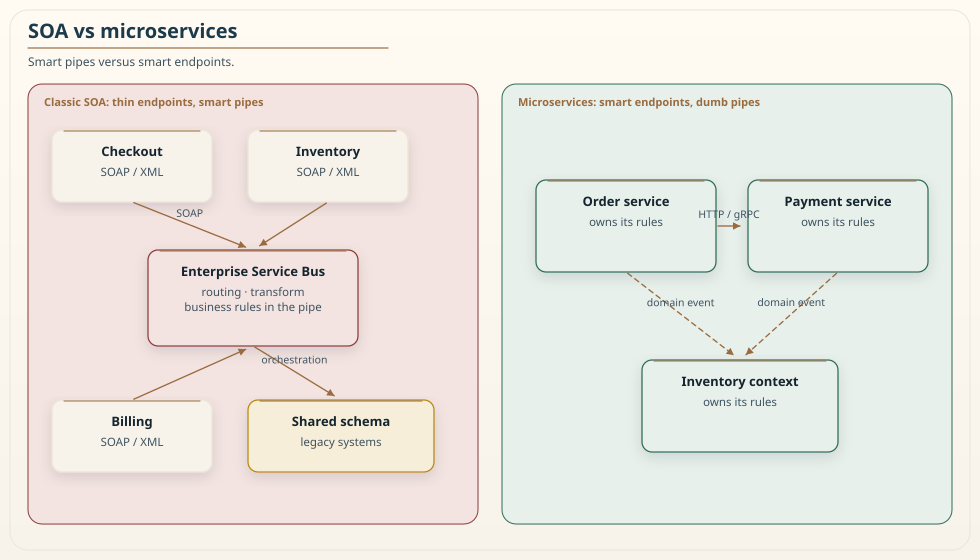
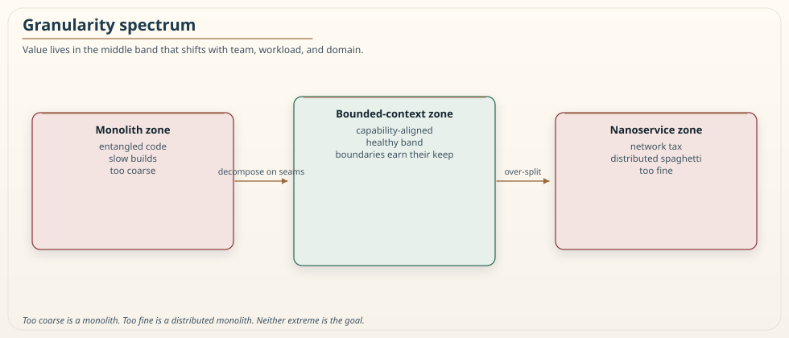
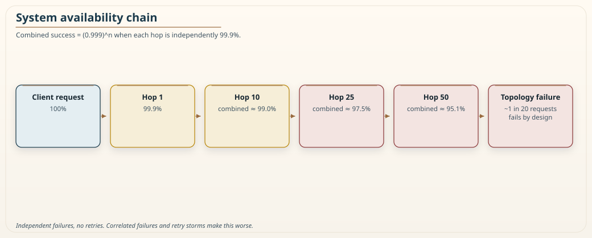
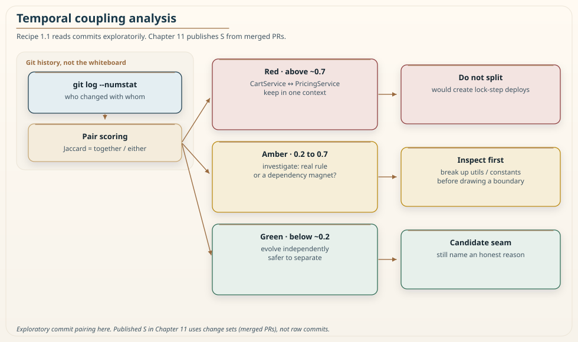

# Chapter 1: Introduction to Microservices

<div class="chapter-header">
  <h2 class="chapter-subtitle">Earned Boundaries, Not Fashionable Ones</h2>
  <div class="chapter-meta">
    <span class="reading-time">📖 35 min read</span>
    <span class="difficulty">🎯 Intermediate</span>
  </div>
</div>

> *"Part I: The Sociotechnical Substrate"*
> **Focus:** Aligning the shape of the organization with the shape of the architecture, so the system does not pay for distribution it never earned.

This is Part I of the book, the sociotechnical substrate, and its job is to align two things that most microservice failures pull apart: the shape of the organization and the shape of the architecture. Before we can talk about how to build distributed systems well, we have to strip the word *microservices* of the marketing that surrounds it and look at what it actually is, where it came from, and why so many teams end up with something that has all the costs of distribution and none of its benefits.

I am going to make one argument in this chapter and return to it in every chapter after: **a microservice is not defined by its size, its technology, or how modern it looks on a diagram. It is defined by whether a boundary you drew earns the distributed cost it imposes.** That reframing, from size to earned value, is the seed of the whole book, and it is also the fastest way to avoid the single most common and most expensive mistake in our field: building a distributed monolith while believing you are building microservices.

We are not inventing something new. We are attempting Service Oriented Architecture again, without the mistakes that made it fail for a large part of the industry in the mid-2000s. A senior architect has to understand why SOA failed, because the failure modes are not historical curiosities. They are alive and well, wearing Kubernetes and a service mesh, and a team that does not recognize them will rebuild them at great expense and call the result modern.

## 1.1 SOA done right: smart endpoints and dumb pipes

In the early 2000s, Service Oriented Architecture promised that large enterprises could break their silos, reuse logic across departments, and move faster. For a significant part of the industry it did the opposite. The useful lesson is not that "SOA failed" as a slogan. Plenty of integration work from that era still runs. SOA failed *where it prioritized technical reuse over domain autonomy, and concentrated intelligence in the wrong place.*

That distinction matters. If you treat the entire decade as a cautionary tale about services themselves, you will either refuse to distribute when you should, or you will distribute and then recreate the same concentration of intelligence under a new name.

### 1.1.1 The Enterprise Service Bus and the enterprise monolith

The defining artifact of the SOA era was the Enterprise Service Bus. Organizations spent enormous sums on proprietary middleware, products like TIBCO, BizTalk, and IBM WebSphere, to centralize routing, transformation, and business logic in the network layer. The prevailing wisdom was to put the intelligence in the pipes so the endpoints could stay simple. It sounded reasonable, which is exactly why it was so damaging.

What it produced was the enterprise monolith. All the business rules, all the routing, all the data transformation lived in a centralized component managed by a specialized middleware team, and that component became both a single point of failure and a single point of coupling. Consider the everyday consequence. If the checkout team wanted to change a data format, they could not simply change it. They had to file a request with the middleware team and wait weeks for a change to a shared definition, because the logic lived in the bus and not in their own service. The bus that was supposed to connect teams instead made every team wait on one team, and the promised agility died in a queue of change requests.

The deeper problem was architectural, not only organizational. By moving intelligence into the network, SOA coupled every service to the bus and, through the bus, to every other service. The system looked decoupled on a diagram, boxes connected by a neat central line, and it was tightly coupled in reality, because the central line contained the logic that made the boxes work. This gap between how a system looks and how it behaves is the theme that runs through this entire book, and it starts here.

### 1.1.2 The microservices inversion

Microservices invert that arrangement. The inversion is captured in the phrase James Lewis and Martin Fowler made famous: **smart endpoints and dumb pipes**. The network should do one thing: transport messages, whether over HTTP, a remote procedure call, or a message broker. The intelligence, the routing decisions, the business rules, the data mapping, belongs inside the service, not in the infrastructure between services.

This is not a stylistic preference. It is the structural correction for the exact failure that sank SOA. If the intelligence lives in the endpoints, a team can change its own service without asking permission from whoever owns the pipes, because there is no logic in the pipes to renegotiate. Autonomy returns because the coupling to the center is gone. The service owns its behavior end to end, and the network is demoted to plumbing.

Dumb pipes does not mean "no broker." A topic, a queue, or an HTTP path is still plumbing. Kafka is a dumb pipe when it moves bytes to a named destination. It becomes a smart pipe the moment the platform team starts transforming payloads, applying business rules, and orchestrating workflows inside the broker so that producers and consumers no longer own their own meaning. The test is always the same: if changing a business rule requires a ticket to the people who own the transport, the intelligence has left the endpoint.

There is a modern trap hiding here, and it is worth naming because it is easy to fall into. A service mesh such as Istio or Envoy is a powerful piece of infrastructure, and it is entirely possible to push business logic into it, routing on payload contents, making decisions based on the meaning of a request. If you do that, you have rebuilt the Enterprise Service Bus with a new logo. The mesh is meant to handle cross-cutting concerns like retries, timeouts, mutual TLS, and telemetry, which are genuinely infrastructure. Header-based canary or shadow routing is still infrastructure: it is about *which version* of a service receives a request, not about *what the business decides*. The moment your mesh configuration starts making business decisions, "orders over $1,000 go to the fraud workflow," you have moved intelligence back into the pipes, and the SOA failure mode is back with it.


*Figure 1.1: The structural difference between SOA and microservices, read left to right. On the SOA side, the services are thin and a central Enterprise Service Bus holds the routing, transformation, and business logic, so every service is coupled through that center and every change is coordinated through the team that owns it. On the microservices side, the bus is gone, the connections are plain transport, and each service holds its own logic, so services change independently. The two look similar as boxes and arrows but behave oppositely: the SOA arrangement centralizes intelligence and therefore coupling, while the microservices arrangement distributes intelligence and therefore autonomy.*

### 1.1.3 A decision table for avoiding accidental SOA

The distinction is easy to state and easy to lose under delivery pressure, so it helps to have it in a form you can check a design against.

| Concern | Classic SOA, the anti-pattern | Microservices, the goal |
|---------|-------------------------------|-------------------------|
| **Communication** | Smart pipes: the bus handles routing, versioning, and logic | Dumb pipes: transport only, logic lives in the service |
| **Data** | Shared database: services read a common schema | Exclusive schema ownership: access only through an interface |
| **Primary aim** | Reuse: do not write the same code twice | Replaceability: rewrite a component without fear |
| **Coupling** | High, through the bus and the shared schema | Low, only through bounded-context interfaces |
| **Team shape** | Horizontal: separate UI, database, and middleware teams | Vertical: stream-aligned teams owning a full slice |

If your design matches the left column while calling itself microservices, you have built accidental SOA, and you will get the operational cost of distribution with the coupling of a monolith. The right column is not a set of rules to follow mechanically. It is a description of what actually delivers the autonomy that justifies distribution in the first place.

One clarification on data, because cargo-culting this row is expensive. Exclusive schema ownership does not require a separate database *server* for every service. It requires that no other service can read or write your tables. A schema per service in a shared engine, or a schema per module in the modular monolith of Chapter 18, can satisfy the principle. A shared `orders` table that five services update does not, even if each service has its own repository class.

## 1.2 Defining "micro" by replaceability, not by size

The most damaging idea in the popular understanding of microservices is that *micro* refers to size: that a service should be under some number of lines of code, or small enough to fit in one engineer's head, or rewritable over a weekend. Size is a vanity metric. It leads directly to nanoservices, components so small that they do almost nothing except forward a request to the next component, and a system of nanoservices pays the full network tax on every hop while accomplishing little between hops. Optimizing for smallness produces the distributed spaghetti it was supposed to prevent.

A better definition is functional and organizational rather than dimensional. **A service is appropriately sized when it is independently replaceable:** when the team that owns it could rewrite it from scratch, behind its existing interface, without disrupting the rest of the system. This shifts the question from how many lines to how contained is the blast radius of change, which is the question that actually matters.

Replaceability has two halves, and both have to be true. The implementation must be small enough, and coherent enough, that a team can hold it. The *interface* must be stable enough that the rest of the system does not need to change when the implementation does. A 400-line service that leaks its persistence model to three callers is not replaceable. A 4,000-line service behind a boring, versioned interface can be.

### 1.2.1 The two useful heuristics, and their limits

Two heuristics from the literature are worth keeping, as long as you hold them as heuristics and not as laws. The first is the two-pizza team, associated with Amazon: a service should be ownable by a team small enough to be fed by two pizzas, roughly six to eight people, because that is about the size at which a group can hold a shared model of a system in their heads and coordinate without heavy process. The second is the two-week rewrite: a service is about the right size if that team could rebuild it from scratch in about two weeks. Both heuristics are really proxies for the same underlying property, that the service is small enough to be understood and owned but large enough to justify its own existence.

Their limit is that they are proxies, and proxies drift. A service can satisfy the two-week rewrite rule and still be a terrible boundary if it changes in lock-step with three other services, because the rewrite time says nothing about coupling. A team can be two pizzas and still be unable to ship if every change waits on a shared schema. This is precisely the gap that the rest of this book fills with measurement: the heuristics get you to a reasonable first guess, and the granularity metric of Chapter 11 tells you whether the guess was right, using signals the heuristics cannot see.

### 1.2.2 Granularity and cognitive load

The reason size matters at all is not aesthetic. It is human. A boundary is maintained by a team, and a team has finite cognitive capacity: the shared mental model of how the system works that lets them change it safely. When a service fits comfortably within that capacity, the team can reason about it completely, review changes with confidence, and deploy without ceremony. When a service exceeds that capacity, the team can no longer hold it whole, and the symptoms are unmistakable: changes require an archaeologist to explain the code, deployments require a war room and a manager's approval, and everyone is a little afraid to touch it.

This is the sociotechnical heart of granularity, and it is why the third signal in the metric of Chapter 11 is a measure of complexity against team capacity rather than a measure of code alone. A boundary the owning team cannot hold in their heads will be maintained badly no matter how clean it looks in the dependency graph. A boundary that fits will be maintained well even if it is larger than fashion prefers. Size serves cognition, and cognition is what actually governs whether change stays safe.


*Figure 1.2: Granularity as a spectrum rather than a binary. At the left end, a coarse monolith, where complexity comes from code entanglement and slow builds. At the right end, a field of nanoservices, where complexity comes from network orchestration, serialization, and distributed spaghetti. In the middle sits the healthy band, where boundaries align with business capabilities such as payments or search. Both ends are failure modes and the value lives in the middle. Crucially, the location of the healthy band is not fixed: it shifts with the workload, the team, and the domain, which is why a single fixed size rule cannot find it and a measurement is needed.*

The three zones on that spectrum are worth naming plainly.

- **The monolith zone** is where complexity comes from code that is entangled and builds that are slow, the problem that pushes teams to split.
- **The nanoservice zone** is where complexity comes from network orchestration and serialization cost, the problem that punishes teams who split too far.
- **The bounded-context zone** in the middle is the goal, where a service boundary lines up with a real business boundary. It is bounded because it is defined by meaning, a coherent business capability, rather than by a line count.

### 1.2.3 The honest reasons to distribute, and the fashionable ones

Before drawing any boundary it is worth being clear about why you are distributing at all, because half of the distributed monoliths I have seen were built for reasons that do not survive examination. There are four honest reasons to split a system, and each is a real benefit you can point to.

1. **Independent deployability.** Separate teams need to ship on separate schedules without coordinating a single release, and the monolith's shared deployment has become the bottleneck.
2. **Independent scaling.** One part of the system has a load profile so different from the rest that scaling them together wastes significant money, and separating that part lets it scale on its own curve.
3. **Fault isolation.** A failure in one capability must not take down the others, and a boundary with a real blast wall between them delivers that. Regulatory isolation, PCI for payments, HIPAA for clinical data, usually belongs here: the wall is legal as well as operational.
4. **Team autonomy at organizational scale.** You have grown past the point where one codebase can be owned coherently, and Conway's Law is pushing the architecture to mirror the teams whether you plan it or not.

Notice what these four have in common. Each is a concrete problem the organization actually has, and distribution is the solution to that specific problem. Now contrast the fashionable reasons, the ones that produce distributed monoliths. Distributing because a large technology company does it, without having that company's scale or team count. Distributing because microservices are modern and monoliths sound old. Distributing because an engineer wants the pattern on their resume. Distributing because a diagram with many boxes looks more sophisticated than a diagram with one. None of these is a problem the distribution solves, and distribution adopted without a problem to solve delivers only cost.

The practical test is simple and worth applying before any split: **name the specific problem this boundary solves, from the four honest reasons, and if you cannot name one, do not draw the boundary yet.** This is the same discipline the metric in Chapter 11 formalizes, and it is the difference between distributing to serve a need and distributing to serve a fashion.

## 1.3 The reality most teams reach: the distributed monolith

Most organizations that set out to build microservices arrive instead at a distributed monolith, and it is worth being honest that this is the default outcome, not a rare accident, because the default is what you get when you split without measuring. A distributed monolith is the worst of both worlds: a system deployed as separate artifacts that has kept the tight coupling of a monolith. You pay every cost of distribution, latency, serialization, network failure, operational surface, and you collect none of the benefits, because the coupling that was supposed to be removed is still there, now with a network running through it.

Chapter 2 develops the phenomenology of this failure in depth. Here we need only enough of it to recognize the pattern before we start drawing lines.

### 1.3.1 The three symptoms

The distributed monolith announces itself through three symptoms, and once you can name them you will see them everywhere.

**The first is lock-step deployment.** If service A cannot be deployed without simultaneously deploying services B and C, then A, B, and C are not three microservices. They are one application that has been torn apart by a network. Independent deployability is the benefit microservices exist to provide, and its absence means the distribution bought nothing.

**The second is the integration database.** When multiple services read and write the same tables, they are coupled through the data even if their code looks separate, and the coupling is invisible until service A renames a column and service B breaks in production. Shared mutable data is coupling that no amount of clean code can hide, which is why exclusive schema ownership matters so much and why Chapter 18 treats the shared table as the primary way a clean design rots.

**The third is the chatty interface,** and it is the one with a number attached. When a single user request fans out into a cascade of synchronous internal calls, availability collapses, because availability multiplies across a synchronous chain. Suppose a request depends on fifty internal calls, each individually very reliable at 99.9 percent success. The combined success rate is not 99.9 percent. It is that figure raised to the fiftieth power:

```
Combined success = (0.999)^50 ≈ 0.951, or 95.1 percent
```

A system architected this way fails about one time in twenty *by design*, and no amount of individual service reliability rescues it, because the arithmetic is against you. If the per-call success rate is a more ordinary 99 percent, the same chain falls to about 60.5 percent. That is not an outage you can page your way out of. It is a property of the topology.

Hold the model honestly. The formula `A^n` assumes independent failures and no retries. Real failures are often correlated, a shared region, a shared datastore, a shared certificate, which makes the combined success *worse*. Retries can make it worse still: they turn a slow dependency into a retry storm and consume the very capacity the chain needed to recover. Fifty hops is a pedagogical extreme, but the shape of the damage appears much earlier. A checkout that walks eight synchronous services is already paying a reliability tax that has to be justified by a real benefit.

The lesson is not that synchronous calls are forbidden. It is that every synchronous hop across a boundary is a reliability cost, and that cost has to earn its keep. That is the same cost-versus-value logic the whole book applies.


*Figure 1.3: Why chatty synchronous chains destroy availability. Each box is a service call that succeeds 99.9 percent of the time on its own, which sounds excellent. The diagram follows the request down the chain and shows the combined success rate falling at every hop, because the request only succeeds if every call in the chain succeeds, and probabilities multiply. By fifty hops the combined success has dropped to about 95 percent, meaning roughly one request in twenty fails somewhere in the chain by design. Synchronous fan-out is not a small inefficiency. It is a structural attack on reliability that gets worse with every boundary the request must cross.*

## 1.4 Finding boundaries in the history, not on the whiteboard

If size is the wrong way to find boundaries, what is the right way? The most reliable signal for where the true seams of a system lie is not the architecture diagram, which shows what someone intended, but the version-control history, which shows what actually happened. Files that change together belong together, and files that change independently are candidates to separate. This is temporal coupling, and it is one of the most useful and least used tools available to an architect.

The insight, which builds on the forensic code analysis Adam Tornhill developed in *Your Code as a Crime Scene*, is that static analysis and history tell you different things. Static analysis, the kind a tool like SonarQube performs, tells you about compile-time dependencies, who imports whom. That is useful but incomplete, because it cannot see logical dependencies: the cases where two files have no import between them yet always change together because they encode two halves of the same business rule. The Git history sees exactly those. If the order controller and the inventory service are modified in the same change eighty-five percent of the time, they are coupled in behavior regardless of what the import graph says, and splitting them into separate services would turn every coupled change into a distributed transaction and a coordinated deployment.

### Recipe 1.1: Analyzing commit history to find boundaries

This recipe extracts the co-change structure of a codebase from its Git history and scores how tightly each pair of files is coupled, so you can see the real boundaries before you commit to any split.

**Prerequisites:** Python 3, Git, and `pandas`. The optional `tabulate` package improves the printed table; the script falls back to a plain table if it is missing.

**Step 1: Extract the raw history.** Run this at the root of the repository. It produces one record per file changed per commit, with the commit hash, date, and author. `--no-renames` keeps paths stable so a rename does not look like a deletion plus an unrelated creation.

```bash
git log --all --numstat --date=short --pretty=format:'%h %ad %aN' --no-renames > git_log.txt
```

On Windows PowerShell, `>` writes UTF-16. Either run the command from Git Bash or cmd.exe, or force UTF-8:

```powershell
git log --all --numstat --date=short --pretty=format:'%h %ad %aN' --no-renames | Out-File -Encoding utf8 git_log.txt
```

The parser below detects a UTF-16 BOM if you forget.

The output looks like this. The old parser in earlier drafts of this recipe looked for a four-space indent that `git log` does not emit. Use a parser that matches the real format: a hash-and-date header, then `numstat` rows.

```
311e439 2026-07-31 vaquarkhan
7	0	src/order/OrderController.java
4	2	src/inventory/InventoryService.java

34bbb09 2026-07-09 vaquarkhan
12	3	src/pricing/PricingService.java
```

**Step 2: Score the coupling.** The script below parses that log and computes, for every pair of files that change together often enough to matter, the Jaccard similarity coefficient: the number of commits that touched both files divided by the number that touched either. This is an **exploratory** view at **commit** granularity. Chapter 11's Semantic Distinctness scores **merged pull requests** (intent units), not raw commits. Do not pipe this table into RVx S. Re-aggregate by merge commit or linked work item, and drop bot commits, before the number is allowed near a gate. A score near one means the two files almost always change together. A score near zero means they rarely do.

Worked example: file A appears in 20 commits, file B in 15, and they appear together in 12. Jaccard is `12 / (20 + 15 - 12) = 12 / 23 ≈ 0.522`. That is a middle-band score. Do not split on the score alone. Read the raw co-change count next to it. A 1.000 built from five shared commits is a small sample. A 0.55 built from forty shared commits is a seam.

The script also skips oversized commits. A formatter run, a mass rename, or a "apply the linter everywhere" change can touch hundreds of files and invent thousands of false pairs. Those commits are process noise, not domain coupling. If your history is dominated by them, raise `min_co_changes` or tighten `max_files_per_commit` before you trust the ranking.

```python
"""Recipe 1.1: temporal coupling from git log --numstat output."""
import os
import re
import sys
from itertools import combinations

import pandas as pd

COMMIT_RE = re.compile(r"^([0-9a-f]{7,40})\s+(\d{4}-\d{2}-\d{2})\s+(.+)$")
NUMSTAT_RE = re.compile(r"^(\d+|-)\t(\d+|-)\t(.+)$")
SOURCE_EXTS = (".java", ".go", ".ts", ".tsx", ".cs", ".py", ".js", ".jsx", ".kt", ".rb")


def open_git_log(filepath):
    """Open a git log file, including UTF-16 dumps from Windows PowerShell."""
    with open(filepath, "rb") as handle:
        start = handle.read(4)
    if start.startswith(b"\xff\xfe") or start.startswith(b"\xfe\xff"):
        return open(filepath, "r", encoding="utf-16")
    return open(filepath, "r", encoding="utf-8", errors="replace")


def parse_git_log(filepath):
    """Parse git log --numstat into rows of (commit hash, file path)."""
    if not os.path.exists(filepath):
        print(f"Error: {filepath} not found. Run the git log command first.")
        sys.exit(1)

    commits = []
    current = None
    with open_git_log(filepath) as handle:
        for raw in handle:
            line = raw.rstrip("\n")
            header = COMMIT_RE.match(line)
            if header:
                current = header.group(1)
                continue
            stat = NUMSTAT_RE.match(line)
            if not stat or current is None:
                continue
            filename = stat.group(3)
            if filename.endswith(SOURCE_EXTS):
                commits.append({"commit": current, "file": filename})

    print(f"Parsed {len(commits)} file modifications.")
    return pd.DataFrame(commits)


def calculate_coupling(df, min_co_changes=5, max_files_per_commit=30):
    """Jaccard similarity for each file pair: intersection over union."""
    by_commit = df.groupby("commit")["file"].apply(lambda files: sorted(set(files)))
    file_counts = df["file"].value_counts()
    pair_counts = {}
    skipped = 0

    for files in by_commit:
        if len(files) < 2:
            continue
        if len(files) > max_files_per_commit:
            skipped += 1
            continue
        for left, right in combinations(files, 2):
            pair_counts[(left, right)] = pair_counts.get((left, right), 0) + 1

    if skipped:
        print(f"Skipped {skipped} oversized commits (>{max_files_per_commit} files).")

    rows = []
    for (left, right), both in pair_counts.items():
        if both < min_co_changes:
            continue
        union = file_counts[left] + file_counts[right] - both
        rows.append({
            "File A": left,
            "File B": right,
            "Co-changes": both,
            "Coupling": round(both / union, 3),
        })
    return pd.DataFrame(rows).sort_values("Coupling", ascending=False)


if __name__ == "__main__":
    df = parse_git_log("git_log.txt")
    if df.empty:
        print("No source-file commits found. Check git_log.txt and SOURCE_EXTS.")
        sys.exit(1)
    report = calculate_coupling(df)
    if report.empty:
        print("No pairs met the co-change threshold. Lower min_co_changes for a small repo.")
        sys.exit(0)
    try:
        print(report.head(10).to_markdown(index=False))
    except ImportError:
        print(report.head(10).to_string(index=False))
    report.to_csv("coupling_report.csv", index=False)
    print("\nFull report saved to coupling_report.csv.")
```


*Figure 1.4: What the coupling analysis reveals. Pairs of files are ranked by their co-change score, computed from real commit history. The high-scoring pairs at the top, shown in the warm band, change together so often that they are effectively one unit, and splitting them across a service boundary would turn every routine change into a coordinated cross-service deployment. The low-scoring pairs at the bottom change independently and are safer to separate. The diagram makes visible what no whiteboard can: the behavioral coupling that lives in the history rather than in the import graph, which is the truth about where the system's real seams are.*

**Step 3: Interpret the result.** Treat the bands as starting heuristics, not laws. Calibrate them to the age and commit style of the repository.

| Band | Score (starting heuristic) | Meaning | Action |
|------|----------------------------|---------|--------|
| **Red** | roughly above 0.7, with a real co-change count | Temporally coupled | Keep them in the same bounded context. Separating them creates a distributed-monolith fragment. |
| **Amber** | roughly 0.2 to 0.7 | Investigate | Ask whether the pairing is a real business rule or an accidental shared file. |
| **Green** | roughly below 0.2 | Evolve independently | Candidates for separation, with lower risk of lock-step deployment. |

There is a common and instructive finding in this analysis: a utility or constants file that has a moderate coupling score with *almost everything*. Such a file is a dependency magnet. It couples unrelated domains through shared incidental code. The right response is not to build a service around it. It is to break it up, duplicating its constants into the domains that use them so the false coupling disappears. A small amount of duplication that removes coupling is a better trade than a shared file that couples everything, which is a theme the data chapters return to.

This recipe is the practical bridge to Chapter 11, where the co-change signal becomes one of the three inputs to the granularity metric, the S term in the RVx index. Here it is a manual investigation you run before a migration. There it becomes a continuous measurement that governs boundaries over time. Either way, the principle is the same: the history knows where the boundaries are, and it is more honest than the diagram.

## 1.5 Where the boundary question is heading

The principles Lewis, Fowler, Newman, and Richardson established remain the bedrock, and nothing in the recent wave of generative AI overturns them. What has changed is that the boundary question now has to be asked about a new kind of component, the AI model and the tools an agent calls. The honest position is that the granularity thinking in this book extends to that world rather than being replaced by it. I want to preview that extension here without duplicating the chapters that cover it in full, because an introduction should point at the map, not redraw it.

Three shifts matter, and each has its own chapter later.

The first is that a model has what I call **computational gravity**: its inference cost, memory footprint, and latency are first-class architectural constraints, so you cannot casually split or move a large model the way you move stateless business logic.

The second is that interfaces are no longer only for humans and deterministic callers. An agent interprets a tool's description and decides whether to call it, which makes the clarity and granularity of a tool surface an architectural concern in its own right. That is the subject of Chapter 16. An over-tooled agent, a catalog of fifty almost-overlapping functions, is a nanoservice architecture with a probabilistic caller. The agent will pick the wrong tool the way a chatty frontend picks the wrong hop: often, and expensively.

The third is that these systems behave probabilistically, so the same input can produce different outputs, which forces extensions to how we observe and trace them. That is the subject of Chapter 15.

The reason I raise these in the introduction is to make a single point: **the boundary question does not go away in the age of AI. It intensifies.** A tool catalog is a set of boundaries, and an over-tooled agent is a distributed monolith in a new medium. The same discipline this book builds for services, measure whether a boundary earns its cost, applies directly to the granularity of an agent's tools. Chapter 11 and Chapter 16 make that connection precise. For now, carry forward only this: the framework in this book is a way of reasoning about boundaries under constraints, and new constraints are exactly what it was built to absorb.

## 1.6 Summary and what comes next

This chapter made one argument in several forms. A microservice is not defined by size but by whether a boundary earns the distributed cost it imposes. Service Oriented Architecture failed where it centralized intelligence in a bus and coupled everything through it. Microservices correct that by putting smart logic in the endpoints and keeping the pipes dumb, which is the structural source of the autonomy that justifies distribution. Defining *micro* by replaceability rather than line count keeps the focus on the property that matters: whether a team can own and safely change a boundary. Cognitive load, not code size, is what ultimately governs that.

The default outcome of splitting without measuring is the distributed monolith, recognizable by three symptoms: lock-step deployment, the integration database, and the chatty synchronous interface whose availability collapses under the arithmetic of the chain. The most reliable way to find true boundaries is to read the version-control history, because temporal coupling reveals the behavioral dependencies that no whiteboard and no import graph can see. The coupling recipe in this chapter is the manual form of the measurement that Chapter 11 later makes continuous.

Everything from here builds on this foundation. Chapter 2 develops the design principles and patterns that turn these ideas into practice, and looks closely at the phenomenology of the distributed monolith and the Conway's Law mechanism behind it. Chapter 2 diagnoses the distributed monolith. Chapter 3 finds seams with strategic DDD. Then the book works through data, sagas, resilience, security, observability, testing, and messaging. Chapter 11 is where the boundary question becomes a measurement. The goal, stated once here and earned over the rest of the book, is not to have the most services or the fewest. It is to draw the boundaries that add value, and to know, with evidence rather than intuition, which ones those are.

---

**Navigation:**
- [Previous: Preface](../PREFACE.md)
- [Next: Chapter 2](02-design-principles-and-patterns.md)
