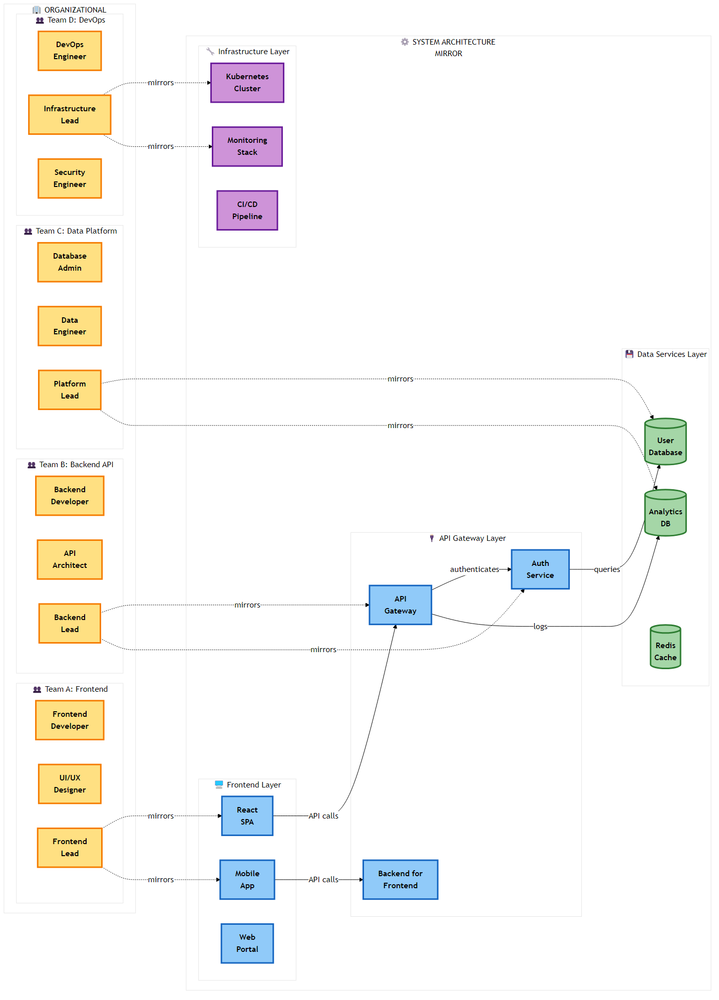

# Chapter 2: Design Principles and Patterns

<div class="chapter-header">
  <h2 class="chapter-subtitle">The Distributed Monolith and Anti-Patterns – An Expanded Field Guide</h2>
  <div class="chapter-meta">
    <span class="reading-time">📖 35 min read</span>
    <span class="difficulty">🎯 Advanced</span>
  </div>
</div>

## 2.1 The Phenomenology of the Distributed Monolith

The transition from monolithic architectures to microservices is frequently eulogized in executive summaries as a panacea for the stagnation of legacy systems. The promise is seductive: rapid deployment cycles, independent scaling of components, and the freedom to adopt polyglot technology stacks that best fit the problem at hand. However, the chasm between the theoretical microservices architecture characterized by bounded contexts and loose coupling and the deployed reality is often filled with the wreckage of failed transformations. The most pervasive and pernicious of these failures is the "Distributed Monolith."

A Distributed Monolith is a system that consists of multiple services deployed in separate containers or servers, but which lacks the defining characteristic of a true microservice architecture: loose coupling. In this pathological state, the system incurs all the inherent complexities of a distributed system network latency, serialization costs, partial failures, and distributed tracing challenges without reaping any of the benefits of agility or independence. It is, in essence, the worst of possible worlds: the rigidity of a monolith combined with the unreliability of a network.

The emergence of the distributed monolith is rarely an intentional design choice; rather, it is an emergent property of organizational entropy and a misunderstanding of the physics of distributed computing. It occurs when teams decompose applications based on technical layers (e.g., separating the UI, logic, and data access layers into different services) rather than business domains. This results in a system where every business function requires synchronous conversation between multiple services, re  creating the tight coupling of the monolith over a much slower and less reliable transport mechanism.

### 2.1.1 The Mathematical Inevitability of Failure

The fundamental error in creating a Distributed Monolith is the violation of the fallacies of distributed computing, specifically regarding reliability and latency. When a monolithic application is sliced along technical layers rather than business domains, the resulting services must communicate incessantly to perform even the simplest unit of work.

Consider a synchronous call chain where Service A calls Service B, which calls Service C. If each service has a Service Level Objective (SLO) of 99.9% availability, the composite availability of the chain is the product of the individual availability. In a "chatty" distributed monolith, a single user request such as "Checkout"—might trigger 50 synchronous internal calls to validate inventory, check credit limits, calculate tax, and update loyalty points. The mathematical availability drops precipitously.

**The formula for system availability (A_system) in a synchronous chain is the product of the availability of each component (A_service) raised to the power of the number of dependencies (n):**

```
A_system = A_service^n
```

**If we assume a standard cloud availability of 99.9% for each service, a chain of 50 calls results in:**

```
A_system = 0.999^50 ≈ 95.1%
```

While 95% might sound acceptable in some contexts, it implies that one in twenty requests will fail purely due to the architecture, even if the code is bug free. However, the reality is often grimmer. If the individual service availability is merely 99% (a common reality for non-optimized internal services or during deployment windows), the aggregate availability collapses to catastrophic levels:

```
A_system = 0.99^50 ≈ 60.5%
```

This mathematical reality explains why distributed monoliths are plagued by "ghost outages" - periods where the system is technically "up" (no single service is fully down/red on the dashboard), but user transactions fail due to timeouts and transient network glitches cascading through tight coupling chains. 

The latency tail is equally punitive. The 99th percentile latency of the composite service becomes the sum of the 99th percentile latencies of all downstream calls. Your system is only as fast as its slowest component.

### 2.1.2 A Taxonomy of Coupling

To diagnose a distributed monolith, the Architect must look beyond the deployment diagram and analyze the nature of the coupling. Coupling is not a binary state; it exists on a spectrum. Meilir Page Jones’s concept of Connascence provides rigorous vocabulary for this analysis, allowing us to categorize the severity of the dependency between services. In a distributed monolith, we often observe high degrees of static and dynamic connascence that bind services together as effectively as if they were compiled into a single binary.

Connascence of Identity (Spatial Coupling)

This occurs when Service A must know the exact network location (IP/Port) of Service B to function. While Service Discovery tools like Consul, Eureka, or AWS Cloud Map mitigate the hard coding of IPs, the dependency on B’s immediate availability remains. If Service B moves or goes down, Service A fails. In true microservice architecture, this is mitigated by asynchronous messaging where Service A pushes a message to a broker, indifferent to the location or even the existence of Service B.

Connascence of Meaning (Semantic Coupling)

Service A and Service B share a specific, implicit understanding of data value. For example, both services might understand that a status integer of 5 means "Shipped." If the "Shipping" service changes this interpretation to "Delivered" or introduces a new status 6, the "Order" service breaks or corrupts data. This is rampant in systems that share a database (The Integration Database Anti Pattern), where the schema acts as a rigid, shared public API that cannot be evolved without cross  team coordination.

Connascence of Timing (Temporal Coupling)

This is the most damaging form of coupling in distributed systems. Service A requires Service B to process a request right now to complete its own transaction. This precludes asynchronous processing and creates backpressure vulnerability. If Service B slows down, Service A’s thread pool fills up, and the failure cascades upstream. Temporal coupling transforms independent services into a single, fragile failure domain.

Connascence of Algorithm

This occurs when multiple services must agree on a specific algorithm to process data. A classic example is a shared hashing algorithm for checksums or a specific business rule for calculating tax that is duplicated across the "Cart," "Checkout," and "Invoice" services. If the tax law changes, every service must be updated and deployed simultaneously to avoid data inconsistency.

2.1.3 The "Common" Library Trap

A subtle but pervasive vector for the distributed monolith is the "Common" shared library. In monolithic development, the principle of DRY (Don't Repeat Yourself) is paramount. Developers are trained to extract shared logic (DTOs, utilities, domain objects) into a shared JAR, Gem, or NPM package.

In microservices architecture, however, the indiscriminate use of shared libraries creates Binary Coupling. If the "Billing" service and the "Shipping" service both depend on common lib  v1.0.jar, and the "Billing" team needs a change in the Customer object that resides in common lib, the library must be updated to v1.1. Now, the "Shipping" team must also rebuild, retest, and redeploy their service to avoid classpath conflicts or serialization errors, even if they had no need for the change.

These forces Lock  Step Deployment, where teams lose the ability to release independently. The shared library becomes a "God Class" that every team touches, leading to merge conflicts and coordination meetings.

Architect’s Heuristic: In microservices, prefer duplication over coupling. It is better to have two slightly different copies of a customer class, one tailored for Billing (containing credit card tokens) and one for Shipping (containing address details) than to tie the release cycles of two disparate teams together via a shared binary. DRY applies within a microservice boundary, not across them.

2.2 The Sociotechnical Origins: Conway’s Law Revisited

To understand why intelligent, well intentioned engineering teams build distributed monoliths, we must look beyond technology to the sociotechnical mirroring mechanisms identified by Melvin Conway. The architecture of a system is rarely purely the result of technical decisions; it is a reflection of the communication structures of the organization that built it.

2.2.1 The Homomorphism of Design

In his seminal 1968 paper, "How Do Committees Invent?", Melvin Conway posited that "organizations which design systems (in the broad sense used here) are constrained to produce designs which are copies of the communication structures of these organizations". This observation, now known as Conway's Law, asserts that the interface structure of a software system will necessarily show a congruence specifically a homomorphism with the social structure of the organization that produced it.



*Figure 2.1: Conway's Law in action - organizational team structure directly mirrors the resulting system architecture, demonstrating the sociotechnical coupling in software design*

## Conway observed a specific mechanism for this mirroring:
"The realization by the initial designers that the system will be large... make[s] irresistible the temptation to assign too many people to a design effort. Application of the conventional wisdom of management to a large design organization causes its communication structure to disintegrate."

When a monolithic organization is characterized by siloed functional departments like a "DBA Team," a "Backend Team," and a "Frontend Team"—attempts to build microservices, the communication costs dictate the architecture. The Backend team talks mostly to themselves, and occasionally to the DBAs. Consequently, they produce a single, monolithic "Backend Service" that connects to a single "Database." If they attempt to split it, they inevitably produce a layered distributed architecture that mirrors their silos:

A "Data Service" (mirroring the DBA team).

A "Business Logic Service" (mirroring the Backend team).

A "BFF (Backend for Frontend) Service" (mirroring the Frontend team).

This structure is not a microservices architecture; it is a breakdown of the monolith into network separated tiers. The teams must still coordinate on every feature release, necessitating high bandwidth communication that the architecture was supposed to eliminate. The technical boundaries have become rigid because the social boundaries are rigid.

2.2.2 The Inverse Conway Maneuver

Recognizing this causality allows Architects to employ the Inverse Conway Maneuver (ICM). Originating from Thoughtworks (Jonhy Leroy and Matt Simons, 2010), this strategy dictates that to achieve a specific technical architecture such as decoupled, independently deployable microservices one must first reshape the organizational structure to match it.

The ICM transforms Conway’s Law from a descriptive observation into a normative design tool. Instead of fighting the organization to build the software, we design the organization to force the software into the desired shape.
## Implementation Guide for the Architect:
Identify Bounded Contexts: Use Domain Driven Design (DDD) to identify business domains (e.g., "Order Fulfillment," "Customer Acquisition") rather than technical layers.

Form Stream Aligned Teams: Create cross functional teams that contain all the skills necessary to ship value for that domain: developers, QA, DBAs, and Product Owners. These teams should be small, typically adhering to Jeff Bezos’s "Two Pizza Rule" (approx. 5  8 people), which aligns with Dunbar’s number limits for tight trust circles.

Restrict Inter Team Communication: Paradoxically, reducing the bandwidth between teams encourages the decoupling of the software. If Team A cannot easily talk to Team B to negotiate a schema change, they will be forced to define a clear, stable, and versioned API contract to communicate. The friction of social communication forces the formalization of technical interfaces.
## Critique and Limitations:
The ICM is not a magic wand. As pointed out by Mathias Verraes, "A reorganization can't fix a broken design" if the system is already rigid.14 Attempting to reorganize teams around a codebase that is a "Big Ball of Mud" without simultaneously refactoring the code will result in "cognitive dissonance" where the team structure fights the code structure. The code will demand coordination that the organization chart discourages, leading to frustration and lower velocity.  Therefore, the ICM must be accompanied by a technical strategy (like the Strangler Fig Pattern) to align the code with the new team boundaries.

2.3 Case Studies in Entropy

Theoretical definitions are necessary, but historical examples are instructional. The industry is replete with examples of distributed monoliths, particularly in sectors with heavy regulatory burdens and legacy inertia.

2.3.1 Case Study: The Banking Digital Transformation Failure

Context: A composite analysis of Tier 1 banks attempting "Digital Decoupling" from Mainframes (2018 2023).
## The Strategy:
Facing existential pressure from fintech challengers, many global banks adopted a strategy of placing an "Anti-Corruption Layer" (ACL) or API Gateway in front of their legacy Core Banking Systems (Mainframes). They then spun up hundreds of microservices to handle new digital channels (Mobile App, Web), aiming for agility and rapid feature release.
## The Trap (The Shared Database):
Instead of migrating data out of the mainframe, the new microservices were often configured to read directly from a replicated Operational Data Store (ODS) or a Change Data Capture (CDC) stream that mirrored the legacy schema.

Result: The microservices were effectively coupled to the legacy data model. When the mainframe schema changed (e.g., expanding the AccountNumber field from 10 to 12 digits), 50+ microservices broke simultaneously because they shared the underlying data definition.

Data Sovereignty Violation: No single service owned the customer data. Validations were duplicated across services, leading to data corruption where the "Loan Service" allowed a transaction that the "Core Ledger" rejected hours later.
## The Outcome:
Development velocity initially spiked but stalled within 18 months. Deployments became "feardriven," requiring "Release Train" coordination meetings involving 40+ stakeholders the hallmark of a distributed monolith. The banks had built a distributed system that retained the fragility of the mainframe, adding network latency without achieving decoupling.

2.3.2 Case Study: Segment’s Retreat to the Monolith

Context: Segment, a customer data platform, famously migrated back from microservices to a monolith in 2017, providing a crucial counter narrative to the microservices hype cycle.
## The Problem:
Segments decomposed their ingestion worker into nanoservices based on destination (e.g., a worker for Google Analytics, a worker for Salesforce, etc.). This resulted in hundreds of repositories and services for a relatively small engineering team.

Operational Complexity: The team found themselves spending more time managing the orchestration of these services (auto scaling groups, load balancers, version conflicts, library updates) than writing feature code.

The "Distributed Monolith" Symptom: They realized that the services were not truly independent; a change in the core library often required redeploying all 140+ services to ensure compatibility. The overhead of the network and the cognitive load of managing the fleet outweighed the benefits of isolation.
## Lesson:
Microservices solve a scale problem (too many developers stepping on each other's toes in one codebase), not a complexity problem. If a team is small, the operational overhead of microservices is a tax on velocity. Segments consolidated back into a modular monolith, reducing their operational overhead significantly while maintaining modularity via code boundaries rather than network boundaries.

2.3.3 Case Study: Uber’s "DOMA" Evolution

Context: Uber scaled over 4,000 microservices, creating a "Dependency Hell" where understanding the impact of a change became impossible. The call graph was so complex that no single engineer could understand the path of a request.
## The Pivot:
Uber did not return to a monolith but evolved to Domain Oriented Microservices Architecture (DOMA). This strategy represents middle ground. They grouped related microservices (nanoservices) into "Domains" (Macroservices).

Gateways: Each domain (e.g., "Rider Management") exposes a single Gateway API. Internal complexity is hidden behind this gateway.

Clustering: Related services are clustered together, and strict rules govern communication between domains.

Lesson: There is a "Goldilocks" size for services. Too large (Monolith) and you lock up; too small (Nanoservice) and you drown in complexity. Uber's evolution demonstrates that structure must evolve with scale; what works for 100 engineers fails for 1,000.

2.4 Cognitive Load and Team Topologies

To avoid the Nanoservice trap and the Distributed Monolith, Architects must use Cognitive Load Theory as a primary design constraint. It is not enough for the software to be decoupled; the teams managing it must have the mental capacity to own it effectively.

2.4.1 Types of Cognitive Load in Software

Derived from John Sweller’s psychology research (1988), this framework is crucial for sizing microservices and defining team boundaries.
## The Anti Pattern Connection:
When a system is decomposed into Nanoservices, Extraneous Cognitive Load explodes. Developers must keep mental models of 50 different services, their ports, their deployment nuances, and their log locations. When Extraneous load exceeds the team's working memory, bug rates increase, and burnout sets in. The team enters "survival mode," refusing to refactor or improve the system because they are overwhelmed by the mechanics of keeping it running.24

2.4.2 Team Topologies and the Team API

To manage cognitive load, the Team Topologies framework (Skelton & Pais) introduces specific team structures and interaction modes. A critical tool for preventing the Distributed Monolith is the Team API.

Just as software has an API to define how it interacts with the world, a team should explicitly define its "API" to the rest of the organization. This reduces the "fuzzy ownership" that leads to tight coupling. A Team API should explicitly document:

Code: What repositories do we own?

Versioning: How do we communicate changes? (e.g., Semantic Versioning, Changelogs).

Communication: How do others reach us? (Slack channels, JIRA boards, Office Hours).

Practices: What are our testing standards? How do we handle on call rotation?

By formalizing the Team API, we reduce the social coupling between teams. Team A doesn't need to tap Team B on the shoulder (high bandwidth) to ask, "how do I use your service?"; they read the API documentation (low bandwidth). This promotes the "X as  a  Service" interaction mode, which is essential for scaling.

**Template: Team API Definition (Markdown)**

Below is a standardized template for defining a Team API, adaptable for internal developer portals like Backstage.io:

## Team API:

### 1. Identity & Focus
- **Team Name:** Checkout Experience
- **Type:** Stream-Aligned Team
- **Mission:** To provide a seamless, one-click checkout experience for mobile and web users.
- **Bounded Context:** Checkout, Cart, Payment Orchestration.

### 2. Communication Channels
- **Slack:** #team-checkout-dev (Public discussion), #team-checkout-alerts (Incidents)
- **Sync:** Daily Standup @ 10:00 AM EST (Zoom Link)
- **Request Method:** JIRA Ticket (Project KEY: CHK) for non-urgent work.

### 3. Owned Services & Artifacts

| Service Name | Repo Link | API Docs (Swagger/OpenAPI) | On-Call Schedule |
|--------------|-----------|---------------------------|------------------|
| checkout-api | [git/checkout-api] | [docs/checkout-api] | [schedule/checkout] |
| cart-service | [git/cart-service] | [docs/cart-service] | [schedule/cart] |

### 4. Versioning & Release
- **Strategy:** Semantic Versioning (SemVer).
- **Deprecation Policy:** We support the previous major version for 3 months.
- **Release Cadence:** On demand (CI/CD).

### 5. Testing & Quality
- **Contract Testing:** We require Pact contracts for all consumers of checkout-api.
- **Performance:** All endpoints must respond < 200ms (p99).

Implementing this simple document for every team forces the organization to confront ownership gaps. If a service like "Legacy User-Db" cannot be assigned to a specific Team API, it is an orphan - a prime candidate for the decay that creates a distributed monolith.

2.5 Technical Remediation: Consumer Driven Contract Testing (CDCT)

A primary symptom of the Distributed Monolith is the reliance on End to End (E2E) integration tests to verify correctness. These tests are slow, flaky, and require a full environment (the "Integration Database" again). When teams rely on E2E tests, they often freeze deployments because "the staging environment is unstable," leading to the lock step deployment anti pattern.

The cure is Consumer Driven Contract Testing (CDCT) using tools like Pact.

2.5.1 The Pattern

CDCT inverts the testing pyramid. Instead of the Provider (API Owner) guessing what the Consumers need, the Consumers explicitly define their expectations.

Consumer (e.g., Billing Service): Defines expectations (a "Contract") of what it needs from the Provider (e.g., User Service). "I expect GET /user/1 to return { 'id': '1', 'role': 'ADMIN’}"

Pact Broker: The contract is generated during the Consumer's unit tests and uploaded to a central broker (e.g., PactFlow).

Provider (User Service): During its own independent building, the Provider downloads the contract and replays the request against itself to ensure it complies.

This decouples the build pipelines. If the "User Service" team decides to rename role to user_role, their build fails immediately because it violates the contract with "Billing." No E2E environment is needed; the feedback is instant and local.

2.5.2 Expanded Code Example: CDCT with Pact (Java + JUnit 5)

The following example demonstrates a robust implementation of CDCT for a banking scenario. The LoanService (Consumer) checks if a customer is eligible by calling the CreditScoreService (Provider).

Consumer Side: Loan Service

The consumer test defines the "Pact" (the contract). It mocks the provider locally using Pact's mock server.
## Dependency (Maven):

```xml
<dependency>
    <groupId>au.com.dius.pact.consumer</groupId>
    <artifactId>junit5</artifactId>
    <version>4.6.2</version>
    <scope>test</scope>
</dependency>
```
## Test Implementation (LoanConsumerTest.java):

```java

import au.com.dius.pact.consumer.MockServer;
import au.com.dius.pact.consumer.dsl.PactDslWithProvider;
import au.com.dius.pact.consumer.junit5.PactConsumerTestExt;
import au.com.dius.pact.consumer.junit5.PactTestFor;
import au.com.dius.pact.core.model.V4Pact;
import au.com.dius.pact.core.model.annotations.Pact;
import org.junit.jupiter.api.Test;
import org.junit.jupiter.api.extension.ExtendWith;
import org.springframework.web.client.RestTemplate;
import java.util.HashMap;
import java.util.Map;
import static org.assertj.core.api.Assertions.assertThat;

// Extension to start the Pact Mock Server [31, 32]
@ExtendWith(PactConsumerTestExt.class) 
@PactTestFor(providerName = "CreditScoreService")
public class LoanConsumerTest {

@Pact(consumer = "LoanService")
    public V4Pact createPact(PactDslWithProvider builder) {
        Map<String, String> headers = new HashMap<>();
        headers.put("Content  Type", "application/json");

return builder
            // 'given' defines the state the provider must be in. This is crucial for 
            // avoiding the "Shared Database" anti  pattern. 
           .given("Customer 123 has a high credit score") 
           .uponReceiving("A request for credit check")
           .path("/credit  scores/123")
           .method("GET")
           .willRespondWith()
           .status(200)
           .headers(headers)
            // We define the body we expect. Pact will generate regex matchers 
            // to ensure strict adherence to types (int vs string).
           .body("{\"customerId\": \"123\", \"score\": 850, \"status\": \"EXCELLENT\"}")
           .toPact(V4Pact.class); // Explicitly returning V4 Pact [32]
    }

@Test
    @PactTestFor(pactMethod = "createPact")
    void testCreditCheck(MockServer mockServer) {
        // This runs against the local Pact Mock Server, not the real provider.
        // It validates that our LoanService code effectively handles the response 
        // defined in the Pact.
        RestTemplate restTemplate = new RestTemplate();
        String url = mockServer.getUrl() + "/credit  scores/123";
        
        CreditScoreResponse response = restTemplate.getForObject(url, CreditScoreResponse.class);
        
        assertThat(response.getScore()).isEqualTo(850);
        assertThat(response.getStatus()).isEqualTo("EXCELLENT");
    }
}
```

Provider Side: Credit Score Service

The provider test downloads the Pact file and verifies that the actual controller code fulfills the contract.
## Dependency (Maven):

```xml
<dependency>
    <groupId>au.com.dius.pact.provider</groupId>
    <artifactId>junit5</artifactId>
    <version>4.6.2</version>
    <scope>test</scope>
</dependency>
```
## Verification Implementation (CreditScoreProviderTest.java):

```java

import au.com.dius.pact.provider.junit5.PactVerificationContext;
import au.com.dius.pact.provider.junit5.PactVerificationInvocationContextProvider;
import au.com.dius.pact.provider.junitsupport.Provider;
import au.com.dius.pact.provider.junitsupport.State;
import au.com.dius.pact.provider.junitsupport.loader.PactFolder;
import org.junit.jupiter.api.BeforeEach;
import org.junit.jupiter.api.TestTemplate;
import org.junit.jupiter.api.extension.ExtendWith;
import org.springframework.boot.test.context.SpringBootTest;
import org.springframework.boot.web.server.LocalServerPort;
import org.springframework.test.context.junit.jupiter.SpringExtension;

@ExtendWith(SpringExtension.class)
@SpringBootTest(webEnvironment = SpringBootTest.WebEnvironment.RANDOM_PORT)
@Provider("CreditScoreService") // Must match the consumer's test [34, 35]
// In a real pipeline, use @PactBroker(host="...") to fetch dynamic pacts.
// @PactFolder is used here for local demonstration.
@PactFolder("target/pacts") 
public class CreditScoreProviderTest {

@LocalServerPort
    int port;

@BeforeEach
    void setup(PactVerificationContext context) {
        // Tell Pact where the real (running) provider is so it can send requests to it
        context.setTarget(new au.com.dius.pact.provider.junit5.HttpTestTarget("localhost", port));
    }

@TestTemplate
    @ExtendWith(PactVerificationInvocationContextProvider.class) // 
    void pactVerificationTestTemplate(PactVerificationContext context) {
        // Dynamically generates tests for every interaction in the Pact file
        context.verifyInteraction();
    }

// This method handles the state defined in the Consumer test.
    // It is executed BEFORE the request is replayed.
    @State("Customer 123 has a high credit score")
    public void setupHighCreditScoreState() {
        // Magic happens here: Use dependency injection (e.g., Mockito) to mock the 
        // internal repository or data store to return the specific data needed.
        // repository.save(new CreditScore("123", 850, "EXCELLENT"));
        
        // This ensures the service returns the data expected by the contract 
        // without relying on a brittle external database with pre  loaded data.
        System.out.println("State setup: Customer 123   > 850");
    }
}
```
## Benefits of this Approach:
Speed: No need to spin up the LoanService to test the CreditScoreService. The test runs in milliseconds.

Stability: No flaky network calls to external environments.

Governance: If the CreditScoreService developers change the "score" field from an Integer to a String, this test fails immediately in their Pull Request build. The breaking change is caught before it ever reaches a shared environment.

2.6 Resilience Engineering: Beyond the Code

Escaping the distributed monolith requires accepting that failure is inevitable. In a distributed system, network partitions, latency spikes, and hardware failures are not anomalies; they are the steady state.

2.6.1 Chaos Engineering as an Architectural Requirement

The transition at Netflix from a monolithic DVD rental application to a global streaming giant was predicated on the assumption of failure. They introduced the Simian Army specifically Chaos Monkey (Netflix) which randomly terminated production instances during business hours.

This was not just a testing tool; it was a policy enforcement engine. By killing instances, Netflix forced developers to design stateless services. If a developer built a service that required "sticky sessions" or local disk storage, it would break immediately in production, and they would be forced to re architect it to use externalized state (e.g., Cassandra, Memcached).
## Modern Implementation (AWS FIS):
Today, we do not need to build custom monkeys. AWS Fault Injection Service (FIS) allows us to define experiments as code, integrated directly into the CI/CD pipeline.
## Example Experiment Template (AWS FIS JSON):

```json
{
  "description": "Terminate 20% of OrderService instances to test auto  scaling",
  "targets": {
    "OrderServiceInstances": {
      "resourceType": "aws:ec2:instance",
      "resourceTags": { "Service": "OrderService", "Env": "Staging" },
      "selectionMode": "percent(20)"
    }
  },
  "actions": {
    "terminateInstances": {
      "actionId": "aws:ec2:terminate  instances",
      "parameters": {},
      "targets": { "Instances": "OrderServiceInstances" }
    }
  },
  "stopConditions": []
}
```

The Architect's Rule: A microservice is not "Production Ready" until it has survived a Chaos Experiment in the staging environment. This prevents the "Fragile Monolith" anti-pattern where services are nominally distributed but operationally fragile.

## Conclusion

The Distributed Monolith is not a technical accident; it is an organizational mirror. It emerges when teams adopt the syntax of microservices (Docker, Kubernetes, REST) without adopting the grammar of distributed systems (Bounded Contexts, Asynchrony, Eventual Consistency, Decentralized Governance).

To expand beyond Chapter 2 is to recognize that architecture is a feedback loop:

1. **Organization shapes Architecture** (Conway's Law).
2. **Architecture imposes Cognitive Load**.
3. **Cognitive Load determines Team Performance**.

The role of the Senior Architect is to intervene in this loop using tools like the Inverse Conway Maneuver, Consumer-Driven Contracts, and Polyglot Persistence to ensure that the system remains a set of loosely coupled services, rather than a fragmented, distributed nightmare. The recipes provided here—specific code implementations, historical warnings, and mathematical models—are the weapons against this entropy.

## Key Terminology Reference

| Term | Definition |
|------|------------|
| **Inverse Conway Maneuver** | The strategy of restructuring teams to promote a desired software architecture. |
| **Homomorphism** | The structural mapping between organization and system design, preserving relationships. |
| **Connascence** | A metric for software coupling strength (Identity, Meaning, Timing). |
| **Pact** | A tool for consumer-driven contract testing (CDCT) to decouple build pipelines. |
| **Cognitive Load** | The mental effort required to perform a task (Intrinsic, Extraneous, Germane). |
| **Distributed Monolith** | A system with microservice deployment artifacts but monolithic coupling characteristics. |
| **Team API** | A defined interface for team interaction (code, documentation, communication) to reduce social coupling. |

---

## Summary

This chapter explored design principles and patterns in microservices architecture, providing practical insights and patterns for implementation.

## What's Next?

In the next chapter, we'll continue our journey through microservices architecture.

---

**Navigation:**
- [← Previous: Chapter 1](01-introduction-to-microservices.md)
- [Next: Chapter 3 →](03-service-communication.md)
