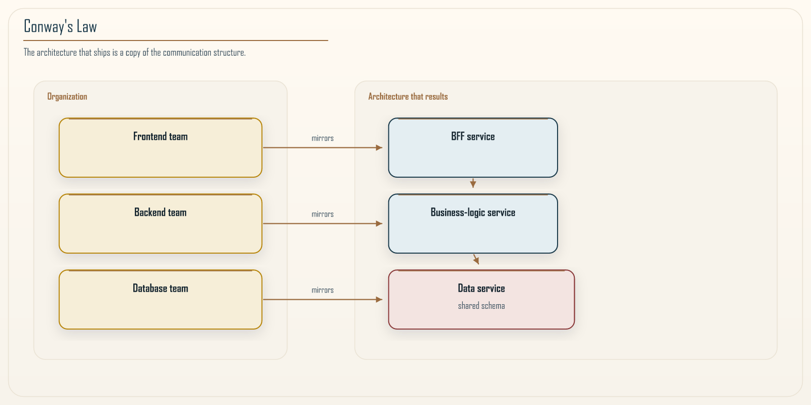
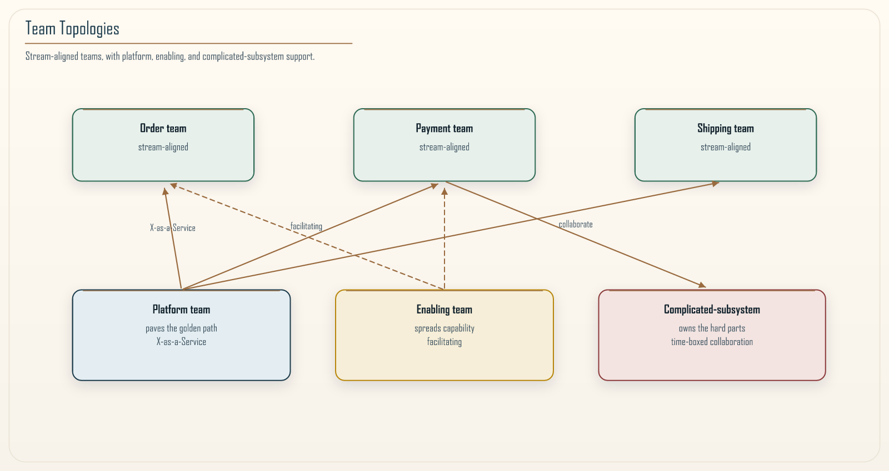

# Chapter 2: Design Principles and Patterns

<div class="chapter-header">
  <h2 class="chapter-subtitle">The Distributed Monolith: Diagnosis and First Remedies</h2>
  <div class="chapter-meta">
    <span class="reading-time">📖 40 min read</span>
    <span class="difficulty">🎯 Advanced</span>
  </div>
</div>

> *"Part I: The Sociotechnical Substrate"*
> **Focus:** The distributed monolith is an organizational mirror. Treat the technical and social halves as one problem.

Chapter 1 argued that a microservice is defined by whether a boundary earns its distributed cost, and it named the distributed monolith as the failure that results when a boundary does not. This chapter is a field guide to that failure: what it is, why it emerges even from capable teams, how to recognize its specific forms, and the concrete techniques that prevent it. If Chapter 1 was the thesis, this chapter is the diagnosis and the first set of remedies.

I want to make one point up front that shapes everything here. **The distributed monolith is almost never a technical accident.** It is an organizational mirror, the predictable result of a team structure and a set of habits reflected into the architecture. That means the remedies are partly technical, contract testing and resilience engineering, and partly organizational, team boundaries and communication structure, and a fix that addresses only one half will fail. This chapter treats both halves as one problem, because they are.

## 2.1 The phenomenology of the distributed monolith

The move from a monolith to microservices is sold as a cure for legacy stagnation: faster releases, independent scaling, freedom to use the right technology per service. The promise is real when the decomposition is done well. The gap between that promise and the deployed reality is where distributed monoliths live, and it is a wide gap.

A distributed monolith is a system made of multiple separately deployed services that nonetheless lacks the one property that defines a real microservice architecture: loose coupling. In this state you pay every cost of distribution, network latency, serialization, partial failure, and the difficulty of tracing a request across services, and you collect none of the benefits of agility or independence. It is the rigidity of a monolith combined with the unreliability of a network, which is genuinely the worst of the available worlds.

It is rarely chosen on purpose. It emerges when teams decompose along technical layers rather than business domains, splitting the user interface, the business logic, and the data access into separate services. The result is a system where every business function requires a synchronous conversation across several services, which recreates the tight coupling of the monolith over a transport that is slower and less reliable than a function call. The boxes moved apart on the diagram. The coupling stayed exactly where it was.

### 2.1.1 The arithmetic of chatty failure

Chapter 1 attached a number to the chatty interface. The same arithmetic is the diagnostic here, because it is how a layered split announces itself in production. The core error is a violation of the fallacies of distributed computing, particularly the ones about reliability and latency. When you slice a monolith along technical layers, the pieces must talk constantly to do even simple work, and that chattiness attacks availability directly, because availability multiplies across a synchronous chain.

If a single user action such as checkout triggers fifty synchronous internal calls, the combined availability is each call's availability raised to the number of calls:

```
A_system = A_service ^ n
```

At a respectable 99.9 percent per call across fifty hops:

```
A_system = 0.999 ^ 50 ≈ 0.951, or 95.1 percent
```

One request in twenty fails purely because of the architecture, even with bug-free code. And 99.9 percent is optimistic for internal services during deployment windows. At a more realistic 99 percent per call, the chain collapses:

```
A_system = 0.99 ^ 50 ≈ 0.605, or 60.5 percent
```

Hold the model as Chapter 1 held it. The formula assumes independent failures and no retries. Correlated failures, a shared region, a shared datastore, a shared certificate, make the combined success worse. Retries can make it worse still. Fifty hops is a pedagogical extreme. The shape of the damage appears much earlier, in an eight-call checkout that still has to earn every hop.

This arithmetic explains ghost outages: the periods where every service shows green on its own dashboard yet user transactions fail, because timeouts and transient glitches cascade through the tight coupling. The latency tail is punished the same way. The ninety-ninth percentile latency of the whole is not the average of the tails. Under ordinary addition of independent tails it is closer to the *sum*, so the system is only as fast as the pile of its slowest dependencies, and it has many of them.

### 2.1.2 A taxonomy of coupling: connascence

To diagnose a distributed monolith you have to look past the deployment diagram at the nature of the coupling, and coupling is not binary. It is a spectrum. Meilir Page-Jones's concept of connascence gives a precise vocabulary for that spectrum. What follows is the distributed-systems reading of that vocabulary, not a complete catalog of Page-Jones's original forms. In a distributed monolith you find high degrees of it binding services together as tightly as if they were compiled into one binary.

**Connascence of identity, read here as spatial coupling.** Service A must know how to reach service B, and B must be there. Service discovery tools like Consul, Eureka, or AWS Cloud Map remove the hard-coded addresses, but the dependency on B being available *right now* remains. Asynchronous messaging softens this: A publishes to a broker and does not care where B is, or whether B is up at this instant. It does not remove the other forms. A message with a status code of 5 still has to mean the same thing on both sides.

**Connascence of meaning, or semantic coupling.** A and B share an implicit understanding of a value, for example that a status of 5 means shipped. If the shipping service later decides 5 means delivered, or adds a status 6, the order service silently breaks or corrupts data. This is rampant wherever services share a database, because the schema becomes a rigid shared interface that cannot evolve without coordinating every team that touches it. Contract tests catch renamed fields. They do not catch a field that kept its name and changed its meaning. Section 2.5.1 returns to that gap.

**Connascence of timing, or temporal coupling.** A needs B to process a request *right now* to complete its own transaction. This is the most damaging form in distributed systems, because it forbids asynchronous processing and creates backpressure vulnerability: if B slows down, A's thread pool fills, and the failure cascades upstream. Temporal coupling turns independent services back into a single fragile failure domain.

**Connascence of algorithm.** Multiple services must agree on a specific algorithm, a shared checksum, or a duplicated tax calculation spread across cart, checkout, and invoice. When the rule changes, every service must be updated and deployed together or the data goes inconsistent, which is lock-step deployment wearing a different hat.

That last form is easy to misread as an argument for a shared library. It is the opposite. If three services must compute the same tax, the rule needs *one owner*, a service or a module that publishes the result, not three copies of the formula and not a JAR that all three must bump in lock-step. Section 2.1.3 is about incidental sharing. This paragraph is about a canonical business rule. Duplicate the first. Do not fork the second.

### 2.1.3 The shared-library trap

A subtle and common route to the distributed monolith is the shared library. In monolithic development the principle of do not repeat yourself is paramount, and developers are trained to extract shared logic, data transfer objects, utilities, domain classes, into a shared package.

In microservices, indiscriminate shared libraries create binary coupling. If the billing service and the shipping service both depend on a common library at version 1.0, and billing needs a change to the customer object that lives in that library, the library goes to 1.1, and now shipping must also rebuild, retest, and redeploy to avoid serialization or classpath conflicts, even though it needed nothing. This forces lock-step deployment, and the shared library becomes a class every team must touch, breeding merge conflicts and coordination meetings.

The heuristic that follows is one of the most counterintuitive in this book, and one of the most important: **in microservices, prefer duplication over coupling.** It is better to keep two slightly different customer classes, one for billing with payment tokens and one for shipping with address details, than to tie the release cycles of two teams together through a shared binary. The do-not-repeat-yourself principle applies within a service boundary, not across boundaries, and forgetting that is how a well-intentioned refactor recreates the monolith.

The heuristic has a limit, and ignoring the limit produces a different mess. Platform libraries, a logging facade, an OpenTelemetry wrapper, an authenticated HTTP client, are not domain coupling if they are versioned, backward compatible, and free of business meaning. Those are the paved road. The dangerous libraries are the ones that smuggle a shared domain model across team boundaries: `Customer`, `OrderStatus`, `MoneyUtil` that also knows how to apply a promotion. Duplicate those. Share the pavement.

## 2.2 The sociotechnical origin: Conway's Law

To understand why capable, well-intentioned teams build distributed monoliths, you have to look past technology to the mechanism Melvin Conway identified. Architecture is rarely a purely technical outcome. It is a reflection of the communication structure of the organization that produced it.

### 2.2.1 The mirror

In his 1968 paper, *How Do Committees Invent?*, Conway observed that organizations which design systems are constrained to produce designs that copy the communication structures of those organizations. This is now called Conway's Law, and it says the interface structure of a software system will mirror, in the precise sense of a homomorphism, the social structure of the group that built it.


*Figure 2.1: Conway's Law made visible. On one side, an organization chart with its teams and reporting lines. On the other, the system those teams produced, with service boundaries that line up one-for-one with the team boundaries. The mapping is not a coincidence but a homomorphism: the communication structure of the organization is reproduced as the interface structure of the software, whether or not anyone intended it, which is why you cannot fix an architecture without also addressing the organization that shaped it.*

The consequence for microservices is direct. When an organization built from functional silos, a database team, a backend team, a frontend team, tries to build microservices, the communication costs dictate the result. The backend team talks mostly to itself and occasionally to the database team, so it produces a single backend service against a single database. If forced to split, it produces a layered distributed architecture that mirrors the silos: a data service mirroring the database team, a business-logic service mirroring the backend team, and a backend-for-frontend service mirroring the frontend team. That is not a microservice architecture. It is a monolith cut into network-separated tiers, and the teams still coordinate on every release, because the social boundaries are rigid and the technical boundaries inherited that rigidity.

### 2.2.2 The Inverse Conway Maneuver

Once you see the causality, you can use it. The Inverse Conway Maneuver, named by Thoughtworks around 2010, says that to get a specific technical architecture, decoupled independently deployable services, you first reshape the organization to match the architecture you want, and let Conway's Law push the software into that shape. It turns Conway's Law from a description into a design tool: instead of fighting the organization to build the software, you design the organization so the software falls into the desired form.

In practice this means three moves.

1. **Identify bounded contexts** using domain-driven design, so teams align to business domains like order fulfillment or customer acquisition rather than to technical layers.
2. **Form stream-aligned teams** that hold every skill needed to ship value in that domain: developers, testers, data specialists, product. Keep them small, around five to eight people, in line with the two-pizza rule and the innermost of Dunbar's layers, the handful of people you can hold in close working trust. Dunbar's famous 150 is the casual-acquaintance ceiling, not a team size.
3. **Restrict inter-team communication bandwidth.** When team A cannot casually grab team B to renegotiate a schema, they are forced to define a clear, stable, versioned API contract instead. The friction of social communication forces the formalization of technical interfaces, which is exactly the decoupling you wanted.

The maneuver is not magic, and it is worth stating its limit plainly. As Mathias Verraes put it, a reorganization cannot fix a broken design. If you reorganize teams around a codebase that is a big ball of mud without also refactoring the code, you get cognitive dissonance: the code demands coordination that the new org chart discourages, and velocity drops as the two fight. The Inverse Conway Maneuver has to be paired with a technical strategy that aligns the code to the new team boundaries, which is precisely the role of the strangler fig pattern in Chapter 19.

## 2.3 Case studies in entropy

Definitions instruct; history convinces. Three well-documented cases show the distributed monolith and its avoidance in the wild.

**A composite banking transformation, 2018 to 2023.** Under pressure from fintech challengers, many large banks tried to decouple from their mainframes by placing an anti-corruption layer or API gateway in front of the core and spinning up hundreds of microservices for digital channels. The trap was data. Rather than migrating data out of the mainframe, the new services read directly from a replicated operational data store or a change-data-capture stream that mirrored the legacy schema. That coupled every service to the legacy data model, so when the mainframe expanded an account-number field from ten to twelve digits, dozens of services broke at once. No service truly owned the data, validations were duplicated and inconsistent, and within eighteen months deployments had become fear-driven release-train events with forty-plus stakeholders in the room. The banks had built a distributed system with the fragility of the mainframe plus the latency of a network. This case is a composite drawn from a common pattern, not a single named institution. The tell is always the same: the gateway made the *calls* look modern while the *schema* stayed a shared monolith.

**Segment's retreat of the destination workers, 2017.** Segment, a customer-data platform, publicly moved a large fleet of destination workers back from microservices toward a monolith, which is a valuable counter-narrative to the hype. They had split the ingestion worker into a nanoservice per destination, one for Google Analytics, one for Salesforce, and so on, producing hundreds of repositories and services for a small team. They found themselves spending more time managing orchestration, autoscaling groups, load balancers, version conflicts, library updates, than writing features, and the services were not truly independent anyway, because a change to the core library often required redeploying all of them. The overhead of the fleet outweighed the isolation benefit. They did not abandon modularity. They abandoned *network* modularity for that workload. The lesson Segment drew is the one this book keeps returning to: microservices solve a scale problem, too many developers colliding in one codebase, not a complexity problem, and for a small team the operational overhead is a tax on velocity. They consolidated into a modular monolith and kept modularity through code boundaries rather than network boundaries, which is exactly the argument of Chapter 18.

**Uber's evolution to DOMA.** Uber scaled past four thousand microservices and hit dependency hell, a call graph so complex that no engineer could trace a request's path or predict the impact of a change. Uber did not retreat to a monolith. It evolved to a Domain-Oriented Microservice Architecture, a middle ground published in 2020. It grouped related microservices into domains, each exposing a gateway that hides the domain's internal complexity, with strict rules governing cross-domain communication. The lesson is that there is a Goldilocks size: too large and you lock up, too small and you drown in coordination, and structure must evolve with scale, because what works at a hundred engineers fails at a thousand. This is the same spectrum Chapter 1 drew, seen from the far end.

## 2.4 Cognitive load and Team Topologies

To avoid both the nanoservice trap and the distributed monolith, treat cognitive load as a primary design constraint. It is not enough for the software to be decoupled. The teams that own it must have the mental capacity to hold it. This is the same third dimension that becomes a measured signal in Chapter 11, and here it operates as a design principle.


*Figure 2.2: The Team Topologies model. Stream-aligned teams, the ones that own a business domain end to end, sit at the center, supported by platform teams that pave the golden path, enabling teams that spread capability, and complicated-subsystem teams that own the genuinely hard parts. The arrows show the three sanctioned interaction modes: collaboration, X-as-a-Service, and facilitating. Team shape is a design decision with direct architectural consequences: because of Conway's Law, arranging teams this way pushes the software toward the decoupled, domain-aligned shape you want, while the alternative of functional silos pushes it toward the distributed monolith.*

John Sweller's cognitive load theory distinguishes intrinsic load, the irreducible difficulty of the problem; extraneous load, the difficulty added by how the work is arranged; and germane load, the effort that builds useful mental models. The connection to granularity is direct. When a system is shattered into nanoservices, extraneous load explodes, because a developer must hold mental models of fifty services, their ports, their deployment quirks, and their log locations. When extraneous load exceeds the team's working memory, bug rates climb and the team enters survival mode, refusing to improve the system because they are overwhelmed just keeping it running. Over-decomposition does not reduce complexity. It relocates it from the code into the operational and cognitive burden on people, and that relocation is often a bad trade.

The Team Topologies framework from Matthew Skelton and Manuel Pais gives structures that manage this load, and one tool in particular guards against the distributed monolith: the Team API. Just as software has an interface, a team should explicitly define its interface to the rest of the organization, which reduces the fuzzy ownership that breeds coupling. A Team API documents what the team owns, how it communicates changes, how others reach it, and what its practices are. By formalizing it, casual high-bandwidth shoulder-tapping is replaced by low-bandwidth documentation, which enables the X-as-a-Service interaction mode that scaling requires.

Here is a template you can adapt for an internal developer portal:

```markdown
# Team API: Checkout Experience

## Identity and focus
- Team: Checkout Experience (stream-aligned)
- Mission: a seamless one-click checkout on web and mobile
- Bounded context: checkout, cart, payment orchestration

## Communication
- Slack: #team-checkout-dev, #team-checkout-alerts
- Sync: daily standup 10:00 ET
- Requests: JIRA project CHK for non-urgent work

## Owned services
| Service | Repo | API docs | On-call |
|---------|------|----------|---------|
| checkout-api | git/checkout-api | docs/checkout-api | schedule/checkout |
| cart-service | git/cart-service | docs/cart-service | schedule/cart |

## Versioning and release
- Semantic versioning; previous major supported for 3 months
- Release cadence: on demand through CI/CD

## Testing and quality
- Pact contracts required for all consumers of checkout-api
- All endpoints respond under 200 ms at p99
```

Filling this in for every team forces the organization to confront ownership gaps. If a service such as a legacy user database cannot be assigned to any Team API, it is an orphan, and orphans are where the decay that produces distributed monoliths begins.

## 2.5 Remediation: consumer-driven contract testing

A telltale symptom of the distributed monolith is dependence on end-to-end integration tests to verify correctness. These tests are slow, flaky, and need a full environment, the integration database problem again, and when they become unstable teams freeze deployments, which produces the lock-step deployment anti-pattern. The cure is consumer-driven contract testing, and Pact is the common tool for it.

The pattern inverts who drives the agreement. Rather than the provider guessing what consumers need, each consumer declares its expectations as a contract. The consumer, say a loan service, states what it needs from the provider, say a credit-score service: a request to a given path returns a body with these fields and types. That contract is generated during the consumer's own unit tests and published to a broker. The provider, in its own independent build, downloads the contract and replays it against itself to prove it complies. The build pipelines are now decoupled: if the provider renames a field the consumer depends on, the provider's build fails immediately, with no shared end-to-end environment required and the feedback local and instant.

Maven coordinates for Pact JVM 4.6, consumer and provider:

```xml
<dependency>
  <groupId>au.com.dius.pact.consumer</groupId>
  <artifactId>junit5</artifactId>
  <version>4.6.2</version>
  <scope>test</scope>
</dependency>
<dependency>
  <groupId>au.com.dius.pact.provider</groupId>
  <artifactId>junit5</artifactId>
  <version>4.6.2</version>
  <scope>test</scope>
</dependency>
```

The consumer side defines the contract against a local mock server. Use typed Pact matchers, not a raw JSON string. A string body often exact-matches the example values, which is a brittle contract dressed up as a type contract.

```java
@ExtendWith(PactConsumerTestExt.class)
@PactTestFor(providerName = "CreditScoreService")
public class LoanConsumerTest {

    @Pact(consumer = "LoanService")
    public V4Pact createPact(PactDslWithProvider builder) {
        Map<String, String> headers = new HashMap<>();
        headers.put("Content-Type", "application/json");

        return builder
            // 'given' declares the provider state, which avoids depending on a
            // shared preloaded database and keeps the test self-contained.
            .given("Customer 123 has a high credit score")
            .uponReceiving("A request for a credit check")
            .path("/credit-scores/123")
            .method("GET")
            .willRespondWith()
            .status(200)
            .headers(headers)
            .body(new PactDslJsonBody()
                .stringType("customerId", "123")
                .integerType("score", 850)
                .stringMatcher("status", "EXCELLENT|GOOD|FAIR|POOR", "EXCELLENT"))
            .toPact(V4Pact.class);
    }

    @Test
    @PactTestFor(pactMethod = "createPact")
    void testCreditCheck(MockServer mockServer) {
        RestTemplate restTemplate = new RestTemplate();
        String url = mockServer.getUrl() + "/credit-scores/123";
        CreditScoreResponse response = restTemplate.getForObject(url, CreditScoreResponse.class);
        assertThat(response.getScore()).isEqualTo(850);
        assertThat(response.getStatus()).isEqualTo("EXCELLENT");
    }
}
```

The provider side downloads the published contract and verifies its real controller satisfies it. In a pipeline, replace `@PactFolder` with `@PactBroker`. The `LocalServerPort` import below is the Spring Boot 3 location.

```java
@ExtendWith(SpringExtension.class)
@SpringBootTest(webEnvironment = SpringBootTest.WebEnvironment.RANDOM_PORT)
@Provider("CreditScoreService")
@PactFolder("target/pacts")
public class CreditScoreProviderTest {

    @LocalServerPort
    int port;

    @BeforeEach
    void setup(PactVerificationContext context) {
        context.setTarget(new HttpTestTarget("localhost", port));
    }

    @TestTemplate
    @ExtendWith(PactVerificationInvocationContextProvider.class)
    void verify(PactVerificationContext context) {
        context.verifyInteraction();
    }

    @State("Customer 123 has a high credit score")
    public void highCreditScoreState() {
        // Seed a mock repository with the data this state names.
        // Do not point this at a shared database.
    }
}
```

The benefits are speed, because there is no need to stand up the loan service to test the credit-score service and the test runs in milliseconds; stability, because there are no flaky calls to shared environments; and governance, because if the provider changes the score field from an integer to a string, the provider's own pull-request build fails before the change reaches any shared environment.

### 2.5.1 What contract testing does not catch

Contract testing is powerful, and it is not a complete safety net, so it is worth being honest about its limits before you lean on it. A contract verifies structure and types: that the provider returns the fields the consumer expects, in the shapes it expects. It does not verify meaning. If the provider keeps returning a field called `status` with the value `EXCELLENT` but quietly changes what `EXCELLENT` implies downstream, the contract still passes while the semantics have drifted, which is connascence of meaning slipping through a test that only checks connascence of name and type. Guard against this by writing contracts around the behavior that matters, including provider states that pin the meaning, and by treating a semantic change as a new version even when the shape is unchanged.

The second limit is discipline. A contract is only as good as its currency, and a consumer that stops updating its contract as its real needs change is testing against a fiction. The broker helps here, because it records which consumers depend on which provider versions and can block a provider change that would break a live consumer, but the practice only works if teams treat a failing contract as a real failure rather than as noise to be suppressed. Contract testing decouples pipelines beautifully when the organization respects the contracts, and it decays into theater when it does not, which is one more place where the sociotechnical and the technical are the same problem.

A third limit, so it does not hide behind the first two: a Pact interaction is not a performance test, not an authorization test, and not a proof that the provider's *other* consumers still work. It is a proof that *this* consumer's declared needs are still met. Keep a thin slice of end-to-end tests for the journeys that money or safety depend on. Replace the rest.

## 2.6 Resilience as an architectural requirement

Escaping the distributed monolith means accepting that failure is not an anomaly but the steady state. In a distributed system, network partitions, latency spikes, and hardware failures happen continuously, and an architecture that assumes they do not is fragile by construction.

Netflix built its resilience culture on this assumption when it moved from a monolithic DVD-rental application to global streaming. Its Simian Army, most famously Chaos Monkey, randomly terminated production instances during business hours. This was not only a testing tool. It was a policy enforcement engine: by killing instances, Netflix forced developers to build stateless services, because a service that relied on sticky sessions or local disk broke immediately in production and had to be re-architected to externalize its state. The discipline was baked in by making the failure unavoidable, which is the same logic Chapter 13 develops into chaos engineering as a full practice.

Today you do not build custom monkeys. AWS Fault Injection Service lets you define experiments as code, integrated into the pipeline. A minimal experiment that terminates a fraction of a service's instances to test recovery looks like this. `PERCENT(n)` is the FIS selection mode, not `percent(n)`. An empty `stopConditions` array is how a staging experiment becomes an outage. Pair the action with a CloudWatch abort alarm, and put the experiment on the compute you actually run, ECS tasks or EKS nodes, not a leftover EC2 example, when that is the topology.

```json
{
  "description": "Terminate 20% of OrderService instances to test recovery",
  "roleArn": "arn:aws:iam::123456789012:role/fis-experiment-role",
  "targets": {
    "OrderServiceInstances": {
      "resourceType": "aws:ec2:instance",
      "resourceTags": { "Service": "OrderService", "Env": "Staging" },
      "selectionMode": "PERCENT(20)"
    }
  },
  "actions": {
    "terminateInstances": {
      "actionId": "aws:ec2:terminate-instances",
      "parameters": {},
      "targets": { "Instances": "OrderServiceInstances" }
    }
  },
  "stopConditions": [
    {
      "source": "aws:cloudwatch:alarm",
      "value": "arn:aws:cloudwatch:us-east-1:123456789012:alarm:OrderServiceErrorRateHigh"
    }
  ]
}
```

The rule that follows is simple, and it is a gate, not a proof: **a microservice is not production-ready until it has survived a chaos experiment in staging, with an abort condition and a stated steady-state hypothesis.** Staging does not have production traffic, data, or blast radius, so survival there is necessary and not sufficient. Chapter 13 is where the experiment becomes evidence rather than a checklist.

This prevents the fragile-monolith anti-pattern, where services are nominally distributed but operationally brittle, and it is the reason resilience testing belongs in the definition of done rather than in a separate initiative that never quite happens.

## 2.7 The feedback loop, and a terminology reference

The through-line of this chapter is that architecture is a feedback loop, not a static drawing. The organization shapes the architecture through Conway's Law. The architecture imposes cognitive load on the teams. The cognitive load determines how those teams perform, which over time reshapes the organization. The senior architect's job is to intervene in that loop deliberately, using the Inverse Conway Maneuver to shape teams, consumer-driven contracts to decouple pipelines, and resilience engineering to make failure survivable, so the system stays a set of loosely coupled services rather than drifting into a fragmented distributed monolith.

The distributed monolith, in the end, is what you get when a team adopts the syntax of microservices, containers, orchestration, REST, without adopting the grammar of distributed systems, bounded contexts, asynchrony, eventual consistency, and decentralized ownership. Chapter 1 gave the thesis and this chapter gave the diagnosis. The chapters that follow supply the grammar in detail.

The terms introduced here recur throughout the book, so they are collected for reference.

| Term | Meaning |
|------|---------|
| **Distributed monolith** | Microservice deployment artifacts with monolithic coupling; the failure this chapter diagnoses |
| **Connascence** | A vocabulary for coupling strength, spanning identity, meaning, timing, and algorithm |
| **Conway's Law** | Systems mirror the communication structure of the organizations that build them |
| **Inverse Conway Maneuver** | Reshaping teams to push the software toward a desired architecture |
| **Homomorphism** | The structure-preserving mapping between organization and system that Conway's Law describes |
| **Consumer-driven contract testing** | Consumers declare expectations as contracts that providers verify, decoupling pipelines (Pact) |
| **Cognitive load** | The mental effort a system demands of its team, spanning intrinsic, extraneous, and germane |
| **Team API** | A team's explicit interface to the rest of the organization, reducing social coupling |
| **X-as-a-Service** | The Team Topologies interaction mode in which one team consumes another with low, formal bandwidth |

## 2.8 Summary

The distributed monolith is the central failure of careless decomposition: separately deployed services that kept their coupling, paying the full cost of distribution for none of its benefits. Its arithmetic is merciless, because synchronous availability multiplies down a chain, so a chatty design fails a meaningful fraction of requests by construction. Diagnose it through the lens of connascence, watching especially for temporal coupling and the shared-library trap, and remember the counterintuitive rule that in microservices you prefer duplication over coupling for incidental sharing, because the do-not-repeat-yourself principle stops at the service boundary. Canonical business rules still need one owner. Do not fork the tax formula and call it autonomy.

Above all, the distributed monolith is an organizational mirror. Conway's Law guarantees that a system reflects the communication structure that built it, so functional silos produce network-separated tiers that still deploy in lock-step. The Inverse Conway Maneuver turns that law into a tool by shaping stream-aligned teams around bounded contexts, formalizing each team's interface with a Team API, and letting the software fall into the decoupled shape, paired with a technical strategy because a reorganization alone cannot fix a broken design. Treat cognitive load as a design constraint so you avoid both over-decomposition and unownable services, decouple your build pipelines with consumer-driven contracts instead of flaky end-to-end tests, and make failure survivable by requiring every service to pass a gated chaos experiment before it is production-ready. The history bears this out, from the banking transformations that recoupled through shared data, to Segment's retreat to a modular monolith, to Uber's evolution into domains. The next chapter turns to strategic Domain-Driven Design, where these principles become a way to find the seams before you cut the code. The filename still says "service communication." The chapter is about language, bounded contexts, and context maps. Read the title on the page, not the path.

---

**Navigation:**
- [Previous: Chapter 1](01-introduction-to-microservices.md)
- [Next: Chapter 3](03-service-communication.md)
