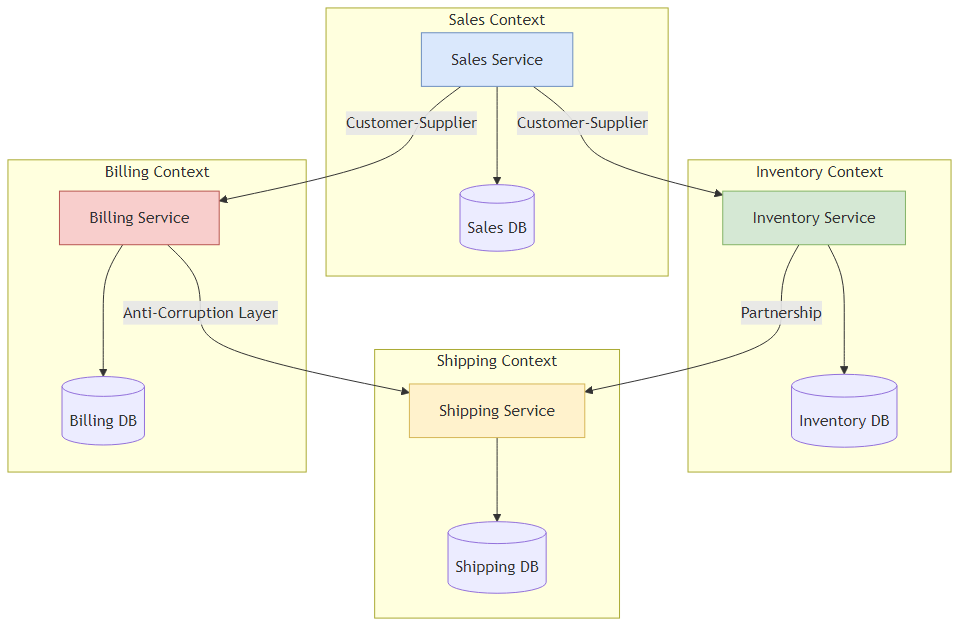
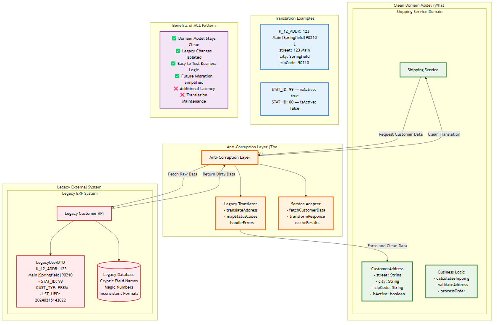

# Chapter 3: Service Communication

<div class="chapter-header">
  <h2 class="chapter-subtitle">Strategic Decomposition: Domain Driven Design</h2>
  <div class="chapter-meta">
    <span class="reading-time">📖 30 min read</span>
    <span class="difficulty">🎯 Advanced</span>
  </div>
</div>

> *"Total unification of the domain model for a large system will not be feasible or cost effective."*  
> **— Eric Evans, Domain Driven Design**

If Conway’s Law (Chapter 2) describes the human topology of a system, Domain Driven Design (DDD) describes its semantic topology.

For the Senior Architect, DDD is often misunderstood. It is frequently conflated with its "Tactical" patterns Entities, Value Objects, Repositories, and Aggregates. While these patterns are vital for

Writing clean code within a service, they do not solve the distributed system problem. You can build a perfectly valid "Aggregate" and still create a Distributed Monolith if that Aggregate is the wrong size or coupled to the wrong things.

The Architect's primary concern is Strategic Design: determining where the model stops being valid. The single biggest cause of microservice failure is the attempt to create a "Single Source of Truth" for complex concepts like "Customer" or "Product" across the entire enterprise. This creates a Semantic Lock—a rigid dependency where every team must agree on a single definition, paralyzing velocity.

To decouple the system, we must first decouple the language.

3.1 The Linguistic Boundary: Bounded Contexts

In monolithic architecture, we strive for unification. We want one User table, one Product class, and one Order service. We normalize data to eliminate redundancy. In distributed architecture, this goal is an anti-pattern.

3.1.1 The Polysemy Problem

In linguistics, polysemy has the capacity for a word to have multiple related meanings. In enterprise software, polysemy is the enemy of decoupling.
Consider the concept of a "Book" in a large publishing house:

**Context A (Editorial):** A "Book" is a manuscript. It has drafts, edits, a word count, and an author relationship. It does not have a price or dimensions yet.

**Context B (Printing/Logistics):** A "Book" is a physical object. It has dimensions (H × W × D), paper weight, binding type, and warehouse location. It does not care about the plot or the author.

**Context C (eCommerce/Sales):** A "Book" is a product SKU. It has a price, a star rating, a cover image, and shipping eligibility.

**Context D (Legal/Rights):** A "Book" is an intellectual property asset with territories, royalty percentages, and expiration dates.

## The Monolithic Mistake:
The novice architect attempts to create a single Book entity that satisfies all these needs.

```java

// The "God Class" Anti  Pattern
public class Book {
    private String isbn;
    private String title;          // Editorial
    private String authorId;       // Editorial
    private double weightKg;       // Logistics
    private String warehouseBin;   // Logistics
    private BigDecimal price;      // Sales
    private double royaltyRate;    // Legal
    private List<Contract> rights; // Legal
    //... 50 more fields...
}
```

This class becomes a dependency magnet. If the Logistics team needs to change how they track warehouse bins, they must modify the Book class, potentially breaking the Editorial system. The Book service becomes a bottleneck where all requirements converge.
## The Distributed Solution (Bounded Contexts):
We accept that "Book" means different things in different contexts. We create distinct models for each.

- **Editorial Context:** Manuscript
- **Logistics Context:** StockItem  
- **Sales Context:** Product
- **Legal Context:** Asset

These models are linked only by an ID (e.g., ISBN). They share nothing else. This is the Bounded Context: the specific boundary within which a model applies.

3.1.2 Problem Space vs. Solution Space

A common point of confusion for architects is the distinction between Subdomains and Bounded Contexts.

**The Problem Space (Subdomains):** This is the reality of the business. It exists whether you write software or not.

- **Core Domain:** The "Secret Sauce." The thing that makes money (e.g., Search Ranking for Google).
- **Supporting Subdomain:** Necessary work, but not a differentiator (e.g., Catalog Management).
- **Generic Subdomain:** Solved problems (e.g., Identity/Auth, Payments, General Ledger).

**The Solution Space (Bounded Contexts):** This is the software you write.

## The Strategic Mapping:
Ideally, one Bounded Context maps to one Subdomain.

**Success Scenario:** The "Recommendation Engine" (Core Domain) is its own microservice (Bounded Context). The team works exclusively on algorithms.

**Failure Scenario:** The "Recommendation Engine" is mixed into the "Catalog Service" (Supporting Subdomain). The algorithms team cannot deploy because the Catalog team is fixing a CRUD bug.

## Architect's Heuristic:
Invest your best talent in the Core Domain. Buy or outsource Generic Subdomains. Do not build your own Identity Provider unless you are Okta. Do not build your own Ledger unless you are a bank.

3.2 Context Mapping: The Politics of Code

Once you have identified your contexts (and potential microservices), you must define how they interact. This is Context Mapping. It is as much a political activity as a technical one, as it describes the power dynamics between teams.

Static architecture diagrams (boxes and arrows) lie. They imply that all connections are equal. In reality, the relationship between "Billing" and "Sales" is very different from the relationship between "Sales" and "Mainframe Legacy."

3.2.1 The Seven Relationships

The Senior Architect uses these patterns to categorize dependencies and calculate the "coupling tax."

| Pattern | Definition | Power Dynamic | Coupling Risk |
|---------|------------|---------------|---------------|
| **Partnership** | Two teams work together on two contexts that succeed or fail together. | Cooperative. High bandwidth communication required. | **High.** Synchronization of deployment is often required. Avoid this for long-term stability. |
| **Shared Kernel** | Two teams share a subset of the model (e.g., a shared JAR library). | Cooperative. "If you change it, you break me." | **Extreme.** Changes to the kernel require consensus. Keep the kernel tiny (e.g., basic types like Money, CountryCode). |
| **Customer-Supplier** | Upstream (Supplier) provides a service to Downstream (Customer). Suppliers can veto changes. | Upstream Dominance. Supplier dictates the schedule. | **Medium.** Downstream is dependent on Upstream's roadmap. |
| **Conformist** | Downstream has no influence over Upstream. Example: Integrating with Amazon API or a massive Legacy ERP. | Dictatorship. "Take it or leave it." | **High.** Downstream models are polluted by Upstream concepts. |
| **Anti-Corruption Layer (ACL)** | Downstream builds a translation layer to isolate itself from Upstream. | Defensive. Downstream protects its purity. | **Low.** Decouples the domain models at the cost of complexity. |
| **Open Host Service (OHS)** | Upstream provides a standardized, public API for many consumers. | Service Provider. Upstream commits to backward compatibility. | **Low.** Standard REST/gRPC contracts with strict versioning. |
| **Published Language** | A standard interchange format (e.g., iCal, XML standards) used by both. | Standardized. Neither side owns the format. | **Low.** Very loose coupling. |

3.2.2 The Context Map Visualization

The Architect must maintain a live Context Map. Unlike a UML diagram, this map includes the quality of the connection.


*Figure 3.2: Context map showing relationships between bounded contexts with different coupling patterns and power dynamics*

**Analysis:** The Recommendation Service "Conforms" to Identity (it just uses the UserID provided). However, it uses an ACL to talk to the Mainframe. Why? Because the Mainframe uses obscure COBOL data structures that we do not want leaking into our modern Python recommendation algorithms.

3.3 The Anti-Corruption Layer (ACL): The Migration Bridge

The Anti-Corruption Layer is the most critical pattern for modernizing legacy systems. It allows you to build a new, clean microservice that interacts with a "Big Ball of Mud" monolith without becoming infected by the monolith's bad design.


*Figure 3.1: Anti-Corruption Layer pattern protecting clean domain models from legacy system complexity through translation and adaptation layers*

### 3.3.1 Anatomy of an ACL

The ACL consists of three components:

1. **Facade:** A clean interface that matches the Downstream (new) domain model.
2. **Adapter:** The code that physically talks to the Upstream system (SQL, SOAP, REST).
3. **Translator:** The logic that maps the ugly Upstream data to the clean Downstream objects.

### 3.3.2 Implementation: Java/Spring Boot Example

**Scenario:** A new ShippingService needs address data from a 30-year-old LegacyERP. The ERP stores addresses in a single pipe-delimited string column called K_12_ADDR and uses 99 for "Active" users.

**The Goal:** The ShippingService domain model should have a clean Address object and a boolean isActive. It should never see K_12_ADDR.

```java

// 1. The Domain Model (Clean    What we want)
package com.shipping.domain;

public record CustomerAddress(
    String street, 
    String city, 
    String zipCode, 
    boolean isActive
) {}

// 2. The Legacy Data Structure (Dirty    What we get)
package com.shipping.infrastructure.legacy;

public class LegacyUserDTO {
    public String K_12_ADDR; // "123 Main St|Springfield|90210"
    public int STAT_ID;      // 99 = Active, 00 = Deleted
}

// 3. The Translator (The Logic)
@Component
public class LegacyTranslator {
    public CustomerAddress translate(LegacyUserDTO dirty) {
        if (dirty == null) return null;

// Decrypt the legacy pipe  delimited madness
        String parts = dirty.K_12_ADDR.split("\\|");
        String street = parts.length > 0? parts : "";
        String city   = parts.length > 1? parts[1] : "";
        String zip    = parts.length > 2? parts[2] : "";

// Map Magic Numbers to Boolean
        boolean active = (dirty.STAT_ID == 99);

return new CustomerAddress(street, city, zip, active);
    }
}

// 4. The Facade / Service Adapter (The Gatekeeper)
@Service
public class CustomerProfileAdapter implements CustomerProfilePort {
    private final LegacyClient legacyClient;
    private final LegacyTranslator translator;

public CustomerAddress getProfile(String customerId) {
        LegacyUserDTO rawData = legacyClient.fetchUser(customerId);
        // The ACL ensures rawData never escapes this method
        return translator.translate(rawData);
    }
}
```
## Trade-off Analysis:

**Pro:** The ShippingService core logic is pristine. If the Legacy ERP changes K_12_ADDR to comma delimited, you only change the LegacyTranslator. The domain logic remains untouched.

**Con:** Latency. You are adding an object allocation and string parsing step to every call. Maintenance. You now own a translation layer that must be kept in sync.
## Recipe 3.1: Facilitating an Event Storming Workshop
**Problem:** How do you find the correct Bounded Contexts in the first place?

## Solution: Event Storming. 

Invented by Alberto Brandolini, this is a workshop format for rapidly exploring complex business domains. It is the antidote to "Analysis Paralysis."

It is not a "meeting." It is a massive, visual collaborative modeling session.

## Phase 1: Preparation

**The Room:** You need a wall. A really big wall (at least 5 meters). Remove all chairs. People must stand.

**The Participants:** You need the "Questions" (Developers) and the "Answers" (Domain Experts/Business Stakeholders). If the Domain Experts are not there, cancel the session.

**Materials:** Sticky notes in specific colors.

- **Orange:** Domain Events (Facts that happened).
- **Blue:** Commands (User actions/Triggers).
- **Yellow:** Actors (Users/Roles).
- **Purple:** Policies (Business Rules: "Whenever X happens, do Y").
- **Pink:** External Systems (Payment Gateway, SAP).
## Phase 2: The Workshop Script (The Senior Architect's Protocol)

## Step 1: Chaotic Exploration (The Brain Dump)

**Time:** 20 Minutes.

**Instruction:** "Write down every event that happens in the system on an Orange sticky note. Use Past Tense (e.g., OrderPlaced, PaymentFailed, ItemShipped). Do not organize them yet."

**Goal:** Quantity over quality. Get the domain knowledge out of people's heads and onto the wall.

## Step 2: Enforce the Timeline

**Time:** 30-45 Minutes.

**Instruction:** "Arrange the events chronologically from left to right."

**Observation:** Arguments will start. "Does InventoryReserved happen before or after PaymentAuthorized?"

**Architect's Note:** These arguments are the gold. They reveal ambiguity. Mark these spots with a bright red "Hot Spot" sticky note to revisit later.

## Step 3: Identify Triggers (Commands & Actors)

**Time:** 40 Minutes.

**Instruction:** "What caused this event?"

**Action:** Add Blue stickies (Commands) before the events. Add Yellow stickies (Actors) who invoked the command.

**Flow:** User (Yellow) → Place Order (Blue) → OrderCreated (Orange).
## Step 4: The Semantic Coupling Check (The Pivot Points)
This is the most critical step for microservice boundaries.

The Architect’s Eye: Look for the same noun appearing in distant clusters.

In the Sales cluster, we see LeadConverted and ContractSigned. The "Customer" here is a prospect.

In the Fulfillment cluster, we see PackageShipped. The "Customer" here is a shipping address.

The Heuristic: Identify the Pivotal Events where the meaning changes.

When OrderConfirmed happens, the meaning of the data changes from "Shopping Cart" (volatile, marketing heavy) to "Shipment" (immutable, logistics heavy).

Draw a line here. This is a candidate Bounded Context boundary.
## Step 5: Draw the Contexts
Instruction: "Draw circles around clusters of events that share the same language and data consistency requirements."
## Outcome:
Circle 1: "Sales Context" (Handles leads, opportunities).

Circle 2: "Fulfillment Context" (Handles picking, packing, shipping).

Interaction: They communicate only via the OrderConfirmed domain event.
## Phase 3: From Wall to Architecture
Don't just take photos. Convert the circles into Aggregates and Services.

Sales Context becomes the Sales Microservice.

Fulfillment Context becomes the Logistics Microservice.

The "Hot Spots" (red stickies) become your Risk Register for the project.

3.4 Architect's Commentary: The Map is Not the Territory

Event Storming produces a model of behavior, not just data. Traditional ER diagrams (Entity Relationship) focus on how data is stored, which leads to tight coupling. Event Storming focuses on how data changes, which leads to loose coupling based on business processes.

Use this technique to prove your architecture before writing a single line of code. It is much cheaper to move a sticky note than to refactor a production database.

Sovereignty & The Consistency Challenge

Focus: The single hardest aspect of microservices—managing data distributed across boundaries.

---

## Summary

This chapter explored service communication in microservices architecture, providing practical insights and patterns for implementation.

## What's Next?

In the next chapter, we'll continue our journey through microservices architecture.

---

**Navigation:**
- [← Previous: Chapter 2](02-design-principles-and-patterns.md)
- [Next: Chapter 4 →](04-data-management.md)
