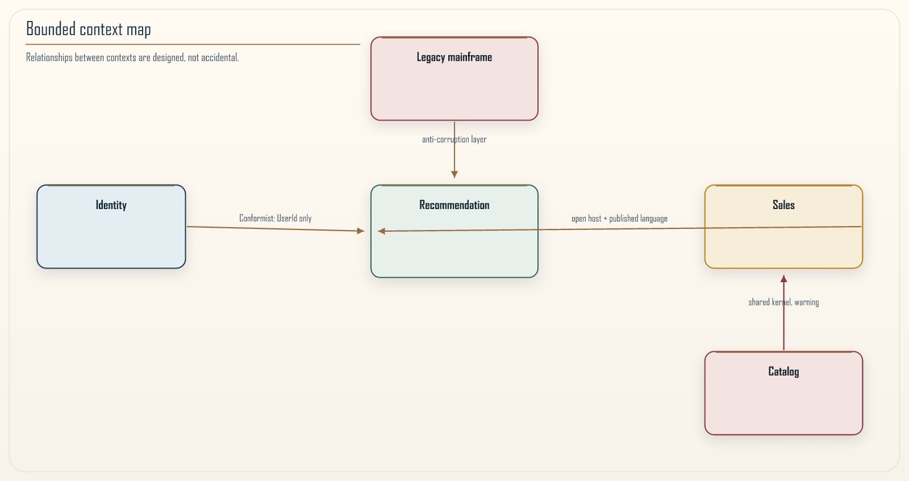
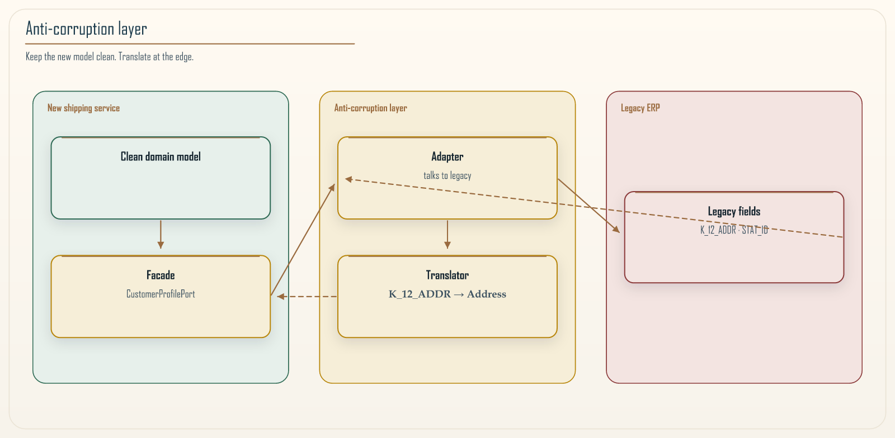

# Chapter 3: Strategic Design with Domain-Driven Design

<div class="chapter-header">
  <h2 class="chapter-subtitle">Decouple the Language Before You Decouple the Code</h2>
  <div class="chapter-meta">
    <span class="reading-time">📖 40 min read</span>
    <span class="difficulty">🎯 Advanced</span>
  </div>
</div>

> *"Part I: The Sociotechnical Substrate"*
> **Focus:** Service boundaries belong where the model's language changes.

If Conway's Law from Chapter 2 describes the human topology of a system, Domain-Driven Design describes its semantic topology: where a model stops being valid and a different model begins. This chapter is about finding those seams, because they are where service boundaries belong. Everything in this book about communication and data assumes you have first drawn the boundaries in the right places, and drawing them in the right places is a strategic-design problem before it is a technical one.

Domain-Driven Design is widely misunderstood as a bag of tactical patterns: entities, value objects, repositories, aggregates. Those matter for writing clean code inside a service, but they do not solve the distributed-systems problem, because you can build a flawless aggregate and still create a distributed monolith if the aggregate is the wrong size or coupled to the wrong things. The architect's real concern is strategic design: deciding where the model's language changes, because that is where the boundary is. The single biggest cause of microservice failure is the attempt to build one shared definition of a complex concept like customer or product across the whole enterprise, which creates a semantic lock where every team must agree on one definition and no team can move. To decouple the system, you first have to decouple the language.

## 3.1 The bounded context

In a monolith you strive for unification: one user table, one product class, one order service, data normalized to remove redundancy. In a distributed architecture that same instinct is an anti-pattern, because forcing one model across many contexts is what creates the semantic lock. The bounded context is the alternative: the specific boundary within which a single model of a concept is valid, and outside of which a different model applies.

A bounded context is a *model* boundary, not automatically a *deployable*. It can live as a module in the modular monolith of Chapter 18 until a context factor in section 3.7 says it has earned a network. Circles on a wall become candidate contexts first and services second.

### 3.1.1 Polysemy: one word, many meanings

In linguistics, polysemy is a word having several related meanings. In enterprise software, polysemy is the enemy of a single shared model, and recognizing it is the key to finding boundaries. Consider what a book is in a large publishing house. In the editorial context a book is a manuscript, with drafts, a word count, and an author, and no price or dimensions yet. In the printing and logistics context a book is a physical object, with dimensions, paper weight, binding, and a warehouse location, and it does not care about the plot. In the sales context a book is a product with a price, a rating, a cover image, and shipping eligibility. In the legal and rights context a book is an intellectual-property asset with territories, royalty rates, and expiration dates.

The novice architect tries to build one book entity that serves all of these, and it becomes a dependency magnet:

```java
// The god-class anti-pattern: one model forced to serve every context.
public class Book {
    private String isbn;
    private String title;           // editorial
    private String authorId;        // editorial
    private double weightKg;        // logistics
    private String warehouseBin;    // logistics
    private BigDecimal price;       // sales
    private double royaltyRate;     // legal
    private List<Contract> rights;  // legal
    // and dozens more fields as every context adds its needs
}
```

When the logistics team needs to change how warehouse bins work, they must modify the same class the editorial system depends on, and the book service becomes a bottleneck where every team's requirements converge and collide. The distributed solution is to accept that *book* means different things in different contexts and to build a distinct model for each: a manuscript in editorial, a stock item in logistics, a product in sales, an asset in legal.

These models are linked only by a correlation identifier and share nothing else. ISBN is the usual published language for a published book, but it is not always available and not always enough. A manuscript often has no ISBN yet; hardcover and paperback of the same work are different stock items and often different SKUs. Use an internal ID until a public identifier exists, and compose identity when one field cannot distinguish two things the business treats as different. Each model is a bounded context, and the boundary between them is exactly where a service boundary can safely fall, because the models do not need to agree on anything but how to point at the same work.

### 3.1.2 Problem space and solution space

A common confusion is between subdomains and bounded contexts, and keeping them distinct sharpens the whole analysis. Subdomains live in the problem space: they are the reality of the business, and they exist whether or not you write any software. There are three kinds. The **core domain** is the part that differentiates you, the reason you make money, such as the ranking algorithm for a search company. A **supporting subdomain** is necessary work that does not differentiate you, such as catalog management. A **generic subdomain** is a solved problem you should not be reinventing, such as identity, payments, or a general ledger.

Bounded contexts live in the solution space: they are the software you actually write. The strategic mapping you want is roughly one bounded context per subdomain. When that mapping holds, the recommendation engine, your core domain, is its own bounded context owned by a team working only on algorithms. When it breaks, the recommendation engine gets mixed into the catalog service, and the algorithms team cannot deploy because the catalog team is fixing an unrelated bug. The failure is not technical; it is that two subdomains with different rhythms were forced into one solution-space boundary.

The mapping is *roughly* one-to-one, not a law. One subdomain can justify two contexts when the languages truly diverge, two ways of talking about "risk" that cannot share a model. One context can cover a thin supporting subdomain that is not worth a team. Forcing a service per subdomain is how you get nanoservices with a DDD vocabulary.

The heuristic that follows is one of the most valuable in strategic design: **invest your best people in the core domain, and buy or outsource the generic subdomains.** Do not build your own identity provider unless you are an identity company, and do not build your own ledger unless you are a bank. Effort spent building a generic subdomain is effort stolen from the core domain that actually differentiates you. Regulated industries sometimes cannot buy the generic piece; then treat it as supporting work with a bought core, not as a place to invent a new model of money.

## 3.2 Context mapping: the politics of dependencies

Once you have identified your contexts, and therefore your candidate services, you have to define how they relate, and this is context mapping. It is as much a political activity as a technical one, because it describes the power dynamics between the teams that own the contexts. Static architecture diagrams lie by omission: boxes and arrows imply every connection is equal, when in reality the relationship between billing and sales is nothing like the relationship between sales and a legacy mainframe.

### 3.2.1 The relationship patterns

Strategic DDD names a small set of relationship patterns. Categorizing each dependency by pattern lets you see the coupling tax you are paying and who holds the power in each connection.

| Pattern | What it is | Power dynamic | Coupling risk |
|---------|------------|---------------|---------------|
| **Partnership** | Two contexts that succeed or fail together, evolved in tandem | Cooperative, high-bandwidth | High: deployments often must synchronize; use only while a product is still being discovered |
| **Shared kernel** | Two teams share a subset of the model, such as a small library | Cooperative, mutual veto | Extreme: changes need consensus; keep it to stable identifiers and vocabularies, not evolving domain objects |
| **Customer-supplier** | Upstream supplies downstream; downstream has a negotiated voice | Negotiated: the customer can demand, the supplier still ships | Medium: downstream still depends on the upstream roadmap |
| **Conformist** | Downstream has *no* influence and adopts the upstream model wholesale | Dictatorship | High: upstream concepts pollute the downstream model |
| **Anti-corruption layer** | Downstream builds a translation layer to isolate itself | Defensive | Low: decouples the models at the cost of extra code |
| **Open host service** | Upstream publishes a standard API for many consumers | Service provider | Low, *if* versioned; an unversioned host is a shared kernel over HTTP |
| **Published language** | A standard interchange format both sides use, owned by neither or by a steward | Standardized | Low: very loose coupling; often paired with an open host |
| **Separate ways** | The contexts do not integrate | Independent | None: the right answer when the integration cost exceeds the value |

Customer-supplier and conformist are easy to conflate and important to keep apart. In a customer-supplier relationship the downstream team is a *customer*: they can negotiate fields, SLAs, and dates. In a conformist relationship they cannot. Using an identity service's opaque user identifier is cheap published language. Absorbing that vendor's whole user schema into your sales model is conformist, and it is how a SaaS tenant model leaks into every bounded context.

Shared kernel deserves the same honesty Chapter 2 gave shared libraries. A kernel of `ISO-4217` currency codes is usually fine. A kernel of `Customer` or `Money` with rounding and tax rules is how two teams recouple. `Money` looks like a basic type until the first dispute about half-even rounding.

The practical use is to label every edge in your architecture with its pattern. An edge marked partnership or shared kernel is a warning: those are the couplings that force synchronized deployments and recreate the distributed monolith. An edge marked anti-corruption layer, open host service, or published language is healthier. An edge that should be separate ways and is not is the most expensive kind of courtesy integration. The map is not decoration; it is a coupling budget you can read at a glance.


*Figure 3.1: A living context map. Unlike a plain architecture diagram, every connection is labeled with its relationship pattern and its direction, so you can see not just that two contexts talk but how they are coupled and who holds the power. In the figure, the recommendation service conforms only to identity's user identifier, while it protects itself from the mainframe with an anti-corruption layer. The type of each edge matters more than its existence: a map full of anti-corruption layers and open host services is healthy, and a map full of partnerships and shared kernels is a distributed monolith waiting to happen.*

## 3.3 The anti-corruption layer

The anti-corruption layer is the most important pattern for modernizing legacy systems, because it lets you build a clean new service that talks to a big ball of mud without being infected by the mud's bad design. It is the pattern that makes gradual migration possible, and it appears again in Chapter 19 as the mechanism that keeps new and old systems apart during a strangler-fig migration.

It is not only a legacy pattern. Any upstream whose model you refuse to absorb, a partner SOAP API, a vendor SaaS, a mainframe, deserves the same membrane. The banking composite in Chapter 2 failed because teams put a gateway in front of the core and then *read the legacy schema anyway*. A gateway without a translator is not an anti-corruption layer. It is a new door into the same room.


*Figure 3.2: The anti-corruption layer as a protective membrane. On the right is a legacy system with an ugly data model. On the left is a new service with a clean domain model. Between them the layer does three jobs, shown as three components: a facade that presents the clean interface, an adapter that physically talks to the legacy system, and a translator that maps the legacy model to the clean one. Legacy concepts stop at the layer and never reach the new service, so the new service's model stays pure and the cost of the legacy system's bad design is contained in one replaceable place.*

The layer has three parts. The **facade** is a clean interface matching the new domain model. The **adapter** is the code that physically talks to the legacy system, whether over SQL, SOAP, or REST. The **translator** maps the ugly upstream data into clean downstream objects. Here is a concrete example: a new shipping service needs address data from a thirty-year-old legacy system that stores addresses as a single pipe-delimited string in a column called `K_12_ADDR` and uses the number 99 to mean an active user. The shipping service should see a clean address and a boolean, and never see `K_12_ADDR` at all.

```java
// 1. The clean domain model, what the new service wants to work with.
public record CustomerAddress(String street, String city, String zipCode, boolean isActive) {}

// 2. The legacy structure, what the old system actually returns.
public class LegacyUserDTO {
    public String K_12_ADDR;  // "123 Main St|Springfield|90210"
    public int STAT_ID;       // 99 means active, 00 means deleted
}

// 3. The translator, where the ugliness is contained.
@Component
public class LegacyTranslator {
    public CustomerAddress translate(LegacyUserDTO dirty) {
        if (dirty == null || dirty.K_12_ADDR == null || dirty.K_12_ADDR.isBlank()) {
            return null;
        }
        String[] parts = dirty.K_12_ADDR.split("\\|", -1);
        String street = parts.length > 0 ? parts[0] : "";
        String city   = parts.length > 1 ? parts[1] : "";
        String zip    = parts.length > 2 ? parts[2] : "";
        boolean active = (dirty.STAT_ID == 99);
        return new CustomerAddress(street, city, zip, active);
    }
}

// 4. The adapter and facade, the gatekeeper the rest of the service calls.
@Service
public class CustomerProfileAdapter implements CustomerProfilePort {
    private final LegacyClient legacyClient;
    private final LegacyTranslator translator;

    public CustomerProfileAdapter(LegacyClient legacyClient, LegacyTranslator translator) {
        this.legacyClient = legacyClient;
        this.translator = translator;
    }

    public CustomerAddress getProfile(String customerId) {
        LegacyUserDTO raw = legacyClient.fetchUser(customerId);
        // The raw legacy object never escapes this method.
        return translator.translate(raw);
    }
}
```

The trade-off is worth stating honestly. The benefit is that the shipping service's core logic stays pristine, and if the legacy system changes `K_12_ADDR` from pipe-delimited to comma-delimited, you change only the translator and the domain logic is untouched. The cost is latency, since every call now pays for an object allocation and string parsing, and maintenance, since you own a translation layer that must be kept in sync with the legacy system. Cache at the facade when the upstream is slow and the data can be slightly stale. That is usually a good trade, because the alternative, letting legacy concepts leak into the new model, is how the new service slowly becomes as hard to change as the thing it replaced.

## 3.4 Finding the boundaries: Event Storming

Context mapping assumes you already know your contexts. Event Storming is how you find them in the first place. Invented by Alberto Brandolini, it is a workshop format for rapidly exploring a complex business domain, and it is the antidote to analysis paralysis. It is a standing, visual, highly collaborative modeling session on a very large wall, or on a shared board if the experts are remote, and done well it reveals the true boundaries of a system in hours rather than months. Remote is fine. Guessing is not. If the domain experts are not in the session, cancel it.

### Recipe 3.1: Facilitating an Event Storming workshop

#### 3.4.1 Setting up

You need a wall at least five meters wide, or a board with the same left-to-right room, no chairs if you are in person, because people must stand and move, and two kinds of participant: the people with the questions, the developers, and the people with the answers, the domain experts and business stakeholders. The materials are sticky notes in agreed colors, and the color convention carries meaning. Use one legend and do not reuse a color for two ideas. A common big-picture set:

| Color | Meaning |
|-------|---------|
| Orange | Domain events, facts that happened, past tense |
| Blue | Commands, the actions that trigger events |
| Yellow | Actors, the users or roles who issue commands |
| Purple | Policies, rules of the form *whenever this happens, do that* |
| Pink | External systems such as a payment gateway |
| Red | Hot spots, unresolved arguments |

When you zoom from big-picture storming into design-level storming, introduce a *new* color for aggregates and another for read models. Do not recycle actor-yellow for aggregates. That single confusion is how workshops lose the difference between who acted and what was consistent.

#### 3.4.2 The workshop, step by step

The session runs in a deliberate sequence, and each step surfaces a different kind of knowledge.

**First, chaotic exploration, about twenty minutes.** Everyone writes down every event they can think of on orange notes, in the past tense, *order placed*, *payment failed*, *item shipped*, without organizing them yet. The goal is quantity, getting the domain knowledge out of people's heads and onto the wall.

**Second, enforce the timeline, thirty to forty-five minutes.** Arrange the events left to right in the order they happen. Arguments start immediately: does inventory get reserved before or after payment is authorized? Those arguments are the gold, because they reveal genuine ambiguity in how the business understands itself. Mark each dispute with a bright hot-spot note to revisit.

**Third, identify triggers, about forty minutes.** For each event, ask what caused it, and add the blue command before it and the yellow actor who issued the command, so the flow reads actor, then command, then event.

**Fourth, and most important for boundaries, the semantic coupling check.** Look for the same noun appearing in distant clusters with a different meaning. In the sales cluster the customer is a prospect; in the fulfillment cluster the customer is a shipping address. These are pivotal events, the points where the meaning of the data changes, and they are exactly where a boundary belongs. When an order is confirmed, the data stops being a volatile shopping cart and becomes an immutable shipment, so a line drawn at *order confirmed* separates two contexts that genuinely think differently.

**Fifth, draw the contexts.** Circle clusters of events that share the same language and the same consistency requirements. A sales context emerges around leads and opportunities, a fulfillment context around picking and packing, and they communicate only through the order-confirmed event that crosses between them.

To make the flow concrete, here is a small slice of an e-commerce storm as it would appear on the wall, read left to right. A shopper, the yellow actor, issues *add to cart*, a blue command, producing *item added*, an orange event. Later the shopper issues *place order*, producing *order placed*, which triggers a purple policy, *whenever an order is placed, authorize payment*, invoking the payment gateway, a pink external system, and producing *payment authorized* or *payment failed*. The *order confirmed* event follows a successful authorization, and it is the pivot: everything to its left speaks the language of a volatile shopping cart, and everything to its right speaks the language of an immutable shipment. The cluster to the left circles into a sales context and the cluster to the right into a fulfillment context, joined only by that one crossing event. A newcomer can read the whole business process off the wall in a minute, which is precisely why the technique surfaces boundaries faster than weeks of document review.

#### 3.4.3 From wall to architecture

Do not just photograph the wall. Convert the circles into *candidate bounded contexts*: the sales context, the fulfillment context, joined by the domain event that crosses the boundary. Whether each context is a module or a service is the decision in section 3.7, not a trophy for having drawn a circle. The hot spots you marked become the project's risk register, the places where the business itself is unclear and where the most careful design is needed.

The deeper reason Event Storming produces better boundaries than a traditional entity-relationship diagram is that it models behavior, how data changes, rather than storage, how data sits, and boundaries drawn around behavior are loosely coupled by business process while boundaries drawn around stored data are tightly coupled by schema. It is far cheaper to move a sticky note than to refactor a production database, so proving the architecture on the wall before writing code is one of the highest-leverage things an architect can do.

## 3.5 Tactical design: aggregates as consistency boundaries

Strategic design finds the boundaries between contexts. Tactical design works inside a context, and one tactical pattern matters so much for service boundaries that it deserves its own treatment: the aggregate. Getting aggregates right is the difference between a service that can guarantee its own invariants and one that constantly fights distributed-transaction problems it created for itself.

The tactical vocabulary is small. An **entity** is a thing with a distinct identity that persists over time, such as an order, which is the same order even as its contents change. A **value object** is a thing defined entirely by its attributes, with no identity of its own, such as a money amount or an address, which are interchangeable if their values match. An **aggregate** is a cluster of entities and value objects that are treated as a single unit for the purpose of data changes, with one entity designated the aggregate root that is the only allowed entry point.

The order aggregate, for example, might contain the order entity as its root plus its line items. Line items are often entities *inside* the aggregate, they have identity if you can cancel line 3, and sometimes they are value objects. Either is fine. What is not fine is giving a line item its own transaction boundary, or its own service, so that "order total equals sum of lines" becomes a distributed invariant.

The reason the aggregate matters for architecture is that it is the transactional consistency boundary. The design rule is that a single transaction modifies exactly one aggregate, and anything spanning multiple aggregates is handled with eventual consistency and domain events rather than one big transaction. The database engine can often update two aggregates in one commit. The rule says you should not, because that commit couples their consistency and recreates a small distributed monolith inside the schema. If the invariant is that an order total must equal the sum of its line items, that invariant lives inside the order aggregate and can be enforced in one local transaction.

This gives a practical rule for boundaries: **never split an aggregate across a service**, because splitting an aggregate turns a local invariant into a distributed one. Aggregates suggest service boundaries but do not equal them. A service usually owns one or a few closely related aggregates. One service per aggregate is the nanoservice trap with better vocabulary. When you find yourself wanting a transaction that spans two aggregates, treat it as a strong signal that either the aggregates are drawn wrong or the operation should be a saga across them, which is the subject of Chapter 5. The aggregate is where tactical DDD and the granularity thesis meet: it is the unit whose invariants must stay together, and a boundary that respects aggregate edges is a boundary that will not manufacture distributed transactions.

## 3.6 Integrating bounded contexts

Once contexts are separate services, they still have to work together, and how they integrate decides whether your clean boundaries stay clean or quietly recouple. There are two broad styles, synchronous request and asynchronous event, and the choice between them is one of the most consequential in the whole architecture.

Synchronous integration, where one context calls another and waits for the answer, is simple to reason about and appropriate when the caller genuinely needs the response to continue, such as a checkout that cannot complete without a real-time fraud decision. Even that example has an alternative: hold the order, ask fraud asynchronously, release or cancel. Use the synchronous call when the business cannot proceed without the answer *now*. Its cost is temporal coupling, the connascence of timing from Chapter 2: the caller is only as available and as fast as the callee, and a chain of synchronous calls multiplies unavailability the way Chapter 1's arithmetic showed. Every synchronous cross-context call is a coupling you should be able to justify.

Asynchronous integration, where a context publishes a domain event and other contexts react to it on their own schedule, is the default you should reach for first, because it removes temporal coupling. When the sales context confirms an order, it publishes an *order confirmed* event and moves on, indifferent to whether the fulfillment context is up at that instant, and fulfillment consumes the event when it can. The contexts are now coupled only through the event's shape, a published language, which is the loosest coupling in the context-mapping table. This is why the pivotal events you found in Event Storming are so valuable: they are exactly the domain events that should cross context boundaries, and designing integration around them keeps the contexts as independent as the business process allows.

The honest complication is consistency. Asynchronous integration means the contexts are eventually consistent, not immediately consistent: for a brief window after an order is confirmed, the fulfillment context has not yet heard about it. Most business processes tolerate this if you design for it. The ones that genuinely cannot are a signal, not an automatic merge. Sometimes the two contexts belong together. Sometimes the operation is a saga with compensation, Chapter 5. Sometimes the caller was asking a question that should have been a local read model. Merge is the right answer only when the *language* is the same and the *invariant* cannot be delayed.

The mechanics of publishing events reliably, so an event is never lost when a service crashes between committing its data and publishing, are the dual-write and outbox patterns in Chapter 6, and they are what make event-based integration trustworthy rather than a source of silent data divergence. The rule to carry forward is to prefer events over calls, justify every synchronous cross-context call, and route the reliability of event publishing through the outbox pattern rather than hoping a naive publish succeeds.

## 3.7 From boundaries to a decision, and where the metric fits

Strategic DDD gives you a qualitative answer to where the boundaries are. It does not, by itself, tell you whether a given boundary is worth the distributed cost of making it a separate service, and that quantitative question is the subject of Chapter 11 and the RVx Index. This short section connects the two without restating the metric, because the book defines it in exactly one place.

Before you reach for the metric, four qualitative context factors shape whether a boundary you found in Event Storming should become a service now, later, or never. They are not a formula; they are the conditions that the quantitative metric later makes precise.

1. **Organizational maturity.** A team of five with manual deployments should keep a modular monolith and focus on business value, while an organization of hundreds with full observability can operate many services. Granularity must match operational capability, because a small team drowning in the overhead of fifty services will fail regardless of how clean the boundaries are.

2. **Domain complexity and criticality.** Invest isolation in the core domain that changes often and differentiates you, share services for supporting subdomains, and buy generic subdomains rather than building them. Regulatory burden pushes toward coarser, more consistent boundaries in the core, because audit trails and strong consistency are easier to guarantee inside one service than across several.

3. **Technical constraint.** Tight latency budgets and strong consistency requirements push toward coarser boundaries with fewer network hops, because you cannot afford the tax or the distributed transaction, while eventual consistency and wide scaling variance make finer boundaries viable and sometimes necessary.

4. **Evolutionary stage.** A green-field system should start coarse and extract services as the domain becomes clear, a several-year-old system is a candidate for gradual strangler-fig extraction, and a legacy system needs an anti-corruption layer around it before anything is extracted. The recurring rule, which Chapter 18 argues in full, is to never start with microservices; start with a well-structured monolith and extract services as you learn.

These four factors tell you the shape of the decision. Chapter 11 turns the decision into a measurement, the RVx Index, which scores whether a specific boundary earns its cost using runtime, evolutionary, and cognitive signals, and Chapter 20 places that measurement in an organizational maturity model. The honest division of labor is that this chapter finds where the boundaries *could* be, the context factors above tell you which are plausible given your situation, and the metric in Chapter 11 tells you which actually pay for themselves. I am deliberately not restating the RVx formula here, because a source-of-truth book defines its central metric once, in one place, and every other chapter points to it rather than paraphrasing it into drift.

## 3.8 Summary

Strategic design is the part of Domain-Driven Design that decides service boundaries, and it works by decoupling the language before decoupling the code. The bounded context is the region within which one model of a concept is valid, and polysemy, the same word meaning different things in different contexts, is the signal that a boundary belongs between them; forcing one shared model across contexts creates the semantic lock that paralyzes velocity. Keep the problem space of subdomains distinct from the solution space of bounded contexts, aim for roughly one context per subdomain, invest in the core domain, and buy the generic ones. A context is a candidate service, not a deployment trophy.

Map the relationships between contexts explicitly, because the type of each dependency, from the dangerous partnership and shared kernel to the healthy anti-corruption layer, open host service, and the option to go separate ways, is a coupling budget you can read at a glance. Use an anti-corruption layer to modernize legacy systems without inheriting their bad design, accepting a little latency and maintenance to keep the new model pure, and do not confuse a gateway that still exposes the legacy schema with a real translation layer. Find the boundaries in the first place with Event Storming, which models how the business behaves rather than how its data is stored, and watch for the pivotal events where the meaning of the data changes, because those are where the boundaries belong.

Inside a context, treat the aggregate as the consistency boundary you must not split. Across contexts, prefer domain events over synchronous calls, and send any operation that must span aggregates to a saga rather than a distributed transaction. Strategic DDD gives you the qualitative map, and four context factors, organizational maturity, domain complexity, technical constraints, and evolutionary stage, tell you which boundaries are plausible for your situation. The quantitative question of whether a specific boundary earns its distributed cost is answered by the RVx Index in Chapter 11, which this chapter deliberately points to rather than restates. The next chapter takes up the hardest consequence of drawing boundaries: managing data that is now distributed across them.

---

**Navigation:**
- [Previous: Chapter 2](02-design-principles-and-patterns.md)
- [Next: Chapter 4](04-data-management.md)
