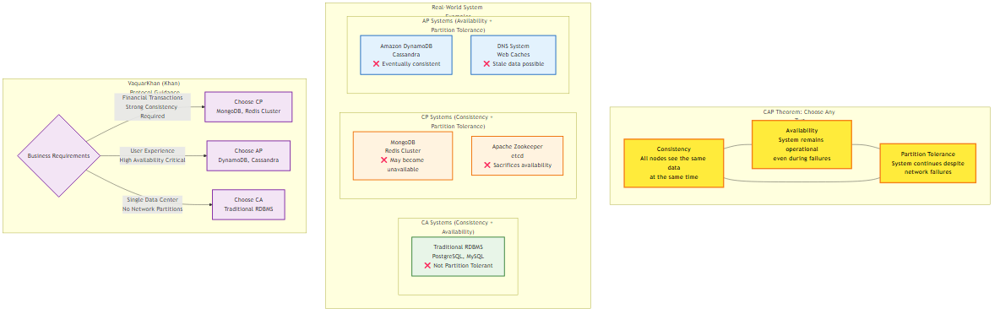

# Chapter 4: Data Management

<div class="chapter-header">
  <h2 class="chapter-subtitle">The End of ACID</h2>
  <div class="chapter-meta">
    <span class="reading-time">📖 30 min read</span>
    <span class="difficulty">🎯 Expert</span>
  </div>
</div>

## 4.1 The Illusion of Simultaneity: Beyond the Event Horizon of the Monolith

In the comfortable confines of a monolithic architecture, the database transaction is the ultimate arbiter of truth. The Atomicity, Consistency, Isolation, and Durability (ACID) properties of the relational database management system (RDBMS) provide a seductive abstraction: the illusion that the system moves from one valid state to another in a single, indivisible instant. Time, in the monolith, is linear and singular. The database lock acts as a universal clock, forcing events to occur in a strictly serialized order, ensuring that if User A transfer’s money to User B, no observer in the universe can see the money disappear from A without simultaneously appearing in B.

However, when an architect shatters the monolith into microservices, they do not merely distribute the code; they shatter this illusion of singular time. They step into a relativistic universe where "now" is a local concept, and simultaneity is a physical impossibility. The "End of ACID" is not an abandonment of correctness, but a maturation of how correctness is defined in a distributed substrate. It is the transition from the rigid, blocking coordination of Two Phase Commit (2PC) which effectively halts the universe to ensure agreement to the fluid, probabilistic convergence of eventual consistency.

This transition demands that the Senior Architect master a new vocabulary of consistency models, ranging from the strict guarantees of Linearizability to the conflict tolerant mathematics of Conflict free Replicated Data Types (CRDTs). It requires a deep understanding of the underlying mechanics of cloud native databases, specifically how AWS implementations like DynamoDB and Aurora diverge from academic theory to solve practical scale. Finally, it necessitates robust patterns like "Listen to Yourself" to reconstruct order from the chaos of asynchronous event streams.

The transition from the monolith to the microservice is, fundamentally, a transition from a system of reliable certainty to a system of probabilistic ambiguity. In the monolith, a function call is reliable; if it fails, the stack trace is immediate. In a distributed system, a remote procedure call (RPC) is a message sent into a void. The "End of ACID" refers to the necessary acceptance that we can no longer rely on a single database controller to enforce global invariants. Instead, we must construct systems that tolerate temporary inconsistency, embrace asynchronous convergence, and handle the inevitable failures of the network as normal operational states rather than exceptional errors.

4.1.1 The Impossibility of Consensus: FLP and the Two Generals

To design resilient systems, one must first confront the theoretical limits of distributed computing. The most famous illustration of the inherent unreliability of distributed coordination is the Two Generals Problem. This thought experiment describes a scenario where two generals, commanding two armies separated by a valley occupied by an enemy, must agree on a time to attack. If they attack simultaneously, they win; if they attack separately, they are defeated. They can only communicate by sending messengers through the enemy valley, where messengers may be captured (messages lost).

General A sends a message: "Attack at dawn." However, General A cannot attack until they know General B receives the message, so they require an acknowledgement. General B receives the message and sends the acknowledgement: "Agreed, attack at dawn." Now, General B cannot attack until they know General A received the acknowledgement, because if the messenger was captured, General A will not attack, and General B will be slaughtered alone. Thus, General A must send an acknowledgement of the acknowledgement. This infinite regression of required confirmations proves that in a system with an unreliable link, it is impossible for two parties to agree on a specific action with 100% certainty.

In a microservices environment, this manifests vividly in the "Dual Write" problem. Consider a service that attempts to commit a database transaction and then publish an event to a message broker (e.g., Kafka or SQS).

Commit DB, then Publish: If the database commit succeeds but the network fails before the message is published to the broker, the system is inconsistent. The local database says the action happened, but the rest of the system (downstream consumers) never hears about it.

Publish, then Commit DB: If the message is published but the database transaction rolls back due to a constraint violation, the system is inconsistent. The downstream systems act on an event that theoretically never happened.

This dilemma is further formalized in the FLP Impossibility Result (Fischer, Lynch, Paterson, 1985), a cornerstone of distributed systems theory. The FLP result proves that in an asynchronous system (one where there is no upper bound on message delivery time) where even a single process can fail (stop without warning), there is no deterministic consensus algorithm that can guarantee three properties simultaneously:

Agreement: All non-faulty processes decide on the same value.

Termination: All non-faulty processes eventually decide on a value.

Validity: The decided value must have been proposed by some process.

The FLP result implies that we cannot distinguish between a process that has failed (crashed) and a process that is simply very slow or suffering from network latency. If we set a timeout to decide that a node is dead, we risk "split brain" scenarios where the node is actually alive and continues to process writes, leading to data corruption. While practical algorithms like Paxos and Raft circumvent FLP by introducing partial synchrony (using timeouts and leader election terms), the theoretical ceiling remains in a partitioned network, you cannot have both 100% availability and perfect consistency. This is the essence of the CAP Theorem, which forces the architect to choose between Consistency (CP) and Availability (AP) in the presence of Partitions.


*Figure 4.1: CAP Theorem visualization showing the fundamental trade-offs between Consistency, Availability, and Partition tolerance, with real-world system examples and VaquarKhan (Khan) Protocol guidance*

4.2 The Consistency Spectrum: A Dial, not a Switch

The binary distinction between "Strong" and "Eventual" consistency is insufficient for modern architecture. Consistency is a spectrum, a dial that the architect turns to balance latency, throughput, and correctness. The choice of consistency model dictates not just the user experience but the fundamental operability of the system.

4.2.1 Strong Consistency (Linearizability)

Linearizability provides the strongest guarantee: once a write completes, all subsequent reads from any node, anywhere in the cluster must return that value (or a newer one). It effectively simulates a single global copy of the data.

Mechanism: Requires synchronous replication to a quorum of nodes. In a system of N nodes, a write must be acknowledged by W nodes, and a read must query R nodes such that R + W > N. This ensures the read set and write set always overlap.

Trade off: High latency and reduced availability. If a network partition isolates a minority of nodes, they cannot form a quorum and must stop accepting writes (or even reads). This maximizes consistency at the expense of availability (CP behavior).

Use Case: Financial ledgers, inventory counts where overselling is unacceptable, and leader election coordination (e.g., using Zookeeper or etcd). In banking, for example, checking a balance before a withdrawal requires strong consistency to prevent overdrafts.

4.2.2 Sequential Consistency

Sequential consistency relaxes the real time requirement of linearizability. It guarantees that operations from the same processor are seen in order, and operations from different processors are seen in some total order that is consistent across all replicas. However, that order does not necessarily have to respect real time. If User A writes x=1 at 12:00:00 and User B writes x=2 at 12:00:01, sequential consistency allows a system to order x=2 before x=1 as long as all nodes see x=2 before x=1.

Trade off: Allows for slightly more optimization than linearizability but still requires significant coordination to establish a total order.

Use Case: Producer consumer queues where the exact timestamp matters less than the sequence of processing.

4.2.3 Causal Consistency

Causal consistency is a significant leap towards availability. It guarantees that operations that are causally related are seen by every node in the same order. Operations that are concurrent (have no causal relationship) can be seen in different orders by different nodes.

Mechanism: Tracks dependencies using vector clocks or explicit dependency graphs. If Event B is triggered by Event A (e.g., a reply to a comment), the system ensures A is replicated before B.

Trade off: High availability (AP). Does not require a global master or quorum for concurrent writes. Requires metadata overhead (vector clocks) to track causality.

Use Case: Social media threads. If User A comments "I love this" and User B replies "Me too", it is a violation of causal consistency for a third user to see "Me too" appear before "I love this". However, if User C posts a completely unrelated comment, it doesn't matter if it appears before or after User B's comment.

4.2.4 Session Guarantees (Client Centric Consistency)

Often, the system does not need to be consistent for everyone, only for the actor performing the operation. Session guarantees bridge the gap between eventual and strong consistency by enforcing constraints within the scope of a single client session.

Read Your Writes (RYW): A guarantee that if a client writes a value, their subsequent reads will see that value, even if the data hasn't propagated to all replicas. This is critical for user experience; a user updating their profile must see the change immediately. Implementation often involves "sticky sessions" (routing the user to the same replicas) or checking the version of the data against the client's last known write timestamp.

Monotonic Reads: Ensures that if a client reads value v1, subsequent reads will never return an older value v0. This prevents "time travel" artifacts where a user refreshes a page and sees data disappear or revert to a previous state due to reading from a lagging replica.

Writes Follow Reads: Guarantees that if a client reads value v1 and then performs a write, the write is ordered after the timestamp of v1. This preserves the causal context of the user's action.

4.2.5 Eventual Consistency and Convergence

In this model, the system guarantees that if no new updates are made, all replicas will eventually converge to the same state. This is the weakest consistency model but offers the highest availability and lowest latency.

Mechanism: Updates are propagated asynchronously (gossip protocols).

The Challenge: The definition of "eventually" is vague (milliseconds to hours). The critical challenge is how replicas converge when conflicting updates occur during the divergence window. Simple "Last Writer Wins" (LWW) strategies can lead to data loss. More sophisticated systems use semantic reconciliation (CRDTs).

4.3 The Mathematics of Convergence: CRDTs and Vector Clocks

When systems embrace eventual consistency, they accept that different nodes will hold different versions of the data at the same time. This leads to conflicts. The naive "Last Writer Wins" (LWW) strategy, based on wall clock time, is fraught with peril due to clock skew. If Server A's clock is 100ms behind Server B, valid data can be silently overwritten. To solve this without centralization, we turn to logical clocks and mathematical data structures that guarantee convergence.

4.3.1 Vector Clocks: Capturing Causality

Vector clocks replace physical timestamps with a vector of integers, where each element corresponds to a node in the system. They allow the system to mathematically distinguish between causal events (one happened after the other) and concurrent events (happened independently).
## The Algorithm:
Every node Ni maintains a vector V where V[i] is its logical clock.

On a local event (update), Ni increments V[i].

When sending a message (replication), Ni attaches its vector V.

When receiving a message with vector W, Ni updates its clock: V[j] = max(V[j], W[j]) for all , and then increments $V[i].
## Conflict Detection Example:

## Step 1: Server A writes object X. Vector: [A:1].

## Step 2: Server A updates X. Vector: [A:2].
Relationship: [A:2] descends from [A:1] because 2 > 1. This is a causal update; [A:2] overwrites [A:1].
## Step 3: A network partition occurs. Server A cannot reach Server B.

## Step 4: Server A updates X again. Vector: [A:3].

## Step 5: Server B, having seen [A:2], receives a conflicting update from a client. Server B increments its own counter. Vector: ``.

## Step 6 (Reconciliation): The partition heals. The servers exchange vectors [A:3] and

## Compare elements:
Index A: 3 > 2 (A is ahead).

Index B: 0 < 1 (B is ahead).

Result: Neither vector is "greater" than the other. They are concurrent. The system has detected a conflict.

Unlike LWW, which would arbitrarily pick one (likely B, if B's wall clock is slightly ahead), Vector Clocks preserve both versions as "siblings." The system returns both versions to the client, pushing the responsibility of reconciliation (merging the shopping cart) to the application logic.
## The Size Explosion Problem:
A major limitation of vector clocks is size. The vector grows with the number of participating nodes (actors). In a system with thousands of transient clients or servers, the vector can become metadata heavy. Amazon's original Dynamo solved this by truncating the vector (removing the oldest entries) when it reached a certain size (e.g., 10), though this risked false positives in reconciliation.

4.3.2 Conflict free Replicated Data Types (CRDTs)

Vector clocks detect conflicts; CRDTs prevent them mathematically. A CRDT is a data structure designed such that all concurrent operations are mathematically commutative, associative, and idempotent. This guarantees that no matter the order in which updates are received, or how many times they are received, the final state is identical on all replicas.
## There are two main types of CRDTs:
CvRDT (Convergent/State based): Replicas propagate their full state (the entire object) to other nodes. A merge () function combines the local state with the incoming state. The state space must form a semilattice with a monotonic join operation.

CmRDT (Commutative/Operation based): Replicas propagate the operations (e.g., "add 5", "delete user"). The operations must be commutative. This requires a reliable broadcast channel to ensure operations are not lost, though order does not matter.
## The G Counter (Grow  Only Counter):
The simplest CRDT, useful for metrics like "Total Views" where the value only increases. A distributed counter cannot be a single integer, as concurrent increments would be overwritten by each other. Instead, a G Counter is a vector where each node owns one slot.
## Pseudocode Implementation:

```python

class GCounter:
    def __init__(self, node_id, num_nodes):
        self.id = node_id
        # Vector stores the count of increments originating from each node
        self.counts =  * num_nodes

def value(self):
        # The global value is the sum of all local counters
        return sum(self.counts)

def increment(self):
        # A node can ONLY increment its own slot
        self.counts[self.id] += 1

def merge(self, other_gcounter):
        # The merge operation is the pointwise MAXIMUM
        # max(x, y) is commutative, associative, and idempotent.
        for i in range(len(self.counts)):
            self.counts[i] = max(self.counts[i], other_gcounter.counts[i])
```

Theoretical Insight: The merge function uses max (). If Node A has and receives from Node B, the merge results in . The count never goes backwards. It converges monotonically to the correct global sum.
## The PN Counter (Positive  Negative Counter):
To support decrements (e.g., "Active Users" or "Items in Stock"), we cannot simply decrement the G Counter because the max() merge function would ignore the lower value. A PN Counter is composed of two G  Counters: one for increments (P) and one for decrements (N).

Value = text{value}(P)  - text{value}(N)

When a user increments, we increment the P counter. When a user decrements, we increment the N counter. Since both P and N only grow, they merge without conflict. The derived value reflects the net count.20
## The OR Set (Observed Remove Set):
Sets are complex because "Add(X)" and "Remove(X)" do not commute. If one node adds X and another removes X concurrently, what is the result? The OR Set (Observed  Remove Set) solves this by tagging each added element with a unique ID (a UUID).

Add(X): Adds (X, unique_id).

Remove(X): Adds the unique_id of the observed instances of X to a "tombstone" set.

Query: An element X is in the set if there exists a (X, id) in the add  set where id is NOT in the remove  set.
This creates a "Add Wins" bias: if one node adds X and another removes X concurrently, the new addition generates a new UUID that the removal (which only saw the old UUIDs) does not cover. Thus, X remains in the set.

4.4 Cloud Native Internals: DynamoDB vs. Aurora

To architect effectively on AWS, one must look under the hood. The marketing material simplifies these services into "NoSQL" and "SQL," but their internal replication protocols reveal their true consistency behaviors and failure modes.

4.4.1 Amazon DynamoDB: The Evolution of "Dynamo"

There is a pervasive misconception that DynamoDB is a direct implementation of the 2007 "Dynamo" paper. It is not. The 2007 paper described an AP system (Availability/Partition tolerance) using Sloppy Quorum and Hinted Handoff. DynamoDB (the service launched in 2012) uses a fundamentally different architecture for its core replication, shifting towards strong consistency and predictability.

The 2007 Paper vs. The Managed Service
## The Multi Paxos Implementation:
DynamoDB divides the key space into partitions. Unlike the peer to  peer ring of the 2007 paper where any node could coordinate a write, DynamoDB assigns each partition to a specific Replication Group. This group consists of replicas distributed across three Availability Zones (AZs).

Leader Election: The replicas use the Multi Paxos consensus algorithm to elect a leader. Paxos is chosen for its robustness in agreeing on a sequence of values (the log) in the presence of failures.

Write Path: All write requests are routed to the Leader. The Leader generates a write ahead log record and propagates it to its peers. The write is acknowledged to the client only when a quorum (2 out of 3) of the replicas has persisted the log record to disk. This is Synchronous Replication. This means DynamoDB writes are strongly consistent and durable by default.

The "Sloppy" Misconception: In the 2007 paper, if the preferred nodes were down, the system would write to any healthy node ("Sloppy Quorum") and store the data as a "hint" to be handed off later ("Hinted Handoff"). This maximized availability but increased the risk of divergence. Managed DynamoDB does not do this. If the Paxos group cannot form a quorum (e.g., 2 AZs are down), the partition becomes unavailable for writes. This is a CP (Consistency/Partition Tolerance) design choice to ensure data integrity and simplified developer semantics.
## Global Tables and Eventual Consistency:
When using Global Tables (multi region replication), DynamoDB effectively layers a "Dynamo like" eventual consistency model on top of the regional Paxos groups.

Architecture: Each region is a strongly consistent Paxos group. Between regions, replication is asynchronous.

Conflict Resolution: If the same item is updated in us  east  1 and eu  west  1 simultaneously, Global Tables resolves the conflict using Last Writer Wins (LWW) based on the timestamp of the update. It does not use vector clocks or expose siblings to the client, simplifying the consumption model at the cost of potential lost updates in active active scenarios.

4.4.2 Amazon Aurora: The Log is the Database

Amazon Aurora fundamentally reimagines the relational database for the cloud by decoupling compute (SQL processing) from storage. In traditional replication (e.g., MySQL with Read Replicas), the primary node writes data pages to disk and transmits those full pages (or logical binlogs) to replicas. This causes massive write amplification a single logical write might result in writing 16KB pages to multiple EBS volumes and transmitting them over the network, causing "I/O freezes" during heavy load or checkpoints.
## The Log Structured Storage Engine:
Aurora acts as a relational database on the frontend but a distributed log structured storage system on the backend. The primary instance does not write data pages to storage. Instead, it writes only redo log records. The storage layer a massive, multi-tenant distributed fleet is responsible for applying these log records to previous versions of data pages to materialize the current state on demand.
## The 4/6 Quorum Model:
Aurora shards the database volume into 10GB segments called Protection Groups (PGs). Each PG is replicated 6 ways across 3 AZs (2 copies per AZ).33 This 4/6 quorum model is designed to tolerate complex failure modes:

Write Quorum (V_w = 4): A write is considered durable when 4 out of 6 copies acknowledge it.

Read Quorum (V_r = 3): A read is valid if 3 copies agree.

Failure Scenario: AZ + 1: This model can tolerate the loss of an entire Availability Zone (2 copies lost) plus one additional node failure in another AZ (2+1=3 failures). With 3 nodes down, 3 remain. This is technically a read only state (since write quorum requires 4), but it ensures zero data loss. If only one AZ is down (2 failures), 4 nodes remain, and the database remains write available.
## Self-Healing and Gossip:
Traditional RAID requires copying vast amounts of data to rebuild a failed drive, impacting performance. Aurora uses a Gossip Protocol between storage nodes. If a node misses a log record (e.g., due to a transient network blip), it identifies the gap and queries its peers to fill only the missing log records. This allows for rapid repair. A 10GB segment can be repaired in seconds (transferring only the delta) rather than minutes or hours.
## Quorum Sets and Membership Changes:
How does Aurora replace a permanently failed node without stopping the database? It uses Quorum Sets and Epochs.

When a node fails (e.g., Node F), Aurora declares a new Epoch.

It proposes a membership change from the old set {A, B, C, D, E, F}  to a new set {A, B, C, D, E, G} (where G is a new node).

This membership change is treated as a log entry itself.

During the transition, the system enforces a "Double Quorum": writes must satisfy the quorum of the old set (4/6) AND the quorum of the new set (4/6). This guarantees that consistency is maintained even if the transition fails or rolls back. Once the new node G is fully caught up, the old epoch is discarded.

Architectural Implication: Aurora behaves like a "Distributed Monolith" storage layer. It presents a standard, strongly consistent SQL interface (PostgreSQL/MySQL), but underneath, it utilizes the most advanced distributed systems primitives (Quorums, Gossip, Log Structured Merge) to achieve durability and performance that exceeds the physical limits of a single server or traditional replication chain.

4.5 The "Listen to Yourself" Pattern

In microservice architecture based on Eventual Consistency, a pervasive challenge is the "Dual Write" or "Read after  Write" inconsistency.

Scenario: A user submits a "Create Order" request. The Order Service needs to

(1) write the order to its local database and

(2) publish an OrderCreated event to a message broker (e.g., Kafka/Kinesis) for downstream services (Shipping, Billing).
## The Trap:
Write DB   > Publish Event: If the DB commit succeeds but the event publication fails (network timeout), the system is inconsistent. Billing never charges the user, shipping never ships, but the Order Service shows a valid order.

Publish Event   > Write DB: If the event is published but the DB commit fails (constraint violation), downstream services process an order that doesn't exist.

Traditional Solution: The Transactional Outbox pattern. The service writes the event to a generic Outbox table in the same database transaction as the order. A separate background process (using Change Data Capture like Debezium) reads the Outbox table and pushes to Kafka. This guarantees atomicity but adds significant infrastructure complexity.
## The "Listen to Yourself" Alternative:
This pattern serves as a lightweight alternative to the Outbox pattern by inverting the flow of data. The service does not write to its database upon receiving the request.

Request: Service receives POST /orders.

Validate: Service performs stateless validation (schema checks).

Publish: Service publishes an OrderSubmitIntent event directly to the Event Stream (Kinesis/Kafka).

Ack: Service returns "202 Accepted" to the client immediately. The request is durable in the stream but not yet processed.

Consume: The same service subscribes to the stream (listens to itself).

Persist: Upon receiving the event from the stream, the service performs the DB transaction (business logic + persistence).

Propagate: If successful, it publishes OrderCreated or simply lets downstream consumers listen to the same stream.
## Benefits:
Single Source of Truth: The Event Stream becomes the Write Ahead Log (WAL) for the application.

Load Smoothing: The database is protected from traffic spikes. The stream buffers the load, and the consumer processes at a constant rate.

Causal Consistency: Streams like Kinesis guarantee ordering per shard (e.g., by OrderID). This ensures that CreateOrder is always processed before CancelOrder for the same ID.
## Risks:
Read your writes: The user cannot immediately read the order from the DB after the API returns. The UI must handle this via optimistic updates or polling.

Duplicate Processing: Streams grant "At Least  Once" delivery. The consumer must be idempotent.

4.5.1 Infrastructure as  Code Implementation (Terraform)

The following Terraform configuration deploys robust "Listen to Yourself" architecture using Amazon Kinesis and Lambda. It highlights critical configurations for resilience: bisect_batch_on_function_error and report_batch_item_failures.

```terraform

# 1. The Event Stream (The Write  Ahead Log)
resource "aws_kinesis_stream" "order_events" {
  name             = "order  events  stream"
  shard_count      = 2 # Scale based on write throughput needed
  retention_period = 24 # Hours to retain data for replay

stream_mode_details {
    stream_mode = "PROVISIONED"
  }
}

# 2. Dead Letter Queue (DLQ) for Poison Pills
# If a record cannot be processed after max retries, it goes here
# to prevent blocking the shard.
resource "aws_sqs_queue" "order_dlq" {
  name = "order  processing  dlq"
}

# 3. The Consumer Lambda (The Service Listening to Itself)
resource "aws_lambda_function" "order_processor" {
  function_name = "order  processor"
  handler       = "handler.process_events"
  runtime       = "python3.11"
  role          = aws_iam_role.lambda_exec.arn
  #... (deployment package configuration)
}

# 4. Event Source Mapping (The Glue)
# CRITICAL: This configuration ensures resilient error handling
resource "aws_lambda_event_source_mapping" "kinesis_trigger" {
  event_source_arn  = aws_kinesis_stream.order_events.arn
  function_name     = aws_lambda_function.order_processor.arn
  starting_position = "TRIM_HORIZON" # Start from oldest data
  batch_size        = 10 # Process small batches to control DB load

# Resilience Configuration:
  # 1. Bisect: If a batch fails, split it in half and retry. 
  #    This isolates the bad record ("poison pill") from the good ones.
  bisect_batch_on_function_error = true 
  
  # 2. Max Retries: Don't retry indefinitely. 
  maximum_retry_attempts         = 3
  
  # 3. Destination: If all retries fail, send metadata to SQS 
  #    so we don't block the shard processing forever.
  destination_config {
    on_failure {
      destination_arn = aws_sqs_queue.order_dlq.arn
    }
  }

# 4. Partial Batch Response: Allows the Lambda to return 
  #    which specific records failed, avoiding reprocessing successful ones.
  function_response_types = ["ReportBatchItemFailures"]
}
```
## Analysis of Resilience Settings:
The bisect_batch_on_function_error setting is the "circuit breaker" for data processing. Without it, a single malformed record ("poison pill") in a batch of 10 causes the entire batch to fail. The Lambda would retry the whole batch indefinitely (blocking the shard) or until the record expires. Bisection geometrically reduces the blast radius of the error, splitting the batch into smaller groups until the problematic record is isolated and sent to the DLQ, while valid records are processed successfully.

4.5.2 Implementing Idempotency (Python)

Since Kinesis guarantees at least once delivery, the consumer will inevitably receive duplicates. A standard database insert would fail or create duplicate orders. We use AWS Lambda Powertools to implement robust idempotency using a DynamoDB table as a lock/state store.

```python
from aws_lambda_powertools import Logger, Tracer
from aws_lambda_powertools.utilities.batch import BatchProcessor, EventType
from aws_lambda_powertools.utilities.data_classes.kinesis_stream_event import KinesisStreamRecord
from aws_lambda_powertools.utilities.idempotency import (
    DynamoDBPersistenceLayer,
    idempotent_function,
    IdempotencyConfig
)

# Initialize the batch processor for Kinesis
processor = BatchProcessor(event_type=EventType.KinesisDataStreams)

# Configure Idempotency to use a DynamoDB table
persistence_layer = DynamoDBPersistenceLayer(table_name="IdempotencyStore")

@idempotent_function(
    data_keyword_argument="record",
    persistence_store=persistence_layer,
    # Use the 'order_id' inside the data payload as the idempotency key
    config=IdempotencyConfig(event_key_jmespath="data.order_id") 
)
def process_single_record(record: KinesisStreamRecord):
    """
    This logic executes EXACTLY ONCE for a given order_id 
    within the expiration window.
    """
    payload = record.json_data
    order_id = payload.get("order_id")
    
    # 1. Business Logic: Write to Postgres/DynamoDB
    # db.save_order(payload)
    
    # 2. Publish 'OrderCreated' event (if necessary)
    
    # Return result. This result is cached in DynamoDB.
    return {"status": "processed", "order_id": order_id}

def handler(event, context):
    # BatchProcessor iterates through records.
    # If process_single_record raises an exception, it is caught here.
    # The processor automatically constructs the 'batchItemFailures' 
    # response required by the ESM configuration.
    return processor.process(
        event,
        context,
        process_single_record
    )
```

### Mechanism of Idempotency:

**Check**: When `process_single_record` is called, the library calculates a hash of the idempotency key (the `order_id`).

**Lock**: It attempts to write a record to the `IdempotencyStore` table with status `IN_PROGRESS`.

If the write fails (`ConditionalCheckFailed`), it means another instance is already processing this order. The function halts (or waits) to prevent a race condition.

**Execute**: If the lock succeeds, the business logic runs.

**Update**: Upon completion, the DynamoDB record is updated to `COMPLETED` with the return value of the function.

**Replay**: If a duplicate event arrives 100ms later (or 1 hour later), the library finds the `COMPLETED` record in DynamoDB and returns the stored result without re-running the business logic.

This implementation transforms the "at least once" guarantee of the stream into an "exactly once" side effect on the database, solving the core consistency challenge of the "Listen to Yourself" pattern. It enables the architect to build systems that are loosely coupled yet strictly correct.

## Conclusion

The "End of ACID" is not a surrender to disorder; it is a strategic retreat from the impossible to the probable. By strictly adhering to the theoretical limitations of distributed consensus (FLP, CAP), the Senior Architect can make informed decisions about where to place the consistency dial. By leveraging the specific internal mechanisms of AWS DynamoDB (Paxos groups) and Aurora (Quorum sets), they can build systems that are robust against the inevitable failures of the cloud infrastructure. And by implementing patterns like "Listen to Yourself" with rigorous idempotency, they can construct applications that maintain data integrity even in the face of asynchronous chaos. The monolith is dead; long lives the log.

---

## Summary

This chapter explored data management in microservices architecture, providing practical insights and patterns for implementation.

## What's Next?

In the next chapter, we'll continue our journey through microservices architecture.

---

**Navigation:**
- [← Previous: Chapter 3](03-service-communication.md)
- [Next: Chapter 5 →](05-deployment-and-operations.md)
