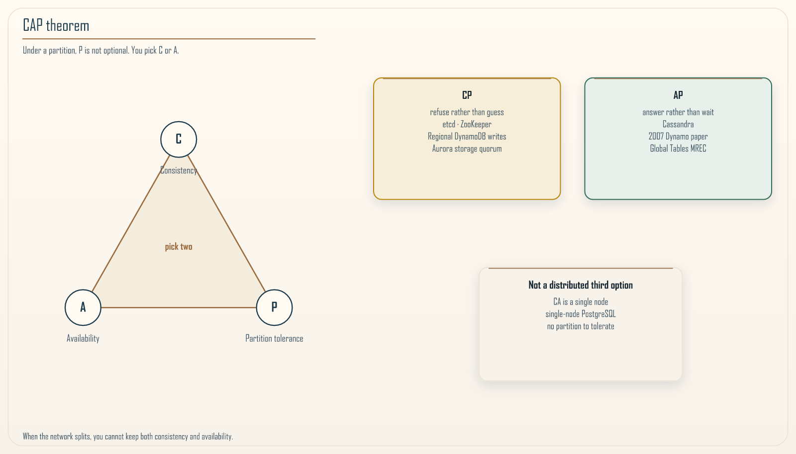
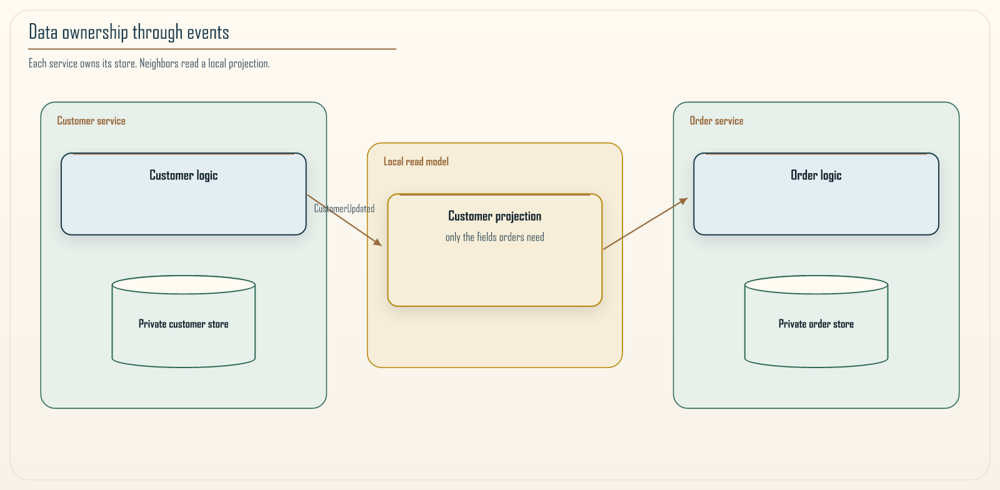

# Chapter 4: Data Management

<div class="chapter-header">
  <h2 class="chapter-subtitle">The End of ACID</h2>
  <div class="chapter-meta">
    <span class="reading-time">📖 45 min read</span>
    <span class="difficulty">🎯 Expert</span>
  </div>
</div>

> *"Part II: Data Architecture"*
> **Focus:** Splitting a system splits its data. Correctness is redefined, not abandoned.

This is the hardest chapter in the book, because managing data across service boundaries is the hardest problem in microservices. Once you split a system, you split its data, and the moment data lives in more than one place the comfortable guarantees of a single database evaporate. This chapter is about what replaces them, and about making peace with the fact that in a distributed system correctness is redefined rather than abandoned.

I call the theme the end of ACID, and I mean it precisely. It is not the end of correctness. It is the end of the illusion that a single database controller can enforce correctness globally and instantly. What replaces that illusion is a spectrum of consistency models, a set of mathematical tools for making replicas converge, and a handful of patterns for keeping data integrity while accepting that different parts of the system briefly disagree. An architect who understands where to set the consistency dial, and why, can build systems that are loosely coupled yet strictly correct. An architect who assumes the monolith's guarantees still hold will build systems that corrupt data quietly and blame the network.

## 4.1 The illusion of simultaneity

In a monolith, the database transaction is the arbiter of truth. Atomicity, consistency, isolation, and durability give a seductive abstraction: the system moves from one valid state to another in a single indivisible instant, and the database lock acts as a universal clock that serializes events. If user A transfers money to user B, no observer anywhere can see the money leave A without simultaneously arriving at B. Time in the monolith is singular.

Split the monolith and you shatter that singular time. You enter a relativistic world where *now* is a local concept and true simultaneity is impossible, because a remote call is a message sent into a void, not a function call with an immediate stack trace. The end of ACID is the acceptance that no single controller can enforce global invariants across services, so instead you build systems that tolerate temporary inconsistency, embrace asynchronous convergence, and treat network failure as a normal operating state rather than an exception. This is a maturation of how correctness is defined, from the blocking coordination of two-phase commit, which halts the world to force agreement, to the probabilistic convergence of eventual consistency.

Two-phase commit is still available. XA transactions exist. They are the wrong default for microservices because the coordinator is a single point of failure, a partition leaves participants blocked holding locks, and the coupling you just paid to remove comes back as a distributed lock manager. Chapter 5 is where long-running business transactions become sagas. This chapter is the consistency theory those sagas sit on.

### 4.1.1 The theoretical limits: Two Generals and FLP

Before designing anything, confront the theoretical ceilings, because they explain why so many tempting designs cannot work. The Two Generals Problem makes the first ceiling vivid. Two generals on opposite sides of an enemy valley must agree on a time to attack, and they can only communicate by messengers who may be captured. General A sends *attack at dawn*, but cannot attack until sure that B received it, so A needs an acknowledgment. B sends the acknowledgment, but cannot attack until sure A received that, because if the messenger was captured A will not attack and B will be slaughtered alone. So B needs an acknowledgment of the acknowledgment, and the regress never ends. Over an unreliable link, two parties cannot agree on an action with total certainty.

In microservices this appears as the dual-write problem. A service commits to its database and then publishes an event to a broker. If the commit succeeds but the publish fails, the local database says the action happened while the rest of the system never hears about it. If the publish succeeds but the commit rolls back, downstream services act on an event for something that never happened. There is no ordering of the two writes that is safe on its own, which is exactly the Two Generals impossibility wearing an engineering costume. You dissolve it by making *one* durable log the source of truth, not by finding a clever order for two. Chapter 6 covers the outbox. Section 4.6 covers Listen to Yourself, which inverts the same idea.

The deeper ceiling is the FLP result, from Fischer, Lynch, and Paterson in 1985. It proves that in an asynchronous system, one with no upper bound on message delivery time, where even a single process can fail silently, no deterministic consensus algorithm can guarantee agreement, termination, and validity all at once. The intuition is that you cannot distinguish a crashed process from a merely slow one, so any timeout you set to declare a node dead risks a split-brain where the node is alive and still writing. Practical algorithms like Paxos and Raft sidestep FLP by assuming partial synchrony, using timeouts and leader election, but the theoretical ceiling stands: in a partitioned network you cannot have both perfect consistency and full availability. That is the CAP theorem, and it forces the architect to choose consistency or availability when a partition occurs.

The classroom slogan "pick any two of C, A, and P" is a teaching device, not a menu. In a distributed system partitions happen, so P is not optional. The real choice under a partition is the edge between consistency and availability: a CP system refuses to answer rather than give a possibly stale answer, and an AP system answers rather than wait. A single-node database that never partitions is not a third distributed option. It is a monolith.

Daniel Abadi's PACELC restatement is the useful next notch: *if* there is a partition, choose A or C; *else*, choose latency or consistency. Most of the pain in cloud systems is the *else*. Cross-region chatty reads pay a latency tax even when the network is healthy, which is why a ledger and a product catalog in the same application belong on different settings of the dial.


*Figure 4.1: The CAP theorem, and why it is a choice rather than a wish. The triangle places consistency, availability, and partition tolerance at the corners. Because network partitions are a fact of distributed life rather than an option, partition tolerance is not negotiable, so the real choice under a partition is the edge between consistency and availability. The diagram places real systems on the edges to make the choice concrete. Regional DynamoDB writes and Aurora sit on the CP side; Cassandra and default DynamoDB Global Tables sit on the AP side. CAP is not a limitation to lament but a decision the architect must make deliberately for each piece of data.*

## 4.2 The consistency spectrum

The binary of strong versus eventual consistency is too coarse for real design. Consistency is a dial, and turning it trades latency and availability against how much disagreement the system tolerates. It is worth knowing the notches on the dial, from strongest to weakest, because different data in the same system belongs at different settings.

**Linearizability, the strongest.** Once a write completes, every subsequent read from any node returns that value or a newer one, as if there were a single global copy, and the order of non-overlapping operations matches real time. Consensus protocols, Multi-Paxos, Raft, give you this at a leader. The classic quorum rule, with *N* nodes, a write acknowledged by *W* nodes and a read querying *R* nodes such that *R + W > N*, forces the read and write sets to overlap and is the usual recipe for *strong consistency* in the Dynamo sense. Overlap is necessary and not always sufficient for full linearizability; you still need fencing so a stale leader cannot complete a write after it has been deposed. The cost is latency and reduced availability, because a minority partition cannot form a quorum and must stop serving. Use it for financial ledgers, inventory where overselling is unacceptable, and leader election.

**Sequential consistency.** Operations from one processor are seen in order, and all replicas agree on some total order, but that order need not match real time. If A writes `x=1` at 12:00:00 and B writes `x=2` at 12:00:01, sequential consistency may order B's write first so long as every replica sees the same order. Linearizability would forbid that, because the operations did not overlap in real time. Sequential consistency suits producer-consumer queues where sequence matters more than wall-clock timing.

**Causal consistency.** Operations that are causally related are seen in the same order by every node, while concurrent operations may be seen in different orders. It tracks dependencies with version vectors and offers high availability, because concurrent writes need no global master. The classic example is a comment thread: if A posts and B replies, no one should see the reply before the original, but an unrelated third comment can appear in any order.

**Session guarantees, or client-centric consistency.** Often the system need only be consistent for the one actor performing the operation. *Read-your-writes* ensures a client sees its own writes immediately, which is why a user who updates their profile must see the change even if it has not propagated everywhere. Prefer a version token or session timestamp the client sends on the next read over sticky sessions; pinning a user to one replica fails when that replica dies. *Monotonic reads* ensure a client never sees data go backwards on refresh. *Writes-follow-reads* orders a client's write after the data it just read, preserving the causal context of the action.

**Eventual consistency, the weakest.** If no new updates arrive, all replicas eventually converge. It offers the highest availability and lowest latency, propagating updates asynchronously through gossip, but *eventually* is vague and the hard part is what happens when conflicting updates occur during divergence. Naive last-writer-wins can silently lose data, which is why the next section turns to the mathematics of converging without loss.

## 4.3 The mathematics of convergence

When a system embraces eventual consistency, it accepts that different nodes hold different versions of the data at the same time, which produces conflicts. The naive resolution, last-writer-wins based on wall-clock time, is dangerous because of clock skew: if one server's clock runs a hundred milliseconds behind another, valid data gets silently overwritten by older data that happens to carry a later timestamp. To converge safely without a central coordinator, we use logical clocks and data structures that are mathematically guaranteed to converge.

### 4.3.1 Version vectors: capturing causality

What most engineering write-ups call vector clocks, when they talk about object versions, are **version vectors**. A full vector clock increments on every event, including receives. A version vector increments only on a local update and merges with an element-wise maximum on receive. That is the structure Dynamo used to detect concurrent writes, and it is the one you want for conflict detection.

Each replica keeps a vector with one slot per writer. On a local update a replica increments its own slot. When it sends a replica it attaches its vector. When it receives a vector it takes the element-wise maximum.

The payoff is honest conflict detection. Suppose server A writes an object, giving vector `[A:1]`, then updates it to `[A:2]`; since 2 is greater than 1, `[A:2]` descends from `[A:1]` and safely overwrites it. Now a partition occurs. A updates again to `[A:3]`, while B, which had seen `[A:2]`, takes a conflicting client update and increments its own slot to `[A:2, B:1]`. When the partition heals and the vectors are compared, A is ahead on its slot but behind on B's slot, so neither vector dominates the other: they are concurrent, and the system has correctly detected a real conflict. Rather than silently discarding one, as last-writer-wins would, version vectors preserve both as siblings and hand the reconciliation, merging the two shopping carts, to the application, which is the only layer that knows how to merge them meaningfully.

The limitation is size. The vector grows with the number of participating writers, and in a system with thousands of transient clients it becomes metadata-heavy. Amazon's original Dynamo truncated the vector past a certain length. Truncation can treat two concurrent versions as if one descended from the other, which is a silent lost update, not merely a false alarm. Bound the writers, or move the merge into a CRDT, before you truncate.

### 4.3.2 Conflict-free replicated data types

Version vectors detect conflicts. Conflict-free replicated data types, or CRDTs, prevent them mathematically. A CRDT is a data structure whose concurrent operations are commutative, associative, and idempotent, which guarantees that no matter what order updates arrive in, or how many times, every replica ends in the same state. There are two flavors: **state-based** (CvRDT), where replicas exchange full state and a merge function combines them, requiring the state to form a join-semilattice; and **operation-based** (CmRDT), where replicas exchange operations that must commute. Operation-based CRDTs typically need reliable *causal* broadcast. They do not need a total order, but they do need not to lose operations and not to apply a reply before its cause.

The grow-only counter is the simplest CRDT, useful for a metric like total views that only increases. A single shared integer would lose concurrent increments, so instead each node owns one slot in a vector and can only increment its own slot; the value is the sum, and the merge is the element-wise maximum:

```python
class GCounter:
    def __init__(self, node_id, num_nodes):
        self.id = node_id
        # one slot per node; each node counts only its own increments
        self.counts = [0] * num_nodes

    def value(self):
        return sum(self.counts)

    def increment(self):
        self.counts[self.id] += 1

    def merge(self, other):
        # element-wise max is commutative, associative, and idempotent,
        # so the counter converges monotonically and never goes backwards
        for i in range(len(self.counts)):
            self.counts[i] = max(self.counts[i], other.counts[i])
```

Because the merge is a maximum, the count can only move forward, so it converges to the correct global sum regardless of the order or repetition of merges. A fixed `num_nodes` is the same size problem as version vectors: joining a writer means growing the vector. Treat that as a membership change, not as an afterthought.

To support decrements you cannot simply decrement a grow-only counter, because the maximum merge would ignore the lower value. The positive-negative counter solves this with two grow-only counters, one for increments and one for decrements, where the value is the increment total minus the decrement total. Since both only grow, they merge without conflict, and their difference gives the net.

Do not use a PN-counter as your inventory. It can go negative, it cannot reserve the last item, and it will not stop oversell. "Items in stock" where overselling is unacceptable belongs on the linearizable notch of the dial, a reservation in one aggregate, not a commutative counter. Use a PN-counter for things that may be approximate and may go negative for a moment, online presence, a running delta, not for a ledger.

Sets are harder, because adding and removing an element do not commute: if one node adds X while another removes X concurrently, what should the result be? The observed-remove set solves this by tagging each add with a unique identifier. Adding X inserts the pair of X and a fresh identifier; removing X records the identifiers of the instances it *observed* into a tombstone set; and X is considered present if there exists an add whose identifier is not tombstoned. This produces an add-wins bias: a concurrent add generates a new identifier that the concurrent remove never saw, so the element remains, which is usually the safer default for a shopping cart or a collaborative document.

## 4.4 Cloud-native internals: DynamoDB and Aurora

To architect well on a cloud, you have to look under the marketing labels of NoSQL and SQL at the actual replication protocols, because those determine the real consistency behavior and failure modes. The diagrams that still file DynamoDB under "AP / eventually consistent" are describing the 2007 paper, or Global Tables in their default mode, not a regional table.

### 4.4.1 DynamoDB is not the Dynamo paper

There is a persistent misconception that DynamoDB implements the 2007 Dynamo paper. It does not. The paper described an availability-first system using sloppy quorums and hinted handoff, where any node could coordinate a write and data could be written to any healthy node with a hint to hand off later. The managed service, launched in 2012 and documented in detail in the 2022 USENIX paper, is architected differently and leans toward strong consistency and predictability.

DynamoDB divides the key space into partitions, and each partition is assigned to a replication group of replicas spread across three availability zones. The replicas use Multi-Paxos to elect a leader. All writes route to the leader, which writes a log record and propagates it, and the write is acknowledged only when a quorum, two of three, has persisted it to disk. This is synchronous replication. Crucially, the managed service does not do sloppy quorum: if the Paxos group cannot form a quorum because two zones are down, the partition becomes unavailable for writes rather than accepting a divergent write. That is a deliberate consistency-over-availability choice for the sake of data integrity and simple developer semantics.

Writes are strongly consistent. **Reads are not, unless you ask.** The default `GetItem` is eventually consistent and may miss a write that has not yet reached the replica you hit. `ConsistentRead=true` goes to the leader and pays for it. Architects who treat "DynamoDB is strongly consistent" as a blanket statement will ship read-your-writes bugs on the default path.

Global Tables layer a second choice on top of the regional Paxos group. The default mode is multi-region eventual consistency (MREC): each region is a strongly consistent group, replication between regions is asynchronous, and concurrent cross-region updates resolve by last-writer-wins on timestamp. That simplifies consumption at the cost of possible lost updates in active-active use. Since 2025 you can instead create a table with multi-region strong consistency (MRSC), which synchronously replicates a write to another region before acknowledging and gives strongly consistent reads from any replica, at higher write latency and with a three-region (or two-plus-witness) topology. You cannot flip a live table from MREC to MRSC. Pick the mode when you create the table, the same way you pick the notch on the dial.

### 4.4.2 Aurora: the log is the database

Aurora reimagines the relational database by decoupling compute from storage. Traditional replication writes full data pages to disk and ships them to replicas, causing heavy write amplification, since one logical write can become many kilobytes written to several volumes and shipped over the network. Aurora instead has the primary write only redo log records, and the storage layer, a large distributed fleet, applies those log records to materialize pages on demand. The log is the database.

Aurora shards the volume into ten-gigabyte protection groups, each replicated six ways across three zones, two per zone, with a four-of-six write quorum and a three-of-six read quorum. This tolerates sophisticated failure: it can lose an entire zone, two copies, plus one more node elsewhere, three failures total, and still not lose data, remaining readable even when it cannot accept writes, and if only one zone is down it stays fully write-available. Storage nodes gossip to repair gaps, so a node that missed a log record fetches only the missing delta from peers, repairing a segment in seconds rather than rebuilding it wholesale. Membership changes use epochs and a double quorum during the transition, requiring writes to satisfy both the old and new quorums so consistency holds even if the change rolls back.

The architectural lesson is that Aurora presents a simple strongly consistent SQL interface while using the most advanced distributed-systems primitives underneath, which is the honorable inverse of a distributed monolith: simple on the outside, sophisticated on the inside, rather than the reverse. Your *service* still owns a schema. Aurora does not give you permission to share that schema across services. It gives you a CP store that looks like Postgres.

## 4.5 Data ownership and how to share it

Underneath every consistency question is a more basic one: who owns the data. The foundational rule of microservice data management is database-per-service, meaning each service owns its data privately and no other service touches its store directly. This is not a stylistic preference; it is the boundary that makes a service independently changeable. If two services share a table, they share a schema, and a schema shared across services is a rigid public interface that neither can evolve without coordinating the other, which is the integration-database anti-pattern from Chapter 2 and one of the surest routes to a distributed monolith.

As Chapter 1 said, exclusive ownership does not require a separate database *server*. It requires that no other service can read or write your tables. A schema per service in a shared engine still satisfies the rule. A shared `orders` table does not.

The rule immediately raises a hard question, because real business questions span services. If orders live in one service and customers in another, how do you answer a question that needs both, and how does one service act on another's data without reaching into its database? There are three honest answers, each with a different trade-off.

**The first is API composition.** A caller, often a dedicated query service or a backend-for-frontend, calls each owning service and joins the results in memory. It is simple and keeps ownership clean, but it does not scale to large joins or high query volume, because you are doing in application code what a database does far better, and the latency is the sum of the calls.

**The second is replication through events**, which is the workhorse of distributed data. A service that needs another's data subscribes to that service's domain events and maintains its own local read-optimized copy of exactly the fields it needs. The order service keeps a small local projection of the customer data it cares about, kept current by consuming customer events. This is eventually consistent by nature, and it trades storage and a synchronization mechanism for the ability to answer cross-service queries locally and fast, without coupling to the owning service's availability. It is the same duplication-over-coupling trade from Chapter 2, applied to data. Project only what you need. A full replica of the customer service is a hidden shared database.

**The third is command query responsibility segregation, or CQRS**, which formalizes the second answer. The write side and the read side are separated: writes go to the owning services in their normalized form, and a separate read model, often built by consuming events, is denormalized specifically for the queries the system needs to answer. CQRS is powerful for read-heavy systems and for building materialized views that span services, and it is genuinely more complex, so it earns its place only when the query needs justify the extra moving parts.


*Figure 4.2: Data ownership and sharing done correctly. Each service owns its private store, shown boxed off so no other service can reach in. When a service needs another's data, it does not query that service's database; it consumes the domain events that service publishes and maintains its own local read model of just the fields it needs. The arrows between services carry events, not database queries, so ownership stays clean and the services stay independently changeable, at the cost of the eventual-consistency window the previous sections taught you to design for.*

The rule to carry forward is that a service's database is private, cross-service data is shared through events and local projections rather than shared tables or cross-service queries, and the eventual consistency this introduces is not a defect to be engineered away but the honest price of independence, managed with the tools from earlier in this chapter.

## 4.6 The Listen to Yourself pattern

The dual-write problem from Section 4.1.1 needs a concrete remedy, and the standard one is the transactional outbox: write the event to an outbox table in the same transaction as the business data, and a separate process reads the outbox and publishes, which guarantees atomicity at the cost of extra infrastructure. Chapter 6 covers it in full. Here I want to present a lighter alternative that suits event-first systems, the Listen to Yourself pattern, because it illustrates how inverting the flow of data can dissolve the problem rather than patch it.

The idea is that the service does not write to its database when it receives a request. Instead it validates the request statelessly, publishes an intent event to a durable stream, and immediately returns an accepted response. The same service then subscribes to that stream, and when it consumes its own event it performs the database transaction. The stream becomes the write-ahead log for the application, and the database is a downstream consumer of it. Because the stream is the single source of truth, there is no window where the database and the published event disagree: the event exists first, and the database state is derived from it.

That last sentence is the contract you must not blur. HTTP 202 Accepted means the *intent* is durable, not that the order exists. Uniqueness, foreign keys, and "does this customer already have an open cart" are enforced at consume time. If they fail, you publish a rejection event and the client that polled must handle it. If you need those constraints to fail *before* you acknowledge the user, use the outbox: the database remains the source of truth and the event is derived. Listen to Yourself is the right inversion when the stream is already your system of record. It is a worse outbox when it is not.

The benefits are real. The stream is a genuine single source of truth, so there is no dual write to keep consistent. The database is protected from traffic spikes, because the stream buffers load and the consumer drains it at a steady rate. And a stream that orders records per key gives causal ordering for free, so a create is always processed before a cancel for the same identifier, **if you publish with that identifier as the partition key**. Kinesis orders per shard, not per table. Forget the key and you have bought a race.

The costs are also real and must be designed for. The user cannot read their own write immediately after the API returns, so the interface has to use optimistic updates or polling. Streams deliver at least once, so the consumer must be idempotent. A client that retries after a timeout will publish a second intent; idempotency belongs on the intent identifier as well as on the consume path.

Here is the infrastructure, with the resilience settings that matter called out:

```hcl
# The event stream, acting as the write-ahead log.
# Publish with PartitionKey = order_id so create and cancel stay ordered.
resource "aws_kinesis_stream" "order_events" {
  name             = "order-events-stream"
  shard_count      = 2
  retention_period = 24
  stream_mode_details { stream_mode = "PROVISIONED" }
}

resource "aws_sqs_queue" "order_dlq" {
  name = "order-processing-dlq"
}

resource "aws_lambda_event_source_mapping" "kinesis_trigger" {
  event_source_arn  = aws_kinesis_stream.order_events.arn
  function_name     = aws_lambda_function.order_processor.arn
  starting_position = "TRIM_HORIZON"
  batch_size        = 10

  # If a batch fails, split it in half and retry, isolating the one bad
  # record from the good ones instead of failing all ten.
  bisect_batch_on_function_error = true
  maximum_retry_attempts         = 3

  destination_config {
    on_failure { destination_arn = aws_sqs_queue.order_dlq.arn }
  }

  function_response_types = ["ReportBatchItemFailures"]
}
```

The bisect setting is the circuit breaker for data processing: without it, one malformed record in a batch of ten fails the whole batch and the function retries all ten forever, blocking the shard. With it, the batch is split until the bad record is isolated and sent to the dead-letter queue while the good records succeed.

Since delivery is at least once, the consumer must turn duplicate events into a single side effect. This implementation uses a DynamoDB table as an idempotency store. Powertools expects a table whose primary key is `id`. The JMESPath below uses `powertools_json` because Kinesis payloads are Base64-encoded; a bare `data.order_id` will not see the fields.

```python
from aws_lambda_powertools.utilities.batch import (
    BatchProcessor,
    EventType,
    process_partial_response,
)
from aws_lambda_powertools.utilities.data_classes.kinesis_stream_event import (
    KinesisStreamRecord,
)
from aws_lambda_powertools.utilities.idempotency import (
    DynamoDBPersistenceLayer,
    IdempotencyConfig,
    idempotent_function,
)

processor = BatchProcessor(event_type=EventType.KinesisDataStreams)
persistence_layer = DynamoDBPersistenceLayer(table_name="IdempotencyStore")

@idempotent_function(
    data_keyword_argument="record",
    persistence_store=persistence_layer,
    config=IdempotencyConfig(
        event_key_jmespath="powertools_json(powertools_base64(kinesis.data)).order_id"
    ),
)
def process_single_record(record: KinesisStreamRecord):
    # Runs at most once per order_id within the expiration window.
    payload = record.json_data
    order_id = payload.get("order_id")
    # persist the order; publish a domain event only after the write commits
    return {"status": "processed", "order_id": order_id}

def handler(event, context):
    return process_partial_response(
        event=event,
        record_handler=process_single_record,
        processor=processor,
        context=context,
    )
```

The library computes a hash of the idempotency key and tries to write an in-progress lock to the store. If the lock write fails because another instance holds it, this instance backs off, preventing a race. If the lock succeeds, the business logic runs, and on completion the record is marked complete with the stored result. When a duplicate arrives, a hundred milliseconds or an hour later, the library finds the completed record and returns the cached result without re-running the logic. This turns the stream's at-least-once guarantee into an exactly-once *side effect* on the database, which is what makes the Listen to Yourself pattern trustworthy. It is not exactly-once *delivery*. The record may arrive twice. The effect must not.

## 4.7 Summary

Splitting a system splits its data, and the end of ACID is the disciplined acceptance that no single controller can enforce global invariants across services. Correctness is redefined, not abandoned. The theoretical ceilings, Two Generals and FLP, explain why the dual write cannot be made safe by ordering alone and why perfect consistency and full availability cannot coexist under a partition, which is the CAP choice you must make deliberately for each piece of data. PACELC reminds you that even without a partition you are still choosing latency against consistency.

Consistency is a dial, not a switch, running from linearizability through sequential, causal, and session guarantees down to eventual consistency, and different data in the same system belongs at different settings. Where you choose eventual consistency, converge safely with logical tools rather than wall-clock last-writer-wins: version vectors detect genuine conflicts and preserve siblings for the application to merge, and conflict-free replicated data types prevent conflicts outright through commutative, associative, and idempotent merges, from the grow-only counter to the observed-remove set. Do not put inventory on a PN-counter and call it solved.

Understand the cloud internals you build on. Regional DynamoDB writes are Paxos and CP; default reads are eventual; Global Tables default to last-writer-wins across regions unless you created the table for multi-region strong consistency. Aurora's six-copy quorum is a CP store that still does not license a shared schema. Resolve the dual write with the outbox or Listen to Yourself, always backed by idempotency, so an at-least-once stream produces an exactly-once effect. Use the outbox when the database is the system of record. Use Listen to Yourself when the stream is.

The recurring lesson is that distributed data integrity is achievable, but only by choosing your guarantees consciously and building the machinery to uphold them, rather than assuming the monolith's certainties survived the split. They did not. The next chapter takes up the operational consequence of all this distributed state: how transactions that span services are coordinated, with the saga pattern.

---

**Navigation:**
- [Previous: Chapter 3](03-service-communication.md)
- [Next: Chapter 5](05-deployment-and-operations.md)
