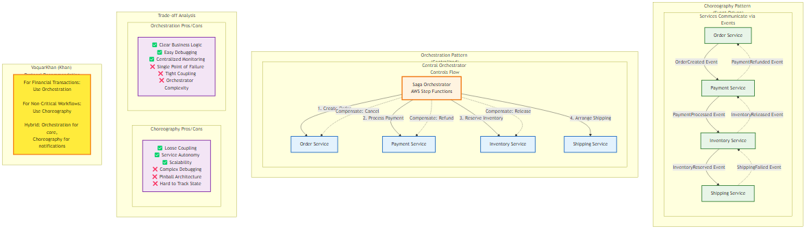

# Chapter 5: Distributed Transactions (The Saga Pattern)

<div class="chapter-header">
  <h2 class="chapter-subtitle">The Dissolution of Atomicity in the Cloud Native Era</h2>
  <div class="chapter-meta">
    <span class="reading-time">📖 35 min read</span>
    <span class="difficulty">🎯 Expert</span>
  </div>
</div>

## 5.1 The Dissolution of Atomicity in the Cloud Native Era

Migration from monolithic architecture to distributed microservices necessitates a fundamental reevaluation of data consistency. In the monolithic paradigm, the Relational Database Management System (RDBMS) served as the singular arbiter of truth. Atomicity, Consistency, Isolation, and Durability (ACID) were properties guaranteed by the database engine itself, maintained through mechanisms such as write-ahead logging (WAL) and two-phase locking. A complex business operation such as a financial transfer involving debiting one account and crediting another was encapsulated within a single transaction scope. The database ensured that either both operations succeeded or neither did, providing a robust safety net against partial failures.

However, the geometric expansion of systems, as conceptualized by the AKF Scale Cube (Martin Abbott & Michael Fisher), specifically along the Y-axis (functional decomposition), demands that services encapsulate their own data. This principle of "Database per Service" is foundational to microservices but introduces a severe architectural consequence: the loss of the global ACID transaction. When an Order Service and an Inventory Service reside on distinct infrastructure—potentially different database engines (Polyglot Persistence)—they cannot share a transaction context.

The Order Service cannot hold a lock on a row in the Inventory Service's database while it processes payment. Consequently, the safety net is removed, exposing the system to the peril of partial failures, where a transaction may successfully complete in one domain but fail in another, leaving the overall system in an inconsistent, corrupt state.

### 5.1.1 The Fallacy of Two-Phase Commit (2PC) and XA

In the early stages of microservice adoption, architects often attempt to replicate monolithic guarantees through distributed protocols like the Two-Phase Commit (2PC) or the XA standard. Theoretically, 2PC promises atomicity across distributed nodes. It operates via a coordinator that instructs all participating nodes to "prepare" (lock resources and verify feasibility). Only upon receiving affirmative acknowledgments from all participants does the coordinator issue a "commit" command.

While appealing in theory, 2PC is widely regarded as an anti-pattern in modern cloud-native architecture. It is mathematically antagonistic to availability. The protocol is blocking; during the "prepare" phase, resources are locked. If the coordinator fails, or if a single participant becomes unresponsive due to network partitions or garbage collection pauses, the locks remain held indefinitely across the entire fleet. This creates a single point of failure and introduces significant latency, as the speed of the transaction is effectively capped by the slowest participant. Furthermore, the blocking nature of 2PC degrades throughput, making it unsuitable for high-concurrency environments typical of internet-scale applications.

Moreover, the modern data landscape is heterogeneous. Many NoSQL databases optimized for high concurrency—such as Amazon DynamoDB or other internet-scale stores—do not support the XA standard required for 2PC. Attempting to enforce 2PC in a polyglot environment often leads to brittle custom implementations that fail under load. Thus, the pursuit of strict ACID across service boundaries is a dead end. Architects must instead embrace the BASE philosophy (Basically Available, Soft state, Eventual consistency) and adopt the Saga Pattern to manage long-running distributed transactions.

## 5.2 The Saga Pattern: Theoretical Foundations and Mechanics

The Saga pattern was originally formulated by Hector Garcia-Molina and Kenneth Salem in a 1987 paper from Princeton University. While originally designed for long-lived transactions within a single database to avoid prolonged locking, its principles have found their true calling in distributed systems. A Saga decomposes a single, monolithic business transaction into a sequence of local, atomic transactions. Each local transaction updates the database within a single service and publishes an event or message to trigger the next step in the sequence.

### 5.2.1 Anatomy of a Saga

A Saga is not merely a chain of events; it is a state machine that guarantees a specific outcome: either the successful completion of the business process or the semantic undoing of partial work. To understand Sagas, one must categorize the constituent transactions based on their role and reversibility:

1. **Compensatable Transactions**: These are the initial steps of the Saga that potentially need to be undone if a subsequent step fails. Examples include reserving inventory, placing a hold on credit, or creating a pending order. The defining characteristic is that the system must provide a corresponding "Compensating Transaction" for every compensatable step.

2. **Pivot Transaction**: This is the critical turning point in the Saga—the "point of no return." It is typically the step that results in a significant external effect or a commitment that cannot be easily reversed, such as charging a credit card or printing a shipping label. If the Pivot Transaction succeeds, the Saga is effectively guaranteed to be completed. If it fails, the Saga must retreat, executing compensating transactions for all preceding steps.

3. **Retriable Transactions**: These transactions occur after the Pivot Transaction. Because Pivot has succeeded, the system is committed to finishing the workflow. Retriable transactions are those that are guaranteed to succeed eventually, such as sending a confirmation email or updating a secondary index. If they fail, they are simply retried until success, rather than triggering a rollback.

### 5.2.2 The Compensation Mechanism: Semantic Undo

The most distinct difference between an ACID transaction and a Saga is the mechanism of failure recovery. In an ACID transaction, a "Rollback" restores the database to its previous state using transaction logs, effectively erasing the failed attempt as if it never happened. In a Saga, this is impossible because the local transactions have already committed their changes to the database. These changes are visible to other users and processes.

Therefore, a Saga cannot "rollback"; it must "compensate." A Compensating Transaction is a new business transaction that semantically reverses the effect of a previous transaction. For example, if the forward transaction was `ReserveCredit(CustomerA, $100)`, the compensating transaction would be `ReleaseCredit(CustomerA, $100)` or `RefundCredit(CustomerA, $100)`.

Architects must recognize that compensation is not always a perfect undo. While a database update can be reversed, external side effects often cannot. If a Saga step sends an email to a customer saying, "Order Received," and the Saga subsequently fails, the system cannot "un-send" the email. Instead, the compensating action must be to send a second email: "Order Cancelled." This leakage of transient state to the user is an inherent property of eventual consistency that must be managed through careful UX design.

### 5.2.3 Topological Imperatives: Choreography vs. Orchestration

The implementation of Saga requires a mechanism to coordinate the sequence of local transactions. This coordination generally falls into two topological categories: Choreography (decentralized) and Orchestration (centralized). The choice between these two is not merely stylistic; it profoundly impacts the coupling, observability, scalability, and failure modes of the distributed system.


*Figure 5.1: Comparison of Saga choreography (event-driven) vs orchestration (centralized) patterns, showing trade-offs in coupling, observability, and failure handling*

**Table 5.1: Comparative Analysis of Saga Topologies**

| Feature | Choreography (Event-Driven) | Orchestration (Command-Driven) |
|---------|------------------------------|--------------------------------|
| Control Flow | Decentralized; participants react to events | Centralized; orchestrator directs participants |
| Coupling | Loose event-based coupling; producers are unaware of consumers | Tighter coupling: orchestrator knows all participants |
| Observability | Low; requires distributed tracing to reconstruct state | High; centralized state machine provides immediate visibility |
| Complexity Management | Suitable for simple linear workflows (2-4 steps) | Essential for complex, branching, or cyclic workflows (>4 steps) |
| Single Point of Failure | None; highly distributed | The Orchestrator (mitigated by HA services like AWS Step Functions) |
| Mental Model | "Reactionary" - Services do what they do when triggered | "Authoritative" - A central brain defines the process |
## 5.3 Choreography: The Event-Driven Architecture

In a choreographed Saga, there is no central coordinator. Services interact by emitting domain events. When one service completes its local transaction, it publishes an event that other services subscribe to. This topology aligns naturally with Event-Driven Architectures (EDA) and promotes a high degree of service autonomy.

### 5.3.1 The Choreography Workflow

Consider an e-commerce "Create Order" Saga implemented via choreography:

1. **Order Service**: Receives a request, creates an order in PENDING state, and publishes an `OrderCreated` event.

2. **Payment Service**: Listens for `OrderCreated`. It attempts to charge the customer.
   - **Success**: It publishes `PaymentProcessed`.
   - **Failure**: It publishes `PaymentFailed`.

3. **Inventory Service**: Listens for `PaymentProcessed`. It attempts to reserve items.
   - **Success**: It publishes `InventoryReserved`.
   - **Failure**: It publishes `InventoryUnavailable`.

4. **Order Service**: Listens for downstream events.
   - If it receives `InventoryReserved`, it updates the order status to APPROVED.
   - If it receives `PaymentFailed` or `InventoryUnavailable`, it triggers compensation logic (e.g., cancelling the order).

This approach allows teams to work independently. The Inventory team can change their implementation without notifying the Order team, provided the event schema remains compatible.

### 5.3.2 Failure Modes in Choreography

Despite its elegance, choreography introduces severe operational risks as complexity scales.

#### 5.3.2.1 The "Pinball Architecture" Anti-Pattern

As the number of steps and participants increases, the system flow becomes difficult to visualize. Events bounce between services like a pinball, making it arduous to reconstruct the path of a single business transaction. This phenomenon, often termed "Pinball Architecture" or "Lambda Pinball," obscures the business logic. "What happens when a user places an order?" is no longer a question answerable by looking at a single codebase; it requires piecing together subscriptions and event handlers across multiple repositories.

#### 5.3.2.2 The "Death Spiral" and Retry Storms

A critical failure mode in choreography is the "Death Spiral." In distributed systems, transient failures are common. If the Inventory Service fails to process an event, the standard response is to retry. However, if the failure is due to system overload, aggressive retries only exacerbate the problem, adding more load to an already struggling system. This positive feedback loop can lead to a cascading failure where the entire mesh becomes unresponsive.

**Mitigation Strategies:**

- **Exponential Backoff and Jitter**: Consumers must not retry immediately. They should wait for exponentially increasing intervals (e.g., 1s, 2s, 4s, 8s) with added random "jitter." The jitter is crucial to desynchronize the retries of multiple concurrent failures, preventing a "thundering herd" when the service recovers.

- **Dead Letter Queues (DLQ)**: After a defined number of retries (e.g., 3 or 5), the event must be moved to a DLQ. This removes the "poison message" from the processing pipeline, allowing the system to recover while preserving the data for forensic analysis or manual redrive.

- **Circuit Breakers**: Services should implement circuit breakers (e.g., using patterns from Netflix Hystrix or resilience4j). If a downstream dependency is failing at a high rate, the circuit opens, failing requests fast without consuming resources on retries.
### 5.3.3 Infrastructure: AWS EventBridge and Latency

AWS EventBridge has emerged as the premier backbone for choreographed Sagas in the AWS ecosystem. Unlike simpler message brokers, EventBridge acts as a serverless event bus that can route messages based on content rules.

**Performance and Latency Improvements (2025 Outlook):**

Historically, latency was a concern for event-driven architectures in synchronous user flows. However, recent benchmarks and announcements highlight massive optimizations. The end-to-end latency (P99) for EventBridge event buses has been reduced from over 2000ms in early 2023 to approximately 129ms as of late 2024/2025. This dramatic improvement—up to 94%—shifts the architectural calculus. Choreography, previously relegated to asynchronous background tasks, is now viable for near real-time user-facing flows where low latency is critical.

### 5.3.4 The Necessity of Idempotency

In any distributed messaging system (including SQS and EventBridge), "exactly once" delivery is a theoretical impossibility; the guarantee is "at least once." This means a service might receive the same `PaymentProcessed` event twice due to network retries. If the receiving service is not idempotent, it might ship the order twice or deduct inventory twice.

**Implementing Idempotency with DynamoDB:**

Idempotency must be handled at the application layer or infrastructure edge. A common pattern uses a dedicated table, or a conditional write to track processed event IDs.

```python
import boto3
from botocore.exceptions import ClientError

dynamodb = boto3.resource('dynamodb')
table = dynamodb.Table('ProcessedEvents')

def process_event(event):
    event_id = event['id']
    try:
        # Atomic check-and-set: try to write the event ID.
        # This will fail if the ID already exists.
        table.put_item(
            Item={'EventId': event_id},
            ConditionExpression='attribute_not_exists(EventId)'
        )
    except ClientError as e:
        if e.response['Error']['Code'] == 'ConditionalCheckFailedException':
            print(f"Event {event_id} already processed. Skipping.")
            return  # Idempotent success
        else:
            raise  # Retryable error
    
    # Perform actual business logic here
    ship_order(event)
```

This code snippet demonstrates the "idempotency key" pattern. By leveraging DynamoDB's conditional writes, we ensure that the business logic executes exactly once, regardless of how many times the event is delivered.
## 5.4 Orchestration: The Centralized Controller

As workflows increase in complexity—involving conditional branching, parallel processing, or strict compliance requirements—choreography becomes unmanageable. Orchestration centralizes the decision-making process. An Orchestrator (e.g., AWS Step Functions) tells the participants what to do via commands, rather than participants reacting to events.

### 5.4.1 AWS Step Functions: The Standard for Orchestration

AWS Step Functions models workflows as state machines using the Amazon States Language (ASL). This JSON-based specification allows architects to define the sequence of execution, retry policies, and error handling paths explicitly.

#### 5.4.1.1 Standard vs. Express Workflows

A critical architectural decision within Step Functions is the choice between Standard and Express workflows. These are distinct execution modes with different pricing models, durability guarantees, and operational limits.

**Table 5.2: Step Functions Workflow Types Comparison**

| Feature | Standard Workflows | Express Workflows |
|---------|-------------------|-------------------|
| Primary Use Case | Long-running, complex business transactions (e.g., Order Fulfillment, IT Automation) | High-volume, short-duration event processing (e.g., IoT Telemetry, Mobile Backends) |
| Maximum Duration | 1 Year | 5 Minutes |
| Execution Semantics | Exactly Once execution of states and tasks | At Least Once execution: tasks must be idempotent |
| Pricing Model | Charged per State Transition ($25.00 per million) | Charged per Request ($1.00 per million) + GB/second duration |
| History & Debugging | Full visual execution history retained for 90 days. Visual debugging in Console | Execution history sent to CloudWatch Logs (optional). No visual history in Console |
| Synchronicity | Asynchronous execution | Supports both Synchronous (API Gateway response) and Asynchronous modes |
| Step Rate | Token Bucket limited (approx. 2,000 starts/sec) | High Throughput (100,000+ per second) |

**Architectural Recommendation:**

For a distributed transaction Saga involving payments and inventory, Standard Workflows are generally preferred despite the higher cost per transition. The "Exactly Once" guarantee significantly simplifies the logic for non-idempotent legacy systems, and the visual audit trail is indispensable for debugging failures in high-value transactions. However, if the workflow is purely high-volume data ingestion where occasional duplication is acceptable, Express Workflows offer a massive cost advantage.
### 5.4.2 The "Wait for Callback" Pattern (waitForTaskToken)

One of the most powerful capabilities of Standard Step Functions is the callback pattern. This allows a workflow to pause execution indefinitely (up to 1 year) while waiting for an external signal. This is critical for Sagas that require human intervention (e.g., "Manager Approval") or integration with asynchronous legacy systems.

**Mechanism:**

1. **Pause**: The Step Function calls a service (e.g., SQS, Lambda, SNS) and passes a generated TaskToken. The state then enters a "Paused" mode.

2. **External Process**: The external system receives the token. It performs its work (e.g., a human reviews a loan application).

3. **Callback**: Upon completion, the external system calls the SendTaskSuccess (or SendTaskFailure) API with the TaskToken and the result payload.

4. **Resume**: The Step Function resumes execution from the next state.

**ASL Implementation Example:**

```json
{
  "StartAt": "RequestManagerApproval",
  "States": {
    "RequestManagerApproval": {
      "Type": "Task",
      "Resource": "arn:aws:states:::sqs:sendMessage.waitForTaskToken",
      "Parameters": {
        "QueueUrl": "https://sqs.us-east-1.amazonaws.com/123456789012/ManagerApprovalQueue",
        "MessageBody": {
          "TransactionId.$": "$.TransactionId",
          "Amount.$": "$.Amount",
          "TaskToken.$": "$$.Task.Token"
        }
      },
      "Next": "ProcessDecision",
      "Catch": [
        {
          "ErrorEquals": ["States.TaskFailed"],
          "Next": "AutoReject"
        }
      ]
    },
    "ProcessDecision": {
      "Type": "Choice",
      "Choices": [
        {
          "Variable": "$.Decision",
          "StringEquals": "APPROVED",
          "Next": "ProcessApproval"
        }
      ],
      "Default": "RejectApplication"
    }
  }
}
```

This pattern decouples the orchestrator from the worker, allowing the worker (human or machine) to take as long as necessary without consuming Lambda execution time or holding open HTTP connections.
### 5.4.3 Handling Large Data: The Distributed Map State

A historical limitation of Step Functions was the handling of large datasets. The execution history size is strictly limited to 25,000 events, and the payload passed between states is capped at 256 KB (increased from an earlier 32 KB limit). Processing a CSV file with 100,000 rows using a traditional "Inline Map" state would breach these limits, requiring complex workarounds like "chaining" lambdas.

**The Solution: Distributed Map State:**

Introduced to solve this specific problem, the Distributed Map state allows Step Functions to iterate over millions of objects (e.g., S3 keys) by spawning Child Workflow Executions.

- **Concurrency**: It supports up to 10,000 concurrent child executions.
- **Data Source**: It can natively read from Amazon S3 (CSV, JSON, Parquet) or a manifest file.
- **Architecture**: The Parent workflow remains lightweight (Standard), while the Child workflows process the items.
- **Cost Optimization**: A common pattern is to use a Standard Parent workflow for the overall control and Express Child workflows for the iterations. This avoids the high state transition costs of Standard workflows for the loop iterations, providing a cost-effective solution for high-scale batch processing.

**Configuration Example:**

```json
{
  "ProcessOrders": {
    "Type": "Map",
    "ItemReader": {
      "Resource": "arn:aws:states:::s3:getObject",
      "ReaderConfig": {
        "InputType": "CSV",
        "CSVHeaderLocation": "FIRST_ROW"
      },
      "Parameters": {
        "Bucket": "my-orders-bucket",
        "Key": "daily-orders.csv"
      }
    },
    "ItemProcessor": {
      "ProcessorConfig": {
        "Mode": "DISTRIBUTED",
        "ExecutionType": "EXPRESS"
      },
      "StartAt": "ValidateOrder",
      "States": {
        "ValidateOrder": {
          "Type": "Task",
          "Resource": "arn:aws:lambda:us-east-1:123456789012:function:Validate",
          "End": true
        }
      }
    },
    "MaxConcurrency": 1000,
    "End": true
  }
}
```

This configuration allows processing massive datasets without hitting the history limit of the parent workflow.
## 5.5 Isolation Anomalies: The "I" in ACID

Perhaps the most dangerous misconception in distributed transactions is assuming that Sagas provide isolation. They do not. In a traditional ACID transaction, the Isolation property ensures that intermediate states of a transaction are invisible to other concurrent transactions. If Transaction A updates a row but hasn't been committed, Transaction B cannot see that update (depending on the isolation level).

In a Saga, every local transaction commits immediately. This means intermediate states—such as an order being created but not yet paid for—are visible to the entire system. This visibility leads to specific Data Anomalies that the architect must actively design against.

### 5.5.1 Classification of Distributed Anomalies

1. **Lost Updates**: Saga A reads a record. Saga B reads the same record. Saga A updates the record and commits. Saga B updates the record based on its original read and commits, effectively overwriting Saga A's changes without realizing it.

2. **Dirty Reads**: Saga A updates a record (e.g., reserves credit). Saga B reads this new credit balance and makes a decision (e.g., approves a withdrawal). Saga A subsequently fails and executes a compensating transaction to revert the credit. Saga B has now acted on data that "never happened."

3. **Fuzzy/Non-Repeatable Reads**: Saga A reads a record. Saga B updates that record. Saga A reads the record again later in the workflow and sees different data, leading to inconsistent internal logic.

### 5.5.2 Countermeasures for Lack of Isolation

Since the database engine cannot enforce isolation across distributed boundaries, the application layer must implement "Semantic Isolation." The following countermeasures are standard defensive patterns.

#### 5.5.2.1 Semantic Locking

Semantic Locking involves creating an application-level lock on a record to indicate that it is currently part of an active Saga.

- **Mechanism**: When the Order Service creates an order, it sets a status flag or a dedicated lock field: `State = ORDER_PENDING_APPROVAL`.

- **Enforcement**: Any other transaction (e.g., CancelOrder, UpdateAddress) attempting to modify this order must first check the state. If it sees `ORDER_PENDING_APPROVAL`, it knows a Saga is in progress. The attempting transaction should either fail immediately or block (spin-wait) until the lock is released.

- **Release**: The lock is released only when the Saga completes (sets status to APPROVED) or fully compensates (sets status to REJECTED).

#### 5.5.2.2 Commutative Updates

Commutativity is a mathematical property where the order of operations does not change the final result (A + B = B + A). Designing updates to be commutative eliminates the "Lost Update" anomaly.

- **Scenario**: Managing a customer's account balance.
- **Non-Commutative**: `SetBalance($150)`. If two Sagas try to set the balance based on stale reads, one will overwrite the other.
- **Commutative**: `Deposit($50)` or `Withdraw($20)`. If Saga A adds $50 and Saga B subtracts $20, the final state of the ledger will be correct regardless of which executes first.
- **Implementation**: This often requires using CRDTs (Conflict-free Replicated Data Types) or database features that support atomic increments/decrements (e.g., DynamoDB ADD update expression) rather than read-modify-write cycles.
#### 5.5.2.3 Pessimistic View (Reordering)

This strategy involves reordering the steps of a Saga to minimize the window of risk for Dirty Reads.

- **Strategy**: Place the "Pivot Transaction" (the point of no return) as late as possible, or order the steps such that reversible actions happen before non-reversible ones.

- **Example**: If a Saga involves CancelOrder (low risk, internal state change) and RefundPayment (high risk, external money movement), executing RefundPayment first is dangerous. If CancelOrder subsequently fails, you have refunded money for an active order. By reordering to CancelOrder → RefundPayment, you ensure that the money is only returned once the internal state is secured. This is termed "Pessimistic View" because it assumes failure is likely and minimizes the impact of a crash during the transaction.

#### 5.5.2.4 Reread Value (Optimistic Locking)

This countermeasure prevents Lost Updates by verifying that data has not changed between the time it was read and the time it is written.

**Mechanism:**
1. Read the item, noting its Version number (e.g., v1).
2. Perform logic.
3. Write the update with a condition: `SET Balance = $200, Version = v2 WHERE Version = v1`.

**Result**: If another Saga updated the record to v2 in the interim, the write fails (e.g., DynamoDB ConditionalCheckFailedException). The Saga must then abort or retry the entire operation with fresh data.

## 5.6 Technical Deep Dive: Transactional Integrity with DynamoDB

While Sagas manage the inter-service consistency, the intra-service consistency (the atomic steps) relies heavily on the capabilities of the underlying database. Amazon DynamoDB provides specific features that are critical for robust Saga implementation.

### 5.6.1 TransactWriteItems: Local ACID

Even within a single microservice, a business action might require updating multiple entities. For example, "Creating an Order" might involve:

1. Writing the Order record to the Orders table.
2. Incrementing a CustomerOrderCount in the Customers table.
3. Writing an IdempotencyKey to prevent duplicate processing.

DynamoDB's TransactWriteItems API allows grouping up to 100 write operations (Put, Update, Delete, ConditionCheck) into a single atomic unit. Either all succeed, or none do. This provides full ACID guarantees within the service boundary, ensuring that a Saga step never leaves the local database in a partial state.
### 5.6.2 Conditional Writes for Semantic Locks

Implementing Semantic Locks (Countermeasure 5.5.2.1) requires atomic "Check and Set" capabilities. DynamoDB Conditional Writes are the standard way to enforce this.

**Scenario**: A CancelOrder Saga must strictly fail if the order has already been shipped.

**Boto3 Implementation:**

```python
import boto3
from botocore.exceptions import ClientError

table = boto3.resource('dynamodb').Table('Orders')

def set_order_cancelled(order_id):
    try:
        response = table.update_item(
            Key={'OrderId': order_id},
            UpdateExpression="SET OrderStatus = :new_status",
            ConditionExpression="OrderStatus = :allowed_status",
            ExpressionAttributeValues={
                ':new_status': 'CANCELLED',
                ':allowed_status': 'ORDER_PLACED'
                # This condition acts as the lock check.
                # If status is SHIPPING or SHIPPED, the write is rejected.
            },
            ReturnValues="UPDATED_NEW"
        )
        return response
    except ClientError as e:
        if e.response['Error']['Code'] == 'ConditionalCheckFailedException':
            # This is the Semantic Lock doing its job.
            # The order is in a state that prevents cancellation.
            raise OrderCannotBeCancelledException(f"Order {order_id} is not in PLACED state")
        else:
            raise
```

This code enforces the business rule atomically at the database layer, preventing race conditions that could occur if the application first read the status and then tried to update it in two separate calls.

## 5.7 Operational Resilience: Engineering for Failure

A Saga architecture is only as good as its failure handling. In a distributed system, "failure is the only constant."

### 5.7.1 The Zombie Saga

A "Zombie Saga" occurs when a workflow starts but gets stuck in a pending state, neither completing nor compensating. This often happens due to unhandled exceptions, crash loops, or lost messages.

**Mitigation:**

1. **Timeouts**: Every step in a Step Function must have a configured TimeoutSeconds. If a Lambda hangs or a callback is never received, the Step Function must timeout and transition to a failure path (Compensation).

2. **The Sweeper Pattern**: A background process (e.g., a scheduled Lambda running every 5 minutes) scans the database for transactions that have been in a PENDING state longer than the Service Level Objective (SLO) allows. The Sweeper can trigger a repair workflow, alert an operator, or forcibly expire the transaction.
### 5.7.2 Observability and Distributed Tracing

In a Saga, a single user request triggers actions across multiple services. Standard logging is insufficient because logs are siloed.

**Best Practice:**

- **Correlation IDs**: Every Saga must generate a unique TraceId at the ingress point. This ID must be propagated through every event (EventBridge), command (Step Functions), and log message.

- **AWS X-Ray**: Enable X-Ray on all Lambda functions and Step Functions. This visualizes the service map and allows architects to pinpoint exactly which step in the distributed chain caused a latent spike or failure.

### 5.7.3 Security: The Confused Deputy

In a distributed Saga, Service A calls Service B, which calls Service C. Service C must know who the original user is to enforce permissions. This is the Identity Propagation problem.

**Solution:**

Do not simply trust the upstream service. Pass the JSON Web Token (JWT) or a signed identity context in the event metadata or API header. Service C should validate the token to ensure the original caller has the rights to perform the action, preventing privilege escalation attacks (The Confused Deputy Problem).

## 5.8 Conclusion: The Consistency Tax

The Saga pattern is not a panacea; it is a complex, heavyweight architectural pattern that imposes a significant "Consistency Tax" on development teams. It requires shifting from a comfortable synchronous mental model to an asynchronous, eventually consistent one. It demands rigorous handling of compensation, idempotency, and isolation anomalies.

However, for enterprises operating at scale, this tax is the price of admission. The ability to decouple services, scale them independently, and survive partial infrastructure failures makes the Saga pattern indispensable.

**Architect's Final Verdict:**

- **Default to Orchestration (Step Functions)**: For any workflow involving money, inventory, or critical business logic, the observability and control of orchestration outweigh the coupling costs.

- **Use Choreography Sparingly**: Reserve event-driven choreography for non-critical, unidirectional notifications (e.g., "Email User," "Update Analytics") where the complexity of "Death Spirals" and "Pinball Architecture" is not a risk to the core transaction.

- **Never Assume Isolation**: Design every entity and transaction with the assumption that it will be read while in a dirty state. Use Semantic Locks and Commutative Updates defensively.

The transition to Sagas is a journey from the rigid certainty of ACID to the resilient fluidity of BASE. It is a journey that requires not just new tools, but a new way of thinking about data.

---

## Summary

This chapter explored distributed transactions and the Saga pattern in microservices architecture, providing comprehensive insights into choreography vs. orchestration, isolation anomalies, and practical implementation patterns.

## What's Next?

In the next chapter, we'll continue our journey through microservices architecture.

---

**Navigation:**
- [← Previous: Chapter 4](04-data-management.md)
- [Next: Chapter 6 →](06-resilience-and-reliability.md)