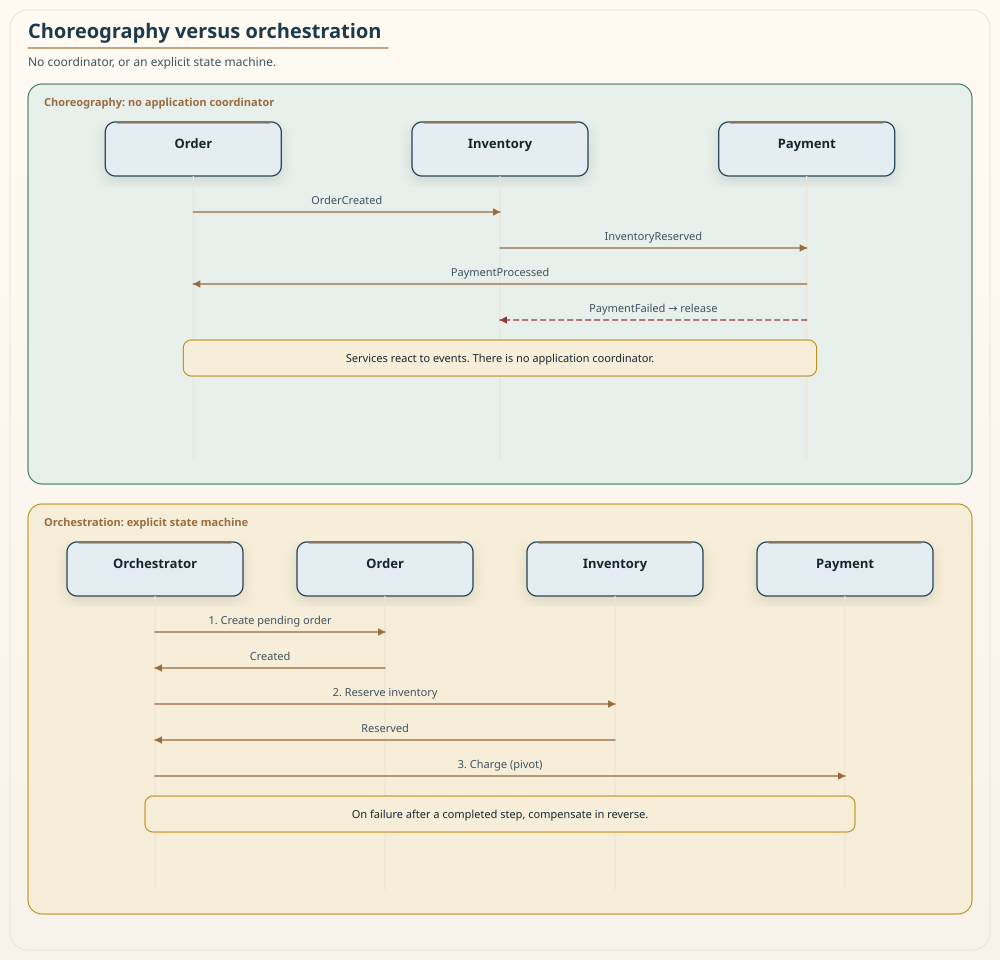
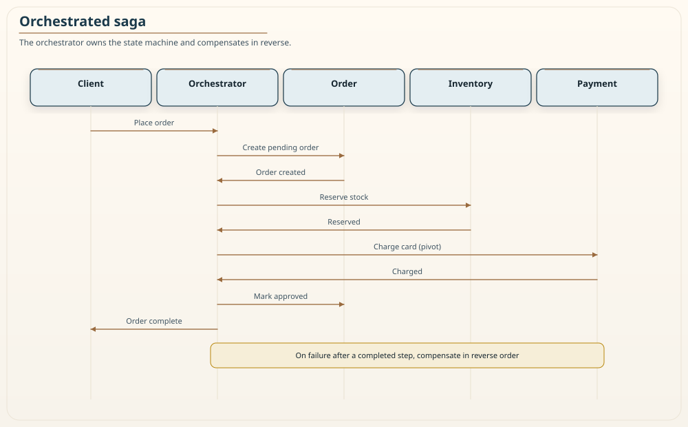

# Chapter 5: Distributed Transactions and the Saga Pattern

<div class="chapter-header">
  <h2 class="chapter-subtitle">The Consistency Tax of Spanning Services</h2>
  <div class="chapter-meta">
    <span class="reading-time">📖 45 min read</span>
    <span class="difficulty">🎯 Expert</span>
  </div>
</div>

> *"Part II: Data Architecture"*
> **Focus:** When one business operation spans services, a saga replaces the global transaction. It is heavier, and the tax is paid in compensation, idempotency, and isolation.

The previous chapter established that once you split a system you lose the global ACID transaction. This chapter is about what you do when a single business operation must nonetheless span several services, such as placing an order that touches inventory and payment. The answer is the saga pattern, and understanding it well is the difference between a distributed system that stays correct under failure and one that silently corrupts data the first time a step fails halfway through.

I want to set expectations honestly at the start: **the saga pattern is not a free replacement for the transaction you lost.** It is a heavier, more demanding pattern that imposes what I call a consistency tax, because it forces you to think about compensation, idempotency, and isolation anomalies that the database used to handle for you. For enterprises operating at scale that tax is the price of admission, and this chapter is about paying it deliberately rather than discovering the bill during an incident.

## 5.1 The dissolution of atomicity

In the monolith, the relational database was the single arbiter of truth, and ACID was guaranteed by the engine itself through write-ahead logging and locking. A complex operation like a financial transfer, debiting one account and crediting another, lived in a single transaction scope, and the database ensured that either both operations happened or neither did. That was a robust safety net against partial failure.

Database-per-service removes the net. When the order service and the inventory service live on separate infrastructure, possibly on different database engines entirely, they cannot share a transaction context. The order service cannot hold a lock on a row in the inventory service's database while it processes payment. The consequence is the peril of partial failure: an operation can succeed in one service and fail in another, leaving the overall system in an inconsistent state with no automatic way to recover.

### 5.1.1 Why two-phase commit is the wrong default

The instinctive first move is to recreate the monolith's guarantee with a distributed protocol like two-phase commit or the XA standard. In theory, two-phase commit promises atomicity across nodes: a coordinator tells all participants to prepare, locking resources and verifying they can commit, and only when every participant agrees does it issue the commit. Inside a single tightly controlled store, variants of this still work. Spanner runs two-phase commit over TrueTime. DynamoDB's `TransactWriteItems` is a bounded atomic batch *inside* DynamoDB. Neither of those is XA across independently owned services, independently deployed databases, and independently failing networks.

Across service boundaries, two-phase commit is the wrong default, for reasons that are structural rather than incidental.

It is blocking. During the prepare phase, resources are locked across every participant, and if the coordinator fails or a single participant becomes unresponsive, whether from a network partition or just a garbage-collection pause, those locks are held while recovery runs. That is a throughput killer, because the transaction runs at the speed of its slowest participant and holds locks the entire time, which is fatal in a high-concurrency system. Recovery protocols exist, presumed-abort is not the same as "locks forever," but the coordinator is still a coupling point you just paid to remove. On top of that, the modern data landscape is heterogeneous, and many databases built for high concurrency do not speak XA at all, so enforcing two-phase commit in a polyglot estate produces brittle custom code that collapses under load. The pursuit of strict ACID *across independently owned services* is a dead end. The alternative is to embrace eventual consistency and manage the business transaction with the saga pattern.

## 5.2 The saga pattern

Hector Garcia-Molina and Kenneth Salem formulated the saga in a 1987 paper, originally to avoid holding locks during long-lived transactions in a single database. Its principles found their true calling in distributed systems. A saga decomposes one business transaction into a sequence of local atomic transactions, each of which updates the database within a single service and then triggers the next step, by publishing an event or sending a command.

### 5.2.1 The anatomy of a saga

A saga is not just a chain of events; it is a state machine that guarantees one of two outcomes, either the business process completes or the partial work is semantically undone. The useful engineering taxonomy for its steps, later popularized by Chris Richardson, comes in three kinds, and knowing which is which is essential to designing the failure behavior.

**Compensatable transactions** are the early steps that might need undoing if a later step fails: reserving inventory, placing a hold on credit, creating a pending order. Every compensatable step must have a corresponding compensating transaction that reverses it.

**The pivot transaction** is the point of no return, the step with a significant external effect that cannot easily be reversed, such as charging a card or printing a shipping label. If the pivot succeeds the saga is committed to finishing, and if it fails the saga must retreat and compensate everything before it.

**Retriable transactions** come after the pivot, and because the pivot succeeded the system is committed to completing them, so they are retried until they succeed rather than triggering a rollback, such as sending a confirmation email or updating a secondary index. "Guaranteed to succeed" is an operational commitment, a sweeper, a retry budget, an on-call path, not a law of physics. A retriable step that cannot succeed is a zombie, and section 5.7 is about finding it.

Compensation itself can fail. A refund can time out. Design compensations to be idempotent and retried, and escalate to a human when the retry budget is exhausted. There is no compensation-of-compensation fairy tale. There is retry, then a ticket.

### 5.2.2 Compensation is a semantic undo, not a rollback

The deepest difference between an ACID transaction and a saga is failure recovery. An ACID rollback restores the database to its prior state from the transaction log, erasing the failed attempt as if it never happened. A saga cannot do this, because its local transactions have already committed and their effects are visible to other users and processes. A saga cannot roll back; it must compensate, which means running a new business transaction that semantically reverses a previous one. If the forward step was to reserve one hundred dollars of credit, the compensation is to release or refund that hundred dollars.

Compensation is not always a clean undo, and this is a point architects underestimate. A database change can be reversed, but external side effects often cannot. If a saga step sent the customer an email saying order received, and the saga later fails, you cannot un-send that email; the compensation is a second email saying order cancelled. This leakage of transient state to the outside world is an inherent property of eventual consistency, and it has to be managed through the user experience rather than wished away.

Compensate in reverse order of the steps that actually completed. If you reserved inventory and then failed at payment, release the reservation before you cancel the pending order that other readers are already looking at, or after, but *decide* and write it down. An ad-hoc reverse path is how you double-refund.

### 5.2.3 Choreography or orchestration

A saga needs a way to coordinate its sequence of local transactions, and there are two topologies for that: choreography, which is decentralized, and orchestration, which is centralized. The choice is not stylistic; it shapes the coupling, observability, scalability, and failure modes of the whole system.


*Figure 5.1: The two saga topologies side by side. On the left, choreography: each service reacts to events published by the others, and there is no central application coordinator, so the workflow exists only as the emergent sum of the reactions. On the right, orchestration: a central orchestrator holds the workflow as an explicit state machine and issues commands to each participant, tracking where the transaction is at every moment. Choreography is loosely coupled but its state is scattered and hard to see, while orchestration centralizes both the control and the visibility at the cost of a component that knows about every participant.*

| Feature | Choreography (event-driven) | Orchestration (command-driven) |
|---------|-------------------------------|--------------------------------|
| **Control flow** | Decentralized; participants react to events | Centralized; an orchestrator directs participants |
| **Coupling** | Loose, event-based; producers do not know consumers | Tighter; the orchestrator knows every participant |
| **Observability** | Low; reconstructing state needs distributed tracing | High; the central state machine shows state directly |
| **Best fit** | Simple linear workflows of a few steps | Complex, branching, or long-running workflows |
| **Critical infrastructure** | The bus; there is no application coordinator | The orchestrator, mitigated by a managed HA service |
| **Mental model** | Reactionary: services act when triggered | Authoritative: a central brain defines the process |

Choreography is not "no single point of failure." The event bus is critical infrastructure. What you have removed is an *application* coordinator, not the need for a reliable log.

The practical guidance is to favor choreography for short, low-risk, roughly linear flows, and to reach for orchestration as steps, branching, parallelism, long-running waits, human approval, strict deadlines, or financial and compliance stakes enter the picture. Those factors, the number and shape of the steps and the business risk they carry, are exactly what the Saga Complexity Score in Chapter 11 measures, and I point you there rather than restating a scoring formula here, because the book defines that score in one place. The short version is that as complexity and risk rise, the observability and control of orchestration outweigh its coupling cost, and below that threshold the simplicity of choreography wins.

### 5.2.4 Choosing in practice: three worked examples

The decision becomes concrete when you weigh workflow complexity and business risk against a real flow. Three examples show the reasoning, and they map onto the Saga Complexity Score of Chapter 11 without restating its formula.

**A user-registration email** is two steps, linear, and low risk: a failed email can be retried later and no money or compliance is involved. Complexity is low and risk is low, so choreography is the right call, a fire-and-forget event that a notification service reacts to. Reaching for an orchestrator here would be overkill.

**An e-commerce order** is a few steps and still roughly linear, but it moves money. Complexity is low and risk is high, and the risk is what tips it. The financial stakes and the need for an audit trail make orchestration the safer default even though the flow is short, because when a payment step fails you want a central, visible state machine driving the compensation rather than events scattered across services. This is the borderline case where risk, not step count, decides.

Put the steps in the order section 5.5 will demand. Reserve inventory first, the reversible hold. Charge the card second, the pivot. Confirm the order third. Charging first and discovering the warehouse is empty is how you teach the card network your compensation path the expensive way.

**A loan-approval workflow** is many steps with branching, parallel credit checks, a human approval wait, and strict regulatory requirements. Complexity is high and risk is high, so orchestration is not merely preferred but required: only a central state machine can hold the branching logic, pause for the human approval through the callback pattern, and produce the audit trail compliance demands. Choreography here would be an undebuggable pinball.

The pattern across the three is the one Chapter 11 formalizes: low complexity and low risk favor choreography, and rising complexity or rising risk, especially financial or regulatory risk, pull decisively toward orchestration. When you are unsure, the score in Chapter 11 turns this judgment into a number, but the judgment itself is what matters, and it is rarely close once you weigh the risk honestly.

## 5.3 Choreography: the event-driven topology

In a choreographed saga there is no central application coordinator. A service completes its local transaction and publishes a domain event, and other services subscribe and react. This aligns naturally with event-driven architecture and gives a high degree of service autonomy.

### 5.3.1 The workflow, and its failure modes

Consider a create-order saga by choreography, with the reversible step first. The order service creates a pending order and publishes `OrderCreated`. The inventory service reacts, reserves stock, and publishes `InventoryReserved` or `InventoryUnavailable`. The payment service reacts to `InventoryReserved`, charges the customer, and publishes `PaymentProcessed` or `PaymentFailed`. The order service listens for the downstream events and either marks the order approved or triggers compensation: release the reservation, cancel the pending order. Teams can work independently as long as the event schemas stay compatible, which is the autonomy benefit.

The elegance hides two failure modes that worsen as complexity grows. The first is the **pinball architecture**: as steps and participants multiply, events bounce between services like a pinball, and the question of what happens when a user places an order can no longer be answered from one codebase, because the flow is scattered across subscriptions and handlers in many repositories. The business logic becomes invisible. The second is the **death spiral**, a retry storm. Transient failures are normal, and the reflex is to retry, but if the failure is caused by overload, aggressive retries add load to a struggling service and drive a cascading failure.

Three mitigations are mandatory in any choreographed system: **exponential backoff with jitter**, so retries wait progressively longer and the random jitter desynchronizes many simultaneous failures to avoid a thundering herd; **dead-letter queues**, so a poison message is moved aside after a few retries rather than blocking the pipeline; and **circuit breakers**, so a service stops hammering a failing dependency and fails fast instead. Choreography without all three is a death spiral waiting for its trigger.

### 5.3.2 Idempotency is not optional

In any distributed messaging system, including SQS and EventBridge, exactly-once delivery is a theoretical impossibility for the general case; the guarantee is at-least-once. Kafka transactions can give you exactly-once *inside a Kafka-shaped box*. They do not give you exactly-once across your database, your email vendor, and a retry from the bus. A service will sometimes receive the same event twice, and if it is not idempotent it will ship the order twice or deduct inventory twice.

Idempotency must be enforced at the application layer. The producer must send a stable event identifier. The consumer must not mark that identifier processed *before* the side effect commits. The sample that writes the id and then ships is how you lose an order in a crash window: the id is stored, the process dies, the retry sees the id and skips the ship. Put the reservation of the id and the business write in one local transaction, or use an explicit `IN_PROGRESS` / `COMPLETED` record if the side effect is an external call.

```python
import boto3
from botocore.exceptions import ClientError

events = boto3.resource("dynamodb").Table("ProcessedEvents")
orders = boto3.resource("dynamodb").Table("Orders")
client = boto3.client("dynamodb")

def process_event(event):
    event_id = event["id"]   # producer-stable, not generated here
    order_id = event["order_id"]
    try:
        # Reserve the event id and apply the local write together.
        # A crash retries the whole transaction; it does not skip the write.
        client.transact_write_items(
            TransactItems=[
                {
                    "Put": {
                        "TableName": "ProcessedEvents",
                        "Item": {"EventId": {"S": event_id}},
                        "ConditionExpression": "attribute_not_exists(EventId)",
                    }
                },
                {
                    "Update": {
                        "TableName": "Orders",
                        "Key": {"OrderId": {"S": order_id}},
                        "UpdateExpression": "SET OrderStatus = :approved",
                        "ExpressionAttributeValues": {":approved": {"S": "APPROVED"}},
                    }
                },
            ]
        )
    except ClientError as e:
        if e.response["Error"]["Code"] == "TransactionCanceledException":
            return  # already processed, or the order write lost a race
        raise
```

Give `ProcessedEvents` a TTL. An unbounded idempotency table is a disk leak. If the side effect is `ship_order()` against a carrier API, you cannot put that call inside `TransactWriteItems`. Write `IN_PROGRESS`, call the carrier with the same idempotency key the carrier accepts, then mark `COMPLETED`. A retry that sees `IN_PROGRESS` must ask the carrier what happened, not blindly ship again.

A managed event bus such as EventBridge is a strong backbone for choreographed sagas, routing events by content rules. Its latency has improved enough over recent years that choreography is now viable for near-real-time user-facing flows. I deliberately avoid quoting a specific millisecond figure, because those numbers date quickly. The durable point is that event-bus latency is no longer the reason to avoid choreography for interactive flows. The reason, when there is one, is still observability, branching, and risk.

## 5.4 Orchestration: the centralized controller

As workflows gain branching, parallelism, or compliance requirements, choreography becomes unmanageable, and orchestration centralizes the decisions. An orchestrator, such as AWS Step Functions, tells participants what to do through commands, rather than participants reacting to events, and it holds the workflow as an explicit state machine.


*Figure 5.2: An orchestrated saga in detail. The orchestrator in the center drives the workflow: it commands the order service, then the inventory service, then the payment service, receiving each result before issuing the next command, and it holds the current state of the transaction at all times. The dashed compensation path shows what happens on failure: when a step fails, the orchestrator runs the compensating commands for the steps already completed, in reverse order. Contrasted with Figure 5.1, the workflow here is an explicit, visible thing owned by one component, which is exactly what makes complex and high-risk sagas debuggable and auditable.*

### 5.4.1 Standard and Express workflows

Step Functions models workflows as state machines in the Amazon States Language, a JSON specification for the sequence, retries, and error handling. It offers two execution modes with different guarantees, and choosing between them is a real architectural decision.

**Standard workflows** are for long-running, complex, high-value transactions: they run up to a year, treat state transitions as exactly-once, retain a full visual execution history for debugging, and are billed per state transition.

**Express workflows** are for high-volume, short-duration processing: they run up to five minutes, execute at least once so tasks must be idempotent, send history to logs rather than a visual console, and are billed per request, which is far cheaper at high volume.

I state the pricing comparison qualitatively on purpose, because exact per-transition and per-request figures change. The durable guidance is that Standard costs more per step but gives exactly-once *transitions* and a visual audit trail, while Express is dramatically cheaper at scale but requires idempotent tasks and gives less visibility.

Exactly-once transitions are not exactly-once business effects. A Standard task can still be invoked, succeed in the worker, and lose the acknowledgment, at which point Step Functions retries. Treat every worker as idempotent, Standard included. For a saga involving payments and inventory, Standard is usually the right default despite the higher per-transition cost, because the visual audit trail is indispensable when debugging a failed high-value transaction and the retry surface is smaller. Reserve Express for high-volume ingestion where occasional duplication is designed for and cost dominates.

### 5.4.2 Waiting for a callback, and processing at scale

Two Standard-workflow capabilities matter for real sagas. The callback pattern, using a task token, lets a workflow pause, potentially for a very long time, while waiting for an external signal, which is exactly what you need for human approval steps or slow legacy integrations. The workflow calls a service and passes a generated token, then pauses; the external system, a human reviewing a loan or a batch job finishing, does its work and calls back with the token and a result; and the workflow resumes.

```json
{
  "RequestManagerApproval": {
    "Type": "Task",
    "Resource": "arn:aws:states:::sqs:sendMessage.waitForTaskToken",
    "Parameters": {
      "QueueUrl": "https://sqs.us-east-1.amazonaws.com/123456789012/ManagerApprovalQueue",
      "MessageBody": {
        "TransactionId.$": "$.TransactionId",
        "Amount.$": "$.Amount",
        "TaskToken.$": "$$.Task.Token"
      }
    },
    "TimeoutSeconds": 604800,
    "Next": "ProcessDecision",
    "Catch": [
      { "ErrorEquals": ["States.Timeout", "States.TaskFailed"], "Next": "AutoReject" }
    ]
  }
}
```

`TimeoutSeconds` is what turns a forgotten approval into a designed rejection instead of a zombie. Do **not** put `HeartbeatSeconds` on a human-approval wait unless something actually calls `SendTaskHeartbeat` while the reviewer is thinking. A person in an inbox does not send heartbeats. Without that call, Step Functions fails the task with `States.HeartbeatTimeout` while the review is still open. Heartbeats belong on a worker you control, a batch job or a poller, that can prove it is still alive. For a manager in a queue, the timeout is the whole contract.

The second capability is the distributed map state, which solves the problem of processing very large datasets within the workflow's history and payload limits. It iterates over millions of items, such as S3 objects, by spawning child executions with high concurrency. A common cost-effective pattern is a Standard parent for overall control with Express children for the iterations, which avoids paying Standard per-transition costs on every item in a large batch. The children still need idempotency. The parent still needs a compensation story for a child that fails after a side effect.

### 5.4.3 Combining the two without confusion

The choice between choreography and orchestration is not always exclusive across a whole system, and the mature pattern is to use each where it fits rather than dogmatically picking one everywhere. Orchestrate the critical core transaction, the part that moves money or must never be left half-done, so that its state is explicit, visible, and auditable, and choreograph the peripheral reactions that hang off it, the notifications, the analytics updates, the cache invalidations, which are fire-and-forget and non-critical. An `OrderConfirmed` event emitted by the orchestrated core can be consumed by any number of choreographed listeners that the core neither knows nor waits for.

The failure to avoid is the opposite: mixing the two *inside a single transaction* so that a workflow is half-orchestrated and half-choreographed with no clear owner of its state. That produces the worst of both, the coupling of orchestration and the invisibility of choreography, and a transaction whose state you can neither see centrally nor reconstruct from events. The rule is **one topology per business transaction**, with orchestration allowed to emit events that kick off independent choreographed sub-flows. Keeping that boundary clean is what lets a large system use both styles without the hybrid confusion that makes some distributed systems permanently undebuggable.

## 5.5 The isolation anomalies sagas do not prevent

The most dangerous misconception about sagas is that they provide isolation. They do not. In an ACID transaction, isolation hides intermediate states from other transactions. In a saga, every local transaction commits immediately, so intermediate states, such as an order created but not yet paid, are visible to the entire system, and that visibility produces specific anomalies you must design against.

Three anomalies recur.

A **lost update** occurs when two sagas read the same record, and each writes back based on its stale read, so the second silently overwrites the first.

A **dirty read**, in the saga sense, is not an uncommitted database row. The row *is* committed. Another saga later compensates and the value disappears. The reader acted on data that, from the business's point of view, never finished happening. That is why "pending" must be a first-class state other services understand, not an accident they treat as final.

A **non-repeatable read** occurs when a saga reads a record, another saga changes it, and the first saga reads again and sees different data mid-workflow, corrupting its own logic.

Because the database cannot enforce isolation across service boundaries, the application must implement semantic isolation, and there are four standard countermeasures.

**Semantic locking** sets an application-level status flag, such as `ORDER_PENDING_APPROVAL`, and any other transaction that wants to modify the record must check the flag and either fail or wait until the saga releases it. A lock that other services are free to ignore is decoration.

**Commutative updates** avoid lost updates by designing operations whose order does not matter: prefer `deposit(50)` and `withdraw(20)`, which combine correctly in any order, over `setBalance`, which does not, implemented with atomic increments rather than read-modify-write.

**Pessimistic reordering** places the point of no return as late as possible and orders reversible actions before irreversible ones. Reserve inventory before you charge. Cancel before you refund when that is the safer leftover. This is why the order saga in section 5.3 reserves stock first.

**Optimistic locking**, the reread-value countermeasure, records a version number on read and writes conditionally on that version, so a concurrent change makes the write fail and forces a retry with fresh data.

## 5.6 Local atomicity within a service

Sagas manage consistency *between* services, but each local step still needs atomicity *within* its own service. DynamoDB's `TransactWriteItems` groups up to a hundred write operations, and about four megabytes, into one atomic unit, so creating an order that writes the order record, increments a customer's order count, and writes an idempotency key either fully succeeds or fully fails. That keeps a saga step from leaving the local database in a partial state.

It does not publish an event. A step that writes DynamoDB and then calls EventBridge is still the dual-write from Chapter 4. Local atomicity is necessary and not sufficient. Chapter 6 is the outbox that closes the remaining gap.

Conditional writes are how you implement the semantic lock atomically. Consider a cancel-order step that must fail if the order has already shipped:

```python
import boto3
from botocore.exceptions import ClientError

table = boto3.resource("dynamodb").Table("Orders")

def set_order_cancelled(order_id):
    try:
        return table.update_item(
            Key={"OrderId": order_id},
            UpdateExpression="SET OrderStatus = :new_status",
            ConditionExpression="OrderStatus = :allowed_status",
            ExpressionAttributeValues={
                ":new_status": "CANCELLED",
                ":allowed_status": "ORDER_PLACED",
            },
            ReturnValues="UPDATED_NEW",
        )
    except ClientError as e:
        if e.response["Error"]["Code"] == "ConditionalCheckFailedException":
            raise OrderCannotBeCancelledException(
                f"Order {order_id} is not in the placed state"
            )
        raise
```

This enforces the business rule atomically at the database layer, closing the race that would exist if the application first read the status and then updated it in two separate calls.

## 5.7 Operating a saga: engineering for failure

A saga architecture is only as good as its failure handling, and three operational concerns decide whether it survives production.

**The zombie saga** is a workflow that starts and then gets stuck in a pending state, neither completing nor compensating, usually from an unhandled exception, a crash loop, or a lost message. Guard against it with timeouts on every step, so a hung task transitions to a compensation path rather than hanging forever, and with a sweeper: a scheduled process that scans for transactions stuck in pending longer than the service-level objective allows and triggers repair, alerts an operator, or forcibly expires them. Step Functions Standard gives you execution timeouts for free. Choreography does not. If you chose events, you bought the sweeper.

**Observability.** A single saga spans many services, so siloed logs are useless for reconstructing what happened. Generate a correlation identifier at the entry point and propagate it through every event, command, and log line, and enable distributed tracing across all the functions and the orchestrator, so you can pinpoint exactly which step in the chain caused a failure or a latency spike.

**Security, specifically the confused-deputy problem.** When service A calls B which calls C, service C must know who the original user is to enforce permissions, and it must not simply trust the upstream service or the orchestrator's IAM role. "Invoked by Step Functions" is not authorization. Pass a signed identity context, such as a JSON Web Token, through the event metadata or API header, and have C validate the original subject and the action, which prevents the privilege escalation where a downstream service is tricked into acting with more authority than the user had.

## 5.8 Summary

The saga pattern is how a business transaction spans services once the global ACID transaction is gone. It is not a free replacement for that transaction; it imposes a consistency tax, forcing you to handle compensation, idempotency, and isolation anomalies by hand. Two-phase commit is the wrong default across independently owned services because it blocks and couples the fleet, even though bounded atomic batches inside one store still have a place. The saga, decomposing a transaction into local steps with compensating transactions, is the way forward. Compensation is a semantic undo, a new transaction that reverses a committed one, and it cannot always be clean, because external side effects like a sent email must be compensated by a follow-up action rather than erased. Compensations must be idempotent, retried, and escalated when they fail.

Choose the topology by complexity and risk: choreography for short, low-risk, roughly linear flows, and orchestration as steps, branching, long waits, human approval, and financial or compliance stakes rise, a threshold the Saga Complexity Score in Chapter 11 measures and that this chapter points to rather than redefines. Reserve inventory before you charge. Choreography must carry backoff with jitter, dead-letter queues, and circuit breakers to avoid pinball architecture and the death spiral, and every consumer must be idempotent because delivery is at-least-once, with the processed-id and the business write in the same local transaction. Orchestration through Step Functions gives explicit state, the callback pattern for long waits, and the distributed map for large datasets, with Standard workflows the default for high-value sagas and Express reserved for high-volume idempotent processing. Treat Standard workers as idempotent too. Never assume isolation: design every entity for being read in a dirty, saga-incomplete state, and defend with semantic locks, commutative updates, pessimistic reordering, and optimistic locking. And operate the saga deliberately, with timeouts and a sweeper against zombie sagas, correlation identifiers and tracing for observability, and validated identity propagation against the confused deputy.

The transition to sagas is a move from the rigid certainty of ACID to the resilient fluidity of eventual consistency, and it needs not just new tools but a new way of thinking about data. The next chapter narrows to the single most common consistency bug in this whole space, the dual write, and the outbox pattern that fixes it.

---

**Navigation:**
- [Previous: Chapter 4](04-data-management.md)
- [Next: Chapter 6](06-resilience-and-reliability.md)
