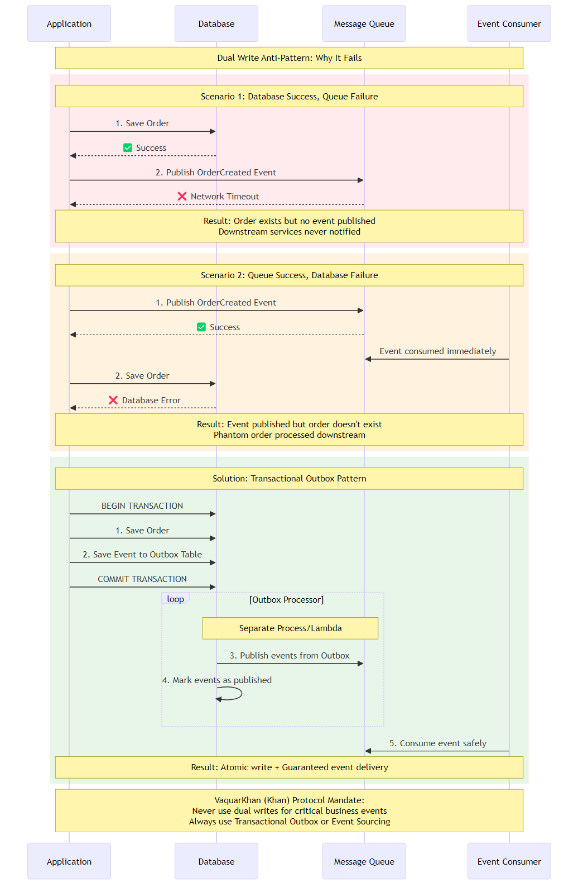

---
title: "Resilience and Reliability"
chapter: 6
author: "Viquar Khan"
date: "2026-01-15"
lastUpdated: "2026-02-10"
tags: 
  - microservices
  - architecture
  - distributed-systems
difficulty: "expert"
readingTime: "30 minutes"
---

# Chapter 6: The Dual Write Problem

<div class="chapter-header">
  <h2 class="chapter-subtitle">Resilience and Reliability in Distributed Systems</h2>
  <div class="chapter-meta">
    <span class="reading-time">📖 30 min read</span>
    <span class="difficulty">🎯 Expert</span>
  </div>
</div>

> *"There are only two hard things in Computer Science: cache invalidation and naming things."*  
> **Phil Karlton**

> *"There is a third: Data consistency in distributed systems."*  
> **The Senior Architect's Addendum**

In monolithic architecture, consistency is often taken for granted. The RDBMS acts as a massive, reliable safety net. If you want to create an order, debit a customer's balance, and insert a row into a notification table, you simply wrap these operations in a `BEGIN TRANSACTION... COMMIT` block. The database guarantees Atomicity: either all these things happen, or none of them do.

In microservices architecture, this safety net is gone. We've voluntarily traded the safety of ACID for the scalability of partitioning. But business requirements don't change just because our architecture did. We still need to update our database and notify other systems that something happened.

This brings us to the Dual Write Problem - the most pervasive source of data corruption in distributed systems.


*Figure 6.1: The Dual Write Problem sequence diagram showing failure scenarios and the Transactional Outbox pattern solution for guaranteed consistency*

## 6.1 The Fallacy of save() and publish()

The most common code snippet written by junior developers in a microservices environment looks something like this:

```python
# The Dual Write Anti-Pattern
def create_order(order):
    # Step 1: Save to local database (e.g., Postgres or DynamoDB)
    db.save(order)
    
    # Step 2: Publish event to message broker (e.g., Kafka, SQS, EventBridge)
    publisher.publish("OrderCreated", order)
```

To the uninitiated, this looks harmless. To the Senior Architect, this code is a ticking time bomb. It assumes two things that are physically impossible to guarantee simultaneously without a distributed coordinator:

1. The database will not fail.
2. The message broker will not fail.

### 6.1.1 Failure Mode A: The Zombie Record

Imagine the line `db.save(order)` executes successfully. The database commits the transaction. The order is now "real" in the Order Service.

Then, the instruction pointer moves to `publisher.publish(...)`.

Suddenly, a network blink occurs. The connection to the Message Broker times out. Or perhaps the process gets killed by the Kubernetes OOM killer.

**The Result:** The order exists in the database, but no event was ever sent. The Shipping Service never knows to ship it. The Billing Service never knows to charge for it. The customer sees a "Success" screen, but the order effectively falls into a black hole. This is a **Zombie Record**.

I've debugged this scenario at 2 AM more times than I'd like to admit.

### 6.1.2 Failure Mode B: The Ghost Message

To fix Failure Mode A, a clever developer might try to swap the order:

```python
# The Inverse Dual Write Anti-Pattern
def create_order(order):
    # Step 1: Publish first
    publisher.publish("OrderCreated", order)
    
    # Step 2: Then save to DB
    db.save(order)
```

Now, imagine `publisher.publish(...)` succeeds. The event goes out to the Shipping Service, which immediately starts printing a shipping label.

Then, `db.save(order)` executes. But the order fails validation. Or the database constraint is violated (e.g., "Duplicate Order ID"). The transaction rolls back.

**The Result:** The order doesn't exist in the Order Service, but the rest of the system believes it does. You've shipped a product for an order that you have no record of. This is a **Ghost Message**.

### 6.1.3 The Two Generals Problem

This dilemma is a practical manifestation of the Two Generals Problem, a classic thought experiment in computing. Two generals on opposite sides of a valley must agree to attack at the exact same time. They can only communicate by sending messengers through the valley. If a messenger is captured (packet loss), they cannot agree.

- General A says "Attack." (Write DB)
- General A waits for acknowledgement.
- General B says "Agreed." (Publish Event)
- If the acknowledgement is lost, General A attacks, but General B doesn't.

In distributed systems, you cannot guarantee that two distinct infrastructure components (DB and Broker) will agree on a state change simultaneously.

## 6.2 The Transactional Outbox Pattern

Since we cannot make the database and the broker join the same transaction (without incurring the massive performance penalty of 2PC/XA), we must change the game. We need to make the "Publish" operation part of the "Database" transaction.

We achieve this by introducing an **Outbox**.

### 6.2.1 The Concept

Instead of sending the message directly to the broker, we write the message to a table inside the same database as the business entity. Because it is the same database, we can wrap both writes in a single local transaction.

**The Atomic Transaction:**

```sql
INSERT INTO Orders (id, user, total) VALUES (...)
INSERT INTO Outbox (id, payload, status) VALUES (...,..., 'PENDING')
COMMIT
```

This guarantees atomicity. It is impossible to have an Order without an Outbox record, and impossible to have an Outbox record without an Order.

### 6.2.2 The Relay

Once the message is safely in the Outbox table, we have achieved durability. Now we need a separate, asynchronous process (The Relay) to pick up that message and push it to the broker.

If the Relay crashes, it just restarts and reads the Outbox again. If the Broker is down, the Relay keeps retrying. We have traded atomicity (which is impossible) for **at-least-once delivery** (which is robust).

## 6.3 Implementation Strategies on AWS

While the pattern is universal, the implementation details vary wildly depending on your technology stack. On AWS, we have moved beyond polling threads (the "Old Way") to event-driven logs.

**Strategy A: Polling Publisher (Legacy)**

A background worker queries the Outbox table every 500ms: `SELECT * FROM Outbox WHERE status = 'PENDING'`.

- **Pros**: Database agnostic. Works with any SQL DB.
- **Cons**: Database Polling Throttling. As your scale grows, these SELECT queries hammer your CPU. It also introduces latency (the sleep interval).

**Strategy B: Log Tailing (CDC)**

Tools like Debezium hook directly into the database's Write Ahead Log (WAL) or binary log. They see the raw bytes written to the disk and convert them into streams.

- **Pros**: Zero overhead on the database query engine. Real-time.
- **Cons**: Operational complexity. Running a Debezium/Kafka Connect cluster is a heavy lift.

**Strategy C: DynamoDB Streams (The Cloud Native Way)**

DynamoDB provides a built-in Change Data Capture (CDC) mechanism called DynamoDB Streams. It is a time-ordered sequence of item-level modifications. By enabling Streams, DynamoDB effectively acts as both our Database and our Message Buffer.

This is the preferred architecture for Serverless applications.
### Recipe 6.1: The Transactional Outbox with DynamoDB

**Problem**: You need to save a user profile and publish a UserCreated event to EventBridge, guaranteeing no data loss.

**Solution**: Use TransactWriteItems to write the User and an Outbox Item simultaneously. Use DynamoDB Streams and Lambda to relay the Outbox Item.

**Architecture Components:**

1. **DynamoDB Table**: Single Table Design containing both User entities and Outbox events.
2. **DynamoDB Stream**: Enabled on the table (New Image).
3. **Relay Lambda**: Triggered by the Stream. Filters for Outbox items and puts them to EventBridge.
4. **EventBridge**: The message bus for downstream consumers.

#### Step 1: The Write Path (Python Application Code)

We do not publish to EventBridge here. We only write to DynamoDB. We use the TransactWriteItems API to ensure the User and the Event are inseparable.

```python
import boto3
import uuid
import json
from datetime import datetime

dynamodb = boto3.client('dynamodb')
TABLE_NAME = "MyAppTable"

def create_user(user_id, email, full_name):
    # 1. Prepare the Business Entity (The User)
    user_item = {
        'PK': {'S': f"USER#{user_id}"},
        'SK': {'S': "PROFILE"},
        'Type': {'S': 'User'},
        'Email': {'S': email},
        'FullName': {'S': full_name},
        'CreatedAt': {'S': datetime.utcnow().isoformat()}
    }

    # 2. Prepare the Outbox Event
    # Note: We use a distinct PK/SK for the outbox item to avoid hot partitions
    # and allow easy filtering.
    event_id = str(uuid.uuid4())
    event_payload = {
        'event_id': event_id,
        'type': 'UserCreated',
        'data': {
            'user_id': user_id,
            'email': email
        }
    }
    
    outbox_item = {
        'PK': {'S': f"OUTBOX#{event_id}"},
        'SK': {'S': "EVENT"},
        'Type': {'S': 'Outbox'},
        'Payload': {'S': json.dumps(event_payload)},
        # TTL: Automatically delete this outbox item after 24 hours
        # to save storage costs. The event will have been published by then.
        'TTL': {'N': str(int(datetime.now().timestamp() + 86400))}
    }

    # 3. The Atomic Commit
    try:
        dynamodb.transact_write_items(
            TransactItems=[
                {'Put': {'TableName': TABLE_NAME, 'Item': user_item}},
                {'Put': {'TableName': TABLE_NAME, 'Item': outbox_item}}
            ]
        )
        print(f"Successfully created User {user_id} and Outbox Event {event_id}")
        return True
    except Exception as e:
        print(f"Transaction failed: {str(e)}")
        raise e
```
#### Step 2: The Relay (Lambda Stream Processor)

This Lambda listens to DynamoDB Stream. It must be resilient. If it fails to publish to EventBridge, it must retry, otherwise the event will be lost.

**Resilience Configuration:**

- **Batch Size**: Keep it small (e.g., 10) to minimize retry impact.
- **BisectBatchOnFunctionError**: ENABLED. If a batch fails, AWS splits it in half and retries. This isolates "poison pill" records.
- **MaximumRetryAttempts**: 3-5.
- **OnFailureDestination (DLQ)**: Send failed records to an SQS Dead Letter Queue after retries are exhausted.

```python
import boto3
import json
import os

eventbridge = boto3.client('events')
EVENT_BUS_NAME = os.environ.get('EVENT_BUS_NAME')

def handler(event, context):
    entries = []
    
    # Iterate through the batch of stream records
    for record in event['Records']:
        
        # 1. Filter: We only care about INSERTs to the Outbox
        if record['eventName'] != 'INSERT':
            continue
            
        image = record['dynamodb']['NewImage']
        item_type = image.get('Type', {}).get('S')
        
        # 2. Filter: Only process items flagged as 'Outbox'
        if item_type != 'Outbox':
            continue
            
        # 3. Deserialize the payload
        try:
            payload_str = image['Payload']['S']
            payload = json.loads(payload_str)
            
            # 4. Construct the EventBridge Entry
            entries.append({
                'Source': 'com.myapp.users',
                'DetailType': payload['type'],
                'Detail': json.dumps(payload['data']),
                'EventBusName': EVENT_BUS_NAME
            })
        except Exception as e:
            print(f"Failed to parse record: {e}")
            # In production, you might want to specifically handle malformed JSON
            # so it doesn't block the shard.
            raise e

    # 5. Bulk Publish to EventBridge
    if entries:
        try:
            # Note: put_events has a limit of 10 entries per call. 
            # Real production code should chunk 'entries' into groups of 10.
            response = eventbridge.put_events(Entries=entries)
            
            # Check for individual failures in the batch response
            if response['FailedEntryCount'] > 0:
                for idx, entry in enumerate(response['Entries']):
                    if 'ErrorCode' in entry:
                        print(f"Error publishing entry {idx}: {entry['ErrorCode']}")
                # Throwing an error here triggers the Lambda retry behavior (and Bisect)
                raise Exception("Failed to publish some events to EventBridge")
                
            print(f"Successfully published {len(entries)} events.")
            
        except Exception as e:
            print(f"Fatal error publishing to EventBridge: {e}")
            raise e
            
    return {"status": "success", "processed_count": len(entries)}
```
#### Step 3: Cleaning Up (The TTL Trick)

Traditional Outbox implementations require a second step to "delete" the message from the Outbox table once published.

In DynamoDB, we can use Time to Live (TTL).

In the write code above, we set TTL to Now + 24 Hours.

- We do not need to delete the item immediately.
- We let DynamoDB's background process delete it for free (TTL deletes do not consume Write Capacity Units).

**Why wait 24 hours?** It provides a buffer. If EventBridge goes down for 6 hours, the record is still there and can be replayed/reprocessed if we need to reset the stream checkpoint.

## 6.4 Why Not Just Use CDC (Stream the User Item)?

A common question from Senior Engineers is: "Why do we need a separate Outbox item? Why can't we just listen to Stream for the User item itself and publish that?"

This pattern is known as Transaction Log Tailing. It is valid, but it has a massive strategic flaw: it couples your public interface to your internal schema.

If you publish the raw User record from the database stream:

1. **Leaky Abstraction**: Your downstream services now know your internal column names, your hashed password fields, and your database structure.
2. **Breaking Changes**: If you rename a column in your database for optimization, you break every downstream microservice that listens to the event.

The Explicit Outbox pattern decouples these concerns.

- **Internal Schema**: User table (optimized for access patterns).
- **Public Contract**: Outbox payload (optimized for integration).

You map from Internal to Public at the moment of the transaction. This is the Anti-Corruption Layer applied to your own events.

## 6.5 Conclusion: The Reliability Tax

The Transactional Outbox pattern is not free. It doubles your write costs (two writes per transaction). It introduces latency (the time from DB commit to Stream trigger to Lambda execution). It requires infrastructure (Streams, Lambda).

However, it is the only way to guarantee data consistency in an event-driven system. Without it, you are building a system that is "mostly correct, most of the time." In the world of finance, healthcare, and enterprise commerce, "mostly correct" is just another word for "broken."

The Senior Architect accepts this complexity not as a burden, but as the necessary insurance premium for a system that sleeps well at night.

---

## Summary

This chapter explored resilience and reliability in microservices architecture, providing practical insights and patterns for implementation.

## What's Next?

In the next chapter, we'll continue our journey through microservices architecture.

---

**Navigation:**
- [← Previous: Chapter 5](05-deployment-and-operations.md)
- [Next: Chapter 7 →](07-security.md)
