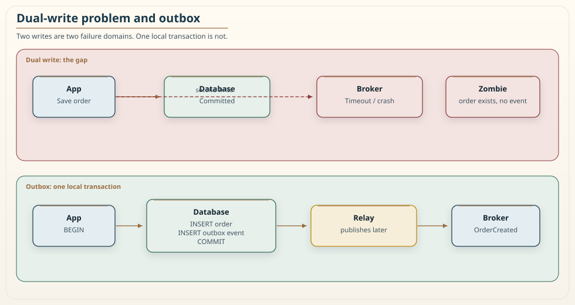
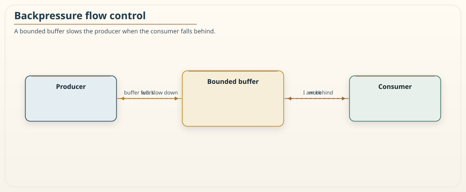

# Chapter 6: Resilience and Reliability

<div class="chapter-header">
  <h2 class="chapter-subtitle">Close the Dual Write, Then Survive the Failures You Cannot Prevent</h2>
  <div class="chapter-meta">
    <span class="reading-time">📖 45 min read</span>
    <span class="difficulty">🎯 Expert</span>
  </div>
</div>

> *"Part II: Data Architecture"*
> **Focus:** The dual write is where correctness is lost silently. The resilience toolkit is how a service stays up when dependencies wobble.

This chapter is about keeping a distributed system correct and available when things fail, and in a distributed system things fail constantly. It has two halves that belong together. The first is the single most common data-corruption bug in event-driven systems, the dual write, and the transactional outbox pattern that fixes it. The second is the broader resilience toolkit, timeouts, retries, circuit breakers, bulkheads, and graceful degradation, that keeps a service standing when its dependencies wobble. The dual write is where reliability is most often lost silently; the toolkit is how a service survives the failures it cannot prevent.

There is a quote worth keeping in mind, usually attributed to Phil Karlton: there are only two hard things in computer science, cache invalidation and naming things. The senior architect adds a third, data consistency in distributed systems, and this chapter is about the part of that third problem that bites hardest in practice.

Chapter 4 named the dual write as Two Generals in operational clothing and offered Listen to Yourself when the stream is the system of record. This chapter is the complementary case, the one most services actually live in: **the database is the system of record, and the event must not disagree with it.**

## 6.1 The dual write problem

In a monolith, consistency is nearly free. To create an order, debit a balance, and write a notification row, you wrap the three in a single database transaction and the engine guarantees atomicity: all of them happen or none do. In microservices that safety net is gone, because you traded ACID for the scalability of partitioning. But the business still needs to update its own data and tell other systems that something happened, and that is where the dual write appears.


*Figure 6.1: The dual write and its fix. In the top sequence, a service writes to its database and then publishes an event as two separate operations; the diagram highlights the gap between them, where a crash or network failure leaves the database updated but the event unsent, or the reverse. In the bottom sequence, the transactional outbox fix: the event is written to an outbox table inside the same database transaction as the business data, so the two commit together atomically, and a separate relay publishes the event afterward. The dual write's danger lives entirely in the gap between two independent writes, and the outbox closes that gap by making them one write.*

The most common code a developer writes in an event-driven system looks harmless:

```python
def create_order(order):
    db.save(order)                              # step 1: commit to the local database
    publisher.publish("OrderCreated", order)    # step 2: publish to the broker
```

It is a time bomb, because it assumes two independent infrastructure components, the database and the broker, will both succeed, and nothing guarantees that. There are two symmetric failure modes, and swapping the order of the two writes only swaps which one you get.

**The zombie record.** The database commit succeeds, and then, before the publish, the network blinks or the process is killed. The order is now real in the database, but no event was ever sent, so the shipping service never ships and the billing service never charges. The customer saw a success screen and the order fell into a black hole. This is the failure I have debugged at two in the morning more times than I would like to admit.

**The ghost message.** To fix the zombie, a developer publishes first and saves second. Now the publish succeeds, the shipping service starts printing a label, and then the database save fails a constraint and rolls back. The order does not exist in the order service, but the rest of the system believes it does, and you have shipped a product for an order you have no record of.

Both are the Two Generals Problem from Chapter 4 in operational clothing: two parties communicating over an unreliable link cannot be guaranteed to agree on a state change. You cannot make two distinct infrastructure components commit atomically without a distributed coordinator, and two-phase commit, the coordinator that would do it, is the wrong default Chapter 5 explained. So instead of forcing the database and the broker into one transaction, you change the game.

## 6.2 The transactional outbox

The insight is to make the publish part of the database write. Instead of sending the event to the broker directly, write the event to an outbox table in the same database as the business entity, inside the same local transaction:

```sql
BEGIN;
  INSERT INTO orders (id, customer, total) VALUES (...);
  INSERT INTO outbox (id, payload, status) VALUES (..., ..., 'PENDING');
COMMIT;
```

Because both writes are in one local transaction, they are atomic: it is impossible to have an order without its outbox record, or an outbox record without its order. The dual write is gone, replaced by a single write that cannot partially fail.

Once the event is safely in the outbox table, a separate asynchronous process, the relay, reads pending outbox records and publishes them to the broker. If the relay crashes it restarts and reads the outbox again; if the broker is down it keeps retrying. You have traded atomicity across two systems, which is impossible, for at-least-once delivery from the outbox, which is robust, and at-least-once delivery is fine because your consumers are idempotent, as Chapter 5 required. The outbox is the pattern that makes event-driven consistency trustworthy, and everything else in an event system assumes it is in place.

The outbox is not free. You pay a second write, a relay, and the latency from commit to bus. That is the insurance premium. Listen to Yourself, from Chapter 4, inverts the same idea when the *stream* is the system of record. Do not run both on the same write path. Pick one source of truth.

## 6.3 Implementing the outbox on AWS

The pattern is universal; the implementation depends on the stack. There are three ways to get events out of the outbox and onto the bus, in increasing order of how cloud-native they are.

**The polling publisher** is the oldest: a background worker periodically queries the outbox for pending rows and publishes them. It works with any SQL database, but it hammers the database with select queries as scale grows and adds latency equal to the poll interval. If you poll SQL, use `FOR UPDATE SKIP LOCKED` (or the equivalent) so two workers do not grab the same row, and mark published in the same update that you claim the row.

**Log tailing** uses change-data-capture tools such as Debezium that read the database's write-ahead log directly and turn committed changes into a stream, which adds almost no query overhead and is near real-time, at the cost of operating a capture cluster.

**The cloud-native approach on AWS is DynamoDB Streams**, a built-in change-data-capture feed of item-level modifications, which lets DynamoDB act as both the database and the message buffer and is the preferred design for serverless systems.

### Recipe 6.1: The transactional outbox with DynamoDB

The write path writes the business entity and the outbox event together with `TransactWriteItems`, so they are inseparable, and never publishes directly.

Key the outbox item on the *same partition as the entity*, not on `OUTBOX#{uuid}`. DynamoDB Streams preserve order *per shard*, and shards follow the partition key. A random outbox key puts `UserCreated` and `UserUpdated` on different shards and can deliver them out of order. `USER#{id}` plus a sort key of `EVENT#{time}#{event_id}` keeps one user's events ordered.

```python
import json
import uuid
from datetime import datetime, timezone, timedelta

import boto3

dynamodb = boto3.client("dynamodb")
TABLE_NAME = "MyAppTable"


def create_user(user_id, email, full_name):
    now = datetime.now(timezone.utc)
    user_item = {
        "PK": {"S": f"USER#{user_id}"},
        "SK": {"S": "PROFILE"},
        "Type": {"S": "User"},
        "Email": {"S": email},
        "FullName": {"S": full_name},
        "CreatedAt": {"S": now.isoformat()},
    }
    event_id = str(uuid.uuid4())
    payload = {
        "event_id": event_id,
        "type": "UserCreated",
        "data": {"user_id": user_id, "email": email},
    }
    outbox_item = {
        "PK": {"S": f"USER#{user_id}"},
        "SK": {"S": f"EVENT#{now.strftime('%Y%m%dT%H%M%S%f')}#{event_id}"},
        "Type": {"S": "Outbox"},
        "Payload": {"S": json.dumps(payload)},
        # TTL is eventually consistent and often later than the timestamp.
        # It is a cleanup hint, not a replay guarantee. See below.
        "TTL": {"N": str(int((now + timedelta(hours=24)).timestamp()))},
    }
    dynamodb.transact_write_items(TransactItems=[
        {"Put": {"TableName": TABLE_NAME, "Item": user_item}},
        {"Put": {"TableName": TABLE_NAME, "Item": outbox_item}},
    ])
```

The relay is a Lambda triggered by the stream. Filter for outbox inserts in code, or better, attach event-source filter criteria so user-profile writes never wake the function. Configure the mapping for resilience: a small batch size, bisect-batch-on-error so one poison record does not fail the whole batch, a few retries, and a dead-letter queue for records that still fail.

`put_events` accepts at most ten entries and one megabyte. A partial success plus a raised exception retries the *whole* Lambda batch, including events EventBridge already accepted. That is at-least-once, not a bug you can code away. Put `event_id` in the detail, retry only remaining failures in-process, and require consumers to treat `event_id` as an idempotency key.

```python
import json
import os

import boto3

eventbridge = boto3.client("events")
EVENT_BUS_NAME = os.environ["EVENT_BUS_NAME"]


def _chunks(items, size=10):
    for i in range(0, len(items), size):
        yield items[i:i + size]


def handler(event, context):
    entries = []
    for record in event["Records"]:
        if record["eventName"] != "INSERT":
            continue
        image = record["dynamodb"]["NewImage"]
        if image.get("Type", {}).get("S") != "Outbox":
            continue
        payload = json.loads(image["Payload"]["S"])
        entries.append({
            "Source": "com.myapp.users",
            "DetailType": payload["type"],
            "Detail": json.dumps({
                **payload["data"],
                "event_id": payload["event_id"],
            }),
            "EventBusName": EVENT_BUS_NAME,
        })

    remaining = entries
    for _ in range(3):
        if not remaining:
            break
        still_failed = []
        for chunk in _chunks(remaining, 10):
            response = eventbridge.put_events(Entries=chunk)
            for idx, result in enumerate(response.get("Entries", [])):
                if "ErrorCode" in result:
                    still_failed.append(chunk[idx])
        remaining = still_failed
    if remaining:
        raise Exception(f"{len(remaining)} events failed to publish")
    return {"processed": len(entries)}
```

TTL cleanup is convenient and not a replay plan. DynamoDB TTL deletes are free of write capacity and often land hours after the timestamp. DynamoDB Streams retain records for twenty-four hours. Those are *different clocks*. If the relay is down longer than stream retention, resetting the iterator will not see the events even if the outbox items are still in the table. The durable replay is a sweeper that scans leftover outbox items and re-publishes them, with the same `event_id` so consumers ignore duplicates. Twenty-four hours of TTL is a cost control, not a promise.

## 6.4 Why not publish the raw record

A common question is why the outbox needs a separate event item at all, rather than just streaming the user record itself from change-data-capture. That variant, transaction-log tailing of the entity, is valid but has a serious flaw: it couples your public event contract to your internal database schema. If you publish the raw record, downstream services now depend on your internal column names and structure, so renaming a column for an internal optimization breaks every consumer, and you may leak fields, such as hashed credentials, that were never meant to cross the boundary. You also publish *every* mutation, including the ones that are not business events.

The explicit outbox decouples these. The internal schema stays optimized for your access patterns, the outbox payload is a deliberate public contract optimized for integration, and you map from internal to public at the moment of the transaction. This is the anti-corruption layer from Chapter 3 applied to your own events, and it is worth the extra item, because an event contract that is accidentally your database schema is a contract you can never safely change.

## 6.5 The resilience toolkit

The outbox keeps your data consistent. Keeping your service available when its dependencies fail is a different problem, and it is solved by a small set of patterns that every distributed service needs. None is exotic, and a service missing any one of them will eventually be taken down by a dependency it could have survived.

**The timeout.** Every call to another service or resource must have a timeout, because a call without one waits forever, and a thread waiting forever is a thread that cannot serve other requests. Set both a connect timeout and a request timeout. Many clients default to no timeout or a very long one, so a slow dependency silently exhausts your thread pool and your service stops responding even though nothing crashed. Make your timeout shorter than the patience of whatever is calling you, so you fail before your caller gives up on you. A chain of services that each wait longer than their caller is how a two-second browser abort becomes a thirty-second pile of work that nobody will see.

**The retry, with two mandatory qualifications.** Retry only idempotent operations, because retrying a non-idempotent call can double a charge. Retry timeouts, 429s, and 5xx, not a 400 that will fail the same way forever. Retry with exponential backoff and jitter rather than immediately. Immediate retries during an overload add load to a struggling dependency and cause the death spiral from Chapter 5; exponential backoff waits progressively longer, and jitter, a random perturbation of the wait, desynchronizes many clients so they do not all retry in the same instant and create a thundering herd when the dependency recovers. A retry without backoff and jitter is often worse than no retry at all.

**The circuit breaker**, which stops you from hammering a dependency that is clearly failing. Like an electrical breaker, it has three states. Closed is normal, calls pass through. When failures exceed a threshold it trips to open, and for a cool-down period all calls fail immediately without even attempting the dependency, which both protects the struggling dependency from load and protects your own threads from blocking on calls that will fail anyway. After the cool-down it moves to half-open, allowing a *small number of probe* calls, and if they succeed it closes, and if they fail it opens again. The circuit breaker converts a slow, resource-exhausting failure into a fast, cheap one, and fast failure is what lets the rest of your service keep working.

**The bulkhead**, named after the compartments that keep a breached ship from flooding entirely. Isolate resources so that a failure in one area cannot consume all the capacity of the whole service. If every outbound call shares one thread pool, a single slow dependency can consume the entire pool and take down calls to healthy dependencies too. Giving each dependency its own bounded pool, or its own Lambda reserved concurrency, or its own connection pool, means a slow dependency exhausts only its own compartment. This is the same blast-radius thinking as the cells and shuffle sharding of Chapter 12, applied inside a single service.

These four patterns compose. A well-behaved outbound call has a timeout so it cannot hang, sits behind a circuit breaker so repeated failures fail fast, retries with backoff and jitter within the limits the breaker allows, and draws from a bounded bulkhead pool so it cannot starve other calls. Libraries such as resilience4j and tenacity package the pieces, but the value is understanding what each does, because a team that adds a retry without a circuit breaker, or a circuit breaker without timeouts, has built a resilience pattern that makes failure worse rather than better.

Here is the composition made concrete. It is pedagogical. Do not `sleep` on a request thread in production; use a scheduled executor or an async delay. Count a *logical call* against the breaker after retries, not every attempt, or three retries will trip a breaker that was meant to tolerate three failures. Half-open must admit a probe permit, not every waiting caller at once.

```python
import random
import time


class CircuitBreaker:
    def __init__(self, failure_threshold=5, cooldown_seconds=30):
        self.failure_threshold = failure_threshold
        self.cooldown_seconds = cooldown_seconds
        self.failures = 0
        self.opened_at = None
        self.probing = False

    def allow(self):
        if self.opened_at is None:
            return True
        if time.time() - self.opened_at < self.cooldown_seconds:
            return False
        if self.probing:
            return False
        self.probing = True
        return True

    def record(self, ok):
        self.probing = False
        if ok:
            self.failures, self.opened_at = 0, None
        else:
            self.failures += 1
            if self.failures >= self.failure_threshold:
                self.opened_at = time.time()


def call_with_resilience(fn, breaker, timeout=2.0, max_retries=3):
    if not breaker.allow():
        raise CircuitOpenError("dependency is failing; failing fast")
    last_error = None
    for attempt in range(max_retries):
        try:
            result = fn(timeout=timeout)
            breaker.record(ok=True)
            return result
        except TransientError as exc:
            last_error = exc
            # full jitter: sleep in [0, min(cap, base * 2**attempt)]
            time.sleep(random.uniform(0, min(8.0, 2 ** attempt)))
    breaker.record(ok=False)
    raise last_error
```

The shape is the lesson: the timeout bounds each attempt, the breaker refuses calls when the dependency is clearly down, and the retry waits progressively longer with jitter so a recovering dependency is not stampeded. Only idempotent operations should be passed to this wrapper, because a retried non-idempotent call can double its effect.

## 6.6 Dead letters, health, and graceful degradation

Three more practices complete the reliability picture, and each addresses a failure the toolkit above does not.

**The dead-letter queue** handles the poison message. When a consumer cannot process a message after its retries are exhausted, the message must go somewhere other than back into the queue, or it blocks the queue forever while it fails over and over. A dead-letter queue is that somewhere: the poison message is moved aside for later inspection and manual redrive, and the pipeline keeps flowing. Every consumer of a queue or stream needs one, and an alert on the dead-letter queue's depth is one of the most valuable alarms you can have, because a rising dead-letter count is a precise signal that something is systematically failing. A DLQ nobody pages on is a silent trash can.

**Health checks** let the platform route around a sick instance, and the important distinction is between liveness and readiness. A liveness check answers whether the process is alive at all, and failing it means the orchestrator restarts the instance. Keep it cheap and local: the process can run its event loop. A readiness check answers whether the instance is ready to serve traffic right now, and failing it means the orchestrator stops sending it requests without killing it, which is what you want during startup or while a bulkhead is saturated.

Conflating the two is a common bug. A readiness check that fails on a transient dependency blip should not cause a restart. A liveness check that depends on a downstream service can cause a cascade of restarts when that service has a bad minute. A deeper trap: if *every* instance fails readiness because Redis is down, the load balancer removes the whole fleet and you have zero capacity. Sometimes the correct readiness answer while a non-critical dependency is down is "still ready," and the circuit breaker plus graceful degradation handle the missing piece. Fail readiness for *local* inability to serve, not for every dependency cough.

**Graceful degradation** is the discipline of failing partially rather than totally. When a dependency is down, a well-designed service does not return an error for the whole request if it can return a useful partial answer instead. A product page whose recommendation service is down should still show the product, just without recommendations, rather than showing an error. This requires deciding in advance which parts of each response are essential and which are enhancements, and building the service so the enhancements can be dropped under failure. A system that degrades gracefully turns a dependency outage into a slightly poorer experience rather than a total one, which is often the difference between an incident customers notice and one they do not.

## 6.7 Backpressure and load shedding

The last failure the toolkit must handle is too much work rather than a broken dependency. When requests arrive faster than a service can process them, an unmanaged service accepts them all, its queues grow, its memory fills, its latency climbs, and eventually it falls over, taking every in-flight request with it. The disciplined response is to push back or shed load before that happens, so the service degrades predictably under overload rather than collapsing.


*Figure 6.2: Backpressure as flow control. A producer sends work to a consumer through a bounded buffer. When the buffer fills, a backpressure signal flows back to the producer telling it to slow down, rather than letting the buffer grow without limit until memory is exhausted. A healthy system has a way to say not so fast: the bounded buffer plus the backpressure signal converts an unbounded, crash-prone overload into a bounded, survivable slowdown, which is the difference between a service that degrades and one that dies.*

**Backpressure** is the cooperative version: the consumer signals the producer to slow down, and the producer obeys, so the buffer between them stays bounded. Streaming systems and reactive frameworks build this in, and a queue with a bounded size is its simplest form, because a full bounded queue naturally slows a producer that must wait to enqueue.

**Load shedding** is the unilateral version, used when you cannot slow the producer, for example when the producer is the public internet: the service protects itself by rejecting some requests early, ideally the least important ones, with a fast, cheap rejection such as a 429, so that the requests it does accept are served well. Shed the cheapest work first, or the newest arrival if in-flight work is more expensive to abandon. The counterintuitive truth is that a service which sheds ten percent of load and serves the rest within its latency target is more available, in the sense of goodput, than one that accepts everything and serves all of it slowly or none of it at all. Deciding in advance what to shed, and shedding it fast, is what keeps an overloaded service useful instead of merely busy failing.

## 6.8 Deciding how much reliability to build

Every pattern in this chapter has a cost, in code, in latency, and in operational complexity, so the honest question is not how do I make this service perfectly reliable, which is impossible and would be ruinously expensive if it were not, but how reliable does this service actually need to be. Answering that question deliberately, rather than by reflex, is what separates a team that spends its reliability effort where it matters from one that gold-plates the trivial and neglects the critical.

The tool for this is the **service-level objective**, a precise, measured target for a service's reliability stated in terms the user experiences, such as 99.9 percent of requests succeed within 300 milliseconds over a rolling twenty-eight-day window. The thing you measure is the SLI. The objective you promise internally is the SLO. The contract you might owe a customer is the SLA, and it should be looser than the SLO so you have room to notice a burn before you owe money. The objective is deliberately not 100 percent, because 100 percent is the wrong target: it is unachievable, and chasing it means spending unbounded effort to remove risk that users would never have noticed.

The gap between the objective and 100 percent is the **error budget**, and it is the most useful idea in operational reliability. If your objective is 99.9 percent, your error budget is 0.1 percent of requests, and that budget is a currency you get to spend. When the budget is intact, the team can spend it on velocity: ship faster, take more risk, run the chaos experiments of Chapter 13, because there is room to absorb the occasional failure they cause. When the budget is exhausted, stop shipping features and spend effort on reliability until the budget recovers. This removes the sterile standoff between the team that wants to ship and the team that wants stability, because both are now governed by the same number, and the number is derived from what users actually tolerate rather than from anyone's preference.

The connection to the toolkit is direct. A service with a demanding objective and a thin error budget needs the full toolkit, timeouts, retries, circuit breakers, bulkheads, dead-letter queues, and graceful degradation, all in place and tested, because it cannot afford the failures they prevent. A back-office service with a generous objective and a fat error budget can run with less, and building the full apparatus for it is effort stolen from the services that need it. This is the same principle the whole book returns to: reliability, like granularity, is not a fixed ideal to maximize everywhere but a level you calibrate to what each boundary actually requires, and the error budget is how you measure the requirement rather than guess it. It also feeds directly into the maturity model of Chapter 20, where an organization's ability to set and defend error budgets is a marker of operational maturity, and into chaos engineering, where the budget is precisely what tells you whether you can afford to break something on purpose this week.

## 6.9 Summary

Reliability in a distributed system is won in two places. The first is consistency, where the dual write is the most common and most silent corruption bug: committing to a database and publishing an event as two separate operations leaves a gap in which a failure produces a zombie record or a ghost message, because two independent components cannot commit atomically. The transactional outbox closes the gap by writing the event to an outbox table inside the same transaction as the business data, then relaying it asynchronously with at-least-once delivery to idempotent consumers. Implement it with change-data-capture, DynamoDB Streams being the cloud-native choice, key the outbox on the entity's partition so events stay ordered, and always publish an explicit outbox payload rather than the raw record, so your public event contract is not accidentally your database schema. TTL is cleanup. A sweeper is replay. Stream retention is a third clock.

The second is availability under failure, where a small toolkit keeps a service standing when its dependencies wobble. Give every outbound call a deliberate connect and request timeout so it cannot hang and exhaust your threads. Retry only idempotent operations, and only with exponential backoff and jitter, so retries calm a struggling dependency instead of stampeding it. Put a circuit breaker in front of failing dependencies to convert slow, resource-eating failures into fast cheap ones, and probe half-open with a permit, not a stampede. Isolate resources with bulkheads so one slow dependency cannot starve the rest. And complete the picture with dead-letter queues for poison messages, distinct liveness and readiness health checks that do not empty the fleet when a dependency coughs, and graceful degradation so an outage costs you a feature rather than the whole request. When the work itself is the failure, bound the buffer and shed load for goodput.

The recurring theme is that reliability is not the absence of failure, which is impossible, but the containment of it, and every pattern here is a way to keep one failure from becoming many. Spend the toolkit where the error budget is thin. The next chapter turns from surviving failure to proving who is allowed to cause it: security when every hop is a door.

---

**Navigation:**
- [Previous: Chapter 5](05-deployment-and-operations.md)
- [Next: Chapter 7](07-security.md)
