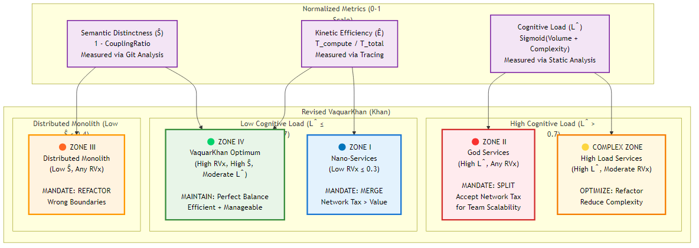
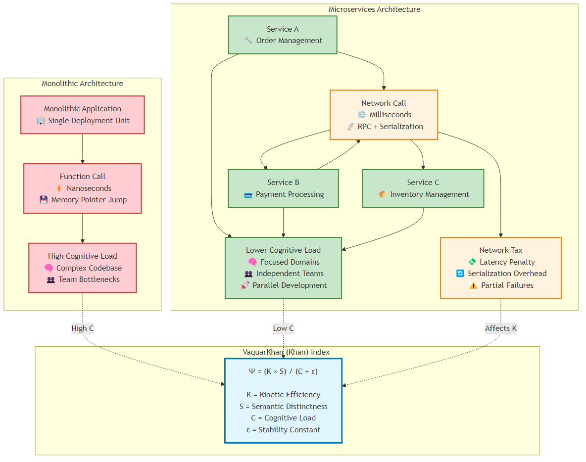
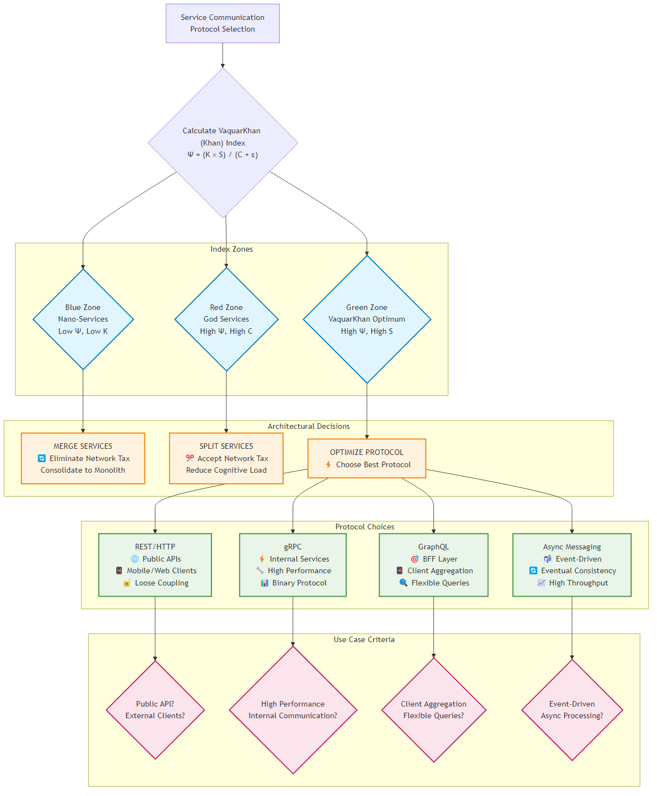

# Chapter 8: The Trinity of Protocols

<div class="chapter-header">
  <h2 class="chapter-subtitle">Inter-Process Communication (The Nervous System)</h2>
  <div class="chapter-meta">
    <span class="reading-time">📖 40 min read</span>
    <span class="difficulty">🎯 Expert</span>
  </div>
</div>

## Part III: Inter-Process Communication (The Nervous System)

**Focus**: Moving bits between services without creating latency storms.

## Introduction: The Nervous System of the Distributed Enterprise

In the maturation of cloud-native architecture, the year 2026 represents a pivotal inflection point where the industry has decisively moved beyond the rudimentary "microservices versus monolith" debate into a nuanced era of protocol specialization.

The network, once treated as a transparent abstraction by optimistic developers, is now understood by the Senior Architect as the definitive constraint of system performance—a physical reality governed by the speed of light, packet loss, and serialization overhead. This chapter, "The Trinity of Protocols," serves not merely as a catalog of options but as a rigorous, evidence-based field guide for designing the nervous system of the modern distributed enterprise.

The transition from monolithic architecture to distributed systems is fundamentally an exchange of complexity. We trade the cognitive load of a unified codebase for the operational load of a fragmented topology. In doing so, we incur a non-negotiable cost known as the "Distributed System Tax".

In a monolithic application, a function call is a memory pointer jump executing in nanoseconds. In microservices architecture, that same logical interaction transforms into a remote procedure call (RPC) traversing the network stack, encompassing serialization, packetization, transmission, buffering, and deserialization. This transformation increases latency by orders of magnitude—typically from nanoseconds to milliseconds, a factor of 10³ to 10⁶.

To mitigate this tax, the modern architect must reject the "one size fits all" dogma that plagued the early 2020s, where RESTful JSON over HTTP/1.1 was universally applied regardless of the use case. Instead, we embrace a "Trinity" of protocols, each mathematically optimized for a specific domain of the architecture: REST for the chaotic, unmanaged public edge; gRPC for the high-velocity, deterministic internal mesh; and GraphQL for the flexible, aggregated Backend-for-Frontend (BFF) layer.

This chapter synthesizes deep technical research, benchmarking methodologies, and sociotechnical theory to provide the blueprints for a system that scales without collapsing under its own communicative weight.
## 8.1 The Theoretical Framework: Quantifying the Network Tax

Before a single line of interface definition language (IDL) is written, the architect must engage in an economic analysis of computing resources. The decision to define a service boundary—and consequently, the protocol that bridges it—is a calculation of "Kinetic Friction" versus "Cognitive Load".

### 8.1.1 The VaquarKhan (Khan) Index (Ψ) and Protocol Selection Logic

The VaquarKhan (Khan) Index (Ψ) serves as the "Check Engine Light" for microservice granularity, providing a quantitative basis for protocol selection. It moves the discussion from subjective preference to objective metric, assessing whether a service boundary contributes to system velocity or merely adds to the "Network Tax".



*Figure 8.1: The VaquarKhan (Khan) Granularity Matrix showing the four architectural zones and their corresponding mandates*

### 8.1.2 Mathematical Rigor and Dimensional Consistency

The original VaquarKhan (Khan) Index formulation suffered from critical mathematical flaws that have been addressed in the Revised VaquarKhan Index (RVx). These corrections ensure the formula is suitable for automated governance and dashboard implementation.

**Dimensional Homogeneity**: All variables are normalized to dimensionless ratios (0-1), eliminating unit dependency issues that could make scores incomparable across different measurement contexts.

**Singularity Prevention**: The epsilon constant (ε = 0.1) prevents division-by-zero scenarios when analyzing trivial services with minimal cognitive load.

**Zone Logic Correction**: The decision matrix approach resolves the logical inversion where complex services might incorrectly appear as "low risk" due to mathematical artifacts.

**Operational Measurability**: Each variable is tied to concrete data sources:
- **Ê**: Distributed tracing telemetry (OpenTelemetry, Jaeger)
- **L̂**: Static code analysis metrics (SonarQube, CodeClimate)  
- **Ŝ**: Version control forensics (Git commit correlation analysis)

This mathematical foundation transforms the VaquarKhan (Khan) Protocol from a conceptual framework into a rigorous engineering standard suitable for industrial application.

#### The Revised VaquarKhan (Khan) Index Formula (RVx):

```
RVx = (Ê × Ŝ) / (L̂ + ε)
```

**Where all variables are normalized to dimensionless ratios (0 ≤ value ≤ 1):**

**Ê (Normalized Kinetic Efficiency)**: 
```
Ê = T_compute / (T_compute + T_network + T_serialize + T_mesh)
```
Measured via distributed tracing (OpenTelemetry). Represents the percentage of transaction time spent on useful computation versus total overhead.

**L̂ (Normalized Cognitive Load)**: 
```
L̂ = 1 / (1 + e^(-(w₁·V + w₂·C + w₃·F - Offset)))
```
Sigmoid function combining Volume (Lines of Code), Complexity (Cyclomatic), and Fan-out (Dependencies) from static analysis tools.

**Ŝ (Normalized Semantic Distinctness)**: 
```
Ŝ = 1.0 - CouplingRatio
```
Where CouplingRatio is the probability that commits to this service require simultaneous commits to other services (Temporal Coupling analysis from Git history).

**ε (Epsilon)**: Stability constant (0.1) preventing singularity for trivial services.
The resulting score maps services into the VaquarKhan (Khan) Granularity Matrix via decision zones:

**Zone I: The Nano-Swarm (Low RVx ≤ 0.3)**
- **Characteristics**: Low Ê (high network tax), Low L̂ (simple code)
- **Architectural Mandate**: MERGE. The service is too small; network overhead exceeds computational value.
- **Protocol Implication**: Eliminate the service boundary entirely or use lowest-latency protocols (gRPC over Unix sockets).

**Zone II: The God Service (High L̂ > 0.7, regardless of RVx)**
- **Characteristics**: High L̂ (cognitive overload), potentially High Ê (efficient but complex)
- **Architectural Mandate**: SPLIT. Accept network tax for team scalability and maintainability.
- **Protocol Implication**: Use gRPC for internal decomposition to minimize latency impact of splitting.

**Zone III: The Distributed Monolith (Low Ŝ ≤ 0.4)**
- **Characteristics**: Low Ŝ (temporal coupling), services change in lockstep
- **Architectural Mandate**: REFACTOR. Service boundaries don't respect domain boundaries.
- **Protocol Implication**: Redesign service contracts before optimizing protocols.

**Zone IV: The VaquarKhan (Khan) Optimum (High RVx > 0.6, High Ŝ > 0.6, Moderate L̂)**
- **Characteristics**: Balanced efficiency, clear boundaries, manageable complexity
- **Architectural Mandate**: MAINTAIN. Focus on protocol optimization rather than boundary changes.

### 8.1.3 The Physics of Latency: The Distributed System Tax

The "Distributed System Tax" is quantified through the Latency Chain Model. In 2026, empirical analysis confirms that deep synchronous chains of microservices are inherently fragile due to variance amplification. The latency of a microservice architecture is defined as:



*Figure 8.2: Comparison of Network Tax in Monolithic vs Microservices Architecture, illustrating the VaquarKhan (Khan) Index trade-offs*

```
L_total = L_compute + L_network + L_serialize + L_mesh
```

In this equation, `L_compute` is the only value-adding component (the actual computation). The remaining terms `L_network` (network transmission), `L_serialize` (serialization), and `L_mesh` (service mesh overhead) are pure waste, or "tax," paid for the privilege of distribution.

Benchmark data from 2026 clearly illustrates the magnitude of this tax:

- **Throughput Deficit**: Monolithic architecture consistently demonstrates approximately 6% higher throughput than their microservice equivalents in concurrency testing due to the absence of this tax.

- **Variance Amplification**: For every synchronous hop added to a request chain, the p99 (tail) latency increases by 15–25%. This non-linear degradation means that a service with a 1% probability of slowness causes a request chain of 100 services to have a 63% probability of being slow.

- **Infrastructure Overhead**: The choice of infrastructure layers exacerbates this tax. For example, benchmarks at 2,000 requests per second (RPS) show that heavy service meshes (like older versions of Istio) can add substantial latency, whereas modern eBPF-based meshes like Cilium add significantly less.

The selection of a protocol from the "Trinity" is essentially an exercise in minimizing specific variables in this equation. REST (using JSON) astronomically increases `L_serialize` due to textual parsing overhead. gRPC (using Protobuf) minimizes `L_serialize` and `L_network`. GraphQL (using aggregations) attempts to reduce the number of hops from the client's perspective.
## 8.2 REST — The Public Interface Standard

Despite the rapid adoption of high-performance alternatives, REST (Representational State Transfer) remains the immutable bedrock of the public internet in 2026. Its dominance is preserved not by raw throughput, but by the "Law of Least Surprise"—its ubiquity, discoverability, and the massive, decentralized infrastructure of the web that supports it.

### 8.2.1 The Utility of REST in the Modern Era

For the Senior Architect, REST is the default choice for public-facing APIs, B2B integrations, and unknown clients. The strict separation of client and server, enforcing statelessness and standardized HTTP semantics (GET, POST, PUT, DELETE), ensures that any client, from a legacy banking mainframe to a smart toaster, can interact with the system without needing a specialized client library.

**The Caching Imperative**: REST's adherence to HTTP semantics unlocks the massive power of the global caching infrastructure. By correctly utilizing headers like `ETag`, `Last-Modified`, and `Cache-Control`, a REST API allows intermediaries—CDNs (Content Delivery Networks), corporate proxies, and browser caches—to serve requests without them ever reaching the origin server. This capability is architecturally unique to REST; gRPC (which uses POST for everything) and GraphQL (which typically uses POST) generally bypass these caching mechanisms, forcing every request to consume backend compute resources. For read-heavy public workloads, this caching capability effectively reduces `L_network` and `L_compute` to zero for a significant percentage of traffic.

### 8.2.2 The Performance Wall: Why REST Fails Internally

While REST excels at the edge, it hits a hard "Performance Wall" when applied to high-throughput internal communication (East-West traffic).

**Serialization Overhead (`L_serialize`)**: JSON (JavaScript Object Notation) is the lingua franca of REST, but it is computationally expensive. It is a text-based format that requires the CPU to parse strings, handle whitespace, and convert data types for every message. In microservices with complex object graphs, JSON serialization and deserialization can consume a startling amount of CPU—often exceeding the cost of the actual business logic.

**Payload Bloat (`L_network`)**: JSON is verbose. It repeats field names for every record in a list (e.g., `{"id": 1, "name": "..."}`). While GZIP compression helps, it adds yet another CPU cost (`L_serialize`). In bandwidth-constrained environments, such as poor 4G/EDGE networks, this payload bloat translates directly into increased latency. Pure gRPC payloads are typically 30-50% smaller than their JSON equivalents, offering a massive advantage in throughput.

**Strategic Verdict**: Use REST for the "Front Door." It is the protocol of universal access. Do not use it for the "Kitchen" (internal mesh), where the overhead of text-based conversation creates unacceptable latency storms.
## 8.3 gRPC — The Internal Nervous System

If REST is the public face of the application, gRPC is its internal nervous system. Developed by Google and built on the HTTP/2 standard (and increasingly HTTP/3), gRPC has become the de facto standard for synchronous inter-service communication in 2026 architectures. It is the technical answer to the "Network Tax," designed specifically to minimize the latency and bandwidth costs of distribution.



*Figure 8.3: Decision tree for protocol selection based on VaquarKhan (Khan) Index analysis and use case requirements*

### 8.3.1 The Performance Delta: gRPC vs. REST

The performance gap between gRPC and REST is not marginal; it is transformative. Benchmarking data from 2026 consistently demonstrates that gRPC outperforms REST by a factor of 5x to 10x in high-throughput scenarios.

**Quantitative Analysis:**

In a rigorous benchmark simulating a heavy load (1,000 user threads) with large payloads, the performance disparity becomes stark:

- **Latency**: gRPC maintained an average response time of 6 ms, whereas REST (over HTTP/1.1) suffered an average response time of 552 ms—a difference of nearly two orders of magnitude.

- **Throughput**: Under stress, the REST implementation began to fail, showing a high error rate, while gRPC continued to process requests reliably. The throughput for gRPC in high-performance environments can reach upwards of 50,000 requests per second per node, compared to ~20,000 for optimized REST implementations.

### 8.3.2 The Mechanics of Efficiency

gRPC achieves this performance through three foundational architectural pillars:

**Protocol Buffers (Protobuf)**: Unlike JSON, Protobuf is a binary serialization format. It relies on a strictly typed schema (.proto) known to both client and server. Because the schema is pre-shared, the payload does not need to contain field names, only values. This results in payloads that are drastically smaller than JSON. Furthermore, binary serialization is computationally cheap, reducing the `L_serialize` component of the latency equation.

**HTTP/2 Multiplexing**: gRPC utilizes HTTP/2 (and now HTTP/3) to multiplex multiple requests (streams) over a single persistent connection. This eliminates the "connection tax" (the TCP handshake and TLS negotiation overhead) for subsequent requests. HTTP/3 specifically solves the TCP Head-of-Line (HOL) blocking problem, ensuring that packet loss on one stream does not stall the entire connection.

**Strict Contracts**: The .proto file acts as a canonical contract, enforcing type safety at compile time. This allows for the automatic generation of client stubs in multiple languages (Polyglot support), reducing the cognitive load (`L̂`) of maintaining client libraries.

### 8.3.3 Advanced Communication Patterns

gRPC enables communication topologies that are clumsy or impossible to implement efficiently in REST:

- **Bidirectional Streaming**: gRPC allows both clients and server to send a stream of messages independently over the same connection. This is crucial for real-time AI workloads and telemetry feeds.

- **Flow Control**: HTTP/2 provides built-in flow control mechanisms, preventing a fast sender from overwhelming a slow receiver. This resilience is vital for preventing cascading failures in a microservices mesh.

### 8.3.4 Connection Management and Tuning

For the Senior Architect, adopting gRPC requires a shift in operational mindset. The persistent nature of connections introduces new challenges in load balancing.

**Load Balancing Strategies**: Because gRPC connections are persistent, standard Layer 4 load balancers fail to distribute traffic effectively (they balance connections, not requests). Once a client connects to a specific pod, all subsequent requests flow to that same pod, leading to "hot spotting."

**The Solution**: You must use Application Load Balancers (ALB) which operate on Layer 7 and natively support gRPC or use client-side load balancing. AWS ALBs in 2026 can inspect individual gRPC streams and route them to different backend targets, ensuring even load distribution.
## 8.4 GraphQL — The Aggregation Layer (BFF)

GraphQL completes the Trinity, serving a highly specialized role: the Backend-for-Frontend (BFF). While gRPC optimizes backend-to-backend traffic, GraphQL optimizes the "Last Mile" between the backend and the client device (mobile, web, IoT).

### 8.4.1 Solving the Data Fetching Problem

In a distributed architecture, a single user interface screen often requires data from multiple microservices. In a pure REST environment, the client would have to make three separate network calls. On a high-latency mobile network, this "chattiness" degrades the user experience significantly. GraphQL solves this by inverting the control of data fetching. The client sends a single query specifying exactly the data it needs. The GraphQL server (the aggregator) parses this query, fetches the data from the various underlying microservices (which may speak gRPC or REST), and returns a single, consolidated JSON response. This reduces the network hops seen by the client from N to 1.

### 8.4.2 Federation Wars: GraphQL Fusion vs. AppSync

Scaling GraphQL across a large organization presents a challenge: how do you manage a single "Supergraph" when dozens of teams own different parts of the data? In 2026, two dominant patterns for "Federation" have emerged.

**Comparison of Federation Approaches**

| Feature | AWS AppSync Merged APIs | GraphQL Fusion |
|---------|------------------------|----------------|
| Composition Model | Build-Time: Schemas are merged during deployment | Runtime/Build-Time Hybrid: Supports decentralized composition |
| Flexibility | Moderate: Best for AWS-native subgraphs | High: Supports heterogeneous backends (REST, gRPC, GraphQL) via Fusion spec |
| Vendor Lock-in | High: Tightly coupled to AWS ecosystem | Low: Open standard supported by the community and multiple vendors |
| Best For | Teams deeply integrated into AWS seeking managed simplicity | Teams need to aggregate diverse, polyglot legacy services |

**VaquarKhan (Khan) Mandate**: The VaquarKhan (Khan) Protocol recommends GraphQL Fusion for complex, polyglot environments to ensure high Semantic Distinctness (Ŝ) while avoiding the vendor lock-in of proprietary federation solutions.

### 8.4.3 Security and Governance

GraphQL introduces unique security vectors. The power given to the client to define queries allows malicious actors to craft "Query Depth Attacks"—deeply nested queries that exhaust server resources.

**Architectural Defense**: Implement strict rate limiting based on Query Complexity scores rather than just request counts. Each field is assigned a cost, and queries exceeding a total cost threshold are rejected.
## 8.5 Benchmarking Methodology

"Recipe 8.1" in the Field Guide is not merely a code snippet; it is a scientific methodology for validating protocol decisions. In 2026, the standard toolchain for high-throughput benchmarking is k6 (for scripting flexibility) and ghz (for specialized gRPC load testing).

### 8.5.1 The Toolchain

**k6**: A modern, developer-centric load testing tool written in Go. It supports both REST and gRPC (via the k6/net/grpc module), allowing for side-by-side comparison. Its ability to simulate "Open Models" makes it superior to older tools like Locust for high-concurrency testing.

**ghz**: A specialized tool for gRPC benchmarking. It is preferred for "pure" gRPC tests as it supports binary payloads and custom metadata more natively than generalist tools.

### 8.5.2 Scenario Design: Open vs. Closed Models

A critical error in benchmarking is using a "Closed Model" (fixed number of users) to test throughput. In a Closed Model, if the system slows down, the load generator inherently slows down because virtual users wait for a response before sending the next request. This masks latency storms.

**Recipe 8.1 Mandate**: Use the Open Model via the Constant Arrival Rate executor in k6. This simulates a realistic production environment where new requests arrive at a fixed rate (e.g., 2,000 req/sec) regardless of whether the server has finished processing previous requests. This mercilessly exposes queuing bottlenecks.

## 8.6 Advanced Networking and Future Trends

As we look toward the latter half of the decade, the networking layer itself is evolving to support the Trinity of Protocols with greater efficiency.

### 8.6.1 eBPF Acceleration: The Sidecar-less Mesh

The traditional Kubernetes networking model (using kube-proxy and iptables) introduces significant overhead. In 2026, eBPF (Extended Berkeley Packet Filter) has emerged as the standard for high-performance networking.

**The Cilium Advantage**: Tools like Cilium leverage eBPF to bypass the host networking stack. Cilium can intercept traffic at the socket level, routing it directly to the destination pod without traversing the full TCP/IP stack. This results in significant improvements in throughput and latency compared to standard iptables routing.

**Sidecar-less Mesh**: eBPF allows Layer 7 observability directly in the kernel. This eliminates the need for resource-heavy sidecar proxies (like Envoy) in every pod, effectively removing the `L_mesh` term from the latency equation.

### 8.6.2 HTTP/3 and QUIC

HTTP/3 (QUIC) represents the next frontier. While HTTP/2 solved application-layer blocking, it is still bound by TCP Head-of-Line blocking. HTTP/3 runs over UDP, ensuring that packet loss in one stream does not affect others.

**Status in 2026**: Support for gRPC over HTTP/3 is becoming widespread at the edge (CloudFront, CDNs). It is the "End Game" for mobile performance, offering gRPC's efficiency with QUIC's resilience on unreliable networks (e.g., switching from Wi-Fi to 5G).

## Conclusion: The Architect's Mandate

The role of the Senior Architect is not to declare a winner in the "Protocol Wars," but to orchestrate the Trinity into a coherent system that respects the physics of the network.

- **Use REST for the public edge**, prioritizing compatibility and caching.
- **Use gRPC for the internal mesh**, prioritizing throughput, latency, and strict contracts.
- **Use GraphQL for the BFF layer**, prioritizing aggregation and developer experience.

**Govern with Math**: Apply the Revised VaquarKhan (Khan) Index (RVx) to rigorously justify every service boundary. If the score falls into Zone I (The Nano-Swarm), merge the service. If it falls into Zone II (The God Service), split it.

By implementing these protocols with the precision of eBPF networking and the rigor of constant-arrival-rate benchmarking, the architect transforms the "Network Tax" from a crippling liability into a managed operating cost. This is the blueprint for the scalable, resilient systems of the cloud-native era.

---

## Summary

This chapter explored the Trinity of Protocols in microservices architecture, providing comprehensive insights into REST, gRPC, and GraphQL selection based on the VaquarKhan (Khan) Index, performance benchmarking, and advanced networking trends.

## What's Next?

In the next chapter, we'll continue our journey through microservices architecture.

---

**Navigation:**
- [← Previous: Chapter 7](07-security.md)
- [Next: Chapter 9 →](09-testing-strategies.md)