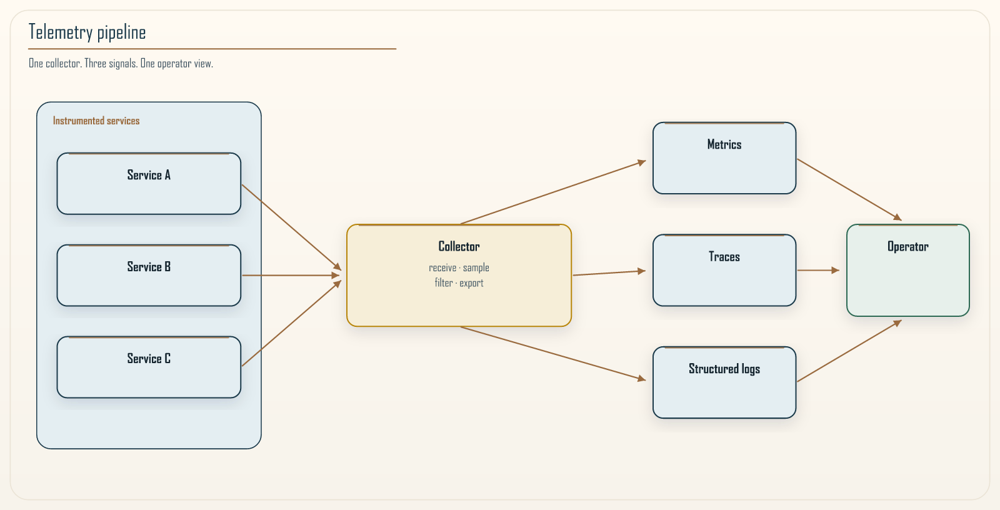
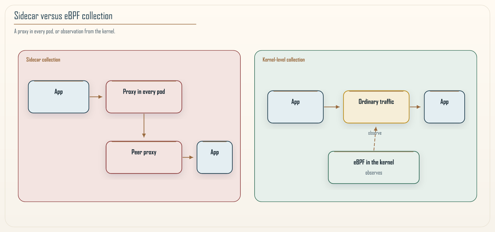

# Chapter 8: Monitoring and Observability

<div class="chapter-header">
  <h2 class="chapter-subtitle">You Cannot Attach a Debugger. Emit the Evidence First.</h2>
  <div class="chapter-meta">
    <span class="reading-time">📖 50 min read</span>
    <span class="difficulty">🎯 Expert</span>
  </div>
</div>

> *"In a monolith you attach a debugger. In a distributed system the bug is somewhere in the space between forty services, and the only debugger you have is the evidence those services chose to emit before the request failed."*

There is a moment every team that adopts microservices eventually lives through. A request is failing intermittently in production. In the monolith days, you would attach a debugger, set a breakpoint, reproduce the problem, and watch the state at the moment it broke. Now the request touches a dozen services owned by five teams, running on machines you will never log into, and the failure happens once in a thousand times, never when you are looking. You cannot attach a debugger to a distributed system in any useful sense. The request has already flowed through the services and vanished. All you have is whatever those services wrote down as it passed through, and if they did not write down the right things, the failure is effectively invisible.

This is the observability problem, and it is not a nice-to-have that you add after the system is built. It is a first-class design concern, because in a distributed system your ability to understand what happened is bounded entirely by the evidence you decided in advance to emit. A microservices architecture that is not observable is not operable. You will be unable to answer basic questions: which service is slow, why this request failed, whether the deploy you just shipped made things worse, and how close you are to breaching your commitments to users.

This chapter is about building systems you can understand from the outside. It covers the distinction between monitoring and observability, the three conventional pillars of telemetry and their limits, metrics and the RED and USE methods, structured logging and context propagation, distributed tracing, OpenTelemetry as the vendor-neutral foundation, service-level objectives as they show up in alerts, alerting that does not drown you, and kernel-level collection that gathers telemetry without a proxy in every pod. The organizing idea throughout is that observability is designed, not bolted on, and that the goal is not to collect everything but to be able to answer the questions that matter when something is on fire.

Chapter 6 already defined SLIs, SLOs, SLAs, and the error budget as the decision tool that ends the shipping-versus-stability standoff. I will not redefine them here. This chapter is about the telemetry that makes those numbers real, and about paging when the budget is actually burning. Chapter 15 takes the next step: wide events, tail sampling under a cost constraint, and treating a trace as evidence rather than a verdict. This chapter is the operating model those later techniques sit on.

## 8.1 Monitoring and observability are different questions

The two words are used interchangeably, and the difference is worth stating because it changes what you build.

**Monitoring** watches for conditions you already know to look for. You know that high error rate is bad, that CPU near its limit is bad, that a queue growing without bound is bad, so you measure those things and alert when they cross a threshold. Monitoring answers questions you thought of in advance. It is about known failure modes, the "known unknowns": you know CPU might spike, you just do not know when.

**Observability** is the property of being able to answer questions you did not think of in advance, from the outside, without shipping new code. It is about the "unknown unknowns": the failure mode nobody predicted, the strange interaction between two services under a load pattern that has never occurred before. A system is observable to the degree that you can take a novel question, "why are requests from this one region slow only for logged-in users after the Tuesday deploy," and answer it from the telemetry you already have.

That last clause is the one marketing slides skip. Observability is not a mystical ability to reconstruct anything. It is bounded by the fields you emitted. If you never recorded the region, the login state, or the deploy version on the request, no amount of "observability platform" will invent them after the fact. The practical discipline is to decide, before the incident, which high-cardinality dimensions you will need under pressure, tenant, cell, deploy, experiment, saga, and put them on the request record, not to collect every byte because collection was easy.

You need both. Monitoring tells you something is wrong. Observability lets you find out what. Fixed dashboards and threshold alerts handle the failures you can anticipate. The outages that last longest are almost always the ones nobody anticipated, and those are exactly the ones a CPU graph cannot see.

## 8.2 The three pillars, and what each one cannot do

Telemetry is conventionally organized into three pillars: metrics, logs, and traces. Each answers a different kind of question, and each has limits that the other two cover. Understanding the limits is more useful than memorizing the list, because the common mistake is to reach for the wrong pillar and then complain that observability is expensive and unhelpful.

**Metrics** are numeric measurements aggregated over time: request rate, error count, latency percentiles, queue depth, memory used. They are cheap to store and fast to query because they are aggregates, which makes them ideal for dashboards and alerts. Their limit is precisely that they are aggregates. A metric tells you the error rate rose to five percent. It cannot tell you which five percent of requests failed or why, because that detail was averaged away the moment the metric was recorded.

**Logs** are timestamped records of discrete events, ideally structured as machine-readable fields rather than free text. They carry the detail metrics lack: this specific request, from this tenant, hit this code path, and failed with this error. Their limit is volume and correlation. A busy system produces an overwhelming quantity of logs, and in a distributed system the log lines for a single user request are scattered across many services and machines, with nothing connecting them unless you deliberately add that connection.

**Traces** solve the correlation problem that unlinked logs have. A trace follows a single request as it travels across services, recording each step, called a span, with its timing and its causal relationship to the steps around it. A trace answers the question metrics and unlinked logs cannot: for this one slow request, where did the time actually go, and which service in the chain was responsible. Its limit is cost and sampling. Recording every span of every request in a high-traffic system is expensive, so traces are usually sampled, which means the specific request you want to investigate may not have been recorded.

Treat the three as complementary views of the same request, not as three products you buy separately. A metric alert tells you the error rate is up. A trace shows you which service in the request path is failing. That service's structured logs, carrying the same trace identifier, tell you exactly why. Reaching for logs to answer a "how often" question, or metrics to answer a "why this request" question, is where teams waste time and money.

The industry is also moving toward a single wide event per request that carries the high-cardinality fields you used to split across logs and spans. That is the subject of Chapter 15. The operating advice does not change: one identifier, one request, three ways of looking at it, and no second homemade correlation scheme sitting beside the standard.

## 8.3 Metrics: RED and USE

The hardest part of metrics is not collecting them. Modern libraries make emitting a counter trivial. The hard part is knowing which metrics actually tell you whether the system is healthy, because it is easy to end up with hundreds of graphs and no ability to answer "is the service okay right now." Two small, well-tested methods cut through this.

The **RED** method describes the health of a request-serving service with three metrics, and for most synchronous APIs these three are the ones that matter:

- **Rate:** requests per second the service is handling.
- **Errors:** the rate of requests that are failing.
- **Duration:** the distribution of how long requests take, watched as percentiles, not averages.

The insistence on percentiles rather than averages is not pedantry. An average latency hides the users who are suffering. If the average response is 50 milliseconds but the 99th percentile is four seconds, one user in a hundred is having an awful experience, and the average conceals it entirely. You watch the tail, the p95 and p99, because that is where the pain lives and where the early warning of trouble appears.

Compute those percentiles from a histogram of raw observations, not by averaging the p99 of each instance. An average of percentiles is not a percentile. Exemplars, a pointer from a histogram bucket back to a trace, are how you jump from "p99 is bad" to "this request."

Google's four golden signals, latency, traffic, errors, and saturation, are the same idea with saturation named explicitly. RED is the request-facing subset. USE is how you inspect the resources underneath.

The **USE** method describes the health of a resource, such as a CPU, a disk, a connection pool, or a thread pool, with three different metrics:

- **Utilization:** the fraction of the resource that is busy.
- **Saturation:** the degree to which work is queued and waiting because the resource is full.
- **Errors:** error events for that resource.

RED is for services. USE is for the resources those services depend on. Between them they answer most first-order health questions. When a service is slow, RED tells you it is slow and USE often tells you which underlying resource is the bottleneck. Standardizing on these two methods across every service means that anyone can read any service's dashboard, because they all speak the same small vocabulary.

RED does not travel unchanged to every shape of work. A queue consumer is healthy when lag is bounded and processing rate matches arrival rate, not when "requests per second" looks familiar. A batch job is healthy when it finishes inside its window. A saga is healthy when it reaches a terminal state, not when each hop returned 200. Apply the spirit, rate, failure, duration, saturation, to the unit of work the user or the downstream actually waits on.

A warning about metrics belongs here: **cardinality**. Every unique combination of label values on a metric creates a separate time series to store. Adding a label like user ID or request ID to a metric can explode the number of series into the millions, which is expensive and can bring down your metrics system. High-cardinality identifiers belong in traces and logs, which are designed for them, not in metric labels. Keep metric labels to low-cardinality dimensions: service, endpoint, status class, region, cell. Status class, 2xx/4xx/5xx, not every HTTP code crossed with every user. This single discipline prevents one of the most common and expensive observability failures.

Histograms have cardinality too. Each bucket is a series. A custom bucket layout per endpoint, times a high-cardinality label, is how a "cheap" metric becomes a bill.

## 8.4 Structured logging and context propagation

Logs are where most teams start and where most teams stay stuck, because they carry over monolith habits that do not survive distribution. Two changes make logs useful in a microservices system. A third keeps them from becoming a breach.

The first is **structure**. A log line written as free-form text, "user 4521 failed to check out because inventory was low," is readable by a human and nearly useless to a machine. The same event written as structured fields, with an explicit event name, a reason code, and the service name, can be searched, filtered, aggregated, and correlated across millions of records. Structured logging is the difference between logs you can grep by hand and logs you can actually query at scale. Emit logs as structured records from the start; the cost of retrofitting structure later is high.

The second, and the one that specifically addresses the distributed problem, is a **single request identifier that every hop already knows how to forward**. That identifier is the W3C Trace Context `trace-id`, carried in the `traceparent` header, not a homemade `X-Correlation-ID` sitting beside it. When a request enters the system at the edge, it is assigned a trace. That identifier is attached to every log line the request produces, in every service it touches, and it is injected into every downstream call and every message so the next hop continues the same tree. The payoff is direct: to reconstruct everything that happened for one user request, across a dozen services and machines, you filter by one `trace_id` and the entire scattered story assembles itself. Without that identifier, the log lines for a single request are needles in a dozen separate haystacks. With it, they are one query.

Do not run two identifiers. A custom correlation header plus a trace ID is how the story splits the first time a mesh, a gateway, or a library forwards one and drops the other. Baggage, the W3C header for extra context, is not authenticated and is visible to every hop. Put tenant or deploy in baggage if you must. Never put credentials, personal data, or anything you would not put on an untrusted network.

The third change is **hygiene**. Logs are a security surface. They are copied more widely than the database they describe, retained longer, and read by more people. Do not log access tokens, cookies, request bodies, or raw personal data. A user identifier on a span that lives in a locked-down trace store is a different decision from the same identifier on every info line in a log group half the company can query. Prefer a hashed or internal identifier in logs, and put the fields you need for forensics on the trace under access control. Chapter 7's rule about secrets applies here without modification: a secret written to a log is exposed to everyone who can read logs.

Returning the `trace_id` to the client has a further benefit: when a user reports a problem and can quote the ID from the error page, support can pull the exact request immediately, turning a vague "checkout was broken this morning" into a precise investigation. That identifier is not a secret, but it is a handle onto one user's traffic. Rate-limit the support lookup, and do not let an unauthenticated endpoint dump traces by ID.

### Recipe 8.1: Bind logs to W3C Trace Context, not a homemade header

**Context.** A request arrives at checkout and will call inventory. Every log line in both services must be joinable, and the join key must be the same identifier the tracer already propagates. This example uses the OpenTelemetry API. The same headers matter if your SDK is hidden behind a framework.

**Solution.** Extract inbound `traceparent`, start a span, bind `trace_id` and `span_id` onto the logger, and inject the context onto the outbound call. If there is no inbound context, start a new trace. Do not invent a second ID.

```python
from opentelemetry import trace
from opentelemetry.propagate import extract, inject
from opentelemetry.trace import Status, StatusCode

tracer = trace.get_tracer("checkout")


def handle_request(request, logger, inventory_client):
    """
    Continue the inbound trace, emit structured logs under that
    trace_id, and inject W3C Trace Context on the outbound call.
    """
    inbound = extract(request.headers)
    with tracer.start_as_current_span(
        "checkout.handle",
        context=inbound,
    ) as span:
        ctx = span.get_span_context()
        trace_id = format(ctx.trace_id, "032x")
        log = logger.bind(
            trace_id=trace_id,
            span_id=format(ctx.span_id, "016x"),
            service="checkout",
        )

        log.info("checkout_started")

        outbound_headers = {}
        inject(outbound_headers)  # writes traceparent, tracestate
        inventory = inventory_client.reserve(
            request.items,
            headers=outbound_headers,
        )

        if not inventory.ok:
            span.set_status(Status(StatusCode.ERROR, "inventory_unavailable"))
            log.warning("checkout_failed", reason="inventory_unavailable")
            return error_response(trace_id)

        span.set_attribute("app.order_id", inventory.order_id)
        log.info("checkout_succeeded", order_id=inventory.order_id)
        return ok_response(trace_id)
```

The details that are easy to skip are the ones that break the story. `extract` and `inject` speak W3C Trace Context, which meshes, gateways, and language SDKs already know. A custom header will be dropped by the first hop that was not in the meeting. Automatic HTTP instrumentation often does the extract and inject for you; the manual work that remains is the business event names and the attributes auto-instrumentation cannot know. Mark the span as error when the request failed, or your tail sampler will treat a failed checkout as an uninteresting success.

At the public edge, do not blindly honor a client-supplied sampling decision. An untrusted `traceparent` can be used to force you to record everything, which is a cost attack, or to stitch your traces onto an attacker's. Start the trusted trace at the gateway. If you keep the inbound context at all, keep it as a link, not as the parent you sample on.

## 8.5 Distributed tracing

Context-bound logs let you gather all the lines for a request. Distributed tracing goes further and reconstructs the causal, timed structure: not just what happened, but in what order, how the steps nested inside one another, and where the time went. For diagnosing latency and failures that span services, it is the single most valuable tool you have.

The vocabulary is small. A **trace** is the full record of one request as it moves through the system. A **span** is one unit of work within that trace, such as a single service handling the request or a single database query, and it records a start time, a duration, and metadata. Spans nest: the top-level span for "handle checkout" contains child spans for "reserve inventory" and "charge payment," each of which may contain further children. The result is a tree that shows the request's structure and timing at a glance.

The mechanism that makes this work across service boundaries is **context propagation**, the same `extract` and `inject` from Recipe 8.1. Each span belongs to a trace and has a span identifier. When a service calls another, it passes the trace identifier and the current span identifier along with the request, in standardized headers. The downstream service creates its spans as children of the one it received, so the tree stays connected across process and machine boundaries. This is the same idea as the old correlation ID, extended to carry causal parent-child structure rather than just a flat label.

Async work is where traces go to die. A message published without injected context starts a new, orphan tree on the consumer. Fire-and-forget in a thread pool without attaching the context does the same. Chapter 5 already required a correlation identifier on every saga event. Make that identifier the `trace_id`, and inject Trace Context into the message envelope. Chapter 10 is where the messaging patterns live; the rule here is simply that a hop you cannot see is a hop you cannot debug.

Clock skew between machines will make parent and child spans look as if they overlap or travel backward in time. Duration is measured locally and is trustworthy. Absolute timestamps across hosts are not. Do not debug a two-millisecond "time travel" before you have looked at NTP.


*Figure 8.1: The telemetry pipeline that makes tracing work. Each service is instrumented to emit spans as it handles a request, along with metrics and logs. Rather than each service shipping data directly to a storage backend, telemetry flows to a collector, a central processing stage that receives, batches, samples, and filters it before forwarding to the backends that store and index it. The operator on the far side queries those backends to reconstruct a single request's path across every service it touched. Routing telemetry through a collector rather than wiring each service to each backend is what keeps the instrumentation in application code simple and vendor-neutral: services emit in one standard format, and the collector handles where it goes.*

Why tracing matters so much in microservices comes back to the availability arithmetic from Chapter 1. A request that fans out across a deep chain of synchronous calls is only as fast as its slowest link and only as available as the product of every link's availability. When such a request is slow, the aggregate metrics tell you the p99 latency is bad but not which of the ten services in the chain caused it. A trace shows you immediately: one span in the tree is wide and the rest are narrow, and that wide span is your culprit. Without tracing, finding that one service means guessing and checking ten dashboards. With tracing, it is one glance at the waterfall.

**Sampling** is the unavoidable tradeoff. Recording a full trace for every request in a high-traffic system produces an enormous volume of data at a cost that rarely justifies itself, since most traces look like all the others. So traces are sampled.

**Head-based sampling** decides at the start of a request, at random, whether to record it. It is simple, and because the decision travels with the context, every hop agrees. It also decides before it knows whether the request was interesting, so the rare failure you most wanted to see may have been dropped.

**Tail-based sampling** waits until the request finishes and then decides, keeping traces that were slow or errored regardless of the head coin-flip, at the cost of a collector that can buffer the whole tree until the decision. That collector is a production dependency. If it sheds load by dropping the buffer, you lose exactly the traces you bought the machinery to keep.

**Parent-based sampling** is the rule that makes either strategy coherent: a downstream service honors the sampling decision it received, rather than flipping its own coin. Without that, you get broken trees, a root with no children, or children with no root.

Most mature setups bias the budget toward the interesting: always keep errors and slow requests, sample the boring successful ones lightly. The goal is to spend your trace budget on the requests you will actually want to investigate. Chapter 15 is where the sampling policies get precise. The operating rule here is: decide once, propagate that decision, and do the interesting-versus-boring filter in the collector, not by turning instrumentation on and off in application code.

## 8.6 OpenTelemetry: one standard for all three

For years, adopting observability meant choosing a vendor and instrumenting your code with that vendor's library. Switching vendors, or sending data to more than one, meant reinstrumenting everything. OpenTelemetry ends that. It is a vendor-neutral, open standard for generating and collecting telemetry, and it has become the default choice for new systems for a simple reason: it decouples how you produce telemetry from where you send it.

With OpenTelemetry, you instrument your services once, using its APIs for metrics, logs, and traces. The data flows in a standard format to the OpenTelemetry Collector, the central pipeline stage shown in Figure 8.1, which can process the data and export it to whatever backends you choose. Changing backends, or sending traces to one system and metrics to another, becomes a configuration change in the collector rather than a code change in every service. This is worth adopting deliberately, because instrumentation is expensive to write and painful to redo, and vendor-neutral instrumentation protects that investment.

The practical guidance is straightforward. Instrument new services with OpenTelemetry from the beginning. Set the resource attributes the rest of the pipeline depends on, `service.name`, `service.version`, `deployment.environment`, because a span without a service name is telemetry you cannot group. Rely on automatic instrumentation for the common cases, incoming and outgoing HTTP calls, database queries, message publishing and consuming, where the libraries can create spans for you without manual work. Add manual spans and attributes only where they capture something business-meaningful that the automatic instrumentation cannot know, such as which pricing rule applied or which experiment variant the user was in. Follow the semantic conventions rather than inventing `userId` next to someone else's `enduser.id`. This gives you broad coverage cheaply and rich detail exactly where it earns its keep.

Auto-instrumentation is not a complete observability strategy. It will show you that checkout called inventory and that the SQL took 40 milliseconds. It will not tell you which promotion applied, which cell served the request, or which saga step failed. That is the manual layer. It also will not, by itself, split a span into "useful compute" versus "serialization plus network" with the cleanliness a granularity metric wants. Chapter 11 consumes traces as one input to the RVx index. The traces have to be there, and they have to be honest about what they can resolve. I am not restating that metric here.

On AWS, the same standard lands in X-Ray, CloudWatch, and AMP through the ADOT collector. Lambda gets a layer, not a sidecar, and not eBPF. The point of naming the products is only this: pick the standard in application code, and treat the backend as a collector exporter, not as an SDK you sprinkle through every service.

## 8.7 Service-level objectives, measured so you can alert

Telemetry tells you what the system is doing. Service-level objectives tell you whether that is good enough. Chapter 6 already gave the vocabulary, SLI, SLO, SLA, error budget, and the rule that the SLA is looser than the SLO so you have room to notice a burn before you owe money. What this chapter adds is how those numbers are measured and how they become pages.

Good SLOs are defined from the user's point of view, not the server's. "The checkout journey returns a successful response within 300 milliseconds for 99.5 percent of valid requests over 28 days" is meaningful because it describes what a user experiences. "CPU stays below 80 percent" is not an SLO. It is a resource metric that may or may not correlate with anything a user notices. Set objectives on what users feel, and let the internal metrics explain why the objective is or is not being met.

Three measurement traps produce a number that looks like an SLO and behaves like fiction.

**Average the wrong thing.** A latency objective needs a histogram of request durations, then a percentile over that histogram. Averaging instance-level p99s, or averaging success ratios across services, hides the users on the bad instance and the users on the bad hop.

**Count the wrong requests.** Health checks, scrapes, and bot traffic are not user journeys. A 404 on a URL nobody should have called is not a failed checkout. A 401 from a stolen token you correctly rejected is not a reliability miss. Decide what a *valid* request is, and compute the SLI as good divided by valid, not good divided by everything that hit the load balancer.

**SLO the service instead of the journey.** A checkout that fans out to inventory, payment, and notification can have three green service dashboards and a red user. The objective that burns the budget belongs on the journey. Per-service RED is how you diagnose. It is not the contract.

When the budget is healthy, spend it. When it is nearly exhausted, freeze risky changes and prioritize reliability. That policy lives in Chapter 6. The next section is how you notice the burn in time to use the policy.

## 8.8 Alerting without drowning

The purpose of an alert is to get a human to act on something that matters, now. Every alert that does not meet that bar erodes the value of the ones that do, because a team that is paged constantly for things that turn out not to matter learns to ignore alerts, and then misses the one that was real. Alert fatigue is not a minor annoyance. It is how serious incidents slip through teams that were technically monitoring for them.

Two principles keep alerting healthy.

**Alert on symptoms, not causes.** The thing worth waking someone for is user pain: error rates and latency burning the SLO, requests failing, the service not serving. Those are symptoms, and they are what actually matters. Alerting on causes, high CPU, a full disk, a restarted pod, generates noise, because a cause often has no user-visible effect and self-corrects, while the causes you did not anticipate produce symptoms you would have caught anyway if you had alerted on the symptom. Page on the symptom. Use the causes as diagnostic detail once you are already investigating.

**Every page must be actionable, and every page must have a runbook.** If an alert fires and the correct response is to look at it, shrug, and close it, that alert should not page anyone. Route it to a dashboard or a daily digest instead. Reserve paging for conditions that require a human to do something immediately. Tie paging alerts to your SLOs and error budgets: page when the error budget is burning fast enough that the objective is genuinely threatened, because that is precisely the condition that warrants interrupting a human's sleep. Everything softer than that can wait for working hours.

The way to detect a threatened objective is not a static "errors > 1 percent" threshold. That threshold is either so sensitive it pages on a blip, or so dull it notices after the month is already lost. **Multi-window burn-rate alerts** fix this. You measure how quickly the budget is being consumed relative to the budget you have, and you require the burn to show up on both a short window and a longer one so a one-minute scrape blip cannot page.

A 99.9 percent objective over 30 days can tolerate 0.1 percent failure. A burn rate of 1 consumes the budget exactly on schedule. A burn rate of 14.4 consumes about two percent of a 30-day budget in an hour, which is a page if it is still true over a five-minute confirmation window. A slower burn, six times the sustainable rate over six hours, confirmed over thirty minutes, is a ticket that can wait for morning. The constants are configuration. The shape is the point: page on fast burns, ticket on slow ones, and do not page on a cause that has not yet become a burn.

Missing data on a critical SLI is itself a symptom. A scrape that disappears looks like "no errors" if you are not careful. Fail the alert open for "I cannot see the service," or you will sleep through an observability outage that is also a user outage.

The discipline is subtractive. Most teams improve their alerting not by adding alerts but by deleting the ones that never lead to action, until every remaining page is one the on-call engineer is glad to have received.

## 8.9 Observability without a proxy in every pod

The traditional way to gather rich network-level telemetry in a service mesh is to run a sidecar proxy alongside every service instance, intercepting all traffic. This gives detailed visibility, and it also gives the mesh a place to do retries, timeouts, and mutual TLS. It has a cost: a proxy process for every pod consumes memory and CPU, and it adds a hop to every call. At scale, that overhead is substantial.

A newer approach uses eBPF, a technology that lets small, verified programs run inside the operating system kernel. Because eBPF programs observe traffic at the kernel level, they can gather network and some application-level telemetry without a proxy process in every pod, and without changes to application code. The observability data is collected where the traffic already passes, rather than by routing it through an extra process.


*Figure 8.2: Sidecar-based collection compared with kernel-level collection. On the left, the sidecar model places a proxy process next to every service instance, and every request detours through that proxy so it can be observed and controlled. This is powerful but pays a per-pod cost in resources and a per-call cost in latency. On the right, an eBPF-based approach runs observation logic inside the kernel, where all the traffic already passes, so it can collect comparable *network* telemetry without a dedicated proxy in each pod and without touching application code. The tradeoff is that the sidecar model can do richer per-request manipulation, while the kernel-level model is lighter but more focused on observation.*

The tradeoff is real and worth stating honestly rather than presenting eBPF as a free win. Sidecar proxies can do rich per-request manipulation, retries, fault injection, fine-grained routing, that a kernel-level observer does not attempt. Ambient meshes and Cilium-style dataplanes change the tax, but they do not give you business attributes. eBPF will show you that checkout called inventory and how long the round trip took. It will not show you the order identifier, the pricing rule, or the experiment variant, because those live in application memory, not in the packet. You still need Recipe 8.1 for the questions that are about *your* domain.

Kernel probes also do not run everywhere this book has services. Lambda, many Windows nodes, and anything you do not control the kernel on will not grow an eBPF program. Privileged access to the kernel is itself a security surface, which Chapter 7 would like a word about. Choose based on whether you need the proxy's traffic-shaping capabilities or primarily want low-overhead visibility across a large Linux fleet. This section is only the observability claim: kernel-level collection is a way to see the graph. It is not a way to skip instrumentation.

## 8.10 The cost of observability, and spending it well

Observability is not free, and pretending otherwise leads to unpleasant surprises. Every metric series, every log line, every trace span costs money to transmit, store, and index, and in a busy system those costs are large enough to appear on the same budget conversations as compute. The failure mode is to either under-instrument, and be blind when it matters, or to collect everything indiscriminately, and pay for a mountain of data nobody queries.

The way through is to spend the observability budget where it answers questions, guided by the pillar characteristics from Section 8.2.

**Keep metrics broad but low-cardinality.** They are cheap per series and are your first line of detection, so instrument widely, but hold the line on cardinality as described in Section 8.3, because that is where metric costs explode.

**Sample traces toward the interesting.** Keep the errors and the slow requests, sample the routine successes lightly, so your trace spend concentrates on the requests you will actually investigate. Do that in the collector, and honor the parent decision, or you will pay for broken trees.

**Structure logs and set retention deliberately.** Structured logs are worth their cost because they are queryable. Unstructured logs at high volume are mostly cost. Do not log request and response bodies. Retain recent logs richly and older logs sparsely, since most investigation happens on recent data. Filter at the collector before the indexer sees the line.

The guiding question for any piece of telemetry is simple: what question does this let me answer, and is that question worth the cost of always being able to answer it. Telemetry that answers a question you regularly ask under pressure is worth a great deal. Telemetry collected because it was easy to collect, and never queried, is pure cost. Reviewing what you collect against what you actually query is a periodic exercise that repeatedly pays for itself. Chapter 15 is the deeper treatment of information per dollar.

## 8.11 Conclusion

You cannot attach a debugger to a distributed system. The request has already flowed through your services and gone, and all you have to understand it is the evidence those services chose to emit. That single fact makes observability a design concern rather than an afterthought, because your ability to operate the system is bounded by decisions you make before the incident, not after.

The shape of a well-observed system is consistent. Monitoring catches the failures you anticipated. Observability lets you debug the ones you did not, but only if you emitted the fields the novel question needs. Metrics detect that something is wrong and stay cheap by avoiding high cardinality. Structured logs carry the detail, and W3C Trace Context stitches a single request's story back together across every service it touched. Traces reconstruct the timed, causal structure of a request and point directly at the service responsible when a deep call chain turns slow. OpenTelemetry lets you instrument once and stay free of any single vendor. Service-level objectives, already defined in Chapter 6, become pages when you measure the user journey and alert on budget burn rather than on CPU. Alerting stays useful only by staying subtractive. And newer kernel-level collection gathers network telemetry across a large fleet without a proxy in every pod, at the cost of the proxy's richer capabilities and of any business attribute the packet does not contain.

The telemetry this chapter produces is also what makes the granularity governance of Chapter 11 possible. The distributed traces described here are the source that measures how much of a request's time is spent on useful work versus network and serialization overhead, one of the inputs the RVx index consumes. I am not restating that index here. The honest limit is that auto-instrumentation gives you the hop times; attributing those hops to compute versus tax is a measurement you have to design, not a number the SDK owes you. Observability, in other words, is not only how you keep the system running. It is how you gather the evidence to decide whether the system's boundaries were drawn well in the first place.

The next chapter turns to testing, which is how you gain confidence that a change is safe before it ever reaches the production system this chapter taught you to watch.

---

**Navigation:**
- [Previous: Chapter 7](07-security.md)
- [Next: Chapter 9](09-testing-strategies.md)
