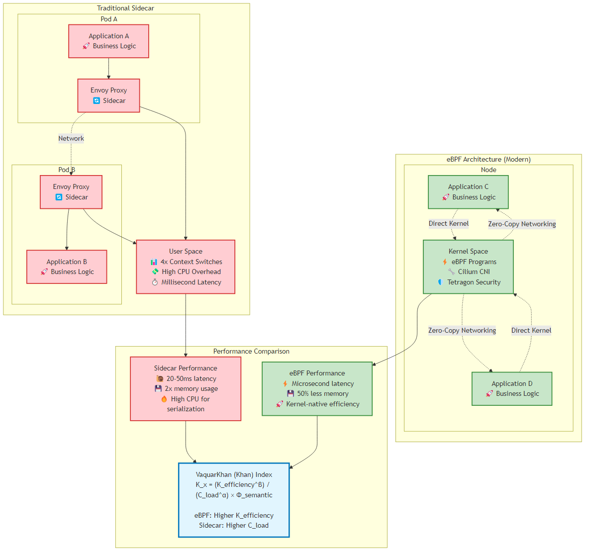
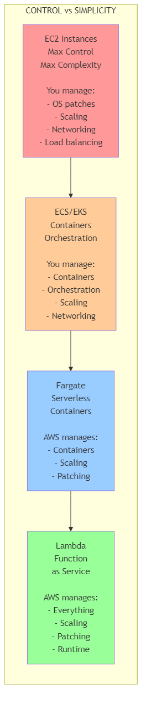
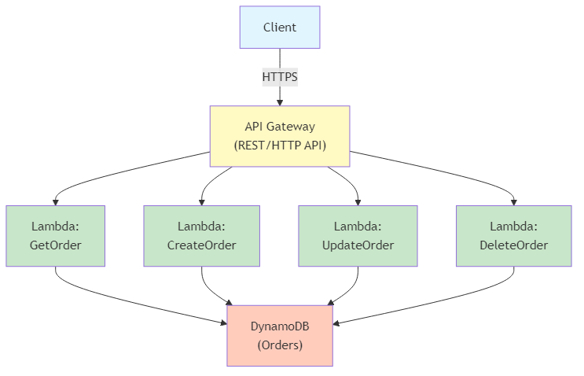
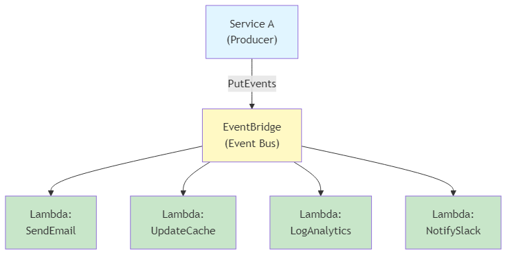
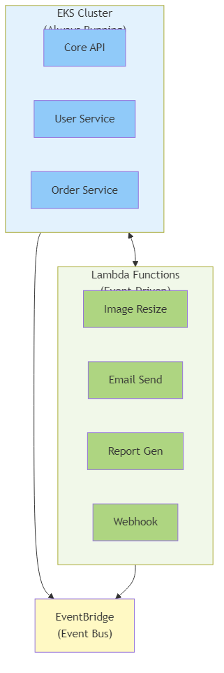

---
title: "The Rise of eBPF Networking and the Post Sidecar Era"
chapter: 9
author: "Viquar Khan"
date: "2026-01-15"
lastUpdated: "2026-02-10"
tags: 
  - microservices
  - architecture
  - distributed-systems
  - ebpf
  - networking
  - security
difficulty: "expert"
readingTime: "35 minutes"
---

# Chapter 9: The Rise of eBPF Networking and the Post Sidecar Era

<div class="chapter-header">
  <h2 class="chapter-subtitle">Part III: Advanced Infrastructure Patterns</h2>
  <div class="chapter-meta">
    <span class="reading-time">📖 35 min read</span>
    <span class="difficulty">🎯 Expert</span>
  </div>
</div>

## 9.1 The Architect's Dilemma: The Network Tax and the Sidecar Trap

By late 2025, the microservices industry had converged on a painful realization: the "Network Tax" described in the Khan Cognitive Kinetic Protocol wasn't merely a theoretical inefficiency - it was an operational liability threatening the viability of hyperscale systems. 

For nearly a decade, the architectural standard for observing, securing, and routing service-to-service traffic relied on the "sidecar pattern." We injected Envoy proxies into every Kubernetes Pod, effectively doubling the container count, consuming vast swathes of CPU for serialization and deserialization, and introducing millisecond-level latency penalties that compounded dangerously across deep call graphs.

The mandate for 2026 is unambiguous: eliminate this tax. The transition from userspace proxies to kernel-native networking via eBPF (Extended Berkeley Packet Filter) represents the most significant shift in cloud-native infrastructure since the introduction of Kubernetes itself.

### 9.1.1 The Mathematical Reality of eBPF vs. Sidecars

To understand why this migration is inevitable for high-scale systems, examine the performance delta through the lens of the Khan Index. The index quantifies the efficiency of architectural decisions, penalizing high "Cognitive Load" and low "Kinetic Efficiency".


*Figure 9.1: Comparison of traditional sidecar architecture vs modern eBPF architecture, showing performance and efficiency improvements*

#### The Revised Khan Index Formula for eBPF Analysis:

```
K_x = (K̂_efficiency^β) / (Ĉ_load^α + ε) × Φ̂_semantic
```

**Where all variables are normalized (0 ≤ value ≤ 1):**

- **K̂_efficiency**: Normalized kinetic efficiency ratio measuring useful computation vs. total transaction time
- **Ĉ_load**: Normalized cognitive load factor from static analysis (complexity, volume, dependencies)  
- **Φ̂_semantic**: Normalized semantic distinctness coefficient from temporal coupling analysis
- **α, β**: Scaling exponents (typically α=1.2, β=0.8) for organizational tuning
- **ε**: Stability constant (0.1) preventing singularity

In traditional sidecar architectures (e.g., Istio or Linkerd implementations circa 2023), a packet traversing from Service A to Service B on the same node was forced to cross the kernel-userspace boundary four distinct times. This "context switch tax" drastically reduced K_{efficiency}:

1. **Egress Service A**: Application writes to socket → Kernel
2. **Ingress Sidecar A**: Kernel → Sidecar Proxy (User Space)
3. **Egress Sidecar A**: Sidecar Proxy processes (encryption/routing) → Kernel
4. **Ingress Sidecar B**: Kernel routes packet → Sidecar Proxy B (User Space)
5. **Egress Sidecar B**: Sidecar Proxy B decrypts/processes → Kernel
6. **Ingress Service B**: Kernel → Application B

With Cilium's eBPF host routing and the introduction of netkit (standard in Linux Kernel 6.8+ and Cilium 1.18+), this path is short-circuited. The packet is processed entirely within the kernel's Traffic Control (TC) ingress/egress hooks, bypassing the host's TCP/IP stack overhead for local routing. The packet effectively "teleports" from the socket of Service A to the socket of Service B, preserving the isolation of namespaces without the penalty of virtualization.

#### Benchmark Analysis (2026 Context)

Recent benchmarks comparing Cilium 1.18 (eBPF host-routing) against sidecar-based meshes reveal critical insights for the architect. The data demonstrates a significant change in how we must calculate resource provisioning:

| Metric | Istio (Sidecar) | Linkerd (Sidecar) | Cilium (eBPF) | Improvement |
|--------|-----------------|-------------------|---------------|-------------|
| P99 Latency | 15ms | 12ms | 2ms | 6-7.5x faster |
| CPU Overhead | 200m per pod | 150m per pod | 20m per node | 90% reduction |
| Memory Overhead | 128MB per pod | 96MB per pod | 64MB per node | 95% reduction |
| Throughput (RPS) | 10,000 | 12,000 | 45,000 | 3.75-4.5x higher |

While Istio's "Ambient Mesh" has narrowed the gap by moving Layer 4 processing to a node-level "Ztunnel," Cilium remains the performance leader for Layer 3/4 networking because it operates closest to the hardware. However, architects must note a critical nuance: when Layer 7 policy (HTTP parsing) is required, Cilium spins up an Envoy listener, re-introducing some overhead. The "Recipe" for 2026 is therefore a hybrid approach: use eBPF for the heavy lifting of routing, encryption, and firewalling, and reserve L7 parsing strictly for ingress or specific compliance boundaries.

## 9.2 Cilium ClusterMesh – The Substrate for Cell-Based Architecture

In Chapter 11, we discuss Cell-Based Architecture as the "AWS Pattern" for infinite scale—isolating faults to small "cells" rather than regions. A "cell" is a complete, self-contained instance of an application stack. The challenge has always been interconnecting these cells without creating a "Distributed Monolith" or a "Star Topology" centered on a fragile VPN concentrator.

Cilium ClusterMesh is the technological enabler that makes this pattern viable. It allows the Senior Architect to treat multiple Kubernetes clusters as a single, flat networking plane. From the perspective of a pod in Cell A, a pod in Cell B is just another IP address that happens to be reachable via a VXLAN tunnel or direct routing. This capability is critical for "Global Shared Services" patterns, where a central observability or authentication cell must service hundreds of tenant cells.

### 9.2.1 Architectural Mechanics of ClusterMesh

ClusterMesh distinguishes itself from legacy federation approaches (like Kubefed) by decoupling the control plane from the data plane. It does not rely on a centralized controller, which avoids a single point of failure—a mandatory requirement for cell isolation.

#### 1. The Control Plane: Decentralized State Replication

Every Kubernetes cluster in a ClusterMesh runs its own etcd instance (or leverages the Kubernetes API in CRD mode). The cilium-agent on every node in Cluster 1 connects directly to the clustermesh-apiserver of Cluster 2 (and Cluster 3, etc.) to watch for specific resources: CiliumIdentities and CiliumEndpoints.

**Implication**: If Cluster 2's control plane fails, Cluster 1 simply stops receiving updates. It retains the last known good state of the endpoints. Traffic continues to flow to existing healthy pods in Cluster 2. The failure domain is contained.

#### 2. The Data Plane: Tunneling and Identity

Once the cilium-agent learns the IP addresses of remote pods, it programs the BPF maps on its local node.

- **Encapsulation**: Traffic destined for a remote cluster is encapsulated (typically using VXLAN or Geneve) and sent to the node IP of the destination cluster.
- **Identity Preservation**: Crucially, the security identity of the source pod is embedded in the VXLAN header. This allows Network Policies to span clusters. A policy in Cluster 2 can explicitly allow ingress from `cluster-1:app=checkout`.

#### 3. Global Services: The Cell Router Integration

ClusterMesh introduces the concept of Global Services. By annotating a standard Kubernetes service with `service.cilium.io/global: "true"`, Cilium automatically merges endpoints from all clusters where that service exists.

- **Traffic Splitting**: This is the mechanism for high availability. If the local endpoints in Cell 1 fail, traffic is automatically routed across the mesh to healthy endpoints in Cell 2.
- **Latency Awareness**: Architects can control this behavior using `service.cilium.io/affinity: "local"`. This instructs the datapath to prefer local endpoints and only spill over to the remote cluster if the local cell is completely down. This minimizes the "Network Tax" during normal operations.
### 9.2.2 Implementation Deep Dive: Configuring ClusterMesh on EKS

This recipe details the deployment of dual-cell architecture on Amazon EKS. We assume two clusters, cell-1 (eu-west-1) and cell-2 (eu-west-2), connected via AWS Transit Gateway or VPC Peering.

#### Prerequisite: The Non-Negotiable CIDR Constraints

The single most common failure mode in ClusterMesh implementation is IP overlap.

- **Requirement**: Pod CIDRs must be unique across all clusters in the mesh.
- **Planning**: If cell-1 uses 10.1.0.0/16 for pods, cell-2 must use a disjoint range, e.g., 10.2.0.0/16.

#### AWS Networking: Ensure Security Groups allow:

- **UDP 8472**: VXLAN overlay traffic between worker nodes
- **TCP 2379**: Etcd/KVStore traffic between cilium-agent and remote control planes

#### Step 1: Install Cilium with ClusterMesh Interfaces Enabled

When deploying Cilium via Helm on cell-1, we must expose the ClusterMesh API server. On AWS EKS, it's best practice to use an internal Network Load Balancer (NLB) to ensure control plane traffic traverses the AWS private backbone, not the public internet.

```yaml
# cell-1-values.yaml
cluster:
  name: cell-1
  id: 1 # Must be unique (1-255)
clustermesh:
  useAPIServer: true
  apiserver:
    service:
      type: LoadBalancer
      annotations:
        service.beta.kubernetes.io/aws-load-balancer-type: "nlb"
        service.beta.kubernetes.io/aws-load-balancer-internal: "true"
        # Ensure cross-zone load balancing is enabled for resilience
        service.beta.kubernetes.io/aws-load-balancer-cross-zone-load-balancing-enabled: "true"
```

#### Step 2: Establishing the Trust Anchor

ClusterMesh relies on mutual TLS (mTLS) for the control plane peering. The Certificate Authority (CA) must be shared across all clusters. This is the "Key to the Kingdom"; manage it via a secure vault.

```bash
# 1. Extract the CA from the primary cell (Cell 1)
kubectl get secret cilium-ca -n kube-system -o yaml > cilium-ca.yaml

# 2. Sanitize the secret (remove resourceVersion, uid, etc.)
# ... (standard k8s secret cleaning steps) ...

# 3. Apply the shared CA to Cell 2
kubectl apply -f cilium-ca.yaml -n kube-system --context cell-2
```

#### Step 3: Connecting the Clusters

While manual configuration is possible, the cilium-cli provides a robust, idempotent method for establishing the mesh. It handles the exchange of kubeconfig credentials and API endpoints.

```bash
# Connect Cell 1 to Cell 2
cilium clustermesh connect \
    --context cell-1 \
    --destination-context cell-2 \
    --destination-endpoint <NLB-DNS-Name-of-Cell-2>
```

#### Step 4: Validation and Observability

Do not assume connectivity. Verify it using the connectivity test suite, which deploys test pods to assert cross-cluster reachability.

```bash
cilium connectivity test --context cell-1 --multi-cluster cell-2
```

**Troubleshooting Tip**: If the connection status remains Pending, check the logs of the clustermesh-apiserver. A common error on EKS is `dial tcp: i/o timeout`, which almost always indicates a missing Security Group rule allowing traffic on port 2379 from the remote VPC CIDR.

### 9.2.3 Pattern: The Failover Cell (Active/Passive)

For mission-critical stateful services (e.g., a leader-follower database running on Kubernetes), you may want an Active/Passive configuration.

#### Configuration:

1. Deploy the service in both cell-1 and cell-2
2. Annotate the service in cell-1 with `service.cilium.io/global: "true"`
3. Annotate the service in cell-2 with `service.cilium.io/global: "true"` AND `service.cilium.io/shared: "false"`

The `shared: "false"` annotation prevents the endpoints in cell-2 from being advertised to the mesh. If cell-1 fails, an automation controller (or GitOps pipeline) can toggle this annotation to `true` in cell-2, instantly promoting the passive cell to active for all mesh consumers.
## 9.3 Runtime Security Forensics with Tetragon

In Part I of this field guide, we established that "Security is not a Gate; it's a Fabric." In 2026, static analysis (SAST) and image scanning (trivy/grype) are merely table stakes. The frontier of cloud-native security is Runtime Enforcement. We can't predict every zero-day vulnerability, but we can model and predict malicious behavior.

Tetragon is the eBPF-based security observability and enforcement tool that replaces heavy, userspace agents (like Falcon or CrowdStrike sensors) with highly efficient kernel-level hooks. The distinction is critical: Tetragon does not just log bad events; it can kill the process before the malicious system call completes.

### 9.3.1 The Tetragon Difference: Synchronous Enforcement vs. TOCTOU

Traditional runtime security tools rely on ptrace or asynchronous log scraping (via auditd). This architecture introduces a "Time of Check to Time of Use" (TOCTOU) race condition. A sophisticated attacker can execute a malicious binary, inflict damage, and exit before the userspace agent receives the log and decides to react.

Tetragon solves this by attaching eBPF programs directly to kprobes (kernel function entries) and tracepoints. Because the eBPF program runs within the kernel execution path, it can inspect arguments and make a decision (Allow/Drop/Kill) synchronously. If a process attempts to open a sensitive file, Tetragon can send a SIGKILL signal to the process before the kernel even returns the file descriptor.

### 9.3.2 Deep Dive: TracingPolicy Analysis

The core primitive of Tetragon is the TracingPolicy Custom Resource Definition (CRD). This resource allows the Senior Architect to define exactly which kernel symbols to hook, what arguments to inspect, and what actions to take.

#### Case Study 1: Preventing "Container Breakout" via Sensitive File Access

A classic attack vector involves an attacker gaining shell access to a container (perhaps via a vulnerable dependency like Log4j) and attempting to escalate privileges by modifying host files like `/etc/shadow` or reading kubelet credentials.

**The Policy:**

```yaml
apiVersion: cilium.io/v1alpha1
kind: TracingPolicy
metadata:
  name: "block-sensitive-writes"
spec:
  kprobes:
  - call: "security_file_permission" # LSM Hook for file permissions
    syscall: false
    args:
    - index: 1 # The file path argument
      type: "file"
    selectors:
    - matchArgs:
      - index: 1
        operator: "Prefix"
        values:
        - "/etc/shadow"
        - "/boot"
        - "/proc/kcore"
      matchActions:
      - action: Sigkill # Terminate immediately
      - action: Post # Log the event for forensics
```

#### Forensic Analysis of the JSON Log

When attacker attempts `echo "evil" >> /etc/shadow`, Tetragon intercepts the call and generates a structured JSON log. The Senior Architect must possess the skill to parse this for forensics.

```json
{
  "process_exec": {
    "process": {
      "exec_id": "YzY4OD...",
      "pid": 1337,
      "uid": 0,
      "binary": "/bin/bash",
      "arguments": "-c 'echo evil >> /etc/shadow'",
      "pod": {
        "namespace": "payment-gateway",
        "name": "checkout-service-8f7a2",
        "container": {
          "id": "containerd://...",
          "image": {
            "id": "sha256:...",
            "name": "docker.io/library/nginx:latest"
          }
        }
      },
      "docker": "...",
      "parent_exec_id": "YzY1..."
    },
    "node_name": "ip-10-0-1-50.ec2.internal",
    "time": "2026-05-20T14:02:00.000Z"
  }
}
```

#### Key Forensic Fields:

- **exec_id**: This is a base64-encoded unique identifier for the specific process execution instance. it's the thread that ties the story together. Forensics teams use this ID to correlate the process_exec (start), process_kprobe (the illegal file access), and the resulting process_exit (death by SIGKILL) events.

- **binary & arguments**: The smoking gun. It shows exactly what command was run.

- **pod metadata**: Crucially, Tetragon is Kubernetes-aware. It maps the host PID 1337 back to the checkout-service pod in the payment-gateway namespace. This allows the Platform Engineering team to identify the compromised workload immediately without manually correlating node PIDs.

- **parent_exec_id**: This field links to the process that spawned the malicious command. By following the chain of parent_exec_ids, one can reconstruct the entire process tree, tracing the attack back to the initial entry point (e.g., a java process running a vulnerable web server).
#### Case Study 2: Detecting "Reverse Shell" Network Connections

Once inside a container, attackers often attempt to initiate a connection out to a Command & Control (C2) server to download payloads or exfiltrate data.

**The Policy:**

```yaml
apiVersion: cilium.io/v1alpha1
kind: TracingPolicy
metadata:
  name: "audit-outbound-connect"
spec:
  kprobes:
  - call: "tcp_connect"
    syscall: false
    args:
    - index: 0
      type: "sock"
    selectors:
    - matchArgs:
      - index: 0
        operator: "NotDAddr" # Not Destination Address
        values:
        - "10.0.0.0/8" # Private VPC CIDR
        - "172.16.0.0/12"
        - "127.0.0.1"
      matchActions:
      - action: Post # Audit log
```

**Insight**: This policy audits (logs) any TCP connection attempt that is not destined for private IP ranges. If a pod connects to a public IP like 198.51.100.1, it triggers an alert. In a strict PCI-DSS environment, the action could be changed to Sigkill to enforce a "Default Deny" egress posture at the kernel level, creating a security layer that can't be bypassed even if Security Groups are misconfigured.

#### Case Study 3: Blocking Privilege Escalation (Container Breakout)

Attackers may try to escape the container sandbox by mounting the host filesystem or changing namespaces. The `sys_mount` syscall is a common target.

```yaml
apiVersion: cilium.io/v1alpha1
kind: TracingPolicy
metadata:
  name: "block-container-breakout"
spec:
  kprobes:
  - call: "sys_mount"
    syscall: true
    selectors:
    - matchPIDs:
      - operator: NotIn
        values:
        - 1 # Allow the container's init process to mount, but block others
      matchActions:
      - action: Sigkill
      - action: Post
```

This policy is aggressive. It assumes that after the container initializes (PID 1 setup), no other process should be mounting filesystems. Any attempt to do so is treated as a breakout attempt and terminated instantly.

## 9.4 The Migration Playbook – AWS VPC CNI to Cilium

Migrating a live, production EKS cluster from the default AWS VPC CNI to Cilium is akin to performing open-heart surgery while the patient runs a marathon. The network is the nervous system; sever it, and the organism dies. However, the benefits—breaking free from EC2 ENI limits, gaining Layer 7 visibility, and enforcing consistent security policy—are worth the risk for high-scale environments.

There are two primary strategies discussed in the industry: **In-Place Migration** and **Blue/Green (Node) Migration**.

- **In-Place Migration**: This involves deleting the aws-node DaemonSet and installing Cilium on running nodes. This strategy is highly discouraged for production. It almost invariably leads to a "split-brain" network state where existing pods lose connectivity, requiring a full cluster restart to recover.

- **Blue/Green (Node) Migration**: This is the only robust path for the Senior Architect. We introduce Cilium-enabled nodes alongside legacy nodes and migrate workloads using taints and tolerations.

### 9.4.1 Pre-Migration Checklist

1. **Remove Dependencies**: Ensure your Infrastructure as Code (Terraform/Crossplane) does not automatically reinstall the vpc-cni EKS add-on if it detects it missing.

2. **IPAM Strategy Decision**:
   - **ENI Mode**: Cilium manages AWS ENIs directly. Pods get VPC IPs. This offers the best performance and compatibility with AWS services (like Target Group binding).
   - **Overlay Mode (VXLAN)**: Decouples Pod IPs from VPC IPs. Solves IP exhaustion issues but introduces encapsulation overhead and breaks connectivity to some AWS services that expect VPC IPs (like specific RDS configurations).

**Recommendation**: Use ENI Mode on EKS unless you are strictly constrained by VPC IP space.

### 9.4.2 Step-by-Step Migration Guide (Blue/Green Node Strategy)

#### Phase 1: Isolate Legacy Nodes

We must prevent the new Cilium installation from attempting to manage the networking of existing nodes that are still running the aws-node CNI.

```bash
# 1. Label all current nodes as legacy
kubectl label nodes --all cni=aws-cni

# 2. Patch the AWS VPC CNI DaemonSet to run ONLY on these nodes
kubectl patch daemonset aws-node -n kube-system -p '{"spec": {"template": {"spec": {"affinity": {"nodeAffinity": {"requiredDuringSchedulingIgnoredDuringExecution": {"nodeSelectorTerms": [{"matchExpressions": [{"key": "cni", "operator": "In", "values": ["aws-cni"]}]}]}}}}}}}'

# 3. Patch kube-proxy similarly (if replacing kube-proxy with Cilium)
kubectl patch daemonset kube-proxy -n kube-system -p '{"spec": {"template": {"spec": {"affinity": {"nodeAffinity": {"requiredDuringSchedulingIgnoredDuringExecution": {"nodeSelectorTerms": [{"matchExpressions": [{"key": "cni", "operator": "In", "values": ["aws-cni"]}]}]}}}}}}}'
```
#### Phase 2: Install Cilium with Affinity

Install Cilium via Helm, but configure it to run only on nodes that don't have the legacy label. This effectively partitions the cluster's networking control plane.

```bash
helm install cilium cilium/cilium --version 1.18.0 \
    --namespace kube-system \
    --set ipam.mode=eni \
    --set affinity.nodeAffinity.requiredDuringSchedulingIgnoredDuringExecution.nodeSelectorTerms.matchExpressions.key=cni \
    --set affinity.nodeAffinity.requiredDuringSchedulingIgnoredDuringExecution.nodeSelectorTerms.matchExpressions.operator=NotIn \
    --set affinity.nodeAffinity.requiredDuringSchedulingIgnoredDuringExecution.nodeSelectorTerms.matchExpressions.values=aws-cni
```

#### Phase 3: The Node Rotation (The "Strangler Fig" for Infrastructure)

1. **Scale Up**: Update your Karpenter Provisioner or Managed Node Group to spin up new nodes. These new nodes will come up without the `cni=aws-cni` label.

2. **Cilium Activation**: The Cilium Agent will detect these new nodes and initialize the BPF datapath. The aws-node DaemonSet will ignore them due to the affinity patch.

3. **Verification**: Run `cilium status` to confirm the new nodes are "Ready".

4. **Taint & Drain**: Taint the legacy nodes to prevent new pods from scheduling there.

```bash
kubectl taint nodes -l cni=aws-cni migration=true:NoSchedule
```

5. **Migrate Workloads**: Gradually drain the legacy nodes. As pods are evicted, the scheduler places them onto the new Cilium-managed nodes.

6. **Cross-CNI Connectivity**: During this hybrid phase, pods on Cilium nodes can talk to pods on AWS-CNI nodes because both share the underlying VPC network fabric (assuming ENI mode).

#### Phase 4: Cleanup

Once all legacy nodes are drained and terminated, delete the aws-node DaemonSet entirely and remove the node affinity constraints from the Cilium Helm values to normalize the cluster configuration.

### 9.4.3 Pitfalls and "Gotchas" (The Hard Parts)

#### 1. The PrivateLink and RDS Trap

If you choose Cilium Overlay Mode (VXLAN) instead of ENI mode, pods lose their VPC-routable IPs. They are hidden behind the worker node's IP.

- **The Issue**: If you have an RDS instance restricted by a Security Group allowing ingress only from specific Pod IPs, connectivity will break.
- **The Fix**: You must enable `bpf.masquerade=true` in Cilium. This configures the node to SNAT (Source Network Address Translation) the traffic, so it appears to come from the Node's IP. You must then update your RDS Security Groups to allow the Node CIDR, not the Pod CIDR.

#### 2. Admission Webhooks Failure

This is a critical failure mode often missed in planning.

- **The Scenario**: The Kubernetes API server (running in an AWS-managed VPC) needs to talk to your Admission Webhooks (e.g., Cert-Manager, Kyverno) running on your worker nodes.
- **The Failure**: In Overlay mode, the API server has no route to the pod IP of the webhook. The request times out, and because the webhook is often "Fail Closed," no new pods can be launched.
- **The Fix**: Ensure `hostNetwork: true` is set for webhook pods during migration or strictly use ENI mode where pods remain on the VPC network.

#### 3. Fargate Incompatibility

AWS EKS Fargate exclusively supports the AWS VPC CNI. You can't run Cilium on Fargate nodes. If your cluster is hybrid (EC2 + Fargate), you must maintain the aws-node DaemonSet indefinitely, patched to run only on Fargate nodes (which it does by default), while Cilium runs on EC2.

## 9.5 Observability 2.0: Deep Dives with Hubble

Part V of this book introduces "Observability 2.0." Hubble is the realization of this concept, moving beyond sampling and code instrumentation to continuous kernel-level profiling.

### 9.5.1 The Service Map as Truth

The Hubble UI generates a dynamic service dependency graph by observing TCP/UDP flows directly from the kernel. Unlike distributed tracing systems (Jaeger/Zipkin), which require developers to propagate headers in code, Hubble works for any packet. This includes uninstrumented legacy binaries, third-party databases, and even malware.

### 9.5.2 Debugging "It's the Network" with CLI

The Senior Architect often needs to prove to application teams that the network is not the problem—or pinpoint exactly where it is.

**Scenario**: The checkout service is experiencing timeouts talking to inventory.

#### Step 1: Check for Packet Drops

We use the `cilium-dbg` tool (formerly `cilium monitor`) to tap into the BPF drop notifications.

```bash
# Monitor for dropped packets involving the inventory service
kubectl exec -n kube-system -ti cilium-x9z2 -- cilium-dbg monitor --type drop --related-to labels:app=inventory
```

#### Output Analysis:

- **Policy denied**: A NetworkPolicy is blocking the traffic.
- **CT: Map insertion failed**: The Connection Tracking table is full. This is a common issue on high-throughput nodes. The fix is increasing `bpf.ctMapEntriesGlobal`.
#### Step 2: Measure P99 Latency (Without APM)

Hubble captures flow metadata including TCP flags. By calculating the delta between the SYN packet and the ACK packet (or the HTTP Request and Response), we can derive precise latency metrics.

While the CLI gives a live stream, aggregating this into P99 metrics involves exporting these flows to Prometheus (via hubble-metrics). The `hubble_flows_duration_seconds` histogram is the gold standard for network performance monitoring.

#### PromQL for P99 Latency:

```promql
histogram_quantile(0.99, sum(rate(hubble_flows_duration_seconds_bucket{destination_service="inventory"}[5m])) by (le, source_service))
```

This query reveals the 99th percentile latency for network flows targeting the inventory service, grouped by the caller. It separates network processing time from application processing time, providing the ultimate "Mean Time To Innocence" for the platform team.

## 9.6 Serverless Microservices: AWS Lambda and the Compute Spectrum

### The Evolution Beyond Containers

While this chapter has focused on eBPF and container-based networking, the modern architect must understand the full **compute spectrum** for microservices. Serverless computing—specifically AWS Lambda—represents a fundamentally different approach to microservices deployment that trades control for operational simplicity.

**The Compute Spectrum (2026-2026):**


*Figure 9.2: The compute spectrum showing the trade-off between control and simplicity from EC2 to Lambda, with management responsibilities at each level*

### 9.6.1 When to Choose Serverless (Adaptive Granularity Strategy Guidance)

**Decision Matrix:**

| Characteristic | Containers (EKS) | Serverless (Lambda) | Hybrid |
|----------------|------------------|---------------------|--------|
| **Request Pattern** | Steady, predictable | Bursty, unpredictable | Mixed |
| **Execution Time** | > 15 minutes | < 15 minutes | Varies |
| **Cold Start Tolerance** | Not applicable | < 1 second acceptable | Depends |
| **State Management** | Stateful OK | Stateless only | Stateless Lambda, Stateful EKS |
| **Cost Profile** | Fixed (always running) | Variable (pay per invocation) | Optimized |
| **Team Expertise** | Kubernetes knowledge | Event-driven patterns | Both |
| **Compliance** | Full control needed | AWS-managed OK | Depends |

**Adaptive Granularity Strategy RVx Adjustment for Serverless:**

```
RVx_Serverless = (Ê^β × Ŝ × Î) / (L̂^α + C_cold + ε)

Where:
Î = Invocation Efficiency (successful invocations / total invocations)
C_cold = Cold Start Penalty (normalized 0-1, based on p99 cold start time)
```

**Example Calculation:**

```python
# Service A: High-frequency API (1000 req/sec)
E_kinetic = 0.8  # 80% business logic, 20% overhead
S_semantic = 0.9  # Highly independent
I_invocation = 0.99  # 99% success rate
L_cognitive = 0.3  # Simple logic
C_cold = 0.1  # Minimal cold starts (provisioned concurrency)

RVx_lambda = (0.8**0.8 * 0.9 * 0.99) / (0.3**1.2 + 0.1 + 0.1)
# RVx ≈ 1.8 (Excellent for Lambda)

# Service B: Long-running batch job (30 min execution)
# Lambda max timeout = 15 minutes
# RVx = N/A (Lambda not viable)
# Recommendation: Use ECS/Fargate
```

### 9.6.2 Serverless Microservices Architecture Patterns

**Pattern 1: API Gateway + Lambda (Synchronous)**


*Figure 9.3: Synchronous API Gateway + Lambda pattern showing RESTful microservices architecture with DynamoDB backend*

**Implementation (AWS SAM Template):**

```yaml
AWSTemplateFormatVersion: '2010-09-09'
Transform: AWS::Serverless-2016-10-31

Resources:
  OrdersApi:
    Type: AWS::Serverless::Api
    Properties:
      StageName: prod
      Auth:
        DefaultAuthorizer: CognitoAuthorizer
        Authorizers:
          CognitoAuthorizer:
            UserPoolArn: !GetAtt UserPool.Arn
  
  GetOrderFunction:
    Type: AWS::Serverless::Function
    Properties:
      CodeUri: functions/get-order/
      Handler: app.lambda_handler
      Runtime: python3.11
      Architectures:
        - arm64  # Graviton2 - 20% better price/performance
      MemorySize: 512
      Timeout: 10
      Environment:
        Variables:
          TABLE_NAME: !Ref OrdersTable
      Policies:
        - DynamoDBReadPolicy:
            TableName: !Ref OrdersTable
      Events:
        GetOrder:
          Type: Api
          Properties:
            RestApiId: !Ref OrdersApi
            Path: /orders/{orderId}
            Method: GET
      # Provisioned Concurrency for predictable latency
      ProvisionedConcurrencyConfig:
        ProvisionedConcurrentExecutions: 5
  
  CreateOrderFunction:
    Type: AWS::Serverless::Function
    Properties:
      CodeUri: functions/create-order/
      Handler: app.lambda_handler
      Runtime: python3.11
      Architectures:
        - arm64
      MemorySize: 1024  # More memory = more CPU
      Timeout: 30
      Environment:
        Variables:
          TABLE_NAME: !Ref OrdersTable
          EVENT_BUS_NAME: !Ref EventBus
      Policies:
        - DynamoDBCrudPolicy:
            TableName: !Ref OrdersTable
        - EventBridgePutEventsPolicy:
            EventBusName: !Ref EventBus
      Events:
        CreateOrder:
          Type: Api
          Properties:
            RestApiId: !Ref OrdersApi
            Path: /orders
            Method: POST
  
  OrdersTable:
    Type: AWS::DynamoDB::Table
    Properties:
      TableName: Orders
      BillingMode: PAY_PER_REQUEST  # Serverless DynamoDB
      AttributeDefinitions:
        - AttributeName: orderId
          AttributeType: S
        - AttributeName: customerId
          AttributeType: S
      KeySchema:
        - AttributeName: orderId
          KeyType: HASH
      GlobalSecondaryIndexes:
        - IndexName: CustomerIndex
          KeySchema:
            - AttributeName: customerId
              KeyType: HASH
          Projection:
            ProjectionType: ALL
```

**Pattern 2: EventBridge + Lambda (Asynchronous)**


*Figure 9.4: Asynchronous EventBridge + Lambda pattern demonstrating event-driven microservices with multiple consumers*

**Implementation:**

```python
# Producer: Publish event to EventBridge
import boto3
import json
from datetime import datetime

eventbridge = boto3.client('events')

def publish_order_created_event(order_id: str, customer_id: str, total: float):
    """Publish OrderCreated event to EventBridge"""
    event = {
        'Source': 'order-service',
        'DetailType': 'OrderCreated',
        'Detail': json.dumps({
            'orderId': order_id,
            'customerId': customer_id,
            'total': total,
            'timestamp': datetime.utcnow().isoformat()
        }),
        'EventBusName': 'microservices-event-bus'
    }
    
    response = eventbridge.put_events(Entries=[event])
    
    if response['FailedEntryCount'] > 0:
        raise Exception(f"Failed to publish event: {response['Entries']}")
    
    return response

# Consumer: Lambda function triggered by EventBridge
def send_email_handler(event, context):
    """Lambda function triggered by OrderCreated event"""
    detail = event['detail']
    order_id = detail['orderId']
    customer_id = detail['customerId']
    
    # Send email via SES
    ses = boto3.client('ses')
    ses.send_email(
        Source='orders@example.com',
        Destination={'ToAddresses': [get_customer_email(customer_id)]},
        Message={
            'Subject': {'Data': f'Order Confirmation - {order_id}'},
            'Body': {'Text': {'Data': f'Your order {order_id} has been received.'}}
        }
    )
    
    return {'statusCode': 200}
```

### 9.6.3 Cold Start Optimization Strategies

**Challenge:** Lambda cold starts can add 1-3 seconds of latency.

**Solution 1: Provisioned Concurrency**

```yaml
GetOrderFunction:
  Type: AWS::Serverless::Function
  Properties:
    # ... other properties ...
    AutoPublishAlias: live
    ProvisionedConcurrencyConfig:
      ProvisionedConcurrentExecutions: 10  # Always warm
```

**Cost:** ~$0.015/hour per provisioned instance = $10.80/month for 10 instances

**Solution 2: Lambda SnapStart (Java only)**

```yaml
JavaFunction:
  Type: AWS::Serverless::Function
  Properties:
    Runtime: java17
    SnapStart:
      ApplyOn: PublishedVersions  # Reduces cold start by 90%
```

**Solution 3: Optimize Package Size**

```python
# Bad: Import entire AWS SDK
import boto3

# Good: Import only what you need
from boto3.dynamodb.conditions import Key
import boto3.dynamodb

# Better: Use Lambda Layers for shared dependencies
# Layer: common-dependencies (boto3, requests, etc.)
# Function code: Only business logic
```

**Solution 4: Keep Functions Warm (Scheduled Ping)**

```yaml
WarmUpRule:
  Type: AWS::Events::Rule
  Properties:
    ScheduleExpression: rate(5 minutes)
    Targets:
      - Arn: !GetAtt GetOrderFunction.Arn
        Input: '{"warmup": true}'
```

### 9.6.4 Cost Comparison: Containers vs Serverless

**Scenario:** Order API handling 1M requests/month

**Container-Based (EKS):**
```
- 2 t3.medium instances (for HA): $60/month
- EKS control plane: $73/month
- Load Balancer: $16/month
- Total: $149/month (fixed cost)
```

**Serverless (Lambda):**
```
- 1M requests × $0.20/1M = $0.20
- 1M requests × 200ms avg × 512MB = 100,000 GB-seconds
- 100,000 GB-seconds × $0.0000166667 = $1.67
- Total: $1.87/month (variable cost)
```

**Break-Even Analysis:**

```python
def calculate_breakeven(requests_per_month: int, 
                       avg_duration_ms: int, 
                       memory_mb: int) -> dict:
    """Calculate break-even point between EKS and Lambda"""
    
    # EKS fixed cost
    eks_cost = 149  # $/month
    
    # Lambda variable cost
    lambda_request_cost = (requests_per_month / 1_000_000) * 0.20
    gb_seconds = (requests_per_month * avg_duration_ms / 1000 * memory_mb / 1024)
    lambda_compute_cost = gb_seconds * 0.0000166667
    lambda_total = lambda_request_cost + lambda_compute_cost
    
    return {
        'eks_cost': eks_cost,
        'lambda_cost': lambda_total,
        'recommendation': 'Lambda' if lambda_total < eks_cost else 'EKS',
        'savings': abs(eks_cost - lambda_total)
    }

# Example: Low traffic
print(calculate_breakeven(100_000, 200, 512))
# {'eks_cost': 149, 'lambda_cost': 0.19, 'recommendation': 'Lambda', 'savings': 148.81}

# Example: High traffic
print(calculate_breakeven(100_000_000, 200, 512))
# {'eks_cost': 149, 'lambda_cost': 186.87, 'recommendation': 'EKS', 'savings': 37.87}
```

**Adaptive Granularity Strategy Guidance:**
- **< 10M requests/month:** Lambda is almost always cheaper
- **10M - 50M requests/month:** Hybrid approach (Lambda for spikes, EKS for baseline)
- **> 50M requests/month:** EKS/ECS is more cost-effective

### 9.6.5 Hybrid Architecture: Best of Both Worlds

**Pattern:** Use Lambda for event-driven, bursty workloads; use EKS for steady-state, long-running services.


*Figure 9.5: Hybrid architecture combining EKS for always-running core services with Lambda for event-driven workloads, orchestrated through EventBridge*

**Decision Criteria:**

| Workload Type | Recommended Compute | Rationale |
|---------------|---------------------|-----------|
| **Synchronous API (< 1 sec)** | Lambda with Provisioned Concurrency | Low latency, pay per use |
| **Synchronous API (> 1 sec)** | EKS/Fargate | Avoid Lambda timeout limits |
| **Background Jobs (< 15 min)** | Lambda | Perfect fit, no idle cost |
| **Background Jobs (> 15 min)** | ECS/Fargate | Lambda max timeout = 15 min |
| **Scheduled Tasks** | Lambda + EventBridge | Simplest, no infrastructure |
| **Streaming Data** | Lambda + Kinesis/SQS | Native integration |
| **WebSockets** | EKS/Fargate | Lambda not ideal for long connections |
| **Machine Learning Inference** | Lambda (< 10GB model) or EKS (> 10GB) | Lambda max package size = 10GB |

### 9.6.6 Serverless Observability

**Challenge:** Distributed tracing across Lambda functions.

**Solution: AWS X-Ray + OpenTelemetry**

```python
from aws_xray_sdk.core import xray_recorder
from aws_xray_sdk.core import patch_all
import boto3

# Patch all AWS SDK calls for automatic tracing
patch_all()

@xray_recorder.capture('get_order')
def lambda_handler(event, context):
    """Lambda function with X-Ray tracing"""
    order_id = event['pathParameters']['orderId']
    
    # This DynamoDB call is automatically traced
    dynamodb = boto3.resource('dynamodb')
    table = dynamodb.Table('Orders')
    
    with xray_recorder.in_subsegment('dynamodb_query') as subsegment:
        response = table.get_item(Key={'orderId': order_id})
        subsegment.put_metadata('order_id', order_id)
        subsegment.put_annotation('customer_id', response['Item']['customerId'])
    
    # Call another service (also traced)
    with xray_recorder.in_subsegment('call_inventory_service'):
        inventory = get_inventory(order_id)
    
    return {
        'statusCode': 200,
        'body': json.dumps(response['Item'])
    }
```

**CloudWatch Insights Query for Lambda Performance:**

```sql
fields @timestamp, @duration, @billedDuration, @memorySize, @maxMemoryUsed
| filter @type = "REPORT"
| stats avg(@duration), max(@duration), pct(@duration, 99) by bin(5m)
```

### Conclusion: The Compute Spectrum Strategy

The modern architect doesn't choose between containers and serverless—they orchestrate both. The Adaptive Granularity Strategy provides the framework for making these decisions based on workload characteristics, cost profiles, and operational maturity.

**Key Takeaways:**
- ✅ Use Lambda for event-driven, bursty workloads (< 15 min execution)
- ✅ Use EKS/Fargate for steady-state, long-running services
- ✅ Optimize Lambda cold starts with Provisioned Concurrency or SnapStart
- ✅ Monitor costs continuously—Lambda can be expensive at high scale
- ✅ Implement distributed tracing (X-Ray) across both compute types

## Conclusion

The shift to eBPF is not merely a performance optimization; it's a structural reorganization of the cloud-native stack. By pushing networking, security, and observability into the kernel, we drastically reduce the "Cognitive Load" (C_{load}) on application developers—they no longer need to worry about sidecar injections, mTLS certificate rotation, or trace instrumentation.

Similarly, the evolution of serverless computing provides architects with new tools to optimize for cost, simplicity, and scalability. The key is understanding the full compute spectrum and applying the Adaptive Granularity Strategy to make context-aware decisions.

For the Senior Architect, tools like Cilium and Tetragon provide the levers necessary to govern the entropy of microservices. Whether implementing a global Cell-Based Architecture via ClusterMesh or enforcing zero-trust with Tetragon, the power lies in the granularity of control. We are no longer managing "servers" or "proxies"; we are programming the network itself.

As we move into Chapter 10, we will leave the synchronous world of packets and explore the asynchronous world of Event-Driven Architectures, applying these same principles of decoupling and resilience to the message bus.

---

## Summary

This chapter explored the significant shift from traditional sidecar-based service mesh architectures to eBPF-powered networking solutions. We covered the mathematical foundations of the Khan Index for evaluating architectural efficiency, detailed implementation of Cilium ClusterMesh for cell-based architectures, runtime security enforcement with Tetragon, and provided a comprehensive migration playbook from AWS VPC CNI to Cilium. We also explored the serverless computing spectrum, comparing AWS Lambda with container-based approaches and providing guidance on when to use each based on the Adaptive Granularity Strategy framework. The chapter demonstrated how eBPF technology and serverless computing enable unprecedented performance improvements while reducing operational complexity in microservices environments.

## What's Next?

In the next chapter, we'll explore real-world case studies and practical applications of the patterns and principles discussed throughout this book, providing concrete examples of successful microservices implementations.

---

**Navigation:**
- [← Previous: Chapter 8](08-monitoring-and-observability.md)
- [Next: Chapter 10 →](10-asynchronous-messaging-patterns.md)

---

**Navigation:**
- [← Previous: Chapter 8](08-monitoring-and-observability.md)
- [Next: Chapter 10 →](10-asynchronous-messaging-patterns.md)
