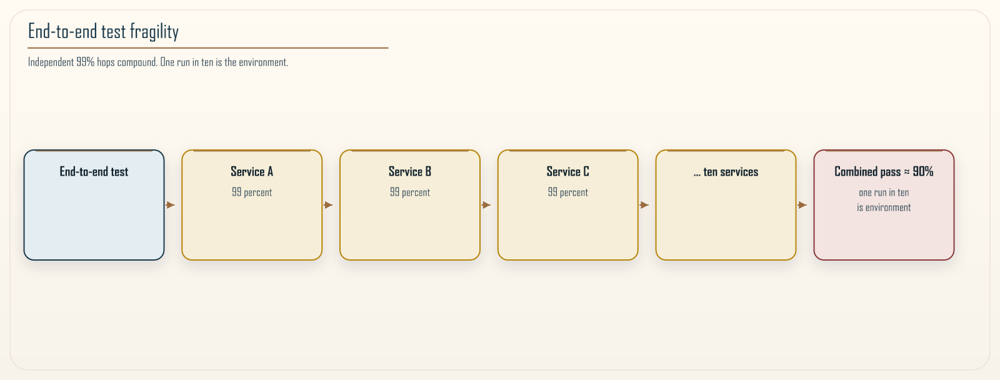
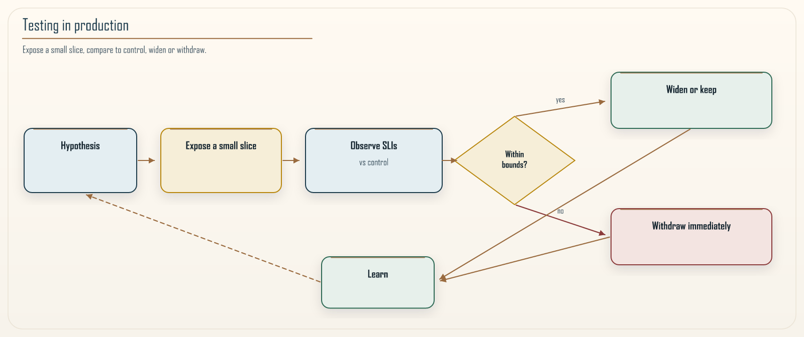

# Chapter 9: Testing Strategies

<div class="chapter-header">
  <h2 class="chapter-subtitle">There Is No Whole System to Test. Test the Agreements.</h2>
  <div class="chapter-meta">
    <span class="reading-time">?? 50 min read</span>
    <span class="difficulty">?? Expert</span>
  </div>
</div>

> *"In a monolith you can test the whole system on your laptop. In a distributed system there is no whole system to test. There are forty services owned by ten teams, and the interesting bugs live in the space between them, which is exactly the space no single test can hold."*

Testing a monolith is, at least in principle, tractable. The whole application runs in one process. You can start it on your laptop, exercise it end to end, and have reasonable confidence that if it works there it will work in production, because there is only one there. Microservices break this comfortable picture in a specific and painful way: there is no longer a whole system you can stand up and test as a unit. The system is dozens of independently deployed services, each evolving on its own schedule, connected by networks that fail, owned by teams that do not coordinate every change. The behavior that matters most, how services interact, is precisely the behavior that is hardest to test, because reproducing the full interacting system faithfully is expensive, slow, and flaky.

The naive response is to try to test the whole thing anyway, by standing up every service in a shared environment and running end-to-end tests across all of them. This is the single most common testing mistake teams make when they move to microservices, and it fails for reasons that are mathematical rather than merely practical. The productive response is different: test each service thoroughly in isolation, test the agreements between services directly and cheaply, and reserve full-system testing for a small, carefully chosen set of critical paths. This chapter is about how to do that.

It covers why the test pyramid changes shape for microservices, the levels of testing from unit to end-to-end and what each is good for, contract testing as the technique that specifically addresses the integration problem, testing asynchronous and event-driven flows, testing in production as a legitimate and necessary practice rather than an admission of failure, test data management, and how all of this fits into a deployment pipeline. The goal is confidence that a change is safe, delivered fast enough that teams actually run the tests, at a cost the organization can sustain.

Chapter 2 already introduced consumer-driven contracts, and Pact, as the pipeline decoupling that stops a distributed monolith from freezing every deploy behind a shared suite. I will not reprint that recipe. This chapter is the rest of the testing system those contracts sit inside: what they prove, what they do not, where they run, and what still has to be tested some other way.

## 9.1 The test pyramid, reshaped

The classic test pyramid is a good starting intuition: many fast, cheap unit tests at the base, fewer integration tests in the middle, and very few slow, expensive end-to-end tests at the top. The shape encodes a cost and speed gradient. Tests near the base run in milliseconds, are deterministic, and pin down small pieces of behavior. Tests near the top run in minutes, depend on many moving parts, and fail for reasons that have nothing to do with the change under test.

It is a gradient, not a quota. Some teams prefer the testing trophy, more integration and fewer sociopathic unit tests of mocked internals. I do not care which metaphor you print on a slide. I care that expensive, multi-service tests stay rare, and that the confidence you need for independent deploy lives somewhere cheaper than a shared staging environment.

Microservices do not overturn this pyramid so much as sharpen why its shape matters, and add a level the monolith did not need. The reason to keep the top of the pyramid narrow is not aesthetic. It is the same availability arithmetic from Chapter 1, applied to test reliability.


*Figure 9.1: Why broad end-to-end tests are fragile, shown through the same multiplication that governs availability. Each box is a service the test depends on, and each is available and behaving correctly only most of the time, say 99 percent. An end-to-end test that touches all of them passes reliably only if every single one is healthy at once, and that combined probability is the product of the individual ones. Ten services at 99 percent each yield roughly a 90 percent chance the whole chain is healthy, so about one run in ten fails for reasons unrelated to the code under test. Add more services and the test becomes useless: it fails so often from environmental flakiness that engineers stop trusting it and start ignoring its results. The narrowness of the pyramid's top is not a style preference. It is the direct consequence of this multiplication.*

Hold the model honestly, the same way Chapter 1 did. The product `0.99^n` assumes independent failures. A shared staging cluster also fails as a unit, a bad deploy of the platform, a shared database, a certificate rotation, and those common-mode failures take the whole suite down at once. The test process itself adds flakes the production path does not have: brittle selectors, fixed sleeps, a clock that moved. The exact percentage is not the point. The point is that every extra service in the path is another way the test can fail without the change under test being wrong, and a suite that fails for that reason is a suite people learn to ignore.

The reshaping for microservices has two parts. First, the top of the pyramid must be even narrower than in a monolith, because the flakiness multiplies with the number of services, as Figure 9.1 shows. Second, a new level appears that the monolith never needed: the contract test, which verifies the agreement between two services without running both of them together. This level is the key to escaping the trap, because it lets you gain confidence that services *agree on structure* without paying the cost and flakiness of actually integrating them in a shared environment. The rest of the chapter works up through these levels.

## 9.2 Unit tests: the foundation

Unit tests exercise a single unit of logic, a function, a class, a small cluster of collaborating objects, in isolation from the network, the database, and the clock. They are the base of the pyramid because they are everything the higher levels are not: fast enough to run thousands in seconds, deterministic enough to never flake, and precise enough that a failure points at one specific piece of behavior.

In a microservices context, the most valuable unit tests target the business logic that justifies the service existing at all. A service that decides whether an order qualifies for a discount, or how to route a shipment, or when to retry a payment, holds rules that are the actual reason the service was built. Those rules should be extracted from the plumbing, the HTTP handling, the database access, the message publishing, and tested directly, so that the tests exercise the decision logic without dragging in the infrastructure. This is not only a testing concern. Code that is hard to unit test is usually code where business logic and infrastructure are tangled together, and the difficulty of testing it is a signal that the design should be untangled. Hexagonal ports and adapters is one name for that untangling. The name matters less than the seam: decisions in, I/O out.

The discipline that keeps unit tests fast and reliable is to test behavior, not implementation. A test that asserts "an order over the threshold receives the discount" survives refactoring of how the discount is calculated. A test that asserts a particular private method was called with particular arguments breaks every time you rearrange the internals, even when the behavior is unchanged, and those brittle tests train teams to distrust and eventually delete their test suites. Test what the unit does, not how it does it.

Two more habits keep this layer honest. Inject the clock. A test that calls `datetime.now()` will flake on month boundaries, on leap seconds, and on whoever last changed the CI image's timezone. And do not mock the thing you are testing. A unit test whose every collaborator is a mock is often an integration test of your mocking framework, dressed up as coverage.

## 9.3 Integration tests: crossing one boundary at a time

Above unit tests sit integration tests, which verify that a service correctly talks to the things it directly depends on: its database, a message broker, a cache, an external API. The unit test deliberately stubbed these out. The integration test deliberately includes one of them, to check the code that crosses that specific boundary. Does the query actually return what the code expects from a real database? Does the message actually serialize and land on a real broker? These are the questions unit tests cannot answer because they mocked the boundary away.

The important discipline here is to cross one *kind* of boundary at a time. An integration test for the order service's database access should use a real database but stub the payment service, so that when it fails you know the problem is in the persistence interaction and not somewhere else. Testing many remote integrations at once produces a test that is slow, that fails for many possible reasons, and that is hard to diagnose, which pushes it up toward the fragile top of the pyramid without the honesty of calling it an end-to-end test.

One service's own persistence is still one boundary even when it is two tables. The outbox row and the order row from Chapter 6 belong in the same local transaction, and the integration test that proves they commit together is not a pyramid violation. It is the boundary that matters.

Real dependencies in integration tests are increasingly practical because of containerized test infrastructure. Rather than mocking a database and hoping the mock behaves like the real thing, a test can spin up a genuine engine in a container, run migrations against it, and tear it down. This gives the fidelity of a real dependency without the shared-environment problems of a permanently running one, and it is the recommended default for testing anything that talks to a data store or a broker, because mocks of stateful infrastructure are exactly where mock-versus-reality drift causes bugs to slip through.

Fidelity has a footnote. The container has to be the same product and a current major version, or you are testing a cousin. Postgres 14 is not Postgres 16. DynamoDB Local and most LocalStack tables are not DynamoDB. They are close enough to catch a wrong key condition and not close enough to catch a transaction isolation surprise or a Global Table conflict. Use a container when the engine is the same. Use a dedicated account or an ephemeral cloud resource when the local emulator is a known liar. First-run image pulls make CI look flaky; pin the image and cache it.

## 9.4 Contract testing: the technique that makes microservices testable

Here is the central problem. The order service calls the payment service. You want confidence that they work together. The expensive, flaky answer is to stand up both services and test them together, which lands you at the top of the pyramid with all the multiplication problems of Figure 9.1. The better answer is contract testing, and it is important enough to microservices that it deserves to be understood carefully.

A contract is an explicit, machine-checkable description of the agreement between two services: what requests the consumer will send, and what responses the provider promises to return. Contract testing verifies each side against that contract independently, without ever running the two services together. The consumer's tests check that it sends requests matching the contract and can handle responses matching the contract. The provider's tests check that it actually returns responses matching the contract. If both sides pass against the shared contract, they agree on *shape*. That is a great deal. It is not the same as proving they will work together in production.

The most useful form is consumer-driven contract testing, where the contract originates from the consumer's actual expectations. Chapter 2 has the Pact recipe: typed matchers, a provider state, consumer publishes, provider verifies against a broker. The direction matters. The contract describes what consumers genuinely need, so the provider learns precisely which parts of its interface are actually depended upon, and can change everything else freely. When the provider is about to break something a consumer relies on, the provider's own contract tests fail, before deployment, in the provider's own pipeline, which is exactly where you want to catch it.

That is what makes independent deployment of services actually safe rather than merely fast, *if* the provider verifies every contract that production still consumes, not just the one the author remembered. The missing gate, the one teams skip under deadline, is `can-i-deploy`: before a version is promoted, the broker answers whether this provider version satisfies the contracts of the consumers already in that environment. A green provider suite against last week's local pact file is not that question.

Schema-first tools, OpenAPI, AsyncAPI, JSON Schema, a request-replay harness, are useful and they are not the same thing. They prove the provider still matches a specification someone wrote. They do not prove any living consumer still wants that specification. Use them as documentation and as a lint. Use consumer-driven contracts as the deploy gate. Do not confuse a WireMock stub in a component test with a contract. The stub makes *your* service testable. The contract makes the *agreement* testable. You need both, and they are not substitutes.

Contract testing has real limits, and Chapter 2 listed them. They bear repeating because teams routinely overestimate what a green contract suite proves.

A contract verifies that the shapes of requests and responses match and that agreed fields are present and correctly typed. It does not verify semantics. If the provider returns a syntactically perfect response whose meaning has changed, prices now in cents instead of dollars, a status code that now means something different, the contract test passes and the system breaks. Contracts pin down structure, not meaning. Treat a semantic change as a new version even when the shape is unchanged.

A contract is not a performance test, not an authorization test, and not a proof that the provider's *other* consumers still work. It is a proof that *this* consumer's declared needs are still met. Provider states that nobody implements, and consumers that stop publishing as their real calls change, turn the broker into theater. The practice only works if a failing contract is a real failure, which is the same sociotechnical point Chapter 2 ended on.

They are necessary and powerful, and they must be paired with the shared understanding, versioning discipline, and semantic care that no schema check can enforce.

## 9.5 Component tests: one service, end to end, in isolation

Between the boundary-at-a-time integration test and the full-system end-to-end test lies a level that fits microservices particularly well: the component test, which exercises one entire service end to end, through its real external interface, with all of its *peer* services replaced by controlled stubs.

The distinction from integration testing is scope. An integration test checks one boundary. A component test drives the whole service through its public API, a real HTTP request in, a real HTTP response out, exercising all the internal layers together, but it stubs every other service the target calls. The order service is tested as a complete, running service, its own database included if that is how it runs, but the payment service and inventory service it depends on are replaced by stubs that return controlled, scripted responses.

This level is valuable precisely because it tests the service the way its consumers actually use it, through its real interface and all its real internal wiring, while keeping the test fast and deterministic by removing the network dependency on other teams' services. You can script the stubs to return errors, timeouts, and malformed responses, and check that the service handles them correctly, which is difficult to arrange reliably when the dependency is a real service you do not control.

Include the paths teams skip because they are awkward. Authentication and authorization belong here, not only in a gateway test someone else owns. A component suite that sends unauthenticated requests around the authorizer will go green and then fail the first time a real token arrives. Timeouts and retries from Chapter 6 belong here too: the stub is how you make payment hang for longer than the deadline, on demand.

Component tests are where you verify a service's own behavior comprehensively, so that end-to-end tests can be reserved for the few things only they can check.

## 9.6 End-to-end tests: few, critical, and guarded

End-to-end tests exercise the real system, multiple services running together, along a complete user journey. They are the only tests that can catch certain whole-system problems: a misconfiguration that only appears when real services connect, an emergent behavior that no single service's tests could reveal, a critical business flow that must be verified against the actual assembled system. They have genuine value, and the point of this section is not to eliminate them but to keep them in their proper, small place.

The reasons to keep them few are the ones Figure 9.1 made concrete. Each service in the path adds a probability of environmental failure, and those probabilities multiply, so a test spanning many services fails often for reasons unrelated to any code change. They are slow, because they wait on real networks and real service startup. They are expensive, because they need an environment where many services run together in a realistic configuration. And when they fail, they are hard to diagnose, because the failure could be in any of the services or in the environment itself.

The discipline that keeps them useful is selective and strict.

**Cover only the critical journeys.** The handful of flows whose breakage is a genuine business emergency, checkout completing, a user being able to log in, payment being captured, warrant an end-to-end test. The long tail of less critical behavior does not, and is covered by component and contract tests instead.

**Treat flakiness as a defect, not a fact of life.** A flaky end-to-end test is worse than no test, because it trains the team to ignore failures, and a team that ignores test failures will eventually ignore a real one. Every flake is investigated and fixed or the test is removed. A quarantine lane that nobody empties is how you formalize ignoring them.

**Prefer testing in production for what end-to-end tests do poorly.** Many things teams try to verify with brittle pre-production end-to-end tests are better verified with the production techniques of Section 9.8, which observe the real system under real conditions.

A small, reliable, well-guarded set of end-to-end tests on the flows that truly matter is an asset. A large, flaky one is a liability that slows every deployment and catches nothing anyone believes.

## 9.7 Testing asynchronous and event-driven flows

Much of a microservices system does not communicate through request and response at all. Services publish events and react to them, as Chapter 10 covers in depth, and this asynchronous style needs testing approaches that synchronous techniques do not supply, because the fundamental assumption of a request test, that a response comes back immediately, does not hold.

The core difficulty is that the result of an action is not returned to the caller. A service publishes an event and moves on; something happens later, in another service, in response. Tests therefore have to reason about eventual outcomes rather than immediate returns, and they must do so without either waiting arbitrarily long or asserting too soon.

Several techniques address this.

**Test the contract of events, not just synchronous APIs.** The events a service publishes are as much a part of its interface as its HTTP endpoints, and consumers depend on their structure exactly as they depend on API responses. Apply contract testing to events: Pact message contracts, or an AsyncAPI schema plus a consumer-driven check, verify that publishers emit events matching an agreed schema and that consumers can handle events matching it. A change to an event's shape can break a consumer just as surely as a change to an API, and it deserves the same build-time protection, including `can-i-deploy` before you ship a new event version.

**Assert on eventual outcomes with bounded waiting.** A test that triggers an asynchronous flow should wait for the expected outcome up to a sensible timeout, polling for the result, rather than sleeping a fixed duration and hoping. Fixed sleeps make tests either slow, when the sleep is long, or flaky, when it is too short for a slow run. Waiting for a condition with a timeout is both faster in the common case and more reliable.

**Test idempotency and duplicate delivery explicitly.** Event systems generally guarantee at-least-once delivery, which means a consumer will sometimes receive the same event twice. Chapter 5 required the processed-id and the business write in the same local transaction for exactly this reason. This is not an edge case to hope against. It is a normal occurrence, and the consumer's ability to handle a duplicate without double-processing is core behavior that must be tested directly by delivering the same event twice and asserting the effect happened once.

**Test the other delivery lies too.** Out-of-order events, a delayed retry that lands after a newer state, a poison message that must reach a dead-letter queue rather than block the partition, are the incidents you will have. Write those tests. A suite that only ever delivers one well-formed event in order is testing a broker that does not exist.

Testing asynchronous flows well is mostly a matter of taking the asynchrony seriously rather than trying to pretend it away with sleeps and single-delivery assumptions.

### Recipe 9.1: Bounded wait, then deliver the event twice

**Context.** An order-placed handler should mark the order fulfilled exactly once. The broker will deliver the same message again. A `time.sleep(2)` before the assertion will pass on a fast laptop and fail in CI, and a test that publishes once will never see the double-ship bug from Chapter 5.

**Solution.** Poll until the outcome appears, fail on a deadline, then publish the same event again and assert the effect is still once.

```python
import time

DEADLINE_SECONDS = 5
POLL_SECONDS = 0.05


def wait_until(predicate, timeout=DEADLINE_SECONDS):
    """Poll for a condition. Do not sleep a fixed guess."""
    deadline = time.monotonic() + timeout
    while time.monotonic() < deadline:
        if predicate():
            return
        time.sleep(POLL_SECONDS)
    raise AssertionError("eventual outcome did not appear in time")


def test_fulfillment_is_idempotent(bus, orders, handler):
    event = {"event_id": "evt-9", "order_id": "ord-9"}

    handler.consume(event)
    wait_until(lambda: orders.count("ord-9") == 1)

    handler.consume(event)  # at-least-once: same event again
    wait_until(lambda: orders.count("ord-9") == 1)
    assert orders.shipments("ord-9") == 1
```

The wait belongs on the first consume, where work is actually happening. The second consume should be a no-op if the processed-id and the business write share a transaction. If your handler marks the event processed and *then* ships, this test is the one that catches it. Use unique IDs per test so a parallel suite cannot share an `ord-9`.

## 9.8 Testing in production is not a confession

There is a lingering cultural belief that needing to test in production is an admission that your pre-production testing failed. For distributed systems this belief is backwards. Some properties of a microservices system genuinely cannot be verified anywhere except production, because no pre-production environment faithfully reproduces production's scale, its real traffic patterns, its real data distributions, or the precise configuration of its dependencies. Testing in production is not a failure of discipline. It is a recognition that the production environment is the only environment that is actually like production, and mature teams do it deliberately and safely.

Several practices make production a place you can test without endangering users.

**Canary releases.** Rather than sending a new version to all traffic at once, route a small fraction to it and watch the telemetry from Chapter 8. Compare the canary to a contemporaneous control, the stable version serving the rest of the traffic, on the same SLIs, not to last Tuesday's dashboard. If the canary's error rate or latency degrades relative to that control, roll back automatically before most users are affected. A canary nobody rolls back from is a slow production deploy with extra steps.

**Feature flags.** Deploying code and enabling a feature become separate decisions. New behavior ships dark, is enabled for internal users or a small percentage first, and can be turned off instantly without a redeployment if it misbehaves. Dark is not free: the code still runs next to production data, and a flag that writes still writes. Clean flags up or they become a second, untested product. Test both sides of a flag in the component suite, or you have untested branches sitting behind a boolean.

**Synthetic monitoring.** Scripted transactions run continuously against production, exercising critical journeys the way a user would, so that a broken flow is detected by your own probe within minutes rather than by a customer complaint. This is an end-to-end test that runs forever, against the real system, and its flakiness is itself a useful signal about real reliability. Drive synthetics through the same authentication and authorization path a user takes. A privileged backdoor that only the probe can call will stay green while checkout is on fire.

**Controlled fault injection.** Deliberately introducing failures into production to verify the system withstands them is the practice of chaos engineering, which Chapter 13 covers in full. It is, at heart, a form of testing: it verifies resilience hypotheses against the only system where the answer truly counts. Do not start that practice without the abort on SLO burn that chapter requires.


*Figure 9.2: Testing in production as a disciplined loop. The practice is not reckless tampering with a live system. It begins with a hypothesis about how the system should behave under a specific condition, exposes that condition to a deliberately limited blast radius so that if the hypothesis is wrong the harm is contained, observes what actually happens against the telemetry from Chapter 8, and then either widens the experiment or withdraws immediately. Canary releases, feature-flagged rollouts, synthetic probes, and the fault injection of Chapter 13 all follow this same shape: verify real behavior in the real environment while keeping the cost of being wrong small.*

The unifying principle across all four practices is blast-radius control. You test in production not by exposing everyone to risk, but by exposing a small, recoverable slice, watching closely, and being able to withdraw instantly. Done this way, production testing catches exactly the class of problem that pre-production testing structurally cannot, and it does so without gambling with the user base.

## 9.9 Managing test data

Test data is the quiet reason test suites rot, and it is worth explicit attention because it is where good testing intentions most often decay into flaky, unmaintainable suites. In a microservices system the problem multiplies, because each service owns its own data (Chapter 4), so a test that spans services needs consistent data across several independent stores that no single team fully controls.

A few principles keep test data manageable.

**Each test sets up the data it needs and cleans up after itself.** Tests that depend on data left behind by other tests, or on a shared fixture that everyone mutates, fail unpredictably depending on run order and become impossible to reason about. A test should create its own preconditions, use unique identifiers so it can run in parallel, and leave the world as it found it.

**Do not test against copies of production data with real personal information.** Beyond the privacy and compliance exposure of Chapter 7, real data makes tests non-reproducible because it changes underneath them, and a restored dump is a breach you scheduled. Generate synthetic data that has the shape and edge cases you need to exercise, and you gain both safety and determinism.

**Make test data construction expressive.** When creating a valid order for a test requires twenty lines of boilerplate, tests become painful to write and people stop writing them. Builders and factories that produce valid domain objects with sensible defaults, overriding only the field a given test cares about, keep tests short and focused on the behavior under examination rather than on data plumbing.

**Do not share a golden dataset across services and call it isolation.** The moment checkout's test assumes inventory already contains SKU `ABC` because "that's what staging has," you are testing the current state of a shared environment. Create the SKU in the stub or in the service under test. Cross-service referential integrity is a production concern. In tests it is a coupling.

The theme is isolation and reproducibility. A test whose outcome depends on data it does not control is not really testing the code; it is testing the current state of a shared environment, and it will fail for reasons that have nothing to do with the change under test.

## 9.10 Fitting tests into the pipeline

Tests only protect you if they run automatically, at the right time, on every change, and fast enough that the team does not route around them. A test suite that takes an hour is a test suite people learn to skip, and a skipped test is worth nothing. The levels of testing in this chapter map naturally onto the stages of a deployment pipeline, ordered by speed so that the fastest, cheapest checks fail first and give the quickest feedback.

**On every commit, in the build:** unit tests and component tests. These are fast and deterministic, so they run on every change and gate the build. A failure here stops the change immediately, cheaply, with a precise pointer to what broke.

**On every commit, in the build:** the service's contract tests. The consumer publishes a new pact. The provider verifies every pact the broker holds for the target environment, and `can-i-deploy` is the promotion question, not an after-the-fact report. Because contracts are checked without a shared environment, they belong in the fast part of the pipeline, where they catch structural breakage at the moment it is introduced rather than after a deploy.

**Before promotion to production:** the small set of critical end-to-end tests, run in a staging environment that is as close to production topology as you can afford, not a snowflake that only the test team understands. These are slower and are reserved for the journeys that justify their cost, guarding the promotion step specifically.

**Continuously in production:** synthetic monitoring, canary analysis against a live control, and, where the team is ready, controlled fault injection. These run against the live system and catch what pre-production cannot.

Ordering matters because feedback speed determines whether tests get used. Put the fast checks first so most failures surface in seconds, and reserve the slow, expensive checks for later stages and fewer cases. A pipeline arranged this way gives developers near-immediate feedback on most mistakes while still guarding the promotion to production with the heavier tests that only matter there.

## 9.11 Conclusion

There is no whole system to test in a microservices architecture, and the sooner a team accepts that, the sooner it stops trying to solve a distributed testing problem with a monolithic testing habit. Standing up every service and running broad end-to-end tests across all of them fails not because teams execute it poorly but because the flakiness multiplies with every service in the path, as Figure 9.1 makes concrete, until the tests fail so often for environmental reasons that no one believes them.

The strategy that works pushes confidence down to where it is cheap and reliable. Unit tests pin down business logic in milliseconds. Integration tests verify one kind of boundary at a time against a real engine, not a liar emulator if you can avoid it. Component tests exercise a whole service through its real interface, including auth and failure, while stubbing its neighbors. Contract tests, the level microservices specifically need, verify that services agree on structure without ever running them together, which is what makes independent deployment genuinely safer, provided the broker's `can-i-deploy` question is the one you ask. They still do not verify meaning. End-to-end tests are kept few, guarded, and reserved for the critical journeys only they can cover. Asynchronous flows are tested for the duplicates and eventual outcomes that are their real failure modes. And production itself becomes a place you test deliberately and safely, through canaries compared to a live control, feature flags you clean up, synthetics that walk the user's path, and controlled fault injection, because production is the only environment that is truly like production.

The through-line is the same one that runs through the whole book: make each service safe to change on its own. Contract tests let a provider know at build time whether a change breaks a consumer's declared shape. Component tests let a team verify their service comprehensively without depending on anyone else's environment. Blast-radius control lets production testing catch what nothing else can without endangering users. Testing, done this way, is not a phase that slows delivery down. It is the mechanism that lets many teams deploy many services quickly without the whole system collapsing under the weight of their independence. The next chapter turns to the asynchronous messaging patterns that carry so much of that independence, and to how services coordinate without waiting on one another.

---

**Navigation:**
- [Previous: Chapter 8](08-monitoring-and-observability.md)
- [Next: Chapter 10](10-asynchronous-messaging-patterns.md)
