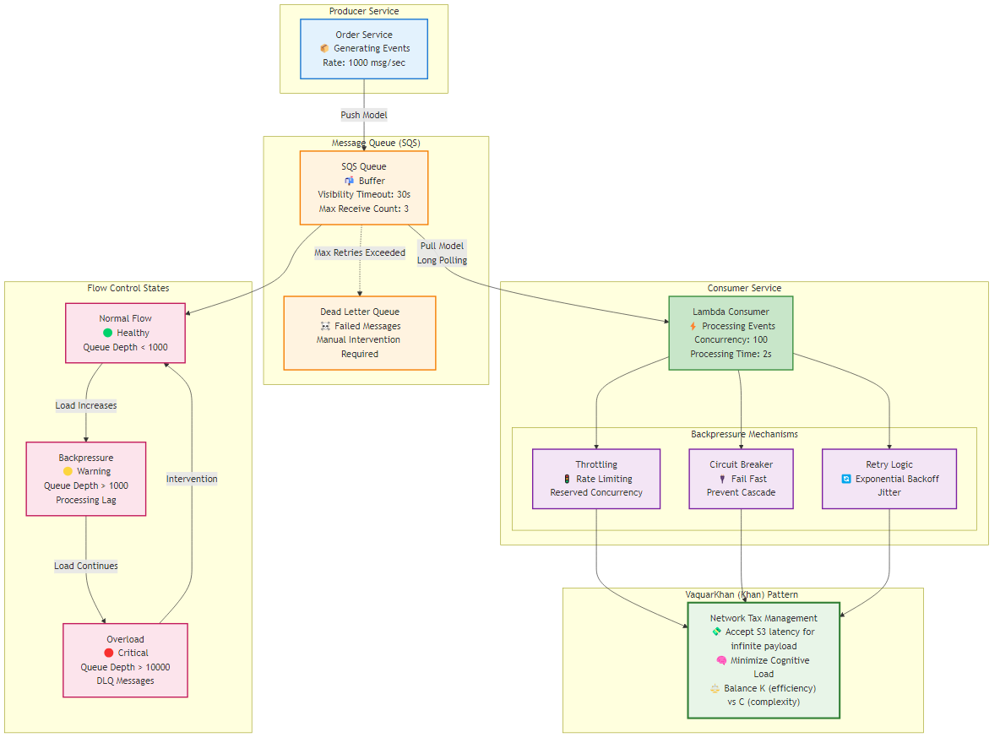
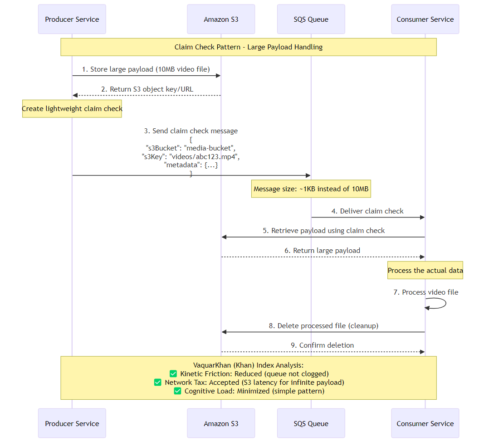

---
title: "Asynchronous Messaging Patterns"
chapter: 10
author: "Viquar Khan"
date: "2026-01-15"
lastUpdated: "2026-02-10"
tags: 
  - microservices
  - architecture
  - distributed-systems
  - messaging
  - asynchronous
  - patterns
difficulty: "expert"
readingTime: "40 minutes"
---

# Chapter 10: Asynchronous Messaging Patterns

<div class="chapter-header">
  <h2 class="chapter-subtitle">The Nervous System of Distributed Architectures</h2>
  <div class="chapter-meta">
    <span class="reading-time">📖 40 min read</span>
    <span class="difficulty">🎯 Expert</span>
  </div>
</div>

In the maturation of any distributed system, there comes a critical inflection point described in the VaquarKhan (Khan) Pattern™ as the transition from "Phase 2: Expansion" to the management of steady-state complexity. If the database serves as the memory of an organization, preserving state across time, the messaging infrastructure functions as its nervous system, transmitting signals—events, commands, and queries—across the chasm of the network. This chapter addresses the single most significant operational risk introduced during the "Expansion" phase: the management of the Network Tax.

When a monolithic application is decomposed to resolve high Kinetic Friction—where a single unit of compute is overwhelmed by competing concerns—the architect trades local, in-memory complexity for distributed, network-bound complexity. In the "One Cook Kitchen" (monolith), a function call is instantaneous, transactional, and guaranteed. In the distributed microservices environment, that same interaction becomes a probabilistic event subject to latency, serialization overhead, and partial failure. This is the Network Tax: the cost paid in latency and cognitive load for the privilege of independent scaling.

The difference between a fragile distributed monolith and a resilient microservices architecture lies in how effectively this tax is managed. It is not enough to simply decouple services; one must engineer the whitespace between them. This requires a rigorous application of asynchronous messaging patterns designed to handle the physics of data flow. Specifically, the senior architect must master three fundamental forces: **Backpressure** (flow control), **Poison Message Handling** (error isolation), and **Idempotency** (consistency).

Without these mechanisms, the system remains vulnerable to "Entropic Collapse." A single slow database query in a downstream service can cause a backlog of messages that consumes all available memory in the producer, triggering a cascading failure that brings down the entire platform—a phenomenon known as the "Microservice Singularity." This chapter provides the blueprints or "Recipes" to prevent such collapse, culminating in a definitive guide to handling large payloads via the Claim Check Pattern.

## 10.1 The Physics of Flow: Managing Backpressure

In fluid dynamics, backpressure refers to the resistance or force opposing the desired flow of fluid through pipes. In distributed software systems, it is the mechanism by which a downstream consumer signals to an upstream producer that it is overwhelmed and cannot accept more work. In the absence of backpressure, systems fail catastrophically rather than degrading gracefully.


*Figure 10.1: Backpressure flow control mechanisms in distributed systems, showing producer-consumer patterns and VaquarKhan (Khan) Pattern application*

The architectural imperative for 2026 is to move beyond simple buffering and implement active flow control. The VaquarKhan (Khan) Pattern emphasizes that while splitting services reduces Kinetic Friction (workload per unit), it introduces the risk of "latency storms" if the communication channels are not governed by strict physics.
### 10.1.1 The Push vs. Pull Dichotomy

The fundamental determination of how backpressure is handled lies in the choice of messaging model: Push vs. Pull.

#### The Push Model

In a push-based model (e.g., Amazon SNS, EventBridge pushing to API Destinations), the producer or the broker dictates the rate of traffic. The consumer is passive. If an upstream service scales out to process a traffic spike—perhaps triggered by a marketing event—it floods the downstream consumers. If those consumers are backed by limited resources (e.g., a legacy SQL database or a third-party API with rate limits), they will fail. The broker typically attempts to retry, which only exacerbates the load, leading to a "thundering herd" scenario. Backpressure in push systems is difficult to implement without introducing complex sidecar proxies or circuit breakers.

#### The Pull Model

The pull-based model (e.g., Amazon SQS, Apache Kafka) inverts control. The consumer dictates the rate of processing. An SQS consumer polls the queue only when it has the compute capacity to handle a new message. If the consumer is overwhelmed or crashes, it simply stops polling. The messages accumulate in the durable queue, effectively storing the "pressure" in a buffer designed to hold it, rather than crashing the compute layer.

For the Senior Architect, the Pull Model via Amazon SQS is the non-negotiable standard for inter-service communication where downstream processing variance exists. It acts as a shock absorber, smoothing out the spikes in Kinetic Friction that occur during high-load events.

### 10.1.2 Tuning the Lambda SQS Valve

In modern cloud-native architectures (specifically AWS), the "Pull" model is often abstracted by the Lambda service, which manages the polling fleet on behalf of the developer. While this reduces operational overhead—the "Cognitive Load" variable in the VaquarKhan (Khan) Index—it obscures the mechanics of flow control. To manage backpressure effectively, one must understand how the Lambda Poller interacts with the SQS queue.

#### The Scaling Behavior and Concurrency Limits

By default, the AWS Lambda poller attempts to keep the queue empty. It detects the queue depth and scales up the number of concurrent function instances to match the influx of messages, up to the account's concurrency limit (defaulting to 1,000 in many regions). While efficient for the queue, this behavior can be destructive for downstream dependencies. If a Lambda function connects to a relational database with a maximum connection pool of 50, and SQS scales the Lambda to 500 concurrent instances, the database will crash.

To apply effective backpressure, the architect must artificially constrain this scaling behavior. In 2026, there are two primary levers for this:

1. **Reserved Concurrency**: Setting a reserved concurrency limit on the consumer function guarantees that no more than N instances run simultaneously. Any attempt by the poller to invoke more instances will be throttled. While effective, this limit applies to the entire function, sharing the pool between different triggers.

2. **Maximum Concurrency (Event Source Level)**: This is the preferred mechanism for SQS event sources. It allows the architect to limit the number of concurrent records processed by the function specifically from that queue, without capping the function's overall scalability for other events. This provides a precise valve to match the throughput of the Lambda consumer to the capacity of its downstream dependency.

When these limits are reached, the "backpressure" is realized: the messages remain in the SQS queue. The `ApproximateAgeOfOldestMessage` metric will rise, but the system remains stable. This is a deliberate architectural trade-off: accepting increased latency (Network Tax) to ensure system stability (Survivability).

### 10.1.3 The Visibility Timeout Equation

A critical, often misconfigured component of backpressure management is the Visibility Timeout. This setting defines the period during which a message is "invisible" to other consumers after being picked up by a poller. It is the system's estimation of how long processing should take.

A common failure mode observed in "Expansion" phase architectures is the **Zombie Message Loop**. This occurs when the Visibility Timeout is set shorter than the actual processing time of the function (often extended due to retries or heavy computation).

1. Worker A picks up Message X
2. Worker A begins processing (e.g., generating a large report)
3. The Visibility Timeout expires (e.g., 30 seconds) while Worker A is still running
4. SQS makes Message X visible again
5. Worker B picks up Message X
6. Worker A completes and tries to delete Message X, but it technically "failed" from the queue's perspective
7. Worker B is now duplicating the work

This destroys the efficiency of the system and violates idempotency principles.

#### The Golden Rule of Visibility

To prevent this, the Visibility Timeout (T_vis) must be derived from the Function Timeout (T_func) using the following inequality:

```
T_vis ≥ 6 × T_func + T_batch_window
```

AWS documentation and empirical best practices suggest setting the visibility timeout to at least six times the function's configured timeout. This aggressive safety margin accounts for the internal retry logic of the Lambda service (which may retry errors internally before returning the message to the queue), network jitter, and the overhead of batch processing.
### 10.1.4 Metrics for Monitoring Flow

To effectively manage backpressure, the architect must monitor specific metrics that indicate the health of the flow. Relying solely on "invocation count" is insufficient.

#### Table 10.1: Key Backpressure Metrics

| Metric | Definition | Signal Interpretation |
|--------|------------|----------------------|
| `ApproximateAgeOfOldestMessage` | The time elapsed since the oldest message in the queue was sent | If this grows linearly while throughput is constant, the consumer is under-provisioned. The backpressure is too high. |
| `ApproximateNumberOfMessagesVisible` | The number of messages available for retrieval | A spike indicates a burst in production; a plateau indicates maximum concurrency limits have been reached. |
| `ApproximateNumberOfMessagesNotVisible` | Messages currently being processed (in-flight) | This should track with the concurrency setting. If it drops to zero while Visible messages exist, the poller may be unhealthy. |
| `ConcurrentExecutions` | The number of Lambda instances running | Must remain below the downstream system's capacity limit (e.g., DB connection pool). |

By instrumenting these metrics, the architect moves from reactive firefighting to proactive flow management, ensuring the "Nervous System" remains responsive even under load.

## 10.2 The Toxicity of Data: Handling Poison Messages

In biological systems, the liver filters toxins from the bloodstream to prevent organ failure. In distributed architecture, the Dead Letter Queue (DLQ) serves this exact function. A "Poison Message" (or Poison Pill) is a payload that cannot be processed successfully, regardless of how many times it is retried. This could be due to malformed JSON, a schema mismatch (e.g., a string where an integer is expected), or a logical edge case (e.g., a transaction referencing a deleted user).

If a messaging system lacks a mechanism to isolate and remove these messages, they trigger an **Infinite Retry Loop**. The consumer picks up the message, fails, returns it to the queue, and picks it up again immediately. This consumes compute resources, blocks other messages (specifically in FIFO queues where ordering is strict), and pollutes logs with error traces—effectively creating a self-inflicted Denial of Service (DoS) attack.

### 10.2.1 The Redrive Policy and MaxReceiveCount

The primary defense against poison messages is the **Redrive Policy** configured on the source queue. This policy dictates the condition under which a message is moved to a DLQ. The critical parameter is `maxReceiveCount`.

#### Tuning maxReceiveCount

Determining the correct value for `maxReceiveCount` requires balancing resilience against waste:

- **Low (e.g., 1)**: Risk of premature failure. A transient network glitch or a cold start timeout could cause a valid message to be DLQ'd, requiring manual intervention.
- **High (e.g., 100)**: Wasted resources. The system spends excessive cycles and money processing a message that is destined to fail.
- **Optimal Range (3–5)**: This range is generally sufficient to handle transient failures (network blips, service throttling) but aggressive enough to fail fast on genuine poison pills. For Lambda triggers, a value of 5 is often recommended to allow for internal retries within the execution environment before giving up.

### 10.2.2 Partial Batch Failures: The ReportBatchItemFailures Protocol

A significant evolution in AWS Lambda's integration with SQS is the handling of batch failures. By default, Lambda reads messages in batches (e.g., 10 records). If the function processes 9 records successfully but throws an exception on the 10th, the entire batch is marked as failed. All 10 messages become visible again and are retried. This is highly inefficient and dangerous for non-idempotent operations, as the 9 successful messages will be re-processed.

As of 2026, the best standard practice is to implement **Partial Batch Responses**.

#### The Mechanism

The Lambda function is configured with `FunctionResponseTypes: ["ReportBatchItemFailures"]` in the Event Source Mapping. Instead of throwing an exception when a message fails, the function catches the error, finishes processing the remaining items in the batch, and returns a specific JSON response listing the `itemIdentifier` (Message ID) of only the failed records.

#### JSON Response Structure

```json
{
  "batchItemFailures": [
    {
      "itemIdentifier": "message-id-1"
    },
    {
      "itemIdentifier": "message-id-3"  
    }
  ]
}
```

Upon receiving this response, the Lambda service deletes the successful messages from the queue and leaves only the reported failures to be retried. This granular control dramatically reduces the "Network Tax" of retries and prevents the "snowball effect" where a single poison message drags down healthy data.
### 10.2.3 Implementation Strategy with AWS Lambda Powertools

Writing the boilerplate to iterate through records, catch exceptions, and format the response correctly is error-prone. The AWS Lambda Powertools library (available for Python, Java, and TypeScript) provides a `BatchProcessor` utility that abstracts this complexity. This is the "Golden Path" for implementation in 2026.

#### Python Implementation Example

```python
from aws_lambda_powertools import Logger, Tracer
from aws_lambda_powertools.utilities.batch import BatchProcessor, EventType, batch_processor
from aws_lambda_powertools.utilities.data_classes.sqs_event import SQSRecord

# Initialize the processor for SQS
processor = BatchProcessor(event_type=EventType.SQS)
logger = Logger()
tracer = Tracer()

@tracer.capture_method
def record_handler(record: SQSRecord):
    """
    Process individual records. 
    Any exception raised here is caught by the batch_processor.
    """
    payload = record.body
    logger.info(f"Processing message: {record.message_id}")
    
    # Simulate poison pill detection
    if "malformed_data" in payload:
        # This exception triggers the failure reporting for this specific item
        raise ValueError(f"Poison pill detected in message {record.message_id}")
    
    # Perform Idempotent Business Logic
    process_order(payload)

@logger.inject_lambda_context
@tracer.capture_lambda_handler
@batch_processor(record_handler=record_handler, processor=processor)
def lambda_handler(event, context):
    # The decorator handles the batch iteration, error catching, 
    # and construction of the 'batchItemFailures' response.
    return processor.response()
```

### 10.2.4 The Redrive Workflow

Moving a message to a DLQ is not the end of the story; it is a request for human or automated intervention. The VaquarKhan (Khan) Pattern dictates that we must minimize the "Cognitive Load" of operations. Therefore, the DLQ strategy must include a path for resolution.

#### The 2026 Operational Protocol

1. **Alerting**: A CloudWatch Alarm monitors DLQ. If `ApproximateNumberOfMessagesVisible > 0`, an alert is fired to the engineering team.

2. **Investigation**: Engineers inspect the message attributes and body. Is it a code bug? A schema change? A third-party API failure?

3. **Resolution**:
   - **If Code Bug**: Patch the consumer Lambda and deploy.
   - **If Transient**: The issue may have resolved itself.

4. **Redrive**: Use the SQS Dead Letter Queue Redrive feature (available via Console or API) to move the messages back to the source queue for reprocessing. This native feature eliminates the need for custom scripts to "replay" failed events.

5. **Purge**: If the messages are fundamentally invalid (true poison pills), they are purged to clear the alarm.

## 10.3 The Illusion of Once: Idempotency in Distributed Systems

One of the most persistent fallacies in distributed system design is the assumption of "exactly once" delivery. In a networked environment subject to the CAP theorem, guaranteeing that a message is delivered exactly once requires heavy coordination (like two-phase commits) that destroys throughput and availability. The practical reality for high-scale systems is **At Least Once** delivery.

SQS guarantees that a message will be delivered, but network partitions, timeouts, or poller crashes can result in the same message being delivered multiple times. If a Lambda function successfully processes a payment but crashes before deleting the SQS message, that payment message will become visible again. If the consumer is not **Idempotent**, the customer will be charged twice.

**Idempotency** defines an operation that produces the same side effect whether it is executed once or multiple times: `f(f(x)) = f(x)`.

### 10.3.1 Strategies for Implementing Idempotency

There are varying levels of idempotency, ranging from natural database constraints to complex distributed locking.

#### Level 1: Natural Idempotency

Some operations are inherently safe to retry:

- **Idempotent**: `UPDATE Order SET status = 'Shipped' WHERE id = 123`. Executing this 50 times results in the same state.
- **Not Idempotent**: `UPDATE Account SET balance = balance + 100 WHERE id = 456`. Executing this twice results in a double charge.

#### Level 2: Database Constraints (The Optimistic Lock)

This strategy utilizes the ACID properties of the underlying database to prevent duplication. If the Message ID (or a deterministic hash of the payload) is used as the Primary Key in DynamoDB, or a Unique Key in PostgreSQL, a second attempt to write the same record will fail.

In DynamoDB, Conditional Writes are used to enforce this:

```python
try:
    table.put_item(
        Item={
            'PK': f"MSG#{message_id}",
            'Status': 'PROCESSED',
            'Data': payload
        },
        ConditionExpression='attribute_not_exists(PK)'
    )
except ClientError as e:
    if e.response['Error']['Code'] == 'ConditionalCheckFailedException':
        # Message already processed. Treat as success (Idempotent).
        return "Already Processed"
    raise
```
#### Level 3: The Idempotency Token Pattern (The Heavy Lifter)

For complex business logic that involves multiple steps (e.g., charge credit card → update inventory → email user), a simple database write is insufficient. We need a stateful barrier that tracks the lifecycle of the request.

##### The Algorithm

1. **Acquire Lock**: The function receives a message and attempts to write a record to a persistence store (DynamoDB) with the key (e.g., order_id) and status `IN_PROGRESS`.
   - If record exists and is `COMPLETED`: Return the stored result immediately. The work is already done.
   - If record exists and is `IN_PROGRESS`: This indicates a potential race condition or a crash loop. A backoff strategy is applied.
   - If record does not exist: The write succeeds, and the lock is acquired.

2. **Execute**: The function performs business logic (e.g., calling the payment gateway).

3. **Commit**: The function updates the DynamoDB record status to `COMPLETED` and stores the result payload.

This pattern handles the "crash after process but before delete" failure mode effectively. If the function crashes after step 2 but before step 3, the lock eventually expires (via TTL or timeout), allowing a retry. If it crashes after step 3, the retry sees the `COMPLETED` status and exits safely.

### 10.3.2 Standardization via Libraries

Implementing the Idempotency Token Pattern manually is complex and prone to edge cases (e.g., handling lock expiration). In 2026, the recommended approach is to use the AWS Lambda Powertools Idempotency module. It injects this logic transparently into the handler via a decorator, using DynamoDB as the state store.

#### Terraform Resource for Idempotency Table

To support this pattern, a DynamoDB table must be provisioned. Using a Time to Live (TTL) attribute is crucial to prevent the table from growing infinitely. The retention period typically matches the maximum replay window of the system (e.g., 14 days for SQS or shorter for API deduplication).

```terraform
resource "aws_dynamodb_table" "idempotency_store" {
  name           = "IdempotencyStore"
  billing_mode   = "PAY_PER_REQUEST"
  hash_key       = "id"
  
  attribute {
    name = "id"
    type = "S"
  }

  ttl {
    attribute_name = "expiration"
    enabled        = true
  }
}
```

## 10.4 Implementing the Claim Check Pattern for Large Message Payloads


*Figure 10.2: Claim Check Pattern sequence diagram showing large payload handling with S3 storage and lightweight message queuing*

### Problem Context

One of the most persistent constraints in distributed messaging is the payload size limit. For over a decade, Amazon SQS enforced a strict limit of 256 KB. In early 2026, AWS announced an increase of this limit to 1 MB for SQS and EventBridge. While this was a welcome improvement for rich text metadata or complex JSON objects, it remains insufficient for truly large payloads—high-resolution images, massive data export files, or comprehensive audit logs—which can easily reach hundreds of megabytes.

Furthermore, utilizing the full 1 MB capacity of a message bus introduces a severe Network Tax. Messaging systems are optimized for high throughput of small packets. Filling the pipes with megabyte-sized blobs increases serialization latency, degrades throughput (bits per second), and drastically increases costs, as AWS billing for SQS is often based on 64 KB chunks (a 1 MB message consumes 16 billing units).

### The Solution: The Claim Check Pattern

The Claim Check Pattern (also referenced as Reference-Based Messaging). Instead of transmitting the heavy payload through the messaging system, the producer stores the data in a service optimized for large unstructured blobs (Amazon S3) and sends a lightweight "Claim Check" (a reference pointer) through the queue. The consumer receives the check, retrieves the payload from S3, processes it, and cleans up.

#### The VaquarKhan (Khan) Index Analysis

- **Kinetic Friction**: Reduced. The message bus is no longer clogged.
- **Network Tax**: Mixed. We trade SQS bandwidth for S3 latency (the extra hop).
- **Decision Rule**: Use this pattern when payloads consistently exceed the SQS limit (256 KB or 1 MB) or when the cost of SQS chunks outweighs the cost of S3 GET requests.

### 10.4.1 Architecture Overview

The flow consists of three distinct phases that must be orchestrated carefully to avoid "orphaned" data:

#### Check In (Producer)
1. Generate a unique key (UUID)
2. Upload the large payload to an S3 bucket
3. Construct a minimal SQS message containing the S3 Bucket Name and Key
4. Send the message to SQS

#### Processing (Consumer)
1. Poll the SQS message
2. Extract the S3 pointer
3. Download the payload from S3
4. Execute business logic

#### Check Out (Cleanup)
1. Delete the SQS message (automatic in Lambda success)
2. **Crucial**: Delete the S3 object to prevent storage waste
### 10.4.2 Implementation Option A: Java Extended Client (The Managed Path)

For teams operating within the JVM ecosystem, AWS provides the Amazon SQS Extended Client Library for Java. This library acts as a transparent wrapper around the standard SQS client. It automatically intercepts `sendMessage` calls, checks the payload size against a configured threshold (e.g., 256 KB), and handles the S3 upload/download choreography without requiring changes to the application logic.

#### Maven Configuration

```xml
<dependency>
  <groupId>com.amazonaws</groupId>
  <artifactId>amazon-sqs-java-extended-client-lib</artifactId>
  <version>2.1.2</version>
</dependency>
```

#### Implementation Logic

The Senior Architect simply wraps the standard client. Note that as of version 2.x, this integrates with the AWS SDK for Java 2.x.

```java
// 1. Initialize S3 and SQS Standard Clients
S3Client s3 = S3Client.create();
SqsClient sqs = SqsClient.builder().build();

// 2. Configure Extended Client with S3 bucket
ExtendedClientConfiguration extendedConfig = new ExtendedClientConfiguration()
   .withPayloadSupportEnabled(s3, "my-claim-check-bucket")
   .withAlwaysThroughS3(false); // Only offload if > 256KB

// 3. Create the Wrapper
SqsClient sqsExtended = new AmazonSQSExtendedClient(sqs, extendedConfig);

// 4. Send Message - The library handles the S3 upload transparently
sqsExtended.sendMessage(SendMessageRequest.builder()
   .queueUrl(queueUrl)
   .messageBody(largeJsonPayload) // Can be > 256KB
   .build());
```

### 10.4.3 Implementation Option B: Manual Implementation (Python/Lambda)

For Python environments—the dominant runtime for AWS Lambda—there is no official "Extended Client" with the same level of support as Java. While community libraries exist, manual implementation is often preferred for strict control over the contract, especially in polyglot systems (e.g., a Node.js producer and a Python consumer).

#### The Producer (Python)

The producer logic handles the threshold check. We set a safe threshold (e.g., 200 KB) slightly below the hard limit to account for metadata overhead.

```python
import boto3
import uuid
import json
import os

s3 = boto3.client('s3')
sqs = boto3.client('sqs')

BUCKET_NAME = os.environ['CLAIM_CHECK_BUCKET']
QUEUE_URL = os.environ['QUEUE_URL']

def send_claim_check(payload: dict):
    # Serialize payload
    payload_str = json.dumps(payload)
    payload_size = len(payload_str.encode('utf-8'))
    
    # Threshold check: 200 KB
    if payload_size > 200 * 1024:
        # 1. Upload to S3
        key = f"payloads/{uuid.uuid4()}.json"
        s3.put_object(Bucket=BUCKET_NAME, Key=key, Body=payload_str)
        
        # 2. Construct Claim Check Message
        message_body = {
            "__type": "CLAIM_CHECK",
            "s3_bucket": BUCKET_NAME,
            "s3_key": key
        }
    else:
        # Small enough for inline - send directly
        message_body = payload

    # 3. Send to SQS
    sqs.send_message(
        QueueUrl=QUEUE_URL,
        MessageBody=json.dumps(message_body)
    )
```

#### The Consumer (Python Lambda)

The consumer must detect whether the incoming message is a raw payload or a claim check pointer.

```python
import boto3
import json

s3 = boto3.client('s3')

def lambda_handler(event, context):
    for record in event['Records']:
        body = json.loads(record['body'])
        
        # 1. Retrieve Payload
        if body.get('__type') == "CLAIM_CHECK":
            print(f"Retrieving large payload from S3: {body['s3_key']}")
            s3_response = s3.get_object(
                Bucket=body['s3_bucket'], 
                Key=body['s3_key']
            )
            payload = json.loads(s3_response['Body'].read().decode('utf-8'))
        else:
            payload = body
            
        # 2. Process Payload (Idempotent Logic)
        process_order(payload)
        
        # 3. Cleanup Strategy (See Section 10.4.4)
        # We generally do NOT delete here to avoid race conditions during retries.
```

### 10.4.4 Cleanup Strategies: Handling Digital Waste

A critical flaw in naive implementations of the Claim Check pattern is **Digital Waste**. If the SQS message is processed and deleted, but the backing S3 object remains, the bucket will accumulate orphaned objects indefinitely. In a high-throughput system, this can lead to terabytes of wasted storage and significant S3 costs.

There are two primary strategies for cleanup:

#### Strategy A: Synchronous Deletion (The Risky Path)

The consumer deletes the S3 object immediately after processing.

- **Pros**: Immediate storage reclamation.
- **Cons**: High risk. If the SQS message fails to delete (e.g., network timeout after Lambda success), the message reappears in the queue. The retry attempt will then fail because the S3 object is gone, turning a transient error into a permanent data loss scenario.

#### Strategy B: S3 Lifecycle Policies (The Recommended Path)

We decouple the storage lifecycle from the processing lifecycle. We rely on S3's native ability to expire objects after a set duration.

- **Implementation**: Set an S3 Lifecycle Rule to expire objects in the `payloads/` prefix after 7 days.
- **Pros**: Safe against retries and DLQ redrives. If a message sits in a DLQ for 3 days and is then redriven, the payload is still there. Guaranteed cleanup without code complexity.
- **Cons**: You pay for 7 days of storage. However, S3 Standard storage is cheap compared to the engineering time required to debug missing payload errors.
### 10.4.5 Infrastructure as Code (Terraform)

The following Terraform configuration deploys the complete pattern: the Queue, the Bucket (with Lifecycle rules), and the DLQ.

```terraform
# 1. S3 Bucket for Payloads
resource "aws_s3_bucket" "claim_check" {
  bucket = "microservices-recipes-claim-check-${var.env}"
}

# 2. Lifecycle Rule: Auto-delete payloads after 7 days
resource "aws_s3_bucket_lifecycle_configuration" "cleanup" {
  bucket = aws_s3_bucket.claim_check.id

  rule {
    id     = "expire-temp-payloads"
    status = "Enabled"
    expiration {
      days = 7
    }
  }
}

# 3. Dead Letter Queue
resource "aws_sqs_queue" "orders_dlq" {
  name = "orders-queue-dlq"
}

# 4. Main SQS Queue
resource "aws_sqs_queue" "orders" {
  name                       = "orders-queue"
  visibility_timeout_seconds = 180 # 6x Lambda Timeout (assuming 30s)
  message_retention_seconds  = 1209600 # 14 Days
  
  redrive_policy = jsonencode({
    deadLetterTargetArn = aws_sqs_queue.orders_dlq.arn
    maxReceiveCount     = 5
  })
}

# 5. IAM Policy for Consumer Lambda
data "aws_iam_policy_document" "lambda_consumer" {
  statement {
    actions = [
      "sqs:ReceiveMessage",
      "sqs:DeleteMessage",
      "sqs:GetQueueAttributes"
    ]
    resources = [aws_sqs_queue.orders.arn]
  }
  
  statement {
    actions = [
      "s3:GetObject",
      "s3:DeleteObject"
    ]
    resources = ["${aws_s3_bucket.claim_check.arn}/*"]
  }
}
```

### 10.4.6 Race Conditions: The Read-After-Write Paradox

A subtle but critical race condition exists in the Claim Check pattern: **Latency Mismatch**.

While S3 provides strong read-after-write consistency for new objects, there is a theoretical window where the SQS message could be delivered to a consumer before the S3 transaction is fully durable and visible across all availability zones, or if an asynchronous uploader (in the producer) confirms the SQS send before the S3 ack.

In high-velocity systems, a consumer might query S3 and receive a `404 NoSuchKey`.

#### Mitigation

The consumer must treat `NoSuchKey` not as a poison message, but as a transient failure. Throw an exception to trigger the SQS retry mechanism (Backpressure). The Redrive Policy's `maxReceiveCount` (e.g., 5) provides a buffer. If the object is still missing after 5 retries (several minutes), it is genuinely lost, and the message correctly moves to the DLQ.

### 10.4.7 2026 Perspective: EventBridge Pipes

As of 2026, Amazon EventBridge Pipes offers a "Low Code" alternative to this pattern. Pipes can be configured to enrich events by fetching data from sources before sending them to targets. While this removes boilerplate code, the "Senior Architect" must evaluate the Network Tax carefully. EventBridge Pipes introduces its own pricing model (per million invocations) and additional latency. For high-throughput, low-latency internal microservices where cost and speed are paramount, the manual S3+SQS pattern detailed in this recipe often remains the superior "nervous system" choice due to its simplicity and the raw efficiency of the SQS polling mechanism.

## Conclusion: The Architect's Responsibility

Asynchronous messaging is not merely a fire-and-forget mechanism; it is a commitment to managing state across time and space. The transition from monolith to microservices requires more than just breaking apart code; it requires constructing a resilient nervous system capable of withstanding the chaos of the network.

The patterns detailed in this chapter—**Backpressure** (the valve), **Poison Message Handling** (the filter), and **Idempotency** (the memory)—are the non-negotiable requirements for a mature architecture. They are the mechanisms that prevent Kinetic Friction from escalating into Entropic Collapse.

The **Claim Check Pattern** serves as the ultimate example of the VaquarKhan (Khan) Pattern in action: we deliberately accept the "Network Tax" of S3 latency to buy the "Kinetic" capability of processing effectively infinite payload sizes without clogging the system's arteries.

As we move into Part IV (Resilience Engineering), remember: a distributed system that cannot handle its own flow is indistinguishable from a denial-of-service attack. Design your nervous system to tolerate the chaos, not just transmit it.

---

## Summary

This chapter explored asynchronous messaging patterns as the nervous system of distributed architectures. We covered the physics of flow control through backpressure management, the critical importance of poison message handling with Dead Letter Queues, the implementation of idempotency patterns to handle at-least-once delivery guarantees, and the comprehensive Claim Check Pattern for handling large message payloads. These patterns form the foundation for building resilient microservices that can handle the Network Tax while maintaining system stability and performance.

## What's Next?

This concludes the first 10 chapters of our comprehensive journey through microservices architecture patterns and practices. The principles and patterns covered provide the foundation for building scalable, resilient, and maintainable distributed systems.

### 📚 Want to Read More?

**Chapters 11-20 are available in the complete edition!** Explore advanced topics including:
- Event Sourcing & CQRS
- MLOps & Model Serving
- Financial Services & Healthcare Microservices
- IoT & Edge Computing
- Blockchain Integration
- And much more!

👉 **[See Full Book Preview & Table of Contents](../BOOK-PREVIEW.md)**

---

**Navigation:**
- [← Previous: Chapter 9](09-testing-strategies.md)
- [Next: Chapter 11 →](11-khan-pattern-deep-dive.md)