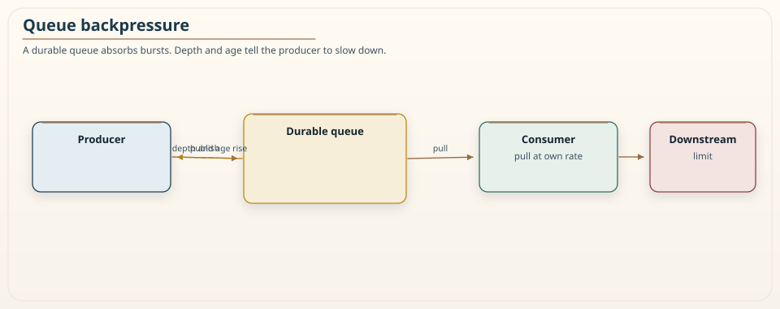
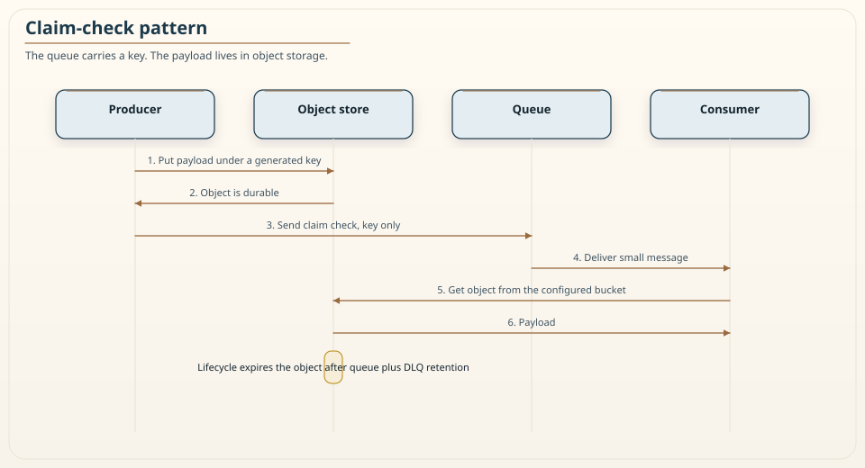

---
title: "Asynchronous Messaging Patterns"
chapter: 10
author: "Viquar Khan"
date: "2026-01-15"
lastUpdated: "2026-09-06"
tags:
  - microservices
  - messaging
  - sqs
  - idempotency
difficulty: "expert"
readingTime: "50 minutes"
---

# Chapter 10: Asynchronous Messaging Patterns

<div class="chapter-header">
  <h2 class="chapter-subtitle">Publish What Happened. Do Not Wait.</h2>
  <div class="chapter-meta">
    <span class="reading-time">📖 50 min read</span>
    <span class="difficulty">🎯 Expert</span>
  </div>
</div>

> *"Synchronous calls make one service wait on another. Asynchronous messaging lets a service state what happened and move on. The first couples availability; the second decouples it. Most of the resilience you gain from microservices, you gain here."*

Chapter 1 established that chatty synchronous call chains destroy availability, because a request that must wait on a deep chain of services is only as available as the product of every link. Asynchronous messaging is the primary escape from that trap. Instead of the order service calling the inventory service and waiting for a reply, the order service publishes an event, "an order was placed," and continues. The inventory service reacts to that event on its own schedule. Neither service waits on the other, and if the inventory service is briefly down, the event waits in a durable buffer rather than failing the whole request. This temporal decoupling is where much of the resilience of a well-built microservices system actually comes from.

That resilience is not free, and this chapter is about the specific engineering required to earn it. Asynchronous messaging trades the immediate, transactional certainty of an in-process call for a set of new realities: work arrives faster than a consumer can handle it, some messages can never be processed, and the same message will occasionally be delivered more than once. Ignore any of these and the system does not merely slow down, it fails in ways that are hard to diagnose and easy to make worse. A single slow downstream query can back up a queue until it exhausts memory upstream, one malformed message can spin in an infinite retry loop that starves everything behind it, and one duplicate delivery can charge a customer twice.

Chapter 6 already covered how an event gets onto the bus without a dual write, and the resilience toolkit that keeps a service standing when a dependency wobbles: timeouts, retries, breakers, dead-letter queues, backpressure as a general idea. I will not rebuild that toolkit here. This chapter is the consumer side of a durable queue: how you keep a fast producer from destroying a slow dependency, how you isolate a message that will never succeed, how you stay correct when the broker keeps its only honest promise, at-least-once, and how you keep a large blob out of a system built for small signals.

Three disciplines address the first three realities, and they organize this chapter: backpressure for flow control, poison-message handling for error isolation, and idempotency for correctness under duplicate delivery. The chapter closes with the claim check pattern for moving large payloads without clogging the messaging system. The examples use Amazon SQS and AWS Lambda because they make the mechanics concrete, but the patterns are general and apply to any durable queue or log-based broker.

## 10.1 Backpressure: controlling the flow

Backpressure is the mechanism by which an overwhelmed consumer signals upstream that it cannot accept more work right now. The term comes from fluid dynamics, where it names the resistance opposing flow through a pipe. In distributed systems it is the difference between a system that degrades gracefully under overload and one that collapses. Without backpressure, a producer that outpaces its consumer keeps pushing work until something runs out of memory, and the failure cascades.

Chapter 6 drew the general picture: a bounded buffer plus a signal back to the producer. On a queue, that buffer is the queue itself, and the signal is often implicit. The consumer simply stops taking work.


*Figure 10.1: Backpressure as flow control between a fast producer and a slower consumer. Work flows left to right from the producer toward the consumer. When the consumer cannot keep up, the excess does not pile up in the consumer's memory and crash it; instead it accumulates in a durable queue that sits between the two and is built to hold a backlog. The consumer pulls from that queue only as fast as it can actually process, and the queue depth and the age of the oldest message become visible signals of pressure. In a pull-based system the queue itself provides the backpressure, since the consumer simply polls more slowly. The alternative, a producer that pushes regardless of whether the consumer can cope, has no such shock absorber, and the pressure has nowhere to go but into a crash.*

### 10.1.1 Push versus pull

How backpressure is handled depends fundamentally on whether the messaging model pushes work to consumers or lets consumers pull it.

In a **push** model, the broker or producer dictates the rate. The consumer is passive and receives whatever arrives. Amazon SNS, EventBridge targets, and many webhook fans are push. When an upstream service scales out to handle a traffic spike, it floods the downstream consumers. If those consumers are backed by a limited resource, a relational database with a bounded connection pool, or a third-party API with rate limits, they fail, and the broker's retries pile more load onto an already failing system, producing a thundering herd. Backpressure in a push model is possible but awkward: you throttle at the target, shed load, or put a queue in front of the thing you were pushing to, which is how many "push" designs become pull designs after the first incident.

In a **pull** model, the consumer dictates the rate. It polls for work only when it has the capacity to process more. SQS and Kafka consumers are pull. If the consumer is overwhelmed or crashes, it simply stops polling, and messages accumulate in the durable queue, exactly as Figure 10.1 shows. The queue stores the pressure in a place designed to hold it rather than propagating it into the compute layer as a crash. For inter-service communication where downstream processing time varies, the pull model is the safer default, because the queue acts as a shock absorber that smooths spikes into a manageable backlog.

Managed platforms often blur the distinction. A Lambda event-source mapping for SQS is a poller fleet that *pulls* from the queue and then *invokes* your function. You did not write a poll loop, but you also did not get pull semantics for free. The platform's instinct is to drain the queue. Your job is to cap that instinct before it reaches the database.

Kafka is pull and still fails this way. A consumer group that scales to two hundred pods, each opening a connection pool, is a pull model with no backpressure at the dependency. Pull decides who asks for work. It does not decide how many askers you create.

### 10.1.2 Constraining consumer scaling

AWS Lambda, for example, scales concurrent invocations up toward the queue depth and the account concurrency limit. This is convenient but hides a hazard: draining fast can destroy a downstream dependency. If the function opens a database connection and the database allows fifty connections, but the poller scales the function to five hundred concurrent instances, the database falls over.

Applying backpressure here means deliberately capping that scaling to match the weakest downstream dependency.

**Reserved concurrency** guarantees a function never runs more than a set number of instances. It is a hard ceiling, and it applies to the whole function across all its triggers. It also subtracts from the account's unreserved pool, so a reserved ceiling of 200 is 200 other functions cannot use. Reserved concurrency of zero is how you disable a function on purpose. Do not set it by accident.

**Maximum concurrency at the event-source level** limits how many instances process records from a specific queue, without capping the function's scalability for other triggers. This is the more precise valve, because it matches the consumer's throughput to the capacity of the dependency behind it without side effects elsewhere.

When the cap is reached, backpressure is realized as intended: messages stay in the queue, the age of the oldest message rises, and the system stays stable. This is a deliberate trade, accepting higher latency in exchange for not overwhelming a dependency, and it is almost always the right trade.

There is a sharp edge the platform will not advertise. A throttled Lambda invocation, reserved concurrency exhausted, is a failed receive from SQS's point of view. The receive count still goes up. Set the ceiling too tight relative to arrival rate and `maxReceiveCount`, and healthy messages land in the dead-letter queue because they were throttled, not because they were poison. Size the cap for the dependency, size the redrive for poison, and do not let one number do the other job.

### 10.1.3 The visibility timeout and the duplicate-work trap

A frequently misconfigured setting in a pull-based queue is the visibility timeout: the period during which a message, once picked up by one consumer, is hidden from others. It is the queue's estimate of how long processing should take. Set it wrong and you get a specific, damaging failure.

If the visibility timeout is shorter than the actual processing time, the following happens. A worker picks up a message and begins a long task. The timeout expires while the worker is still working, so the queue assumes the worker died and makes the message visible again. A second worker picks up the same message and starts the same work. Now two workers are processing one message, wasting effort and, if the work is not idempotent, causing real damage such as a double charge. This duplicate-work loop is entirely preventable by sizing the timeout correctly.

The safe rule is to set the visibility timeout well above the consumer's maximum processing time, with generous margin for retries and jitter. A common heuristic for Lambda consumers, and the one AWS documents, is to set the visibility timeout to at least six times the function timeout, plus any batch window, so that the platform's internal retries and normal variance never push real processing past the point where the message reappears. The exact multiple matters less than the principle: the message must stay invisible for as long as it could plausibly still be under legitimate processing.

The other direction is a cost too. Set the timeout far above any real run and a worker that dies holds the message invisible until the clock runs out. Users wait. Heartbeat, `ChangeMessageVisibility` on a long job, so a live worker extends the hide and a dead one does not.

Correct timeout does not give you exactly-once delivery. SQS Standard will still deliver a message twice on a network partition. SQS FIFO's "exactly-once processing" is send-side deduplication for a five-minute window, not a promise that your consumer runs once. Chapter 5 already said this. Visibility timeout stops a *preventable* class of duplicates. Idempotency, Section 10.3, handles the rest.

### 10.1.4 Metrics that reveal flow health

Managing backpressure requires watching the right signals, and invocation count alone is not one of them. The metrics that actually reveal whether flow is healthy describe the queue and the consumer's relationship to it.

**Age of the oldest message.** If this grows steadily while incoming throughput is constant, the consumer is under-provisioned relative to the load, and the backlog is deepening. Age catches the single stuck message that depth hides, especially on a FIFO group.

**Number of visible messages.** A rising count signals a burst of production; a sustained plateau often means a concurrency cap has been reached and backpressure is holding.

**Number of in-flight messages.** This should track the concurrency setting. If it drops to zero while visible messages remain, the poller or consumer may be unhealthy.

**Concurrent consumer instances.** This must stay below the capacity of the narrowest downstream dependency, which is the whole point of the caps in Section 10.1.2.

Watching these turns flow management from reactive firefighting into something you can reason about in advance. A backlog that is growing tells you to add consumer capacity or accept higher latency. A backlog held flat at a concurrency cap tells you backpressure is doing its job. A backlog that is growing while concurrency is under the cap tells you the consumer is sick, not merely paced.

## 10.2 Poison messages and the dead-letter queue

A poison message is one that cannot be processed successfully no matter how many times it is retried. The cause might be malformed content, a schema mismatch such as a string where an integer is expected, or a logical impossibility such as a transaction referencing a record that no longer exists. Whatever the cause, the message will fail every time, and if the system keeps retrying it, the consequences are severe.

Without a mechanism to set poison messages aside, they trigger an infinite retry loop. The consumer picks up the message, fails, returns it to the queue, and immediately picks it up again. This burns compute, floods the logs with the same error, and on a FIFO queue blocks every message *in that message group* behind it. A single bad message becomes a self-inflicted denial of service for one tenant, or for the whole ordered stream if you used one group. Standard queues do not block neighbors; they just waste money on the same failure. The defense is to detect messages that repeatedly fail and move them out of the main flow into a separate holding queue, conventionally called a dead-letter queue.

On a log-based stream, Kinesis or DynamoDB Streams, the poison problem is worse: a bad record blocks the shard. Chapter 4 already required bisect-on-error and an on-failure destination for that shape. This section is the queue shape.

### 10.2.1 The redrive policy and retry count

The primary control is a redrive policy on the source queue, which specifies how many delivery attempts a message may fail before it is moved to the dead-letter queue. That threshold, the maximum receive count, is a balance.

Too low, such as one, risks moving valid messages to the dead-letter queue on the first transient hiccup, a network blip or a cold-start timeout, forcing manual recovery of messages that would have succeeded on a second try. Combined with a tight concurrency cap, one is how you DLQ a traffic spike.

Too high, such as one hundred, wastes resources grinding on a message that was never going to succeed, delaying the alert that something is wrong.

A small number, typically three to five, absorbs transient failures while still failing fast on genuine poison messages. Five is a common choice for Lambda consumers, leaving room for the platform's own internal retries before the message is set aside. Give the dead-letter queue a retention at least as long as the source, often the full fourteen days, so a message you have not investigated yet does not expire out of the only place you still have it.

The dead-letter queue is not a graveyard. It is an inbox for messages that need attention, and reaching it should raise an alert. Chapter 6 said a DLQ nobody pages on is a silent trash can. That is still true.

### 10.2.2 Partial batch failures

Consumers often read messages in batches for efficiency, and batching introduces a trap. If a function reads ten messages, processes nine successfully, and fails on the tenth, the naive behavior is to mark the entire batch as failed. All ten become visible again and are retried, which means the nine that succeeded are reprocessed. For non-idempotent work, that reprocessing is exactly the double effect you are trying to avoid.

The fix is to report failures at the level of individual messages rather than the whole batch. The consumer catches errors per message, finishes the rest of the batch, and returns a list identifying only the messages that failed. The platform then deletes the successful messages and retries only the reported failures. This keeps one bad message in a batch from dragging its healthy neighbors into repeated reprocessing.

```json
{
  "batchItemFailures": [
    { "itemIdentifier": "message-id-1" },
    { "itemIdentifier": "message-id-3" }
  ]
}
```

The response above tells the platform that only messages one and three failed; everything else in the batch is deleted and never retried. `itemIdentifier` must be the SQS `messageId`. Returning that JSON is not enough: the event-source mapping must have `ReportBatchItemFailures` enabled, or Lambda treats any function success as "the whole batch succeeded" and the JSON is ignored. If the handler throws, the whole batch fails, which is what you want for a crash and not what you want for one bad record.

A batch must also finish inside the function timeout. Ten records that each need four seconds will not fit in a thirty-second timeout, and the ones that did not start look like failures. Size batch, timeout, and visibility together, or you will invent poison.

### Recipe 10.1: Report per-record failures, not the whole batch

**Context.** An SQS-triggered function processes a batch. One record is malformed. The mapping has `function_response_types = ["ReportBatchItemFailures"]`. The handler must not throw for that one record.

**Solution.** Use the same Powertools helper Chapter 4 used on Kinesis. Iterate records, raise per poison item, return `batchItemFailures` for those items only.

```python
from aws_lambda_powertools.utilities.batch import (
    BatchProcessor,
    EventType,
    process_partial_response,
)
from aws_lambda_powertools.utilities.data_classes.sqs_event import SQSRecord

processor = BatchProcessor(event_type=EventType.SQS)


def record_handler(record: SQSRecord):
    """
    Process one record. Any exception raised here is caught by the
    batch processor and reported as a failure for this record only.
    """
    payload = record.json_body
    if not is_valid(payload):
        raise ValueError(f"invalid payload in message {record.message_id}")
    process_order(payload)  # idempotent, see Section 10.3


def lambda_handler(event, context):
    return process_partial_response(
        event=event,
        record_handler=record_handler,
        processor=processor,
        context=context,
    )
```

Do not log the raw body if it can hold personal data. Log the `message_id` and a reason code. Chapter 8's hygiene rule applies on the hot path of every retry.

### 10.2.3 Working the dead-letter queue

A message arriving in the dead-letter queue is a request for intervention, not the end of its story, and the operational loop around it should be deliberate.

**Alert.** An alarm watches the dead-letter queue and pages the owning team when its depth rises above zero, because a nonempty dead-letter queue means something is failing that automated retries could not fix. Age matters here too: a queue you redrive once a week still needs a page on first arrival.

**Investigate.** Engineers inspect the message to determine the cause: a code defect, a schema change, an upstream data problem, a dependency that was temporarily unavailable, or a concurrency cap that incremented receive count on healthy work.

**Resolve.** Fix the defect and deploy, or confirm the underlying transient condition has cleared. Do not redrive into a consumer you have not fixed.

**Redrive.** Move the messages from the dead-letter queue back to the source queue using the queue's native redrive, `StartMessageMoveTask` on SQS, rather than a custom replay script that drops attributes or the claim-check key.

**Purge.** If the messages are genuinely invalid and can never succeed, discard them to clear the alert, having captured whatever they reveal about the defect that produced them.

The dead-letter queue is where a mature system turns silent, repeating failures into visible, actionable work, which is exactly what you want: a bounded place to look when something has gone wrong, rather than an unbounded retry loop quietly consuming the system.

## 10.3 Idempotency: correctness under duplicate delivery

There is a persistent wish in distributed systems for exactly-once delivery, the guarantee that every message arrives precisely once. In a network subject to partitions and timeouts, providing it requires coordination heavy enough to destroy the throughput and availability that made asynchronous messaging attractive in the first place. The practical guarantee that scalable systems actually offer is at-least-once delivery: a message will be delivered, and sometimes it will be delivered more than once.

The reason duplicates are unavoidable is concrete. A consumer processes a message successfully but crashes, or its network call to acknowledge completion times out, before it can tell the queue the message is done. The queue, having received no acknowledgment, reasonably assumes the work did not happen and redelivers the message. If the consumer charged a card the first time and is not built to recognize the repeat, it charges the card again. Duplicate delivery is not an exotic edge case; it is normal operation, and the system must be correct in its presence.

The property that makes a system correct under duplicate delivery is idempotency: an operation is idempotent if performing it more than once has the same effect as performing it once. Building idempotent consumers is not optional in an at-least-once world. It is the price of admission. Chapter 9's Recipe 9.1 is the test for this section: deliver the event twice and assert the effect happened once.

### 10.3.1 Naturally idempotent operations

Some operations are idempotent by their nature and require no special handling. Setting a value is idempotent: assigning an order's status to "shipped" produces the same result whether it happens once or fifty times. Incrementing a value is not: adding one hundred to an account balance twice produces a different result than doing it once. Where you can express business logic as setting a value rather than adjusting one, you get idempotency for free, and it is worth designing operations that way when the domain allows.

### 10.3.2 Do not mark the message processed and then do the work

When an operation is not naturally idempotent, the most robust technique is to record that a given message has been processed and to make that record atomic with the side effect, so that a duplicate is detected before the operation runs again.

The version of this that looks clean in a blog post is the one that fails in a crash window:

```python
# Wrong: claimed PROCESSED before the charge. A crash here loses the charge
# and a retry will skip it.
table.put_item(
    Item={"PK": f"MSG#{message_id}", "Status": "PROCESSED"},
    ConditionExpression="attribute_not_exists(PK)",
)
charge_card(order)  # never reached if we died after the put
```

Chapter 5 already named this bug. The sample that writes the id and then ships is how you lose an order. Put the reservation of the id and the business write in one local transaction when both live in the same store. When the side effect is an external call, a payment gateway, a carrier, you cannot put that call inside `TransactWriteItems`. Write `IN_PROGRESS`, call the gateway with the same idempotency key the gateway accepts, then mark `COMPLETED`. A retry that sees `IN_PROGRESS` must ask the gateway what happened, not blindly charge again, and not blindly skip.

```python
try:
    table.put_item(
        Item={
            "PK": f"MSG#{message_id}",
            "Status": "IN_PROGRESS",
            "ExpiresAt": expires_at,
        },
        ConditionExpression="attribute_not_exists(PK)",
    )
except ClientError as exc:
    if exc.response["Error"]["Code"] != "ConditionalCheckFailedException":
        raise
    existing = table.get_item(Key={"PK": f"MSG#{message_id}"})["Item"]
    if existing["Status"] == "COMPLETED":
        return existing.get("Result")
    # IN_PROGRESS: another worker, or we crashed. Ask the gateway, or wait.
    return recover_in_progress(message_id, existing)

result = charge_card(order, idempotency_key=message_id)
table.update_item(
    Key={"PK": f"MSG#{message_id}"},
    UpdateExpression="SET #s = :c, Result = :r",
    ExpressionAttributeNames={"#s": "Status"},
    ExpressionAttributeValues={":c": "COMPLETED", ":r": result},
)
```

Two duplicate deliveries racing at the same instant cannot both pass `attribute_not_exists`. The loser recovers through the stored state. DynamoDB TTL will eventually delete the row; it is not a lock expiry you can set in minutes and trust. Check `ExpiresAt` in the application if a stale `IN_PROGRESS` must become retryable on a deadline. Powertools' idempotency utility from Chapter 4 is the library form of this state machine, and the edge cases around expiration and races are why I would rather you use it than invent a fourth variant of the lock.

The producer must send a stable identifier. A consumer that hashes a body the producer regenerates on every retry will treat the same business event as new work. Use the `event_id` the outbox wrote in Chapter 6, or the SQS `MessageDeduplicationId` you set on send, not a fresh UUID the consumer mints on each receive.

## 10.4 The claim check pattern for large payloads

Messaging systems are optimized for high throughput of small messages, and they enforce a maximum message size to keep it that way. Amazon SQS, for example, caps a message at 256 KB. Many payloads exceed whatever the broker's limit is: high-resolution images, large export files, comprehensive audit records. Even when a payload fits, pushing large blobs through the messaging system is a poor use of it, because large messages serialize slowly, reduce throughput measured in messages per second, and cost more, since brokers commonly bill in fixed-size chunks so a large message consumes many billing units.

The claim check pattern solves this by not sending the payload through the messaging system at all. The producer stores the large payload in a store built for large objects, such as Amazon S3, and sends only a small reference, the claim check, through the queue. The consumer receives the reference, retrieves the payload from the object store, processes it, and the payload is cleaned up afterward by a retention policy, not by a delete on the success path. The name comes from a coat check: you hand over the heavy coat and carry only the lightweight ticket.


*Figure 10.2: The claim check pattern moving a large payload out of the messaging path. On the left, the producer writes the heavy payload to an object store first, waits until that write is durable, and then places only a small message on the queue containing a reference to where the payload lives. The queue carries just that lightweight pointer, so the messaging system stays fast and cheap regardless of how large the actual data is. On the right, the consumer receives the pointer and fetches the full payload from a bucket the consumer already trusts, not from a bucket name the message supplied. The heavy data takes the path built for heavy data. The messaging system carries only the small coordination message it is optimized for. Cleanup is a lifecycle rule on the object, not a delete in the handler, so a redelivered message can still find its payload.*

### 10.4.1 The three phases

The pattern has three phases, and the third is the one naive implementations forget.

**Check in (producer).** Generate a unique key, upload the payload to the object store under that key, *then* send a small message containing the key. The order is not optional. A message that leaves before the object exists is a 404 on the first delivery. S3 has been strongly consistent on overwrite and read-after-write since 2020, so if the put returned success, the get will see the object. The remaining race is producer ordering, not an eventual-consistency ghost.

**Process (consumer).** Read the message, extract the key, download the payload from the bucket you configured, and run the business logic. Do not take the bucket name from the message. A queue that accepts a body with `"bucket": "someone-elses-data"` is a confused deputy, the same class of bug Chapter 7 warned about.

**Check out (cleanup).** Do not delete the payload when the handler returns. If the consumer processes the payload and deletes it, then fails to acknowledge the message, the retry fetches a key that no longer exists and a transient timeout becomes permanent data loss. Expire objects automatically after a retention window *longer than* the source queue retention plus the dead-letter queue retention plus any delay before someone redrives. SQS keeps messages for up to fourteen days. A seven-day lifecycle on the object and a fourteen-day DLQ is how redrive fails with `NoSuchKey`. The storage cost of keeping the blob until the message cannot possibly come back is trivial compared with debugging a missing payload.

The AWS SQS Extended Client implements this pattern for you, including the reserved message attribute that marks an offloaded body. Use it if you are already on that stack. The rules above still apply to whatever library writes the object.

### Recipe 10.2: Put the object first, trust your own bucket, do not delete on success

```python
import json
import os
import uuid

import boto3

s3 = boto3.client("s3")
sqs = boto3.client("sqs")
BUCKET = os.environ["CLAIM_CHECK_BUCKET"]
QUEUE_URL = os.environ["QUEUE_URL"]
THRESHOLD = 200 * 1024  # leave room for attributes under the 256 KB cap


def send(payload: dict):
    body = json.dumps(payload)
    if len(body.encode("utf-8")) > THRESHOLD:
        key = f"payloads/{uuid.uuid4()}.json"
        s3.put_object(Bucket=BUCKET, Key=key, Body=body)
        message = {"__type": "CLAIM_CHECK", "key": key}
    else:
        message = payload
    sqs.send_message(QueueUrl=QUEUE_URL, MessageBody=json.dumps(message))


def handler(event, context):
    for record in event["Records"]:
        body = json.loads(record["body"])
        if body.get("__type") == "CLAIM_CHECK":
            obj = s3.get_object(Bucket=BUCKET, Key=body["key"])
            payload = json.loads(obj["Body"].read())
        else:
            payload = body
        process_order(payload)
```

Treat `NoSuchKey` as transient on the first few receives, the object may not have been visible if you ever invert the producer steps, or the put may still be in flight from a retrying producer. Raise so the message is retried. After `maxReceiveCount`, a still-missing object is genuinely lost and belongs on the dead-letter queue. Distinguishing "not there yet" from "never going to be there" keeps a producer bug you can fix from being mistaken for a poison schema.

```hcl
resource "aws_s3_bucket_lifecycle_configuration" "cleanup" {
  bucket = aws_s3_bucket.claim_check.id
  rule {
    id     = "expire-temp-payloads"
    status = "Enabled"
    filter { prefix = "payloads/" }
    # Longer than source plus DLQ retention. Fourteen-day queues need more
    # than seven days here.
    expiration { days = 21 }
  }
}
```

## 10.5 Conclusion

Asynchronous messaging is where microservices earn most of their resilience, because it is where services stop waiting on one another. A service that publishes an event and moves on is not coupled to the availability of whatever reacts to that event, and a system built this way degrades under stress instead of collapsing. But that resilience is a property you engineer, not one you get for free by putting a queue between two services. The outbox in Chapter 6 is how the event gets onto the bus without a dual write. This chapter is how the bus does not become the most fragile part of the architecture once it is there.

Three disciplines make asynchronous messaging trustworthy. Backpressure keeps a fast producer from overwhelming a slow consumer, and the pull model plus deliberate concurrency caps turn a durable queue into a shock absorber that stores pressure safely rather than propagating it as a crash. Size those caps for the dependency, and remember that a throttle increments receive count. Poison-message handling isolates the messages that can never succeed, using a bounded retry count, per-record batch failure, and a dead-letter queue so that one bad message becomes a visible piece of work rather than an infinite loop that starves a FIFO group. Idempotency makes consumers correct under the at-least-once delivery that scalable systems actually provide. Do not mark a message processed and then do the work. The claim check pattern completes the picture by keeping large payloads out of the messaging path entirely: object first, configured bucket, lifecycle longer than the DLQ.

The connecting thread is that each discipline names a specific way asynchronous messaging fails and engineers around it deliberately. Skip backpressure and the system crashes under load. Skip poison handling and one message can take the consumer down. Skip idempotency and duplicates corrupt state. These are not optional refinements; they are the difference between a queue that decouples services and a queue that quietly becomes the most fragile part of the architecture. The next chapter turns to the granularity pattern at the heart of this book, and to how you decide, quantitatively, whether a service boundary is earning its keep or merely adding the network cost that all of these patterns exist to manage.

---

**Navigation:**
- [Previous: Chapter 9](09-testing-strategies.md)
- [Next: Chapter 11](11-khan-pattern-deep-dive.md)
