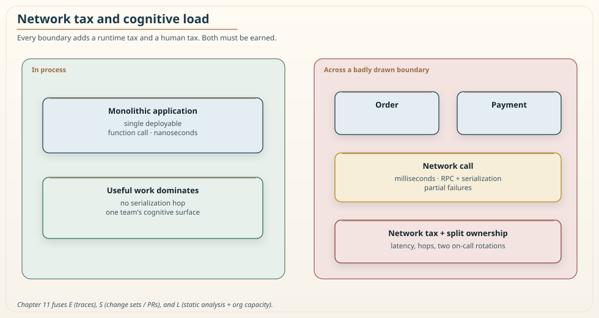
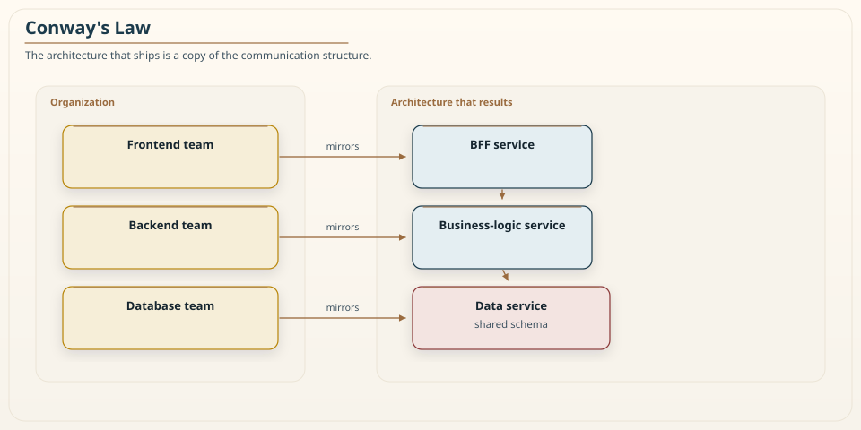
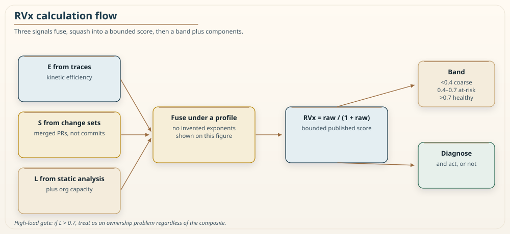
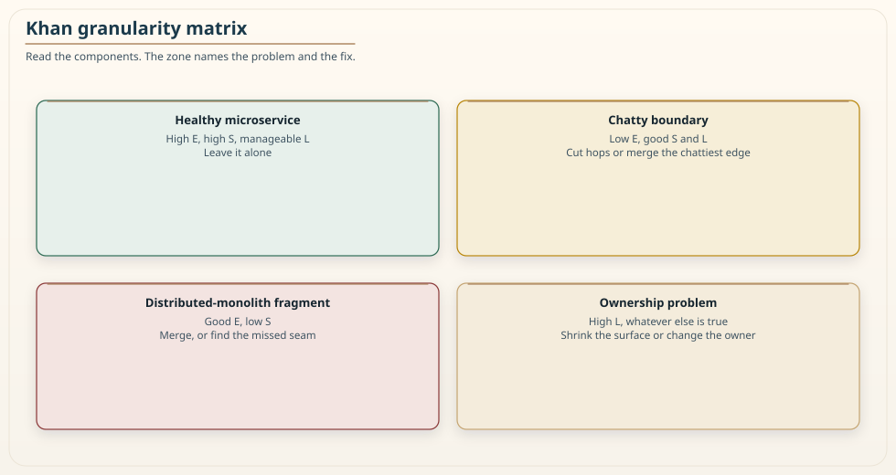
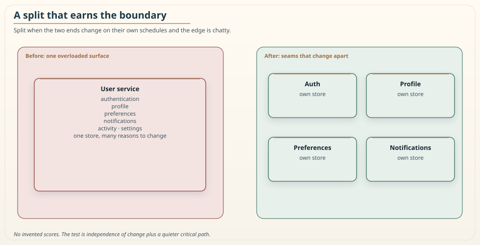
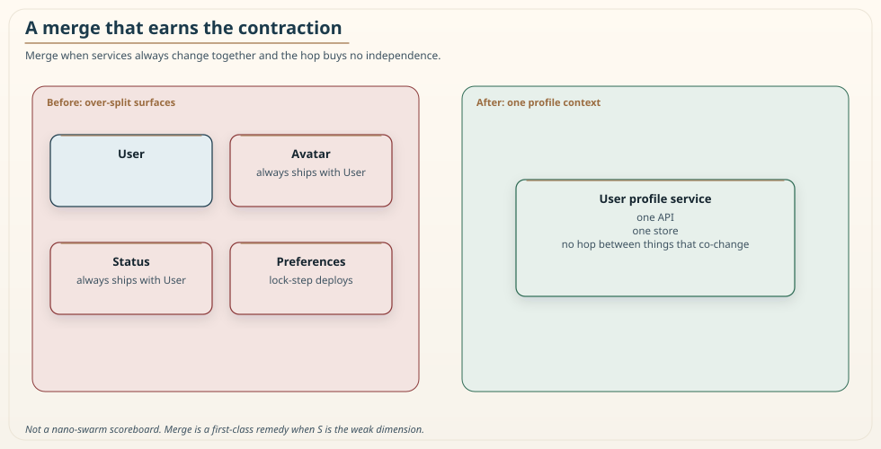
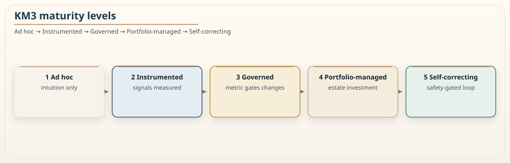

# Chapter 11: Adaptive Granularity Governance: The Khan Microservice Pattern

<div class="chapter-header">
  <h2 class="chapter-subtitle">A Boundary Earns Its Keep Only When All Three Hold</h2>
  <div class="chapter-meta">
    <span class="reading-time">📖 70 min read</span>
    <span class="difficulty">🎯 Expert</span>
  </div>
</div>

This chapter presents Fulcrum, a way to measure and govern the granularity of a microservice boundary, and the RVx Index, the score at its centre. The material here is the practitioner treatment of a research paper I have been developing openly since 2017 in this field guide. Earlier chapters pointed here on purpose and did not restate the formula. This is the one place it is defined.

I have tried to keep two promises throughout. First, I say plainly what is proven, what is demonstrated in controlled conditions, and what is still a hypothesis with a test attached. Second, I do not sell the method as a cure. It measures one property, boundary granularity, and it measures it well enough to argue with numbers instead of opinions. It does not measure resilience, security, or correctness, and it is not a substitute for judgement. Chapter 7 said security is not an RVx signal. That still holds.

If you read only this paragraph, take away the one idea the whole chapter rests on. A separately deployed service earns its distributed cost only when it is efficient at runtime, independent in how it changes, and small enough for its owning team to hold in their heads, all at the same time. When one of those three fails, distribution stops buying you anything and starts charging rent. That failure has a name, the distributed monolith, and until now we have mostly detected it by suffering through it. The point of this chapter is to detect it with a measurement, before it ships.

## 11.1 Why granularity needs governance

Most teams decide service boundaries with heuristics. One service per database table. A service small enough to rewrite in two weeks. One service per team. These rules are easy to teach and easy to follow, and that is exactly the problem. They say nothing about the runtime cost of a boundary, nothing about whether two services actually change together, and nothing about whether the team that owns the result can carry it. A rule that ignores the thing that decides success is not guidance, it is a coin flip with extra steps.

The result is granularity that drifts. One team splits aggressively and ends up with forty services that cannot deploy independently because they all change together. Another keeps a large service that runs well and is easy to own, and gets told in review that it is not a real microservice because it is too big. Neither team has a number to point at, so the argument is settled by whoever is most senior in the room. That is how a codebase ends up with boundaries that reflect meeting-room politics rather than system behaviour.

I want to be honest about the scenario I use to motivate this, because honesty about evidence is the spine of the whole method. The migration story that follows is a composite, drawn from patterns I have seen repeatedly across teams and from the published literature on microservice smells. It is illustrative. I am not going to quote a dollar figure from a specific outage or name a company, because I cannot verify such a number to the standard this method demands of everything else. The pattern is real and common. The precise casualty figures you often see attached to these stories are usually invented, and I would rather teach the pattern than dramatise it.

The pattern goes like this. A team decomposes a working monolith along module lines. Every in-process call that used to be a function invocation becomes a network call. Latency climbs because remote calls are slower and their tail latencies compound. Reliability drops because every synchronous hop can time out, and a slow dependency exhausts thread pools and cascades. That is the availability arithmetic of Chapter 1, now paid on every request. Worst of all, the services still change together, because the split followed folder structure rather than the seams of the domain that Chapter 3 taught you to find, so every feature now touches several repositories and several pipelines. The team has paid the full distribution tax and received none of the independence it was promised. On a dashboard the architecture can look clean. In production it behaves like a monolith that someone put a network in the middle of.

This is the failure Fulcrum is built to catch early, and the rest of the chapter is the working out of how.

## 11.2 The granularity paradox

The granularity paradox is the observation that decomposition, undertaken to reduce complexity, often increases it. A team splits a system to make it simpler to change and operate, and ends up with something harder to change and operate than what they started with. This is not a rare accident. It is the default outcome when the split is decided without measuring the three things that actually govern whether a boundary pays for itself.


*Figure 11.1: Granularity is a spectrum. Too coarse and you have a monolith. Too fine and you have a distributed monolith. The value lives in a band that shifts with the workload, the team, and the domain, which is why a single fixed rule cannot find it.*

### 11.2.1 Anatomy of a distributed monolith

Consider a request that in a monolith runs as a chain of in-process calls between three modules. Split the modules into services along the same chain and the in-process calls become synchronous remote calls. Three costs appear at once.

Latency accumulates, because a remote call is slower than a function call, and because the tail latencies of several hops compound rather than average. Reliability degrades, because each synchronous edge can fail or time out, and a slow dependency can exhaust connection pools and cascade through the system. Autonomy is lost, because the services still change together, so a single feature touches several repositories and several deployment pipelines. The team pays the distribution tax on every request and never collects the independence that was supposed to justify it.


*Figure 11.2: Every boundary you cross adds a network tax at runtime and a cognitive tax on the people who own both sides. A boundary is only worth drawing when the value it creates exceeds both taxes.*

### 11.2.2 Why single-layer analysis misses it

A purely structural analysis can pass this design. The dependency graph may look acyclic and the cohesion metrics may look acceptable, because structure does not capture how often an edge is traversed at runtime or how often two services change together. A purely runtime analysis can also mislead, since a boundary may show low latency under light load yet still be a maintenance trap because the two services always change together. A purely organizational view can approve a boundary that matches team structure while ignoring that it triples tail latency.

The paradox lives in the interaction of three layers: runtime behaviour, evolutionary history, and human ownership. No single-layer tool can see it, because each layer sees only one term of an inequality whose sign depends on all three. That is the core argument for fusing three signals into one score rather than tracking them separately on three dashboards nobody reads together.

## 11.3 Khan's Law of Service Granularity

I state the governing principle as a law so it can be cited and argued with directly.

**Khan's Law of Service Granularity.** A separately deployed service boundary is worth its distributed cost only when it is efficient, evolutionarily independent, and cognitively ownable at the same time. Because these three combine as a weakest link and not as an average, distribution multiplies value where all three hold, and multiplies cost, producing a distributed monolith, wherever any one of them fails. In short, a boundary is only as valuable as its weakest dimension.

The weakest-link framing is the important part. An average would let one strong dimension hide a catastrophic one, which is precisely the error that produces distributed monoliths that look fine on paper. A boundary that is beautifully efficient and cleanly independent but owned by a team that cannot carry it is not a good boundary. A boundary that is independent and ownable but chatty enough to triple tail latency is not a good boundary either. The score has to collapse when any single dimension collapses, not soften politely.

One honest caveat keeps the law from overpromising, and I state it here rather than burying it. The score enforces the weakest-link collapse strictly for the two runtime and evolutionary signals, which are measured from traces and version history and are hard to fake. It enforces it more gently for the cognitive-load signal, which is the softest of the three and the easiest to game, because letting the least trustworthy signal single-handedly veto a demonstrably efficient and independent boundary would place the heaviest consequence on the weakest evidence. For that third dimension the collapse is enforced operationally, by a high-load gate in the governance loop, rather than by the arithmetic of the score. I will return to this asymmetry when I define the formula, because a careful reader deserves to see exactly where the slogan and the mathematics agree and where they are reconciled by process.

## 11.4 The three signals

RVx fuses three signals that are usually analysed in isolation. Each is normalized to the unit interval and each is measured from data teams already produce. I give the operational definition, how to measure it, and the honest limits of each, because a signal used without knowing its limits does more harm than no signal at all.

### 11.4.1 Kinetic Efficiency (E)

Kinetic Efficiency is the fraction of a transaction's time spent doing the service's own useful work, as opposed to the time spent paying the tax of crossing the boundary.

```
E = t_useful / t_total,   0 ≤ E ≤ 1
```

Here `t_useful` is the time spent on the service's own domain computation for a representative transaction, and `t_total` is the end-to-end time for that transaction including network transmission, serialization, deserialization, and waiting on remote dependencies. E approaches 1 when the boundary adds little overhead and approaches 0 when the request is dominated by the cost of crossing the boundary.

You measure E from distributed traces, using the model that OpenTelemetry and similar systems already give you. Chapter 8 is the operating chapter for that pipeline. Two measurement details matter. Credit overlapped local computation to useful time so that a highly concurrent service is not unfairly penalised: take the union of local intervals on the critical path, not the sum of span durations that ran in parallel. Measure total time on the critical path, the wall-clock duration of the root span. This handles asynchronous designs correctly. In a fire-and-forget or publish-subscribe interaction the caller does not wait on the remote work, so the critical-path total time tracks the useful time and E stays high. That is the right answer, because a truly asynchronous boundary avoids the synchronous coupling tax. Any remaining risk in such a boundary is then a question for the other two signals, not for E.

The honest limits of E are workload representativeness and attribution. E is only as meaningful as the traffic you measured it under. A boundary can look efficient on a light workload and chatty on a heavy one, so the workload used to compute E must be recorded and defended, not chosen quietly by the team being scored. Tail-biased sampling, the kind Chapter 8 recommended for debugging, will make E look worse than a representative sample. Reweight, or score from a declared representative window, do not silently use the error-and-slow bucket. And auto-instrumentation will show you hop times. It will not, by itself, split a span into "useful compute" versus "serialization plus wait" with the cleanliness the formula wants. You have to define those span attributes and keep them honest. Chapter 8 already warned that the SDK does not owe you that split.

### 11.4.2 Semantic Distinctness (S)

Semantic Distinctness measures whether a service actually evolves on its own, or whether it always changes in lockstep with its neighbours. It is the inverse of the co-change fraction across the boundary.

```
S = 1 - co_change,   0 ≤ S ≤ 1
```

The co-change fraction is the share of change sets that modify both the service and at least one other service across the boundary, over a trailing window. S approaches 1 when the service evolves independently and approaches 0 when it always ships together with its neighbours, which is the signature of hidden coupling. You measure S from version history. Chapter 1's Recipe 1.1 is the manual form of this signal. Here it becomes continuous, and it is aggregated at the unit of intent.


*Figure 11.3: Temporal coupling is invisible in the dependency graph but obvious in the commit history. Two services that always change together are one service wearing two names.*

Two measurement rules keep S honest. Define a change set at the unit of intent, a merged pull request or a linked work item, not a raw commit, so that mechanical commits and squashing do not distort the signal. Exclude bot-only changes, Dependabot and the like, or a weekend of dependency bumps will look like a distributed monolith. Attribute shared code to every service that depends on it through an explicit, versioned map, rather than silently assigning it to one.

The honest limit of S is real and worth stating up front, because it decides whether the whole three-signal method applies to your codebase. In a monorepo or a shared-schema estate, repository-wide refactors and cross-cutting changes touch many services at once, which drives co-change up and S toward zero even for services that are genuinely independent. When that happens, S is floor-bound and low confidence, and the method should say so rather than pretend. In that situation RVx falls back to a two-signal instrument over efficiency and cognitive load for that estate, and it must be reported as such. Recovering a trustworthy S in these topologies, for example through semantic differencing that attributes a change to the service whose behaviour actually changed, or through contract-level co-evolution rather than file-level co-change, is an open problem I treat as future work rather than a solved step.

### 11.4.3 Cognitive Load (L)

Cognitive Load measures whether the boundary demands more than the owning team can carry. It is a clamped ratio of a static complexity aggregate to the team's normalized capacity.

```
L = clamp( complexity / capacity , 0, 1 )
```

The complexity numerator aggregates static measures such as cyclomatic complexity, module count, public surface area, and external contract size. Those are different units. A profile must declare how they are combined and scaled, not mix raw cyclomatic counts with raw file counts and hope. The capacity denominator uses team size and seniority, sourced from an organizational system of record rather than self-reported. L approaches 1 when the boundary demands more than the team can hold and approaches 0 when it is comfortably within capacity.


*Figure 11.4: Cognitive Load is where Conway's Law enters the sizing decision. A boundary the owning team cannot hold in their heads will be maintained badly no matter how clean it looks in the graph.*

I need to be precise about what this signal is and is not, because the name invites overclaiming. The precise operational name for L is Capacity-Normalized Complexity. It is an organizational-complexity proxy, not a measurement of a human psychological state. The validated instruments for perceived mental workload, such as NASA-TLX, elicit subjective ratings or physiological signals from individuals performing a task. L does none of that. It estimates a standing structural pressure on a team from artifacts the team already produces, with no survey in the loop. I keep the label Cognitive Load only for the sociotechnical intuition it operationalizes, in the Team Topologies sense, and a reader who prefers the operational name may substitute it everywhere without changing a single definition or result. Chapter 2 already warned that Dunbar's 150 is not a team-size number. Do not smuggle it into the capacity denominator. L is also the lowest-confidence and most gameable of the three signals, which is exactly why the score treats it more gently than the other two, as the next section makes precise.

## 11.5 The RVx Index

The three signals combine into one bounded score. Efficiency and distinctness sit in the numerator, so that a near-zero on either pulls the whole score down. Cognitive Load sits in the denominator, so that rising maintenance burden reduces the score without being able to zero it out on its own. Two exponents weight efficiency and load, and a small stability constant prevents division by zero.

```
RVx_raw = ( E^β × S ) / ( L^α + ε )
RVx     = RVx_raw / ( 1 + RVx_raw ),   0 < RVx < 1
```

The squash is not decoration. The raw form is unbounded above, in theory up to `1/ε`. Thresholds on an unbounded score do not mean the same thing across estates. The squash puts every published score on `(0, 1)` so that a band of 0.4 means the same kind of thing in two systems. If you implement the raw form only, say so, and do not compare those numbers to the bands in this chapter.

The default parameters are `β = 1.2`, `α = 0.8`, and `ε = 0.1`. These are informed starting points, not universal constants. Beta sits slightly above one because efficiency is the dimension most likely to fail silently in a distributed monolith. Alpha sits slightly below one so that load is a real but not dominant divisor. Epsilon caps the reward for a near-zero load so that a trivial service owned by a large team cannot float to the top of the scale. The exponents are calibrated per domain profile rather than asserted, and I am careful to claim only coarse tuning here: on realistic data only the ratio of beta to alpha is well identified, so I report a defensible range rather than pretend to a precision the data cannot support.

### Recipe 11.1: Compute the published score, not only the raw ratio

```python
def rvx(e: float, s: float, l: float, beta=1.2, alpha=0.8, epsilon=0.1) -> float:
    """Published RVx: power form, then squash onto (0, 1)."""
    raw = (e**beta * s) / (l**alpha + epsilon)
    return raw / (1.0 + raw)
```

Report `E`, `S`, `L`, `raw`, `RVx`, the profile id, and the composition form actually used. A number without those is not interpretable.

### 11.5.1 Why multiplicative, and when additive

The multiplicative numerator is a deliberate choice, not a convenience. It gives the weakest-link behaviour Khan's Law requires: a catastrophic value on efficiency or distinctness drags the whole score down, which an average would never do. This is the default composition when all three signals are trustworthy.

There is one important exception, and I found it in my own real deployment rather than in theory. When a signal is floor-bound and low confidence, the most common case being Semantic Distinctness in a monorepo, the multiplicative product lets that one degenerate factor collapse otherwise healthy scores and throw away the information the other two signals carry. In that situation the honest move is to fall back to an additive combination that is more tolerant of a single degenerate input.

So the composition is not dogma, it is a pre-committed, auditable rule. A signal is declared degenerate for an estate when its confidence annotation is below a declared floor, or when more than a declared fraction of boundaries sit below a declared floor value for that signal. If no signal is degenerate, use the multiplicative weakest-link form. If exactly one is degenerate, fall back to the additive mean over the trustworthy signals with the degenerate one down-weighted. If two or more are degenerate, do not report a composite at all, only the components, because a fused score built on one trustworthy signal is not a fused score. The thresholds are fixed in the profile before scoring and the form actually used is written to the audit log, so nobody can pick the composition after seeing the result they wanted.

### 11.5.2 The asymmetry, stated precisely

Because Cognitive Load is a bounded denominator penalty rather than a numerator factor, the weakest-link collapse is exact for efficiency and distinctness but not for load. With good efficiency and distinctness, even a fully saturated load floors the score at a value that, at the default parameters, sits just above the distributed-monolith band rather than inside it.

I will put the arithmetic on the page. At `E = 1`, `S = 1`, `L = 1`, `ε = 0.1`:

```
RVx_raw = 1 / (1 + 0.1) = 0.909
RVx     = 0.909 / 1.909 ≈ 0.476
```

That is just above an illustrative monolith band of 0.4. This margin is parameter-conditional, not a universal guarantee. At the extreme, the load exponent does not change the floor at all, since the load term equals one regardless of the exponent when load is maximal, and it is epsilon and the efficiency-distinctness operating point that set the floor. A profile that raises epsilon enough can push the floor into the monolith band. The point to keep is qualitative. Load penalises but does not, at the defaults, unilaterally collapse a strong boundary, and that gap is closed on purpose by the high-load gate in the governance loop, so an overwhelmed team is never silently passed even though the arithmetic alone would not condemn it.

### 11.5.3 Bands and a worked example

After normalization, RVx is read against three bands, calibrated per profile. As illustrative defaults, a score below 0.4 is the distributed-monolith band, 0.4 to 0.7 is the at-risk band, and above 0.7 is the healthy band. The squash makes the top band a high bar. That is intentional. A boundary that is merely "pretty good" on two signals does not clear 0.7, and I would rather the healthy band mean *clearly earning its keep* than *not obviously on fire*. Report the components alongside the composite always, because the composite alone tells you a boundary is unhealthy but not why, and the components tell you which dimension to fix.

Take a worked example, illustrative and used only to show the arithmetic. Suppose a boundary measures `E = 0.30`, `S = 0.70`, `L = 0.60`. With the default exponents:

```
0.30^1.2 × 0.70  ≈  0.165
0.60^0.8 + 0.1   ≈  0.765
RVx_raw          ≈  0.216
RVx              ≈  0.18
```

That is the low band. The diagnosis is not just a low number, it is the named cause: efficiency is the weak dimension, so the boundary is chatty, and the remedy is to reduce the number of synchronous hops or merge the two ends of the chattiest edge.

Contrast a boundary at `E = 0.85`, `S = 0.80`, `L = 0.30`:

```
0.85^1.2 × 0.80  ≈  0.658
0.30^0.8 + 0.1   ≈  0.482
RVx_raw          ≈  1.37
RVx              ≈  0.58
```

That is the at-risk band, not the healthy one. The score improved, the named cause is gone, and the boundary is still not in the clear. I am not going to pretend a mid-range reading is a celebration. A reading that does clear the illustrative healthy band, at the same defaults, looks more like `E = 0.95`, `S = 0.90`, `L = 0.15`, which squashes to about 0.73. The value of the score is that it turns a boundary review from an argument into a reading with a remedy attached.


*Figure 11.5: The RVx calculation flow. Three signals are measured from data you already have, fused into a bounded score under a per-profile calibration, and read against bands that trigger a specific, diagnostic remedy rather than a generic warning.*

## 11.6 The Khan granularity matrix

The composite tells you whether a boundary is healthy. The matrix tells you what kind of unhealthy it is, by reading the components rather than the single number. This is the view I recommend teams start with, because a diagnosis is more useful than a verdict.


*Figure 11.6: The Khan granularity matrix. Reading the three components places a boundary in a zone that names both the problem and the direction of the fix.*

Four zones cover the common cases. A boundary with high efficiency, high distinctness, and manageable load is a healthy microservice, and the action is to leave it alone. A boundary with low efficiency but good distinctness and load is chatty, and the fix is to reduce synchronous hops or merge along the chattiest edge, not to split further. A boundary with good efficiency but low distinctness is a distributed monolith fragment, two services that are really one, and the fix is to merge them or to find the true seam that was missed. A boundary with high load, whatever else is true, is an ownership problem, and the fix is organizational, either shrinking the surface or changing who owns it, backed by the high-load gate rather than by the score alone.

The matrix is also where the method earns its keep against the industry's silence on merging. The literature is full of advice on how to split and almost none on when to merge. Because RVx scores a distributed-monolith fragment as unhealthy and names distinctness as the cause, it makes merging a first-class, defensible move rather than an admission of failure.


*Figure 11.7: A split that raises the score, because it removes a chatty synchronous edge and the two ends genuinely change on their own schedules.*


*Figure 11.8: A merge that raises the score, because the two services always changed together and the boundary between them was paying a network tax for no independence in return.*

## 11.7 Fulcrum: the governance loop

The RVx Index is the instrument. Fulcrum is the procedure that turns readings into governed action. It is a closed loop with four stages: sense, decide, actuate, and verify.

**Sense** computes the three signals and the composite continuously, from traces, version history, and static analysis, and attaches a confidence annotation from data coverage. **Decide** reads the score and the component diagnosis against the calibrated bands and against the high-load gate, and chooses an action or no action. **Actuate** applies the action, and here the loop is deliberately conservative. **Verify** checks the outcome against real measures, latency, error rate, and cost, not against the score itself, and rolls back automatically if the outcome regressed.

Two forms of the loop matter in practice. The advisory form runs in a pull request and reports the score with its components and a recommendation, gating nothing automatically. This is where almost every team should start, because it makes no automated decision and its misuse risk is small. The automated form can reconfigure routing-level, reversible settings under a safety gate, a canary keyed to outcome measures, and an automatic rollback, while still routing any structural change, splitting or merging a service, to a human for execution. Structural change is never automated, at any maturity level, because its blast radius is too large to trust to a controller.

The high-load gate deserves a direct mention here, because it is how the loop closes the gap left by the score's treatment of Cognitive Load. When load crosses a declared threshold, illustratively `L > 0.7`, the gate fires regardless of the composite, so an overwhelmed team is caught by process even in the case where the arithmetic alone would floor the boundary just above the monolith band. This is the operational half of Khan's Law, and it is why the slogan holds across all three dimensions even though the formula enforces it strictly for only two.

## 11.8 The Saga Complexity Score

Boundaries decide how business transactions span services, and a boundary that splits a transaction forces the choreography-versus-orchestration choice Chapter 5 developed. The Saga Complexity Score, SCS, turns that qualitative choice into a reading. Chapter 5 pointed here and did not restate a formula. This is that formula.


*Figure 11.9: The choreography versus orchestration choice. Choreography is simpler when there are few steps and low risk. Orchestration earns its central controller when the transaction is complex, high-risk, or needs an audit trail.*

SCS combines three declared inputs. I am not going to overload `S` a second time; that letter already means Semantic Distinctness.

```
SCS = w_c · C + w_r · R + w_x · φ(X)
φ(X) = 1 - exp(-X / X₀)
```

`C` is transaction complexity: steps, branches, long waits, human approval, scored on a profile-declared ordinal scale and normalized. `R` is business risk: money, compliance, irreversibility, on the same kind of scale. `X` is the count of cross-service interactions in the workflow. `φ` is a bounded transform so a fifty-step import job cannot dominate a three-step checkout merely by being long. `X₀` is a reference count declared in the profile. The weights are profile constants, not universal physics. A low score favours decentralised choreography, suitable for simple, idempotent flows. A high score favours orchestration, which is worth its central controller for complex financial transactions that need strict state tracking and audit. The point is the same as with RVx: replace an argument with a reading, and make the reasoning visible.

SCS is a design-time score over the saga you drew, not a number mined from git. It does not measure whether the saga is implemented correctly. Chapter 5 still owns compensation, isolation, and the reserve-then-charge order.

## 11.9 KM3: the Khan Microservice Maturity Model

RVx scores a boundary. KM3 applies RVx and its siblings at portfolio scale, so leadership can govern granularity across a whole estate rather than one service at a time. It is a five-level model, and I scope each level deliberately so that the model does not promise autonomous remediation it cannot safely deliver. Chapter 20 is the assessment instrumentation, promotion criteria, and how this ladder sits next to DORA and chaos programs. This section is the granularity-governance ladder those assessments assume.


*Figure 11.10: The five KM3 levels. Each level is real only if its preconditions are met, which keeps the model an honest assessment rather than a marketing ladder.*

**Level 1, Ad hoc:** boundaries are chosen by intuition and no measurement exists. **Level 2, Instrumented:** the three signals are measured and dashboarded, with no gate. **Level 3, Governed:** RVx gates pull requests against a calibrated profile, so new distributed monoliths are prevented before they merge. **Level 4, Portfolio-managed:** scores are rolled up, refactoring investment is prioritised by score and traffic, and trends are tracked against outcomes. **Level 5, Self-correcting:** the safety-gated controller performs configuration-level remediation autonomously and prepares structural proposals for human execution.

The maturity is genuine only if each level's preconditions hold. An organization cannot claim Level 3 without a calibrated profile, or Level 5 without the safety gate, the canary, and the incident-freeze rule. Structural change stays human-executed even at Level 5. A maturity model that lets you claim the top rung without the safeguards is worse than no model, because it launders risk as progress.

## 11.10 Gaming, Goodhart's Law, and conformance

Any metric that gates decisions becomes a target, and Goodhart's Law warns that a measure which becomes a target stops being a good measure. A governance metric that ignores this is naive. Fulcrum treats the adversary as a first-class concern and aims for tamper-evidence rather than the impossible goal of tamper-proofness. The idea is to make manipulation expensive and visible, not to pretend it cannot happen.

The strongest defence is structural: the three signals come from three disjoint data planes, traces, version history, and static analysis plus an external capacity source, so faking all three at once is much harder than faking one, and reporting the components alongside the composite exposes single-signal manipulation. Some concrete cases: efficiency gaming by cherry-picking a light workload is countered by platform-controlled, tail-preserving trace sampling that the scored team does not control, then reweighted to a declared representative window so the debug sample does not become the score sample. Distinctness gaming by squashing multi-service changes into one commit is blunted by aggregating change sets at the intent level. Capacity inflation by self-reporting a larger team is removed by sourcing capacity from an organizational system of record. Actuator abuse, triggering a config change just to move the score, is defeated by keying the safety canary to physical outcomes rather than to the score, so a change that improves the number but regresses latency or errors is rolled back automatically.

I concede openly that a patient adversary who manipulates all three planes in a coordinated way over time cannot be preemptively stopped, and the final backstop is statistical anomaly detection that flags score movements the code change does not justify. This honesty is deliberate. A security story that claims no residual risk is not a security story, it is marketing.

To make all of this checkable rather than aspirational, Fulcrum is specified with normative conformance requirements and three conformance profiles of increasing strength. The requirements cover measurement integrity, the anti-gaming rules above, the audit trail, and the limits on autonomous actuation. I am not going to invent a numbered catalogue in this chapter so that N17 can drift away from the spec. A deployment declares its profile, and a score is only interpretable within the profile that produced it. The point of the profiles is that a conformant Fulcrum deployment is a claim you can check, not a badge you can assert.

## 11.11 Honest status: what is proven, shown, and hypothesised

This is the section I care about most, because it is where methods papers usually cheat and I would rather not. Every claim here sits in one of three tiers, and I keep them separate on purpose.

**Proven** means a pen-and-paper derivation from the definitions. The structural properties of the RVx form, boundedness of the squash, monotonicity in each component, the weakest-link behaviour of the multiplicative numerator, and the fact that only the ratio of the exponents affects ranking, are proven in this sense. They establish that the form is well behaved. They do not establish that it measures boundary quality, and no amount of algebra can close that gap.

**Demonstrated** means shown in controlled conditions. In a mechanistic simulation of 1,500 synthetic boundaries, where outcomes such as tail latency, cost, and incidents are generated from an independent physics model that the scorer never sees, the fused composite is the most robust scorer across domain profiles, with the best worst-case discrimination even though a single signal wins in its own favoured domain. This is genuine evidence that fusing orthogonal signals hedges against not knowing which dimension will dominate. It is a simulation, and its domain profiles were chosen by me, so I present it as demonstration, not proof of field performance.

I also ran a replicated benchmark on real AWS infrastructure, thirty-six randomized service boundaries deployed as real functions with real tracing, each dimension wired to drive a different independent outcome. On that estate all three signals are construct-valid against their intended outcomes, with efficiency tracking tail latency, load tracking cost, and distinctness tracking error rate, each in the correct direction. A fused composite was the most robust scorer across domains. Two honest results came out of it. First, on that estate the additive composition beat the multiplicative one, because the distinctness signal was floor-bound in the deployed topology, which is exactly the case the composition-selection rule is written for and the reason the additive fallback exists. Second, at thirty-six boundaries the correlations carry wide confidence intervals, so I report them as directional construct validity, correct sign and above-chance separation, not as precise effect sizes.

**Hypothesised** means specified but not yet tested. The central predictive claims, that RVx separates healthy boundaries from distributed monoliths on organically grown production systems and correlates with production outcomes over time, are written as a falsifiable protocol with baselines and outcome measures, and they have not been run on a large, labelled, organically grown production corpus. The `validation/` plan in this repository is that protocol. It is scaffolding. I say this plainly. This is a framework, formal-properties, and controlled-validation contribution, not an organic-production-validated study. A reader who wants external validity on real production estates will not find it here, by design. The deployed benchmark is a step toward it, not a substitute for it.

If that honesty makes the method sound less finished than the usual confident pitch, good. The measure of a governance instrument is whether it tells you the truth about a boundary, and an instrument that lied about its own evidence would have no standing to measure anything else.

## 11.12 The agentic extension: RVx-A

I include this section because the same shape of problem appears in a new place, and stating the connection is worth doing even though the evidence here is thinner than for the microservice core. This is a proposal, clearly labelled as such, and a reader evaluating the core method can skip it without losing anything.

An agent that calls tools over the Model Context Protocol faces the granularity paradox in a new medium. A server is a boundary, a tool is an operation on it, and a tool call is a cross-boundary interaction driven by the model rather than by another service. Expose too few coarse tools and each becomes an opaque mega-service the agent cannot compose. Expose too many fine-grained tools and the agent must choose among them, which is exactly where agentic systems fail: as the tool catalogue grows, tool-selection accuracy collapses, token cost climbs, and the model starts hallucinating tool calls rather than admitting uncertainty. This is documented in the literature, which is what makes the extension more than a guess.

RVx-A reinterprets the three signals for this domain. Token-and-latency efficiency replaces Kinetic Efficiency. Tool distinctness, the inverse of tool co-invocation and redundancy, replaces Semantic Distinctness. Agent context load, the tool surface measured against the model's effective attention budget, replaces Cognitive Load. The same fusion and the same governance loop then apply, and they pair naturally with adaptive tool-surfacing approaches that retrieve only the relevant tools per query instead of dumping the whole catalogue into the prompt.

One scope note matters and I state it plainly. RVx-A addresses only the granularity of a tool surface. It is not a security control and does not defend against protocol-level threats such as tool poisoning or server-side prompt injection. Those are orthogonal integrity and trust problems that belong to Chapter 7 and the security literature, not to a granularity metric. Composing RVx-A with such defences is possible, but it is out of scope here and I do not claim it.

## 11.13 Measurement architecture and partial observability

A metric is only as useful as the ease of measuring it, so it is worth being concrete about how each signal is computed in a running system and what happens when the data is incomplete.

The three signals draw from three data planes that most mature teams already run. Kinetic Efficiency comes from the distributed tracing pipeline, the same spans your observability stack already collects for latency debugging. Semantic Distinctness comes from the version control history, read over a trailing window and aggregated at the level of merged pull requests. Cognitive Load comes from static analysis of the service source, combined with a team-capacity figure pulled from an organizational system of record. A small collector joins these three planes at the unit of a boundary, computes the components and the composite under the active profile, and writes the result, with its confidence annotation, to an append-only store. Because the inputs already exist, the marginal cost of the metric is the join and the calculation, not a new instrumentation project.

The important design decision is what the score consumes and produces per boundary. It consumes a representative sample of traces, a window of change sets, a static complexity aggregate, and a capacity figure. It produces a component vector, a composite, a band, a confidence annotation, and, when it drives an action, an audit record of inputs, profile, decision, and observed effect. That audit record is not bureaucracy. It is what lets you explain a score after the fact and what makes gaming visible.

Real systems rarely provide complete data, so the pipeline degrades gracefully rather than refusing to run. If trace coverage is below a declared floor, a boundary is reported low confidence rather than classified into the monolith band on thin evidence. If version history is too shallow to compute a stable co-change fraction, distinctness is annotated as provisional. For a green-field boundary that does not run yet, efficiency can be estimated from a design-time model of the expected call pattern and clearly labelled provisional, to be replaced by the measured value once the system runs. The rule throughout is that the method never silently substitutes a guess for a measurement. It labels the guess.

This graceful degradation is also what makes the honest two-signal case tractable. When distinctness is floor-bound in a monorepo, the pipeline does not pretend, it annotates distinctness as low confidence, the composition rule drops it, and the report says plainly that this estate is being scored on efficiency and cognitive load. A reader of the dashboard can see exactly which signals were trustworthy for each boundary, which is far more useful than a single confident number that hides its own gaps.

## 11.14 From score to migration

Scoring a boundary is only half the job. The other half is turning a low score into a safe change, and that is harder than it looks, because a boundary does not live in isolation. Fixing one boundary can move the scores of its neighbours, sometimes in the wrong direction.

Before a monolith is split, estimate the components for the candidate boundaries. Distinctness and cognitive load are estimable from the monolith's own history and code today, and efficiency can be estimated from a design-time model of the expected call pattern and labelled provisional. Split along the seams that are estimated to score well, and keep together the parts that would become a distributed monolith if separated. This inverts the usual failure mode, in which a monolith is split along module convenience and the distributed monolith is discovered only in production. Recipe 1.1 is how you start that estimate by hand.

The distinctness pipeline gives you a second useful artifact for free: a co-change graph across the whole estate, which is a dependency map grounded in how the system actually evolves rather than in static imports. That map is valuable on its own for finding hidden coupling, and community-detection methods over it can propose candidate boundaries that RVx then scores. These candidates complement the bounded contexts of Chapter 3 rather than replacing them.

When an estate has several bad boundaries, the order of repair matters, because fixing one changes its neighbours. Consider three services where A calls B and B calls C, and the A-to-B boundary scores badly on efficiency. The obvious repair is to merge A and B so the chatty hop disappears. That merge removes the A-to-B edge, which is the intended win, but it also changes the merged unit's relationship to C in two opposite ways. Cognitive Load on the merged unit rises, because it now owns both responsibilities against the same team capacity, which can push it toward the collapse region and drag down the merged-unit-to-C boundary even though nothing about C changed. At the same time efficiency on the surviving path can improve, because a two-hop call became a one-hop call. Whether the neighbourhood is better off depends on which effect wins, and because the form is weakest-link, the sign is decided by whichever component is now the minimum.

The practical rule is to sequence migration by expected score improvement weighted by traffic, and to re-measure after every step so the sequence adapts to what actually changed. Fulcrum does not solve the graph-level optimisation of a whole remediation plan, that is honestly out of scope and stated as future work, but it does make the neighbour effect visible: a repair that improves the target edge while degrading a neighbour below its band is caught at the next measurement, and the sequencer can reject or reorder the step before it ships.

## 11.15 The economics of a bad boundary

Executives fund refactoring when it maps to money, so it is worth sketching how a low score translates into cost, with the same honesty about tiers as everywhere else.

The measurable core is wasted time. If a boundary handles N transactions in a period and its Kinetic Efficiency is E, then a fraction `(1 - E)` of the total time on that path is overhead, the distribution tax. That wasted time is an identity over the measured efficiency, not a model assumption, so it is directly computable from data you already have. Multiply the wasted time by the compute cost per unit time and you have a first-order dollar figure for what the boundary's inefficiency costs per period. This is the part I am comfortable calling measurable.

The part I label as hypothesis is the saving. The claim that raising E by a specific refactor will reduce that boundary's real cloud bill proportionally is an intervention that has been designed but not run at production scale, so I present the cost core as measurable and the causal saving as a hypothesis with a test attached, rather than promising a return. This distinction matters. It is easy to promise a percentage saving in a slide. It is honest to say that the waste is measurable now and the saving is testable next.

The broader economic point is that a distributed monolith charges you on three lines at once: compute for the extra hops, reliability engineering for the extra failure modes, and developer time for changes that now touch several services. RVx does not price all three, it prices the first cleanly and names the other two. Even the first line is usually enough to justify a boundary review, because wasted compute on a hot path compounds every day the boundary stays wrong.

## 11.16 Adversarial vectors in detail

Section 11.10 gave the philosophy. Here is the concrete attack surface, because a governance metric that has not enumerated its own gaming vectors has not been thought through. I group the vectors by the signal they target and state the mitigation and its residual risk honestly.

**Against Kinetic Efficiency,** an attacker can select a light, cache-friendly workload so the boundary looks efficient, or move synchronous overhead into an unmonitored side channel. The mitigation is platform-controlled trace sampling that preserves tail latencies and a workload definition the scored team does not choose. Residual risk is moderate: a determined team can still shape traffic, so the workload provenance must be auditable.

**Against Semantic Distinctness,** an attacker can squash multi-service changes into a single commit to hide co-change, or split dependent changes across time. Aggregating change sets at the level of merged pull requests blunts the first, and treating history as append-only evidence blunts tampering, but a patient team can still coordinate delayed merges, so this vector is only partially defended and needs anomaly monitoring.

**Against Cognitive Load,** the classic move is to inflate the capacity denominator by self-reporting a larger or more senior team. Sourcing capacity strictly from an organizational system of record removes the self-assessment loophole and makes this vector strong to defend, which is one more reason the score treats load as the softest signal despite this particular defence being effective.

**Against the actuator,** the most dangerous vector, a team triggers an autonomous configuration change simply to reset or improve the score, regardless of real health. The loop defeats this by keying its safety canary to physical outcomes, latency, errors, and cost, rather than to the score, so any automated change that improves the number while regressing performance is rolled back automatically. This decouples the actuator from the gameable metric.

The honest residual is the coordinated adversary who manipulates all three planes at once over time. This cannot be preemptively stopped, and the final backstop is statistical anomaly detection that flags score movements the code change does not justify, routed to a human. I state this plainly because a threat model that claims completeness is not credible.

## 11.17 An operational definition of a microservice

The accepted definition of a microservice is a service that is independently deployable. That is necessary but not sufficient, and the gap is exactly where distributed monoliths hide, because a distributed-monolith fragment is independently deployable in the narrow sense and worthless in every sense that matters. Chapter 1 defined a microservice by whether a boundary earns its distributed cost. This is the operational form of that sentence.

A separately deployed boundary earns the name microservice when its value, the joint product of runtime efficiency, evolutionary independence, and cognitive ownability, clearly exceeds the distributed complexity it introduces. A boundary that clearly fails this joint condition is, in function, a fragment of a distributed monolith no matter what the deployment pipeline says.

I am careful about the word *clearly*, and about applying this at the extremes rather than at the margin. I am not claiming a specific numeric threshold turns a fragment into a microservice at some exact point. I am claiming that the two ends of the spectrum are distinguishable: a boundary that is efficient, independent, and ownable is a microservice in the full sense, and a boundary that is chatty, coupled, and unownable is a distributed-monolith fragment wearing the label. The operational definition rests on the joint condition, not on a magic number, and it is offered as a complement to the deployability definition, not a replacement for it.

## 11.18 A phased adoption guide

The fastest way to waste this method is to build the automated loop first. The right order is advisory, then governed, then, only if it earns its place, automated. Here is the phased path I recommend.

**Phase one is assessment, and it is cheap.** Point the collector at your existing traces, commit history, and static analysis, compute the three signals for your current boundaries, and produce a report with components, composite, and confidence. Do not gate anything. Do not automate anything. Just look. The first read usually surprises people, because a boundary everyone defended turns out to be a distributed-monolith fragment on the distinctness signal, and a boundary everyone wanted to split turns out to be healthy.

**Phase two is quick wins with low risk.** The safest early move is merging nano-services that always change together, because a merge that removes a chatty, coupled edge is hard to get wrong and its benefit shows up immediately on the efficiency and distinctness signals. Re-measure after each change so you can see the neighbour effects rather than assume them.

**Phase three is continuous governance.** Once a profile is calibrated on a training split and validated on a held-out split, RVx can gate pull requests, so new distributed monoliths are caught before they merge. This is the point at which the method carries real consequences, so the anti-gaming requirements and the audit trail become mandatory rather than optional.

Only after governance is working, and only for mature platform teams, does the automated loop make sense, and even then it is limited to reversible, configuration-level changes behind a canary keyed to outcomes, with structural change always left to humans. If you never reach this phase, that is fine. Most of the value is in the advisory and governed phases, which is where I suggest almost every team should stay.

## 11.19 When not to use this

Honesty about boundary conditions is part of the method. Fulcrum adds little value, and should not be adopted, in several situations.

When the system has very few services, roughly fewer than five, boundary governance is premature and the overhead is not worth it. When an existing monolith already meets its performance, reliability, and delivery goals, splitting it to raise a score is optimising the wrong thing. When distributed tracing is absent, Kinetic Efficiency can be neither measured nor credibly estimated. When meaningful version history is unavailable, Semantic Distinctness cannot be computed. When a single team owns the entire system, cognitive load and Conway's Law alignment are moot. And in a monorepo or shared-schema estate where distinctness cannot be recovered, be honest that RVx is running as a two-signal instrument for that estate rather than the full three-signal fusion.

In all of these cases the honest recommendation is to defer the method until its preconditions exist, rather than force a metric onto a system it cannot yet measure. A framework that knows where it does not apply is more trustworthy than one that claims to apply everywhere.

## 11.20 Common questions

**Is this just Domain-Driven Design?** No. DDD gives you techniques for modelling a domain and finding bounded contexts, which is genuinely useful and which Chapter 3 used. It does not tell you the runtime cost of a boundary, whether two contexts actually change together, or whether the owning team can carry the result. Fulcrum adds a quantitative decision on top of the domain model. The two are complementary, not competing.

**Can I just use intuition?** For a handful of services, yes, and you probably should. Intuition degrades as the estate grows, because no one holds fifty boundaries and their runtime and evolutionary behaviour in their head at once. The value of a measurement is not that it is smarter than a good architect, it is that it is consistent across fifty boundaries and does not change its mind based on who is in the room.

**Is it worth the effort?** Start advisory and cheap. You can compute useful signals from data you already have, traces, commit history, and static analysis, without a large investment. If the advisory reports do not change any decisions, stop. Do not build the automated loop until the advisory form has earned its place.

**What if my metrics are incomplete?** Report what you have and label it. A two-signal reading with an honest confidence annotation is more useful than a three-signal reading that quietly invented the missing one. The method is built to degrade gracefully and to say when it has degraded.

**Should I always follow the recommendation?** No. RVx is a guide, not a dictator. It names the weak dimension and a likely remedy. The decision is still yours, and there are legitimate reasons to keep a boundary the score dislikes, for example a regulatory boundary or a deliberate isolation seam. Use the score to make the tradeoff visible, not to remove your judgement.

## 11.21 Summary

Granularity is decided thousands of times a day by intuition, and the cost of deciding it badly is the distributed monolith: the operational price of distribution with none of its benefits. This chapter presented a way to decide it with a measurement instead.

The core is Khan's Law: a boundary is only as valuable as its weakest dimension, and the three dimensions are runtime efficiency, evolutionary independence, and cognitive ownability. The RVx Index fuses those three signals into one bounded, diagnostic score, multiplicative by default so that a weak dimension collapses the result, with an audited additive fallback for the honest case where a signal is floor-bound. The published number is the squashed form. Fulcrum wraps the score in a sense, decide, actuate, verify loop under a safety gate, with structural change always left to humans. The Saga Complexity Score extends the same idea to transaction topology, without stealing the letter S. KM3 applies it at portfolio scale; Chapter 20 is how you assess that ladder.

I have been deliberate about evidence. The formal properties are proven, the robustness of the composite is demonstrated in simulation and on a real deployed benchmark, and the central production claims are written as falsifiable hypotheses that have not yet been run at organic-production scale. The method measures one property, granularity, and it does not pretend to measure resilience, security, or correctness. Used within those limits, it turns a boundary review from an argument into a reading with a remedy attached, which is the entire point.

The next chapter turns from governing a boundary to containing blast radius when a tenant or a cell misbehaves: shuffle sharding.

---

**Navigation:**
- [Previous: Chapter 10](10-asynchronous-messaging-patterns.md)
- [Next: Chapter 12](12-shuffle-sharding.md)
