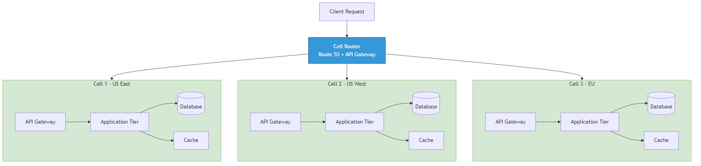
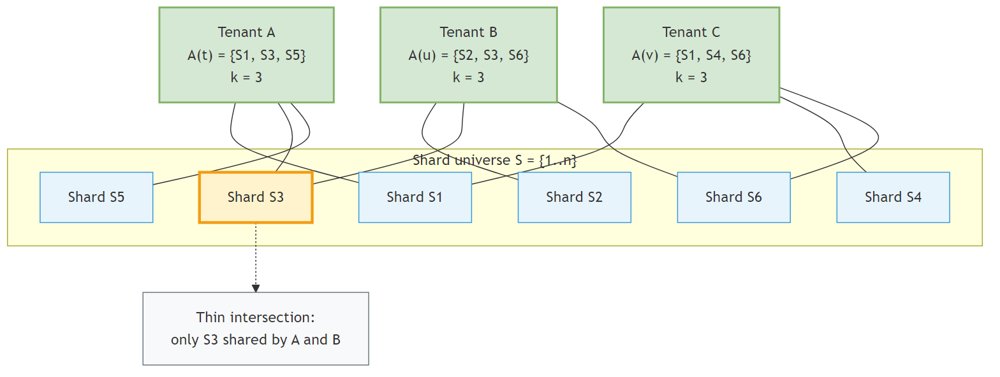

# Chapter 12: Shuffle Sharding & Blast-Radius Minimization

<div class="chapter-header">
  <h2 class="chapter-subtitle">A Probabilistic Foundation for Multi-Tenant Isolation</h2>
  <div class="chapter-meta">
    <span class="reading-time">📖 55 min read</span>
    <span class="difficulty">🎯 Expert</span>
  </div>
</div>

## Abstract

**Shuffle sharding** assigns each tenant a *pseudo-random* subset of infrastructure shards so that correlated failures affect only a *small intersection* of tenants, dramatically narrowing blast radius relative to naive *pooling*. This chapter develops the idea as a **measurable reliability primitive**: we formalize tenant-shard assignment, derive collision probabilities under uniform random hashing, connect the construction to **cell-based architectures** (fault-isolated vertical slices), and provide implementation recipes suitable for AWS multi-tenant SaaS.



*Figure 12.1: Cells isolate catastrophic failure domains; shuffle sharding reduces shared fate among tenants inside a cell.*

---

## 12.1 Problem statement and design objectives

Let a *shard* be an independently failing unit (compute fleet, storage partition, or control-plane segment). A **pooling** placement maps many tenants to few shards: simple, but **increases correlated outage** across tenants when a shard fails.

**Design goals (quantitative):**

1. **Isolation:** Limit expected number of tenants impacted by a single shard failure.  
2. **Load balance:** Avoid hotspots from skewed tenant→shard mappings.  
3. **Operational simplicity:** Deterministic routing from `tenant_id → shard set` without global coordination hot spots.

**Shuffle sharding** selects \(k\) distinct shards from \(n\) for each tenant (often \(k \ll n\)). Unlike naive hashing `h(t) \mod n` (which pools tenants into one shard per hash bucket), shuffle sharding **spreads** tenant sets across combinations: collisions become a **combinatorial** phenomenon, not a certainty.

---

## 12.2 Formal model

**Definition 12.1 (Shard universe).** \(\mathcal{S} = \{1,\ldots,n\}\) shards, each with independent failure indicator \(X_s \sim \mathrm{Bernoulli}(p_s)\); for worst-case analytic bounds, take \(p_s = p\).

**Definition 12.2 (Shuffle assignment).** For tenant \(t\), assignment \(A(t) \subseteq \mathcal{S}\) with \(|A(t)| = k\), drawn via a deterministic function of `tenant_id` (cryptographic hash expansion) so assignments are **stable** and **uniform** under the randomness model of the hash.

**Proposition 12.1 (Shared fate probability, pairwise).** For two distinct tenants \(t, u\), let \(C\) be the event \(|A(t)\cap A(u)| \geq 1\) under uniform random \(k\)-subsets. Then \(\Pr[C]\) is **small** relative to pooling: collisions require overlapping combinatorial choices; for intuition, when \(k\) is modest, overlaps are rare; exact \(\Pr[C]\) depends on sampling model (sampling with/without replacement across tenants); in engineering practice we **Monte Carlo** empirically for chosen \((n,k)\).

**Remark 12.1.** Adaptive Granularity Governance: The Khan Microservice Pattern treats **shuffle sharding** as an implementation of *antifragile isolation*: stress (shard failure) propagates only through **thin intersections** of the tenant graph.



*Figure 12.2: Tenant A and Tenant B share only shard S3-narrow blast radius versus naive pooling.*

---

## 12.3 Relationship to cell-based architectures

**Cells** (Chapter 11 ecosystem; see Figure 12.1) constrain **regional** or **account-level** blast radius; **shuffle sharding** constrains **tenant correlation inside** a cell. Composition:

- **Cell router** chooses `cell_id` (tenant cohort, geography).  
- **Inner placement** uses shuffle sharding for **noisy-neighbor** containment within the cell’s shard set.

This separation avoids conflating *macro* isolation (cells) with *micro* isolation (shuffle).

---

## 12.4 Engineering invariants

1. **Routing stability:** Changing \((n,k)\) is a **migration** event: version assignments or use **consistent hashing ranges** with minimal remaps (jump consistent hash families).  
2. **Security boundary:** Tenant IDs must be **unguessable** if shard membership is sensitive (or encrypt routing tables).  
3. **Fairness:** Monitor **shard utilization variance**; adaptive rebalancing may be needed for heavy tenants.

---

## Recipe 12.1: Deterministic shuffle selection (Python 3.11+)

Reference implementation for **uniform \(k\)-subset** from a tenant string using SHA-256 expansion (production systems may use BLAKE2 or HKDF):

```python
from __future__ import annotations

import hashlib
from typing import List

def shuffle_shards(tenant_id: str, n: int = 64, k: int = 3) -> List[int]:
    """Return k distinct shard indices in [0, n) deterministically per tenant."""
    if k > n:
        raise ValueError("k cannot exceed n")
    out: list[int] = []
    seen: set[int] = set()
    salt = 0
    while len(out) < k:
        digest = hashlib.sha256(f"{tenant_id}:{salt}".encode()).digest()
        for i in range(0, len(digest) - 7, 8):
            if len(out) >= k:
                break
            word = int.from_bytes(digest[i : i + 8], "big")
            idx = word % n
            if idx not in seen:
                seen.add(idx)
                out.append(idx)
        salt += 1
    return out
```

**Validation:** property-based tests (`hypothesis`) assert stability, permutation coverage over synthetic tenants, and no duplicates.

---

## Recipe 12.2: Empirical collision audit (sketch)

```python
def pairwise_overlap_stats(tenant_ids: list[str], n: int, k: int) -> float:
    sets = [set(shuffle_shards(t, n, k)) for t in tenant_ids]
    coll = 0
    pairs = 0
    for i in range(len(sets)):
        for j in range(i + 1, len(sets)):
            pairs += 1
            if sets[i] & sets[j]:
                coll += 1
    return coll / pairs if pairs else 0.0
```

Use this to **tune \((n,k)\)** for allowed correlated-failure budget.

---

## 12.5 Limitations and research directions

- **Non-independent failures:** Real outages are correlated by **software version**, **operator actions**, and **cascades**: probabilistic models underestimate systemic risk. Mitigate with **diversity** (cell-level versioning, canarying).  
- **Elastic tenants:** Large enterprises may occupy **multiple shard copies**; treat them as **super-tenants** with expanded \(k\) or dedicated shards.

---

## 12.6 Synthesis

Shuffle sharding is not “better hashing”; it is an **explicit combinatorial strategy** for controlling **expected shared fate**. Pair it with **cells**, **SLO burn alerting**, and **chaos experiments** (Chapter 13) to validate assumptions rather than treating formulas as guarantees.

**Further reading:** AWS Builder’s Library shuffle-sharding articles; Vogels’ “Dynamo” for consistent hashing precedents; your repository’s [Bibliography](../reference/bibliography.md) for distributed systems texts.

---

**Navigation:**
- [Previous: Chapter 11](11-khan-pattern-deep-dive.md)
- [Next: Chapter 13](13-chaos-engineering.md)
