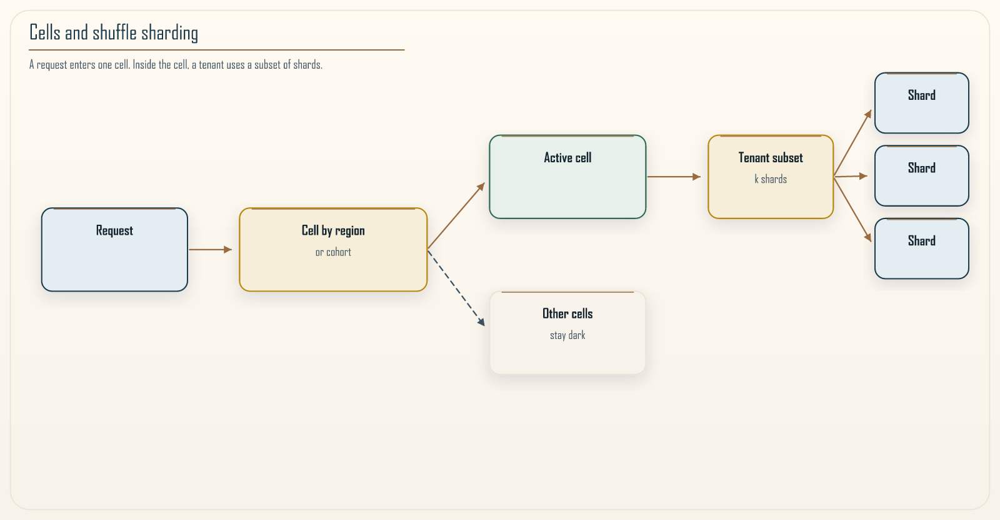

# Chapter 12: Shuffle Sharding and Blast-Radius Minimization

<div class="chapter-header">
  <h2 class="chapter-subtitle">A Single Bad Shard Should Be a Footnote</h2>
  <div class="chapter-meta">
    <span class="reading-time">📖 55 min read</span>
    <span class="difficulty">🎯 Expert</span>
  </div>
</div>

Every multi-tenant system has a quiet question buried inside it: when one part breaks, how many of your customers feel it? Most teams never ask the question directly. They discover the answer during an incident, when a single bad shard takes down a fifth of the customer base at once and the support queue fills with the same complaint from hundreds of accounts. This chapter is about answering that question on purpose, with a design, before the incident makes you answer it in public.

The technique is shuffle sharding. It is one of the highest-leverage resilience ideas in distributed systems, and it is also one of the most under-used, because it looks like a hashing trick and gets filed away as a minor optimization. It is not a minor optimization. It is a way to turn a shared outage into a small one, and it costs almost nothing to adopt if you build it in early. In the language of the Khan Pattern from Chapter 11, shuffle sharding is a way to keep the blast radius of a boundary small even when the boundary itself fails, which is a different and complementary concern to whether the boundary should exist at all. It does not move an RVx score. It reduces the cost of being wrong.

## 12.1 The problem: shared fate in a shared system

Start with the simplest multi-tenant design, the shared pool. You have some number of workers, and every tenant's requests can land on any worker. This is efficient and easy to reason about. It also means that every tenant shares fate with every other tenant. If one tenant sends a poison request that crashes a worker, or if one worker develops a fault, the blame does not stay contained. In a fully pooled system a single bad actor or a single bad node can degrade service for everyone at once, because everyone is standing in the same room.

The opposite extreme is full isolation, one dedicated worker per tenant. Now a fault touches exactly one tenant, which is the isolation you want, but the cost is brutal. You pay for a worker per tenant whether they are busy or not, you lose all the efficiency of pooling, and you cannot absorb bursts by sharing capacity. Full isolation is how you go bankrupt keeping a promise nobody asked you to keep at that price.

Real systems live between these extremes, and the usual middle ground is sharding: divide the workers into a handful of shards and assign each tenant to a shard, typically by hashing the tenant identifier and taking the result modulo the number of shards. This is better than a single pool, because a fault in one shard only touches the tenants assigned to that shard rather than everyone. But it is still coarse. If you have four shards and a shard fails, a quarter of your tenants go down together. You have reduced the blast radius from everyone to a quarter of everyone, which is progress, but a quarter of your customers is still a very bad morning.

The question shuffle sharding asks is this: can we get the efficiency of pooling and a blast radius far smaller than one over the number of shards, without paying for full isolation? The answer is yes, and the mechanism is combinatorics.

## 12.2 The idea: give each tenant a small random subset

Here is the move. Instead of assigning each tenant to a single shard, assign each tenant to a small subset of shards, chosen pseudo-randomly from the whole fleet, and spread that tenant's work across the subset. The subset is small, for example two or three shards out of a fleet of dozens, and it is derived deterministically from the tenant identifier so it is stable across requests and requires no central coordination to compute.

The consequence is subtle and powerful. Two tenants now share fate only to the extent that their subsets overlap. If tenant A is assigned shards `{3, 17, 40}` and tenant B is assigned `{8, 17, 52}`, they share exactly one shard, number 17. If shard 17 has a problem, both tenants are only partially affected, because each of them still has two healthy shards to serve from, *if the router actually fails over*. A client that retries the same dead shard will not ride through anything. The design and the failover are a pair.

For two tenants to be fully knocked out together, every shard in A's subset would have to coincide with a failing shard, and for A and B to share a full outage their subsets would have to be identical or nearly so, which becomes combinatorially rare as the fleet grows.


*Figure 12.1: Two complementary isolation mechanisms. A request is first placed in a cell, by region or cohort, so a catastrophe stays inside that copy of the stack. Inside the cell, shuffle sharding places the tenant on a small subset of shards, so everyday shared fate among tenants is thin. Cells bound the large failure domain. Shuffle sharding bounds the smaller one. Neither does the other's job.*

The reason this works is that the number of distinct small subsets you can draw from a fleet grows very fast. Choosing three shards out of forty is \(\binom{40}{3} = 9{,}880\) distinct combinations. If you have a few thousand tenants spread across nine thousand possible assignments, the chance that any two of them land on the exact same three shards is small, and the chance that a single shard failure fully knocks out any particular tenant is zero when \(k \ge 2\), because that tenant still has other shards. You have bought yourself a blast radius that is not one over the number of shards for a *total* outage. How many tenants *feel* the blip is a different number, and I will not let those two hide under one slogan.

## 12.3 The combinatorics, without hand-waving

It is worth being precise about what shuffle sharding does and does not promise, because the intuition is easy to oversell. Let the fleet have \(n\) shards, and give each tenant a subset of \(k\) shards. The number of distinct subsets available is \(\binom{n}{k}\).

Consider a single tenant and ask what it takes to fully knock them out. If a set of shards fails, this tenant is fully down only if all \(k\) of their shards are in the failed set. If a single shard fails, the tenant is not fully down at all, because they still have \(k - 1\) working shards. They are degraded by roughly \(1/k\) of their capacity *if they were spreading load across the subset*. If the router had a sticky primary and no failover, they are fully down until someone notices. Slight degradation across many, spread thin, is almost always a better failure mode than total outage concentrated on some. That better mode is a property of the router, not of the hash.

Now the number the slogan skips. Under a uniform assignment, a given shard sits in about \(k/n\) of all tenant subsets. A single shard failure therefore *touches* about \(k/n\) of your tenants. For \(n = 16\), \(k = 1\), that is 6.25 percent of tenants, fully down. For \(k = 2\), it is 12.5 percent of tenants, each missing half their capacity if failover works. For \(k = 3\), it is 18.75 percent, each missing a third. Larger \(k\) makes a total outage rarer and a single-shard blip *wider*. That is the real tradeoff, not "larger \(k\) buys a smaller blast radius" as a single sentence. You pick \(k\) against a stated budget: how many tenants may degrade on one failure, how much capacity each of them may lose, and how many concurrent shard failures you are willing to treat as a full outage.

Two tenants share only one shard, so a single shard failure degrades both slightly rather than taking either down. For them to be jointly and fully down, the failure has to cover the union of their subsets. The chance that two independently assigned tenants have *identical* subsets is \(1/\binom{n}{k}\). The chance they *intersect at all* is much higher, and it rises with \(k\). Recipe 12.2 measures both, because the overlap fraction alone will scare you on a small fleet even when nobody can be fully knocked out by one fault.


*Figure 12.2: Tenant A holds shards 3, 17, 40 and Tenant B holds shards 8, 17, 52. They intersect only at shard 17. A failure of shard 17 costs each tenant one third of its capacity if the router spreads and fails over, not its whole service. If the router cannot leave shard 17, the picture is ordinary sharding with extra drawings.*

The design objectives, stated plainly, are three. First, isolation: limit how many tenants are fully affected by any single failure, and prefer many-slightly-degraded over few-fully-down. Second, load balance: avoid hot shards by spreading assignments evenly, which pseudo-random subset selection gives you for free as long as the hash is unbiased. Third, operational simplicity: compute the assignment from the tenant identifier with a pure function, so routing needs no global coordination and no shared assignment table that could itself become a bottleneck or a single point of failure.

The closed-form expressions get fiddly once you account for retries, partial capacity, and correlated failures, so in practice you do not derive a guarantee, you measure the distribution empirically for your chosen \(n\) and \(k\). Recipe 12.2 does exactly that.

## 12.4 A worked example you can feel

Numbers make this concrete. Suppose you run a SaaS API on a fleet of 16 worker shards, and you have 2,000 tenants.

Under a single shared pool, one bad worker degrades all 2,000 tenants to some degree, and one truly toxic tenant can crash the pool for everyone.

Under simple sharding with 16 shards, each shard carries about 125 tenants. One shard failure takes down those 125 tenants completely. That is 6.25 percent of your customers fully offline from a single fault, and the toxic tenant still takes out everyone on its shard.

Under shuffle sharding with \(k = 2\), each tenant gets 2 of the 16 shards, and there are \(\binom{16}{2} = 120\) distinct pairs. A single shard failure now degrades the tenants that include that shard, about 12.5 percent of the population, by half their capacity if they fail over, and it fully knocks out only the tenants whose other shard is also unhealthy at the same moment, which under a single failure is none. The toxic-tenant story improves too: a tenant that poisons one of its two shards still has a second, and the blast from that poison touches the tenants who share that specific shard, not the whole fleet.

Push \(k\) to 3 with the same 16 shards and there are \(\binom{16}{3} = 560\) distinct triples, so the odds of two tenants sharing all three shards become small, and the odds of a single failure fully downing anyone stay zero. You now touch about 19 percent of tenants on that one failure, more shallowly. That is a better story if you expect two shards to fail together. It is a noisier story if your problem is one bad node and you wanted fewer people to notice. Two is the usual starting point. Three is what you take when the correlated-failure budget says one is not enough. \(k = 1\) is ordinary sharding. \(k\) near \(n\) is a pool with extra math.

The cost you pay for \(k > 1\) is that each tenant's work is spread across several shards, which means slightly more connections and a little more cross-shard coordination. Retries across shards need the idempotency of Chapters 5 and 10, or the failover that saves availability will double a charge.

## 12.5 How this composes with cells

Shuffle sharding is not the only isolation tool, and it is important not to confuse it with the larger one. Cell-based architecture isolates the big, catastrophic failure domains. A cell is a complete, independent copy of the stack, often per region or per large customer cohort, with its own capacity and its own blast wall. Cells bound the damage from a bad deployment, a poisoned cache, or a control-plane failure, because a cell cannot take down another cell *if they do not share a hidden dependency*. A shared account limit, a shared schema, or a shared feature-flag service is a cell wall with a hole in it.

Shuffle sharding operates inside a cell. Cells answer the question "how do I stop a catastrophe from spreading across the whole system", and shuffle sharding answers the question "inside one cell, how do I stop one tenant or one node from spoiling the day for everyone else in that cell". They stack cleanly. A request first routes to a cell, by geography or cohort, and then within that cell a tenant's work is placed across its shuffle-sharded subset. Keeping these two layers distinct in your head, and in your architecture diagrams, prevents a common muddle where teams try to make cells do the fine-grained work that shuffle sharding does better, or try to make shuffle sharding contain a catastrophe it was never meant to contain.

## 12.6 Engineering invariants that keep it honest

Three invariants separate a shuffle-sharding design that works from one that quietly stops working.

The first is **routing stability**. The assignment from tenant to subset must be stable over time, because if it drifts, tenants migrate between shards constantly and you lose both cache locality and the ability to reason about who shares fate with whom. This means \(n\) and \(k\) are not casual configuration values. Changing them re-shuffles assignments and is a migration event. The function in Recipe 12.1 uses a hash modulo \(n\). When \(n\) changes, that function moves *everyone*. If you expect the fleet to grow, use a placement that minimizes remaps, rendezvous hashing, highest-random-weight, or jump consistent hashing, and treat a change of \(k\) as a data-migration if the subset owns state.

The second is the **security boundary**. Compute the subset from the authenticated tenant, never from an unauthenticated header a caller can set. Chapter 7's confused-deputy rule applies at the edge: if the client chooses the shard set, isolation is a suggestion. If which shards a tenant lands on is sensitive, because an attacker who knows a victim's shards could target them, do not hash a sequential public tenant id in the clear. HMAC the identifier with a server-side key, as Recipe 12.1 does, so membership is not a function an outsider can evaluate.

The third is **fairness**. Pseudo-random assignment spreads tenants evenly on average, but averages hide heavy tenants. One enterprise customer with a thousand times the traffic of a typical tenant will create a hot spot on whatever shards it lands on, and no amount of clever subset math fixes a single tenant that is simply too big for a shard. Monitor shard utilization variance and treat very large tenants specially, either by giving them a larger subset so their load spreads wider, or by moving them to dedicated capacity and treating them as their own small cell. Pretending a whale is a minnow is how a fair-on-paper design produces an unfair-in-practice outage.

### Recipe 12.1: Deterministic subset selection

**Context.** Given a tenant identifier, return a stable, pseudo-random subset of \(k\) shard indices out of \(n\), with no duplicates and no coordination.

**Solution.** HMAC-SHA256 expands the identifier. Rejection sampling avoids the small bias of `word % n` when \(n\) is not a power of two. A versioned key keeps the mapping from being a public function of a guessable id.

```python
from __future__ import annotations

import hashlib
import hmac


def shuffle_shards(
    tenant_id: str,
    n: int = 64,
    k: int = 3,
    *,
    key: bytes = b"shuffle-shard-v1",
) -> list[int]:
    """Return k distinct shard indices in [0, n) for this tenant.

    Stable for a fixed (n, k, key). Changing n remaps everyone; see
    Section 12.6. HMAC so a sequential public id is not a shard oracle.
    """
    if not 1 <= k <= n:
        raise ValueError("k must be in 1..n")

    chosen: list[int] = []
    seen: set[int] = set()
    counter = 0
    # Largest multiple of n below 2^64, so modulo is unbiased.
    accept_below = ((1 << 64) // n) * n

    while len(chosen) < k:
        payload = tenant_id.encode() + b"\0" + counter.to_bytes(8, "big")
        digest = hmac.new(key, payload, hashlib.sha256).digest()
        counter += 1
        for offset in range(0, 32, 8):
            word = int.from_bytes(digest[offset : offset + 8], "big")
            if word >= accept_below:
                continue
            idx = word % n
            if idx in seen:
                continue
            seen.add(idx)
            chosen.append(idx)
            if len(chosen) >= k:
                break
    return chosen
```

For small \(k\) relative to \(n\) this finishes on the first block. Test it with properties, not examples: stable across calls, no duplicates, exactly \(k\) indices, and over a large synthetic population shard occupancy close to uniform. When you need fleet growth without a stampede, replace the modulo step with rendezvous scoring of `(tenant_id, shard_id)` and take the top \(k\). Do not mix the two algorithms for the same population.

### Recipe 12.2: Measuring the blast radius you actually have

Do not trust a formula you did not check against your own parameters. The number that maps to an outage is how many tenants lose their *whole* subset when a set of shards fails. The number that maps to a noisy-neighbor complaint is how many tenants *touch* a failed shard. Pairwise overlap, the fraction of tenant pairs that share at least one shard, is a third number, and on a small fleet it is large even when the first number is zero. For \(n = 16\), \(k = 3\), roughly half of random pairs intersect. That is not a design failure. It is why you should not steer \(k\) by overlap alone.

```python
import random

# shuffle_shards is Recipe 12.1 in this same module. Do not copy this
# block into a new file without bringing that function with it.


def fully_down_fraction(
    tenant_ids: list[str], n: int, k: int, failed: set[int]
) -> float:
    """Tenants whose entire subset sits inside the failed set."""
    if not tenant_ids:
        return 0.0
    down = 0
    for tenant_id in tenant_ids:
        subset = set(shuffle_shards(tenant_id, n, k))
        if subset <= failed:
            down += 1
    return down / len(tenant_ids)


def degraded_fraction(
    tenant_ids: list[str], n: int, k: int, failed: set[int]
) -> float:
    """Tenants who share at least one shard with the failed set."""
    if not tenant_ids:
        return 0.0
    hit = 0
    for tenant_id in tenant_ids:
        if set(shuffle_shards(tenant_id, n, k)) & failed:
            hit += 1
    return hit / len(tenant_ids)


def pairwise_overlap_fraction(
    tenant_ids: list[str], n: int, k: int, samples: int | None = None
) -> float:
    """Fraction of pairs whose subsets intersect. Sample if the list is large."""
    subsets = [set(shuffle_shards(t, n, k)) for t in tenant_ids]
    if len(subsets) < 2:
        return 0.0
    if samples is None:
        hits = pairs = 0
        for i in range(len(subsets)):
            for j in range(i + 1, len(subsets)):
                pairs += 1
                if subsets[i] & subsets[j]:
                    hits += 1
        return hits / pairs
    hits = 0
    for _ in range(samples):
        a, b = random.sample(subsets, 2)
        if a & b:
            hits += 1
    return hits / samples
```

Mark one shard failed and confirm `fully_down_fraction` is 0 for \(k \ge 2\). Mark two failed and see whether the remaining full outages sit inside your budget. That pair of numbers, not a binomial coefficient on a slide, is how you choose \(k\).

## 12.7 Where the model lies to you

Every probabilistic isolation argument rests on an assumption that real outages love to violate: independence. The clean math assumes shards fail independently of one another. Production failures are frequently correlated, and the correlation is exactly what shuffle sharding cannot save you from.

The most common correlated failure is a bad deployment. If every shard runs the same software version and you ship a defect, every shard fails at once, and no amount of clever subset assignment helps, because the failure is not per-shard, it is fleet-wide. The same is true for a poisoned shared dependency, a bad configuration pushed everywhere, or an operator action that touches the whole fleet. Shuffle sharding protects you from independent, localized faults. It does nothing against a monoculture failure that hits everything simultaneously.

This is why shuffle sharding must be paired with the diversity techniques that break correlation. Stagger deployments so that not all shards run the same version at the same instant, and canary changes on a small number of shards before the rest. Combine shuffle sharding within a cell with versioning differences across cells, so a bad deployment caught in one cell does not reach the others. The honest framing is that shuffle sharding narrows the blast radius of the failures it was designed for, and you need separate mechanisms, deployment discipline and cell-level diversity, for the failures it was not.

The second place the model lies is elastic and uneven tenants, which Section 12.6 raised as a fairness invariant. The probability arguments assume tenants are roughly interchangeable in size. When one tenant is a thousand times larger than the median, the neat combinatorics stop describing your reality, because that one tenant defines the load on whatever shards it touches. Treat large tenants as a separate population with their own placement policy rather than forcing them through the same subset math as everyone else.

The third place is hidden pooling behind the shards. If every shard funnels through one database connection pool, one cache cluster, one Lambda account-concurrency ceiling, or one DynamoDB table that is already hot, you have shuffle-sharded the front and pooled the back. The outage will start at the back. A shard is only a shard if it can fail without taking its siblings with it.

## 12.8 Putting it on AWS

The theory is portable. Here is a concrete shape for a multi-tenant service on AWS, with the shared-fate holes named.

Model each shard as an independently failing unit. That might be a target group backed by its own Auto Scaling group, a reserved-concurrency slice of Lambda, a queue and consumer group, or a logical partition-key prefix. Avoid hidden shared dependencies. One Application Load Balancer in front of many target groups is still one ALB. One table with many prefixes is still one table: account and table limits, GSIs, and on-demand burst are shared fate DynamoDB will not pretend away. Shuffle-sharded prefixes help a hot key and a noisy neighbor. They do not give you sixteen independently failing databases.

Routing happens at the edge or in a thin routing layer. When a request arrives, extract the tenant identifier from the authenticated context, compute the subset with Recipe 12.1, and pick one *healthy* member of the subset for this request. If the first choice is unhealthy or slow, fall back to another member. This fallback is the whole point. A tenant with three shards should experience a single shard failure as a brief blip the router papers over, not as an outage. Health that is stale, or a retry that pins the same shard, throws the combinatorics away.

For stateful placement, the subset defines where the tenant's data is replicated or partitioned, and the routing layer reads and writes inside that subset according to your consistency needs. Moving a tenant's subset means moving data, so the routing-stability invariant becomes a hard migration. Plan capacity so that a shard failure can be absorbed by the surviving members of each affected tenant's subset. Otherwise the isolation math is correct and the capacity math is not, and the second one wins during an incident.

Let \(k\) vary by tenant size rather than fixing it globally for whales. A median tenant can live on two prefixes. A whale may need more, or a cell of its own.

## 12.9 Operating it: metrics, alarms, and drills

An isolation design you cannot observe is an isolation design you do not actually have. Instrument three things from day one.

**Per-shard health and load**, so you can see a single shard degrade before it fails and so you can watch utilization variance across shards. A rising variance is the early signal that assignment is skewing, often because a large tenant has landed somewhere and is pulling that shard hot. Alarm on variance, not just on absolute load, because the absolute numbers can look fine while one shard quietly carries three times its share.

**Per-tenant experienced availability**, computed from the tenant's point of view rather than the fleet's. A fleet-level availability number can read as healthy while a specific unlucky tenant, whose whole subset happened to include two struggling shards, is having a terrible time. Chapter 8's rule applies: SLO the journey the user feels. The metric that matches customers is the distribution of per-tenant availability, especially its worst percentiles, not the fleet average.

**The modeled blast radius**, recomputed as your tenant population and fleet size change. Recipe 12.2 is not a one-time design check, it is a standing report. As you add tenants, add shards, or onboard a whale, the correlation profile shifts, and the \(k\) you chose last year may no longer meet this year's budget. Treat `fully_down_fraction` under a declared failure set as an input you review on a schedule.

Finally, drill it. The next chapter makes the case at length. Deliberately fail a shard in a controlled environment and confirm three things: that affected tenants degrade rather than drop, that unaffected tenants feel nothing, and that your routing layer actually performs the intra-subset fallback you designed. Every one of these has been quietly broken in real systems by a later change, and the only way to know it still works is to break a shard on purpose and watch the graphs.

## 12.10 Connecting back to the Khan Pattern

Chapter 11 argued that a boundary is worth its distributed cost only when it is efficient, independent, and ownable. Shuffle sharding sits one level down from that decision. It does not tell you whether to draw a boundary; it tells you how to make the boundary survive its own failures gracefully once it exists. It does not move the RVx score of a boundary. It reduces the cost of the boundary being wrong, which is a different and complementary kind of insurance. I am not folding blast radius into the granularity metric. Resilience is still not a third exponent.

There is a useful parallel worth naming. The granularity paradox says that splitting for its own sake multiplies cost. Blast-radius thinking says the same about isolation: isolating for its own sake, full dedication per tenant, multiplies cost too, and shuffle sharding is the measured middle path, exactly as the RVx composite is the measured middle path between a single-signal metric and a dashboard of disconnected numbers. In both cases the extremes are easy and expensive, and the value lives in a calibrated middle you can measure.

## 12.11 Summary

Shuffle sharding is a combinatorial isolation strategy, not a better hash function. By giving each tenant a small pseudo-random subset of shards rather than a single shard, it converts the failure mode of a shared system from "a few tenants fully down" into "many tenants slightly degraded", *if the router fails over and the shards can actually fail independently*. The full-outage radius is governed by how rarely a failure covers a whole subset. The degraded radius is about \(k/n\) of tenants on a one-shard fault, and it widens as \(k\) grows.

Use it inside cells, not instead of them. Hold the three invariants: stable routing, an assignment that is not a public function of a guessable id, and active monitoring of shard fairness with special handling for large tenants. Measure the blast radius you actually have with Recipe 12.2, fully-down and degraded, rather than steering by pairwise overlap or a binomial coefficient. Remember the model's blind spot: it protects against independent, localized faults and not against correlated, fleet-wide ones, so pair it with staggered deployments and cell diversity. Do this and a single bad shard becomes a footnote in your metrics rather than a headline in your customers' inboxes.

The next chapter, on chaos engineering, is the natural companion to this one, because a blast-radius argument you have not tested under real failure is a hypothesis, not a guarantee, and the only honest way to believe your isolation works is to break something on purpose and watch.

---

**Navigation:**
- [Previous: Chapter 11](11-khan-pattern-deep-dive.md)
- [Next: Chapter 13](13-chaos-engineering.md)
