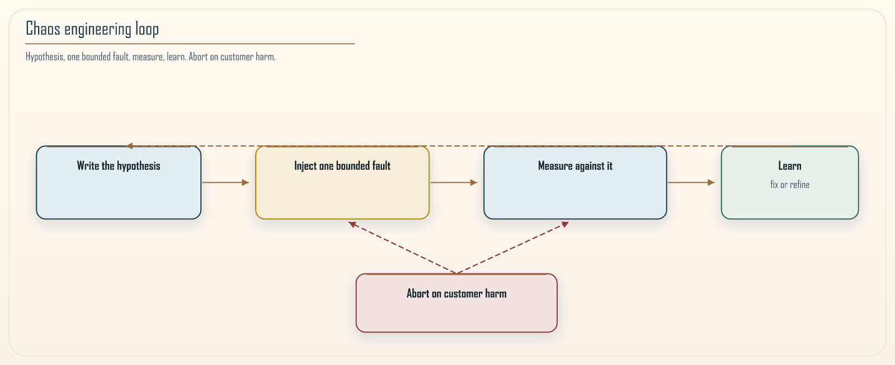
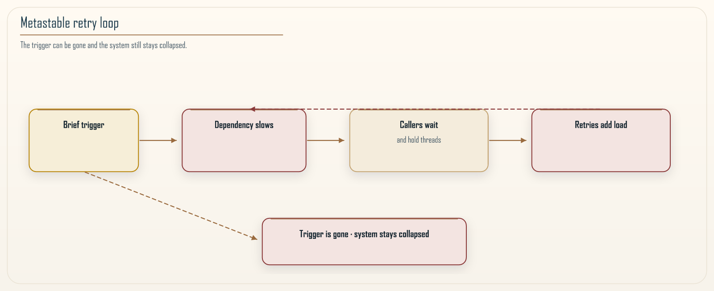

# Chapter 13: Chaos Engineering and Evidence-Based Resilience

<div class="chapter-header">
  <h2 class="chapter-subtitle">Break It on Purpose. Watch. Then You Know.</h2>
  <div class="chapter-meta">
    <span class="reading-time">📖 55 min read</span>
    <span class="difficulty">🎯 Expert</span>
  </div>
</div>

The previous chapter ended on a promise that this chapter has to keep. Shuffle sharding, cells, retries, timeouts, circuit breakers, all the resilience machinery in this book, share one uncomfortable property: you do not know whether any of it works until something fails. And by the time something fails on its own, you are not learning, you are firefighting. Chaos engineering is the discipline of moving that learning earlier, by causing controlled failures on purpose, in daylight, with people watching, so that the first time your isolation is tested is not also the first time your customers are affected.

I want to be careful with the word chaos, because it oversells the practice and scares the people whose approval you need. There is nothing chaotic about it when done well. It is closer to a laboratory experiment than to a riot. You form a hypothesis about how the system should behave under a specific failure, you inject that failure in a bounded way, you measure whether the system behaved as predicted, and you either gain confidence or find a gap. The value is not the breaking. The value is the evidence.

Chapter 2 made staging chaos a gate, not a proof. Chapter 6 said you spend error budget on these experiments when the budget is intact, and you do not spend it when the budget is gone. Chapter 9 put fault injection in the testing-in-production loop. This chapter is the operating model those chapters pointed at.

## 13.1 What chaos can and cannot prove

Start with epistemology, because teams that skip it end up running experiments that prove nothing and annoy everyone. A chaos experiment is an existence test, not a universal proof. When you inject a failure and the system rides through it, you have shown that the system survives that failure, under that load, in that configuration, at that moment. You have not shown that it survives all failures, or that it will survive the same failure next month after three deployments have changed the code underneath you.

This asymmetry matters. A passing experiment is weak evidence of health, because it covers one point in a vast space of possible failures. A failing experiment is strong evidence of a problem, because it is a concrete, reproducible demonstration that the system does not do what you believed. Chaos engineering earns its keep mostly through the failures it surfaces, not the passes it accumulates. A team that runs chaos experiments and never finds anything is either extraordinarily well engineered or, far more likely, running experiments too gentle to be informative.

The practical consequence is that you should design experiments to be falsifying. Do not inject a failure you are confident the system handles just to watch the green light stay green. Inject the failure you are secretly worried about, the one where you are not sure what happens, because that is where the evidence is. The uncomfortable experiments are the valuable ones.

There is also a hard limit worth stating plainly. Chaos engineering tests the failures you think to inject. It cannot test the failure you never imagined, the novel interaction between three subsystems that no one predicted. This is the same limit that every testing discipline has, and it is not a reason to skip chaos engineering, it is a reason to stay humble about what a wall of passing experiments means. It means you have not yet found the next problem, not that there is no next problem.

## 13.2 The steady-state hypothesis

The center of a good chaos experiment is the steady-state hypothesis, and getting it right is most of the work. A steady-state hypothesis is a precise, measurable statement of what normal looks like, expressed in terms of outcomes your customers care about rather than internals your engineers care about. Chapter 8 already told you to SLO the journey. The hypothesis is that SLO, written as a prediction for one experiment.

The wrong way to state it is in terms of implementation: "CPU stays below 70 percent" or "the cache hit rate holds". Those are internal signals, and a system can violate all of them while serving customers perfectly, or satisfy all of them while serving customers badly. The right way to state it is in terms of the service's job: "checkout success rate stays above 99.5 percent" or "p99 latency for the read path stays under 300 milliseconds". These are things a customer would notice, and they are the things worth defending.

A complete steady-state hypothesis has four parts. It names the metric, in customer terms. It states the normal range, ideally from real historical data rather than a guess. It defines the period over which you measure, because a one-second spike and a ten-minute degradation are different animals. And it sets a stopping condition, the point at which you abort the experiment because the harm is exceeding the value of the evidence. That last part is not optional. An experiment without an abort condition is not an experiment, it is an incident you scheduled. Chapter 2 said an empty FIS `stopConditions` array is how a staging experiment becomes an outage. That is still true.

Write the hypothesis before you inject anything, and write down what you expect to happen. This is the step teams skip and regret. If you inject a shard failure and then decide afterward what counts as success, you will rationalize whatever happened as fine, because humans are very good at that. If you commit in advance to "we expect checkout success to stay above 99.5 percent and p99 to rise by no more than 50 milliseconds", then reality either matches your model or it does not, and either answer teaches you something.

If the hypothesis names per-tenant success, you must already emit per-tenant success. Chapter 12 asked for that distribution. An experiment that claims to defend a metric you do not collect is theater with a kill switch.

## 13.3 The game-day operating model

Chaos engineering has two modes, and it is worth being clear about which you are doing. The first is the game day: a scheduled, staffed, deliberate exercise where a team gathers, announces that they are running an experiment, injects a failure, watches, and debriefs. The second is continuous, automated chaos, where failures are injected regularly and unattended as part of normal operations. Almost every organization should start with game days and earn its way to automation, not the other way around.

A game day runs in a clear sequence. Before the day, you write the hypothesis, choose the failure to inject, agree on the blast radius and the abort condition, and tell everyone who might see an alert that an exercise is happening, so nobody pages the on-call for a failure you caused on purpose. You also decide, explicitly, whether you are running in a staging environment or in production, because that choice changes everything about the risk and the value. You check the error budget. If Chapter 6 would freeze deploys this week, it also freezes production chaos. Spending a thin budget on a finding you could have gathered in staging is how a resilience program becomes the incident.

On the day, one person owns the experiment and one person watches the metrics against the hypothesis. You inject the smallest failure that tests the hypothesis, not the largest failure you can imagine. You watch. If the abort condition trips, you stop immediately and roll back, and that is a successful game day, not a failed one, because you learned where the edge is without going over it. If the system behaves as predicted, you have earned a unit of confidence. Either way, you debrief: what did we expect, what happened, what surprised us, what do we fix, and what experiment do we run next.

The progression toward production is gradual and should be earned. Run in staging until staging experiments stop finding anything, then run carefully scoped experiments in production during low-traffic windows with tight blast radius and fast abort, then widen as confidence grows. Running chaos experiments in production sounds reckless to people who have not done it, but the argument for it is the same one Chapter 9 made: staging never fully reflects production, so a system that survives staging chaos has only been shown to survive a simulation of itself. The failures that matter happen in production, so eventually, carefully, that is where the evidence has to come from. The key word is carefully.


*Figure 13.1: The chaos loop. Every cycle starts from a measured steady state and a written hypothesis, injects one bounded failure, compares reality to prediction, and feeds the result back into the next experiment. The abort condition sits outside the loop as a hard stop. It is not a step you hope to remember. It is a switch that must work even if the thing you are stressing does not.*

## 13.4 A concrete experiment on AWS

Talking about chaos in the abstract is easy. Here is a specific experiment, end to end, so the shape is concrete. The system under test is the multi-tenant service from Chapter 12, shuffle-sharded across a fleet, and the thing we want to verify is the claim that chapter made: that a single shard failure degrades affected tenants slightly rather than taking them down.

The hypothesis, written first: during a single-shard failure, fleet-wide checkout success rate stays above 99.5 percent, tenants whose subset includes the failed shard see p99 latency rise by no more than 100 milliseconds as their traffic shifts to healthy shards in their subset, and no tenant experiences a sustained success rate below 99 percent. We will measure over a ten-minute window. We abort immediately if fleet checkout success drops below 99 percent or if any tenant flatlines.

The failure to inject: take one *shard* out of service, not one task. That distinction is where hand-wavy FIS templates go wrong. `aws:ecs:stop-task` with `COUNT(1)` kills one task. A shard with six tasks stays up, the scheduler replaces the body, and you have tested instance replacement, which is a different and easier hypothesis. To darken a shard you stop every task that belongs to it *and* keep the service from replacing them, or you remove that shard from routing. Fault Injection Service can stop the tasks. Holding desired count at zero, or flipping the routing flag, is often a second control you own, because a stop-task action against a healthy ECS service is a brief hole, not a held-down shard.

### Recipe 13.1: Fail one tagged shard, abort on the customer metric

**Context.** ECS tasks are tagged `role=tenant-shard` and `shard=<id>`. A CloudWatch alarm `CheckoutSuccessBelow99` is already OK, built on the fleet checkout SLI, and does not take its only datapoints from the shard you are about to kill.

**Solution.** Target *all* tasks on one shard. Wire the stop condition to that alarm. Validate the action catalog in your region before you treat this JSON as executable. FIS schemas move.

```json
{
  "description": "Stop every task on one tagged shard; abort if checkout success drops below 99 percent.",
  "roleArn": "arn:aws:iam::123456789012:role/fis-experiment-role",
  "targets": {
    "oneShard": {
      "resourceType": "aws:ecs:task",
      "resourceTags": {
        "role": "tenant-shard",
        "shard": "3"
      },
      "selectionMode": "ALL"
    }
  },
  "actions": {
    "stopShardTasks": {
      "actionId": "aws:ecs:stop-task",
      "parameters": {},
      "targets": { "Tasks": "oneShard" }
    }
  },
  "stopConditions": [
    {
      "source": "aws:cloudwatch:alarm",
      "value": "arn:aws:cloudwatch:us-east-1:123456789012:alarm:CheckoutSuccessBelow99"
    }
  ]
}
```

The stop condition is the most important block in that template. It ties the experiment to the same customer-facing metric named in the hypothesis, so the blast radius is bounded not by a timer but by actual harm. If checkout success crosses 99 percent, the experiment ends itself in seconds, without waiting for a human to notice. This is what separates a chaos experiment from an outage: the experiment has a hand on the kill switch before it starts.

Two more edges. If the alarm is already in `ALARM` when you start, FIS will refuse or immediately stop, depending on how you launched it; do not debug that as a failed hypothesis. And if the only path that publishes checkout success runs through shard 3, you just shot the abort. Section 13.9 is the rule: the kill switch must not live inside the blast radius.

During the run, the person watching compares the live metrics to the four-part hypothesis. The interesting outcomes are the surprises. Maybe fleet success holds but one tenant dips below 99 percent, which tells you that tenant's subset had two weak shards and your capacity headroom is thinner than you thought. Maybe latency rises more than predicted, which tells you the intra-subset fallback in your router is slower than you believed, or is not happening at all, which is the finding Chapter 12 said throws the combinatorics away. Every gap between prediction and reality is a finding, and findings are the product.

## 13.5 Reading the results without fooling yourself

Chaos experiments produce noisy data, and there are two statistical traps that catch teams repeatedly.

The first is concluding too much from a single run. One experiment where the system held is one data point, under one set of conditions. Real load varies, and the same failure at peak traffic may behave nothing like it did at 2 in the afternoon on a Tuesday. If a result matters, run the experiment several times, at different loads, before you trust it. Treat a single green run as encouraging, not as proof, exactly as Chapter 11 treats a single benchmark as directional rather than conclusive.

The second trap is confusing correlation with causation during the run. If latency spikes thirty seconds after you inject a failure, it is tempting to blame the failure, but the spike might be a coincidental deployment, a cache expiry, or an unrelated traffic surge. This is why you measure a baseline before injecting, freeze deploys for the window, and keep the blast radius small enough that the injected failure is the dominant thing changing. A well-scoped experiment changes one thing, so that when the metrics move, the cause is not in doubt. A sprawling experiment that fails ten things at once produces a mess you cannot attribute, which is worse than no experiment because it manufactures false confidence or false alarm.

Record everything: the hypothesis, the exact injection, the experiment id on the traces from Chapter 8, the baseline, the observed metrics, the decision to continue or abort, and the findings. This record is not bureaucracy. It is how the next person, possibly you in six months, knows what has already been tested and what the system did, so that resilience knowledge accumulates instead of evaporating when the person who ran the game day changes teams.

## 13.6 Ethics, compliance, and the social contract

Chaos engineering touches real systems that serve real people, and that carries obligations that are easy to forget in the enthusiasm of breaking things.

The first obligation is consent and communication. Everyone who could be affected, or who could be paged, must know an experiment is running. Injecting a failure without telling the on-call engineer is not chaos engineering, it is a cruel prank that burns the trust the practice depends on. The whole organization has to believe that a scheduled experiment is safe, and that belief is destroyed the first time someone gets paged at midnight for a failure a colleague caused silently.

The second obligation is proportionality. The harm you risk must be proportional to the evidence you gain. Failing a shard to verify isolation is proportional. Failing the payment processor during a holiday sale to see what happens is not, because the potential harm to real customers and real revenue dwarfs the value of the evidence, and the evidence could have been gathered more safely in a lower-stakes window. In regulated domains, some experiments may be off-limits entirely, or may require sign-off, and part of doing this responsibly is knowing where those lines are before you approach them.

The third obligation is honesty about what you are protecting. If your steady-state hypothesis defends a metric that does not actually reflect customer experience, you can run beautiful experiments that prove nothing about whether customers are served. The discipline is only as honest as the metric at its center, which is the same lesson that runs through the whole book: the measurement has to mean what you claim it means, or the rigor around it is theater.

## 13.7 A taxonomy of failures worth injecting

Teams new to chaos engineering often get stuck on what to inject, and they default to the one failure everyone thinks of, killing a server, which is rarely the most instructive. Distributed systems fail in families, and a mature program works through the families deliberately rather than repeating the same easy experiment. It helps to organize the space into layers, from the infrastructure up to the organization, and to have at least one standing experiment in each.

**Infrastructure.** Instance termination, disk exhaustion, and resource starvation such as CPU or memory pressure. These test whether your orchestration actually reschedules work, whether your capacity headroom is real, and whether a starved node degrades gracefully or thrashes. They are the easiest to run and the least likely to surprise a well-run system, so treat them as warm-ups rather than as the main event.

**Network.** These are the failures distributed systems handle worst, because the network is where the fallacies of distributed computing bite. Inject latency, not just outright loss, because a dependency that is slow is often worse than a dependency that is down: a down dependency trips a circuit breaker quickly, while a slow one silently exhausts thread pools and cascades. Inject packet loss, inject a partition that splits the system into halves that cannot see each other, and inject DNS failures, which are a perennial source of outages precisely because teams forget DNS is a dependency. The network experiments are where most teams find their most valuable gaps.

**Dependencies.** Fail the things your service calls: a downstream service returns errors, a database becomes unavailable or read-only, a cache goes cold, a message queue backs up. These test whether the timeouts, retries, fallbacks, and degradation paths of Chapter 6 actually work, or whether they exist only in the design document. A common and humbling finding here is that a retry storm, many clients retrying a struggling dependency at once, turns a small dependency hiccup into a full outage, which is the opposite of what the retry was supposed to buy you.

**Application.** A poison message that crashes a consumer, a corrupted cache entry, a clock skew between nodes, a feature flag flipped to an unexpected state. These are harder to generalize but often the most relevant to your particular system, and they are where domain knowledge turns a generic chaos program into one that tests what actually breaks for you.

**Organization.** Run the experiment most teams never think of: make a *role* unavailable. The engineer who knows the most about the system is declared out for the game day, and everyone else diagnoses and recovers from the runbooks and dashboards. This is not a test of a person. It is a test of whether the knowledge is in the system. A system that only one person can operate is not resilient, no matter how many shards it has.

## 13.8 The retry storm and metastable failure

There is one class of failure that chaos engineering is almost uniquely able to find, and it is worth its own section because it is both common and catastrophic and because it is nearly invisible to any testing that does not combine load with failure. It goes by the name metastable failure, and once you have seen one you recognize it everywhere.

A metastable failure works like this. The system runs happily in a stable state. Some trigger, a brief dependency slowdown, a short traffic spike, a momentary packet loss, pushes it past a threshold into a degraded state. So far this is ordinary. The dangerous part is that the degraded state sustains itself through a feedback loop even after the original trigger is gone. The classic engine of that loop is the retry. A dependency slows down, clients time out and retry, the retries add load to the already struggling dependency, which slows it further, which causes more timeouts and more retries. The dependency recovers its underlying health, the original slowdown passes, and yet the system stays pinned in collapse, because the retries are now both the symptom and the cause. Removing the trigger does not fix it. The system has found a second, stable, terrible equilibrium and settled into it.


*Figure 13.2: Why a slow dependency becomes a self-sustaining collapse. A brief trigger slows one hop. Callers do not fail fast; they wait, hold threads and connections, and retry. The retries are extra load on the hop that was already struggling, so the hop stays slow after the trigger is gone. That is the signature of a metastable failure: the cause you injected has been removed, and the degraded state persists, held up by the mechanism that was supposed to add resilience.*

The reason chaos engineering is the right tool to find these is that they do not appear under gentle conditions. A metastable failure needs enough load that the retry feedback can overwhelm recovery, and it needs a real fault to trigger it. Neither a quiet staging test nor a code review will reveal it. The experiment that surfaces it is specific and slightly counterintuitive: inject a latency fault, hold it briefly, then remove it, and watch whether the system recovers on its own. A healthy system snaps back to its steady state within moments of the fault clearing. A system with a metastable trap stays degraded after the fault is gone, and that failure to self-recover is the finding, one that no single-request test could ever produce.

The mitigations are the ones Chapter 6 introduced, now seen from the angle of the feedback loop they break. Retry budgets cap the total fraction of traffic that can be retries, so retries can never snowball into more load than the system can shed. Backoff with jitter spreads retries out in time instead of synchronizing them into waves. Circuit breakers stop sending work to a struggling dependency entirely, which removes the load that sustains the collapse and lets the dependency recover. Load shedding lets a service refuse work above its capacity rather than accepting work it will fail to complete. Each of these is a claim that the system can escape a metastable trap, and each is exactly the kind of claim that stays unverified until a chaos experiment injects the fault, removes it, and confirms the system climbs back out.

## 13.9 Bounding the blast radius in practice

The abort condition from Section 13.2 is the last line of defense, the hand on the kill switch. But a well-designed experiment bounds its potential harm long before the abort condition could ever trip, by limiting how much of the system the injected fault can touch in the first place. Blast-radius design is the difference between an experiment that risks a small, recoverable slice of traffic and one that gambles the whole service on the hope that the abort fires fast enough.

Several levers bound the blast radius, and a careful experiment stacks them.

**Scope by fraction of traffic.** Inject the fault against a small percentage of requests or a single shard rather than the whole fleet, exactly as a canary release exposes a new version to a sliver of traffic first. A latency fault applied to one shard of the shuffle-sharded service from Chapter 12 affects only the tenants whose subset includes that shard, and only partially, which is precisely the containment that chapter designed and this experiment verifies.

**Scope by environment and cohort.** Run against internal users, a test tenant, or a low-value cohort before touching general traffic, so that if the hypothesis is wrong the people affected are the ones who understand what is happening.

**Scope by time.** Run in a low-traffic window, where the absolute number of affected requests is smallest and the on-call team is freshest, rather than during a peak that both maximizes harm and minimizes the slack available to recover.

**Keep a fast, independent kill switch.** The mechanism that ends the experiment must not depend on the part of the system you are stressing. If your abort relies on a control path that the injected fault can also degrade, you can lose the ability to stop the experiment at the exact moment you most need it. A feature-flag kill switch, or FIS's own stop condition wired to a metric *outside* the blast radius, keeps the off switch reliable. A timer is a backup, not a substitute for the customer-facing alarm.

The unifying principle is the same one that runs through Chapter 12 and the whole book: bound the damage by design, not by luck. The cells and shards that limit the blast radius of a real failure are also what let you inject a fault safely, because the fault is contained by the same walls. An architecture built for small blast radius is an architecture you can run chaos experiments against with confidence, which is one more reason the isolation work pays for itself.

## 13.10 Building a chaos program that lasts

A single game day is a nice afternoon. A chaos program that changes how resilient your system actually is takes more, and most programs die from predictable causes rather than from any technical failure.

They die from lack of follow-through. A game day surfaces a finding, everyone nods, and then the finding goes into a backlog and is never fixed, so the next game day surfaces the same finding and the practice starts to feel pointless. The fix is to treat findings like incidents: each one gets an owner and a deadline, and the resilience gap is closed before the next experiment in that area runs. A chaos program without a fix pipeline is just a way to document your weaknesses in more detail.

They die from staying in staging forever, because staging never finds the interesting failures and the program slowly loses credibility as a source of real evidence. The antidote is the earned progression toward production described earlier, so the program keeps producing findings that matter.

They die from becoming a checkbox, where experiments are run to satisfy a policy rather than to learn, and so they are designed to pass. The antidote is to measure the program by findings and fixes, not by number of experiments run, so that a quarter with three uncomfortable findings counts as a better quarter than one with fifty comfortable passes.

The mature end state is that chaos experiments become part of the delivery pipeline for the riskiest changes, not a separate ritual. When a change touches the isolation boundaries this book cares about, an automated experiment verifies that the boundary still degrades gracefully before the change reaches full production. That is the point where resilience stops being a hope and becomes a tested property, checked on every relevant change the same way you check that the code compiles. Staging remains the gate from Chapter 2. Production remains the evidence from Chapter 9. Neither replaces the other.

## 13.11 How this connects to the rest of the book

Chaos engineering is the verification layer under everything else in these chapters. Chapter 12's shuffle sharding is a hypothesis about blast radius until a chaos experiment fails a shard and confirms it. The resilience patterns in Chapter 6, timeouts, retries, circuit breakers, and the saga compensations of Chapter 5, are all claims about behavior under failure, and a claim about behavior under failure that has never been tested under failure is a belief, not a fact.

There is a direct link to the Fulcrum governance loop from Chapter 11 as well. That loop verifies changes against real outcomes and rolls back automatically when outcomes regress. Chaos engineering is how you validate the verify stage itself: by injecting a known failure, you confirm that your monitoring detects it, that your alarms fire, and that your automatic rollback triggers. A governance loop whose verify stage has never seen a real failure is a loop you are trusting on faith. Chaos engineering replaces the faith with evidence. I am not folding chaos into the RVx score. Resilience is still not a third exponent. This chapter tests whether the walls hold. Chapter 11 still decides whether the wall should be there.

## 13.12 Summary

Chaos engineering is controlled experimentation on real systems, not reckless breakage. Its value comes from evidence, mostly from the failures it surfaces, because a passing experiment covers one point in a huge space while a failing one is a concrete, reproducible problem you can fix. Build every experiment around a steady-state hypothesis stated in customer terms, written before you inject anything, with a defined measurement window and a hard abort condition tied to a customer-facing metric that will still publish if the shard you kill does not.

Start with staffed game days in staging, spend error budget only when you have it, earn your way to carefully scoped production experiments, and measure the program by findings closed rather than experiments run. Respect the obligations: tell everyone who could be affected, keep the potential harm proportional to the evidence gained, and make sure the metric at the center actually reflects what customers feel. Read results without fooling yourself, running experiments more than once and keeping the blast radius small enough that cause and effect are not in doubt.

Done this way, chaos engineering turns the resilience claims scattered through this book from aspirations into tested properties. It is the honest answer to the question every resilience design eventually faces: how do you know it works? You know because you broke it on purpose, watched, and it held. The next chapter turns from breaking systems to building them repeatably, with infrastructure as code, where the discipline is not surviving failure but never configuring the same thing two different ways by accident.

---

**Navigation:**
- [Previous: Chapter 12](12-shuffle-sharding.md)
- [Next: Chapter 14](14-infrastructure-as-code-at-scale.md)
