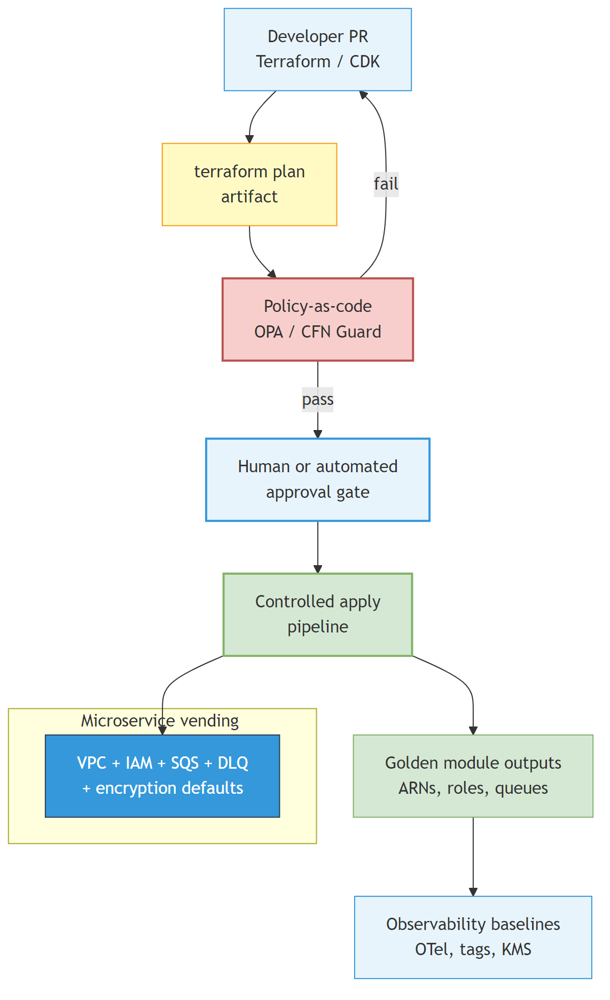

# Chapter 14: Infrastructure as Code at Scale

<div class="chapter-header">
  <h2 class="chapter-subtitle">From Repositories to Reliable Infrastructure APIs</h2>
  <div class="chapter-meta">
    <span class="reading-time">📖 58 min read</span>
    <span class="difficulty">🎯 Expert</span>
  </div>
</div>

## Abstract

At scale, **Infrastructure as Code (IaC)** ceases to be “scripts that provision” and becomes the **authoritative interface** between *platform engineering* and *product teams*-a **typed API** whose behaviors are **planned, reviewed, tested, and audited**. This chapter analyzes IaC through **software engineering epistemology**: modules as **abstraction boundaries**, state as **consistency challenge**, and policy engines (OPA/Sentinel/CloudFormation Guard) as **proof obligations** attached to every `plan`. We compare **Terraform**, **AWS CDK**, and **Pulumi** not ideologically but by **compositionality** (can modules be reasoned about locally?) and **blast radius** of change.

---

## 14.1 Theoretical framing: desired-state convergence

Let desired configuration \(D\) live in a versioned repo; actual infrastructure \(A(t)\) drifts via console edits and emergent autoscaler behavior. IaC tools implement **partial synchronisation maps** \(f: D \times A \rightarrow \Delta A\) minimizing cost subject to provider constraints.

**Definition 14.1 (Drift).** \(\delta = A \setminus f(D)\) in the provider’s observable model-**non-zero drift** is normal; **unmonitored drift** is negligence.

**Theorem sketch (informal).** Without continuous **plan-in-CI**, the probability of undeclared dependency edges approaches 1 as team count grows (**graph entropy** of undocumented edges).



*Figure 14.1: Infrastructure as Code as a governed API with policy gates and golden-path module outputs.*

---

## 14.2 Module design as *microservice* analog

Golden-path modules (VPC, EKS baseline, SQS+Lamdba “event sink”) should exhibit:

1. **Stable interface:** minimal required inputs; semantic versioning.  
2. **Encapsulated defaults:** encryption, logging, tagging opinions **inside** module.  
3. **Observable outputs:** ARNs and endpoints exported for **runtime** wiring.

This is **Inverse Conway** for infrastructure teams: platform shapes what’s easy.

---

## 14.3 Policy-as-code: three-layer model

| Layer | Example | Intent |
|-------|---------|--------|
| **Syntax / schema** | `terraform validate`, JSON Schema for CDK aspects | Ill-typed programs rejected |
| **Organizational policy** | OPA: “every S3 bucket must have KMS CMK” | Compliance |
| **Risk gates** | Size-of-diff, count of destructive ops | Blast capsule |

---

## Recipe 14.1: Microservice “vending machine” module (Terraform interface)

```hcl
variable "service_name" { type = string }
variable "owner" { type = string }

module "golden_service" {
  source  = "git::https://example.org/terraform-aws-golden-microservice.git?ref=v4.2.0"

  service_name = var.service_name
  tags = {
    Owner = var.owner
    Tier  = "customer-facing"
  }
  # wires SQS DLQ, OTel sidecar conventions, KMS keys - opinionated
}

output "invoke_role_arn" { value = module.golden_service.invoke_role_arn }
```

**Review checklist:** upgrade path for module major versions; state migration plan; multi-account role assumption pattern.

---

## 14.4 CDK / Pulumi interlude

**CDK** excels where **constructs** encode AWS best-practice defaults; **danger** is imperative escape hatches obscured in code review. **Pulumi** suits teams needing **familiar PL TDD**; risk is **unbounded dynamic resource creation**.

Decision rule: standardize **one control-plane language** for landing zones; allow app teams **scoped CDK apps** that compile to CloudFormation **only** through vetted constructs.

---

## 14.5 Limits of IaC

**Day-2 operations** (kernel tuning, JVM GC, data rebalancing) often elude declarative models. Supplement with **runbooks**, **controllers** (Operator pattern), and **SLO-driven automation**.

---

## 14.6 Synthesis

IaC scale is **social** as much as technical: reviewers must treat plans as **semantic diffs** with business impact. Connect outputs to **Observability 2.0** (Chapter 15) so promoted configs emit required telemetry by construction.

---

**Navigation:**
- [Previous: Chapter 13](13-chaos-engineering.md)
- [Next: Chapter 15](15-observability-2.md)
