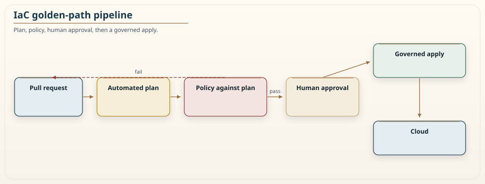
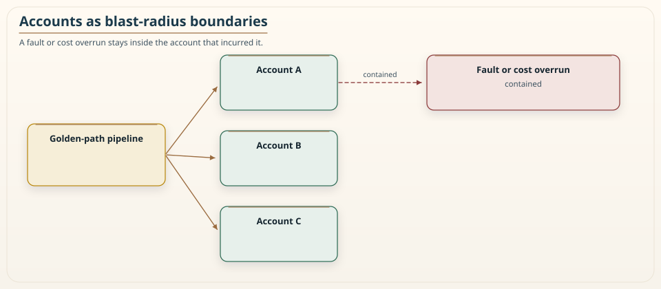

# Chapter 14: Infrastructure as Code at Scale

<div class="chapter-header">
  <h2 class="chapter-subtitle">The Definition Is the Truth. Reality Is Reconciled Toward It.</h2>
  <div class="chapter-meta">
    <span class="reading-time">📖 55 min read</span>
    <span class="difficulty">🎯 Expert</span>
  </div>
</div>

There is a moment in the life of every growing engineering organization when infrastructure as code stops being a convenience and starts being the only thing standing between order and chaos. In a small team, a few Terraform files or a handful of CloudFormation stacks are easy to reason about, and if something drifts, someone notices. At scale, with hundreds of services owned by dozens of teams across many accounts, the same tools that felt like a productivity boost become a source of subtle, expensive failure if they are not governed. This chapter is about that transition: not how to write your first Terraform module, which is well covered elsewhere, but how infrastructure as code behaves when there is a lot of it, owned by many people, changing every day.

The connecting thread to the rest of this book is that infrastructure modules are boundaries too. A Terraform module has an interface, a blast radius, an owner, and a rate of change, exactly like a service, and the same granularity questions apply. A module that is too coarse becomes a monolith that everyone edits and no one understands. A module that is too fine becomes a distributed monolith of infrastructure, where a single environment change touches twenty modules across ten repositories. The Khan Pattern's central question from Chapter 11, whether a boundary earns its cost, is as relevant to your infrastructure code as it is to your services. I am not restating that score here. I am using the same instinct: size the boundary around ownership and change, and treat a chatty interface as a smell.

## 14.1 The core idea: desired state, not scripts

The foundational shift that infrastructure as code represents is from imperative scripts to declarative desired state, and understanding this shift deeply is what separates teams that scale it from teams that fight it.

An imperative script says how: create this server, then attach this disk, then open this port. It is a sequence of steps, and it assumes a starting state. Run it twice and you may get two servers, or an error, because the script does not know what already exists. Imperative infrastructure is fragile at scale because the real starting state is never quite what the script assumed, and the number of possible starting states grows with the size of the estate.

A declarative definition says what: there should be one server of this type, with this disk, with this port open. The tool, Terraform or CloudFormation or Pulumi, is responsible for comparing that desired state to reality and computing the actions needed to converge them. Run it twice and, *when the provider is honest*, nothing happens the second time, because reality already matches the desired state. This property, that applying the same definition repeatedly converges to the same result and then stops, is idempotence, and it is the single most important property infrastructure as code gives you. It means the definition is the truth, and reality is continuously reconciled toward it.

I said when the provider is honest, because at scale you will meet the perpetual diff: a plan that never goes clean because a computed attribute, a default the API rewrites, or a buggy resource keeps proposing the same no-op change. That is not a reason to go back to scripts. It is a reason to pin provider versions, to `ignore_changes` only on the fields you have proven are noise, and to treat a dirty plan as a defect, not as weather.

CDK and Pulumi look more like programs than like HCL. They still compile to a desired-state graph, CloudFormation or the Pulumi engine, and they still have state. Writing `for` loops does not make you exempt from the rest of this chapter. It makes the graph harder to review if you are not careful.

The consequence at scale is profound. When the definition is the truth, you can review infrastructure changes the way you review code, in a pull request, before they touch anything. You can see the plan, the exact set of changes the tool intends to make, and approve or reject it. You get a history of who changed what and why. And you get the ability to recreate an entire environment from its definition, which turns disaster recovery from a heroic improvisation into a routine apply. None of this is available to a team running imperative scripts by hand, or to a team that still `apply`s from a laptop against production. All of it becomes essential once the estate is too large for any one person to hold in their head.

## 14.2 Modules as boundaries

Once you have more than a trivial amount of infrastructure, you factor it into modules, reusable units that encapsulate a piece of infrastructure behind an interface. This is the same modularity move that services make, and it has the same tradeoffs, which is why the granularity thinking from Chapter 11 transfers directly.

A good infrastructure module has the properties of a good service boundary. It has a clear, small interface: a handful of input variables and output values, not thirty knobs that expose every internal detail. It has a single responsibility: this module provisions a queue with its dead-letter queue and its alarms, not a queue and a database and a Lambda and half the VPC. It hides its internals, so consumers depend on the interface and not on how the module happens to implement it this month. And it has an owner, a team accountable for its correctness and evolution, because an unowned shared module rots the same way unowned shared code rots.

The failure modes are also the same. A module that is too coarse becomes an infrastructure monolith: a single giant module that provisions everything for an environment, which everyone has to edit and which no one can change safely, because the blast radius of any change is the entire environment. A module that is too fine creates a distributed monolith of infrastructure: so many tiny modules with so many interdependencies that a routine change ripples across a dozen of them, and the coordination cost of a simple update swamps the benefit of the decomposition. The Kinetic Efficiency intuition from the Khan Pattern has an analog here: if provisioning one logical thing requires threading values through many modules, the overhead of the boundaries is eating the value they were supposed to provide. `terraform_remote_state` used as a service bus is that overhead given a resource type.

The practical guidance is to size modules around a unit of ownership and change. A module should be something a team owns end to end and changes as a unit. If two pieces of infrastructure always change together, they probably belong in one module, which is the temporal-coupling argument from Chapter 1 and Chapter 11 applied to Terraform. If a module is edited by five teams for five unrelated reasons, it is a monolith wearing a module's name, and it should be split along the lines of who changes it and why.

### Recipe 14.1: Consume a golden-path module through a small, pinned interface

**Context.** A team needs a standard queue with a dead-letter queue, encryption, and alarms. They must not copy twenty resource blocks, and they must not track `main`.

**Solution.** One module, few variables, a version pin. Defaults for encryption and tags live inside the module, not in every caller.

```hcl
module "orders_queue" {
  source  = "app.terraform.io/acme/sqs-with-dlq/aws"
  version = "4.2.0"

  name  = "orders"
  owner = "checkout-team"
  # No public access, no raw AWS_REGION forks, no twenty optional knobs.
}
```

`ref=main` is a fleet-wide deploy the next time anyone applies. Pin a version. Upgrade on purpose. That is Section 14.8 in one line.


*Figure 14.1: The golden-path pipeline. Infrastructure changes never touch the cloud from a laptop. They flow through a pull request, an automated plan, a policy check against that plan, and a human approval before a governed apply, so that every change is reviewed, recorded, and reversible. A failed policy check returns to the pull request. It does not become a conversation after the database is gone.*

## 14.3 State is the thing that will hurt you

Every declarative infrastructure tool keeps a record of what it believes it has created, so it can compare desired state to reality and compute a plan. In Terraform this is the state file. CloudFormation keeps an equivalent inside the stack. Pulumi keeps a state store. At scale this record is the single most common source of serious infrastructure incidents, so it deserves direct and honest treatment.

The state file is a mapping between your definitions and the real resources they represent. It is authoritative: if the state says a resource exists and it does not, or the other way around, the tool computes a wrong plan, and a wrong plan applied to production is how a routine change deletes a database. Three disciplines keep state safe, and skipping any of them is a time bomb.

The first is **remote, locked, shared state**. Never keep state on a laptop. Store it in a shared backend, an S3 bucket with locking, Terraform Cloud, or an equivalent, so that the whole team sees the same truth and so that two people cannot apply at the same time and corrupt it. DynamoDB lock tables are the classic S3 pairing. Native S3 lock files exist now. Either works. None is optional. Without a lock, concurrent applies race, and the loser's changes are silently based on a stale view of reality.

The second is **state segmentation**. A single giant state file for the whole estate is both a performance problem, because every plan has to refresh everything, and a blast-radius problem, because a mistake in one corner can affect the whole file. Split state along the same lines you split modules and ownership: per-environment, per-service, per-team. Smaller states plan faster, fail smaller, and let teams work independently. This is the granularity argument yet again, now applied to state itself: too coarse and everyone contends on one file, too fine and you drown in cross-state references.

Terraform workspaces look like segmentation and usually are not. One codebase, one backend, a `-workspace` flag you can get wrong, and a prod apply that used the staging workspace is an incident with a clean git history. Prefer separate backends or separate directories whose names you cannot typo into each other as easily as `default` versus `prod`.

The third is **never editing state by hand** except as a last resort, and then only with the tool's own commands and a backup. Hand-editing the JSON to fix a discrepancy is the infrastructure equivalent of editing production data directly, and it goes wrong the same way. When state and reality diverge, prefer `import`, `removed`, and `moved` blocks, which reconcile them in code you can review, over surgery on the file. `terraform apply -target` is how you leave state half-converged on purpose. Treat it as an incident tool, not a workflow.

## 14.4 Policy as code: three layers of guardrail

At scale, you cannot review every infrastructure change by hand, and you cannot rely on every engineer remembering every rule. The answer is policy as code: encode the rules as automated checks that run in the pipeline, so that a change violating a rule is rejected before it applies, without a human having to catch it. Think of this in three layers, from cheapest and earliest to most expensive and latest.

The first layer is **static validation** of the definition itself, before any plan. `terraform fmt`, `validate`, tflint, Checkov on source. This catches syntax errors, formatting violations, and obvious misconfigurations, and it runs in seconds on every commit. It is the linting layer, and its job is to keep the obvious mistakes from ever reaching review.

The second layer is **policy checks against the plan**, which is the powerful one. Once the tool computes what it intends to do, a policy engine, OPA, Sentinel, CloudFormation Guard, examines that plan and enforces organizational rules: no storage bucket may be public, every resource must carry an owner tag, no database may be created without deletion protection, no security group may open the whole internet to a database port. Because these checks run against the plan, they see the actual intended change, including a destroy-and-recreate that looks like a one-line edit in source, so they can catch a change that is syntactically fine but violates a safety rule. This layer is where most of your real guardrails live, and it is the layer that lets you say yes to teams provisioning their own infrastructure while saying no, automatically, to the specific dangerous things.

The third layer is **detection of drift and violation in what is already running**, after the fact. Someone clicks in the console during an incident. Another system mutates a resource. Reality diverges from the definition. Continuous scanning, AWS Config, Control Tower, org-level SCPs, catches what the first two layers could not prevent. SCPs are not a substitute for plan policy. They are a wall the apply cannot climb even if the pipeline is bypassed. Drift findings need an owner and a deadline, the same way a chaos finding does, or they become wallpaper.

The security implication is worth stating directly, because infrastructure as code is where a single careless default becomes a fleet-wide exposure. A policy that forbids public storage buckets, enforced in layer two on every change across every team, prevents an entire class of breach that otherwise recurs forever, because it only takes one engineer, once, forgetting one setting. Encoding the rule once and enforcing it automatically is strictly better than training thousands of engineers to remember it, and it is the single highest-leverage security investment a platform team can make. Chapter 7's "secrets never live in source control" is a rule. This chapter is how that rule still holds when a hundred teams can open a bucket.

```rego
# Layer-two sketch: deny a plan that makes an S3 bucket public.
# Run against terraform show -json, not against the HCL, or a
# dynamic block will walk around you.

package iac.s3

deny[msg] {
  some change in input.resource_changes
  change.type == "aws_s3_bucket_public_access_block"
  change.change.after.block_public_acls == false
  msg := sprintf("%s would allow public ACLs", [change.address])
}
```

A policy that only reads `.tf` files will miss the module you did not open. A policy that reads the plan sees the graph the cloud will get.

## 14.5 The golden path and self-service

The organizational payoff of infrastructure as code at scale is self-service: teams provision their own infrastructure without filing a ticket and waiting for a central team, which removes the bottleneck that kills delivery speed in growing organizations. But naive self-service, handing every team raw access to the cloud and the full expressive power of the tooling, produces an unmanageable sprawl where every team solves the same problems differently and every security rule is optional. The reconciliation of these two pressures, speed and control, is the golden path. Chapter 2 already placed that path in Team Topologies: the platform team paves it; stream-aligned teams walk it.

A golden path is the paved, supported, well-lit way to do a common thing. It is a curated set of modules and a pipeline that make the right way the easy way. A team that wants a standard service does not assemble it from raw resources; they consume a golden-path module that provisions the service with the organization's defaults already baked in: encryption on, logging on, sensible alarms, correct tags, deletion protection where it matters. The team gets speed, because they did not have to figure any of that out, and the organization gets consistency and safety, because the defaults are correct and enforced.

The important design principle is that the golden path is a path, not a wall. Teams with genuine reasons to step off it should be able to, through an escape hatch that is available but visible and governed. The worst platform teams try to forbid every deviation, which drives teams to work around the platform entirely, and the second worst impose no path at all, which produces chaos. The good ones make the paved road so convenient that stepping off it is a deliberate, reviewed choice rather than the default, and they treat frequent detours as feedback that the path needs to be widened rather than as misbehavior to be punished.

This connects directly to the maturity model in Chapter 20. An organization at a low maturity level has no golden path, and every team improvises. As it matures, the golden path emerges, self-service becomes safe, and the platform team shifts from doing the work to curating the path that lets others do the work safely. The endpoint is not a central team that provisions everything, which is a bottleneck, nor total anarchy, which is a breach waiting to happen, but a governed self-service platform where the easy way is the safe way.

## 14.6 Testing and change safety for infrastructure

Infrastructure code deserves the same testing discipline as application code, and at scale it is not optional, because an untested infrastructure change can take down an environment as thoroughly as any bug.

The cheapest and most important safety mechanism is the **plan review**. Because declarative tools compute the exact set of changes before applying them, a human, or a policy engine, can inspect the plan and catch the change that intends to destroy and recreate a database rather than modify it in place. Destroy-and-recreate is the infrastructure change that most often causes an outage, because it reads as a small edit in the source but implies data loss in the plan, and only the plan reveals it. Making plan review mandatory, and training reviewers to look specifically for replacement and deletion actions, `must be replaced`, `destroy`, prevents a large fraction of serious incidents. A policy that fails the pipeline on an unapproved `delete` of a tagged production database is layer two earning its keep.

Beyond plan review, test modules in isolation by applying them to a throwaway environment and asserting that the resources come up correctly and that the module's outputs are what consumers expect. This is the infrastructure analog of a unit test, and it catches the module that works in the author's account but fails in a fresh one because it assumed something that was only true locally. For the riskiest changes, apply to a staging environment that mirrors production closely enough to be informative, and where appropriate run a chaos experiment from Chapter 13 against the newly provisioned infrastructure to confirm it degrades the way the design intended.

The deployment discipline that ties this together is **progressive rollout**. Do not apply a risky infrastructure change to the whole fleet at once. Apply it to one cell, or one non-critical environment, watch, and widen only if the outcome is good. This is the same canary logic the Fulcrum loop from Chapter 11 applies to service changes, and it applies to infrastructure for the same reason: the blast radius of a mistake should be bounded by the rollout, not by the size of the estate. Chapter 13's abort idea belongs here too. If the apply is automated, the apply must be stoppable.

## 14.7 Secrets, sensitive state, and the things you must not commit

Section 14.3 warned that the state file will hurt you, and there is a specific way it hurts that deserves its own treatment because it is a security problem rather than an operational one. The state file does not only record which resources exist. It frequently records their attributes, and some of those attributes are secrets. A database password passed as an input, an access key generated for a resource, a private certificate, all of these can land in the state file in plaintext. Marking a variable `sensitive` hides it from the terminal. It does not remove it from state. The state backend is one of the most sensitive stores in your estate, whether you intended it to be or not.

The consequences follow directly from Chapter 7's treatment of secrets. If the state file contains secrets, then read access to the state backend is equivalent to read access to those secrets, and the list of people and systems that can read state is usually far longer than the list you would consciously grant access to a password. The state backend must therefore be treated as a secret store: encrypted at rest, access-controlled to the few identities that genuinely need it, and audited so you know who read it. A state bucket with broad read access is a credential leak waiting to be discovered.

The deeper fix is to keep secrets out of the definitions in the first place, so they have less opportunity to reach state at all.

**Never write a secret literally into a definition.** A password hardcoded in a Terraform file is committed to version control the moment the file is, and version-control history is effectively permanent.

**Reference secrets from a dedicated secret store rather than passing them through.** Have the resource read its secret from a secrets manager at creation or run time, so the secret is a reference in your definition rather than a value, and so it never needs to be an input that flows into state.

**Prefer generated, short-lived credentials over long-lived ones the definition must carry.** Workload identity, IRSA, an instance role, is one your infrastructure code never has to hold, which removes it from both the definition and the state.

There is a broader principle here that the rest of this chapter has been circling. Infrastructure as code concentrates power. A single pipeline can provision or destroy an entire estate, a single module is consumed by hundreds of services, and a single state backend holds the keys to everything it describes. Concentration of power is exactly what makes the automation valuable and exactly what makes it dangerous, and the whole discipline of governing infrastructure at scale is the discipline of enjoying the leverage without being destroyed by it. Guarding the state backend as a secret store is one instance of that discipline; encoding safety rules as policy is another; bounding rollouts is a third. They are all the same idea, which is that leverage must be matched by control.

## 14.8 Structure at the largest scale: accounts, regions, and module versions

At the largest scale, the unit of isolation stops being the module or the state file and becomes the cloud account itself. Organizations running hundreds of services do not put them all in one account, because an account is a natural blast-radius boundary: a mistake, a compromise, or a runaway cost in one account is contained by the account boundary and cannot *directly* reach the others. This is the same cell thinking from Chapter 12, applied one level up, to the structure of the cloud estate rather than the structure of a single service.

I said directly. Shared organization trails, shared billing, a compromised CI role that can assume into every account, and a module everyone pins to the same broken version are holes in the wall. An account is a cell. It is not magic.


*Figure 14.2: Accounts as blast-radius boundaries at estate scale. Each account is a self-contained container for a set of infrastructure, with its own limits, its own access controls, and its own failure domain. Arranging the estate as many bounded accounts rather than one large shared account means that a mistake or a breach in one is walled off from the rest, exactly as cells wall off failures within a single service. The infrastructure-as-code pipeline provisions into each account through the same governed golden path, so the isolation between accounts does not come at the cost of consistency across them: every account is built from the same reviewed, version-pinned modules with the same enforced policies.*

Provisioning consistently across many accounts is where the golden path and versioned modules become essential rather than merely nice. Two structural practices make it work.

The first is a **baseline that every account receives**. When a new account is created, it should be provisioned automatically with the organization's non-negotiable foundations: logging and audit trails turned on, security baselines applied, network structure established, guardrail policies attached. This baseline is itself infrastructure as code, Account Factory, Control Tower, a pipeline you own, and applying it automatically to every account is what keeps a large estate consistent instead of letting each account drift into its own bespoke configuration. An account that is created by hand and configured ad hoc is the estate-scale version of the unowned module that rots.

The second is **disciplined module versioning**, because at scale a shared module has many consumers and a change to it has a blast radius measured in teams. If every consumer always pulls the latest version of a module, then a defect published to that module propagates to everyone on their next apply, which is an infrastructure-scale version of the fleet-wide deployment failure that Chapter 13 warned about. Publish modules as versioned artifacts and have consumers pin to specific versions, upgrading deliberately rather than being upgraded involuntarily. A module change then rolls out the way a service change should: to a few consumers first, watched, and widened only when it proves safe. Pinning versions turns the shared module from a single point of fleet-wide failure into a dependency that each team adopts on its own schedule, which is exactly the independence the granularity thinking in this book keeps arguing for.

These two practices, an automatic baseline per account and versioned modules pinned by consumers, are what let an organization have both the isolation of many accounts and the consistency of a single governed way of building. Without them, a large multi-account estate becomes either a sprawl of inconsistent snowflakes or a fragile monoculture where one bad module change breaks everyone at once. With them, the estate scales the way the rest of this book asks systems to scale: bounded blast radius, independent adoption, and a paved path that makes the safe choice the easy one.

## 14.9 Summary

Infrastructure as code changes character at scale. The declarative, idempotent, desired-state model is what makes a large estate governable at all, because it makes the definition the truth and reality a continuously reconciled consequence of it, when the provider is honest and the plan is clean. Treat infrastructure modules as boundaries with the same granularity discipline as services: size them around ownership and change, keep their interfaces small, and avoid both the infrastructure monolith and the distributed monolith of over-fine modules.

Respect the state file as the thing most likely to hurt you: keep it remote, locked, and segmented, do not pretend workspaces are isolation, and do not edit it by hand. Enforce rules with policy as code in three layers, static validation, policy against the plan, and drift detection on what is running, so that safety does not depend on every engineer remembering every rule, and so that one careless default cannot become a fleet-wide exposure. Offer self-service through a golden path that makes the safe way the easy way, with a governed escape hatch rather than a wall. Apply the same change-safety discipline you apply to code: mandatory plan review with special attention to replacement and deletion, module tests, staging, and progressive rollout. Treat the state backend as a secret store, because it often is one.

Done well, infrastructure as code at scale is what lets a large organization move fast without breaking the things that must not break, and it is the substrate on which the observability, resilience, and governance practices in the surrounding chapters actually run. The next chapter turns to observability, because an estate you can provision but cannot see is an estate you cannot operate.

---

**Navigation:**
- [Previous: Chapter 13](13-chaos-engineering.md)
- [Next: Chapter 15](15-observability-2.md)
