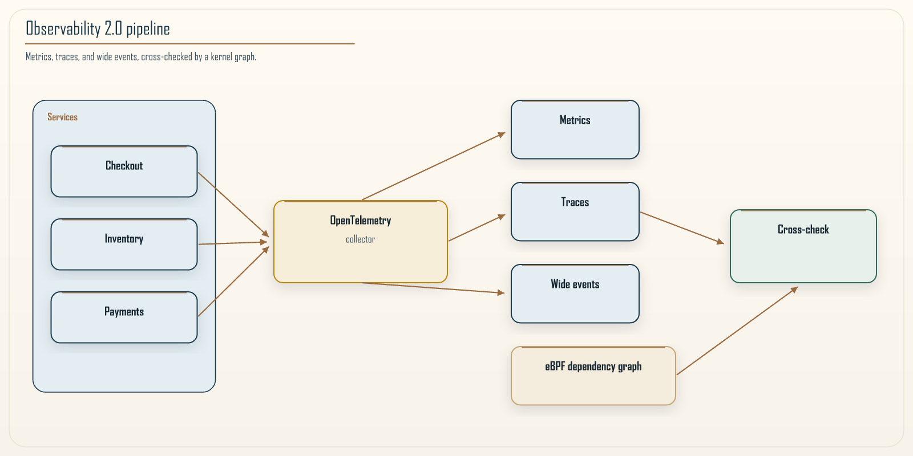
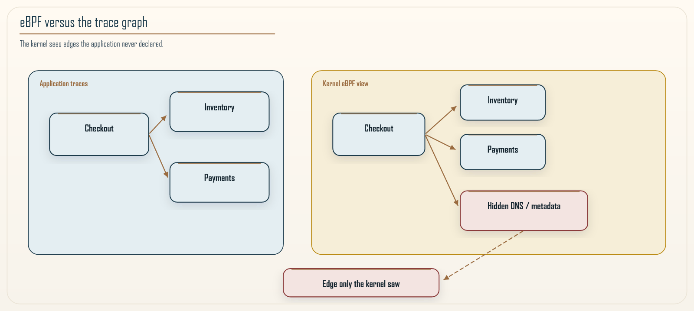

# Chapter 15: Observability 2.0: Telemetry, Causality, and Cost

<div class="chapter-header">
  <h2 class="chapter-subtitle">Spend the Budget on Answers. Stay Sighted When It Counts.</h2>
  <div class="chapter-meta">
    <span class="reading-time">📖 55 min read</span>
    <span class="difficulty">🎯 Expert</span>
  </div>
</div>

There is an uncomfortable truth about observability that vendors do not put on their pricing pages: you cannot afford to observe everything, and if you try, the observability bill will rival the bill for the system you are observing. I have seen teams spend more on their logging pipeline than on the production fleet it watched, and I have seen teams so afraid of that bill that they turned off the telemetry they needed during the one incident where it would have saved them hours. Observability at scale is not a technical problem of collecting signals. It is an economic problem of getting the most understanding per dollar, under a budget, without going blind exactly when you need to see.

That framing is what the phrase Observability 2.0 means in this chapter. The first generation of observability was about collecting the three signals, metrics, logs, and traces, and putting them on dashboards. Chapter 8 already did that work: RED and USE, structured logs bound to W3C Trace Context, OpenTelemetry as the vendor-neutral emit path, burn-rate pages, and the honest limits of eBPF versus a sidecar. That chapter is now assumed. The second generation is about turning those signals into causal understanding cheaply enough to sustain, and about designing the collection itself as a deliberate tradeoff rather than a reflex to capture more. The earlier protocol and messaging chapters told you what to measure at the boundaries. This chapter is about how to compose those measurements into answers without bankrupting yourself, and how to keep the answers honest.

## 15.1 What observability actually means

The word is borrowed from control theory, and the original meaning is worth keeping, because it is more precise than the marketing usage. A system is observable if you can infer its internal state from its external outputs. Software borrowed the word more loosely than Kalman did. We are not reconstructing a full state vector. We are reconstructing the questions that matter from the telemetry we chose to emit. For a distributed system, the internal state is what every service is doing and how they are interacting, and the external outputs are those signals. Observability is the degree to which you can reconstruct the former from the latter.

This definition has a sharp consequence that the dashboard-centric view misses: observability is a property of the pair, the system and its instrumentation, not of the tooling alone. You can buy the best observability platform in the world and still have an unobservable system, because the services do not emit the signals that would let you infer their state. And you can have a modestly tooled system that is highly observable because it emits exactly the right signals at the right boundaries. The goal is not to buy observability. It is to design the system and its telemetry so that the states you care about are inferable from outputs you can afford to collect.

The states you care about are, in the end, the ones that map to customer experience and to the health of the boundaries this book cares about. Is the checkout path succeeding? Is a particular tenant being served? Which boundary is adding the latency? These are the questions observability exists to answer, and every telemetry decision should be judged by whether it makes these questions cheaper to answer, not by whether it captures more data.


*Figure 15.1: A unified telemetry plane. Services emit traces, metrics, and structured wide events through an OpenTelemetry collector that batches, samples, and routes them to their backends. On the right, an independent dependency graph derived from kernel-level eBPF observation cross-checks the graph that the traces imply. When the two disagree, the difference is itself a finding: a connection the traces did not capture. The point of the diagram is that no single source is trusted alone. The collected signals and the kernel view check each other. The kernel view is still not omniscience. It sees sockets. It does not see your domain.*

## 15.2 Traces are evidence, not verdicts

Distributed traces are the signal most specific to microservices, because they follow a single request across service boundaries and record the order and duration of the work at each hop. A trace is a tree of spans, and it encodes a partial order: this span happened before that one, this call waited on that dependency. For debugging a latency problem or a failure that crosses services, nothing else comes close.

Hold traces at the right epistemic distance, because teams routinely over-trust them. A trace shows you what happened, not why. It shows that the checkout span waited 800 milliseconds on the inventory span, which is a candidate explanation for a slow checkout, but it does not prove that inventory was the root cause. Maybe inventory was slow because a shared database was saturated by a third service that does not even appear in this trace. The trace narrows the search. It does not end it.

Clock skew, which Chapter 8 already warned about, makes this worse. Duration measured on one host is trustworthy. A waterfall that appears to travel backward across hosts is often NTP, not causality.

The discipline that follows is to treat a trace as evidence to be corroborated, not a verdict to be acted on. When you diagnose an incident from traces, cross-check against the other records: what deployed recently, what changed in configuration, what the infrastructure metrics show for the shared dependencies the trace touched. The trace tells you where to look. The corroborating evidence tells you whether what you found is cause or coincidence. This is the same rigor Chapter 13 applied to chaos results and Chapter 11 applied to a granularity score: a single signal, however detailed, is a hypothesis until something independent confirms it. I am not restating that score here.

## 15.3 Wide events: one rich record beats many thin logs

The traditional logging approach scatters information across many small log lines: one line when a request arrives, another when it calls a dependency, another when it finishes, each with a fragment of context. To reconstruct what happened to a request, you stitch these fragments together after the fact, which is slow, expensive, and often impossible because the fragments do not share enough context to be joined reliably. Chapter 8's `trace_id` on every line is the join key that makes stitching possible. A wide event is the stronger move: stop scattering.

The wide-event approach inverts the thin-log habit. Instead of many small lines, emit one structured, rich event per unit of work, carrying the context you might want to query later as fields on that single record. A checkout request produces one event with the trace identifier, the tenant, the saga identifier, the cell, the relevant feature flags, the duration, and the outcome, all in one place.

```json
{
  "ts": "2026-08-21T18:00:00.123Z",
  "trace_id": "4bf92f3577b34da6a3ce929d0e0e4736",
  "service": "checkout",
  "tenant_id": "t-8821",
  "saga_id": "a9182736-2b1c-4f3d-9a0e-77c1d2e3f4a5",
  "cell_id": "cell-3",
  "flag_checkout_v2": true,
  "duration_ms": 87,
  "outcome": "success"
}
```

The power of this shows up when you query. Because every event carries high-cardinality fields such as tenant and cell, you can ask questions after the fact that you did not anticipate when you built the dashboards: show me the p99 latency for tenant `t-8821` in `cell-3` for requests with this feature flag on, over the last hour. With scattered thin logs that query is a research project. With wide events in a columnar store it is a single query. High cardinality, the very thing Chapter 8 told you never to put on a metric, is exactly what lets you slice by the dimension that turns out to matter during an incident, and that dimension is almost never the one you predicted in advance.

Do not send this record to the metrics backend. Do not send the whole request body to the trace backend. X-Ray, Tempo, and their peers store spans. A wide event belongs in a log or columnar store that can filter on fields. Mixing the two is how you pay twice and query neither well.

The tradeoff is storage and the temptation to put everything in the event. Keep the fields to the ones you would actually query, resist the urge to dump entire request bodies, and be deliberate about the high-cardinality fields you include, because each one is a dimension you can slice by later and each one also costs. The wide event is a designed record, not a dumping ground.

## 15.4 Sampling: the economics made explicit

You cannot keep every trace at scale. A busy system produces billions of spans a day, and storing all of them costs more than the insight is worth, because the overwhelming majority of traces are boring: a successful request that behaved exactly like the last million successful requests. Sampling is how you spend your storage budget on the traces that teach you something, and getting the sampling strategy right is most of what separates an affordable observability practice from an unaffordable one.

Chapter 8 already named the three strategies. Head sampling decides at the start. Tail sampling decides at the end. Parent-based sampling is the rule that keeps the tree intact. I will not redefine them. This section is the economics, and the trap that makes tail sampling a lie.

The naive approach is head sampling: at the start of a request, flip a weighted coin and decide whether to keep the trace, for example keeping one in a hundred. This is cheap to implement and it bounds cost, but it has a fatal flaw for debugging. The rare failure you most want to see, the one-in-ten-thousand request that errored, is almost certainly discarded, because the sampling decision was made before anyone knew the request would be interesting. Head sampling keeps a representative sample of the boring and throws away the interesting, which is exactly backwards from what you want.

The better approach is tail sampling: buffer the trace until the request completes, then decide whether to keep it based on what actually happened. Now you can encode the policy you actually want: always keep traces that errored, always keep traces slower than a threshold, always keep a small representative sample of the normal ones for baseline, and drop the rest. Tail sampling costs more to operate, because you have to hold traces in memory until they finish and run the decision logic, but it spends your storage budget on the traces that carry information. The rule of thumb is to state your policy in terms of the questions you need to answer: if you need to debug every server error, retain every server error, and let the routine successes be sampled thin.

Two traps turn that policy into theater.

The first is sampling twice. If the SDK already dropped 99 percent of traces at the process, the collector never sees the error. Tail sampling only works on the traces it receives. Application code must export the full tree, or a faithfully parent-based decision from a gateway that itself sends everything to the collector, and let the collector be the only place that drops. Chapter 8's edge rule still holds: do not honor an untrusted client `traceparent` as the thing you sample on.

The second is a fleet of collectors that do not stick a trace to one instance. Tail sampling groups spans by trace identifier in memory. Two replicas that each saw half the tree will both decide on an incomplete trace, usually to drop it. If the collector is replicated, route by trace identifier, the loadbalancing exporter or an equivalent, so one process sees the whole tree. That collector is a production dependency. If it sheds the buffer under load, you lose exactly the traces you bought the machinery to keep.

The honest framing is that sampling is a statistical design problem, not a config value. You are trying to minimize stored bytes subject to a constraint that you almost never miss a rare failure. The two goals trade off, and the right point on the curve depends on your failure rate, your budget, and how much a missed failure costs you in debugging time. Treat it as a decision to revisit as traffic grows, not a default to set once and forget.

### Recipe 15.1: An OpenTelemetry collector with tail sampling to X-Ray

**Context.** Services already emit OTLP. You want errors and slow traces kept, a thin baseline of the rest, and AWS X-Ray as the trace backend. Wide events are a separate pipeline. This recipe does not send them to X-Ray.

**Solution.** Receive OTLP, decide at the tail, then batch what you kept. Applications export without a local head sample, or honor a parent that already chose to send. `tail_sampling` and the `awsxray` exporter ship in **OpenTelemetry Collector Contrib**, not the core `otelcol` binary. A stock core build will refuse this config. Use `otelcol-contrib`, or an AWS-distro collector that includes those components.

```yaml
receivers:
  otlp:
    protocols:
      grpc:
      http:

processors:
  memory_limiter:
    check_interval: 1s
    limit_mib: 512
    spike_limit_mib: 128
  tail_sampling:
    decision_wait: 10s
    policies:
      - name: keep-all-errors
        type: status_code
        status_code:
          status_codes: [ERROR]
      - name: keep-slow
        type: latency
        latency:
          threshold_ms: 500
      - name: baseline-sample
        type: probabilistic
        probabilistic:
          sampling_percentage: 2
  batch: {}

exporters:
  awsxray:
    region: us-east-1

service:
  pipelines:
    traces:
      receivers: [otlp]
      processors: [memory_limiter, tail_sampling, batch]
      exporters: [awsxray]
```

Read the policy list as a sentence: keep every span tree the instrumentation marked `ERROR`, keep everything slower than half a second, and keep two percent of everything else as a baseline. Policies are an or. A trace that matches any one is kept. Everything else is dropped.

Four operational notes, because this YAML is otherwise a footgun.

**Order.** Tail-sample, then batch. Batching first does not break grouping, but it wastes memory on spans you are about to discard. Put `memory_limiter` first so the collector fails by dropping new work rather than by OOM-killing the process that holds your incident evidence.

**Status is not HTTP.** `status_code: ERROR` is the OpenTelemetry span status. A handler that returns 500 and never calls `record_exception` / `set_status` looks like a success to this policy. Recipe 8.1 already required marking the span. This recipe is why.

**Wait is a completeness bet.** `decision_wait: 10s` means a saga or a messaging hop that finishes later is decided incomplete. Raise it and you buy memory. Lower it and you sample fragments. For long-running work, do not pretend this collector is your audit log.

**Propagate the standard, starve the baggage.** W3C Trace Context on every synchronous hop, or the tree fragments at the first ignorant service and tail sampling sees a stump. Baggage is not authenticated and is visible to every hop, which Chapter 8 already said. Put tenant or deploy in baggage if you must. Never put credentials, personal data, or anything you would not put on an untrusted network. Baggage also costs bandwidth on every hop. Be boring.

Lambda is the exception that does not take this recipe whole. A function that lives for 100 milliseconds cannot host a 10-second tail buffer. Sample at the platform, ADOT layer or X-Ray SDK, and accept that the economics are coarser.

## 15.5 The eBPF cross-check and surprise dependencies

Traces show you the dependencies your code knows it has, the calls it deliberately makes and instruments. They are blind to the dependencies your code does not know about: the DNS lookup a library does under the hood, the connection to a metadata service, the synchronous call a framework makes on your behalf that you never wrote and therefore never instrumented. These uninstrumented dependencies are a frequent cause of mysterious latency and mysterious failures, precisely because they are invisible to the signal you trust most.

This is where kernel-level observation earns its place. Tools built on eBPF observe network activity at the operating-system level, below your code, so they see every connection a process actually makes, instrumented or not. Comparing that graph to the graph your traces imply is one of the highest-value cross-checks in observability. When the kernel graph shows an edge the traces do not, you have found a connection your instrumentation missed. That is often the hidden synchronous coupling that turns a boundary into a distributed-monolith fragment, the same smell Chapter 2 diagnosed and that Kinetic Efficiency in Chapter 11 will punish if the call sits on the customer path. It is not Semantic Distinctness. That signal comes from pull requests, not from sockets.

Do not crown the kernel "ground truth" and stop thinking. eBPF sees five-tuples. It does not see that the destination was "inventory" rather than a sidecar, a node-local agent, or kube-dns. Encrypted traffic will not give you the HTTP route. Lambda, many Windows nodes, and anything whose kernel you do not control will not grow a probe, which Chapter 8 already said. Privileged kernel access is a security surface. And a connection to the instance metadata service is expected plumbing, not a new microservice. Filter the edges you already account for, or the cross-check becomes a firehose of noise.


*Figure 15.2: Why the kernel view catches what traces miss. Application traces, on one side, record only the calls your code knows it makes and was instrumented to report, so a dependency introduced by a library or a framework beneath your code is simply absent from them. Kernel-level eBPF observation, on the other side, sees every connection the process actually opens, because it watches below the application entirely. The value is in the comparison: an edge that appears in the kernel graph but not in the trace graph is a real connection your instrumentation never knew about, and once you have named it and decided it sits on the request path, it is exactly the kind of hidden synchronous coupling this book keeps warning about. The two sources are not redundant. Each sees a class of dependency the other cannot.*

## 15.6 Telemetry is a data-protection problem too

High-cardinality wide events are powerful because they carry rich context, and that same richness makes them a privacy liability, because the context often includes or implies personal data. A telemetry pipeline that captures tenant identifiers, user cohorts, and request details is a concentrated store of sensitive information, frequently flowing to third-party vendors, and it is easy to build a serious compliance exposure by accident while trying to improve observability. Chapter 7 already told you not to put secrets in logs. This section is the rest of the payload.

Three practices keep this in check. Classify telemetry fields the way you classify any data, so you know which fields carry personal or sensitive information and can treat them accordingly. Tokenize identifiers before they leave your trust boundary for an external vendor, so the vendor stores a stable but meaningless token rather than the real tenant or user identity. A raw hash of an enumerable tenant id is still a join key for anyone who can hash the same list. HMAC with a key that does not leave your boundary, or a real tokenizer. And respect data residency by routing telemetry to storage in the correct region, because telemetry that crosses a residency boundary is a violation whether or not anyone intended it. The collector can route on an attribute. The default of "one global SaaS project" cannot.

The uncomfortable reality is that the observability pipeline is often the least-governed place personal data flows in a system, precisely because it feels like operational plumbing rather than a data store, and it deserves the same scrutiny as the production database.

## 15.7 Observability for the boundaries this book cares about

Everything so far applies to any distributed system. There is a specific payoff for the granularity theme of this book worth making explicit, because observability is where the runtime half of Chapter 11's signals come from.

Kinetic Efficiency is a direct product of your tracing pipeline. Chapter 11 computes it from the same spans you collect for debugging. I am not restating that definition here. The practical claim is smaller and more useful: if you have designed tracing well, you get the efficiency signal without a second instrumentation project. That is one of the reasons the Khan Pattern is adoptable at all. Its most expensive runtime input rides on infrastructure teams already build for other reasons. If tracing is absent, that signal cannot be measured. Chapter 11 already said so.

The dependency graph, whether from traces or from the eBPF cross-check, is the raw material for spotting the boundaries that are chatty or hidden. A boundary that appears in the kernel graph with heavy traffic but was supposed to be asynchronous is a candidate distributed-monolith fragment, and observability is how you find it before a score formalizes the concern. Observability shows you the runtime behavior request by request. Chapter 11 summarizes the part of that behavior it is willing to score. They are two views of the same estate, not two products.

The connection to governance is the last link. The maturity model in Chapter 20 treats observability as a precondition for the higher levels, because you cannot govern what you cannot see. A team that wants to gate boundaries on the Chapter 11 score needs the tracing that produces the efficiency signal, and a team that wants to run the automated Fulcrum loop needs the outcome metrics, latency, errors, and cost, that the loop verifies against. Observability is not a separate concern bolted onto the side of the architecture. It is the sensory system that every governance practice in this book depends on.

## 15.8 Retention tiers and the cost curve

Sampling decides what you keep. Retention decides how long you keep it, and it is the other half of the observability economics, because the cost of telemetry is not only the cost of ingesting it but the cost of storing and indexing it for as long as it remains queryable. Treating all telemetry as if it must be instantly queryable forever is the single most common way observability bills spiral, and the fix is to recognize that different telemetry earns its keep over different timescales.

The useful model is tiers, borrowed from the same storage-class thinking that Chapter 14 applied to infrastructure. Telemetry moves through hot, warm, and cold tiers as it ages, and the cost per byte falls sharply at each step in exchange for slower access.

**Hot.** The most recent telemetry, minutes to a few days old, kept in fast, indexed storage where any query returns in seconds. This is what you use during an active incident, and it is the most expensive per byte, so it holds the least data for the shortest time. The overwhelming majority of investigation happens here, on recent data, which is why paying for speed on recent data and not on old data matches spend to value.

**Warm.** Telemetry days to weeks old, kept in cheaper storage that is still queryable but slower. This is where you go for trend analysis, for comparing this week to last week, and for the occasional investigation that reaches back past the hot window. The access latency is acceptable because the queries are not made under incident pressure.

**Cold.** Telemetry weeks to months or years old, kept in archival storage for compliance and rare forensic need, cheap to store and slow and sometimes costly to retrieve. You keep it because a regulator or a security investigation may demand it, not because you query it routinely, so you optimize entirely for storage cost and accept that retrieving it is a deliberate, occasional act.

The design decision for each signal is how quickly it should fall through the tiers, and the honest way to make it is to ask how far back you actually reach for that signal under real conditions. Traces are almost always investigated within days, so they can age out of hot storage quickly. X-Ray's own retention is measured in tens of days, not years; do not pretend the exporter is your archive. Aggregate metrics that drive trend analysis justify a longer warm life. Audit-relevant events may be legally required to survive for years in cold storage regardless of whether anyone ever reads them. Set these tiers deliberately per signal, review them as volume grows, and the observability bill becomes a set of conscious choices rather than a surprise that arrives with the invoice.

## 15.9 A worked diagnosis: narrowing from symptom to cause

The techniques in this chapter are easier to trust when you see them combine on a single problem, so here is a diagnosis end to end, in the shape a real incident takes. The symptom is a page: checkout success rate for one region has dropped below its objective, and the error budget is burning fast.

The first move is not to open a trace. It is to consult the metrics from Chapter 8 to establish scope, so you know how much of the system is affected before you go deep. The RED metrics show the elevated error rate is confined to checkout, not fleet-wide, and confined to one region. That scoping matters, because it already rules out a global cause such as a shared dependency everyone uses and points toward something regional. This is the corroboration discipline of Section 15.2 applied before you ever look at a trace: metrics narrow the space so the trace search is not a fishing expedition.

The second move uses the wide events of Section 15.3 to slice by the dimension that matters. Because every checkout event carries tenant, cell, and feature-flag fields, a single query asks whether the failures concentrate on a particular cell or a particular flag rather than spreading evenly. Suppose the failures cluster in one cell and only for requests with a recently enabled flag. That is a hypothesis with a shape: a specific change, in a specific blast-radius boundary, affecting a specific slice of traffic. No dashboard built in advance would have had exactly that breakdown, but the high-cardinality event let you construct it in the moment, which is the entire argument for wide events.

The third move pulls the traces that Section 15.4's tail sampling made sure you kept, the ones that errored, and reads them as evidence rather than verdict. The error traces show the checkout span failing on a call to a downstream service that the new flag path introduced. This is a candidate cause, and it is consistent with the wide-event slice, but Section 15.2 warns against stopping here. The fourth move corroborates: the eBPF cross-check from Section 15.5 confirms that the flag path opened a connection the previous path did not have, an edge that appears in the kernel graph and lines up with the failing span. Now three independent sources agree, metrics on scope, wide events on the slice, traces and kernel view on the mechanism, and the diagnosis is no longer a guess. The fix is to disable the flag, which Chapter 9 already treated as a blast-radius tool for testing in production, an instant, deploy-free action, and the error budget stops burning.

The point of walking through this is that no single signal solved it. Metrics scoped it, wide events sliced it, traces proposed a mechanism, and the kernel view confirmed the mechanism was a real connection. Each signal did the job it is good at, and the diagnosis emerged from their agreement rather than from any one of them alone. That is what Observability 2.0 means in practice: not more data, but composable signals that check each other, spent under a budget, arranged so the answer is affordable to reach.

## 15.10 Summary

Observability is the property that lets you infer a system's internal state from its external outputs, and at scale it is fundamentally an economic problem: maximize understanding per dollar under a budget, and do not go blind when you most need to see. It is a property of the system and its instrumentation together, not of the tooling alone, so design services to emit the signals that answer the questions you actually ask, which are questions about customer experience and about the boundaries you govern.

Hold traces as evidence, not verdicts, and corroborate them with change records and infrastructure metrics before acting. Prefer wide events, one rich structured record per unit of work, over scattered thin logs, because high-cardinality fields let you slice by the dimension that turns out to matter during an incident. Treat sampling as a statistical design problem and prefer tail sampling, which spends your storage budget on the errors and slow requests that carry information rather than on the routine successes that do not, and only after the collector has actually seen the whole tree. Cross-check application traces against kernel-level dependency graphs to find the connections your instrumentation missed, then name those edges before you treat them as architecture. And treat the telemetry pipeline as the data-protection surface it is, because it is often the least-governed place sensitive data flows.

For this book specifically, observability is where the runtime efficiency signal comes from and where hidden coupling first becomes visible, which makes it the sensory foundation for the whole governance story. The next chapter turns to agentic AI, where the same discipline of measuring, bounding, and governing applies to a system whose control plane is probabilistic rather than deterministic, and where silent degradation is the failure mode observability exists to prevent.

---

**Navigation:**
- [Previous: Chapter 14](14-infrastructure-as-code-at-scale.md)
- [Next: Chapter 16](16-agentic-ai-architectures.md)
