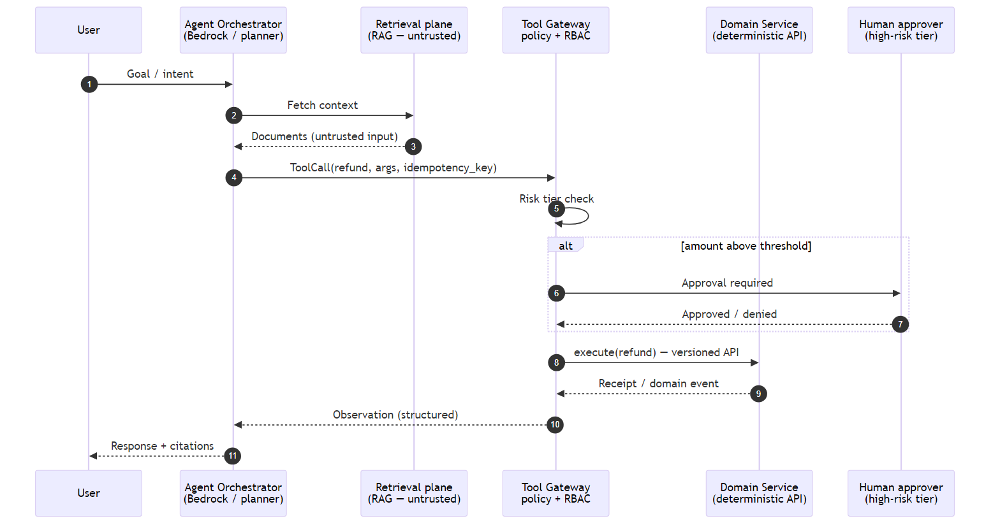

# Chapter 16: Agentic AI Architectures in Deterministic Systems

<div class="chapter-header">
  <h2 class="chapter-subtitle">When Probabilistic Control Planes Meet Hard Invariants</h2>
  <div class="chapter-meta">
    <span class="reading-time">📖 58 min read</span>
    <span class="difficulty">🎯 Expert</span>
  </div>
</div>

## Abstract

**Agentic AI** systems extend beyond single-shot inference: they iterate through **plan → tool invocation → observation** loops. In production microservices, each loop is indistinguishable from a **distributed workflow**, subject to partial failure, **ambiguous tool outputs**, adversarial prompts, and **economic cost** (tokens, GPU seconds). This chapter treats agents as **unsafe by default** relative to ledger mutations: we develop a **safety case** pattern layering **deterministic orchestration** (Step Functions / sagas) around stochastic planners, **tool gateways** with ABAC policies, and **human-in-the-loop** thresholds, mapped explicitly to **KM3** controls (Chapter 20).

---

## 16.1 Formal separation: planner vs executor

**Planner (LLM):** proposes **intent** and **tool graph**.  
**Executor (services):** commits **business effects** only through **versioned APIs** with **idempotency keys**.

Never allow the model to emit raw SQL or IAM credentials-**capability narrowing** at the gateway.



*Figure 16.1: Separation of probabilistic planning from deterministic execution via the tool gateway.*

---

## 16.2 Threat surface

| Threat | Mitigation |
|--------|------------|
| **Prompt injection** | Treat retrieved docs as **data**, not instructions; structured tool schema |
| **Tool shadowing** | Allow-list tools; signed manifests |
| **Budget exfiltration** | Per-tenant spend caps, circuit breakers |
| **Auth confusion** | Separate **user OIDC** from **service-to-service** mTLS |

---

## Recipe 16.1: Bedrock Agents with constrained action groups (outline)

```yaml
# Illustrative - Bedrock resource shapes evolve; validate against docs
Resources:
  OrchestratorAgent:
    Type: AWS::Bedrock::Agent
    Properties:
      AgentName: field-ops-orchestrator
      Instruction: >
        You must not execute financial tools unless riskScore < 0.15.
      FoundationModel: anthropic.claude-3-5-sonnet-20241022-v2:0
```

Attach **Lambda action groups** implementing business APIs; each Lambda performs **authorization** independent of model claims.

---

## 16.3 Evaluation methodology

Treat agent quality as **task success rate** under **distribution shift**:

1. Curated adversarial prompts (injection suites).  
2. **Regression harness** with frozen tool stubs.  
3. Live **canary cohort** with automatic rollback on KPI breach.

---

## 16.4 Relationship to saga choreography

Long-running agent sessions are **sagas** with **human compensations**: reuse timeout, idempotency, and DLQ patterns from Part II.

---

## 16.5 Ethical and legal posture

Automated decisions affecting customers may trigger **explainability** duties (sector-dependent). Persist **tool traces** and **model versions** for audit, not raw prompts if PII-heavy.

---

## 16.6 Synthesis

Agentic AI belongs in architecture only when **invariants outrank fluency**. Combine with retrieval hygiene (Chapter 17) and observability (Chapter 15) so **silent degradation** is impossible.

---

**Navigation:**
- [Previous: Chapter 15](15-observability-2.md)
- [Next: Chapter 17](17-rag-at-scale.md)
