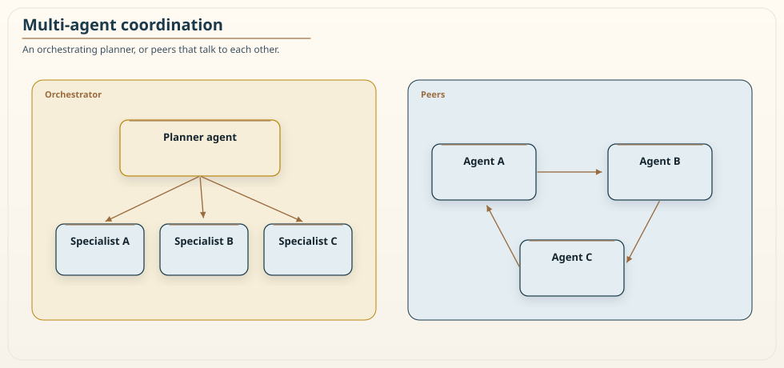

# Chapter 16: Agentic AI Architectures in Deterministic Systems

<div class="chapter-header">
  <h2 class="chapter-subtitle">The Model Proposes. The Executor Disposes.</h2>
  <div class="chapter-meta">
    <span class="reading-time">📖 55 min read</span>
    <span class="difficulty">🎯 Expert</span>
  </div>
</div>

An agent is a language model that has been given the ability to act. Instead of only producing text, it can call tools, read resources, and take steps toward a goal, looping through a cycle of planning, acting, observing the result, and planning again. This is a genuinely new capability, and it is also a genuinely new way to cause an outage, because an agent embedded in a production system is a probabilistic component wired into a deterministic one, and the seam between the two is where the trouble lives.

The mistake I see most often is treating an agent as either magic or as just another service. It is neither. It is a new kind of component with its own failure modes, and the job of the architect is to place it in the system so that its strengths, flexible reasoning over ambiguous inputs, are available where they help, while its weaknesses, non-determinism and a willingness to be talked into things, are contained where they would hurt. This chapter is about that placement. It builds directly on the RVx-A extension from Chapter 11, which measures the granularity of an agent's tool surface, and it is deliberately scoped: this is an architecture chapter about running agents safely, not a security paper about the underlying protocol. Chapter 7 already wrote the identity, capability, and injection contract. I will point at it rather than reprint it, and I will mark that boundary where it matters.

## 16.1 The core separation: planner and executor

The single most important design decision in an agentic system is to separate the part that decides from the part that acts, and to give them very different amounts of trust.

The planner is the language model. It proposes intent: given the goal and the current state, it decides what to do next, which tool to call, with what arguments. The planner is powerful precisely because it is flexible, and it is dangerous for the same reason: it is non-deterministic, it can be wrong, and it can be manipulated by the content it reads. You cannot make the planner trustworthy by asking it nicely, because its behavior is a probability distribution, not a guarantee. Temperature zero is not a guarantee either. Batching, provider-side model updates behind an alias, and the next prompt-injection all still move the output.

The executor is the set of services and tools that actually change the world. The executor commits real effects, and it must do so only through the same versioned, authorized, idempotent interfaces that any other client uses. The executor does not trust the planner's claims about what is allowed. It performs its own authorization, its own validation, and its own idempotency checks, exactly as it would for a request from any untrusted caller, because from the executor's point of view the planner is an untrusted caller.

The rule that follows is simple and absolute: the model proposes, the executor disposes. The model never gets raw credentials, never emits raw SQL that runs unchecked, never has its authorization claims taken at face value. It expresses intent, and a deterministic layer between the model and the world decides whether that intent is permitted and safe before anything happens. This is capability narrowing, and it is the difference between an agent that can be trusted in production and one that is an incident waiting for a cleverly worded input.


*Figure 16.1: Separation of probabilistic planning from deterministic execution. The planner, the language model on the left, can only express intent by calling tools. Every tool call passes through the tool gateway in the middle, which authorizes it against real policy, validates its arguments, and applies rate and budget limits, independent of anything the model claimed. Retrieved documents and tool results enter as data, not as a second instruction channel. Only then does the call reach a domain service on the right. High-risk actions do not go straight through; they are routed to a human approver. The diagram's message is that the model's power is bounded by a deterministic checkpoint it cannot talk its way past. Chapter 7's Figure 7.2 is the same checkpoint seen from the identity side.*

## 16.2 Why this is the granularity paradox again

Chapter 11 argued that the same three-signal problem appears in a new medium when an agent chooses among tools, and it is worth making that connection concrete here, because it explains why tool design is architecture and not configuration.

Give an agent too few, coarse tools and each one becomes an opaque mega-service. A single do-everything tool with twenty parameters is as hard for a model to use correctly as a god-class is for a human to maintain, and the agent will misuse it in ways that are hard to predict. Give the agent too many fine-grained tools and you recreate the distributed monolith: the model must chain many small calls and choose among dozens of similar options, and this is exactly where agents fail. As the tool catalog grows, tool-selection accuracy drops, token cost climbs because every tool description sits in the context window, and the model begins to hallucinate tool names rather than admit it does not know which tool to use. That collapse is documented in the tool-calling literature. I am not going to invent a magic catalog size at which it happens. Past a point that you have to measure for your model and your tools, accuracy falls off a cliff.

RVx-A from Chapter 11 is the measurement that governs this. I am not restating that score. Chapter 11 already remapped the three signals: token-and-latency efficiency, tool distinctness, and the tool surface against the model's attention budget. It also labelled RVx-A a proposal, skippable if you are evaluating the core method, and not a security control. The practical consequence for this chapter is that the tool surface is a designed boundary, not an accident of whichever endpoints happened to exist. Curate it. Present the agent with a small, distinct set of tools whose purposes do not overlap, and if the catalog is genuinely large, retrieve the relevant subset per query rather than dumping all of it into the prompt. That is the adaptive tool-surfacing idea the next chapter's retrieval techniques directly support.

## 16.3 The threat surface, and where this chapter stops

An agent that reads external content and calls tools has a threat surface that a plain service does not, and honesty requires naming it clearly while also being clear about what this chapter does and does not try to solve.

The threats fall into a few families. Prompt injection is the headline: content the agent reads, a document, a web page, a tool result, contains instructions that hijack the agent's behavior, because the model does not reliably distinguish data it should process from instructions it should obey. Tool misdirection is related: an agent is induced to call a legitimate tool with harmful arguments, or to call a tool it should not. Budget and resource abuse is the quieter threat: an agent tricked or looping into consuming tokens, calls, or money without bound. And confused-deputy problems arise when the agent acts with more authority than the user who prompted it should have.

The mitigations that belong in an architecture chapter are the ones that live in the deterministic layer, because that is the layer you can actually trust. Treat all retrieved content as data, never as instructions, and structure the agent so that tool results and documents cannot silently become commands. That separation reduces the chance of injection. It does not close it. Chapter 7 already said to rely on the bound, the signed identity and the allow-list, and to treat input hygiene as a useful reduction rather than a guarantee. Allow-list the tools an agent may call rather than exposing everything. Enforce per-tenant budget caps and circuit breakers so a runaway agent hits a wall, on request rate, work, and cost together, reserved atomically, which Chapter 7 already specified. Keep the user's identity and the agent's service identity separate, so the agent cannot act as the user beyond what the user is allowed. A self-asserted `on_behalf_of_user` is the confused deputy with a friendlier name. The claim has to be issued by your identity provider. And route high-risk actions to a human, which Section 16.5 develops.

Here is the boundary this chapter respects. The deeper security questions, whether the protocol that connects agents to tools has flaws that amplify these attacks, whether a tool server can be cryptographically attested, how prompt injection succeeds at the token level, are real and important, and they are the subject of a fast-moving security literature. They are not a granularity or architecture problem, and I am not going to pretend a placement pattern solves them. Model Context Protocol, provider function-calling, Bedrock action groups: pick one, then assume a hostile tool result can still arrive. RVx-A and the patterns here reduce the blast radius and make abuse visible and bounded. They do not make an agent safe to point at hostile input without the protocol-level and model-level defenses that belong to that separate body of work. An architecture that acknowledges this boundary is more trustworthy than one that claims to have closed a gap it has not.

## 16.4 The tool gateway in practice

The deterministic checkpoint between the planner and the world deserves a concrete shape, because it is where most of the safety actually lives. Think of it as a gateway that every tool call passes through, and give it four jobs.

The first job is **authorization**. When the agent proposes a tool call, the gateway checks whether this call is permitted, for this agent, on behalf of this user, right now, against real policy. The critical point is that the authorization is independent of anything the model said. If the model's instruction claims it is allowed to issue refunds, the gateway ignores the claim and checks the actual policy. Attribute-based access control fits well here, because the decision depends on attributes of the caller, the user, the tool, and the context together. Recipe 7.1's authorizer is the shape. The extra step is checking the requested action against the agent's granted and denied capabilities.

The second job is **validation**. The gateway checks the arguments the model produced before they reach the tool. Models produce malformed and out-of-range arguments regularly, sometimes because they are wrong and sometimes because they were manipulated, and the tool should never see an argument the gateway has not validated against a schema and against business constraints. A refund tool should reject a negative amount and a suspiciously large one at the gateway, not discover the problem after the money moved.

The third job is **rate and budget control**. The gateway counts calls and cost per agent, per tenant, per session, and enforces caps. This is the wall a runaway or manipulated agent hits. Without it, a single looping session can exhaust a budget or hammer a downstream service, and the failure is unbounded. With it, the blast radius of a misbehaving agent is a tripped circuit breaker and an alert, not an outage or a surprise bill. Estimated cost that is wrong in the agent's favor is a leak. Meter the actual cost when the call returns.

The fourth job is **audit**. Every tool call, its arguments, the authorization decision, the model version, and the outcome are recorded, so that after the fact you can reconstruct what the agent did and why. This is the same audit discipline the Fulcrum loop from Chapter 11 requires, and it is non-negotiable for an autonomous component, because the alternative is an agent that took actions no one can explain. Persist the tool traces. Be careful with raw prompts if they are heavy with personal data. Chapter 15's telemetry-as-data-store warning applies here too.

A fifth job, which the rest of this book would notice if I left it out: **idempotency**. An agent that retries a refund will call the tool twice. The gateway must require an idempotency key and the domain service must honor it, the same way Chapter 5 required it for saga steps. Without that, a perfectly authorized, perfectly validated, perfectly audited double-charge is still a double-charge.

### Recipe 16.1: Constrained tool actions

**Context.** A support agent may look up tickets freely. Issuing a refund is irreversible and must not execute because the model was talked into it.

**Solution.** The instruction tells the model the rule. The gateway enforces the rule. If they disagree, the gateway wins.

```yaml
# Illustrative agent definition. Validate against current provider docs;
# the exact resource shapes evolve. The safety property does not depend on
# the provider: enforcement lives in the tool, not the prompt.
agent:
  name: field-ops-orchestrator
  instruction: >
    You help operators resolve tickets. You may look up records freely.
    You must not call any financial tool unless the request's risk score
    is below 0.15. If unsure, ask for human approval.
  tools:
    - name: lookup_ticket
      risk: low
    - name: issue_refund
      risk: high
      requires_human_approval: true
```

```python
def admit(call, policy, user_token):
    """Gateway admission. The prompt is a hint. This function is the control."""
    if call.tool not in policy.allow_list:
        return Deny("not on allow-list")
    if not schema_valid(call):
        return Deny("invalid arguments")
    if not authorize(user_token, call.tool, call.args):
        return Deny("policy")
    if policy.risk[call.tool] == "high" and not call.human_approval:
        return Hold("human")
    if not call.idempotency_key:
        return Deny("idempotency key required")
    return Allow()
```

Read the safety property carefully. `0.15` is an arbitrary number I put in a prompt so the model has a hint. It is not a control. `requires_human_approval: true` and `admit()` are the controls. Even if the model is talked into calling `issue_refund`, the gateway routes the call to a human instead of executing it. If the prompt and the gateway ever disagree, because the model was manipulated, the gateway wins.

## 16.5 Human in the loop, placed deliberately

Not every action should be autonomous, and the art is deciding which actions require a human without turning the agent into an expensive way to generate approval requests. The right axis is reversibility and blast radius, the same axis this book uses everywhere.

Reversible, low-blast-radius actions can be autonomous: reading data, drafting a response, making a reversible configuration change behind a safety gate. The cost of being wrong is low and recoverable, so the efficiency of autonomy is worth it. Irreversible or high-blast-radius actions should require a human: moving money, deleting data, changing access, anything where being wrong is expensive and hard to undo. The human is not there to rubber-stamp; the human is there because the action crosses a line where the cost of a probabilistic mistake exceeds the value of speed.

The failure mode to avoid is putting a human in front of everything, which destroys the value of the agent and trains the human to approve without reading, which is worse than no human at all because it manufactures false assurance. Place the human at the small number of genuinely consequential decisions, make those approvals information-rich so the human can actually judge, what was proposed, on whose behalf, against which policy, with which arguments, and let the agent run autonomously everywhere the cost of error is recoverable. A timeout that auto-approves is a human who is not there. Deny by default when the human does not answer. This is the same scoped-autonomy principle the Fulcrum loop applies: automate the reversible, route the structural to a human. It is also the same long-wait as Chapter 5's callback: the saga pauses, a human acts, the workflow resumes or compensates.

## 16.6 Evaluating an agent

You cannot manage what you do not measure, and agents are harder to measure than deterministic services because the same input can produce different outputs. The evaluation discipline has three parts.

First, **task success under realistic conditions**. Define the tasks the agent is supposed to accomplish and measure how often it succeeds, using a curated set that includes the hard and ambiguous cases, not just the happy path. Because the agent is non-deterministic, run each case multiple times and look at the distribution of outcomes, not a single run, the same statistical humility Chapters 11 and 13 insist on. A green eval that ran once at temperature zero is a story, not a measurement.

Second, **adversarial robustness**. Maintain a suite of injection attempts and manipulation attempts, and measure how often the agent is successfully hijacked. This suite grows as you discover new attacks, and a rising success rate for the attacks is a regression as serious as a functional bug. Treat the adversarial suite as part of the release gate, not as a research side project. The gate still cannot prove the agent is safe on novel attacks. It can prove you have not forgotten the ones you already know.

Third, **cost and latency under load**. An agent that succeeds but costs ten times the budget or takes thirty seconds is not production-ready, and these numbers move with model changes and prompt changes, so track them continuously. Pin the model version you evaluated. An alias that silently retargets is a deploy you did not review. A regression harness with frozen tool stubs lets you compare a new prompt or model against the old one on all three axes before it ships, and a canary cohort with automatic rollback on a metric breach lets you catch in production what the harness missed. Chapter 15's silent-degradation warning is the reason the canary exists.

## 16.7 Memory: the statefulness an agent smuggles in

A plain service can be stateless, holding nothing between requests and pushing all durable state into a data store where it can be governed. An agent quietly resists this, because its usefulness often depends on remembering: what the user asked three turns ago, what it already tried, what it learned from the last tool result. That memory is state, and treating it casually is how agentic systems accumulate the same hidden coupling and consistency problems the rest of this book warns about, just wearing a conversational costume.

It helps to separate agent memory into layers with different lifetimes and different governance, because lumping them together is where the trouble starts. Short-term memory is the working context of the current task, the recent turns and intermediate results the model needs to finish what it is doing. It is bounded by the model's context window, it is discarded when the task ends, and it needs little governance beyond the budget limits already in the gateway. Long-term memory is different in kind: facts, preferences, and history the agent is meant to carry across sessions and often, if you are careless, across users. The moment memory persists across sessions it becomes a data store, and it inherits every obligation of a data store from Chapter 4 and Chapter 7. It has an owner, a retention policy, an access-control boundary, and a privacy classification, because long-term agent memory routinely contains personal data, and an agent that remembers one user's information into another user's session is a data breach, not a feature.

Two disciplines keep agent memory honest. First, make the boundary between short-term and long-term memory explicit in the architecture rather than letting the model's context silently become a durable store. Decide what is written to long-term memory deliberately, through a governed path, the same way a service decides what to persist, instead of persisting whatever happened to be in context. Second, scope long-term memory to an identity and enforce that scope in the deterministic layer, not in the prompt. A memory store keyed and access-controlled by user identity cannot leak across users even if the model is confused about whose session it is in, because the enforcement lives where enforcement belongs. Retrieval into that store is Chapter 17's problem. Whether the store is allowed to answer is this chapter's. Memory is where the stateless simplicity of a well-designed service quietly leaks back into an agentic system, and naming it as state is the first step to governing it.

## 16.8 Multi-agent systems and the granularity trap, one level up

When one agent is not enough, the instinct is to build many: a planner agent that delegates to specialist sub-agents, or a set of peer agents that each own a domain. Multi-agent architectures are real and sometimes necessary, and they are also where the granularity paradox from Chapter 11 reappears at the level of agents rather than services, with all the same failure modes and one new one.


*Figure 16.2: Coordinating multiple agents mirrors the orchestration-versus-choreography choice from Chapter 5's treatment of sagas. On the left, an orchestrator agent holds the plan and decides which specialist sub-agent acts at each step; control is centralized, the flow is easy to follow and audit, and the orchestrator is both the coordination point and the bottleneck. On the right, peer agents each react to shared state with no central coordinator; control is distributed, the system is more flexible, and it is correspondingly harder to reason about who did what and why. That shared state is a data store. It needs an owner. The same tradeoff that governs service coordination governs agent coordination, which is the point: a multi-agent system is a distributed system, and it inherits distributed systems' problems rather than escaping them.*

The granularity lessons transfer directly. Too few, too coarse agents recreate the god-service problem: one agent that tries to do everything is as unmanageable as one service that does, and it makes poor tool choices for the same reason a bloated catalog does. Too many, too fine agents recreate the distributed monolith: agents that must constantly hand off to one another, each adding a probabilistic step and a round of token cost, so that a task requiring five agent handoffs has five chances to be misunderstood and pays five times the coordination overhead. Chapter 11's RVx-A intuition says the same thing about agents that it says about services: a boundary between agents earns its cost only when the agents are genuinely distinct in responsibility and can act with real independence. I am still not restating the formula.

The new failure mode that multi-agent systems add is compounding non-determinism. A single agent is uncertain; a chain of agents multiplies that uncertainty, because each handoff is another probabilistic decision that can go wrong, and the errors compound rather than cancel. This is the availability arithmetic of Chapter 1 applied to correctness. Five agents that are each right ninety percent of the time, *if those mistakes are independent*, are right \(0.9^5 \approx 0.59\) of the time end to end, about sixty percent. Independence is the same caveat Chapter 1 already entered. Agents that share a model, a prompt, and an injected document fail together, which is worse than the product, not better. The practical guidance is to prefer the smallest number of agents that covers genuinely distinct responsibilities, to favor an orchestrator with a clear plan over a swarm of peers when auditability matters, and to treat every proposed agent boundary with the same skepticism the book applies to every proposed service boundary. Adding an agent because you can is the agentic version of splitting a service because you can, and it multiplies cost the same way.

## 16.9 Failure modes: loops, partial completion, and recovery

An agent fails in ways a deterministic service does not, and a production agentic system needs deliberate handling for each, because the default behavior of an unsupervised agent under failure is to make things worse. Three failure modes deserve explicit design.

The first is **non-termination**. An agent stuck in a loop, retrying the same failing tool call, or planning and re-planning without converging, will consume budget and produce nothing. The deterministic layer must bound this, because the model cannot be trusted to notice it is stuck. A hard cap on steps per task, a cap on repeated identical calls, and the budget limits already in the gateway together ensure a looping agent hits a wall and is stopped rather than running until someone notices the bill. Non-termination is not an edge case to hope against. It is a routine occurrence that the architecture must contain.

The second is **partial completion**, which is the agentic version of the distributed-transaction problem from Chapter 5. An agent that is meant to perform several side-effecting steps may complete some and fail partway, leaving the world in an inconsistent state: the refund issued but the ticket not closed, the resource created but not registered. The answer is the same as for sagas: design the steps so that partial completion is recoverable, either by making each step idempotent and resumable so the task can be retried from where it stopped, or by defining compensating actions that undo the completed steps when the task cannot finish. Do not mark the step processed and then perform the effect. An agent that takes irreversible actions with no compensation path is one crash away from a mess a human has to clean up by hand.

The third is **silent degradation**, the failure mode observability exists to catch. An agent whose success rate slowly drifts down after a model update, or whose answers quietly get worse as an injection technique spreads, does not throw an error; it just becomes less useful in a way no exception surfaces. This is why the evaluation discipline of Section 16.6 runs continuously rather than once, and why the audit trail from Section 16.4 matters: the only way to notice silent degradation is to measure outcomes over time against a baseline and to be able to reconstruct what the agent actually did. An agent that fails loudly is a problem you will fix. An agent that fails silently is a problem that compounds until a customer finds it for you. Chapter 15 is how you stay sighted. This chapter is why you must.

## 16.10 Summary

An agent is a language model given the ability to act, and it is a probabilistic component wired into a deterministic system, which is a new capability and a new failure surface at once. Place it well by separating the planner, the model that proposes intent, from the executor, the deterministic layer that authorizes, validates, rate-limits, and audits every action independently of what the model claimed. The model proposes, the executor disposes, and the executor treats the model as an untrusted caller.

Design the tool surface as a boundary, using the RVx-A signals from Chapter 11: a small, distinct set of tools, retrieved per query when the catalog is large, because an over-tooled agent suffers a measured collapse in accuracy. Contain the threat surface with the deterministic controls that live in the gateway, treat retrieved content as data and never as instructions, allow-list tools, cap budgets, require idempotency keys, and separate user identity from agent identity, while being honest that protocol-level and model-level security are a separate body of work this architecture does not replace. Put a human at the small number of irreversible, high-blast-radius decisions, deny when that human does not answer, and let the agent run autonomously where errors are recoverable. Evaluate the agent on task success, adversarial robustness, and cost, running each many times because a single run of a non-deterministic system proves little.

Done this way, an agent becomes a governed component with a bounded blast radius rather than a clever liability. The next chapter goes deeper into the retrieval systems that feed these agents, where the discipline is that retrieval is a distributed data problem wearing a language-model costume.

---

**Navigation:**
- [Previous: Chapter 15](15-observability-2.md)
- [Next: Chapter 17](17-rag-at-scale.md)
