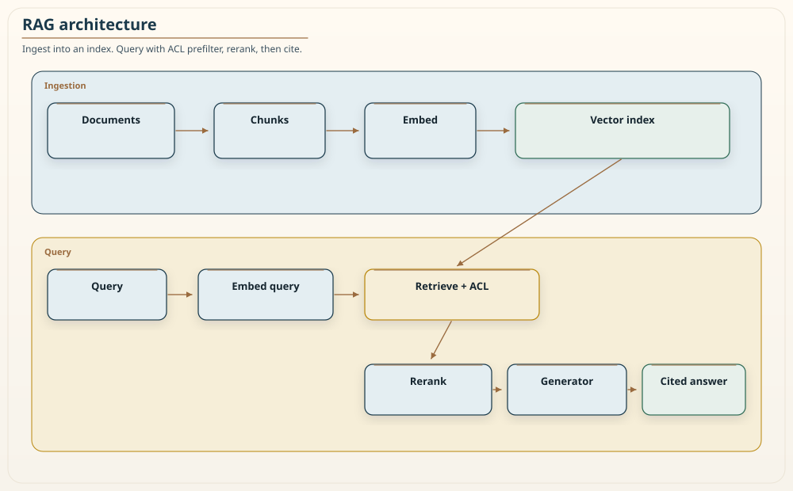
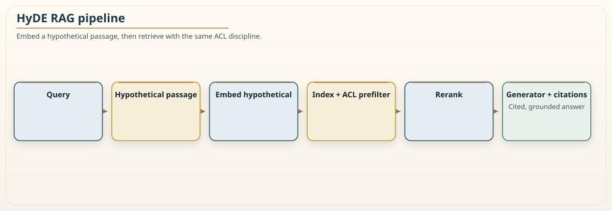
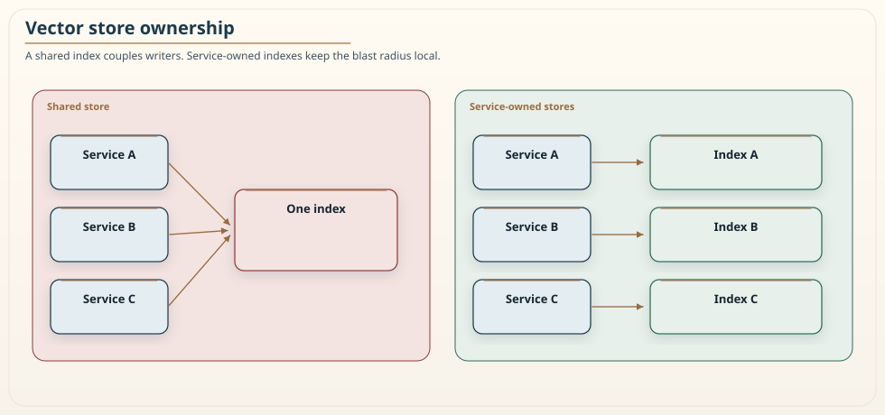

# Chapter 17: Retrieval-Augmented Generation at Scale

<div class="chapter-header">
  <h2 class="chapter-subtitle">Retrieval as a Data-Plane Discipline, Not a Prompt Trick</h2>
  <div class="chapter-meta">
    <span class="reading-time">📖 55 min read</span>
    <span class="difficulty">🎯 Expert</span>
  </div>
</div>

Retrieval-augmented generation is the technique that lets a language model answer questions about information it was never trained on, by retrieving relevant documents at query time and giving them to the model as context. It is the backbone of most enterprise use of language models, because it is how you get a model to answer from your policies, your knowledge base, your documentation, rather than from its training data or its imagination. It is also, at scale, far more of a distributed-systems problem than a language-model problem, and the teams that struggle with it are usually the ones who treated it as a prompt trick rather than as a data-plane discipline.

That framing is the thesis of this chapter, and it is worth stating bluntly: RAG at scale is a distributed database problem wearing a language-model costume. The failure modes that hurt production RAG systems, staleness, misrouting, hotspots, access-control leaks, and evaluation drift, are the same failure modes that hurt any distributed data system, and they yield to the same engineering rigor the data chapters of this book applied. The language model is the easy part. The retrieval, the freshness, the access control, and the evaluation are where the work is. Chapter 16's agents eat what this chapter retrieves. If the retrieval is ungrounded or over-privileged, the gateway in that chapter is already too late.

## 17.1 How RAG works, and where it breaks

The mechanism is straightforward. You take your corpus of documents and split it into chunks. You run each chunk through an embedding model, which turns text into a vector, a list of numbers that captures its meaning, such that chunks about similar things have nearby vectors. You store these vectors in a vector index. At query time, you embed the user's query the same way, find the chunks whose vectors are nearest to the query's vector, and hand those chunks to the language model as context, asking it to answer using them.


*Figure 17.1: The canonical RAG data plane, read as two flows. The ingestion flow, along the top, takes source documents, splits them into chunks, embeds each chunk into a vector, and writes the vectors to the index. The query flow, along the bottom, embeds the incoming query, retrieves the nearest *authorized* chunks from the index, reranks them for relevance, and passes the best ones to the generator, which produces an answer with citations back to the source chunks. The diagram separates the two flows deliberately: ingestion is a batch data-pipeline problem, and query is a low-latency retrieval problem, and they have different scaling and freshness concerns.*

The place this breaks first is the assumption that nearest in vector space means correct. It does not. Vector similarity measures semantic closeness, which correlates with relevance but does not guarantee it, and it certainly does not guarantee factual entailment. A chunk can be the nearest neighbor of a query and still be the wrong answer, out of date, about a similar but distinct topic, or contradicted by a chunk that ranked slightly lower. Approximate nearest-neighbor indexes make this worse in a quiet way: they return *near* neighbors, not the true top-k, so a slightly lower authorized chunk can be skipped entirely. This is why a production RAG system does not simply hand the top vector matches to the model and trust the result. It reranks the candidates with a more precise model, and for answers that matter it checks that the cited sources actually support the answer. Higher similarity is a strong hint, not a proof, and building the system as if it were a proof is the most common way RAG quietly returns confident wrong answers.

## 17.2 Chunking and the metadata that saves you

The humble decision of how to split documents into chunks has outsized influence on quality, and it is where a lot of RAG systems are quietly broken. Chunk too large and each vector blurs several ideas together, so retrieval is imprecise and the model gets a wall of mostly-irrelevant text. Chunk too small and you sever the context that makes a passage meaningful, so a chunk retrieves well but does not carry enough around it to answer. There is no universal right size; it depends on the documents, and it is worth tuning against real queries rather than guessing. Overlap and parent-document retrieval, fetch a small chunk then expand to its surrounding section, are the usual remedies for the too-small case. They are not a substitute for measuring.

More important than size is the metadata you attach to every chunk, because that metadata is what turns a naive similarity search into a governed retrieval system. At minimum, every chunk should carry its access control information, its freshness, its embedding-model version, and its lineage back to the source.

```json
{
  "chunk_id": "doc:policy/2026/security#p12",
  "acl": ["architecture", "security"],
  "freshness": "2026-08-01T00:00:00Z",
  "embed_model": "text-embed-v3@2026-03",
  "lineage": "s3://kb/policy/2026/security.pdf#page=12"
}
```

The access control field is the one that prevents a serious incident. It lists who is allowed to see this chunk. The groups on the chunk are not a suggestion the model interprets. They are compared, in the deterministic layer, to the groups on the *signed* identity from Chapter 7. An agent that claims it is in `security` does not get the chunk.

And the filter must run **before** the nearest-neighbor search, not after. This ordering is not a performance detail. It is a security requirement. If you retrieve first and filter second, there is a window where the system fetched content the user was not allowed to see, and depending on the implementation that content lands in the prompt, the logs, the trace, or the cache. Filtering by access control before the search means the user's query can only ever match chunks they are permitted to see.

Two honest caveats, because "prefilter" is not a magic word.

If your engine cannot prefilter, do not post-filter and call it close enough. Give that tenant or that classification its own index, a physical wall, which is the same isolation Chapter 4 required when a shared table was the leak. Over-fetch-then-drop is post-filter with a larger k.

Approximate indexes explore a graph. A hard prefilter can starve that graph and return nothing useful even when an authorized chunk exists. That is a quality problem, not a reason to fetch unauthorized neighbors. Raise k inside the authorized set, or isolate the set physically, or accept that a tiny ACL slice needs an exact search.

When a document's ACL changes, the chunks are stale permissions until you re-tag or delete them. That is index drift of authorization, and it is as much a breach as a stale policy answer is a lie.

The freshness field lets you prefer current information and detect stale answers. The lineage field lets you cite the source, which is what makes the answer auditable rather than a claim from nowhere.

### Recipe 17.1: Retrieve only what the principal may see

**Context.** A shared index holds policy chunks for several groups. A support agent, acting for a user, must not see `security` chunks.

**Solution.** Resolve the allow-list from the signed token. Prefilter. Key any cache on the principal, the corpus version, and the embedding model. Never on the query alone.

```python
def retrieve(query, embed, index, cache, token, k=50):
    allowed = groups_from(token)  # IdP-signed. Not from the prompt.
    cache_key = (hash(query), frozenset(allowed), index.version, embed.version)
    if hit := cache.get(cache_key):
        return hit
    hits = index.nearest(
        embed(query),
        k=k,
        prefilter={"acl": {"any_of": allowed}},
    )
    cache.set(cache_key, hits, ttl=index.freshness_bound)
    return hits
```

A result cache that keys only on the query text is a cross-user leak the first time two people ask the same question. Chapter 16 said long-term memory is a data store. So is this cache.

## 17.3 HyDE and the recall problem

A recurring problem in retrieval is the underspecified query. A user asks a short, vague question, and its embedding does not land near the chunks that actually answer it, because the question and the answer are phrased very differently. The query "how do we handle refunds over the limit" may not embed near a policy chunk that never uses the word refund and instead discusses "reimbursement exceptions above the approval threshold."


*Figure 17.2: The HyDE variation, read left to right. Instead of embedding the raw query and searching with it, the query first goes to the language model, which drafts a hypothetical passage that would answer it. That synthetic passage, being written in the vocabulary of an answer rather than a question, embeds closer to the real answer chunks, so retrieving with it improves recall for vague queries. The retrieved chunks are then reranked and passed to the generator with citations. The diagram highlights the extra generate-then-embed step at the front, which is the whole idea and also the source of its main risk. The hypothetical never reaches the user.*

HyDE, hypothetical document embeddings, addresses this. Instead of searching with the query's embedding, you first ask the language model to draft a hypothetical passage that would answer the query, then search with that passage's embedding. The synthetic passage is written in the language of an answer, so it embeds nearer the real answers, and recall improves for exactly the vague queries that plain retrieval handles worst.

```python
def retrieve_hyde(query, llm, embed, index, acl_filter):
    # Retrieval aid only. Temperature 0 limits invention. It does not end it.
    hypothetical = llm.generate(
        f"Draft a short, factual paragraph that would answer:\n{query}",
        temperature=0.0,
    )
    return index.nearest(embed(hypothetical), k=50, prefilter=acl_filter)
```

The tradeoff is honest and important: the hypothetical passage is generated by the same model that hallucinates, so a wrong hypothetical retrieves wrong chunks, and you have amplified an error rather than corrected it. Temperature zero is the same non-guarantee Chapter 16 already entered. The mitigations are to treat the hypothetical purely as a retrieval aid that never reaches the user, to keep the citation discipline so the final answer is grounded in retrieved sources rather than in the hypothetical, and to apply the same ACL prefilter as any other search. Do not stuff unauthorized documents into the HyDE prompt "for better drafts." HyDE also adds a full generate step to every query. That is latency and cost, which Section 17.5 will not forgive if you apply it blindly. Use it where vague queries are common and measure whether it actually helps on your data rather than adopting it because it is fashionable.

## 17.4 Evaluation, because you cannot improve what you do not measure

RAG systems are deceptively easy to build and deceptively hard to evaluate, and the gap between a demo that impresses and a system that is trustworthy is almost entirely evaluation. The traditional text-overlap metrics borrowed from summarization, which score how many words the answer shares with a reference, are nearly useless here, because a factually wrong answer can share many words with a correct one and a correct answer phrased differently can share few. You need metrics that measure what actually matters.

The first metric is **citation precision**: of the sources the system cited, what fraction genuinely support the answer. This directly measures the failure mode that hurts most, an answer that sounds authoritative and cites sources that do not actually say what the answer claims. Measuring it requires a judgment, human or a capable model acting as judge, about whether each cited chunk entails the claim it supports. A model judge is cheap and biased. It is a screening tool, not a gold label. Spend humans on the set you will gate a release on.

The second metric is **refusal quality**: when the right answer is that the system does not know, or that the question is outside its corpus, does it say so, or does it confabulate. A RAG system that always answers is dangerous, because the queries with no good answer in the corpus are exactly the ones where a made-up answer does the most harm. Measuring refusal quality means building a set of out-of-scope queries and checking that the system abstains rather than inventing, and rewarding the abstention rather than treating it as a miss.

The third metric is the operational one: **latency at the high percentiles and cost under realistic concurrency**. A RAG system that is accurate but slow or expensive will not survive contact with production traffic, and these numbers shift with corpus size, model choice, and whether you added a step like HyDE or a reranker. Track them the way you track any service-level objective from Chapter 6 and Chapter 8.

The discipline that ties these together is **shadow evaluation**. When you change something, a new embedding model, a new chunking strategy, a reranker, run the new variant alongside the old on real traffic without showing its results to users, and compare the three metrics. This is the same shadow-and-compare approach Chapter 19 uses for migration and the Fulcrum loop uses for governance, and it is how you make retrieval changes on evidence rather than on hope.

## 17.5 Scaling, cost, and hotspots

At scale, RAG has the cost and hotspot problems of any read-heavy distributed data system, and they yield to the same techniques.

**Caching** is the first lever. Query embeddings are expensive to compute and highly repetitive, because users ask similar questions, so caching embeddings for common queries removes a large fraction of the embedding cost. Results for popular queries can be cached too, with a freshness bound so a cached answer does not outlive the data it was based on, and with the principal in the key so the cache does not become Recipe 17.1's leak.

**Sharding the vector index** is the second lever, and it connects to Chapter 12 without pretending the two techniques are the same. Partition the index by tenant so that one tenant's queries only ever search that tenant's data. That both improves performance, because each search covers less, and enforces isolation, because a query physically cannot reach another tenant's chunks. A busy tenant with a huge corpus still hotspots *their* shard. Shard that tenant further and scatter-gather inside their wall. Shuffle-shard the *query-serving fleet*, the way Chapter 12 shuffle-shards compute, so one tenant's QPS cannot drown everyone else's retrieval. Do not shuffle-shard vectors across tenants and call it isolation. That is scatter-gather with a leak.

**The third lever is the tiered retrieval stack.** Do not use one large, expensive model for everything. Use a fast, cheap embedding search, hybrid with lexical, to get a broad set of candidates, a small cross-encoder reranker to sharpen the ordering of those candidates, and only then the large generator to produce the answer. Each stage narrows the set and spends more compute per item on fewer items, so the expensive model only ever sees a handful of well-chosen chunks. This staging is the cost-control backbone of a production RAG system, and skipping it, sending everything to the biggest model, is how RAG bills balloon.

## 17.6 Hybrid retrieval: dense vectors are not enough on their own

Vector search is good at meaning and bad at exactness, and this asymmetry causes a specific, frustrating class of failure that pure dense retrieval cannot fix by tuning. Dense embeddings capture semantic similarity, which is why they find the reimbursement-exception chunk for a refund query. But they blur exact tokens, so they are unreliable for the queries where an exact string is the whole point: an error code like `ERR-4021`, a product SKU, a person's name, a specific API method, a legal clause number. The embedding of `ERR-4021` sits near the embeddings of other error codes, which is exactly wrong when the user needs that one code and no other.

The fix is hybrid retrieval, which runs two searches and combines them. A dense vector search captures semantic matches, and a lexical search, BM25 and the classic keyword ranking that databases and search engines have used for decades, captures exact-term matches. The results are merged, commonly by reciprocal rank fusion, which rewards a chunk for ranking well in either list, so a chunk that is a strong lexical match for a rare code and a chunk that is a strong semantic match for a vague concept both surface. On mixed enterprise corpora, hybrid retrieval usually beats either method alone, because real queries are a mix of the vague and the exact. A system that only does dense search will quietly fail every time a user pastes in an identifier and expects to find the one document that mentions it. Measure that claim on your query log. Identifier-heavy traffic should tilt the fusion toward lexical. Conceptual traffic should tilt it toward dense.

The practical guidance is to treat lexical search not as a legacy technique that vectors replaced but as a complementary signal that covers dense retrieval's blind spot. Keep both indexes, fuse their results, apply the same ACL prefilter to both, and let the reranker from Section 17.1 operate on the fused candidate set. This is more machinery than a pure vector store, and it earns its cost the moment a user searches for something by its exact name, which in most enterprise corpora is constantly.

## 17.7 The embedding model is a dependency, and re-embedding is expensive

It is easy to think of the embedding model as a fixed function, but it is a dependency like any other, and it has a property that catches teams off guard: you cannot change it cheaply. Every vector in your index was produced by a specific embedding model, and vectors from different models are not comparable. They may not even have the same number of dimensions, and even when they do, a query embedded with a new model does not land correctly among chunks embedded with the old one, because the two models arrange meaning in different coordinate systems. Truncating dimensions of the *same* matryoshka model is a different, supported operation. Mixing two models is not. The consequence is stark: changing the embedding model means re-embedding the entire corpus, which for a large corpus is a significant batch job with real time and cost.

This has several implications that belong in the design from the start rather than discovered during an upgrade. First, the embedding model choice is a commitment, so it deserves deliberate evaluation against your actual documents and queries before you index millions of chunks with it, not a default picked because it was popular. Second, the embedding model must be versioned, and every chunk should record which model version produced its vector, so that during a migration you know which vectors are old and which are new and you never compare across the boundary. Third, a model migration is a migration, and it deserves the same treatment as any data migration in this book: run the new index alongside the old, embed new content into both during the transition, shadow-evaluate the new index against the old on the metrics from Section 17.4, and cut over only when the evidence supports it.

There is a quieter version of this problem that bites even without a deliberate upgrade: a hosted embedding model that the provider updates underneath you. If your embeddings come from an external service and the provider changes the model, your new embeddings may silently stop matching your existing index, degrading retrieval with no code change on your side. The defense is to pin to a specific model version where the provider allows it, and to monitor retrieval quality continuously so that a silent drift shows up as a measured drop rather than as a slow accumulation of vaguely worse answers. Chapter 15's silent-degradation discipline applies to an index that slowly goes blind. The embedding model, in short, is not a detail. It is a load-bearing dependency whose replacement cost is proportional to your corpus size, and treating it casually is how a routine-looking upgrade becomes a multi-day re-indexing project under incident pressure.

## 17.8 Vector store ownership: shared or per-service

RAG systems store vectors, and vectors are data, so the ownership question this book keeps asking about data applies here too: should there be one shared vector store that many services query, or should each service own its own? The answer follows the same reasoning as the database-per-service discussion in Chapter 4 and the granularity thinking in Chapter 11, and getting it wrong reintroduces exactly the coupling that microservices were meant to escape. I am not restating that score. Exclusive ownership still does not require a separate cluster. It requires that no other service can read or write your vectors. A namespace you own in a shared engine can satisfy the rule. A shared `customer_embeddings` collection that three teams write does not.


*Figure 17.3: Shared versus service-owned vector stores, the retrieval version of the database-per-service question. A single shared store, on one side, is simpler to stand up and lets every service search a common corpus, but it couples those services: they contend for the same capacity, they are affected together by a schema or embedding-model change, and one service's access-control mistake can expose another's data. When each service owns its store, on the other side, the services scale and evolve independently, a change to one service's corpus or embedding model does not touch the others, and the isolation boundary is physical rather than a matter of query discipline. The tradeoff is the familiar one: independence at the cost of some duplicated infrastructure, and the right choice depends on whether the services genuinely share a corpus or merely happen to both use retrieval.*

The deciding question is whether the services genuinely operate on the same corpus with the same access rules, or whether they merely both happen to use retrieval. If a single knowledge domain is queried by several services with identical access rules, a shared store keyed and access-controlled correctly can be the right call, and the tenant-partitioning techniques from Section 17.5 keep it from becoming a hotspot. But if the services own distinct corpora, or have different access rules, or evolve on different schedules, forcing them onto a shared store is the distributed-monolith mistake in a new medium: they will change together, contend together, and fail together, and the shared vector store becomes the coupling that a boundary was supposed to remove. The default for services with distinct retrieval needs is the same as the default for their transactional data: each owns its own, and sharing is a deliberate exception justified by a genuinely shared corpus, not a convenience that quietly couples everything.

## 17.9 Grounding the generation step

Everything so far concerns retrieval, which is where most of the engineering lives, but the generation step that turns retrieved chunks into an answer has its own failure modes, and a system that retrieves perfectly can still produce a wrong answer if the generation is handled carelessly. The goal of this step is grounding: the answer must be supported by the retrieved chunks and nothing else, because the entire point of RAG is to replace the model's imagination with your sources. Retrieved chunks are still untrusted text. Chapter 16 already told you to treat them as data, never as instructions. A poisoned chunk is prompt injection that arrived through this data plane.

Three disciplines keep generation grounded. The first is **explicit instruction** to answer only from the provided context and to abstain when the context does not contain the answer. This connects directly to the refusal-quality metric from Section 17.4: a model told to answer from context and to say when it cannot is far less likely to confabulate than one simply handed chunks and asked to help. The instruction is not a guarantee, because the model can still stray, but it measurably reduces the rate of ungrounded answers and it costs nothing.

The second is **citation enforcement**, and it should be structural rather than trusted. Ask the model to cite the specific chunk behind each claim, then verify two things in the deterministic layer. First, that every cited identifier was actually in the retrieved set. That check is exact. An invented citation is a failure. Second, that the cited chunks plausibly support the claim. That check is a judge, human or model, and it is probabilistic. An answer whose citations do not check out is treated as a failure and either regenerated or refused, not returned. This turns citation from decoration into a checkable contract, and it is the mechanism that catches the confident-fabrication failure mode that Section 17.4 identified as the one that hurts most.

The third is **managing the context window**, which is a hard limit that retrieval quietly violates. Retrieval can easily surface more relevant chunks than fit in the model's context, and naively truncating drops potentially load-bearing information without telling anyone. Models also attend poorly to the middle of a long window. The disciplined approach is to let the reranker from Section 17.1 order the candidates by genuine relevance and to fit as many of the top-ranked chunks as the window allows, placing the strongest evidence where the model will actually read it, so that what survives the cut is what matters most rather than whatever happened to come first. When even the best chunks exceed the window, the honest options are to summarize them before generation, accepting some loss, or to answer in stages, but never to silently drop half the evidence and present the result as complete. The context window is a real constraint, and pretending it is not is how a system that retrieved the right answer generates one based on only part of it.

## 17.10 The failure taxonomy to design against

It helps to name the failures explicitly, because each has a specific mitigation and a system that has not planned for them will meet them all in production.

**Index drift** is when the corpus changes but the index does not, so the system confidently returns information that is no longer true. The mitigation is re-ingestion pipelines that keep the index current and version pins so you know which version of a document an answer came from. Stale answers are worse than no answers, because they are believed. Permission drift, an ACL that changed on the source and not on the chunk, belongs in this bucket too.

**Access-control leakage** is when a query retrieves chunks the user should not see, which as Section 17.2 stressed is prevented by filtering on access control before the nearest-neighbor search, never after, or by giving the unauthorized set no index in common. This is the failure with the worst consequences, because it is a data breach dressed up as a helpful answer. A cache or a log that recorded the unauthorized neighbors is the same breach arriving a day later.

**Corpus poisoning** is when a malicious or simply wrong document enters the corpus and then surfaces authoritatively in answers, because the system trusts its corpus. The mitigation is provenance and a write approval path for the corpus: treat what goes into the knowledge base with the same care you treat what goes into production, because in a RAG system the corpus is production. An attacker who can write to your corpus can put words in your system's mouth, and those words are the untrusted tool result Chapter 16 already refused to treat as instructions.

## 17.11 Summary

Retrieval-augmented generation lets a language model answer from your information rather than its training data, and at scale it is a distributed data problem far more than a language problem. Build it as a data plane: chunk documents thoughtfully, attach access-control, freshness, embedding-model version, and lineage metadata to every chunk, and apply the access-control filter before the nearest-neighbor search, never after, because the ordering is a security requirement and not a performance detail. If the engine cannot prefilter, isolate the index.

Do not trust vector similarity as proof of correctness; rerank candidates and verify that cited sources actually support the answer, because higher similarity is a hint and a confident wrong answer is the signature failure of naive RAG. Use HyDE where vague queries are common, at temperature zero and purely as a retrieval aid, and measure whether it helps on your data. Pair dense search with lexical search, because identifiers are not a vibe. Evaluate on what matters, citation precision, refusal quality, and operational cost and latency, not on word overlap, and change the system on shadow evidence rather than hope. Control cost and hotspots with caches keyed by principal, tenant-partitioned indexes that double as isolation, and a tiered stack where the expensive model only sees a few well-chosen chunks. Pin the embedding model. Re-embed as a migration. And design against the named failures: index drift, access-control leakage, and corpus poisoning, each with its specific mitigation.

Treated with this rigor, RAG becomes a dependable component that feeds the agents of the previous chapter grounded, access-controlled, current information, rather than a demo that returns confident fiction. The next two chapters turn back to structure, the modular monolith and the strangler fig, which are the honest alternatives and the honest path when the granularity analysis of Chapter 11 says do not distribute yet, or distribute gradually.

---

**Navigation:**
- [Previous: Chapter 16](16-agentic-ai-architectures.md)
- [Next: Chapter 18](18-modular-monolith.md)
