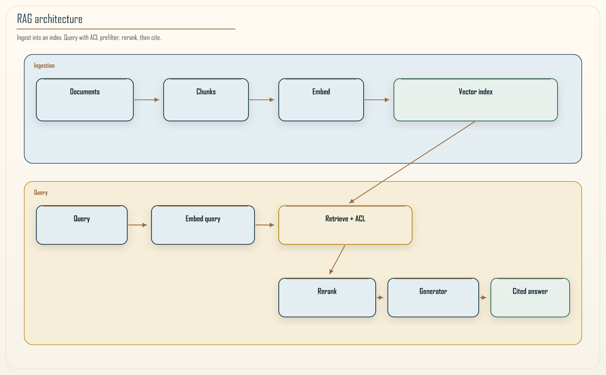
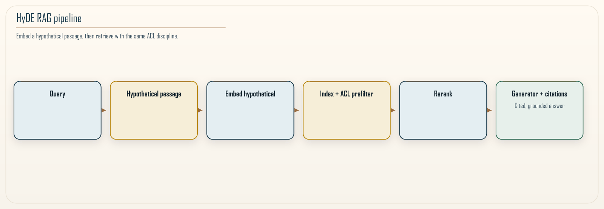

# Chapter 17: Retrieval-Augmented Generation at Scale

<div class="chapter-header">
  <h2 class="chapter-subtitle">Retrieval as a Data-Plane Discipline, Not a Prompt Trick</h2>
  <div class="chapter-meta">
    <span class="reading-time">📖 60 min read</span>
    <span class="difficulty">🎯 Expert</span>
  </div>
</div>

## Abstract

**RAG** composes **information retrieval (IR)** with **conditional text generation**. At enterprise scale, **failure modes** mirror classical distributed data systems: *staleness*, *partition misrouting*, *hotspots*, and *evaluation drift*. This chapter positions RAG inside **Adaptive Granularity Governance: The Khan Microservice Pattern™**: bounded contexts for corpora, explicit **ACL-aware metadata**, continuous **offline/online evaluation**, and tiered **embedding + rerank** stacks on AWS (OpenSearch Serverless, Bedrock embedding models, S3 as source-of-truth store).



*Figure 17.1: Canonical RAG data plane-ingestion, chunking, embedding, retrieval, rerank, generation.*

---

## 17.1 IR foundations: notation

Let corpus \(\mathcal{D}\) be chunked into \(\{c_i\}\). Encoder \(f\) maps text to \(\mathbb{R}^d\). For query \(q\), retrieve \(\mathrm{TopK}(q)=\arg\max_{|S|=K,S\subseteq\{c_i\}} \sum_{c\in S} \mathrm{sim}(f(q), f(c))\) under constraints (ACL, freshness).

**Proposition 17.1 (Monotonicity does not imply correctness).** Higher cosine similarity **does not** guarantee factual entailment-**rerankers** and **LLM judges** remain necessary for mission-critical answers.

---

## 17.2 HyDE: hypothetical document embeddings



*Figure 17.2: HyDE improves recall for underspecified queries by retrieving against a synthetic passage rather than the raw query embedding.*

**HyDE** generates a synthetic passage \(h\) answering \(q\), then retrieves using \(f(h)\)-often improving recall when \(q\) is **underspecified**. **Trade-off:** hallucinated \(h\) may retrieve irrelevant chunks-enforce **temperature controls** and **citations**.

```python
def retrieve_hyde(q: str, llm, embed, index, acl):
    h = llm.generate(f"Draft a factual paragraph answering:\n{q}", temperature=0.0)
    v = embed(h)
    return index.knn(v, k=50, prefilter=acl)
```

---

## 17.3 Evaluation: beyond ROUGE

Construct **gold sets** of supporting facts. Metrics:

- **Citation precision:** fraction of cited passages that entail answer.  
- **Refusal quality:** when abstaining is correct for OOD queries.  
- **Latency p95/p99** under representative concurrency.

Run **shadow** deployments comparing rerank variants.

---

## Recipe 17.1: Chunk metadata schema (JSON)

```json
{
  "chunk_id": "doc:policy/2026/security#p12",
  "acl": ["architecture", "security"],
  "freshness": "2026-04-01T00:00:00Z",
  "lineage": "s3://kb/policy/2026/security.pdf#page=12"
}
```

---

## 17.4 Cost and hotspot management

Cache **query embeddings**; shard vector indexes by **tenant prefix**; use **small** cross-encoder rerankers before large generators.

---

## 17.5 Failure taxonomy

| Failure | Symptom | Mitigation |
|---------|---------|------------|
| **Index drift** | Stale policies surface | Re-ingest pipelines + version pins |
| **ACL leakage** | Cross-tenant retrieval | Metadata filters *before* knn |
| **Poisoning** | Malicious corpus entries | Provenance + write approval |

---

## 17.6 Synthesis

RAG is a **distributed database problem wearing an LLM costume**. Treat it with the same engineering rigor as Chapters 4-7 data chapters, then connect outputs to **agent guardrails** (Chapter 16).

---

**Navigation:**
- [Previous: Chapter 16](16-agentic-ai-architectures.md)
- [Next: Chapter 18](18-modular-monolith.md)
