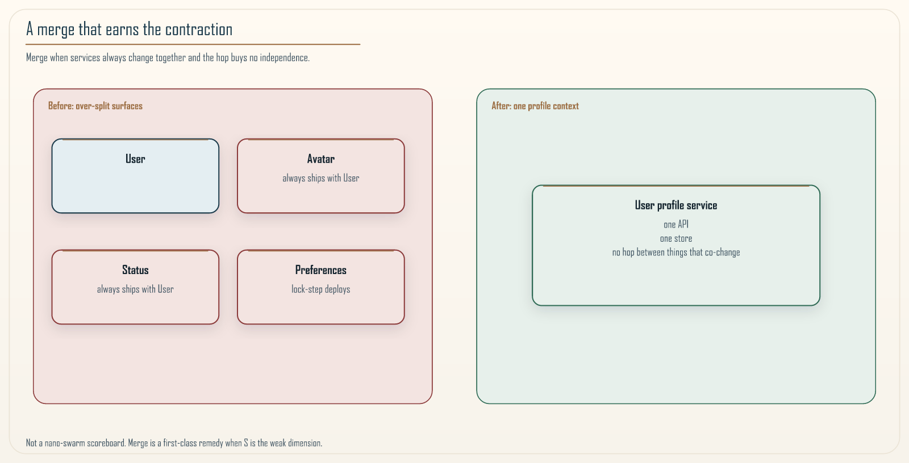
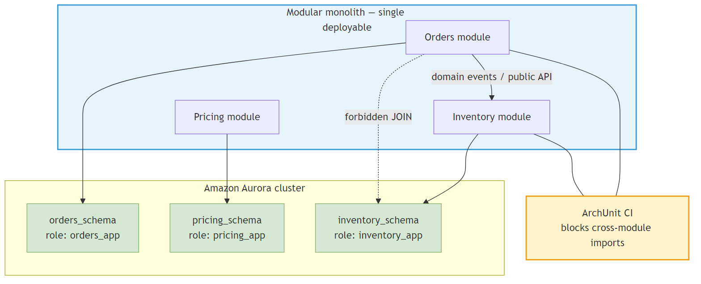

# Chapter 18: The Modular Monolith

<div class="chapter-header">
  <h2 class="chapter-subtitle">Monolith-First as a Rational Economic Equilibrium</h2>
  <div class="chapter-meta">
    <span class="reading-time">📖 55 min read</span>
    <span class="difficulty">🎯 Expert</span>
  </div>
</div>

## Abstract

The **modular monolith** deliberately packages multiple **bounded contexts** inside a **single deployable artifact** while enforcing **schema-per-module** isolation and **forbidden cross-module dependencies** in CI. It is the rational response when **deployment independence** yields less economic utility than **reduced network tax** and **operational surface area**, consistent with Adaptive Granularity Governance: The Khan Microservice Pattern™’s **contraction** phase (Chapter 11). We analyze failure modes of shared databases, connect to **ArchUnit** fitness functions, and quantify **when** extraction to microservices becomes dominant in the RVx calculus.



*Figure 18.1: Consolidating services when kinetic friction falls: merge economics dominate microservice isolation.*

---

## 18.1 Problem formulation

Let modules \(m \in \mathcal{M}\) share a process. **Coupling graph** \(G=(\mathcal{M},E)\) edges denote compile-time imports. **Goal:** keep \(G\) **acyclic** at package level and ensure **no ambient** coupling through shared tables.

**Definition 18.1 (Semantic monolith).** A code arrangement that *looks* modular but shares **mutable tables** across contexts-**distributed monolith** precursor.

---

## 18.2 Schema-per-module on shared infrastructure

Use **logical schemas** (or separate databases later) with **role-based grants** prohibiting cross-schema joins for application roles. **Read models** cross boundaries only via **integration events** or **explicit views** owned by consuming modules.

| Mechanism | Guarantees |
|-----------|------------|
| **Schema grants** | Physical impossibility of accidental SQL joins |
| **Module APIs** | Language-level encapsulation |
| **Events** | Cross-context facts without shared tables |



*Figure 18.2: Schema-per-module grants make cross-context SQL joins impossible for application roles.*

---

## Recipe 18.1: ArchUnit boundary enforcement (Java)

```java
@AnalyzeClasses(packages = "com.example.commerce")
public class ModulithRules {
    @ArchTest
    static final ArchRule orders_do_not_import_inventory_internals =
        noClasses()
            .that().resideInAPackage("..orders..")
            .should().dependOnClassesThat()
            .resideInAPackage("..inventory.internal..");
}
```

Fail CI on violation: treat as **compile-time blast shield**.

---

## 18.3 Economic model (sketch)

Let \(C_{\mathrm{net}}\) be network + ops cost of extraction; let \(C_{\mathrm{coup}}\) coupling cost of staying merged. Extract when:

\[
\mathbb{E}[\Delta \mathrm{RVx}] = f(C_{\mathrm{net}}, C_{\mathrm{coup}}) > \tau
\]

(use project-specific calibration; Chapter 11 formulas).

---

## 18.4 Evolution to microservices

When extraction triggers, **interfaces already exist** at module seams: migrate with **strangler routing** (Chapter 19).

---

## 18.5 Limitations

Single runtime means **single blast radius** for catastrophic defects; mitigate with **feature flags**, **traffic shadowing**, and **cell-aware** deployments even inside monolith (logical cells).

---

## 18.6 Synthesis

The modular monolith is **not an apology**; it is disciplined modularity maximizing learning speed **until evidence justifies** network distribution.

---

**Navigation:**
- [Previous: Chapter 17](17-rag-at-scale.md)
- [Next: Chapter 19](19-strangler-fig-pattern.md)
