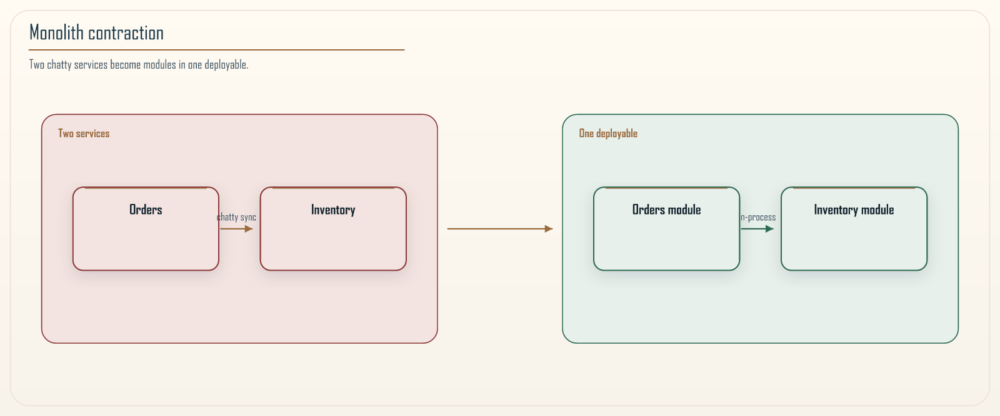

# Chapter 18: The Modular Monolith

<div class="chapter-header">
  <h2 class="chapter-subtitle">The Right Number of Services Is Often One.</h2>
  <div class="chapter-meta">
    <span class="reading-time">📖 55 min read</span>
    <span class="difficulty">🎯 Expert</span>
  </div>
</div>

This is the chapter that argues against the rest of the book, and it is one of the most important chapters in it. Everything so far has been about how to distribute a system well: how to draw boundaries, how to communicate across them, how to keep them isolated and observable and governed. This chapter makes the case that, for a great many systems, the right number of services is one, and that reaching for microservices before you need them is the most expensive mistake a team can make with a straight face.

I want to be clear that this is not a contrarian pose. It follows directly from Khan's Law and the RVx Index in Chapter 11. If a boundary earns its distributed cost only when it is efficient, independent, and ownable all at once, then a boundary that does not clear that bar should not exist, and early in a system's life very few boundaries clear it, because you do not yet know where the real seams are. I am not restating that score here. Chapter 11 is the source of truth. The modular monolith is what you build while you are still learning where the boundaries belong, and for many systems it is not a phase you grow out of, it is the correct end state. The Fulcrum governance loop has a contraction direction as well as an expansion direction, and this chapter is about living well in the contracted state. Chapter 2 already told Segment's story of paying the tax and walking it back. This chapter is how you avoid paying it in the first place.

## 18.1 What a modular monolith actually is

A modular monolith is a single deployable application that is rigorously divided inside into modules, where each module owns a bounded context in the domain-driven-design sense from Chapter 3, and where the boundaries between modules are enforced as strictly as if they were separate services, except that they run in the same process and deploy as one unit.

The two halves of that definition both matter, and dropping either one produces a failure. If you have a single deployable but no internal module boundaries, you have a big ball of mud, the classic unstructured monolith where everything reaches into everything and change is terrifying. If you have strict module boundaries but you split them into separate deployables before you need to, you have paid the distribution tax for isolation you could have had for free inside one process. The modular monolith is the deliberate combination: the internal discipline of microservices with the operational simplicity of a single unit.

The distinction that separates a modular monolith from a distributed monolith is worth stating precisely, because they are opposites that are easy to confuse. A distributed monolith is many deployables that are secretly coupled, so you pay the distribution cost and get none of the independence. A modular monolith is one deployable that is internally decoupled, so you pay none of the distribution cost and get most of the independence that matters during development, the ability to reason about, change, and test one module without understanding all the others. The distributed monolith is the worst of both worlds. The modular monolith, done well, is a large slice of the best of both.

A bounded context is still a model boundary, not automatically a deployable. Chapter 3 already said that. Circles on a wall become candidate modules first and services second, and only when the signals say so.

## 18.2 Why monolith-first is usually the rational choice

The strongest argument for starting with a modular monolith is not sentimental, it is economic, and it rests on a fact about knowledge: at the start of a system's life, you know the least you will ever know about where its boundaries belong. Boundaries drawn early are drawn in ignorance, and a boundary drawn in the wrong place and then hardened into a network call is enormously expensive to move, because moving it means changing a network protocol, coordinating a deployment across services, and migrating data across a boundary that should never have existed.

Inside a monolith, a boundary in the wrong place is cheap to move. It is a refactor: change some code, run the tests, ship one deployable. There is no protocol to renegotiate, no distributed data migration, no cross-team coordination. This asymmetry is the heart of the argument. Early on, when you are wrong about boundaries frequently, being wrong should be cheap, and the monolith makes it cheap. Later, when you understand the domain and a few boundaries have proven themselves stable and independent, extracting those specific boundaries into services is a considered move on good information, which is exactly the situation in which distribution pays off.

Martin Fowler's *Monolith First* observation, that you should not start with microservices unless you have already experienced the pain that justifies them, is the same point from a different angle. Microservices solve problems of scale, team autonomy, and independent deployment that a small system with a small team simply does not have. Adopting the solution before you have the problem means you pay the full operational cost, the pipelines, the observability, the distributed debugging, the network failure modes, and receive benefits you cannot yet use, because you do not have enough teams to deploy independently or enough scale to need independent scaling. The Chapter 11 framing makes this concrete: for a small system, almost no boundary clears the bar, so almost no boundary should be a service, and a metric that says so is not being timid, it is being correct.


*Figure 18.1: The contraction move. Two services that always changed together and paid a network tax for no real independence are merged back into modules within a single deployable. The diagram shows the before state, two services with a chatty synchronous edge between them, and the after state, one deployable with two modules and a plain in-process call between them. The point is that merging is not failure, it is the correct response when the granularity signals say the boundary was never earning its cost. Chapter 11 already made merging a first-class move. This figure is that move lived in.*

## 18.3 Enforcing boundaries that have no network to stop them

The hard part of a modular monolith is that nothing physically stops one module from reaching into another. In a microservices architecture the network is a crude but effective boundary: to call another service you have to make a network request, which is annoying enough that developers notice they are crossing a boundary. Inside a single process, calling another module's internal class is as easy as calling your own, so the boundary exists only if you enforce it, and an unenforced boundary erodes to nothing within a few sprints under deadline pressure.

There are three enforcement mechanisms, and a serious modular monolith uses all three, because each catches what the others miss.

The first is **language-level encapsulation**. Use the language's own visibility controls so that a module exposes a small public interface and hides everything else. In Java this means a module's internal classes are genuinely package-private, and the public interface is a deliberately small surface. Package-private is per package, not per module. A module that spans several packages still needs the second mechanism. The Java module system can close the internals for real. Most application stacks do not use it. In other languages the mechanism differs, Go's internal packages, C#'s internals visible to a friend, Python's convention that is not a wall, but the principle is the same: make the internals unreachable, not merely conventionally private. This stops the accidental reach into internals. It is not sufficient alone, because determined or careless developers find ways around visibility, reflection, a string-named bean, a shared static, and language visibility does not express architectural intent like "the orders module must never depend on the inventory module's internals."

The second mechanism is **architecture testing**, and it is the one that makes modular monoliths viable at scale. A tool such as ArchUnit, or Spring Modulith on a Spring codebase, or NetArchTest, dependency-cruiser, import-linter in the languages that are not Java, lets you write the architectural rules as automated tests that fail the build when a rule is violated. You assert, in code that runs in the pipeline, that classes in the orders package may not depend on classes in the inventory internal package, and if someone adds that dependency, the build goes red before the change merges. This turns the module boundary from a diagram everyone ignores into a compile-time constraint nobody can cross by accident.

These tests see compile-time dependencies. They do not see SQL. They do not see reflection. They do not see a runtime lookup by name. Treat a green architecture test as "the import graph is clean," not as "the modules are isolated."

### Recipe 18.1: Fail the build when a module reaches into another

**Context.** Orders and inventory live in one deployable. A developer under deadline imports `inventory.internal`.

**Solution.** An architecture rule that names the packages and fails CI.

```java
@AnalyzeClasses(packages = "com.example.commerce")
public class ModuleBoundaryRules {

    @ArchTest
    static final ArchRule orders_must_not_touch_inventory_internals =
        noClasses()
            .that().resideInAPackage("..orders..")
            .should().dependOnClassesThat()
            .resideInAPackage("..inventory.internal..");

    @ArchTest
    static final ArchRule modules_communicate_only_through_published_api =
        classes()
            .that().resideInAPackage("..inventory.internal..")
            .should().onlyBeAccessed()
            .byClassesThat().resideInAPackage("..inventory..");
}
```

Read those two rules as sentences: the orders module may not reach into inventory's internals, and inventory's internals may only be touched by inventory itself. A violation fails the build with a message naming the offending class, so the boundary defends itself continuously without anyone remembering to check. The same sentences belong in whatever fitness-function tool your language actually has. ArchUnit is the Java spelling, not the idea.

The third mechanism is **data isolation**, which Section 18.4 develops, because the most common way a modular monolith rots into a distributed monolith precursor is through the shared database, not through the code.

## 18.4 Schema per module: the boundary that matters most

If two modules share database tables and read and write each other's data directly, then no amount of code-level boundary enforcement saves you, because the modules are coupled through the data even if the code looks clean. The shared mutable table is the single most common way a modular monolith quietly becomes the thing it was supposed to prevent, and it is invisible to ArchUnit because it happens in SQL, not in class dependencies. Chapter 1 already said exclusive schema ownership does not require a separate server. This section is that sentence made operational inside one process.

The discipline is schema per module. Each module owns its own schema, and no module may read or write another module's tables directly. On shared database infrastructure this is enforced with database-level grants: the application role for the orders module simply does not have permission to select from the inventory module's tables, so a cross-module join is not a bad practice to be caught in review, it is a permission error that fails immediately.

Grants are theater if the whole monolith uses one role and one connection pool. You need a datasource, and a role, per module, `orders_app` can touch `orders` and nothing else. A migration role that can see every schema is fine. Application traffic must not use it. Cross-schema foreign keys are still coupling even when the app cannot join. Do not put them in and call the schemas independent.

This makes the boundary a physical impossibility rather than a guideline, which is the same principle as the access-control-before-retrieval rule from Chapter 17: enforce the boundary at the layer where crossing it is impossible, not at the layer where crossing it is merely discouraged.

```sql
REVOKE ALL ON SCHEMA inventory FROM orders_app;
GRANT USAGE ON SCHEMA orders TO orders_app;
GRANT SELECT, INSERT, UPDATE, DELETE ON ALL TABLES IN SCHEMA orders TO orders_app;
```


*Figure 18.2: Schema-per-module isolation on shared infrastructure. Each module, orders and inventory in the diagram, has its own logical schema, and the application role for each module holds grants only on its own schema. The dashed line between them, the tempting cross-schema join, is shown blocked, because the grant simply does not exist. The message is that the data boundary is enforced by the database engine itself, so a developer cannot accidentally couple two modules through a join, and the discipline holds without relying on anyone remembering the rule. One shared `app` user would make this picture a lie.*

When modules need each other's data, they get it the same way separate services would, through a published interface or through integration events, not through a shared table. The orders module does not read the inventory table; it calls inventory's published method, or it subscribes to inventory's events and keeps its own read model. This feels like more work than a join, and it is, and that is the point: the friction is the boundary doing its job, and it is the same friction you would pay across a network, except here you pay it in-process instead of in milliseconds on the wire. You get the decoupling of separate data ownership without the distribution tax, which is the modular monolith's central bargain.

The payoff arrives later, at extraction time. Because the modules already communicate through interfaces and events and never through shared tables, a module that has proven itself a stable, independent boundary can be extracted into a service with its schema coming along cleanly, since nothing else was reading its tables. The schema-per-module discipline is what makes future extraction a controlled move rather than a data-untangling nightmare, which is why it is worth paying for even in a monolith you never intend to split.

## 18.5 How modules talk without coupling

If modules must not reach into each other's internals or share each other's tables, then they need a disciplined way to communicate, and the choices here determine whether the monolith stays modular or slides back toward a ball of mud through the back door of casual in-process calls. The good news is that the same two communication styles that services use, synchronous request and asynchronous event, apply inside the monolith, at in-process cost instead of network cost.

The **synchronous** style is a direct call from one module to another module's published interface, never to its internals. The orders module calls a method on inventory's public API, and because Section 18.3's architecture tests forbid touching the internals, that call can only go through the deliberately small, stable surface the inventory module chose to expose. This is exactly the interface a service would present, minus the serialization and the network, which is what makes later extraction clean: the call site already depends only on the published contract, so replacing the in-process call with a network call changes how the contract is invoked, not what it is.

The **asynchronous** style is the in-process event, and it is the one that most reduces coupling. Instead of the orders module calling inventory directly, it publishes a domain event, "order placed," and inventory subscribes and reacts. The two modules never reference each other at all; they share only the event's shape. This is the same publish-and-react decoupling from Chapter 10, and it gives the same benefit, the publisher does not know or care who consumes the event, so modules can be added and changed without touching the ones they collaborate with. An in-process event bus, a simple mediator that routes events to handlers within the same process, is enough.

It is not the same as a broker. Many in-process mediators run the handler in the publisher's thread and in the publisher's transaction. That is convenient, and it is a lie you will discover on extraction day, when the call becomes at-least-once, out of process, and capable of succeeding after the publisher rolled back. Make the handlers idempotent now. If you care about "the write and the event either both happen or neither do" after extraction, use the outbox from Chapter 6 *inside* the monolith, not only after you split. The event contracts can stay. The delivery semantics will not, unless you designed for them.

The discipline that keeps this honest is to prefer events for cross-module notification and to keep synchronous calls to genuine queries that need an immediate answer. A module that synchronously calls three other modules to do its work has recreated the chatty coupling of a distributed monolith, in-process, and it will be miserable to extract. A module that publishes events and answers queries through a small interface is loosely coupled whether it lives in the monolith or gets promoted to a service, which is the property you are paying the modular discipline to preserve.

## 18.6 Testing is where the modular monolith quietly wins

One advantage of the modular monolith rarely gets the credit it deserves, and it is directly relevant to the testing difficulties of Chapter 9: because the whole system runs in one process, you can test cross-module behavior end to end without the environmental flakiness that makes distributed end-to-end tests so painful. The multiplication of failure probabilities from Figure 9.1, which forces microservices systems to keep their end-to-end tests few and guarded, simply does not apply when there is no network between the modules and no fleet of services to stand up.

This changes the testing pyramid in the monolith's favor. A test that exercises the full order-placement flow across the orders, inventory, and payment modules is, in a microservices system, a slow and flaky end-to-end test that spans real services. In a modular monolith it is a fast, deterministic in-process test that starts the application, drives the flow through the real modules, and asserts the outcome, with no network to flake and no other team's service to depend on. You get the confidence of a whole-flow test at the cost and reliability of an integration test, which is a genuinely better position than the microservices system can occupy.

It is not a magic immunity to flakes. A shared database, a leaked clock, a dirty schema between tests, will still lie to you. What you have escaped is the *product of many services being up at once*. That is the multiplication Figure 9.1 was about.

The module boundaries also make focused testing easier rather than harder, because they are real boundaries. A module can be tested through its published interface with its collaborators replaced by test doubles, exactly as a component test treats a service in Chapter 9, and because the module already talks to its neighbors only through interfaces and events, substituting those neighbors is straightforward. The architecture tests from Section 18.3 add a kind of test the distributed system cannot easily write at all: a test that the structure itself is intact, that no forbidden dependency has crept in, checked on every build. The result is that a well-built modular monolith is often better tested than the microservices system that replaced it, because the tests are cheaper to write, faster to run, and more reliable, so teams actually write and keep them. When a module is eventually extracted, its tests come along and the new service inherits a real suite from day one, which is a far better starting point than a freshly split service usually gets.

## 18.7 When extraction finally pays: reading the signals

The modular monolith is not an argument against ever distributing. It is an argument for distributing on evidence rather than on fashion, and the evidence comes from the same Chapter 11 signals that govern boundaries everywhere in this book. A module inside the monolith is a candidate for extraction into a service when its signals say the distribution would finally pay for itself.

The **efficiency** signal points toward extraction when a module has become a scaling bottleneck that cannot be scaled independently inside the monolith. If one module consumes most of the compute and needs to scale on a *different curve* than the rest, GPU versus CPU, memory versus request rate, keeping it in the shared deployable forces you to scale everything to scale it, which wastes resources. Horizontal copies of the whole monolith, the logical cells in Section 18.9, scale the process, not the shape. Extraction lets that module scale on its own, and the distribution cost is now justified by a real independent-scaling benefit.

The **distinctness** signal points toward extraction when a module has proven, over many releases, that it changes on its own schedule and does not co-change with its neighbors. This is the crucial one, because it is exactly the evidence you did not have at the start. After months of real development history, you can measure which modules are genuinely independent and which still change together, at the unit of merged pull requests, the way Chapter 1 and Chapter 11 already measure it, and only the genuinely independent ones are safe to extract. A module you extract while it still co-changes with another becomes a distributed monolith fragment, the failure the whole book warns against.

The **cognitive-load** signal points toward extraction when a module has grown large enough, and is owned by a distinct enough team, that giving that team full independent ownership and deployment cadence would genuinely help. This is the Conway's Law consideration: when the module maps to a team that would move faster with its own deployable, extraction serves the organization as well as the architecture. Load alone is not enough. Chapter 11's high-load gate is an ownership problem first. Splitting a module to "fix" an overwhelmed team without changing who owns it just gives them two deployables to drown in.

The honest counsel is to extract the few modules where all the relevant signals agree, and to leave the rest in the monolith. Most systems reach a stable state with a small number of extracted services around a substantial modular core, not a fully distributed constellation, because most modules never clear the bar, and forcing them across it is how you manufacture the distributed monolith. The strangler pattern in the next chapter is the mechanism for doing the extraction gradually and safely when the signals do say go.

## 18.8 Modularizing an existing ball of mud

Most teams do not get to start with a clean modular monolith. They inherit an unstructured one, a large application where everything reaches into everything, and the practical question is not whether the modular monolith is a good target but how to get there from the mud without a rewrite. The encouraging answer is that the path into a modular monolith is far safer than the path into microservices, because every step happens inside one process where a wrong boundary is a cheap refactor rather than an expensive network migration.

The approach is incremental and evidence-driven, and it reuses the analysis tools from Chapter 11. Begin by finding the seams that already exist rather than imposing ones you imagine. The temporal-coupling analysis from Chapter 1, which files change together in the version-control history, reveals clusters of code that belong together and cut lines where coupling is weak, and those natural clusters are candidate modules. You are not inventing boundaries; you are discovering the ones the code has already been telling you about through its change history.

With candidate modules identified, carve them out one at a time, starting with the one that is most independent and least risky. For each, the sequence is the same: pull the module's code behind a published interface, redirect its collaborators to call that interface instead of reaching into its internals, and then add the architecture test from Section 18.3 that makes the new boundary permanent so it cannot erode. The hardest and most important part is usually the data, because the mud is almost always coupled through shared tables. Separating a module's data into its own schema, and replacing cross-module joins with calls to the module's interface, is slow work, but it is the work that actually decouples, and Section 18.4 explains why it is the boundary that matters most.

Do not extract to a service while you are still carving the module. That is two migrations at once, and you will blame the network for a seam that was never real.

Two disciplines keep this from stalling or backsliding. First, ratchet the constraints: once a module's boundary is established and its architecture test is green, that test guarantees the boundary never degrades again, so progress accumulates instead of eroding under the next deadline. Second, resist the urge to perfect every boundary before moving on. The goal is steady reduction of coupling, not an immaculate design, and a monolith that is sixty percent modularized with three clean modules and enforced boundaries is enormously better than one where a team spent six months on a grand plan and shipped nothing. Each extracted module makes the next one easier, because the code around it is now cleaner, and the process compounds. This is the same fix-forward, incremental philosophy the strangler pattern in the next chapter applies to extracting services, applied one level in, to bringing structure to a monolith while it keeps running.

## 18.9 The real limitation, stated honestly

A modular monolith has one genuine disadvantage that no amount of internal discipline removes, and pretending otherwise would be dishonest: it is a single deployable, so it has a single deployment blast radius. A catastrophic defect, a memory leak, an infinite loop, a crash, can take down the whole application, because all the modules share one process and one deployment. In a microservices architecture the same defect in one service leaves the others running. A feature flag will not save you from a leak. The process is still one process.

This is a real cost and it belongs on the scale honestly, but it is smaller than it first appears, and it is mitigable. It is smaller because the frequency and impact of process-wide catastrophic defects, weighed against the daily, certain cost of distributed complexity, usually favors the monolith for a system that is not yet at large scale. You are trading a rare, severe, recoverable event against a constant, guaranteed tax, and for many systems the constant tax is the bigger number. And it is mitigable with the same techniques the rest of the book describes, applied inside the monolith: feature flags to disable a misbehaving *behavior* without redeploying, traffic shadowing to catch defects before full rollout, bulkheads so one module cannot consume every thread, and even logical cells, running several instances of the monolith behind a router so that a crash takes down one instance and not the service. You do not get the full blast-radius isolation of separate services, but you get much of it, at a fraction of the operational cost.

The point is not that the modular monolith is free of tradeoffs. It is that its tradeoffs are usually the better ones for a system that has not yet earned the right to distribute, and that the one real cost, shared blast radius, is both smaller than it looks and partly recoverable, while the costs of premature distribution are large, certain, and paid every single day.

## 18.10 Summary

The modular monolith is a single deployable application divided internally into modules with boundaries enforced as strictly as if they were separate services. It is the honest default for a system that does not yet know where its boundaries belong, which early on is every system, and for many systems it is not a phase but the correct end state. It follows directly from Khan's Law: a boundary earns distribution only when it is efficient, independent, and ownable at once, and early on almost none are, so almost none should be services.

Its central bargain is the internal decoupling of microservices with the operational simplicity of one unit, and its central risk is eroding into a big ball of mud or a distributed-monolith precursor if the boundaries are not enforced. Enforce them with three mechanisms together: language-level encapsulation, architecture tests that fail the build on a boundary violation, and schema per module backed by database grants, and a role per module, that make cross-module joins physically impossible. The data boundary is the one that matters most, because the shared table is how a clean-looking monolith rots. In-process events are not a broker. Make the handlers idempotent before you extract.

Extract a module into a service only when the Chapter 11 signals agree that distribution will finally pay, efficiency demanding a different scaling curve, distinctness proven over real release history, and cognitive load mapping to a team that would move faster alone, and leave the rest in the monolith. Accept the one real limitation, a shared deployment blast radius, honestly, and mitigate it with flags, shadowing, bulkheads, and logical cells. Done this way, the modular monolith is not an apology for failing to adopt microservices. It is disciplined modularity that maximizes learning speed until the evidence justifies distribution, and it is the architecture the granularity metric most often recommends. The next chapter covers the strangler fig pattern, which is how you carry out an extraction, when the signals finally say go, without a risky big-bang rewrite.

---

**Navigation:**
- [Previous: Chapter 17](17-rag-at-scale.md)
- [Next: Chapter 19](19-strangler-fig-pattern.md)
