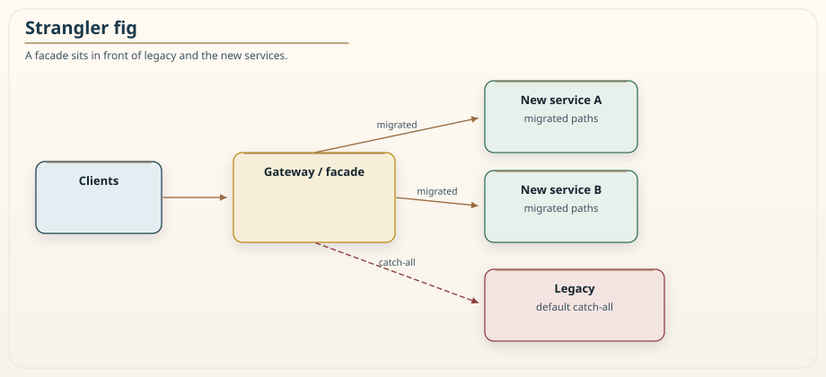
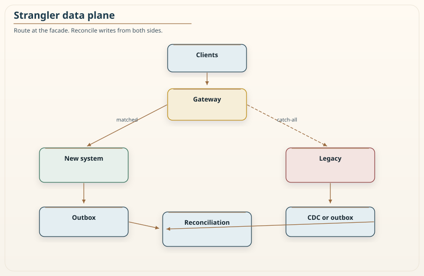

# Chapter 19: The Strangler Fig Pattern

<div class="chapter-header">
  <h2 class="chapter-subtitle">Replace It While It Is Still Running.</h2>
  <div class="chapter-meta">
    <span class="reading-time">📖 55 min read</span>
    <span class="difficulty">🎯 Expert</span>
  </div>
</div>

The strangler fig is a tree that begins its life in the canopy, sends roots down around an existing tree, and slowly grows until it can stand on its own, at which point the original tree is gone and the fig remains in its place. Martin Fowler borrowed the image for software migration, and it is one of the most useful metaphors in our field, because it captures the single most important truth about replacing a large old system: you do it gradually, from the outside in, while the old system keeps running, and you never have a day where you tear down the old and stand up the new in one terrifying leap.

That leap, the big-bang rewrite, is the alternative the strangler fig exists to avoid, and it is where migrations go to die. The big-bang rewrite says freeze the old system, build the new one, and switch over on a date. It fails with grim reliability, because the old system is never as well understood as everyone believed, the new system takes far longer than planned, the two drift apart during the long build, and the switchover day discovers all the behavior nobody documented. The strangler fig replaces that single catastrophic risk with a stream of small, reversible ones. This chapter is about how to run one well, and it is the natural companion to the previous chapter, because the strangler fig is how you carry out the extraction that the modular monolith's signals finally tell you to make. It is the *how*. Chapter 11 and Chapter 18 are still the *whether*.

## 19.1 The core mechanism: intercept, route, replace

The strangler fig works by inserting a facade in front of the old system, a point through which all traffic flows, and then incrementally redirecting slices of that traffic to new implementations while the rest continues to the old system. Over time the new implementations handle more and more, the old system handles less and less, and eventually the old system handles nothing and can be retired. There is no *estate-wide* switchover. There is a cutover *per capability*, and each one is small enough to reverse.

The facade is usually an API gateway or a reverse proxy, placed so that clients talk to it rather than directly to the old system. On day one the facade routes everything to the old system and does nothing visible, which is itself the first and most important step: you have inserted the control point without changing any behavior, so you can verify the facade is transparent before you use it to redirect anything. That insertion is still a cutover. DNS moves. Clients that keep calling the old address will never be migrated. Lock the legacy origin so only the facade can reach it, or you have two front doors and a lie about coverage.

Then, capability by capability, you build the new implementation, and you configure the facade to route that specific capability's traffic to the new implementation instead of the old one.


*Figure 19.1: The strangler routing facade. Clients on the left send all requests to the gateway in the middle. The gateway routes specific migrated paths, shown as solid arrows, to the new services on the upper right, and routes everything else, the default greedy match shown as a dashed arrow, to the legacy system on the lower right. As migration proceeds, more paths become solid arrows to new services and fewer fall through to legacy, until the legacy arrow carries nothing. The diagram's point is that the client never knows any of this is happening, because the gateway presents one stable surface throughout.*

The routing detail that makes this work in practice is **specific before greedy**. The facade must match the migrated routes before it falls through to the catch-all that sends everything else to the legacy system. How that is expressed depends on the product. An ALB listener rule is a priority number: a catch-all at priority 1 swallows every path you thought you migrated. Nginx and HTTP API routes prefer the more specific location. API Gateway REST APIs match the resource tree, so `/{proxy+}` only sees what no sibling resource claimed. Terraform file order does not decide any of this. Get the match wrong and every request goes to legacy regardless of what you built. Write a test that specifically verifies migrated routes reach the new service and unmigrated ones reach legacy. Do not trust the console screenshot.

## 19.2 The invariant: coverage only grows

A healthy strangler migration has a property worth stating as an invariant: the set of capabilities handled by the new system grows monotonically over time. You migrate a capability, verify it, and it stays migrated. You do not migrate it, find a problem, revert it, and leave it reverted for months, because that is not a migration, it is thrashing, and it is how strangler projects stall into a permanent limbo where ten percent of traffic has been on the new system forever and nobody can say when the rest will follow.

Temporary rollback is allowed and necessary, but it must be a controlled, brief exception behind a feature flag, not a quiet retreat. If migrating a capability surfaces a problem, you flip the flag to route that capability back to legacy, you fix the problem, and you migrate it again, and the whole round trip is a matter of hours or days, not a silent abandonment. The discipline is that the trend is always toward more coverage, and a capability that keeps bouncing back to legacy is a signal that the new implementation is not ready, which is information, not a place to rest.

This invariant is what separates a strangler migration that finishes from one that becomes a permanent two-system purgatory, which is a real and common failure. Running two systems is more expensive and more complex than running one, so the two-system state is a cost you are paying to buy safety during migration, and it is only worth paying if you are actually moving toward one system. A migration that parks at fifty percent forever has taken on all the cost of running two systems and none of the benefit of finishing, which is the worst place to be. Section 19.7 returns to this as an organizational problem, because it usually is one.

## 19.3 The data plane is the hard part

Routing requests is the easy half of a strangler migration. The hard half is data, because the old and new systems both need to read and write state, and if they do so naively you get split-brain: the old system updates its copy, the new system updates its copy, and the two diverge into an inconsistent mess that is extremely painful to reconcile after the fact.


*Figure 19.2: The data-plane concerns behind the routing facade. Above the line, the gateway routes requests as in Figure 19.1. Below the line, the diagram shows the synchronization machinery that the simple routing view hides: an outbox on the authoritative system captures every state change as an event, and a change-data-capture pipeline, or a reconciliation job, propagates those changes so the other system's data stays consistent during the window when both are live. The message is that a strangler migration is only as safe as its data synchronization, and the routing diagram alone hides the real work.*

There are a few patterns for handling this, and which you use depends on how the migration is staged. When the legacy system remains the authoritative owner of the data and the new system only reads, you can feed the new system through change data capture from the legacy database, so the new system's view stays current without either system writing the other's store. Publish a deliberate event, not the raw row. Chapter 6 already warned that streaming the table couples every consumer to the legacy schema and can leak columns that were never a public contract.

When the new system begins to own writes for a capability, you need a clear rule about which system is authoritative for which data, and often a dual-write window. Dual-write is the bug Chapter 6 opened with when the two writes are uncoordinated. The outbox is the fix: the authoritative system writes the business row and the event in one local transaction, a relay publishes, the other system applies idempotently, and a reconciliation job detects what the relay missed. Do not have both systems accept writes for the same record and hope they converge. That is split-brain with a nicer name.

The rule that keeps this safe is to migrate a capability's **data ownership** as a deliberate, explicit step, never as an accident of routing. Decide, for each capability, which system owns its data at each stage of the migration, make that ownership unambiguous, map identifiers between the two stores, and use the synchronization patterns to keep the non-authoritative copy current. A migration that shifts request routing without a corresponding, explicit decision about data ownership is the fast path to split-brain, and split-brain discovered late is one of the worst incidents a migration can produce, because by then both systems have accumulated divergent state that no one can confidently reconcile.

## 19.4 Verification: proving the new path matches

Because the strangler fig replaces behavior incrementally, you get something the big-bang rewrite never offers: the ability to verify each migrated capability against the old one while both are running. Use it, because the whole safety argument for the strangler pattern depends on catching behavioral differences before they reach customers, and that only happens if you actually check.

The strongest verification technique is **shadow traffic**. Before you route a capability's real traffic to the new implementation, send a copy of the real traffic to the new implementation in parallel and compare its responses to the legacy system's responses. This tells you, on real production inputs, whether the new implementation behaves like the old one, without customers seeing the new output.

"Discard its side effects" is the phrase that makes this sound free. It is not free on a write. If both paths persist, you have dual-write and you may have charged the card twice. Shadow writes only if the new path is in a dry-run mode, writes to a disposable store, or the request is safe, GET and the like. Comparing two live POST handlers is not a shadow. It is a production dual-write you did not mean to start.

Compare meaning, not bytes. Timestamps, request identifiers, and header order will never match. Decide which fields are the contract. Differences are findings: either the new system has a bug, or the old system had undocumented behavior you just discovered, and both are exactly what you need to know before you cut over.

Alongside shadow traffic, run contract tests that pin the behavior the new implementation must preserve, Chapter 9's `can-i-deploy` still applies at the seam, and synthetic transactions that exercise the migrated capability end to end and alert if the new path diverges. The combination gives you confidence built from evidence rather than hope, which is the same posture the Fulcrum loop from Chapter 11 takes toward any change: verify against reality, and only widen when the evidence is good. A strangler migration is, in effect, a long-running series of canary deployments, and it deserves the same verification rigor as any canary, applied capability by capability.

### Recipe 19.1: A greedy catch-all that does not swallow the new paths

**Context.** You have inserted a facade. Unmigrated traffic must reach the legacy system on a private path. Migrated paths must not.

**Solution.** A specific resource per migrated capability, and a greedy proxy for the rest. On API Gateway REST, the VPC link terminates on a **network** load balancer. An application load balancer is a different product. HTTP API VPC links can target an ALB. This sketch is REST. Validate it against current provider docs; resource shapes move.

```hcl
# Catch-all only. Sibling resources for migrated paths claim those
# URLs on the resource tree. Terraform order is not match order.
resource "aws_api_gateway_resource" "greedy" {
  rest_api_id = aws_api_gateway_rest_api.edge.id
  parent_id   = aws_api_gateway_rest_api.edge.root_resource_id
  path_part   = "{proxy+}"
}

resource "aws_api_gateway_method" "any" {
  rest_api_id   = aws_api_gateway_rest_api.edge.id
  resource_id   = aws_api_gateway_resource.greedy.id
  http_method   = "ANY"
  authorization = "AWS_IAM"
}

resource "aws_api_gateway_integration" "legacy_proxy" {
  rest_api_id             = aws_api_gateway_rest_api.edge.id
  resource_id             = aws_api_gateway_resource.greedy.id
  http_method             = aws_api_gateway_method.any.http_method
  type                    = "HTTP_PROXY"
  integration_http_method = "ANY"
  uri                     = "http://${aws_lb.legacy_nlb.dns_name}/{proxy}"
  connection_type         = "VPC_LINK"
  connection_id           = aws_api_gateway_vpc_link.legacy.id
  request_parameters = {
    "integration.request.path.proxy" = "method.request.path.proxy"
  }
}
```

Three notes the sketch otherwise hides.

The security note: when the gateway and the legacy system sit in different accounts or cross a trust boundary, authenticate the connection between them, mutual TLS or request signing, so the private link is not an open door. `authorization = "AWS_IAM"` on the method is the caller. The hop to legacy is a second hop. Chapter 7 already refused unsigned identity headers on that hop.

The origin note: once the facade is in, the legacy load balancer's security group should accept the facade, not the public internet. Coverage you cannot enforce is coverage you are guessing.

The test note: assert one migrated path hits the new integration and `/anything-else` hits this one. If you are on an ALB, that test is a priority number. If you are on REST API Gateway, it is a sibling resource. Same invariant, different knob.

## 19.5 Choosing what to migrate first

A strangler migration is a sequence of extractions, and the order you choose determines whether the migration builds momentum or stalls. There is a strong temptation to start with the hardest, most valuable capability, on the theory that it is the one that most needs replacing. This is usually a mistake, because the hardest capability is where you have the least experience with the migration machinery, the highest risk of a visible failure, and the longest time before you can show progress. A migration that opens with its riskiest move often does not survive the first setback.

The better sequencing balances three factors, which is the same value-and-risk portfolio thinking that Chapter 11 applies to migration order. I am not restating that score. The first factor is **seam quality**: prefer capabilities that are already loosely coupled to the rest of the legacy system, because they are the cleanest to carve out without dragging half the system along. The temporal-coupling analysis from Chapter 1 identifies these, the parts of the old system that change independently of the rest, and those natural seams are where the strangler cuts most cleanly. The second factor is **risk**: early in the migration, prefer lower-risk capabilities so that the inevitable mistakes happen while the stakes are low and the team is still learning the routing, synchronization, and verification machinery. The third factor is **value**: among the candidates that are well-seamed and acceptably risky, prefer the ones whose migration delivers real benefit, relief of a scaling bottleneck, unblocking a team, retiring a painful piece of legacy, so the migration earns its keep as it proceeds rather than only at the end.

The practical rule that falls out of these factors is to start with a capability that is well-seamed and low-risk even if it is not the most valuable, to prove the machinery and build confidence, and then to move toward the higher-value, higher-risk capabilities once the team has a working, verified pipeline and a few successful migrations behind it. The first migration's real product is not the capability moved; it is the proven, repeatable process, the facade that works, the synchronization that holds, the verification that catches differences. Once that process exists, each subsequent migration is a variation on a known theme rather than a leap into the unknown, and the migration accelerates instead of stalling. Re-measure after each step, the way Chapter 11 sequences neighborhood repairs, because extracting A changes what B is coupled to. Sequencing the migration well is the difference between a program that gains speed and one that spends its credibility on an ambitious first step that fails.

## 19.6 The facade is a component, not a free lunch

The routing facade is the enabler of the whole pattern, and it is also a new component in the critical path with its own risks, which teams routinely underestimate because the facade looks like plumbing. Every request now flows through it, which means its availability is the ceiling on the whole system's availability, its latency is added to every request, and its failure takes down access to both the new and the old systems at once. The facade that decouples your migration can become the single point of failure that couples everything, if you treat it carelessly. A fleet of gateway nodes is still one *logical* front door. Design it like Chapter 6 told you to design any critical hop: timeouts, bulkheads, a breaker that fails a bad backend without hanging the rest.

Three disciplines keep the facade healthy. The first is to **keep it thin**. The facade's job is to route, and routing is all it should do. The temptation, as the migration proceeds, is to let business logic creep into the facade, a transformation here, a special case there, a bit of orchestration to bridge the old and new systems, until the facade quietly becomes a second application with its own untested logic in the most critical position in the system. A facade that accumulates business logic has become a new monolith at the front door, and it is harder to migrate away from than the legacy system was. Keep the logic in the services and the routing in the facade, and resist every exception.

The second discipline is to give the facade the same **resilience and observability** treatment as any critical service, because it is one. It needs health checks, timeouts, and the circuit breakers from Chapter 6, so that a failure of the new or legacy system behind it degrades gracefully rather than hanging every request. It needs the telemetry from Chapter 8, so you can see per-route latency and error rates and actually observe the migration's progress and health rather than guessing. Coverage is a metric: requests to legacy versus requests to new, by capability. A facade you cannot observe is a migration you cannot manage.

The third discipline is to **plan the facade's own eventual fate**. In some migrations the facade is temporary scaffolding to be removed once the legacy system is gone and clients can talk to the new services directly. In others it graduates into a permanent API gateway that the new architecture keeps, which is a legitimate outcome given the gateway's edge-security and routing value from Chapter 7. Either is fine, but the choice should be deliberate, because a temporary facade left in place by default becomes an unowned, unquestioned component that everyone routes through and no one maintains. Decide whether the facade lives or dies when the migration ends, and if it lives, give it an owner and a reason to exist beyond inertia.

## 19.7 The organizational reality

The strangler pattern's failures are more often organizational than technical, and the biggest one has a name I use with teams: ten percent forever. A migration reaches ten or twenty percent, the easy capabilities are done, the hard ones remain, the pressure to deliver new features returns, and the migration quietly stops. The two-system cost is now permanent, the benefit of finishing is never realized, and everyone gradually accepts the limbo as normal.

The antidote is to fund and track the migration as explicit parity milestones with a committed end, not as background work that happens when there is slack, because there is never slack. Treat the migration like the portfolio-management problem it is, the same framing Chapter 11's migration sequencing uses: decide the order of capabilities by value and risk, commit to milestones, and make the remaining coverage a visible metric that leadership watches. A date nobody believes is theater. An owner, a coverage number, and a decommission milestone that cannot slip without a recorded decision is the load-bearing part.

The related discipline is **decommissioning**. The migration is not done when the new system handles all the traffic; it is done when the old system is turned off. Teams routinely reach full traffic on the new system and then leave the legacy system running for months out of caution, which means they are still paying to run two systems and still carrying the risk that something quietly depends on the old one. Set an explicit decommission milestone, verify with monitoring that the legacy system truly receives no traffic, including the clients that bypassed the facade, and then turn it off, because a strangler fig that never removes the original tree has not finished the job it exists to do.

## 19.8 Cross-cutting concerns that span both systems

During the migration window, some concerns cannot belong to only the old system or only the new one, because a single user session may be served by both within minutes. These cross-cutting concerns are a frequent source of subtle migration bugs, precisely because they are nobody's obvious responsibility and they only break at the seam between the two systems.

**Authentication and session identity** is the first and most important. A user authenticates once and then issues requests that the facade routes sometimes to the legacy system and sometimes to the new services, and both must recognize the same identity. If the two systems have different notions of a session, a user can find themselves authenticated on one and anonymous on the other, mid-workflow, which is both a broken experience and a security hazard. The clean approach is to establish a single source of identity that both systems honor, following the token-based propagation from Chapter 7, so that the facade passes a verified identity inward and both the old and new systems trust the same credential. A convenience header the facade writes and the legacy server believes is the confused deputy from that chapter. Retrofitting a shared identity onto a legacy system that had its own session model is real work, and it is work that must happen early, because almost every migrated capability depends on it.

**Shared reference data** is the second. Both systems often need the same slowly-changing data, product catalogs, configuration, feature definitions, and if each keeps its own copy that drifts, the two systems make different decisions about the same request depending on which one handles it. The discipline is to name one system as authoritative for each piece of shared reference data and to propagate it to the other through the same synchronization machinery the data plane uses, rather than letting both maintain independent copies that quietly diverge.

**Feature flags** are the third, and they interact with the migration directly. The flags that route traffic between old and new must be consistent and centrally controlled, because a flag that is set one way in the facade and another way in a service produces exactly the split behavior the migration is trying to avoid. Treat the migration's routing flags as a single, authoritative control plane, and be disciplined that a capability is either migrated or not at any instant, not migrated according to one component and legacy according to another. The general principle across all three concerns is the same: anything that must be consistent across a request has to have one authoritative owner during the migration, because the one thing a strangler migration cannot tolerate is two systems that disagree about the same truth while both are live.

## 19.9 When to reach for it, and when not

The strangler fig is the right tool when you are replacing a substantial existing system that must keep running throughout, which is the common case for any system valuable enough to be worth replacing. It shines precisely when a big-bang rewrite would be too risky, which is almost always, because the incremental, reversible nature of the strangler migration converts one catastrophic risk into a series of small managed ones.

It is not the right tool for everything. For a small system that can be replaced in a short, low-risk effort, the machinery of a routing facade and dual-write synchronization is more overhead than the migration warrants, and a direct replacement is simpler. And it is not a license to distribute for its own sake: the strangler pattern is the mechanism for a migration you have already decided on for good reasons, using the signals from Chapters 11 and 18, not a reason to start carving a healthy monolith into services. The pattern answers how to migrate safely once you have decided to migrate; it does not answer whether you should, and confusing the two is how teams strangler-fig their way into a distributed monolith one careful, well-executed step at a time.

## 19.10 Summary

The strangler fig pattern replaces a large old system gradually, from the outside in, by placing a routing facade in front of it and incrementally redirecting slices of traffic to new implementations while the old system keeps running. It exists to avoid the big-bang rewrite, which fails reliably because the old system is never as understood as believed and the switchover day discovers everything nobody documented. The strangler fig trades that single catastrophic risk for a stream of small, reversible ones.

Insert the facade transparently first, lock the old origin so only the facade can call it, then migrate capability by capability, matching specific migrated routes before the greedy fall-through to legacy. Hold the invariant that coverage only grows, with rollback as a brief flagged exception rather than a silent retreat. Treat the data plane as the hard part: decide data ownership explicitly at each stage and use outbox, change data capture of a *contract*, and reconciliation to prevent split-brain, because split-brain discovered late is among the worst migration outcomes. Verify every migrated capability with shadow traffic that does not persist twice, contract tests, and synthetic transactions before cutting over, running the migration as a long series of evidence-based canaries.

Above all, manage the organizational reality: fund the migration to a committed end with visible coverage milestones so it does not stall at ten percent forever, and finish the job by actually decommissioning the legacy system once it is idle. Use the pattern to execute a migration you have decided on for sound granularity reasons, not as an excuse to distribute a system that the signals say should stay whole. With these disciplines, the strangler fig turns a frightening replacement into a controlled, observable, reversible process, which is exactly what a serious migration needs. The next chapter is KM3, the maturity model that tells an organization when it has earned the right to operate these patterns at scale. Three science chapters follow it: cost, construct validity, and the defense against gaming.

---

**Navigation:**
- [Previous: Chapter 18](18-modular-monolith.md)
- [Next: Chapter 20](20-km3-maturity-model.md)
