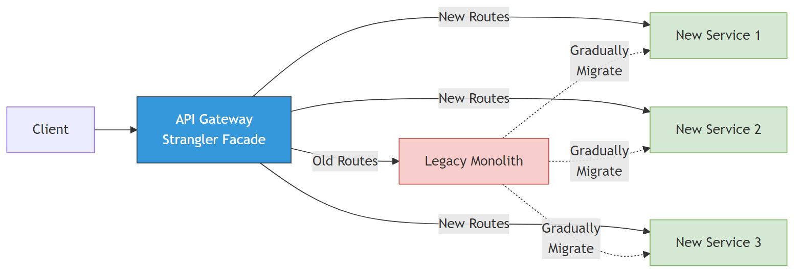
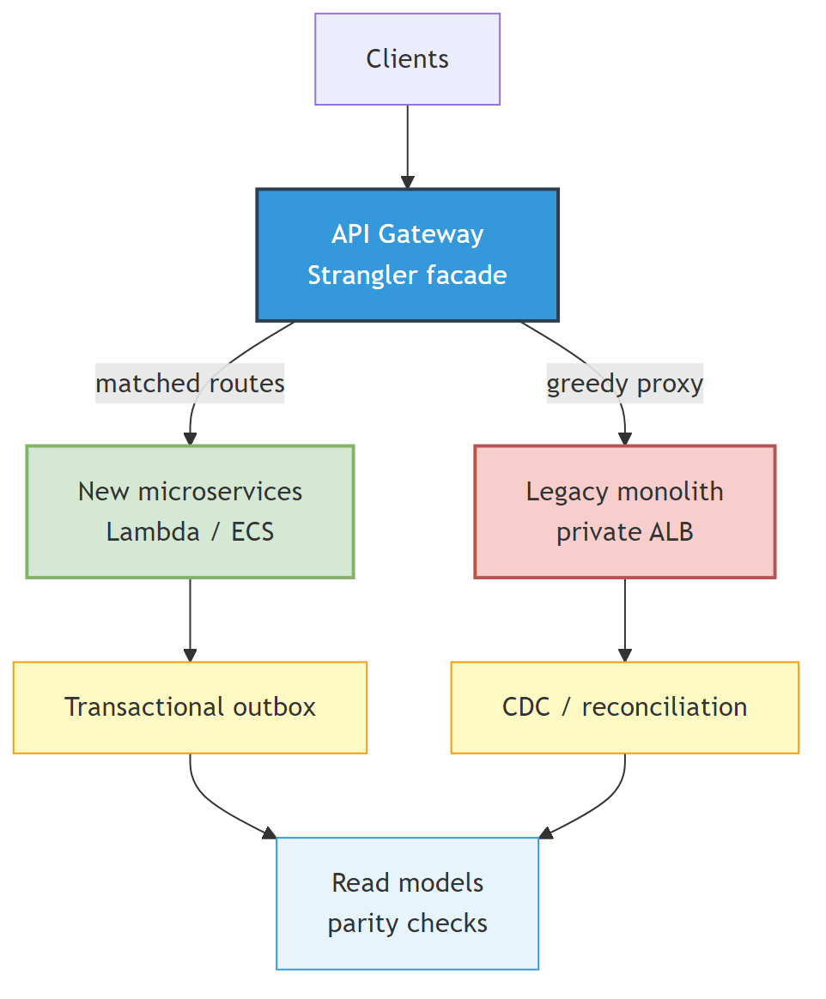

# Chapter 19: The Strangler Fig Pattern

<div class="chapter-header">
  <h2 class="chapter-subtitle">Gradual Substitution as Controlled Experiment on Production</h2>
  <div class="chapter-meta">
    <span class="reading-time">📖 55 min read</span>
    <span class="difficulty">🎯 Expert</span>
  </div>
</div>

## Abstract

The **Strangler Fig** pattern intercepts traffic at a **facade** (API Gateway / reverse proxy), incrementally routing **selected capabilities** to rewritten implementations while legacy paths remain operational. Unlike *big-bang rewrite*, strangler migrations admit **A/B and canary** semantics with **measurable parity**, linking directly to observability (Chapter 15) and dual-write principles (Part II). We analyze routing graphs, **VPC Link** integration for private legacy ALBs, and **data strangler** concerns: transactional outbox, CDC, **reconciliation jobs**.



*Figure 19.1: Intercept at edge; route new paths to new stack; default to legacy via greedy proxy.*

---

## 19.1 Graph-theoretic view

Let legacy system \(L\) expose path set \(\mathcal{P}\). New service \(N\) handles \(Q \subseteq \mathcal{P}\). A **correct** migration satisfies behavioral equivalence on \(Q\) modulo declared non-functional deltas (latency budgets).

**Invariant 19.1 (Coverage monotonicity).** Along a migration timeline, \(Q_t\) should **grow monotonically** (allow temporary rollbacks only with versioned feature flags).

---

## 19.2 Greedy proxy architecture (AWS)

1. **API Gateway** `ANY /{proxy+}` → HTTP_PROXY to legacy ALB (**VPC Link**).  
2. **Specific resources** `/orders`, `/v2/checkout` → Lambda / ECS **before** greedy match order.



*Figure 19.2: Data strangler concerns: outbox and CDC reconciliation behind the routing facade.*

---

## Recipe 19.1: Terraform fragments (illustrative)

```hcl
resource "aws_api_gateway_resource" "greedy" {
  rest_api_id = aws_api_gateway_rest_api.edge.id
  parent_id   = aws_api_gateway_rest_api.edge.root_resource_id
  path_part   = "{proxy+}"
}

resource "aws_api_gateway_integration" "legacy_proxy" {
  rest_api_id             = aws_api_gateway_rest_api.edge.id
  resource_id             = aws_api_gateway_resource.greedy.id
  http_method             = aws_api_gateway_method.any.http_method
  type                    = "HTTP_PROXY"
  integration_http_method = "ANY"
  uri                     = "http://${aws_lb.legacy.dns_name}/{proxy}"
  connection_type         = "VPC_LINK"
  connection_id           = aws_api_gateway_vpc_link.legacy.id
}
```

**Security:** mutual TLS or SigV4 between gateway and legacy when crossing account boundaries.

---

## 19.3 Data-plane strangler

Naive routing without **state reconciliation** yields split-brain. Patterns:

- **Dual-write window** + **outbox** for authoritative events.  
- **Strangler read models** behind feature flags with **staleness SLA** display.

---

## 19.4 Verification discipline

Contract tests on \(Q\); **synthetic transactions** comparing legacy vs strangler responses; shadow traffic with null side-effects.

---

## 19.5 Organizational dynamics

Strangler is **portfolio management**: fund explicit **parity milestones**; avoid “10% traffic forever.”

---

## 19.6 Synthesis

Strangler turns migration into **evidence-driven** substitution, compatible with **KM3** maturity checkpoints (Chapter 20) before legacy decommission.

---

**Navigation:**
- [Previous: Chapter 18](18-modular-monolith.md)
- [Next: Chapter 20](20-km3-maturity-model.md)
