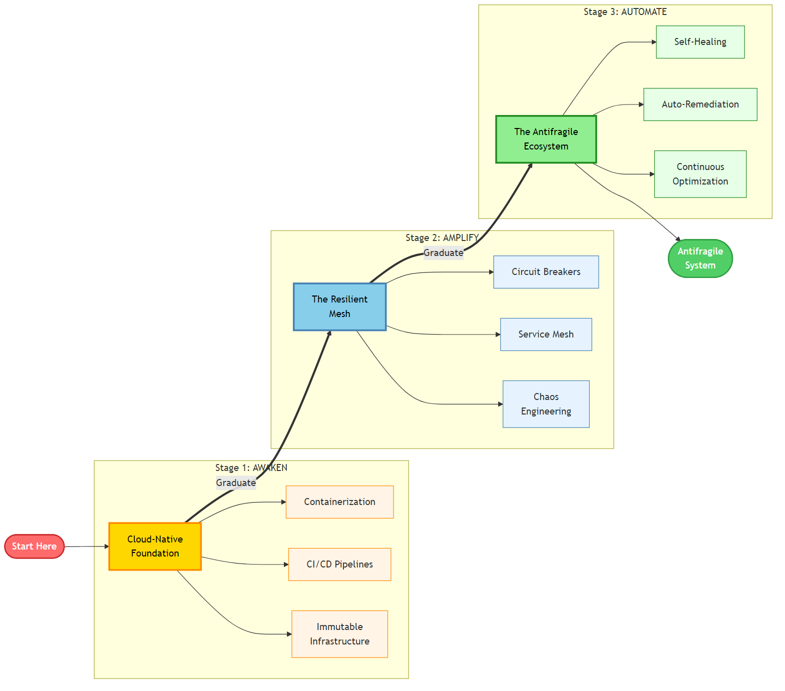

# Chapter 20: The Khan Microservices Maturity Model (KM3)

<div class="chapter-header">
  <h2 class="chapter-subtitle">Operationalizing Excellence-Beyond Velocity Metrics</h2>
  <div class="chapter-meta">
    <span class="reading-time">📖 50 min read</span>
    <span class="difficulty">🎯 Expert</span>
  </div>
</div>

## Abstract

DORA metrics capture **delivery throughput**; Richardson maturity models capture **HTTP semantics**. Neither guarantees **distributed safety** or **organizational readiness**. **KM3** provides a **staged maturity scaffold** bridging Chapter 11’s quantitative granularity lens with **governed operational practices**: immutability, mesh/eBPF policy, polyglot data safeguards, controlled chaos, and zero-trust propagation. This chapter **distinguishes** KM3 from the biographical narrative in Chapter 11. Here the emphasis is **assessment instrumentation**, **promotion criteria**, and **integration** with observability sampling (X-Ray) and chaos programs.



*Figure 20.1: KM3 stages-Awaken → Amplify → Automate (illustrative diagram from project assets).*

---

## 20.1 Stage taxonomy

| Stage | Emphasis | Non-negotiable signals |
|-------|----------|------------------------|
| **Awaken** | Immutable infra, CI/CD truth | No SSH “hot fixes”; artifacts versioned |
| **Amplify** | Typed east-west traffic, data resilience | gRPC where sync dominates; RDS delete protection; DynamoDB PITR |
| **Automate** | Antifragility & zero trust | Chaos in pipeline; JWT/OAuth propagation across toolchains |

**Anti-pattern catalog:** lift-and-shift containerization **without** domain seams; REST chatter at high RPS **without** batching; chaos **without** abort conditions (contrast Chapter 13).

---

## 20.2 Assessment methodology

Construct a **capability matrix** per team × service:

1. **Evidence link** (runbook, IaC module, dashboard) per capability.  
2. **Independent audit** by platform engineering (sample quarterly).  
3. **Promotion** when *all* mandatory row gates pass **and** incident archetypes regress.

KM3 is **not** a single badge; publish **heterogeneous** maturity (e.g., Stage-2 data, Stage-1 AI).

---

## Recipe 20.1: X-Ray adaptive sampling (Python / boto3)

```python
import boto3

def checkout_sampling_rule():
    client = boto3.client("xray", region_name="us-east-1")
    return client.create_sampling_rule(
        SamplingRule={
            "RuleName": "CheckoutHighPriority",
            "ResourceARN": "*",
            "Priority": 10,
            "FixedRate": 0.05,
            "ReservoirSize": 1,
            "ServiceName": "Checkout",
            "HTTPMethod": "*",
            "URLPath": "/api/checkout/*",
            "Version": 1,
        }
    )
```

Manage via **IaC** to avoid configuration drift; tie **reservoir** size to SLO burn rate policies.

---

## 20.3 Legal & usage

KM3 is an **original methodology by Viquar Khan**; please cite. Copyright in the written expression is held by the author. Book prose is under CC BY-NC-ND 4.0; code under MIT. See [LICENSING.md](../LICENSING.md), [COPYRIGHT.md](../COPYRIGHT.md), and [CITATIONS.md](../CITATIONS.md). Pattern names use ™ / ℠ as common-law identifiers; no registered trademark (®) is claimed unless stated.

---

## 20.4 Synthesis

KM3 closes the loop: **Chapter 11** explains *why* to adapt granularity; **Chapters 12-19** supply *how* to engineer resilience and migration; **KM3** defines *when* an organization has **earned** the right to operate complex distributed topologies **without** entropic collapse.

---

**Navigation:**
- [Previous: Chapter 19](19-strangler-fig-pattern.md)
- [Next: Reference Materials](../reference/quick-reference.md)
