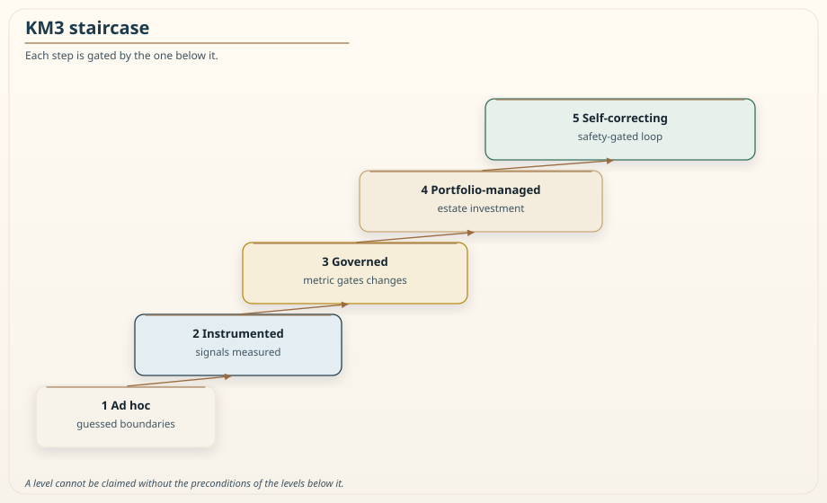
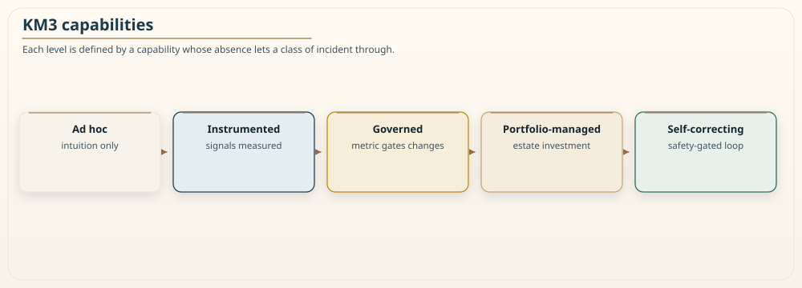

# Chapter 20: The Khan Microservice Maturity Model (KM3)

<div class="chapter-header">
  <h2 class="chapter-subtitle">Has This Organization Earned the Right to Distribute?</h2>
  <div class="chapter-meta">
    <span class="reading-time">📖 50 min read</span>
    <span class="difficulty">🎯 Expert</span>
  </div>
</div>

Every chapter in this book has argued for a discipline: measure your boundaries, isolate your blast radius, test your resilience, govern your infrastructure, observe your system, and distribute only when the evidence says to. This chapter closes the practitioner arc on the question those disciplines add up to, which is not "does this team use microservices" but "has this organization earned the right to operate a complex distributed system without it collapsing under its own weight." That is a maturity question, and KM3, the Khan Microservice Maturity Model, is how I answer it.

Maturity models have a bad reputation, and often deserve it, because too many are marketing ladders where every organization discovers it is one level from the top and can buy its way up. KM3 is built to resist that, in one specific way: each level is defined by capabilities that are either present or not, verifiable by evidence, and a level cannot be claimed without the preconditions of the levels below it. It is an honest assessment of where an organization actually stands, and its most useful output is often the uncomfortable finding that a team operating at what it thought was an advanced level is missing a foundational capability and is therefore exposed in a way it did not realize.

KM3 uses the same five levels introduced in Chapter 11, and this chapter develops them into an assessment you can run. Where Chapter 11 introduced the model as part of the Fulcrum governance story, this chapter is about instrumentation: how you measure which level a team is at, what evidence counts, and how an organization moves up honestly. I am not restating the RVx formula. Chapter 11 is the source of truth for the score. I am not inventing a second ladder, Awaken / Amplify / Automate or otherwise, and merging it with this one. One staircase. Five steps. Evidence or it did not happen.

## 20.1 Why DORA and Richardson are not enough

Before defining KM3, it is worth being clear about what it adds, because two well-known models already measure things near this space and it would be dishonest to reinvent them without saying why.

The DORA metrics, deployment frequency, lead time for changes, change failure rate, and time to restore, measure delivery performance, and they are genuinely valuable. But they measure how fast and safely you ship, not whether your architecture is sound. An organization can post excellent DORA numbers while shipping a distributed monolith very efficiently, because DORA does not look at whether the boundaries make sense, only at the flow of changes through the pipeline. Fast delivery of a fragile architecture is still a fragile architecture, and DORA will not tell you it is fragile.

The Richardson Maturity Model measures how thoroughly an API uses HTTP semantics, from plain RPC-over-HTTP up to full hypermedia. It is a useful lens on API design, but it is about the surface of one interface, not about the health of a distributed system, and a beautifully hypermedia-compliant API can sit in front of a badly bounded service.

KM3 measures a different thing: whether the organization has the architectural discipline and operational capability to run distributed systems safely, which is what determines whether the system survives contact with scale, failure, and change. It is complementary to DORA and Richardson, not a replacement, and a mature organization tracks all three, because they answer different questions: how fast you ship, how well your interfaces are designed, and whether your architecture and operations can bear the weight of distribution.


*Figure 20.1: The five KM3 levels as a staircase. Ad hoc at the bottom, where boundaries are guessed and nothing is measured, rising through Instrumented, where the signals are measured but not enforced, Governed, where the metric gates changes, Portfolio-managed, where boundaries are managed across the estate, to Self-correcting at the top, where a safety-gated controller remediates automatically. The diagram shows each step gated by the one below it, meaning a level cannot be reached without the preconditions of the lower levels, which is what keeps the model an honest assessment rather than a ladder to be gamed. Chapter 11's Figure 11.10 is the same staircase introduced. This chapter is how you place a team on it.*

## 20.2 The five levels

**Level 1, Ad hoc.** Boundaries are chosen by intuition, and no measurement exists. Services are created because someone thought a new service was needed, and whether the boundary was right is discovered only through operational pain. There is nothing wrong with being at Level 1 for a young system; the danger is being at Level 1 while operating a large estate, because it means the architecture is unmanaged and its health is unknown. The defining absence at this level is measurement: the organization cannot answer, with data, whether any given boundary is healthy.

**Level 2, Instrumented.** The three RVx signals are measured and visible. Traces produce the efficiency signal, version history produces the distinctness signal, and static analysis with a capacity source produces the cognitive-load signal, and these are computed per boundary and put on a dashboard. Nothing is enforced yet; the organization can see the health of its boundaries but does not act on it automatically. This is a large step up from Level 1, because for the first time the conversation about a boundary can be grounded in data rather than opinion, and it is the level most organizations should aim for first. Chapter 15 already said that without tracing, the efficiency signal cannot be measured. A dashboard of two signals and a guessed third is not Level 2.

**Level 3, Governed.** The RVx score gates changes. A declared profile exists and the metric runs in the pipeline so that a change which would create a new distributed monolith is caught before it merges. This is the level at which the metric carries real consequences, so the anti-gaming requirements and the audit trail from Chapter 11 become mandatory, because a metric that gates decisions becomes a target. Reaching Level 3 means the organization not only sees boundary health but actively prevents its degradation.

Honesty about the gate: Chapter 11 labelled organic-production validity of the score as hypothesized. Governed means "we run a declared profile, we record the inputs, and we refuse merges that fail it." It does not mean "the profile has been proven on a large labelled production corpus." The `validation/` plan in this repository is still scaffolding. Do not launder a hypothesis into a certificate.

**Level 4, Portfolio-managed.** Boundary health is managed across the whole estate rather than one service at a time. Scores are rolled up so leadership can see the health of the portfolio, refactoring investment is prioritized by score weighted by traffic and business value, and trends are tracked against outcomes over time. This is where architecture governance becomes a management discipline, with the granularity of the whole system treated as a portfolio to be actively invested in, and it is where the migration-sequencing thinking from Chapter 11 operates at scale.

**Level 5, Self-correcting.** A safety-gated controller performs configuration-level remediation autonomously, and prepares structural proposals for human execution. This is the Fulcrum loop running in its automated form: sensing scores, deciding on actions, actuating reversible configuration changes behind a canary keyed to outcomes with automatic rollback, and routing every structural change to a human. Level 5 is the narrowest and most demanding level, appropriate only for mature platform teams, and structural change remains human-executed even here. It is the top of the model not because full autonomy is the goal, but because scoped, safe autonomy over the reversible parts is the furthest a responsible organization should go. Chapter 16's agent does not get to merge the services. A human still does.

## 20.3 Three operational themes across the levels

The five levels describe governance maturity specifically, the progression from guessing boundaries to governing them with a measured, gated, eventually self-correcting loop. Layered across that progression are three operational capabilities that a real organization matures in parallel, and it helps to name them because a team can be advanced on one and primitive on another, which is itself a finding. These themes are not a second five-level ladder. They are lenses. Do not average them into a sixth score.

The first theme is **immutability and delivery truth**. At the low end, infrastructure is mutated by hand, someone connects to a server and fixes something, and there is no single source of truth for what is running. As this matures, infrastructure becomes code, changes flow through the golden-path pipeline from Chapter 14, and no change reaches production except through the reviewed, recorded path. The signal that an organization has matured here is not the fairy tale that no one ever breaks glass. It is that break-glass is rare, recorded, time-bounded, and reconciled back into the definition, so the definition in version control is still the truth about what runs.

The second theme is **typed, resilient communication and data**. At the low end, services talk over untyped, brittle channels and share data stores in ways that couple them invisibly. As this matures, communication uses typed contracts where synchronous calls dominate, data ownership is clear and enforced, and the reliability patterns from the earlier chapters, outbox, idempotency, backpressure, are in place. The signal of maturity is that the failure modes the book warns about, dual writes, poison messages, cascading timeouts, are handled by design rather than discovered in incidents.

The third theme is **antifragility and zero trust**. At the low end, the system has never been tested under failure and trusts its own network implicitly. As this matures, chaos experiments from Chapter 13 run regularly and feed a fix pipeline, isolation from Chapter 12 is in place and verified, and identity is propagated and verified across every boundary rather than assumed from network location, Chapter 7. The signal of maturity is that failure is a tested property and trust is explicit, so that neither a component failure nor a compromised network segment cascades into a full breach or outage.

These three themes are why an organization's maturity is rarely a single number. A team might be Governed on the RVx levels, advanced on delivery truth, but primitive on antifragility because it has never run a chaos experiment. KM3 is most useful when it surfaces exactly this kind of uneven profile, because the weakest capability is usually where the next incident comes from.

## 20.4 Running an assessment

A maturity model is only useful if you can actually place an organization on it with evidence rather than optimism, so KM3 is designed to be assessed, not merely described. The assessment is a capability matrix, evaluated per team and per service rather than for the organization as a whole, because maturity is uneven and an organization-wide average hides the teams that are exposed.

For each capability at each level, the assessment asks for evidence, not assertion. The claim that a team is Governed requires pointing at the declared profile, the pipeline gate configuration, and the audit trail, not at a slide saying governance is in place. The claim that resilience is mature requires pointing at recent chaos experiment results and the findings they closed, not at an intention to run chaos experiments someday. Requiring evidence is what keeps the assessment honest, and it is also what makes it actionable, because a missing piece of evidence is a specific, concrete thing to go build.

The assessment should be run by someone outside the team being assessed, typically a platform or architecture function, and sampled periodically rather than claimed once, because maturity decays. A team that was Governed can drift back toward Instrumented if the gate is quietly disabled during a crunch and never re-enabled, and only a periodic, evidence-based re-assessment catches that drift. Promotion to a higher level happens when all the mandatory capabilities for that level pass their evidence check. Incident archetypes becoming *rarer*, and each occurrence being treated as a defect in the capability, is useful confirmation. "They have stopped occurring" is not a standard you can honestly meet for rare events. A quiet year is not a proof.

The output of an assessment is deliberately heterogeneous. Rather than a single badge, it publishes the team's level on the staircase and a maturity call on each theme, for example Governed on granularity, mature on delivery, but early on resilience. This heterogeneous picture is more honest and more useful than a single number, because it points precisely at the gap that most needs attention, and it resists the marketing-ladder failure where everyone is one level from the top.

### Recipe 20.1: An evidence row, not a slide

**Context.** A team claims Level 3, Governed.

**Solution.** One row in the matrix. Empty cells fail. A slide is not a cell.

```yaml
team: checkout
service: checkout-api
staircase: 3-governed
evidence:
  profile: "docs/RVX-SPEC.md"                  # declared profile; this repo ships the spec, not a numbered N1–N23 catalogue
  gate: ".github/workflows/rvx-gate.yml"       # illustrative path: the file must exist and fail the merge
  audit: "s3://governance/rvx/checkout/"       # inputs, decision, actor
  components_published: true                   # E, S, L beside the composite
  not_used_in_perf_review: attested
themes:
  delivery: mature     # pipeline, no unreconciled hot-fixes
  comms_data: mature   # contracts, outbox, schema ownership
  antifragility: early # no chaos results in the last two quarters
next_gap: "run Chapter 13 experiments with an abort outside the blast radius"
```

If `gate` is a file that is commented out, the staircase is 2. If `antifragility` is early, the next investment is not Level 5.

## 20.5 How an organization actually moves up

Maturity is earned by closing specific gaps, not by declaring intent, and the movement between levels has a characteristic shape worth describing so teams know what the work actually is.

Moving from **Ad hoc to Instrumented** is a measurement project: stand up the tracing, version-history, and static-analysis pipelines that produce the three signals, and put them on a dashboard. The hard part is usually the tracing, because the efficiency signal depends on it, and a team without distributed tracing has to build that capability first, which is why Chapter 8 and Chapter 15 are preconditions for this book's governance story. Once the signals are visible, the organization can for the first time have data-grounded conversations about boundaries.

Moving from **Instrumented to Governed** is a calibration and enforcement project: declare the profile, wire the gate into the pipeline, and stand up the audit trail and anti-gaming controls. Chapter 11 asked for a training split and a held-out split when you *claim* the profile predicts outcomes. If you do not have labelled organic data, say so, run the gate as a policy you own, and do not advertise a validated instrument. The hard part here is organizational rather than technical, because gating changes on a metric changes how teams work and invites the gaming that Chapter 11 treats at length, so the governance must be introduced with care, with the components visible alongside the score and with the metric explicitly prohibited from use in individual performance evaluation.

Moving from **Governed to Portfolio-managed** is a management project: roll up scores, connect them to business value and traffic, and build the investment-prioritization and trend-tracking that let leadership govern the estate. The hard part is connecting architecture health to the language of investment, so that refactoring the worst boundaries competes for funding on equal terms with features, which is the only way architecture debt gets paid down in practice.

Moving from **Portfolio-managed to Self-correcting** is the most demanding and the most optional step: building the automated Fulcrum loop with its safety gate, canary, rollback, and incident-freeze rules, and earning enough trust in it to let it act. Most organizations should not rush this, and many should never take it, because the value of Levels 2 through 4 is large and the marginal value of autonomous configuration remediation is smaller and riskier. The honest counsel is that Self-correcting is a real level but not a mandatory destination, and an organization that stops at Portfolio-managed, governing its estate well with humans in the loop, has captured most of the value the model offers.

## 20.6 The incidents each level is meant to prevent

A maturity level means little unless you can say what class of failure it protects against, and tying each level to the incidents it prevents is what turns KM3 from a scorecard into a diagnosis. It also provides the outcome-based confirmation that Section 20.4 asked for: a level is more credible when the incidents it is supposed to prevent have become rarer and are treated as capability defects, not merely when the capability is present on a slide.


*Figure 20.2: The levels annotated with the capability that defines each. Reading up, Ad hoc has no measurement, Instrumented adds the measured signals, Governed adds the gate that acts on them, Portfolio-managed adds estate-wide management of those scores, and Self-correcting adds the safety-gated automated loop. The value of viewing the levels this way is that each capability is the thing whose absence lets a specific class of incident through, so the staircase is also a ladder of failures progressively closed off.*

The mapping is direct. At Level 1, Ad hoc, the characteristic incident is the distributed monolith that no one saw forming: services were split by intuition, the split was wrong, and the organization discovers the tangle only when a routine change requires coordinating six deployments. Nothing prevents this at Level 1 because nothing is measured, so the failure is invisible until it is operational. Reaching Level 2, Instrumented, does not prevent the failure outright, but it makes it visible, because the distinctness signal now shows the co-change coupling on a dashboard before it becomes an incident.

At Level 2, the characteristic remaining incident is the one that is measured but not acted on: the dashboard clearly showed the boundary degrading, and nobody stopped the change that made it worse, because seeing is not the same as enforcing. Level 3, Governed, closes this by gating changes on the metric, so the change that would deepen the distributed monolith is blocked before it merges. The incident Level 3 still permits is the estate-scale one: individual boundaries are governed, but no one is managing the health of the whole portfolio, so refactoring investment goes to whoever complains loudest rather than to the worst boundaries weighted by traffic and value. Level 4, Portfolio-managed, closes that by making boundary health a managed investment across the estate.

At Level 4, the residual incident is the slow human-latency failure: the organization knows which boundaries are worst and has decided to fix them, but reversible remediation waits on human scheduling, so a configuration-level regression that a controller could have corrected in minutes instead degrades for hours until someone gets to it. Level 5, Self-correcting, closes that specific gap for the reversible cases, while deliberately leaving structural change to humans. Seen this way, the model is not a status ladder but a sequence of incident classes closed off one at a time, and the honest question at any level is not "what badge do we hold" but "which of these incidents can still happen to us," which is a far more useful thing to know.

## 20.7 A worked assessment

An abstract model is easier to trust when you see it applied, so consider a composite assessment of a team that believes it is advanced, because the belief is where the danger usually hides. This is a shape I have seen, not a named company with a fabricated bill. The team ships many times a day with strong DORA numbers, runs everything through an infrastructure-as-code pipeline with no unreconciled manual changes, and has a mature typed-contract discipline between its services. On a single-number model it would rate highly, and its leaders are confident.

The KM3 assessment, run per theme with evidence required, produces a more useful and more uncomfortable picture. On delivery truth the team is genuinely mature: it points to the pipeline, the absence of unreconciled hot-fixes, and a clean audit of what runs, and the evidence holds. On the granularity levels it turns out to be only Instrumented, not Governed: the three signals are on a dashboard, which is real progress, but no gate enforces them, and when pressed the team admits that a recent change deepened a coupling the dashboard had flagged and nothing stopped it. On antifragility the team is at the bottom: it has never run a chaos experiment, its isolation is designed but unverified, and its resilience patterns exist in the code but have never been tested under real failure. The evidence for maturity there simply does not exist, because there are no experiment results to point at.

The value of this assessment is precisely its unevenness. A single badge would have called this team advanced and moved on. KM3 says: your delivery is excellent, your governance is one enforcement project away from real, and your resilience is an untested hope that will fail you in the next serious incident. That last finding is the one that matters, because it names, before an outage does, exactly where this confident team is exposed. The recommended next step is not to chase the top level but to close the weakest theme first, to run the chaos experiments that turn designed resilience into verified resilience, because the weakest capability is where the next incident comes from regardless of how strong the others are. This is how KM3 is meant to be used: not to rank teams, but to find, with evidence, the specific gap each team should close next.

## 20.8 The right level is not the top level

A maturity model invites a specific misreading: that higher is always better and every team should climb to the top. KM3 is deliberately built to resist this, because the correct level for a team depends on what that team is actually operating, and pushing a team past the level its situation warrants wastes effort and can do harm.

The clearest case is a young system with a small team. Such a system is often at Level 1, Ad hoc, and that is entirely appropriate, because it has few boundaries, most of which should not be services at all, and the machinery of measurement and gating would be pure overhead against a system whose boundaries are still being discovered. As Chapter 18 argued, this system's right architecture is probably a modular monolith, and its right maturity investment is not to instrument and govern boundaries it does not yet have, but to keep its boundaries cheap to move while it learns. Forcing Level 3 governance onto a three-person startup is the maturity-model version of premature distribution: paying a cost for a capability the situation does not justify.

The mismatch that actually signals danger is the opposite one: a large estate, many teams, real scale, still operating at Level 1. That organization is flying blind on an architecture too big to hold in anyone's head, and its exposure is severe precisely because its scale has outgrown its governance. KM3's job is to surface this gap, the distance between the level a team operates at and the level its scale demands, because that gap is where unmanaged risk accumulates. A team whose level matches its needs is healthy at any level; a team whose scale has outrun its level is the one heading for an avoidable collapse.

This is why Section 20.5 was careful to call Self-correcting optional and to say most organizations should stop at Portfolio-managed. The value curve of the levels is not linear. The jump from Ad hoc to Instrumented is enormous, because it replaces opinion with data. Instrumented to Governed is large, because it replaces seeing with preventing. Governed to Portfolio-managed is substantial for a large estate and irrelevant for a small one. Portfolio-managed to Self-correcting is marginal for most and only worthwhile for the largest, most mature platform teams. The honest reading of the model is that a team should climb to the level its scale and risk justify and then stop, and that the goal is fit between level and need, not the highest badge on the wall. A maturity model used as a race to the top has become exactly the kind of vanity metric that this book has been warning against.

## 20.9 Summary

KM3 answers the question the whole book builds toward: has an organization earned the right to operate complex distributed systems without collapse. It is a five-level model, Ad hoc, Instrumented, Governed, Portfolio-managed, and Self-correcting, the same staircase Chapter 11 introduced, and it is deliberately built to resist the marketing-ladder failure, because each level is defined by verifiable capabilities and cannot be claimed without the preconditions below it. It complements DORA, which measures delivery speed, and the Richardson model, which measures API design, by measuring something neither does: whether the architecture and operations can bear the weight of distribution.

Across the levels run three operational themes, immutability and delivery truth, typed and resilient communication and data, and antifragility with zero trust, and an organization is usually uneven across them, which is exactly the insight KM3 is designed to surface, because the weakest theme is where the next incident lives. Assess it with an evidence-based capability matrix per team and per service, run by an outside function and re-sampled periodically because maturity decays, and publish a heterogeneous profile rather than a single badge. Move up by closing specific gaps, a measurement project to reach Instrumented, a calibration and enforcement project to reach Governed, a management project to reach Portfolio-managed, and a demanding, optional automation project to reach Self-correcting, which most organizations should approach slowly and many should never need.

KM3 closes the practitioner arc of this book. Chapter 11 explained why to govern granularity and gave the metric. Chapters 12 through 19 supplied the how, the isolation, resilience, infrastructure, observability, agentic, retrieval, and migration disciplines that a distributed system needs. KM3 defines the when: the point at which an organization has genuinely earned the ability to run these systems at scale without entropic collapse.

The goal was never to have the most services, or the highest maturity level. It was always to draw the boundaries that add value, to measure them honestly, to govern them under a safety gate, and to know, with evidence rather than hope, that the system you have built can bear the weight you are about to put on it. Three chapters remain, the science behind the metric: what a bad boundary costs, whether the metric measures anything real, and how you keep it honest once it becomes a target. The next chapter starts with money.

---

KM3 is an original methodology. Cite the book if you use the model. Copyright in the written expression is held by the author. See [LICENSING.md](../LICENSING.md), [COPYRIGHT.md](../COPYRIGHT.md), and [CITATIONS.md](../CITATIONS.md).

---

**Navigation:**
- [Previous: Chapter 19](19-strangler-fig-pattern.md)
- [Next: Chapter 21](21-pricing-the-distributed-monolith.md)
