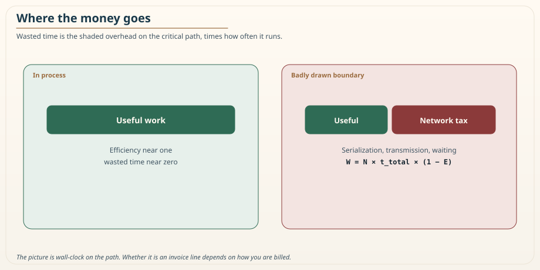
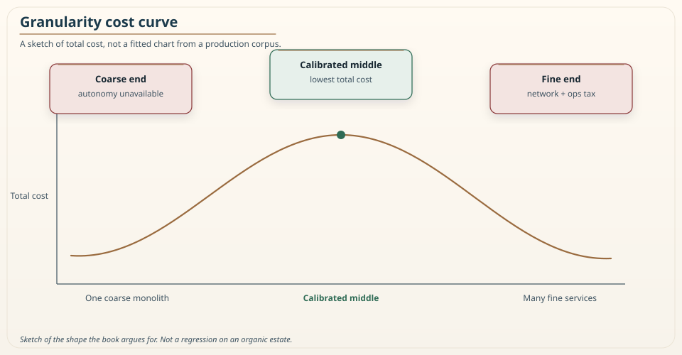

# Chapter 21: Pricing the Distributed Monolith: The Economics of Granularity

<div class="chapter-header">
  <h2 class="chapter-subtitle">Price the Waste. Name the Rest. Do Not Invent a Total.</h2>
  <div class="chapter-meta">
    <span class="reading-time">📖 50 min read</span>
    <span class="difficulty">🎯 Expert</span>
  </div>
</div>

This is the first of three closing chapters on the science behind the metric. The practitioner arc of the book is complete: you know how to draw boundaries, isolate them, test them, govern them, and mature an organization around them. These final chapters are for the reader who wants the rigor underneath, and they are also the chapters that turn the method from an engineering preference into a business argument. This one is about money, because in the end an architecture decision that cannot be connected to money is an argument that loses to one that can.

Every architect has had the conversation where they know a boundary is wrong, they can feel the pain of it, and they cannot get it prioritized because they cannot say what it costs. Feelings do not compete well against a roadmap of revenue features. This chapter is about ending that disadvantage, by showing that a bad boundary has a cost you can actually compute, in the currency the business already uses, and that the distributed monolith is not just architecturally displeasing but measurably expensive. Chapter 11 already sketched this in a page. This chapter is that sketch made operational. I am not restating the RVx score.

## 21.1 The three cost lines of a bad boundary

A distributed monolith charges you on three separate lines, and it is worth naming them because the first is measurable today, and the other two are real but harder to pin down, and conflating them is how architects lose credibility by claiming precision they do not have.

The first line is **compute**. Every synchronous hop across a boundary that adds no value burns time on serialization, transmission, deserialization, and waiting, and that time is billed, whether by the second on a cloud function or by the capacity you provision to absorb it. This is the line you can measure directly, and Section 21.2 shows how.

The second line is **reliability engineering**. Every synchronous edge is a new failure mode, and failure modes cost engineer time: time building retries and circuit breakers, time debugging cascades, time on call for incidents that a monolith would never have produced because the call was in-process and could not time out. This cost is real and often large, but it is diffuse and hard to attribute to a specific boundary, so I treat it as a named cost rather than a computed one.

The third line is **developer velocity**. When services change together because the boundary was drawn wrong, every feature touches multiple services, multiple repositories, and multiple deployments, and the coordination overhead slows every change through that boundary forever. This is frequently the largest cost of all, and it is the hardest to measure, because you are measuring the absence of speed you never had.

The honest posture, which is the posture of the whole book, is to compute the first line precisely, name the second and third clearly, and never pretend the diffuse costs are as precise as the compute line. An architect who says "this boundary wastes this much compute per month, measurably, and also imposes reliability and velocity costs that are real but harder to quantify" is far more credible than one who produces a single confident total-cost number built mostly on assumptions.

## 21.2 The measurable core: wasted time

The compute line reduces to a single, honest quantity: wasted time. Kinetic Efficiency, defined in Chapter 11, is the fraction of a transaction's time spent doing useful work rather than paying the boundary tax. If a boundary handles some number of transactions in a period, and its efficiency is E, then the fraction of the total time that was overhead, the distribution tax, is one minus E.

Put that as a formula that any team can compute from data it already has:

```
W  =  N  ×  t_total  ×  (1 − E)
```

Here `N` is the number of transactions in the period, `t_total` is the average total time per transaction on that path, and `E` is the measured Kinetic Efficiency. The product `N × t_total` is the total time spent on that path, and multiplying by `(1 − E)` gives the portion of that time that was overhead. If `E` is the ratio of summed useful time to summed total time, this is an identity: `W` is exactly the leftover. It is not a model with a fitted coefficient. If you have the traces that produce `E`, which Chapter 15 showed you do, you have `W`.

Three measurement rules keep the identity from becoming a lie.

**Same unit.** `N`, `t_total`, and `E` must be measured on the same path. Chapter 11 measures `t_total` as critical-path wall-clock, the root span of that path, and `t_useful` as the union of local intervals on that path. Do not multiply a hop-level `E` by a user-request duration. Do not mix a tail-sampled debug window, which Chapter 11 already said makes `E` look worse, into a cost number you will take to finance. Reweight to a declared representative window.

**Wall-clock is not a bill.** `W` is wasted time on the path. On a serverless platform that bills duration, wait is money, so the step to dollars is close to exact. On provisioned capacity, wait burns a concurrency slot, not a CPU-second. You convert `W` through the capacity you provision to hold blocked requests, not through a Lambda GB-second rate you copied from another slide.

**Average is a sum.** `N × mean(t_total)` is the total time only if every transaction is in `N`. If you drop cached hits or you score only the errors, you have priced a different system than the one that runs.

The step from wasted time to wasted money is one multiplication by your compute cost per unit time, under the conversion that actually matches how you are billed. Either way, `W` turns an abstract inefficiency into a number you can put next to an invoice line.

A worked example makes the scale visible. Suppose a boundary sits on a path that handles ten million transactions a month, the average path takes 200 milliseconds, and the measured efficiency is 0.4, meaning sixty percent of the time is overhead. The wasted time is ten million times 200 milliseconds times 0.6, which is 1.2 billion milliseconds, or about 333 hours of path time burned every month on crossing a boundary that adds no value. I am not going to invent your hourly rate. Whatever you actually pay for that class of time, that is the monthly bill for this one bad boundary, and it recurs every month until the boundary is fixed. On a hot path the number is usually large enough to fund the refactor several times over, and it is defensible because it is measured, not modeled.

### Recipe 21.1: Compute `W` from the same traces that produce `E`

**Context.** You already emit traces. You want the monthly waste for one path, not a slide.

**Solution.** Sum on a representative window. Publish the window with the number.

```python
def wasted_time(traces):
    """traces: iterable of (t_useful, t_total) on ONE path, same units.
    E is the ratio of sums, so W is an identity, not a fitted model.
    """
    useful = total = n = 0
    for t_useful, t_total in traces:
        if t_total <= 0:
            continue
        useful += t_useful
        total += t_total
        n += 1
    if total == 0:
        return {"N": 0, "E": None, "W": 0}
    e = useful / total
    return {"N": n, "t_total": total / n, "E": e, "W": total * (1 - e)}
```

If `n` is the tail-sampled error bucket, stop. That is a debug number. It is not a finance number.

## 21.3 The honest line between measured cost and hypothesized savings

Here is where I part company with the confident cost-savings slides you see in vendor decks, because there is a subtle but important distinction that separates an honest business case from an overclaim.

The wasted time `W` is measurable now. It is a fact about the current system, computed from current data. What is not a fact is the claim that a specific refactor will recover that cost. That the merge or the async-conversion you propose will raise `E` and therefore cut the wasted time is a hypothesis, a prediction about an intervention you have not yet run. It is a reasonable hypothesis, and the whole method is built to make it likely, but it is a prediction, not a measurement, until you make the change and measure the new `E`. Chapter 11 already drew this line. It still holds.

So the honest business case has two parts stated as two different kinds of claim. First, a measurement: this boundary wastes this much, now, and here is the number. Second, a prediction: this refactor is expected to recover most of it by raising `E` from its current value toward a target, and here is how we will verify that after the change by re-measuring. Presenting the measurement as fact and the saving as a verifiable prediction is more honest and, in my experience, more persuasive, because a sophisticated audience trusts a person who distinguishes the two more than one who blurs them into a single confident number.

This is the same tiered honesty that Chapter 22 will develop into a general discipline for architecture metrics, and it is the same posture the research behind this book takes toward all of its claims. The cost is demonstrated. The saving is a hypothesis with a test attached. Say which is which, and your credibility survives contact with the one skeptic in the room who actually checks.


*Figure 21.1: Where the money goes. On the left, a transaction inside a monolith spends almost all of its time on useful work, so its efficiency is near one and its wasted time is near zero. On the right, the same transaction split across a badly drawn boundary spends a large fraction of its time on the network tax, serialization, transmission, and waiting, so its efficiency drops and the shaded overhead becomes billed or provisioned time that produces nothing. The wasted-time formula in this chapter is simply the size of that shaded region multiplied by how often the transaction runs. The picture is wall-clock on the path. Whether that wall-clock is a line on the invoice depends on how you are billed.*

## 21.4 Pricing the fix: waste is only half the ledger

The wasted-time number tells you what a bad boundary costs to keep. It does not tell you whether to fix it, because fixing has a cost too, and a business case that presents only the waste and omits the price of the remedy is as incomplete as one that omits the waste. The decision to refactor is an investment decision, and an investment decision needs both sides of the ledger: what you save and what it costs to save it.

The cost of the fix has two parts. The first is the engineering effort: the person-time to merge two services, or to convert a synchronous edge to asynchronous, or to run the strangler migration from Chapter 19 that extracts a boundary cleanly. This is estimable the way any engineering work is estimable, in person-weeks, and it converts to money through loaded engineering cost. The second part is risk: any change to a running boundary can introduce defects, and the refactor itself consumes attention that could have gone to features. A prudent business case prices the effort and names the risk, the same split between measured and named costs that Section 21.1 applied to the waste.

With both sides in hand, the decision becomes a **payback period**, which is the framing a leader already knows how to evaluate. If a boundary wastes a given amount every month and the fix is expected to recover a monthly saving `S`, the payback period is the one-time fix cost divided by `S`. `S` is the hypothesis from Section 21.3, not `W` itself. You do not recover 100 percent of `W` unless the refactor drives `E` to 1, which it will not. A boundary that wastes a large amount monthly and is cheap to fix has a short payback and is an obvious yes. A boundary that wastes little and is expensive and risky to fix has a payback measured in years and is an obvious no, even though it is genuinely a bad boundary, because the remedy costs more than the disease. Most boundaries fall between, and the payback period ranks them honestly.

This framing also protects against the trap of fixing bad boundaries just because they are bad. The metric identifies unhealthy boundaries, but the economics decides which ones are worth the intervention, and they are not the same set. A boundary can be architecturally ugly and economically fine to leave alone if it sits on a cold path with a long payback, and recognizing that is part of the discipline, because an architect who proposes fixing every flagged boundary regardless of payback will spend the organization's goodwill on refactors that never earn back their cost. The number that matters for prioritization is not the waste and not the fix cost alone, but the relationship between them.

## 21.5 The second-order costs the compute line misses

The compute line from Section 21.2 is the cleanest number, but it is not the only measurable cost, and two others deserve attention because they are more measurable than the diffuse reliability and velocity costs and yet routinely left out.

The first is **data transfer**. A chatty boundary does not only burn compute on serialization; it moves bytes across the network, and in a cloud environment those bytes are frequently billed, especially when the boundary crosses an availability-zone or region line. Intra-zone traffic is often cheap or free. Cross-zone and cross-region are usually not. NAT gateways bill by the gigabyte too. I am not quoting a price that will be stale next quarter. Look at your invoice. A boundary that exchanges large payloads at high frequency across zones can run up a transfer line that rivals its compute cost, and unlike the diffuse costs, this one appears as a real line on the bill. It belongs in the measured part of the business case, added to the compute waste, which makes the provable floor of a bad boundary's cost higher than compute alone suggests. This is also, incidentally, part of why the claim check pattern from Chapter 10 pays off: keeping large payloads out of the messaging path is a data-transfer saving as much as a throughput one.

The second is the **coordination tax**, which is more measurable than it first appears. The developer-velocity cost from Section 21.1 is diffuse in general, but one component of it can be quantified from delivery data: features that touch a badly drawn boundary require coordinated changes across multiple services and deployments, and that coordination shows up as longer lead time for those changes. If your delivery metrics can distinguish changes that cross the boundary from those that do not, the difference in lead time is a measured signal of the coordination tax, expressed in the same units DORA already tracks. You will not get a clean dollar figure this way, and you must not pretend the difference is caused only by the boundary. Cross-boundary changes are often larger features. The defensible statement is that changes through this boundary take a measured multiple longer than changes that do not, which is far stronger than an unsupported claim that the boundary "slows the team down," and weaker than a causal dollar figure. Say that.

Both of these sit between the cleanly measured compute line and the genuinely diffuse costs, and naming them separately is part of the honest accounting the chapter argues for. The more of the cost you can move from "named but unquantified" into "measured," the stronger the case, and data transfer and lead-time differential are the two costs most often left in the diffuse bucket when they could be measured.

## 21.6 Attributing cloud spend to boundaries

None of these numbers matter if you cannot connect them to the actual bill, and the practice that makes that connection is cost attribution, the discipline of mapping cloud spend to the boundaries that incur it. Without it, the wasted-time formula produces a figure that a skeptical finance partner can wave away as a back-of-envelope estimate, because it is not tied to a line they recognize. With it, the estimate is anchored to real spend, and the argument becomes much harder to dismiss.

The mechanics are the ones a mature cloud practice already uses. Resources are tagged by the boundary or service they belong to, so that the cloud provider's cost-allocation reports can break spend down by boundary rather than lumping it into an undifferentiated total. Chapter 14's golden-path modules should stamp those tags; a policy that requires an owner tag is not decoration. Compute, data transfer, and storage then appear per boundary, and the wasted-time estimate can be checked against the actual spend on that boundary's path rather than asserted in isolation. This is the same observability discipline from Chapters 8 and 15 applied to money: you instrument spend the way you instrument latency, so that cost becomes a signal you can query per boundary instead of a monthly surprise.

Honesty about attribution's limits is part of doing it well. Shared infrastructure, a database used by several boundaries, a cluster hosting many services, cannot be attributed perfectly, and any allocation involves assumptions about how to divide shared cost. The credible approach is to state those assumptions plainly, allocate shared cost by a defensible proxy such as request share or resource consumption, and present the attributed number as a well-founded estimate rather than an exact figure. An architect who says "this boundary's directly attributed spend is this, plus an allocated share of shared infrastructure computed this way" is more trustworthy than one who produces a suspiciously precise total. The goal of attribution is not false precision; it is to move the cost argument from a whiteboard estimate to something anchored in the invoice, so that the boundary's price is a fact the business recognizes rather than a number the architect made up.

## 21.7 Making the business case a leader will fund

Having the number is necessary but not sufficient. The number has to be framed so that fixing a boundary competes on equal terms with shipping a feature, because that is the competition it actually faces in a planning meeting, and architecture debt loses that competition by default when it is framed as housekeeping.

Three framing moves help. The first is to express the cost as a **recurring monthly figure**, not a one-time sum, because a recurring cost is a subscription the business is paying to a bad decision, and leaders understand recurring costs viscerally. A boundary that wastes a given amount per month is not a cleanup task, it is a standing charge that continues until someone stops it, and framing it that way changes the conversation from "should we spend time tidying" to "should we keep paying this every month."

The second move is to **weight by traffic and business value**, exactly as the portfolio-management level of KM3 in Chapter 20 prescribes. Not every bad boundary is worth fixing, because a boundary with terrible efficiency on a path nobody uses wastes very little in absolute terms. The boundaries worth escalating are the ones where poor efficiency meets high traffic, because that product is where the wasted money concentrates. This lets you walk into a prioritization meeting with a ranked list, the boundaries costing the most real money per month, rather than a vague plea to invest in architecture.

The third move is to attach the reliability and velocity costs as **qualitative but concrete stories** alongside the measured compute number, rather than as invented figures. You cannot precisely price the velocity cost, but you can say that this boundary caused a certain number of cross-service incidents last quarter, and that features touching it take a certain amount longer to ship because they require coordinated deployment across several teams. These are checkable facts even when they are not clean dollar amounts, and they make the measured compute number the floor of the cost rather than the whole of it, which is the truthful framing: the compute cost is what you can prove, and the real cost is at least that and almost certainly more.

## 21.8 When an expensive boundary still pays its way

The wasted-time number can be large for a boundary that is nonetheless worth keeping, and missing this is the way a purely cost-minimizing reading of the economics leads an architect astray. Compute waste is one side of a ledger, and the other side is the value the boundary provides, which the wasted-time formula does not capture at all. A boundary that burns compute on a network hop can still be the right boundary if what that hop buys is worth more than what it costs.

The clearest cases come straight from earlier chapters. A boundary that lets a hot component scale independently, on its own curve, Chapter 18, saves the money you would otherwise spend scaling an entire monolith just to scale one part of it, and that saving can dwarf the boundary's own network tax. A boundary that bounds a blast radius, in the sense of Chapter 12, buys resilience whose value is measured in avoided outages, which do not appear in the compute line but are very real on the revenue line. Do not invent the outage you prevented. Count the ones you had, and the blast radius you measured. A boundary that maps to a team and lets that team deploy independently buys velocity across everything that team ships, which is the Conway's Law payoff. In each case the boundary has a measurable compute cost and an offsetting value that is real but sits on a different line, and the correct decision weighs both rather than minimizing the cost in isolation.


*Figure 21.2: The economics across the granularity spectrum, drawn as a sketch, not as a fitted curve from a production corpus. At the coarse end, a single monolith, some costs are low but others, independent scaling and team autonomy, are unavailable, so the total cost is high for a system that needs them. At the fine end, many tiny services, the network tax and operational overhead dominate and the total cost is high again. The lowest total cost sits in a calibrated middle band, and crucially it is total cost, not compute cost, that the picture traces: a boundary slightly to one side may waste more compute yet cost less overall because of the value it provides. The economic goal is the bottom of this curve, not the leftmost or rightmost point. I have not measured this U on an organic estate. I am telling you the shape the rest of the book argues for.*

This is why the chapter insists the metric has no bias toward more or fewer services. A cheap-to-run boundary that provides no independence, scaling benefit, or isolation is worse value than an expensive-to-run boundary that provides all three, even though the first wastes less compute. The economics is not a machine for minimizing the wasted-time number; it is a machine for finding the boundaries whose total value exceeds their total cost, and sometimes the boundary that looks worst on the compute line is the one earning the most elsewhere. An architect who has internalized this will occasionally defend a boundary precisely because it is expensive, on the grounds that what it buys is worth more than what it costs, and that argument, made with the numbers in hand, is the most sophisticated version of the economic case.

## 21.9 The economics of the opposite mistake

The chapter would be dishonest if it only priced the distributed monolith, because over-isolation has an economics too, and an architect who only ever argues for merging boundaries is as one-eyed as one who only ever argues for splitting them.

Full isolation, a dedicated everything per tenant or per concern, wastes money in a different way: you pay for capacity that sits idle because it cannot be shared, and you pay operational overhead for a proliferation of small units that each need their own pipeline, monitoring, and on-call attention. Chapter 12's cells and shuffle shards exist to buy isolation without that dedicated-everything bill. The distributed monolith wastes money on the network tax; over-isolation wastes it on idle capacity and multiplied operational surface. Both are real, and both are the extremes that the measured middle path is designed to avoid, which is the same lesson the Khan Pattern drew about the metric itself: the extremes are easy to reach and expensive to occupy, and the value lives in a calibrated middle you can measure.

The practical consequence is that the economic argument runs in both directions. Sometimes the number says this boundary wastes compute on a useless network hop, and the fix is to merge. Sometimes the number says this isolation buys blast-radius protection worth more than its idle-capacity cost, and the fix is to keep it. The metric does not have a bias toward more services or fewer; it has a bias toward boundaries that pay for themselves, and the economics is how you tell which those are.

## 21.10 Summary

A bad boundary is not merely inelegant, it is expensive, and pricing it is how an architect turns a feeling into a business case that competes with features. The cost falls on three lines: compute, which you can measure now; reliability engineering, which is real but diffuse; and developer velocity, which is often the largest and the hardest to quantify. Compute the first precisely, name the other two clearly, and never claim the diffuse costs are as precise as the measured one.

The measurable core is wasted time, `W = N × t_total × (1 − E)`, an identity over quantities your tracing already produces, measured on the same path, converted to money through the way you are actually billed. Keep the honest line between the measured cost, which is a fact about the system now, and the predicted saving from a refactor, which is a hypothesis to be verified by re-measuring after the change. Payback divides fix cost by that hypothesized saving, not by `W` as if you will recover all of it. Frame the business case as a recurring monthly charge, weight it by traffic and value so you escalate the boundaries where the money concentrates, and attach the reliability and velocity costs as concrete stories that make the compute number the floor rather than the whole. And remember the economics runs both ways: over-isolation wastes money on idle capacity and multiplied operations just as surely as the distributed monolith wastes it on the network tax, and the metric's only bias is toward boundaries that pay for themselves.

The next chapter turns from what a boundary costs to a deeper question that the whole method rests on: how do you know an architecture metric is measuring anything real at all, rather than dressing an arbitrary formula in the authority of a number.

---

**Navigation:**
- [Previous: Chapter 20](20-km3-maturity-model.md)
- [Next: Chapter 22](22-construct-validity.md)
