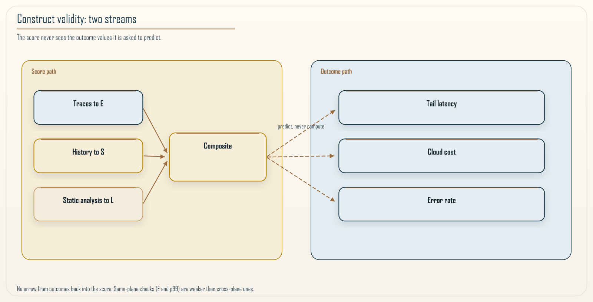

# Chapter 22: How to Trust an Architecture Metric

  <h2 class="chapter-subtitle">A Formula Confers No Truth. Outcomes Do.</h2>
  

    📖 50 min read
    🎯 Expert
  

This chapter is the conscience of the book. It asks the question that any quantitative method has to survive, and that most of them quietly dodge: how do you know the number means anything. It is easy to invent a formula, wrap it in Greek letters, and present its output as if the mathematics conferred truth. It confers no such thing. A formula can be internally flawless and measure nothing real, and the history of software metrics is littered with numbers that were precise, reproducible, and useless. This chapter is about how to tell the difference, for RVx and for any metric someone tries to sell you, including your own.

I care about this more than almost anything else in the book, because a governance metric that is trusted without being validated is worse than no metric at all. No metric leaves decisions to judgment, which is at least honest about its uncertainty. A false metric replaces judgment with misplaced confidence and gates real decisions on a number that does not track reality, and it does so with the full authority of mathematics. If you take one thing from this chapter, take a healthy suspicion of any architecture number, including the ones in this book, until it has earned trust the way this chapter describes. I am not restating the score. Chapter 11 owns the formula and the honesty tiers. This chapter is how you refuse to let those tiers drift.

## 22.1 The two questions a metric must answer separately

Every metric faces two entirely different questions, and the most common error in the field is answering the first and pretending it settles the second.

The first question is whether the metric is **well formed**: is it bounded, does it move in the right direction when its inputs change, is it stable, is it free of degenerate behavior. This is a question about the formula, and it is answered with mathematics. For RVx, Chapter 11 stated the propositions that answer it: the published score is bounded, it rises with efficiency and distinctness and falls with load, a catastrophic value on a numerator signal collapses it, and only the ratio of the exponents affects ranking. These are proved in the pen-and-paper sense, and they matter, because a metric that fails them is broken before you even ask what it measures.

The second question is entirely separate: **does the metric measure the thing it claims to measure**. Does a low RVx actually correspond to a boundary that is a distributed monolith in reality, one that causes the latency, the coupling, and the pain the metric is supposed to detect. This is not a mathematical question, and no amount of proving properties of the formula answers it. It is an empirical question about the relationship between the number and the world, and it can only be answered with data from the world.

The trap, and it is everywhere, is to answer the first question rigorously and let the reader assume you answered the second. A paper full of proved properties feels validated, and it is not, because a metric can be beautifully behaved and correlate with nothing. Keeping these two questions separate, and being explicit about which one you have answered, is the foundation of honest metric work, and it is the discipline this chapter builds on.

## 22.2 Construct validity: the real test

The second question has a name in measurement science: **construct validity**. A metric has construct validity when it actually measures the underlying construct it claims to, rather than something else that happens to correlate in your sample or nothing at all. For an architecture metric, construct validity means the score tracks real outcomes that the construct should produce.

The way you establish it is to connect the metric to **independent outcomes**, outcomes the metric did not use as inputs. This independence is the crux. If you define a metric using latency and then show it correlates with latency, you have shown nothing, because you built the correlation in by construction. That is circular, and circular validation is the most common way metrics fool their creators. Real construct validity requires that the metric be computed from one set of signals and then checked against outcomes it never saw.

For RVx this is exactly the structure of the validation Chapter 11 reported. The three signals, efficiency from traces, distinctness from version history, and load from static analysis, are computed without putting the outcome numbers into the formula, and then the score is checked against outcomes measured separately: tail latency, cloud cost, and error rate. When efficiency tracks latency, load tracks cost, and distinctness tracks errors, each in the right direction, that is construct-validity evidence *of a specific kind*. It says the signals move with consequences they were not plugged into as inputs.

Two honest limits on that independence, because the draft would otherwise overclaim.

First, **efficiency and tail latency share a data plane**. Both come from traces. E is a decomposition of path time, useful over total. p99 is a quantile of path time. They are not the same statistic, so a high-E path can still have a bad tail if the useful work itself is slow, and a low-E path can look fine at the median. That is why the check is not a tautology. It is also why it is not as independent as cost, which comes from a billing plane E never sees, or error rate, which is not a rewrite of distinctness. Same-plane checks are weaker than cross-plane checks. Say which you ran.

Second, **the AWS benchmark wired each dimension to drive a different outcome**. Thirty-six randomized service boundaries, real functions, real tracing, outcomes generated so that each signal had something independent to predict. The scorer did not ingest those outcomes. The estate was still *designed* so the links would be there. That is demonstrated construct validity under designed coupling. It is not a finding you stumbled on in an organic production estate. Chapter 11 already said the organic claim is hypothesized. I am repeating it because this is the chapter where a reader most wants to upgrade the tier.

The simulation of 1,500 synthetic boundaries is the cleaner independence story: outcomes came from a physics model the scorer never saw. It is also a simulation whose domain profiles I chose. Demonstration, not field performance.

*Figure 22.1: Why the validation is not circular. On one path, the three signals are computed from their own sources, traces, version history, and static analysis, and combined into the score, and the outcome *values* do not enter this computation. On a separate path, outcomes such as tail latency, cost, and error rate are measured on their own. Construct validity is established by checking whether the score, built only from the first path, predicts the outcomes on the second path. The diagram's essential feature is the absence of any arrow from the outcomes back into the score's inputs. If such an arrow existed, the validation would be circular. Sharing a data plane, traces feeding both E and p99, is a thinner independence than the picture suggests. Cross-plane outcomes are the stronger check.*

The honest caveats belong here too, because construct validity is a matter of degree and evidence, not a badge. Thirty-six boundaries give directional evidence with wide confidence intervals, not precise effect sizes. On that estate the additive composition beat the multiplicative one, because distinctness was floor-bound, which is exactly why Chapter 11 wrote the fallback. The strongest predictive claims, that the metric separates healthy boundaries from distributed monoliths on organically grown production systems over time, remain hypotheses with a protocol attached. The `validation/` plan in this repository is that protocol. It is scaffolding. A metric whose creators cannot tell you the limits of its validation has probably not thought about validity at all.

## 22.3 Reliability: the other half of measurement

Construct validity asks whether the metric measures the right thing. There is a second property from measurement science that is just as necessary and far more often forgotten: **reliability**, which asks whether the metric measures consistently. A metric can be valid in principle and useless in practice if it gives different answers to the same question depending on when it was computed, who computed it, or which incidental details of the input happened to be present.

Reliability has two faces that matter for an architecture metric. The first is **repeatability**: computing the score for the same boundary twice, on the same pinned inputs, must yield the same result. This sounds trivial, and it fails quietly. Traces are sampled. A window that slides by an hour can change E. A merge that lands in the distinctness window can change S. If you recompute from "whatever the collector has right now," the score jitters, and a gate that jitters is a flaky test. A metric intended to govern must be deterministic given a declared input snapshot, profile id, and composition form. Any randomness in the inputs must be controlled or averaged over a stable window so the score does not wobble. Publish the snapshot with the number, the way Recipe 21.1 published the window with W.

The second face is **stability over irrelevant variation**: the score should not swing wildly in response to changes that do not reflect a real change in the boundary's health. If adding a few lines of comment, or a single low-traffic day, moves the score across a decision threshold, the metric is too sensitive to noise to trust, and it will generate false alarms that erode confidence exactly as flaky tests and noisy alerts do in the earlier chapters. The remedy is the same discipline: measure over windows long enough to average out noise, and design the score so that its inputs reflect sustained properties of the boundary rather than momentary fluctuations. A comment is not complexity. Chapter 11's load signal is static analysis plus capacity, not a line count of prose.

The relationship between reliability and validity is worth stating precisely, because they are often confused. A metric can be reliable without being valid: a broken thermometer that always reads two degrees high is perfectly consistent and consistently wrong. But a metric cannot be valid without being reliable, because a score that changes randomly cannot track anything real, since reality did not change when the score did. Reliability is therefore a precondition for validity, not a substitute for it, and a metric that gates decisions needs both. A validation effort that establishes construct validity but never checks reliability has left half the job undone, and the half it skipped is the one that produces the false alarms teams notice first.

I have not published a test-retest table for RVx on an organic estate. Repeatability on pinned inputs follows from the definitions if the implementation is honest. Stability under noise is an empirical claim and sits in the demonstrated-or-hypothesized bucket depending on the estate. Do not upgrade it.

## 22.4 A short history of metrics that fooled us

Skepticism about architecture metrics is not paranoia; it is learned from a field that has repeatedly trusted numbers that turned out to measure the wrong thing, and knowing that history is part of not repeating it. Software engineering has a graveyard of metrics that were precise, reproducible, and misleading, and each one failed in a way this chapter's disciplines would have caught.

**Lines of code** is the oldest example. It is perfectly reliable, trivial to compute, and it measures effort or value so poorly that using it to gauge productivity rewards verbosity and punishes the elegant deletion that often represents the best work. It fails the construct-validity test outright: it correlates with the size of the code and not with the thing anyone actually cares about.

**Cyclomatic complexity** is a subtler case. It genuinely measures something real, the number of independent paths through a piece of code, and it has legitimate uses, but it was widely misapplied as a direct proxy for maintainability or defect risk, roles for which its validation was always thinner than its adoption. A real measure was stretched past the construct it actually captured.

**Test coverage** is the example that stings most, because it is so widely gated on. Coverage measures the fraction of code executed by tests, which is real and useful, but the moment it becomes a target, a team gated on ninety percent coverage, it stops measuring test quality and starts measuring the presence of tests that execute code without necessarily asserting anything about it. You can reach high coverage with tests that check nothing, and teams under a coverage mandate routinely do, which is a preview of the entire next chapter: the metric was fine as a signal and became misleading as a target.

The lesson across all three is not that metrics are useless; it is that each failed for a reason this chapter names. Lines of code lacked construct validity. Cyclomatic complexity was pushed past its validated construct. Test coverage was reliable and valid as a signal and was destroyed by being made a target. A metric that has been checked for construct validity, held to its stated construct, and designed against being gamed avoids all three graves. RVx is built with those graves in view. That is a design claim. It is not a certificate that we have avoided them.

One more grave that belongs next to Cognitive Load: **treating L as NASA-TLX**. Chapter 11 already said L is Capacity-Normalized Complexity, an artifact proxy, not a measured psychological state. If you validate L against survey workload and expect a tight correlation, you are testing a construct the formula never claimed. That is stretching the construct, the cyclomatic-complexity failure, under a friendlier name.

## 22.5 The evidence tiers

The practical tool that makes all of this usable is a discipline of tiering every claim by the kind of evidence behind it, and refusing to let a claim drift up a tier without earning it. Chapter 11 used three tiers. I keep the same three, with the same meanings.

| Tier | Meaning | What it takes to claim it |
|------|---------|---------------------------|
| **Proved** | A property of the formula, derived from definitions | A mathematical argument, checkable on paper |
| **Demonstrated** | Shown under controlled conditions | Code on synthetic or benchmark data, reproducible |
| **Hypothesized** | Expected but not yet shown | A written, falsifiable protocol and honesty that it has not run |

The tiers are not a ranking of importance; they are a statement of epistemic status, and mixing them is the core dishonesty this chapter exists to prevent. A proved property is certain but narrow: it tells you the formula behaves, not that it measures anything. A demonstrated result is real evidence but bounded by the conditions of the demonstration: a simulation result holds in the simulation, and a benchmark result holds on the benchmark, and neither is automatically a claim about your production system. A hypothesized claim is a promise with a test attached, and its integrity depends entirely on being labeled as a hypothesis rather than smuggled in as a result.

Applied to RVx, the tiering is explicit and must not be re-told as a smoother story.

**Proved.** Boundedness of the squash, monotonicity in the components, weakest-link behaviour of the multiplicative numerator, ranking invariance to a common scale of the exponents.

**Demonstrated.** Composite robustness in a 1,500-boundary simulation whose physics the scorer did not see, with profiles I chose. Directional construct validity on a 36-boundary AWS estate, wide intervals, additive winning because S was floor-bound.

**Hypothesized.** That the metric separates healthy boundaries from distributed monoliths on organically grown production systems over time. Specified as a protocol. Not run at that scale.

A reader who wants production-proven external validity is told, plainly, that they will not find it, because it does not yet exist. That admission is not weakness. It is the thing that lets you trust everything else in the book, because a source that tells you the boundary of its own evidence has earned belief inside that boundary.

## 22.6 Running a validation study

Establishing construct validity is not a one-time blessing; it is a study you run, and it is worth describing the shape of that study concretely, because a team that wants to trust a metric, its own or someone else's, needs to know what earning that trust actually involves.

It begins with **labeled examples**: a set of boundaries whose true status is known independently of the metric, some that are genuinely healthy and some that are genuinely distributed monoliths, judged by evidence the metric does not use, documented operational pain, coordinated-deploy counts, measured wasted time from Chapter 21. Expert assessment is useful and contaminated. An architect who already thinks in these three signals will reproduce the metric and call it judgment. Prefer labels that come from outcomes, not from the same intuition the formula encoded.

The examples are then **split**, and the split matters. The metric's parameters, any thresholds or weights, are fitted on one portion, the training split, and the metric is evaluated on a separate portion it never saw, the held-out split. A metric evaluated only on the data it was fitted to has not been validated; it has been fitted, and reporting the fit as validation is a quiet but serious error. If you do not have enough labels to split, you do not have a validated profile. You have a policy. Chapter 20 already said that.

On the held-out split, the metric's score is compared against both the ground-truth labels and the independent outcomes from Section 22.2, and the results are reported **with their uncertainty**. A correlation is not a single number but a number with a confidence interval, and on a small sample that interval is wide. A study on thirty-six boundaries yields directional evidence with wide intervals, and saying exactly that is what separates a credible validation from a marketing chart that plots a line through a handful of points and calls it proof.

The final element is **preregistration** of the strongest claims. Where a study cannot yet be run at the scale that would settle a claim, the honest move is to write the protocol in advance, specifying what would confirm or refute the claim, and to label the claim as hypothesized until that protocol runs. That is what `validation/` is for. It is not a results folder.

### Recipe 22.1: Five questions before a number gates a merge

**Context.** Someone wants to put an architecture score, yours or a vendor's, on the critical path.

**Solution.** No empty answers. A dodge is a no.

1. **Inputs versus outcomes.** What goes into the number, what is it checked against, and do those two sets overlap. Overlap is circular.
2. **Tier.** For each claim, proved, demonstrated, or hypothesized, and on what data. "It works" is not a tier.
3. **Sample.** How many cases, how varied, how wide are the intervals. Twenty points with a fitted line is a hint.
4. **Stated limits.** What the metric does not measure. A metric with no limits has not been understood. RVx does not measure resilience, security, or correctness. Chapter 7 and Chapter 11 already said so.
5. **Gaming.** What happens when the number becomes a target. If the seller has not thought about it, the metric is not ready to govern. Chapter 23 is that question in full.

A metric that answers these honestly might still be imperfect. It is trustworthy in the sense that matters: you know what it does, what it does not, and how much to lean on it. A metric that dodges them should not gate anything you care about.

## 22.7 Convergent and discriminant validity: what it must track, and what it must not

Construct validity has two sides that are easy to state and easy to forget, and a metric that passes one while failing the other is a common and dangerous case.

The first side is **convergent validity**: the metric should agree with other independent measures of the same construct. Section 22.2's correlation with outcomes is one form. Agreement with labels built from operational pain is another. Agreement with an architect who already uses the same three signals is the weakest form, because it is the formula talking to itself.

The second side is the one that gets skipped: **discriminant validity**, which asks whether the metric fails to correlate with things it should be independent of. A granularity metric should measure granularity and not be a disguised proxy for something else, so it should be roughly independent of properties that are not granularity: the programming language a service is written in, the raw size of its codebase, the number of people on its team once capacity is already in L. If a metric that claims to measure granularity turns out to correlate strongly with lines of code, then it is not measuring granularity at all; it is measuring size wearing a granularity label.

Testing discriminant validity is straightforward in principle and rarely done in practice: take the confounds you worry the metric might secretly be measuring, and check that the score does not track them once the construct is held fixed. Codebase size is the most dangerous, because larger services trivially have more of almost everything, and a metric that does not control for size can mistake bigness for badness. Language and framework are next. Team size is already inside L's denominator; a residual correlation with headcount after capacity is accounted for is a smell. Age of the service rounds out the list.

I am describing the test. I am not claiming RVx has passed it on an organic corpus. Size, language, and age as confounds are hypothesized threats. A chart that only shows the score moving with latency has not ruled them out. The most common way metrics turn out to be measuring the wrong thing is exactly this, and a validation that never runs the discriminant check has not finished.

## 22.8 How to interrogate any metric someone sells you

The value of this chapter is not really about RVx; it is a toolkit for evaluating any architecture metric, including the next vendor pitch or the internal dashboard someone wants to gate your deployments on. Recipe 22.1 is that toolkit. Use it on this book.

When I say the composite was the most robust scorer across domains, ask: demonstrated, simulation plus 36 boundaries, profiles I chose, additive won on the estate where S collapsed. When I say a low score means a distributed monolith, ask: hypothesized on organic production. When I say wasted time is money, ask: identity on the path, conversion depends on how you are billed, saving is a prediction. If those answers annoy you, good. They are supposed to.

A metric that answers the five questions honestly might still be imperfect, but it is trustworthy in the sense that matters. A metric that dodges them should not gate anything you care about, no matter how precise its output looks.

## 22.9 Summary

A formula is not a truth, and the central discipline of honest metric work is to answer two separate questions and never let the first pose as the second. The first, whether the metric is well formed, is answered with mathematics, and for RVx the proved properties in Chapter 11 answer it. The second, whether the metric measures what it claims, is answered only with data, and it has a name: construct validity, established by connecting the metric to independent outcomes it never used as inputs, because validating a metric against its own inputs is circular and proves nothing. Sharing a data plane is thinner independence than sharing nothing. Designed estates are thinner evidence than organic ones.

Reliability is a precondition for validity, not a substitute. Pin the inputs. Do not gate on a jittering window. Tier every claim, proved, demonstrated, or hypothesized, and keep the tiers rigidly separate. For RVx the limits are stated: the properties are proved, the robustness is demonstrated in simulation and on a real benchmark with wide intervals, and the production-scale predictive claim is hypothesized and not yet run. Discriminant validity against size, language, and age is a test this method still owes you. Carry the five questions into every metric someone sells you, including this one. A metric that answers them honestly can be trusted within its stated bounds, and one that dodges them should gate nothing.

The final chapter takes up the last of those five questions in full, because a metric that governs decisions becomes a target, and a metric that has not been designed against gaming will be gamed into meaninglessness the moment it starts to matter.

---

**Navigation:**
- [Previous: Chapter 21](21-pricing-the-distributed-monolith.md)
- [Next: Chapter 23](23-gaming-and-goodhart.md)
