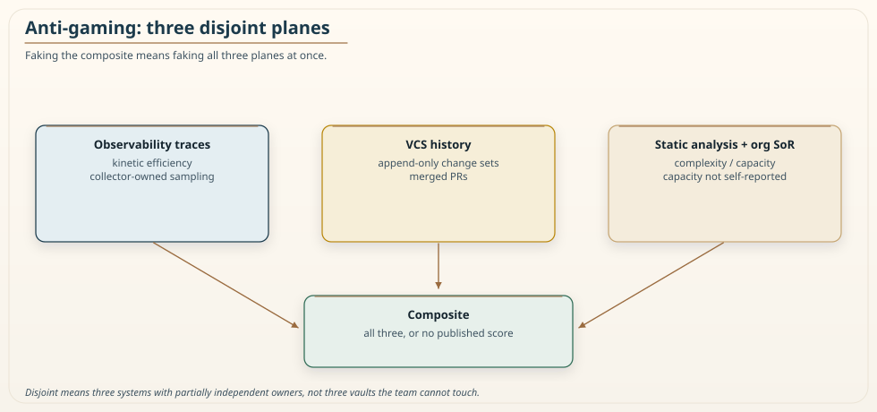

# Chapter 23: Governing a Metric Without It Being Gamed

<div class="chapter-header">
  <h2 class="chapter-subtitle">Never Point the Number at the People.</h2>
  <div class="chapter-meta">
    <span class="reading-time">📖 50 min read</span>
    <span class="difficulty">🎯 Expert</span>
  </div>
</div>

This is the last chapter, and it is the one that decides whether everything before it survives contact with real organizations. A metric that sits on a dashboard and informs is safe. A metric that gates decisions, that blocks a merge or triggers a remediation, becomes a target, and the moment a number becomes a target, people optimize the number instead of the thing the number was supposed to measure. Goodhart's Law names this: when a measure becomes a target, it ceases to be a good measure. Any governance metric that ignores this law will be gamed into meaninglessness the instant it starts to matter, and it will be gamed not by villains but by ordinary people responding rationally to the incentive you created.

I want to be clear that this is not a cynical chapter about untrustworthy engineers. It is a realistic chapter about incentives. If you tell a team their boundaries will be judged by a score, and their reviews, their reputation, or their roadmap depend on that score, they will move the score, and they will often do it without any sense of wrongdoing, because you asked them to make the number good and they made the number good. The defense against gaming is not better people. It is a metric and a governance process designed so that the easiest way to improve the number is to improve the actual thing, and the ways to fake it are hard, expensive, and visible. Chapter 11 named this posture. Chapter 22 asked whether the number measures anything. This chapter is what happens after you put it on the critical path.

## 23.1 Tamper-evidence, not tamper-proofness

The first thing to accept is that you cannot make a governance metric impossible to game. A sufficiently determined and coordinated group can fool almost any measurement, and a metric that promises to be tamper-proof is making a promise it cannot keep. The achievable and correct goal is **tamper-evidence**: make gaming expensive enough that it is not worth it for most, and visible enough that when someone does it, the attempt shows up rather than succeeding silently.

This reframing matters because it changes what you build. If you chase tamper-proofness, you build ever more elaborate locks, and you fail, because there is always another way around. If you chase tamper-evidence, you build a metric whose signals are hard to fake in combination and a process that surfaces manipulation, and you succeed at the achievable goal, which is to make honest improvement the path of least resistance and to catch the dishonest path when someone takes it anyway. Tamper-evidence is a security posture, and like all honest security postures it admits residual risk rather than claiming its absence. Chapter 7 would recognize the sentence.

## 23.2 The structural defense: disjoint data planes

The single strongest anti-gaming property of RVx is not a rule bolted on afterward; it is built into the shape of the metric. The three signals come from three different data planes, and faking all three at once is far harder than faking any one.

Kinetic Efficiency comes from runtime traces, produced by the observability platform. Semantic Distinctness comes from version-control history, which is append-only evidence of what actually changed together. Cognitive Load comes from static analysis of the code combined with a team-capacity figure drawn from an organizational system of record. To move the composite dishonestly, a team would have to make its traces look efficient, its change history look independent, and its complexity-to-capacity ratio look healthy, together and consistently.

Do not romanticize the ownership. The scored team usually *authors* the commits. They often own the instrumentation that emits spans. They do not usually own the collector's sampling policy, the org chart that feeds capacity, or the audit log. "Disjoint" means three systems with three *partially* independent owners, not three vaults the team cannot touch. Git is the easiest plane to shape, because writing history is the job. Traces are easier to shape than people admit, because dropping a span is an SDK change. Capacity is the hardest to fake if it truly comes from a system of record the team cannot edit. The structural claim is that coordinating all three, for long enough, costs more than fixing the boundary. It is not that the team cannot reach any of them.


*Figure 23.1: Why the score is hard to fake, viewed as an anti-gaming property. Each of the three signals enters from a different data plane: efficiency from runtime traces, distinctness from append-only version-control history, and load from static analysis plus a capacity figure taken from an organizational system of record. Because the composite depends on all three, moving it dishonestly means making all three look healthy at once. The separation of the planes is not incidental. It is the structural reason that faking the whole score is harder than fixing the boundary. Harder is not impossible. The team still writes the commits.*

The reporting discipline reinforces this. Because the components are always reported alongside the composite, single-signal manipulation is visible: a boundary whose efficiency suddenly looks perfect while its distinctness and load did not move invites the question of what changed, and the answer is often the manipulation. The composite hides nothing that the components would reveal, which is why the method insists on never showing the score alone.

## 23.3 Goodhart's Law and its varieties

Goodhart's Law is usually quoted as a single aphorism, but it names several distinct failure modes, and understanding which one you are defending against changes what defense you build. The split below follows a taxonomy the alignment literature already uses, extremal, causal, and adversarial. I am applying it, not inventing it.

The first variety is **extremal**. When you select hard on a proxy, pushing it to its maximum, you drive the system into regimes where the proxy and the true goal, which agreed in the normal range, come apart. A metric that correlates with health across ordinary values may recommend something absurd when you optimize it to the extreme. This is why RVx is designed as a detector rather than a quantity to maximize. It flags unhealthy zones, too coarse and too fine, and its intended use is a check-engine light, not a high-score contest. A team told to maximize a granularity score would find the degenerate design that maximizes it. A team told to keep boundaries out of the unhealthy bands has a weaker version of the same incentive: **threshold Goodhart**. Clearing 0.4 is still a target. The defense is to treat the band as a reason to look, to publish the components, and never to celebrate a score that rose while latency and incidents did not.

The second variety is **causal**. If a proxy only correlates with the goal rather than causing it, then intervening to move the proxy can break the very correlation you relied on. Chapter 22 already limited the cleanest-looking causal story: efficiency and tail latency share a data plane, and overhead is *part* of path time, not a separate physical law. Removing a hop often improves latency. Making the traces look efficient without removing the hop often does not. Load is a proxy for standing structural pressure, Capacity-Normalized Complexity, not a proven cause of "difficulty of change." Choose signals with a plausible mechanism, then verify the outcome, the Fulcrum canary, rather than trusting the mechanism. A metric that rode a coincidental correlation into a dashboard is the one causal Goodhart wrecks first.

The third variety is **adversarial**, the deliberate exploitation of the gap between proxy and goal by people who benefit from the number looking good, and it is the subject of the rest of this chapter. The defenses differ by variety: extremal Goodhart by refusing maximization and watching for threshold-hugging, causal Goodhart by checking outcomes not the score, adversarial Goodhart by tamper-evidence, disjoint planes, and the incentive rule in Section 23.9. A program that has only thought about cheaters can still be wrecked by a leaderboard.

## 23.4 The attack surface, named

Vague reassurance that a metric resists gaming is worthless. The honest approach is to enumerate the specific ways each signal can be attacked, state the mitigation, and state the residual risk. Naming the attacks is not a cookbook. It is the same list Chapter 11 already published. I am not adding a new vector so the table can look thicker.

| Signal | Attack | Mitigation | Residual risk |
|--------|--------|------------|---------------|
| Efficiency | Cherry-pick a light workload so the boundary looks fast | Platform-controlled, tail-preserving sampling on a workload the team does not choose, then reweight to a declared window | Moderate; workload provenance must be audited. The team can still shape traffic. |
| Efficiency | Hide overhead in an unmonitored side channel, or drop the span | Trace the side channel; treat dropped coverage as low confidence, not a good E | Moderate; requires instrumentation the team does not solely own |
| Distinctness | Squash multi-service changes into one commit | Aggregate change sets at the intent level, merged pull request | Partial; coordinated delayed merges still evade |
| Distinctness | Split dependent changes across time to hide co-change | Anomaly detection on unusual timing | Partial; patient adversaries evade |
| Load | Inflate team size or seniority to dilute the denominator | Source capacity from an organizational system of record, not self-report | Strong *if* that record is real. A spreadsheet the team edits is self-report with extra steps. |
| Load | Cosmetically simplify code the analyzer sees | Review the static-analysis definition; do not treat a comment deletion as a load win | Moderate |
| Actuator | Trigger a config change just to move the score | Key the safety canary to physical outcomes, not the score | Strong; a change that regresses outcomes rolls back |

Read the residual-risk column honestly. The capacity and actuator attacks are strongly defended only when the loophole is actually closed. The efficiency and distinctness attacks are only partially defended, because a patient, coordinated adversary can still evade the automated checks, and pretending otherwise would be the exact overclaim Chapter 22 warned against. The honest position is that structural resistance is a mitigation, not a guarantee, and that ongoing auditing remains necessary. A threat model that claimed to close every attack would be less trustworthy than this one, not more, because it would be lying.

## 23.5 The all-three attack and the final backstop

The attack that cannot be preemptively stopped is the coordinated one: a team that patiently manipulates all three data planes together over time, shaping its workloads, timing its commits, and managing its reported capacity in concert. No structural property of the metric defeats a determined, coordinated, patient adversary who controls enough of the inputs, and it would be dishonest to claim otherwise.

The backstop for this is statistical rather than structural: monitor the score's movements over time and flag changes that the code delta does not justify. When a boundary's score improves sharply without a corresponding change in the code that would explain it, that anomaly is routed to a human for audit. This does not prevent the coordinated attack, it surfaces its footprints, which is the tamper-evidence goal restated. Anomaly detection itself can be gamed, and it will false-alarm on a genuine quiet week. It is a backstop, not a proof. A governance system that combines structurally hard-to-fake signals, visible components, a canary keyed to real outcomes, and anomaly detection on unexplained score movements has made gaming expensive, partial, and detectable, which is the most any honest system can claim.

## 23.6 Conformance: making the governance checkable

The defenses above only work if a deployment actually implements them, and a governance method that cannot verify its own implementation is a slogan. This is why the method ships as a specification with normative requirements and conformance profiles, so that a conformant deployment is a claim you can check rather than assert.

I am not going to invent a numbered catalogue here so that requirement seventeen can drift away from the spec. Chapter 11 already refused that. The requirements cover the properties this chapter depends on: that all three signals are computed from their real data planes, that components are reported alongside the composite, that capacity comes from a system of record the scored team does not control, that the scoring pipeline runs where the scored team cannot silently reconfigure it, that every score and action is written to an append-only audit trail, that anomalous score movements are flagged, and that the metric is never used for individual performance evaluation. That last one is not a technicality. It is the most important social rule in the whole method.

The conformance profiles stack these requirements into levels of increasing strength, aligned with KM3 rather than inventing a fourth ladder: an **advisory** deployment that only reports, a **governed** deployment that gates changes and therefore must satisfy the anti-gaming requirements, and a **self-correcting** deployment that acts autonomously and therefore must satisfy the strictest safety rules, canary, rollback, incident freeze, structural change still human. A deployment declares its profile, and its scores are interpretable only within that profile, so that "we govern with RVx" becomes a specific, auditable statement about which requirements are in force rather than a vague claim of rigor.

### Recipe 23.1: Declare the profile, or do not claim governance

**Context.** Someone says the estate is Governed.

**Solution.** A file the pipeline reads. Empty fields fail the claim.

```yaml
# Conformant claim. Not a score. Not a review input.
profile: governed          # advisory | governed | self-correcting
signals:
  E: platform_collector    # not the team's process sampler
  S: merged_pull_requests  # not raw commits
  L: org_capacity_sor      # not a wiki table
components_published: true
audit: append_only
anomaly_review: human
used_in_individual_perf: false   # if true, you are not conformant
```

If `used_in_individual_perf` is true, stop. The rest of the file is decoration.

## 23.7 When the metric itself is wrong

Every anti-gaming defense so far assumes the metric is right and the team might be cheating. Honest governance has to admit the opposite possibility: sometimes the low score is the metric's error, not the boundary's fault. A domain may be legitimately coupled in a way the distinctness signal misreads, a measurement artifact may depress efficiency for a boundary that is actually fine, a rare architecture may sit outside the range the metric was calibrated on. A monorepo that floor-bounds S is not a crime. Chapter 11 already told you to drop that signal and say so. A governance system that treats the metric as an infallible oracle, where the only permitted response to a bad score is to change the boundary, will sometimes force teams to damage good architecture to satisfy a number that was wrong about them.

The defense is an **appeals path**, and it is as important as any technical control. A team must be able to contest a score with evidence, and a designated owner of the metric, an architecture or platform function, must be able to adjudicate: either the score stands and the boundary needs work, or the score is wrong for this case and an override is granted. This turns the metric from an unaccountable authority into a claim that can be challenged, which is exactly what a construct-validity mindset from Chapter 22 demands, because a metric that is never allowed to be wrong is a metric no one is actually checking against reality.

Two disciplines keep the appeals path from becoming its own loophole. First, overrides are logged to the same append-only audit trail as scores and actions, so that an override is a visible, attributable decision rather than a quiet exception. An escape hatch that leaves no trace is how governance quietly hollows out. Second, a pattern of overrides for the same class of case is treated as a signal to fix the metric, not to keep granting exceptions. If a particular kind of legitimately coupled domain keeps being flagged and keeps being overridden, the metric is systematically wrong for that pattern, and the correct response is to revise the profile or the calibration so the metric stops being wrong. The metric governs the boundaries, and the appeals data governs the metric.

## 23.8 Incentives that reward the healthy path

Anti-gaming defenses are mostly about removing the reward for cheating. The complementary work is adding a reward for the honest path, because a metric that teams experience purely as a gate to get past invites a different relationship than one they experience as a tool that helps them.

The foundational move is to give teams their own scores first, for their own use, before anyone uses the scores to make decisions about them. Rolling out in advisory mode first, KM3 Level 2 before Level 3, is not just technical caution. It is how teams come to trust that the metric is on their side. A metric that arrives as a top-down judgment they first learn about when it blocks their merge becomes an adversary.

Beyond that, the incentives should reward improvement rather than only punishing regression. A team that takes a boundary from unhealthy to healthy has done real work. Fund it through the economic case of Chapter 21. Treat it as an engineering achievement, not as housekeeping they sneaked past the gate. When improving the actual architecture is the celebrated, resourced, career-legible thing to do, and gaming the number is neither rewarded nor needed, the incentive that drives Goodhart's Law simply is not present. The structural defenses catch the cheating that incentives failed to prevent. Good incentives mean there is little to catch.

## 23.9 The rule that matters most

If this book has one rule that determines whether the whole method helps or harms, it is this: **never use the metric to evaluate people**. The instant a boundary score affects someone's review, their bonus, or their standing, you have created the incentive that guarantees gaming, and no structural defense survives a sustained, motivated, organization-wide effort to move a number that people's livelihoods depend on. The metric is a tool for improving and governing boundaries. Its specified use excludes individual performance evaluation, not as a nicety but as the load-bearing social precondition for it working at all.

This is the deepest lesson of Goodhart's Law applied honestly. The law is usually quoted as a warning that metrics get gamed, and the usual response is to try to build an ungameable metric, which is impossible. The real response is to arrange the incentives so that gaming is not worth it: make the metric hard to fake, make manipulation visible, and above all do not point it at the people whose behavior it measures. A metric used to help a team see and fix its boundaries is a metric a team has no reason to game. A metric used to judge that team is a metric they have every reason to game, and they will, and it will stop measuring anything real. The technology cannot save a metric from a bad incentive, and the incentive is a choice you make, not a property of the formula.

## 23.10 Summary, and the end of the book

A metric that gates decisions becomes a target, and Goodhart's Law guarantees that a target gets optimized instead of the thing it stands for. The defense is not better people and not an impossible tamper-proof formula; it is tamper-evidence, making gaming expensive and visible so that honest improvement is the path of least resistance. RVx builds this in structurally, because its three signals live in three data planes that are hard to fake together, and its components are always shown alongside the composite so single-signal manipulation is visible. Harder is not impossible. The team still writes the commits.

Name the attacks rather than waving them away: efficiency and distinctness are partially defended and evadable by a patient adversary, capacity and actuator attacks are strongly defended only when their loopholes are actually closed, and the coordinated all-three attack is caught, not prevented, by anomaly detection on score movements the code does not justify. Make the whole thing checkable with conformance requirements and profiles so that governing with the metric is an auditable claim, not a numbered catalogue that drifts from the spec. Give teams the number as a tool before it is a gate. Let them appeal, and log the appeal. And obey the one rule that everything else depends on: never use the metric to evaluate people, because that single incentive defeats every structural defense and turns a tool for seeing clearly into a tool for lying convincingly.

That is where the book ends, and it ends here on purpose. The whole journey, from the granularity paradox in the opening chapters, through the metric and the governance loop, the resilience and migration disciplines, the maturity model, the economics, and the validation, arrives at a single quiet conviction. The goal was never the most services, the highest maturity level, or the best score. The goal was to draw boundaries that add value, to measure them honestly, to govern them under a safety gate, to keep the measurement true by refusing to weaponize it, and to know, with evidence rather than hope, that the system you built can bear the weight you are about to put on it. Measure it, do not argue it, and never lie to yourself with your own numbers. Everything else is detail.

The glossary and the quick reference that follow are the field cards.

---

**Navigation:**
- [Previous: Chapter 22](22-construct-validity.md)
- [Next: Reference Materials](../reference/quick-reference.md)
