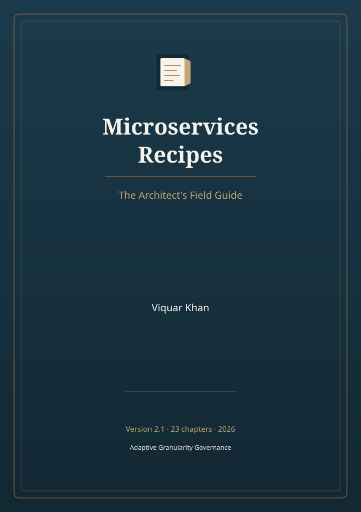
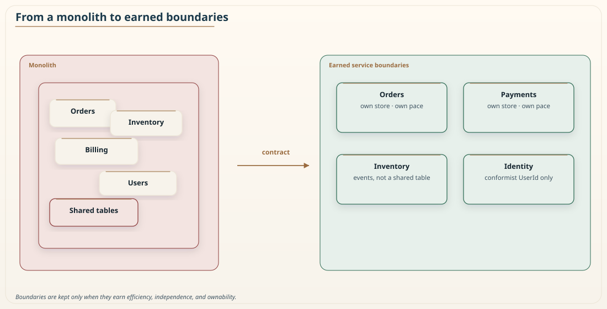

# 📖 Microservices Recipes

The Architect's Field Guide

{:.book-cover-img}

**Featuring Adaptive Granularity Governance: The Khan Microservice Pattern**

*by **Viquar Khan***

**Version 2.1** — *23-chapter science edition* (September 2026)

[Start reading →](chapters/01-introduction-to-microservices.md){: .book-cta} · [Preface](PREFACE.md) · [Author](AUTHOR.md)

---

## 📜 **Copyright & Publication Information**

**Copyright © 2017-2026 by Vaquar Khan.** Dual license: MIT for code; CC BY-NC-ND 4.0 for book prose, diagrams, and figures. See [LICENSING.md](LICENSING.md).

### **Publication Details**
- **Title**: Microservices Recipes: The Architect's Field Guide
- **Author**: Vaquar Khan
- **First Edition**: January 2017
- **Second Edition**: January 2026 (Adaptive Granularity Governance: The Khan Microservice Pattern Edition)
- **Version 2.1**: September 6, 2026 (23-chapter science edition)
- **Publisher**: Open Source (GitHub)
- **Code license**: MIT
- **Prose and figures**: CC BY-NC-ND 4.0
- **Repository**: https://github.com/vaquarkhan/microservices-recipes-a-free-gitbook

### **Original Methodologies (please cite)**
The following are original methodologies by Vaquar Khan. No trademark is claimed at this time:
- **Adaptive Granularity Governance: The Khan Microservice Pattern** (formerly Adaptive Granularity Strategy)
- **Service Decomposition Workflow**
- **Microservices Maturity Assessment (KM3)**

### **Citation Requirement**
When referencing this work, please use proper academic citation. See **[Citations Guide](CITATIONS.md)** for complete formatting guidelines.

### **Legal Notice**
This work is protected by copyright law. Unauthorized reproduction, distribution, or transmission of any part of this work without permission is prohibited. For permissions beyond the scope of the MIT License, contact the author.

**[📖 View Complete Legal Disclaimer](DISCLAIMER.md)**

---

## 🎓 **Academic & Research Access**

**📚 Complete 23-Chapter Edition**

This open-source edition includes all **23 chapters**, including the three closing chapters on cost, construct validity, and Goodhart. Additional academic licensing and citation guidance remain available for students, faculty, and researchers.

**[📧 Request Academic Access / Mentorship](FREE-ACCESS.md)** | **[📖 View Citations Guide](CITATIONS.md)** | **[📜 Version History](VERSION-HISTORY.md)**

### 🎯 **FREE 1:1 Mentorship Available**
**Get personal guidance from the author:** **[📅 Book FREE session with Viquar Khan](https://adplist.org/mentors/vaquar-khan)**  
*Career advice, architecture guidance, and research support - completely free!*

---

## 🌐 **From Monolith to Microservices**

{:.book-hero-gif}

*Visualizing the transformation journey with **Adaptive Granularity Governance: The Khan Microservice Pattern***

---

## 🎯 What You'll Master

✅ **Adaptive Granularity Governance: The Khan Microservice Pattern** for optimal service boundaries  
✅ **Distributed Systems** design and implementation  
✅ **Anti-Pattern Prevention** and failure analysis  
✅ **Real-World Patterns** from industry leaders  
✅ **Production-Ready** code examples and recipes  

---

## 📊 Book Statistics

| Metric | Value |
|--------|-------|
| **Chapters** | 23 chapters, Parts I–X |
| **Read Time** | ~15 hours total |
| **Code Examples** | 50+ practical implementations |
| **Patterns** | 25+ architectural patterns |
| **Difficulty** | Intermediate → Advanced → Expert |

---

## 🚀 Quick Start

### 🔰 For Beginners
1. [Start with Chapter 1](chapters/01-introduction-to-microservices.md)
2. [Read the Preface](PREFACE.md)
3. Progress through Parts I → X

### ⚡ For Experienced Practitioners
1. Review the Table of Contents below
2. Jump to specific challenge areas
3. Use [Quick Reference](reference/quick-reference.md)

### 🏗️ For Architects
1. Focus on strategic chapters (2, 3, 7)
2. Study [Adaptive Granularity Governance: The Khan Microservice Pattern](AUTHOR.md#the-adaptive-granularity-strategy)
3. Review [Complete Book Preview](BOOK-PREVIEW.md)

---

## 📋 Table of Contents

### 📚 **Front Matter**
- [📖 **Preface**](PREFACE.md) - The Architect's Mandate
- [👨‍💻 **About the Author**](AUTHOR.md) - Viquar Khan & Adaptive Granularity Governance: The Khan Microservice Pattern
- [🎓 **Free Mentorship**](MENTORSHIP.md) - 1:1 Sessions with Viquar Khan
- [🎓 **Free Academic Access**](FREE-ACCESS.md) - Complete 23-Chapter Edition for Students & Researchers
- [📖 **Citations Guide**](CITATIONS.md) - How to Cite This Work Properly
- [📜 **Version History**](VERSION-HISTORY.md) - Release Lineage & Evolution
- [📜 **Copyright Notice**](COPYRIGHT.md) - Complete Copyright & Legal Information
- [⚖️ **Disclaimer**](DISCLAIMER.md) - Copyright & Legal Notice
- [🤝 **Contributing**](CONTRIBUTING.md) - How to Contribute

---

### 📖 **Part I: The Sociotechnical Substrate**
*Focus: Aligning organization and architecture to prevent the "Distributed Monolith"*

| Chapter | Title | Read Time | Difficulty |
|---------|-------|-----------|------------|
| **[Chapter 1](chapters/01-introduction-to-microservices.md)** | Earned Boundaries, Not Fashionable Ones | 📖 35 min | 🎯 Intermediate |
| **[Chapter 2](chapters/02-design-principles-and-patterns.md)** | The Distributed Monolith: Diagnosis and First Remedies | 📖 40 min | 🎯 Advanced |
| **[Chapter 3](chapters/03-service-communication.md)** | Decouple the Language Before You Decouple the Code | 📖 40 min | 🎯 Advanced |

---

### 🗄️ **Part II: Data Architecture**
*Focus: Managing data consistency and transactions in distributed systems*

| Chapter | Title | Read Time | Difficulty |
|---------|-------|-----------|------------|
| **[Chapter 4](chapters/04-data-management.md)** | The End of ACID | 📖 45 min | 🎯 Expert |
| **[Chapter 5](chapters/05-deployment-and-operations.md)** | The Consistency Tax of Spanning Services | 📖 45 min | 🎯 Expert |
| **[Chapter 6](chapters/06-resilience-and-reliability.md)** | Close the Dual Write, Then Survive Failure | 📖 45 min | 🎯 Expert |
| **[Chapter 7](chapters/07-security.md)** | Every Hop Is a Door. Prove Who Is Knocking. | 📖 50 min | 🎯 Expert |

---

### 🌐 **Part III: Inter Process Communication**
*Focus: Moving bits between services without creating latency storms*

| Chapter | Title | Read Time | Difficulty |
|---------|-------|-----------|------------|
| **[Chapter 8](chapters/08-monitoring-and-observability.md)** | You Cannot Attach a Debugger. Emit the Evidence First. | 📖 50 min | 🎯 Expert |
| **[Chapter 9](chapters/09-testing-strategies.md)** | There Is No Whole System to Test. Test the Agreements. | 📖 50 min | 🎯 Expert |
| **[Chapter 10](chapters/10-asynchronous-messaging-patterns.md)** | Publish What Happened. Do Not Wait. | 📖 50 min | 🎯 Expert |

---

### 🎯 **Part IV: Adaptive Granularity Governance: The Khan Microservice Pattern**
*Focus: Quantitative framework for microservices decomposition*

| Chapter | Title | Read Time | Difficulty |
|---------|-------|-----------|------------|
| **[Chapter 11](chapters/11-khan-pattern-deep-dive.md)** | A Boundary Earns Its Keep Only When All Three Hold | 📖 70 min | 🎯 Expert |

---

### 🧱 **Part V: Resilience Engineering & Advanced Scaling**
*Focus: Blast-radius control and evidence-based resilience*

| Chapter | Title | Read Time | Difficulty |
|---------|-------|-----------|------------|
| **[Chapter 12](chapters/12-shuffle-sharding.md)** | A Single Bad Shard Should Be a Footnote | 📖 55 min | 🎯 Expert |
| **[Chapter 13](chapters/13-chaos-engineering.md)** | Break It on Purpose. Watch. Then You Know. | 📖 55 min | 🎯 Expert |

---

### 🏗️ **Part VI: The Platform Engineering Shift**
*Focus: Infrastructure APIs, telemetry, and cost-aware observability*

| Chapter | Title | Read Time | Difficulty |
|---------|-------|-----------|------------|
| **[Chapter 14](chapters/14-infrastructure-as-code-at-scale.md)** | The Definition Is the Truth. Reality Is Reconciled Toward It. | 📖 55 min | 🎯 Expert |
| **[Chapter 15](chapters/15-observability-2.md)** | Spend the Budget on Answers. Stay Sighted When It Counts. | 📖 55 min | 🎯 Expert |

---

### 🤖 **Part VII: The AI Frontier (2026)**
*Focus: Agentic systems and retrieval at production scale*

| Chapter | Title | Read Time | Difficulty |
|---------|-------|-----------|------------|
| **[Chapter 16](chapters/16-agentic-ai-architectures.md)** | The Model Proposes. The Executor Disposes. | 📖 55 min | 🎯 Expert |
| **[Chapter 17](chapters/17-rag-at-scale.md)** | Retrieval as a Data-Plane Discipline, Not a Prompt Trick | 📖 55 min | 🎯 Expert |

---

### 🚀 **Part VIII: The Migration Playbook**
*Focus: Evolutionary paths from monolith to services*

| Chapter | Title | Read Time | Difficulty |
|---------|-------|-----------|------------|
| **[Chapter 18](chapters/18-modular-monolith.md)** | The Right Number of Services Is Often One. | 📖 55 min | 🎯 Expert |
| **[Chapter 19](chapters/19-strangler-fig-pattern.md)** | Replace It While It Is Still Running. | 📖 55 min | 🎯 Expert |

---

### 📈 **Part IX: Organizational Maturity**
*Focus: Assessing and governing microservices excellence*

| Chapter | Title | Read Time | Difficulty |
|---------|-------|-----------|------------|
| **[Chapter 20](chapters/20-km3-maturity-model.md)** | Has This Organization Earned the Right to Distribute? | 📖 50 min | 🎯 Expert |

---

### 📐 **Part X: The Science Behind the Metric**
*Focus: Cost, construct validity, and keeping a gating metric honest*

| Chapter | Title | Read Time | Difficulty |
|---------|-------|-----------|------------|
| **[Chapter 21](chapters/21-pricing-the-distributed-monolith.md)** | Price the Waste. Name the Rest. Do Not Invent a Total. | 📖 50 min | 🎯 Expert |
| **[Chapter 22](chapters/22-construct-validity.md)** | A Formula Confers No Truth. Outcomes Do. | 📖 50 min | 🎯 Expert |
| **[Chapter 23](chapters/23-gaming-and-goodhart.md)** | Never Point the Number at the People. | 📖 50 min | 🎯 Expert |

---

### 📚 **Reference Materials**

| Resource | Description |
|----------|-------------|
| **[📖 Glossary](reference/glossary.md)** | Comprehensive definitions of microservices terms |
| **[⚡ Quick Reference](reference/quick-reference.md)** | Handy reference cards for patterns and practices |
| **[📚 Bibliography](reference/bibliography.md)** | Curated list of books, articles, and resources |

---

## 🎯 What Makes This Book Special

### **Adaptive Granularity Governance: The Khan Microservice Pattern for Adaptive Granularity**

At the heart of this book is **Adaptive Granularity Governance: The Khan Microservice Pattern**: a systematic approach to determining optimal microservice boundaries. Unlike rigid methodologies, it adapts to your specific:

- **Organizational maturity** and team structure
- **Business domain complexity** and change frequency  
- **Technical constraints** and operational capabilities
- **Evolutionary growth** and learning patterns

> *"The goal is not to build the perfect architecture, but to build an architecture that can evolve toward perfection."*  
> **- Viquar Khan**

---

## 👨‍💻 About the Author

**[Viquar Khan](AUTHOR.md)** is a Senior Data Architect at AWS Professional Services with 20+ years of expertise in distributed systems. Creator of **Adaptive Granularity Governance: The Khan Microservice Pattern**, **Service Decomposition Workflow**, and **Microservices Maturity Assessment**.

### 🎓 **Free Mentorship Available**
**Book a FREE 1:1 mentorship session with Viquar Khan:**  
**[📅 Schedule on ADPList](https://adplist.org/mentors/vaquar-khan)**

**Connect:** [LinkedIn](https://www.linkedin.com/in/vaquar-khan-b695577/) | [GitHub](https://github.com/vaquarkhan) | [Amazon Author](https://us.amazon.com/stores/Viquar-Khan/author/B0DMJCG9W6)

---

## 🤝 Community & Support

### **🌟 Support This Open Knowledge Initiative**
If you find this resource valuable:

**⭐ [Star this repository](https://github.com/vaquarkhan/microservices-recipes-a-free-gitbook)** - Help others discover this work  
**🍴 [Fork the project](https://github.com/vaquarkhan/microservices-recipes-a-free-gitbook/fork)** - Build upon these methodologies  
**📖 [Cite properly](CITATIONS.md)** - Support academic recognition  

### **📞 Get Involved**
- 🐛 **[Report Issues](https://github.com/vaquarkhan/microservices-recipes-a-free-gitbook/issues)** - Found an error or have suggestions?
- 💡 **Share Case Studies** - Connect with the author to share real-world implementation experiences
- 🔄 **[See Guidelines](CONTRIBUTING.md)** - Learn about acceptable contributions

---

## Ready to Begin Your Journey?

### Choose Your Path:

**📖 [Start Reading - Chapter 1](chapters/01-introduction-to-microservices.md)**  
**📜 [Read Preface](PREFACE.md)**  
**⚡ [Quick Reference](reference/quick-reference.md)**

---

<small>Last Updated: September 6, 2026 | Version 2.1 | Original work by Viquar Khan</small>
